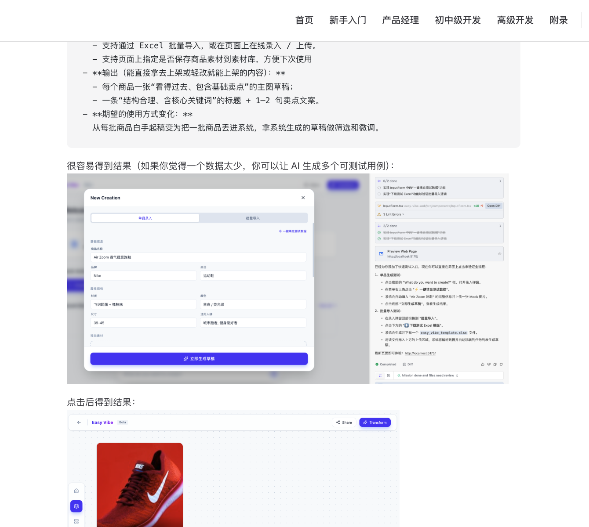
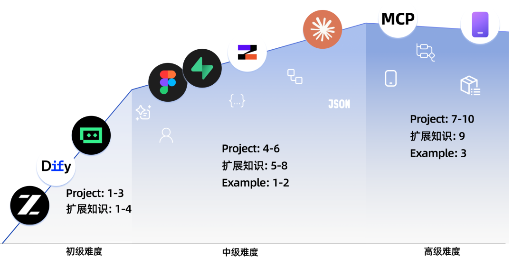

<!-- trigger vercel build -->
<div align="center">

<pre style="font-family: 'Courier New', monospace; font-size: 16px; color: #000000; margin: 0; padding: 0; line-height: 1.2; transform: skew(-1deg, 0deg); display: block;">
███████╗ █████╗ ███████╗██╗   ██╗    ██╗   ██╗██╗██████╗ ███████╗
██╔════╝██╔══██╗██╔════╝╚██╗ ██╔╝    ██║   ██║██║██╔══██╗██╔════╝
█████╗  ███████║███████╗ ╚████╔╝     ██║   ██║██║██████╔╝█████╗  
██╔══╝  ██╔══██║╚════██║  ╚██╔╝      ╚██╗ ██╔╝██║██╔══██╗██╔══╝  
███████╗██║  ██║███████║   ██║        ╚████╔╝ ██║██████╔╝███████╗
╚══════╝╚═╝  ╚═╝╚══════╝   ╚═╝         ╚═══╝  ╚═╝╚═════╝ ╚══════╝</pre>

# Easy-Vibe : Học Vibe Coding từ 0 đến 1

<p align="center">
  📌 <a href="https://datawhalechina.github.io/easy-vibe/">Đọc trực tuyến (Read Online)</a> · ✨ <a href="https://datawhalechina.github.io/easy-vibe/zh-cn/appendix/">Hướng dẫn tương tác</a>
</p>

<p align="center">
  <a href="https://datawhalechina.github.io/easy-vibe/">Đọc trực tuyến</a> ·
  <a href="#-điều-hướng">Bản đồ học tập</a> ·
  <a href="#contact">Cộng đồng</a>
</p>

<p align="center">
    <a href="https://github.com/datawhalechina/easy-vibe/stargazers" target="_blank">
        </a>
    <a href="https://github.com/datawhalechina/easy-vibe/network/members" target="_blank">
        </a>
    <a href="LICENSE" target="_blank">
        </a>
</p>

<p align="center">
  <a href="../zh-CN/README.md"></a>
  <a href="../zh-TW/README.md"></a>
  <a href="../en-US/README.md"></a>
  <a href="../ja-JP/README.md"></a>
  <a href="../es-ES/README.md"></a>
  <a href="../fr-FR/README.md"></a>
  <a href="../tlh/README.md"></a>
  <a href="../ko-KR/README.md"></a>
  <a href="../ar-SA/README.md"></a>
  <a href="../tr-TR/README.md"></a>
  <a href="../vi-VN/README.md"></a>
  <a href="../de-DE/README.md"></a>
  <a href="../bn-BD/README.md"></a>
</p>

</div>
<table align="center">
  <tr>
    <td width="50%" valign="top" align="center">
      
      <br>
      <strong>Bản đồ học tập độc quyền cho người mới bắt đầu</strong>
      <br>
      <sub>Hướng dẫn từ con số 0, lộ trình rõ ràng, tạm biệt việc "học trước quên sau"</sub>
    </td>
    <td width="50%" valign="top" align="center">
      
      <br>
      <strong>Hướng dẫn hình ảnh từng bước</strong>
      <br>
      <sub>Giải thích chi tiết bằng hình ảnh, như có gia sư riêng bên cạnh</sub>
    </td>
  </tr>
</table>

Trong thời đại AI, những người biến ý tưởng thành sản phẩm thường không phải là những người có kỹ thuật mạnh nhất, mà là những người có hành động đầu tiên. **Easy-Vibe ra đời vì điều này.** Chúng tôi sẽ cầm tay chỉ việc cho bạn, từ việc viết dòng code đầu tiên đến việc hiểu logic front-end và back-end, và cuối cùng là đưa sản phẩm của bạn lên mạng.

- **Đối tượng**: Người mới bắt đầu, Quản lý sản phẩm (PM), Lập trình viên Front-end / Back-end / Full-stack
- **Chủ đề**: Lập trình AI, Phát triển ứng dụng Web Full-stack, AI Agent, Workflow và hệ thống RAG

---

Easy-Vibe dẫn dắt bạn từ 0 đến 1 qua các giai đoạn sau:

> Chọn điểm xuất phát theo trình độ của bạn:
> - **Người mới / Product Manager**: Bắt đầu từ Stage 1 để xây dựng tư duy lập trình và thành thạo AI IDE tạo prototype nhanh
> - **Lập trình viên**: Bắt đầu từ Stage 2 để đi sâu vào phát triển full-stack và tích hợp AI
> - **Lập trình viên nâng cao**: Đi thẳng vào Stage 3 để khám phá Claude Code và phát triển đa nền tảng

| Giai đoạn | Kỹ năng cốt lõi | Sản phẩm đầu ra |
| :--- | :--- | :--- |
| **Stage 1** | Bản đồ học tập, Nhập môn lập trình AI, AI IDE, Tư duy sản phẩm, Thiết kế prototype, Tích hợp năng lực AI | Trò chơi tương tác, Prototype sản phẩm hoàn chỉnh |
| **Stage 2** | Phát triển Full-stack, Cơ sở dữ liệu, Tích hợp AI, Triển khai và vận hành | Ứng dụng AI Full-stack sẵn sàng sản xuất |
| **Stage 3** | Claude Code nâng cao, Phát triển đa nền tảng | Ứng dụng đa nền tảng cấp sản xuất |
| **Phụ lục** | Cơ sở máy tính, Nhập môn AI, 9 lĩnh vực kiến thức | Hơn 80 chuyên đề tương tác |

## 🔥 Tin tức

- **[2026-03-02]** 🦞 **Hỗ trợ OpenClaw & AI Agents**: Đã thêm file điều hướng AI `llms.txt`, cho phép OpenClaw, Claude, Cursor, Trae và các AI Agents khác nhanh chóng hiểu cấu trúc repository và định vị chính xác nội dung hướng dẫn. Chúc mỗi 🦞 có trải nghiệm học tập thú vị!
- **[2026-03-01]** [Phần phát triển nâng cao](https://datawhalechina.github.io/easy-vibe/zh-cn/stage-3/) đã được nâng cấp toàn diện: Thêm bảy hướng dẫn chi tiết về Claude Code (MCP, Skills, Agent Teams, v.v.) và tám bài học phát triển đa nền tảng (PWA, Electron, NFT, tiện ích VS Code, ứng dụng công nghiệp Qt, v.v.).
- **[2026-02-25]** Đã cập nhật [Cơ sở kiến thức phụ lục](https://datawhalechina.github.io/easy-vibe/zh-cn/appendix/), bao gồm 9 lĩnh vực kiến thức và hơn 80 chuyên đề tương tác.

<details>
<summary>Tin tức trước đó</summary>

- **[2026-01-16]** Tái cấu trúc dự án, chính thức thành lập chương "Giới thiệu cho người mới bắt đầu", giảm rào cản.
- **[2026-01-14]** Cập nhật toàn diện tài liệu Stage 1 "Xây dựng prototype sản phẩm".
- **[2026-01-13]** Hoàn thành xây dựng lại kiến trúc tài liệu, hỗ trợ đa ngôn ngữ đầy đủ (i18n).
- **[2026-01-01]** Ra mắt bản đồ học tập chính của dự án.
</details>

### 📖 Điều hướng

<div align="center">
  
</div>

### 📚 Cơ sở kiến thức phụ lục

<table>
  <tr>
    <td valign="top" width="33%">
      <strong>💻 Cơ sở máy tính</strong><br><br>
      • <a href="https://datawhalechina.github.io/easy-vibe/zh-cn/appendix/1-computer-fundamentals/transistor-to-cpu.html">Từ Transistor đến CPU</a><br>
      • <a href="https://datawhalechina.github.io/easy-vibe/zh-cn/appendix/1-computer-fundamentals/operating-systems.html">Hệ điều hành</a><br>
      • <a href="https://datawhalechina.github.io/easy-vibe/zh-cn/appendix/1-computer-fundamentals/data-encoding-storage.html">Mã hóa, lưu trữ và truyền dữ liệu</a><br>
      • <a href="https://datawhalechina.github.io/easy-vibe/zh-cn/appendix/1-computer-fundamentals/computer-networks.html">Mạng máy tính: Hai máy nói chuyện như thế nào</a><br>
      • <a href="https://datawhalechina.github.io/easy-vibe/zh-cn/appendix/1-computer-fundamentals/data-structures.html">Cấu trúc dữ liệu</a><br>
      • <a href="https://datawhalechina.github.io/easy-vibe/zh-cn/appendix/1-computer-fundamentals/algorithm-thinking.html">Giới thiệu về tư duy thuật toán</a>
    </td>
    <td valign="top" width="33%">
      <strong>🔧 Công cụ phát triển</strong><br><br>
      • <a href="https://datawhalechina.github.io/easy-vibe/zh-cn/appendix/2-development-tools/git-version-control.html">Git: Máy thời gian của code</a><br>
      • <a href="https://datawhalechina.github.io/easy-vibe/zh-cn/appendix/2-development-tools/command-line-shell.html">Dòng lệnh và Shell scripts</a><br>
      • <a href="https://datawhalechina.github.io/easy-vibe/zh-cn/appendix/2-development-tools/ide-vscode.html">IDE và VS Code</a><br>
      • <a href="https://datawhalechina.github.io/easy-vibe/zh-cn/appendix/2-development-tools/browser-devtools.html">Công cụ phát triển trình duyệt</a><br>
      • <a href="https://datawhalechina.github.io/easy-vibe/zh-cn/appendix/2-development-tools/package-managers.html">Quản lý packages</a>
    </td>
    <td valign="top" width="33%">
      <strong>💡 Lập trình Web</strong><br><br>
      • <a href="https://datawhalechina.github.io/easy-vibe/zh-cn/appendix/3-web-programming/html-css-basics.html">HTML & CSS</a><br>
      • <a href="https://datawhalechina.github.io/easy-vibe/zh-cn/appendix/3-web-programming/javascript-basics.html">JavaScript</a><br>
      • <a href="https://datawhalechina.github.io/easy-vibe/zh-cn/appendix/3-web-programming/dom-manipulation.html">Thao tác DOM</a><br>
      • <a href="https://datawhalechina.github.io/easy-vibe/zh-cn/appendix/3-web-programming/fetch-api-async.html">Fetch API và lập trình bất đồng bộ</a><br>
      • <a href="https://datawhalechina.github.io/easy-vibe/zh-cn/appendix/3-web-programming/vue-react-frameworks.html">Frameworks (Vue/React)</a>
    </td>
  </tr>
</table>

### I. Khởi đầu từ số không

| Chương | Nội dung chính | Trạng thái |
| :----------------------------------------------------------------------------------------------- | :------------------------------------------------ | :--- |
| [Lời nói đầu: Bản đồ học tập](../../docs/zh-cn/stage-0/0.1-learning-map/index.md) | Điều hướng lộ trình học tập tổng thể | ✅ |
| [Cấp 1: Kỷ nguyên AI, Nói là lập trình](../../docs/zh-cn/stage-0/0.2-ai-capabilities-through-games/index.md) | Trải nghiệm lập trình AI qua các ví dụ | ✅ |
| [Cấp 2: Tìm kiếm ý tưởng tuyệt vời](../../docs/zh-cn/stage-1/1.0-finding-great-idea/index.md) | Học cách tìm và xác thực ý tưởng sản phẩm | ✅ |
| [Cấp 3: Giới thiệu AI IDE Tools](../../docs/zh-cn/stage-1/1.1-introduction-to-ai-ide/index.md) | Học cách sử dụng IDE, tạo game cục bộ | ✅ |
| [Cấp 4: Xây dựng Prototype thực hành](../../docs/zh-cn/stage-1/1.2-building-prototype/index.md) | Từ phân tích nhu cầu đến prototype | ✅ |
| [Cấp 5: Thêm khả năng AI vào Prototype](../../docs/zh-cn/stage-1/1.3-integrating-ai-capabilities/index.md) | Học cách tích hợp AI (text, image, video) | ✅ |
| [Cấp 6: Thực hành dự án hoàn chỉnh](../../docs/zh-cn/stage-1/1.4-complete-project-practice/index.md) | Mô phỏng kịch bản thực, lặp lại với phản hồi | ✅ |

#### Phụ lục: Tư duy kinh doanh

| Chương | Nội dung chính | Trạng thái |
| :----------------------------------------------------------------------------------------- | :----------------------------------------- | :--- |
| [Phụ lục A: Tư duy sản phẩm và thiết kế giải pháp](../../docs/zh-cn/stage-1/appendix-a-product-thinking/index.md) | Khung tư duy khi tạo sản phẩm | ✅ |
| [Phụ lục B: Các kịch bản ứng dụng AI (B2B)](../../docs/zh-cn/stage-1/appendix-industry-scenarios/index.md) | Ứng dụng AI trong các ngành công nghiệp khác nhau | ✅ |
| [Phụ lục C: Cảm hứng kịch bản người tiêu dùng AI (B2C)](../../docs/zh-cn/stage-1/appendix-c-consumer-scenarios/index.md) | Khám phá ứng dụng AI trong sản phẩm người tiêu dùng | ✅ |

#### Phụ lục: Giải pháp kỹ thuật

| Chương | Nội dung chính | Trạng thái |
| :----------------------------------------------------------------------------------------- | :----------------------------------------- | :--- |
| [Phụ lục D: Khi gặp lỗi phải làm gì](../../docs/zh-cn/stage-1/appendix-b-common-errors/index.md) | Lỗi phổ biến trong vibe coding | ✅ |
| [Phụ lục E: So sánh 7 công cụ lập trình AI](../../docs/zh-cn/stage-1/appendix-articles/example0-1/vibe-coding-tools-snake-game-tutorial.md) | So sánh các nền tảng AI chính | ✅ |
| [Phụ lục F: Thiết kế trang web với agents thiết kế và lập trình](../../docs/zh-cn/stage-1/appendix-articles/example0-2/vibe-coding-tools-build-website-with-ai-coding-and-design-agents.md) | Hợp tác đa agent | ✅ |

<details>
<summary><strong>II. Lập trình viên trung cấp</strong></summary>

#### Front-end

| Chương | Nội dung chính | Trạng thái |
| :------------------------------------------------------------------------------------------------------------------------- | :--------------------------------------------------------------------------- | :--- |
| [Front-end 0: Assets với Lovart](../../docs/zh-cn/stage-2/frontend/2.0-lovart-assets/) | Tạo tài sản hình ảnh số lượng lớn | 🚧 |
| [Front-end 1: Giới thiệu Figma & MasterGo](../../docs/zh-cn/stage-2/frontend/2.1-figma-mastergo/) | Tổ chức kiến trúc thông tin và cấu trúc trang | 🚧 |
| [Front-end 2: Xây dựng ứng dụng hiện đại đầu tiên - UI Design](../../docs/zh-cn/stage-2/frontend/2.2-ui-design/) | Quy trình thiết kế đến code với components | 🚧 |
| [Front-end 3: UI Design Specs & Multi-product UI](../../docs/zh-cn/stage-2/frontend/2.3-multi-product-ui/) | Thiết kế hệ thống đa sản phẩm | 🚧 |
| [Front-end 4: Hogwarts Portraits cùng nhau](../../docs/zh-cn/stage-2/frontend/2.4-hogwarts-portraits/chapter4-lets-build-hogwarts-portraits.md) | Xây dựng ứng dụng front-end với AI từ đầu | ✅ |

#### Back-end & Full-stack

| Chương | Nội dung chính | Trạng thái |
| :-------------------------------------------------------------------------------------------------------------------------------------------------------- | :------------------------------------------------------------ | :--- |
| [Back-end 1: API là gì](../../docs/zh-cn/stage-2/backend/2.1-what-is-api/extra2/extra2-what-is-api.md) | Hiểu HTTP và mô hình request/response | ✅ |
| [Back-end 2: Từ Database đến Supabase](../../docs/zh-cn/stage-2/backend/2.2-database-supabase/chapter5/chapter5-from-database-to-supabase.md) | Triển khai DB và API trên Supabase | ✅ |
| [Back-end 3: Sinh mã và tài liệu API với AI](../../docs/zh-cn/stage-2/backend/2.3-ai-interface-code/) | Tạo tài liệu và mã với AI | 🚧 |
| [Back-end 4: Git Workflow](../../docs/zh-cn/stage-2/backend/2.4-git-workflow/extra1/extra1-what-is-git-and-what-is-github.md) | Quản lý phiên bản và cộng tác Git | ✅ |
| [Back-end 5: Triển khai trên Zeabur](../../docs/zh-cn/stage-2/backend/2.5-zeabur-deployment/extra6/extra6-zeabur-what-is-it-and-how-to-deploy-web-applications.md) | Triển khai ứng dụng lên Zeabur | ✅ |
| [Back-end 6: Công cụ CLI hiện đại](../../docs/zh-cn/stage-2/backend/2.6-modern-cli/extra7/extra7-cli-ai-coding-tools-and-the-principles-of-test-driven-development.md) | Tăng tốc phát triển với CLI AI | ✅ |
| [Back-end 7: Tích hợp hệ thống thanh toán như Stripe](../../docs/zh-cn/stage-2/backend/2.7-stripe-payment/) | Tích hợp thanh toán và thanh toán | 🚧 |
| [Dự án 1: Ứng dụng hiện đại đầu tiên - App Full-stack](../../docs/zh-cn/stage-2/assignments/2.1-fullstack-app/) | Hoàn thành ứng dụng web full-stack | 🚧 |
| [Dự án 2: Thư viện UI hiện đại + Thực hành Trae](../../docs/zh-cn/stage-2/assignments/2.2-modern-frontend-trae/) | Sản phẩm độc lập với auth và thanh toán | 🚧 |

#### Phụ lục Năng lực AI

| Chương | Nội dung chính | Trạng thái |
| :--------------------------------------------------------------------------------------------------------------------------------------------------------------------------- | :------------------------------------------------------------- | :--- |
| [AI 1: Giới thiệu Dify & Tích hợp Knowledge Base](../../docs/zh-cn/stage-2/ai-capabilities/2.1-dify-knowledge-base/chapter3/chapter3-getting-started-with-dify-and-its-knowledge-base-integration.md) | Xây dựng sản phẩm tiện ích với Dify & RAG | ✅ |
| [AI 2: Từ điển AI & APIs đa phương thức](../../docs/zh-cn/stage-2/ai-capabilities/2.2-multimodal-api/extra3/extra3-ai-capability-starter-handbook.md) | Tìm kiếm models/APIs và tích hợp đa phương thức | 🚧 |

</details>

<details>
<summary><strong>III. Lập trình viên nâng cao</strong></summary>

#### Kỹ năng cốt lõi Claude Code

| Chương | Nội dung chính | Trạng thái |
| :------------------------------------------------------------------------------------------------------------------- | :----------------------------------------------------------- | :--- |
| [Khởi đầu nhanh Claude Code](../../docs/zh-cn/stage-3/core-skills/basics/) | Cài đặt, thao tác cơ bản, tips và commands | ✅ |
| [Hướng dẫn đầy đủ Claude Code MCP](../../docs/zh-cn/stage-3/core-skills/mcp/) | Kết nối Claude Code với GitHub, DB, APIs qua MCP | ✅ |
| [Hướng dẫn đầy đủ Claude Code Skills](../../docs/zh-cn/stage-3/core-skills/skills/) | Đóng gói kiến thức thành skill packs có thể tái sử dụng | ✅ |
| [Best practices workflow Claude Code](../../docs/zh-cn/stage-3/core-skills/workflow/) | Best practices cho dev hàng ngày, refactoring, code review | ✅ |
| [Hướng dẫn đầy đủ Claude Agent Teams](../../docs/zh-cn/stage-3/core-skills/agent-teams/) | Cộng tác đa AI như một đội dev thực sự | ✅ |
| [Claude Code Superpowers phát triển engineering](../../docs/zh-cn/stage-3/core-skills/superpowers/) | Viết code chất lượng engineering với TDD | ✅ |
| [Làm thế nào để Claude Code chạy lâu](../../docs/zh-cn/stage-3/core-skills/long-running-tasks/) | Thiết kế nhiệm vụ dài hạn cho công việc liên tục | ✅ |

#### Phát triển đa nền tảng

| Chương | Nội dung chính | Trạng thái |
| :------------------------------------------------------------------------------------------------------------------- | :----------------------------------------------------------- | :--- |
| [Cách xây dựng Mini Program WeChat](../../docs/zh-cn/stage-3/cross-platform/3.3-wechat-miniprogram/) | Hệ sinh thái mini program, từ template đến ra mắt | ✅ |
| [Cách xây dựng Mini Program WeChat với Back-end](../../docs/zh-cn/stage-3/cross-platform/3.4-wechat-miniprogram-backend/) | Tích hợp DB và logic back-end | ✅ |
| [Phát triển ứng dụng Android](../../docs/zh-cn/stage-3/cross-platform/3.5-android-app/) | Phát triển Android thống nhất Web/Native với Expo | ✅ |
| [Phát triển ứng dụng iOS](../../docs/zh-cn/stage-3/cross-platform/3.6-ios-app/) | Phát triển iOS thống nhất Web/Native với Expo | ✅ |
| [Cách xây dựng website cá nhân và blog học thuật](../../docs/zh-cn/stage-3/personal-brand/3.7-personal-website-blog/) | Từ chọn tech đến deploy, xây dựng trang cá nhân | ✅ |
| [Phát triển PWA](../../docs/zh-cn/stage-3/cross-platform/3.8-pwa-local-app/) | Xây dựng Progressive Web Apps với hỗ trợ offline | 🚧 |
| [Phát triển AI browser extension](../../docs/zh-cn/stage-3/cross-platform/3.9-browser-ai-extension/) | Phát triển Chrome extensions để tóm tắt trang | 🚧 |
| [Phát triển ứng dụng Electron desktop](../../docs/zh-cn/stage-3/cross-platform/3.10-electron-voice-to-text/) | Xây dựng ứng dụng desktop nhận dạng giọng nói | 🚧 |
| [Cách phát triển và đúc NFT nhanh](../../docs/zh-cn/stage-3/cross-platform/3.11-nft-minting/) | Viết smart contracts, deploy lên testnet Ethereum | 🚧 |
| [Phát triển VS Code extensions](../../docs/zh-cn/stage-3/cross-platform/3.12-vscode-extension/) | Phát triển extensions cho AI project assistants | 🚧 |
| [Phát triển ứng dụng Qt công nghiệp](../../docs/zh-cn/stage-3/cross-platform/3.13-qt-industrial-hmi/) | Xây dựng HMI giám sát bơm công nghiệp với Qt | 🚧 |

#### Phụ lục Năng lực AI nâng cao

| Chương | Nội dung chính | Trạng thái |
| :--------------------------------------------------------------------------------------------------------------------------------------------------------------------------- | :------------------------------------------------------------- | :--- |
| [RAG là gì và hoạt động như thế nào](../../docs/zh-cn/stage-3/ai-advanced/3.a1-rag-introduction/) | Hiểu RAG và các kiến trúc phổ biến | ✅ |
| [RAG trung cấp và điều phối workflow: LangGraph](../../docs/zh-cn/stage-3/ai-advanced/3.a2-langgraph-advanced-rag/) | Thiết kế workflow đa bước và hệ thống RAG nâng cao | 🚧 |

</details>

## 🛠️ Cách học

- Chọn các chương để đọc và thực hành theo cấp độ của bạn. Đừng ngần ngại mở issue để hỏi câu hỏi.

## 💻 Thiết lập cục bộ

### Cách hiện đại

Trong AI IDE (VS Code, Cursor, Trae, v.v.), sử dụng prompt sau:

```
Vui lòng giúp tôi chạy dịch vụ cục bộ của dự án này.
```

### Cách truyền thống

1. npm install
2. npm run dev
3. Mở `http://localhost:3000` trong trình duyệt của bạn.

## 🤝 Đóng góp

- Nếu bạn gặp vấn đề hoặc có đề xuất, vui lòng mở Issue.
- Để đóng góp, vui lòng gửi Pull Request.
- Nếu bạn muốn bắt đầu dự án mới với Datawhale, hãy làm theo [Hướng dẫn dự án mã nguồn mở Datawhale](https://github.com/datawhalechina/DOPMC/blob/main/GUIDE.md).

## 🙏 Cảm ơn

- [Sanbu - Trưởng nhóm dự án](https://github.com/sanbuphy) (Thành viên Datawhale)
- Fang Ke - Cố vấn (Thành viên Datawhale, Đại học Thanh Hoa)
- [Yerim Kang](https://github.com/yerim25) (Dự án thực hành - Đại học Thanh Hoa)
- Zhao Zhilin (Dự án thực hành - Đại học Thanh Hoa)
- [Li Yixuan](https://yixuan20.github.io/) (Thiết kế thị giác - Đại học Thanh Hoa)
- Liu Siyi (Dự án thực hành - Đại học Thanh Hoa)
- Tất cả beta testers trong nhóm AI Vibe Coding 101 đã đóng góp ý kiến.

### Cảm ơn đặc biệt

- Cảm ơn [@Sm1les](https://github.com/Sm1les) đã hỗ trợ và giúp đỡ.
- Cảm ơn tất cả những người đóng góp và tất cả những người đã thêm sao vào dự án này ❤️

*(Xem chi tiết trong tài liệu trực tuyến hoặc repo chính)*
