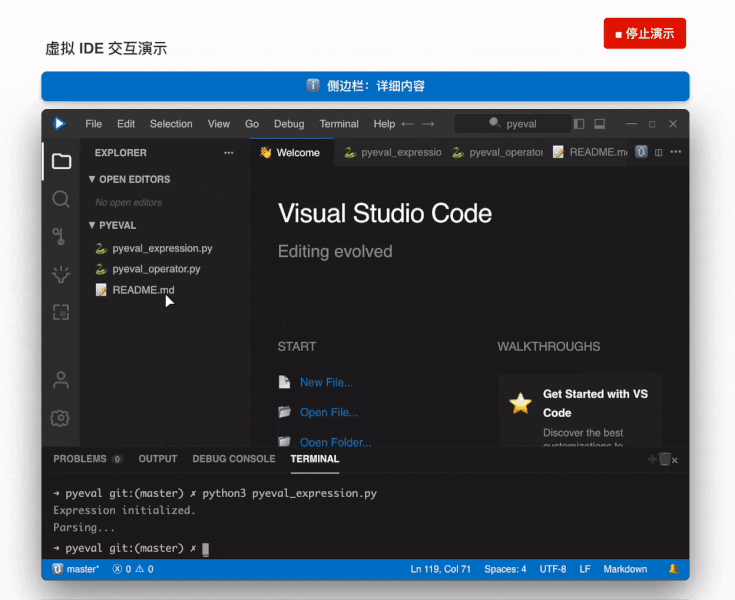

<!-- trigger vercel build -->

  直接上手，一起 vibe ！会说话就会做应用 
  Jump right in and vibe together — if you can talk, you can build apps.

  🚀 <a href="https://datawhalechina.github.io/easy-vibe/welcome.html">开始体验</a> · ✨ <a href="https://datawhalechina.github.io/easy-vibe/zh-cn/appendix/">交互式教程</a> · 🦞 <a href="https://github.com/datawhalechina/hello-claw">还想学 OpenClaw</a> 
  <a href="https://datawhalechina.github.io/easy-vibe/welcome.html">Start Experience</a> · <a href="https://datawhalechina.github.io/easy-vibe/en/appendix/">Interactive Tutorial</a> · <a href="https://github.com/datawhalechina/hello-claw">Learn OpenClaw</a>

  <a href="https://datawhalechina.github.io/easy-vibe/welcome.html">在线阅读</a> ·
  <a href="#-内容导航">学习地图</a> ·
  <a href="#contact">社区交流</a> 
  
    <a href="https://datawhalechina.github.io/easy-vibe/welcome.html">Read Online</a> ·
    <a href="#-content-navigation">Learning Map</a> ·
    <a href="#contact">Community</a>
  

    
    
    

  
  
  
  
  
  
  
  
  
  

<table align="center">
  <tr>
    <td width="50%" valign="top" align="center">
      
       
      <strong>新手专属学习地图</strong>
       
      零基础专属指引，清晰规划路径，告别“学了忘”
    </td>
    <td width="50%" valign="top" align="center">
      
       
      <strong>手把手图文教程</strong>
       
      保姆级图文详解，如同私教在旁，跟着做就能学会
    </td>
  </tr>
  <tr>
    <td width="50%" valign="top" align="center">
      
       
      <strong>沉浸式模拟编程</strong>
       
      虚拟鼠标自动导览，带你快速上手 IDE 核心用法
    </td>
    <td width="50%" valign="top" align="center">
      
       
      <strong>看得见的 AI 原理</strong>
       
      算法原理动画化，一眼看懂 AI 如何“画”出图片
    </td>
  </tr>
  <tr>
    <td width="50%" valign="top" align="center">
      
       
      <strong>像玩游戏一样学 RAG</strong>
       
      独家交互组件，点击即可看清 RAG 数据流向
    </td>
    <td width="50%" valign="top" align="center">
      
       
      <strong>可视化终端原理</strong>
       
      命令行操作可视化，直观展示后台逻辑与原理
    </td>
  </tr>
</table>

  <h3>⭐ 欢迎 <a href="https://github.com/datawhalechina/easy-vibe" style="color: #d0cd16ff;">点击此处Star</a> 加速更新 ❤️</h3>

最新中文内容请以仓库根目录的 [README](../../README.md) 为准；此文件用于多语言入口中的简体中文版本。
