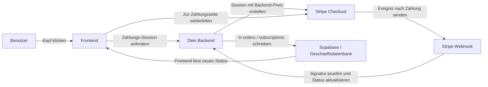
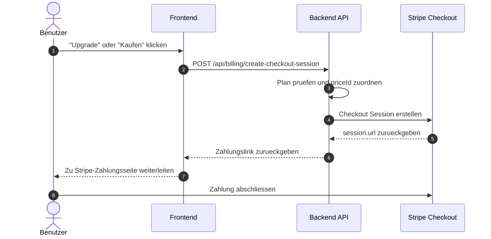
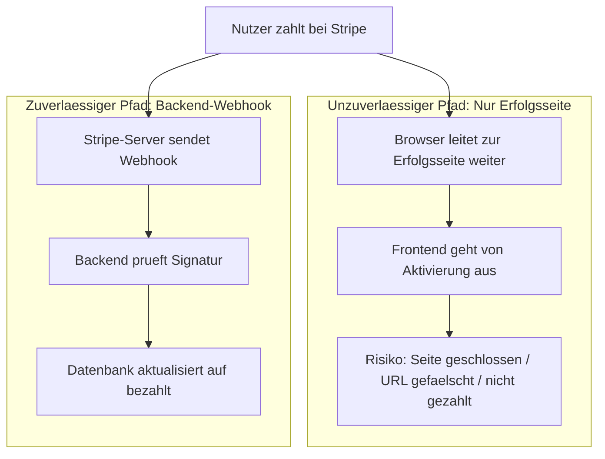
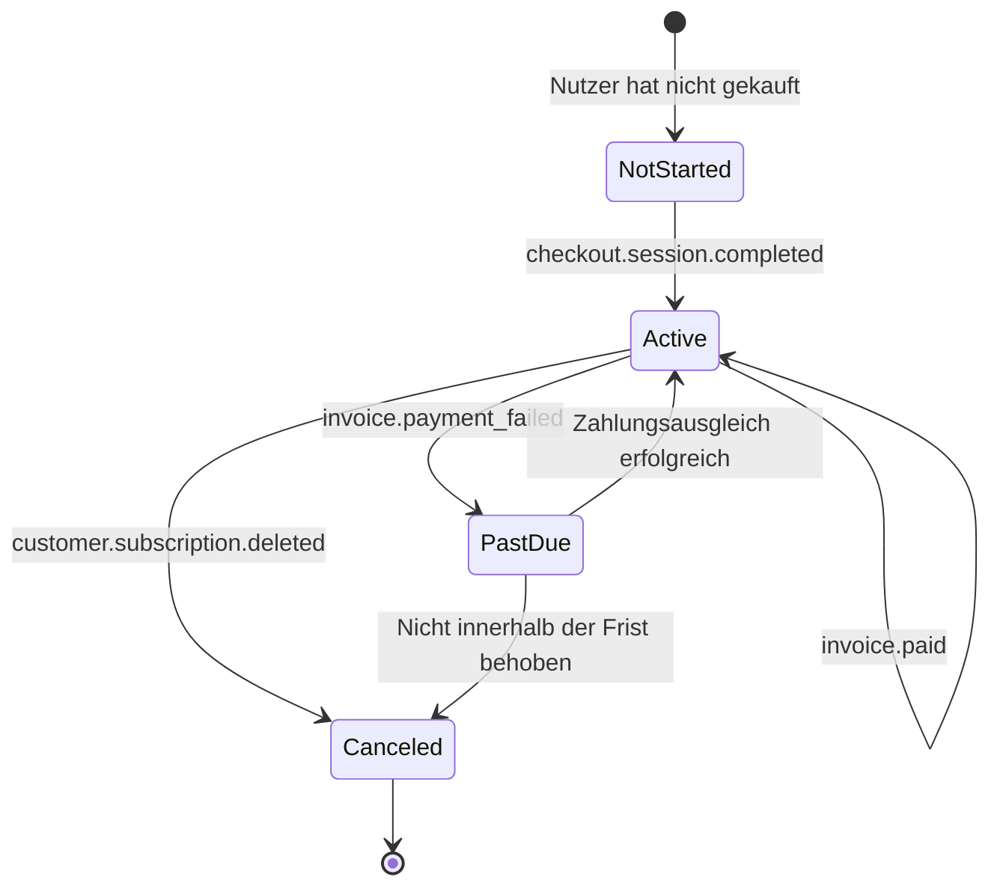

# Stripe und andere Zahlungssysteme integrieren

Wenn dein Produkt bereits Seiten, Login, Datenbank und ein grundlegendes Backend hat, ist die naechste praktische Frage: **Wie nimmst du Zahlungen entgegen?**

Dieser Artikel ist in zwei Teile gegliedert:
- **Der erste Teil** behandelt nur die praktischste Grundeinbindung mit dem Ziel, Stripe schnell in dein Projekt zu integrieren.
- **Der zweite Teil** (Anhang) enthaelt Webhook-Details, Abo-Ereignisse und regionale Zahlungsunterschiede.

> Empfohlene Vorkenntnisse
> - [Von der Datenbank zu Supabase](../database-supabase/)
> - [Grosses Sprachmodell unterstuetzt beim Schreiben von API-Code](../ai-interface-code/)
> - [Web-Anwendungen bereitstellen](../zeabur-deployment/)

# Was du lernen wirst

1. Wie sieht ein minimal funktionsfaehiges Zahlungssystem aus?
2. Wie du Stripe schnellstmöglich in dein Projekt integrierst.
3. Wie du Prompts schreibst, damit die KI dir das Zahlungssystem hinzufuegt.
4. Welche Zahlungsloesung fuer verschiedene Regionen Prioritaet haben sollte.

---

# Teil 1: Grundlagen

## 1. Drei Grundprinzipien merken

1. **Preise muessen vom Backend bestimmt werden**, nicht vom Frontend.
2. **Berechtigungen werden durch Webhooks aktiviert**, nicht durch die Erfolgsseite.
3. **Deine eigene Datenbank muss den Zahlungsstatus speichern**, nicht nur Stripe.

## 2. Was passiert, wenn das Frontend direkt mit Stripe kommuniziert?

Wenn du echtes Geld einnehmen willst, ist dieser Ansatz gefaehrlich:
1. **Preise koennen leicht geaendert werden** - Browser-Anfragen koennen manipuliert werden.
2. **Sensible Informationen werden leicht preisgegeben** - Geheime Schluessel gehoeren nicht ins Frontend.
3. **Du kannst nicht zuverlaessig bestaetigen, ob die Zahlung erfolgreich war**.
4. **Datenbankstatus wird unordentlich**.

Die sicherere Aufteilung:
- **Frontend**: Buttons anzeigen, Kauf initiieren, Seiten weiterleiten
- **Backend**: Preise bestimmen, Checkout-Sessions erstellen, Webhooks empfangen, Datenbank aktualisieren

::: info In einem Satz
**Das Frontend kann Weiterleitungen uebernehmen, aber das Backend muss Preisgestaltung und Bestaetigung kontrollieren.**
:::

## 3. Wann ist Stripe die richtige Wahl?

- SaaS fuer internationale Nutzer
- Abo-basierte Mitgliedschaftsprodukte
- Digitale Produkte, Templates, KI-Guthabenpakete
- Schnelle kommerzielle Validierung

## 4. Minimale funktionsfaehige Zahlungskette



## 5. Standard-Zeitachse fuer die Zahlungsinitiierung



## 6. Schnellstart

### 6.1 Schritt 1: Produkte und Preise im Stripe-Dashboard erstellen

In Stripes Modell:
- **Product** beschreibt, was du verkaufst (z. B. "Pro-Mitgliedschaft")
- **Price** beschreibt, wie viel es kostet und in welchem Zyklus (z. B. "9,90 USD/Monat")

Oeffne diese Seiten:
- Stripe Dashboard: [Dashboard Login](https://dashboard.stripe.com/login)
- Produktdokumentation: [Manage products and prices](https://docs.stripe.com/products-prices/manage-prices)

Arbeite im **Testmodus**.

Minimale Konfiguration:
- `Product`: `Pro Plan`
- `Price 1`: `pro_monthly`
- `Price 2`: `pro_yearly`

Merke dir die `price_id` Werte.

Prompt fuer die KI:

```text
Ich verwende Stripe zum ersten Mal. Bitte fuehre mich Schritt fuer Schritt durch die grundlegende Zahlungs-Konfiguration im Stripe-Dashboard.

Bitte beziehe dich auf diese offiziellen Dokumente:
- https://docs.stripe.com/products-prices/manage-prices
- https://docs.stripe.com/checkout/quickstart?lang=node
```

### 6.2 Schritt 2: Umgebungsvariablen vorbereiten

Mindestens erforderlich:
- `STRIPE_SECRET_KEY`
- `STRIPE_WEBHOOK_SECRET`
- `STRIPE_PRICE_PRO_MONTHLY`
- `STRIPE_PRICE_PRO_YEARLY`
- `APP_URL`
- `SUPABASE_URL`
- `SUPABASE_SERVICE_ROLE_KEY`

### 6.3 Schritt 3: Checkout Session im Backend erstellen

```text
Bitte integriere Stripe-Zahlungen in mein Projekt.

Beziehe dich auf diese offiziellen Dokumente:
- https://docs.stripe.com/checkout/quickstart?lang=node
- https://docs.stripe.com/api/checkout/sessions/create
- https://docs.stripe.com/payments/subscriptions

Ziele:
- Nutzer klickt auf "Kaufen" und wird zur Stripe-Zahlungsseite weitergeleitet
- Nur monatliche und jaehrliche Plaene
- Preise ueber Backend-Umgebungsvariablen bestimmen
```

### 6.4 Schritt 4: Frontend zur Zahlungsseite weiterleiten

```text
Verbinde den "Kaufen"-Button in meinem Projekt mit Stripe.

Anforderungen:
- Bestehende Seiten nicht aendern, nur die Button-Klick-Logik
- Nach dem Klick Backend-API fuer Zahlungslink aufrufen, dann zu Stripe weiterleiten
- Bei Fehlern eine einfache Meldung anzeigen
```

### 6.5 Schritt 5: Webhook fuer Datenbankaktualisierung

::: info Warum dieser Schritt der wichtigste ist
Viele glauben, dass es reicht, wenn der Nutzer zur Erfolgsseite weitergeleitet wird. Das stimmt nicht. Wichtig ist: **Hat Stripe das Ereignis offiziell an deinen Webhook gesendet und hat dein Backend den Datenbankstatus erfolgreich aktualisiert?**
:::

```text
Bitte integriere die automatische Aktivierung nach erfolgreicher Stripe-Zahlung.

Beziehe dich auf:
- https://docs.stripe.com/webhooks
- https://docs.stripe.com/stripe-cli

Ziel:
- Nach der Zahlung nicht nur zur Erfolgsseite weiterleiten
- Sondern den Mitgliedschaftsstatus in der Datenbank auf "aktiv" setzen
```

## 7. Prompt fuer die schnelle KI-Integration

```text
Bitte integriere Stripe-Zahlungen in mein Projekt fuer eine einfachste funktionierende Mitgliedschaft.

Anforderungen:
1. Ich bin Anfaenger - bitte analysiere zuerst das Projekt, bevor du Code aenderst.
2. Nur die einfachste Version: monatlicher und jaehrlicher Plan.
3. Nach dem Klick auf "Kaufen" Weiterleitung zur Stripe-Zahlungsseite.
4. Nach erfolgreicher Zahlung wird der Mitgliedschaftsstatus in der Datenbank aktiviert.
5. Keine komplexen Funktionen wie Coupons, Upgrades/Downgrades etc.
```

## 8. Die 4 haeufigsten Fehler

1. **Die Erfolgsseite als Zahlungsbestaetigung betrachten** - Nur Webhooks sind massgebend.
2. **Das Frontend sendet den Betrag** - Schwere Preismanipulationsgefahr.
3. **Webhook-Route wird von `express.json()` vorab verarbeitet** - Stripe braucht den rohen Anforderungskoerper.
4. **Keine Idempotenz-Behandlung** - Webhooks koennen wiederholt werden.

## 9. Auswahlberatung in einem Satz

| Hauptnutzer | Zunaechst ausprobieren |
| :--- | :--- |
| Internationale SaaS | Stripe |
| Festland-China | Alipay / WeChat Pay |
| Hongkong oder grenzueberschreitende Teams | Stripe + lokale Wallet/FPS |

## 10. Zusammenfassung

Du hast nun die grundlegendste und wichtigste Zahlungskette gemeistert:

1. Frontend initiiert Kauf.
2. Backend erstellt Checkout Session.
3. Nutzer zahlt auf der Stripe-Seite.
4. Stripe benachrichtigt das Backend per Webhook.
5. Backend aktualisiert die Datenbank.
6. Frontend zeigt nach Aktualisierung den neuen Mitgliedschafts- oder Bestellstatus.

---

# Anhang

## Anhang A: Die haeufigsten Stripe-Objekte

| Objekt | Funktion | Vergleichbar mit |
| :--- | :--- | :--- |
| `Product` | Beschreibt, was verkauft wird | Produkt oder Mitgliedschaftsplan |
| `Price` | Beschreibt Preis und Abrechnungszyklus | Monatlich, jaehrlich, Einmalkauf |
| `Checkout Session` | Von Stripe verwalteter Zahlungsprozess | Zahlungsseite |
| `Subscription` | Periodisches Abonnementverhaeltnis | Automatische Verlaengerung |
| `Customer` | Zahlender Benutzer | Kundenprofil bei Stripe |
| `Webhook` | Asynchrone Benachrichtigung | Stripe teilt dir den Zahlungsstatus mit |

## Anhang B: Warum die Erfolgsseite nicht gleich Zahlungserfolg bedeutet



**Kernunterschied:**

| | Erfolgsseiten-Weiterleitung | Webhook-Benachrichtigung |
| :--- | :--- | :--- |
| Wer initiiert es? | Benutzer-Browser | Stripe-Server |
| Faelschbar? | Ja, URL direkt aufrufen | Nein, Signaturpruefung |
| Garantiert Zahlungserfolg? | Nein | Ja |

### Richtiger Ansatz

```javascript
// Falsch: Auf Erfolgsseite direkt aktivieren
if (window.location.pathname === '/success') {
  activateMembership(); // Gefaehrlich!
}

// Richtig: Immer Backend abfragen
async function checkStatus() {
  const response = await fetch('/api/user/status');
  const data = await response.json();
  if (data.paymentStatus === 'paid') {
    showMemberFeatures();
  } else {
    showPendingMessage();
  }
}
```

## Anhang C: Wichtigste Abonnement-Ereignisse

| Ereignis | Bedeutung | Typische Aktion |
| :--- | :--- | :--- |
| `checkout.session.completed` | Erste Aktivierung erfolgreich | Lokalen Abonnement-Datensatz erstellen |
| `invoice.paid` | Automatische Verlaengerung erfolgreich | Gueltigkeit verlaengern |
| `invoice.payment_failed` | Automatische Abbuchung fehlgeschlagen | Risikostatus markieren |
| `customer.subscription.deleted` | Abonnement gekuendigt | Berechtigungen entziehen |

### Abonnementstatus-Diagramm



## Anhang D: Andere Zahlungsloesungen

### 1. Festland-China

**Alipay** und **WeChat Pay** sind die erste Wahl.

Beide nutzen das "Zahlungsgateway"-Modell: Backend bestellt, Frontend ruft auf, Backend benachrichtigt.

### 2. Hongkong

Empfohlene Kombination: **Stripe** fuer internationale Karten und Abos + **Airwallex** oder **Adyen** fuer lokale Wallets und FPS.

### 3. International / SaaS

- **Stripe**: Beste API-Erfahrung, klare Dokumentation
- **PayPal**: Ergaenzender Kanal fuer internationale Geschaefte
- **Paddle**: Merchant of Record (MoR) - behandelt globale Steuern
- **Lemon Squeezy**: MoR, besonders fuer Indie-Entwickler und digitale Produkte

### 4. Unternehmensloesungen

- **Airwallex**: Zahlungsgateway + globale Konten
- **Adyen**: Unternehmensklasse, verarbeitet Billionen Euro jaehrlich

### 5. Loesungsvergleich

| Loesung | Geschaeftsmodell | Steuerbehandlung | Fuer wen |
| :--- | :--- | :--- | :--- |
| Stripe | Zahlungsgateway | Selbst behandeln | Internationale SaaS, Entwickler |
| PayPal | Zahlungsgateway | Selbst behandeln | Ergaenzender internationaler Kanal |
| Paddle | MoR | Paddle behandelt | B2B SaaS, die keine Steuern verwalten wollen |
| Lemon Squeezy | MoR | LS behandelt | Indie-Entwickler, digitale Produkte |
| Adyen | Zahlungsgateway | Selbst behandeln | Grossunternehmen |
| Airwallex | Gateway + Konten | Selbst behandeln | Grenzueberschreitende Geschaefte |
| Alipay/WeChat | Zahlungsgateway | Selbst behandeln | Festland-China |

### 6. Nach Region auswaehlen

| Dein Markt | Empfohlene Loesung |
| :--- | :--- |
| Festland-China | Alipay / WeChat Pay |
| Hongkong | Stripe + Airwallex / Adyen |
| Internationale SaaS | Stripe (selbst) oder Paddle (MoR) |
| Digitale Produkte (international) | Stripe / Lemon Squeezy / Paddle |
| Multi-Region Unternehmen | Adyen / Airwallex / Stripe Kombination |
