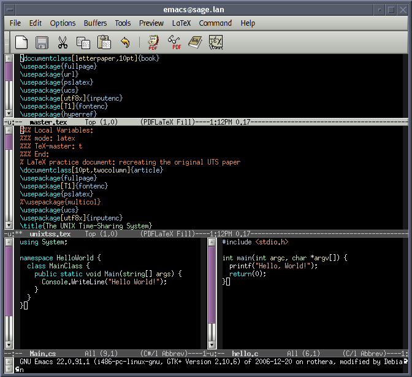
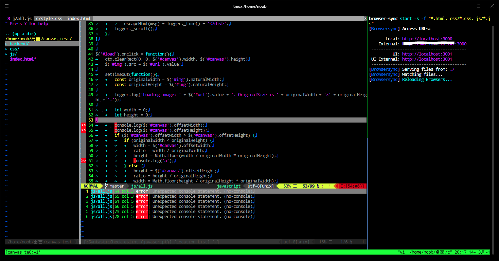
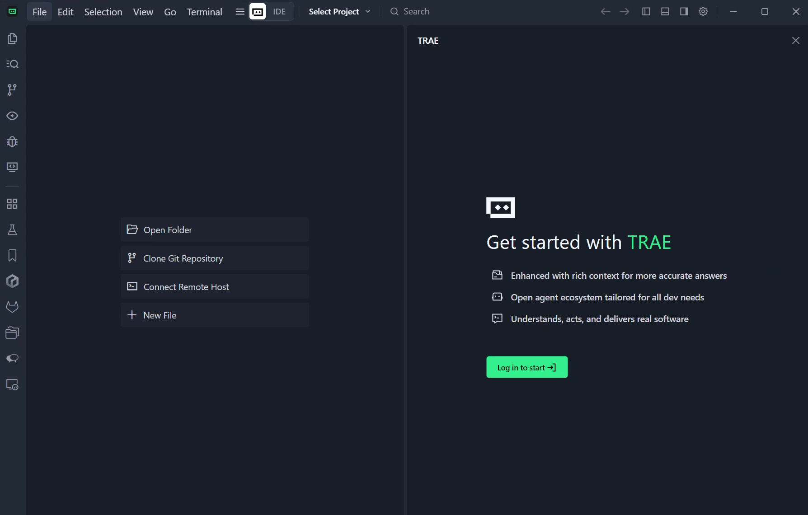
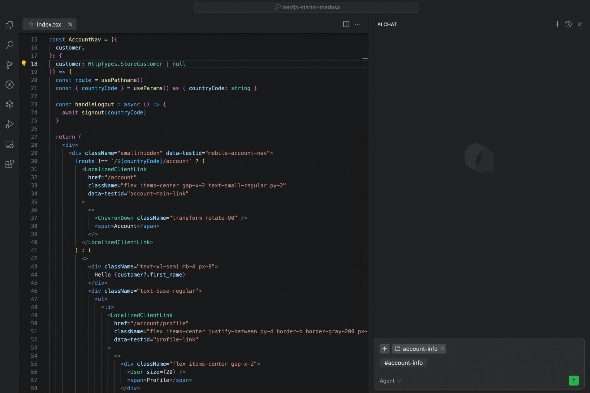
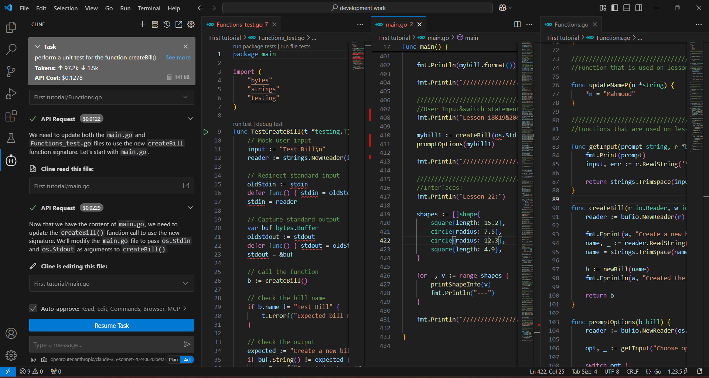
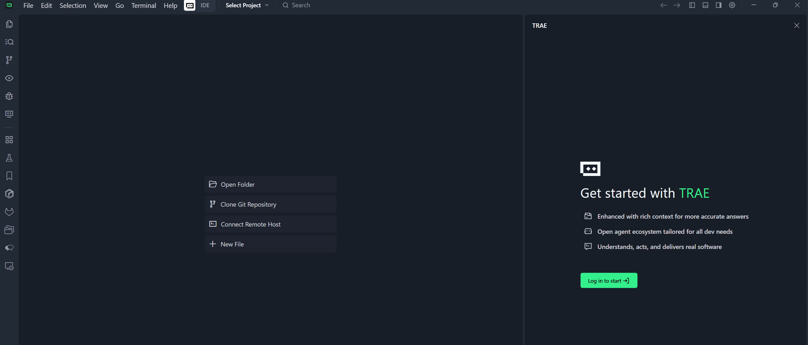
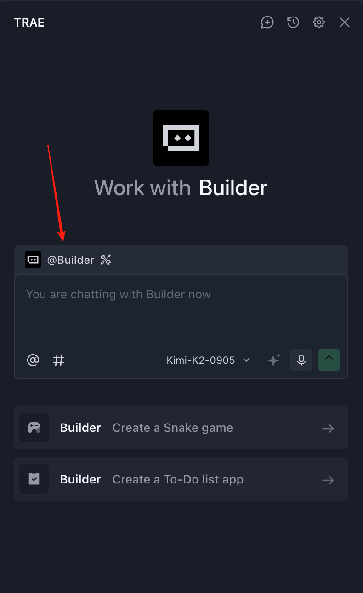
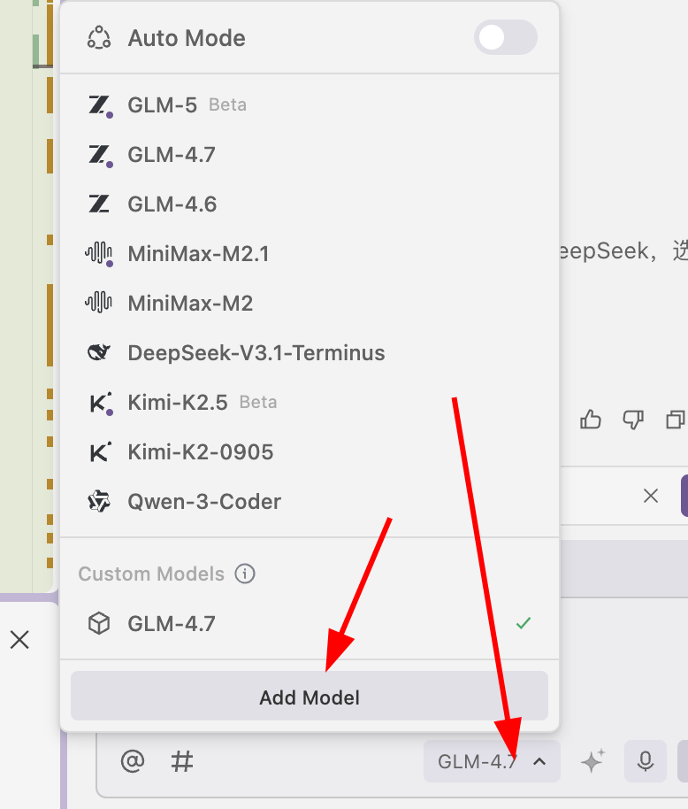
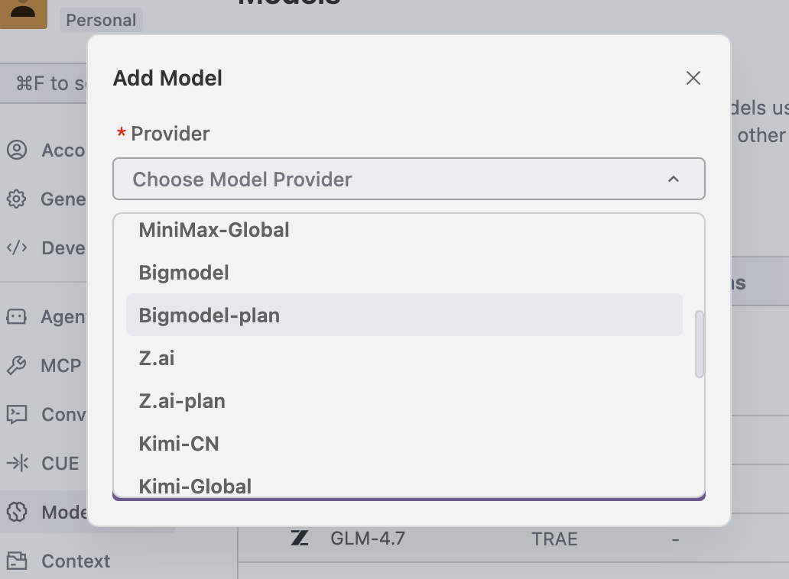

# Beginner Level 2: Learn AI Programming Tools

## Chapter Overview

<ChapterIntroduction :duration="duration" :tags="['Local Development Environment Setup', 'IDE vs AI IDE', 'Efficient Development Tips']" coreOutput="1 original game you create" expectedOutput="Built using Trae">

Previously, we experienced AI programming on z.ai, but the web version has many limitations — you **can't save your work anytime**, it's **hard to manage files**, and you **can't handle complex projects**. This chapter helps you move your development environment to your own computer so you can **truly build things independently**.

We'll first clarify **what the difference is between an IDE and an AI IDE**, and why the latter can **double your efficiency**. Then we'll **walk you through step by step** using Trae to build a Snake game locally, covering the **complete workflow** from installation to running. Finally, we'll share some **practical tips** for communicating with AI so you can avoid common pitfalls.

After completing this chapter, you'll have **mastered a development workflow similar to that of professional programmers**.

::: tip 💡 Advanced Tip
If you have some programming experience and want to use more powerful tools early on, you can refer to [Modern CLI Coding Tools](../../stage-2/backend/2.6-modern-cli/extra7/) to develop using the command line.
:::

</ChapterIntroduction>

  <ClientOnly>
    <StepBar :active="0" :items="[
      { title: 'Understanding the Environment', description: 'IDE vs AI IDE' },
      { title: 'Hands-on Practice', description: 'Build Snake with Trae' },
      { title: 'Tool Deep Dive', description: 'Explore the IDE Interface' },
      { title: 'Communication Skills', description: 'Talk to AI Effectively' }
    ]" />
  </ClientOnly>

## 1. What Environment and Tools Do You Need to Write Code

### 1.1 Mindset Shift: When in Doubt, Ask AI First

Before we introduce the various environments and tools, here's an important reminder: you need to **change your thinking habits**.

In traditional programming learning, if you need to install Python, configure Conda, or fix an npm installation failure, you'd typically open a search engine, find a tutorial, and follow the steps one by one. If you hit an error along the way, you'd search for the error message and try again repeatedly.

Wrong! ❌

In the AI era, especially when using an AI IDE, remember one core principle: **For any task, you can ask AI first, or even let it do it for you.**

- **Don't know how to set up your environment?** Just ask AI in the sidebar: "I want to write Python. Please check if Python is installed, and if not, install it for me."
- **Network stuck?** If installing dependencies keeps spinning or throwing errors, just throw the error to AI: "The download failed. Is it a network issue? Can you help me switch to a different mirror source?"
- **Can't remember commands?** No need to memorize Git or Conda commands. Just tell AI: "Help me create a new virtual environment called demo."

### 1.2 Why You Need an Environment and Tools

Going from "trying to write a few lines of code" to "building a long-term maintainable project" requires completely different environments and tools.

In theory, you could write code with the system's built-in Notepad, but problems quickly arise:

- **All code is plain black text** — keywords, strings, and comments are all mixed together, making it hard to see the structure at a glance
- **No smart suggestions** — you have to type every word completely by hand, and a single typo means repeatedly checking your code
- **Files become chaotic** — switching back and forth between dozens of files, often unable to find the line you need to edit
- **Debugging is guesswork** — when the program crashes, you don't know what went wrong and can only add print statements line by line

That's why you need an IDE (Integrated Development Environment). It displays code in different colors, provides auto-suggestions as you type, organizes files by project, and lets you trace errors step by step — making development more efficient and less error-prone.

## 2. What Is an IDE, and Why Do You Need One

::: info Pre-reading Tip
If you're not yet familiar with what an IDE is or what each interface element does, we recommend reading [IDE Basics](/zh-cn/appendix/2-development-tools/ide-basics) first to learn the basic concepts and common features.
:::

In the early days of programming, all we needed was a simple text editor and a language processor. But as projects grew more complex, developers urgently needed a tool that could efficiently manage files, support syntax highlighting, and enable debugging — and thus the Integrated Development Environment (IDE) was born.

You can think of an IDE as a program specifically designed to "edit, manage, run, and debug" code. Early IDEs looked very "primitive" and were operated almost entirely through the keyboard.

Terminal Interface — Image source: https://en.wikipedia.org/wiki/File:Emacs-screenshot.png

Well-known and mature "built-in IDEs" like `Vim` are commonly used for remote server operations.

For greater efficiency, we need modern IDEs that support mouse interaction, typically including:

- **Source Code Editor**: Syntax highlighting, auto-completion.
- **Build and Run Tools**: Built-in compiler/interpreter.
- **Debugger**: Breakpoint debugging, variable inspection.

Modern IDEs often also include built-in tools like Git. The most popular is Microsoft's **[Visual Studio Code (VS Code)](https://code.visualstudio.com/)**, which is lightweight and extensible. While there are also professional IDEs like the JetBrains suite, VS Code is the most beginner-friendly.

VS Code's core philosophy is "everything is a plugin." Through its plugin system, it supports various languages — install the Python plugin and it becomes a Python IDE, install the C++ plugin and it becomes a C++ IDE. Without plugins, it's just an advanced text editor.

You can even use it to edit Markdown documents.

In short, an IDE is a set of tools that helps developers write code and run programs efficiently.

For more detailed explanations, check out the [Virtual IDE Visualization section in the Appendix](/zh-cn/appendix/2-development-tools/ide-basics).

## 3. How Is an AI IDE Different from a Regular IDE

A regular IDE (like the original VS Code) is essentially a "toolbox":
You can open projects, write code, run and debug, and install plugins — but the prerequisite is that you need to know what to do and how to do it yourself:

- When there's an error, you read the message yourself and figure out which line has the problem;
- When you want to add a new page or API endpoint, you find the right file and write the code yourself;
- When you want to configure the environment or build the project, you look up the documentation and follow the steps yourself.

But in an AI IDE, you can directly use a large language model to help you code and modify files:

- Just say "make a login page," and it generates the basic code structure first;
- Throw the error message and related code at it, and let it analyze the cause and suggest fixes;
- After you confirm, let it automatically create files, batch-edit code, and handle cross-file grunt work.

For example, you can select a piece of code and ask it to "refactor this" or "add comments." You can also ask in the sidebar "How is this project designed?" and specify the reference scope using `@filename` or `@entire project`, completing the tedious operations of creating files, writing code, and running with a single sentence.

In the latest version of VS Code, a large language model assistant is already built in. You can have conversations with the model about the entire codebase, a specific file, or even a specific function. You can also use it like the auto-coding tools you used on the web — send your requirements as prompts to the built-in coding Agent, and let it automatically implement the features you need, create files, modify code, configure environments, and more.

You can download and install VS Code, click the sidebar entry in the top-right corner, and open the AI feature area to experience these capabilities.

However, VS Code is not the IDE with the strongest AI capabilities. For scenarios that require heavy AI-assisted coding, we often want to use "smarter, more efficient" tools — a good AI IDE can significantly save time on writing code and fixing bugs. Below we'll introduce several popular AI IDEs. You can choose any AI IDE based on your personal preference.

Since VS Code is open source (anyone can download the source code and compile it themselves), the vast majority of AI IDEs on the market today are built on top of VS Code. So you don't need to worry about "learning many different IDEs" — **as long as you're familiar with the basics of VS Code**, migrating to these AI IDEs doesn't require starting from scratch.

Generally speaking, the differences between AI IDEs mainly come down to four aspects: pricing; available model types (some advanced models may be restricted in certain regions); Agent capabilities (how smart and capable it is at assisting with coding); and speed and performance. You can choose based on your own testing results — the best tool is the one that works best for you.

> Typical AI IDEs generally have the following core capabilities:
>
> - Smart Code Generation and Completion: In traditional IDEs, we typically type a few characters to auto-complete variable or function names. In modern AI IDEs, you can write a few lines of pseudocode or simply describe your requirements, and the IDE will auto-complete the full logic, or even generate large blocks of code based on instructions.
> - Code Understanding and Q&A: The IDE can understand and answer questions about a specific piece of code, a file, or even the entire project directory structure.
> - Code Refactoring and Optimization: The IDE can rewrite or optimize the implementation logic of specified code snippets based on your intent.
> - Automatic Test Generation: The IDE can automatically generate test code for different functions and modules, making it easy to perform targeted testing.
> - Agent-style Task Execution: Smart Agents can automatically generate, build, install, run, and modify code, partially replacing the work of junior software engineers in many tasks.

::: details Antigravity

### [Antigravity](https://antigravity.google/)

Antigravity is a brand-new AI IDE released by Google in November 2025 alongside Gemini 3, adopting an "Agent-First" development model. Unlike traditional AI-assisted coding, Antigravity makes the AI agent the "active executor," capable of directly operating the editor, terminal, browser, and other tools, taking on more "execution," "planning," and "verification" work. Developers only need to express high-level intent, and the agent will automatically break down tasks, create plans, execute code, run tests, and generate results. It supports multi-model switching, including Gemini 3 Pro, Claude Sonnet 4.5, and more. It's currently available as a public preview, supporting Windows, macOS, and Linux.
:::

::: details Trae

### [Trae](https://www.trae.ai/)

Trae is an AI programming assistant developed by ByteDance that supports over 100 programming languages and can be integrated into mainstream IDEs. Its features include: generating code from natural language, automatic debugging, and converting design mockups into React/Vue components. After its August 2025 update, Trae added smart dependency imports, rename suggestions, task checklist management, and more. SOLO mode also began supporting backend code generation and technical architecture document editing.
:::

::: details Cursor

### [Cursor](https://cursor.com/)

Cursor is an AI code editor developed by Anysphere, built on a customized VS Code, with optimizations focused on large-scale codebases and multi-file collaboration scenarios. It supports models like GPT-4o and Claude 3.7. The Claude Max mode introduced in 2025 can handle projects with millions of lines of code. The Pro version removed request limits, making it ideal for complex enterprise projects.

Currently, Cursor is arguably one of the best AI IDEs with a graphical interface in terms of overall experience, with a large user base and frequent feature updates. Its biggest drawback is the higher price — the Pro version costs about $20 per month.

:::

::: details Qoder

### [Qoder](https://qoder.com/)

Qoder is an AI IDE from Alibaba that emphasizes "transparent collaboration" and "enhanced context engineering capabilities." It supports breaking tasks into multiple steps through Action Flow and tracks AI execution in real time. It also supports multi-model dynamic routing and task state machine management, making it ideal for architecture governance in medium-to-large projects and "reverse engineering" analysis of legacy systems.

:::

::: details CodeBuddy

### [CodeBuddy](https://www.codebuddy.com/)

CodeBuddy is an AI programming tool from Tencent Cloud that emphasizes Chinese language command support and enterprise-grade compliance capabilities. It offers code completion, batch code review, and multi-model switching. Its Craft agent can perform multi-file code generation and API integration. The enterprise version supports private deployment and has passed Level 3 security certification, making it suitable for industries with high data security requirements such as finance and healthcare.

:::

::: details VS Code + Cline

### VS Code + [Cline](https://cline.bot/)

Cline is an AI programming Agent plugin for VS Code (Visual Studio Code) that can flexibly switch between different large models by configuring different API endpoints. Cline supports multimodal input, MCP tool extensions, and cost monitoring, with all operations requiring user confirmation before execution. It's ideal for quickly validating ideas or integrating with existing development workflows. Basic features are free, and the enterprise version supports deploying models in private environments.

:::

::: details Kiro

### [Kiro](https://kiro.dev/)

Kiro is an AI programming IDE from AWS (Amazon Web Services), deeply integrated with Amazon Bedrock and the AWS cloud service ecosystem. It supports multiple large models including Claude and Nova, making it particularly suitable for development scenarios that require tight integration with AWS cloud services. Kiro provides smart code generation, automated testing, and seamless integration with AWS resources (such as Lambda, S3, DynamoDB), offering unique advantages for cloud-native application development.

> **Note**: If you want to use Anthropic Claude models, you'll need to use Cursor, Kiro, or Antigravity as your IDE. These IDEs have official partnerships or deep integrations with Anthropic, providing a more stable and complete Claude model experience.
:::

  <ClientOnly>
    <StepBar :active="1" :items="[
      { title: 'Understanding the Environment', description: 'IDE vs AI IDE' },
      { title: 'Hands-on Practice', description: 'Build Snake with Trae' },
      { title: 'Tool Deep Dive', description: 'Explore the IDE Interface' },
      { title: 'Communication Skills', description: 'Talk to AI Effectively' }
    ]" />
  </ClientOnly>

## 4. Hands-on: Build a Snake Game Locally with an AI IDE

The previous sections were mainly about "concepts" and "differences." In this section, we'll turn abstract concepts into concrete actions through a complete hands-on exercise: **Create a new empty folder -> Open it with an AI IDE -> Chat in the sidebar and have it build a Snake game from scratch using React.** Here we'll use Trae as our example, so first we need to install it and understand what Trae is.

::: tip 💡 Quick Tip: Seamless Transition from Web to Local
If you've previously developed projects on z.ai or other web-based AI programming platforms, you can download the code directly to your local machine and open it with an AI IDE to continue development. This way you can keep your previous work while enjoying the more powerful AI assistance of a local IDE.

The steps are simple:
1. Click the download button on platforms like z.ai to save the project locally
2. Unzip and open the folder with an AI IDE like Trae/Cursor
3. Continue chatting with AI in the sidebar to iterate and improve your project
:::

### 4.1 Preparation: Install and Learn About Trae

#### 4.1.1 What Is Trae

Trae's full name can be understood as "The Real AI Engineer." It's an adaptive AI Integrated Development Environment (IDE) developed by ByteDance. It's built on top of the popular VS Code, which means if you're already familiar with VS Code, you'll find Trae's interface layout and basic operations very familiar and comfortable.

Trae's core goal is to be a developer's "smart programming partner." Through deep AI integration, it can automatically handle a large amount of repetitive work, providing you with a more intuitive and efficient development experience. It's not just a "code completion tool" — it aims to assist throughout the entire development workflow, from creating projects, writing code, debugging, testing, to deployment.

#### 4.1.2 Installing Trae

Trae comes in an international version and a China version. The international version requires access to overseas networks but lets you use the latest overseas models like GPT-5. The China version primarily supports the latest domestic large models such as GLM, Qwen, Kimi, etc.

International version download: https://www.trae.ai/
China version download: https://www.trae.cn/

##### Trae Pricing and Usage Options

::: info 💡 Version Selection Tips (CN Version Recommended for Beginners)
- **For beginners, we strongly recommend downloading the China version (CN version, trae.cn)** — it currently provides a better overall experience and is free to use, with no overseas network required
- If you need to use overseas models like GPT-5 and your network conditions allow it, you can choose the international version
- If you already have a third-party model API Key, connecting third-party models gives you flexible cost control
:::

> 💡 **Currently recommended: Use OpenRouter free models for testing**
>
> As of the time this tutorial was written (2026-02-12), you can still try StepFun's models for free. See section 4.2 below for how to connect the model `stepfun/step-3.5-flash:free`.

Regarding Trae's costs and usage options, here are several choices:

- **China Version CN (Strongly Recommended)**: Basic usage is free, and it currently provides a better overall experience than the international version — ideal for beginners. Due to high user volume, you may occasionally need to wait in a queue.
- **International Version**: Subscription costs about $3 per month, giving access to overseas models like GPT-5, but requires overseas network access.
- **Third-party Model Integration**: If you already have a Token API from a domestic large model provider (such as DeepSeek, Tongyi Qianwen, Kimi, etc.), you can connect these APIs through Trae's third-party model configuration. Major cloud service providers (such as Alibaba Cloud, Tencent Cloud, Baidu Cloud, etc.) typically offer Coding Plan subscriptions that let you use their large model APIs at more favorable prices. This way you can freely choose your preferred model while controlling costs.

We recommend beginners start with the free China CN version (download: https://www.trae.cn/), which currently offers a better experience and is completely free. If you encounter queuing issues or need more stable service, consider connecting a third-party model and purchasing the corresponding cloud provider's Coding Plan.

#### 4.1.3 Trae Interface Overview

In terms of interface design, Trae is very similar to the VS Code we use daily: the same classic three-column layout with a file explorer on the left, an editing area in the center, and an extension panel on the right.

The sidebar on the right is the Copilot interaction window, which can also be thought of as the Agent window. If you can't see it right away, click the sidebar icon in the top-right corner of Trae to open it.

After opening the sidebar, you'll see a `Builder` option — this is the Agent mode. Simply put, it's like a "local version" of z.ai that can operate your local environment, install runtime environments, open web pages, and more.

After clicking "Builder," you'll see "Chat" mode and "Builder with MCP" mode:

- **Chat Mode**: Primarily used for chatting about the code in your current folder, or as a general chat model. (You can open a folder through the "File" menu in the top-left corner and edit within that folder. In this case, any files Builder creates or modifies will only happen inside this folder.)
- **Builder with MCP Mode**: Provides the Agent with more available tools (such as connecting the language model with other software, querying weather, etc.). You can simply understand it as: MCP makes it easier for the language model to call various external tools.

In the area below, you'll also see model selection options — click to change the current large model. In the China version, you can choose domestic models like Kimi k2 or GLM. If you're using the international version of Trae, you can also select overseas models like ChatGPT or Claude. However, since domestic large models are developing very rapidly, Kimi, Qwen, GLM, and others already offer experiences close to Claude 3.5 or 3.7 in many tasks, which is more than sufficient for daily development. There's no strict requirement to use the international or China version here.

**Note that we don't recommend using Auto mode (automatic model selection). For the international version, we recommend using Gemini or GPT models. For the China version, we recommend trying domestic models like Kimi k2, Minimax, or GLM.** Different models suit different use cases — there's no dogmatic rule about which is better. When you hit a wall with one model, try switching to another. Through multiple tests, you'll find the best results for your own workflow.

That's a brief introduction to Trae. Next, let's revisit what we did previously on z.ai and try doing the same thing in Trae.

### 4.2 Step 1: Create an Empty Folder and Open It with an AI IDE

Before getting started, we first need to prepare a clean project working directory.
For this section's example, you can create a new empty folder named `snake-game-react` on your local machine.

Then, open your installed AI IDE, select "Open Folder" on the startup screen, and import the empty folder as the project root directory. You can also drag the folder directly into the IDE window to open it. At this point, the file explorer on the left won't show any code files, indicating that we're starting from a completely blank project state.

::: details 📚 Optional: Connect a Cloud Service Provider's API or Coding Plan

This section introduces how to connect a cloud service provider's API or Coding Plan for more stable and frequent model calls. Screenshots of the Trae integration are provided at the end.

**What Is a Coding Plan**

A Coding Plan is a subscription offered by major cloud service providers. After purchasing, you can **use the provider's large model API without limits or at high frequency** for a certain period. Compared to per-token billing, a Coding Plan is more like a "monthly package" — you pay a fixed fee and can use it freely without worrying about per-call charges.

**Why Purchase a Coding Plan**

You might ask: since you can call large models directly via API, why buy a Coding Plan? The main reason is: **unlimited usage**. The core advantage of a Coding Plan is that you can call the large model anytime, as frequently as you want, without worrying about costs exploding or constantly checking billing statements.

**Recommended Domestic Cloud Service Coding Plans**

Here are recommended Coding Plan options from major domestic cloud service providers:

- Zhipu AI (BigModel Plan): https://bigmodel.cn/glm-coding
- Volcengine (ByteDance Cloud AI Plan): https://www.volcengine.com/activity/codingplan

> 💡 **You can also directly connect a large model API**
> Besides Coding Plans, you can also directly connect various model APIs through Add Model. You can refer to the method below for connecting the OpenRouter StepFun free API to integrate it with Trae. Testing shows it meets basic programming needs.
> If you need to top up, we suggest starting with a small amount (e.g., 10 RMB) to see how long it lasts, such as with cost-effective models like DeepSeek.

**How to Connect a Coding Plan**

Connecting a Coding Plan is very simple and takes just a few minutes:

1. Visit your chosen cloud service provider's website (e.g., Zhipu AI: https://bigmodel.cn/glm-coding, Volcengine: https://www.volcengine.com/activity/codingplan)
2. Register an account and log in
3. Find the "Pricing" or "Coding Plan" page
4. Choose a plan that suits you and complete the payment
5. After payment, you'll receive an API Key or Plan ID

::: tip 🎯 Custom Model Recommendations

When connecting custom models in Trae, we **recommend using the OpenRouter approach by default**. OpenRouter provides a unified API interface for conveniently connecting to multiple large language models.

**As of February 12, 2026, you can still use StepFun's free API:**

- **`stepfun/step-3.5-flash:free`**: A free model from StepFun that can be directly connected in Trae.

**Other free models:**

- **`openrouter/free`**: A model option that uses free LLM APIs by default. You can use it directly in Trae's Custom Model integration (just enter the model ID), experiencing AI programming features without any cost.

These free options are great for beginners. Before committing to production use, you can familiarize yourself with the AI IDE workflow through these free options.

**Optional: Connect a Large Model API (Using DeepSeek as an Example)**

1. Visit the DeepSeek platform: https://platform.deepseek.com/usage
2. Register an account and log in
3. Purchase a 10 RMB token package on the top-up page
4. After topping up, create and copy an API Key on the API Keys page
5. In Trae, click **"Add Model"**, find DeepSeek, select the corresponding model, and enter the API Key to start using it

Through the interface below, you can successfully add a model (note: after selecting the model option, **make sure to scroll all the way to the bottom** — there's a "Custom Model" option. Click it to enter a model ID, where you can type the recommended model IDs like `stepfun/step-3.5-flash:free`. Also click "Get Key" below to visit the official website and obtain the corresponding API Key.)

:::
