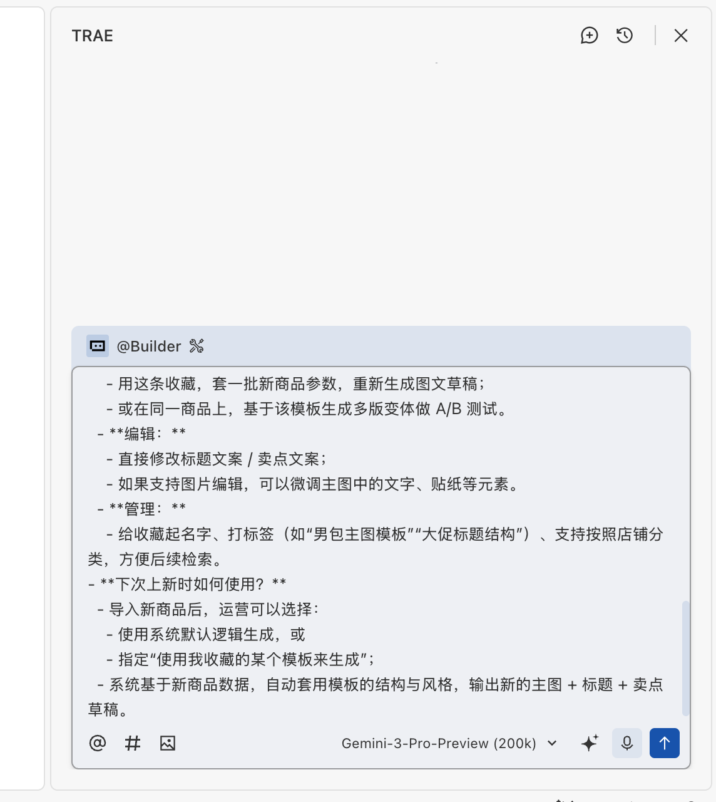
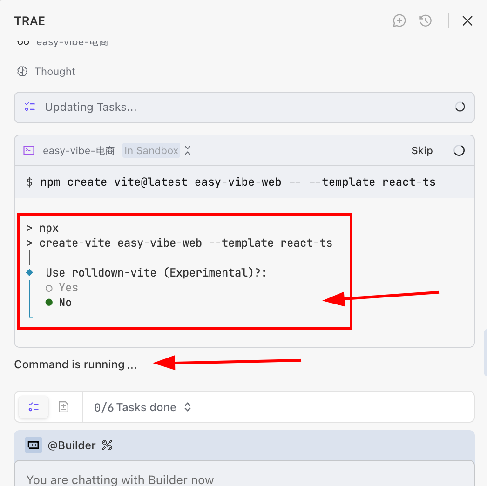
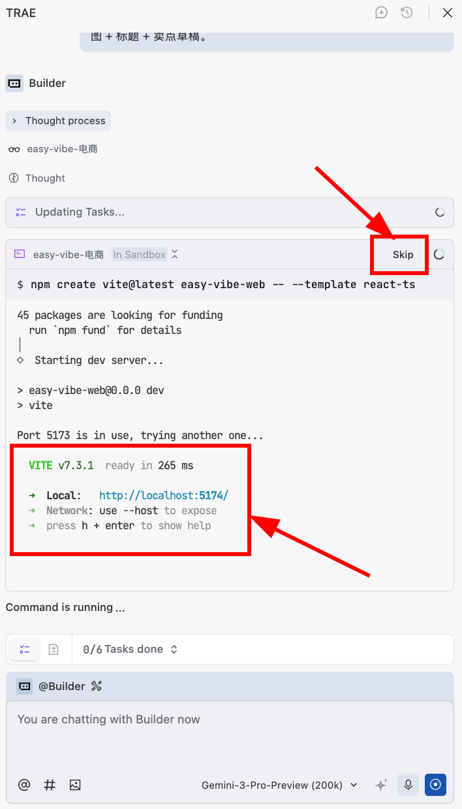

<script setup>
const duration = 'About <strong>8 hours</strong>'
</script>

# Beginner Level 3: Building Prototypes

## Chapter Overview

<ChapterIntroduction :duration="duration" :tags="['Business Analysis', 'Prototype Design', 'AI-Assisted Programming', 'Multi-page Applications']" coreOutput="1 e-commerce material workbench prototype" expectedOutput="Interactive Web prototype">

In the previous chapter, we learned how to <strong>find great ideas</strong> — starting from user needs to find directions people are willing to pay for. But finding direction is just the first step. <strong>What really tests a product manager is: how to turn vague needs into usable products.</strong>

This chapter solves a <strong>real problem</strong>: Your boss gives you a vague but high-pressure task: "Use AI to improve the efficiency of publishing products to e-commerce platforms" — how do you turn this into a <strong>usable product prototype</strong>?

Unlike building Snake or calculators before, <strong>real business can't just imagine features</strong>:

1. <strong>Clarify pain points</strong>: Talk to operations, dig out the <strong>real pain points</strong> from the vague "improve efficiency"
2. <strong>Prioritize</strong>: Among many problems, solve the <strong>most painful one</strong> first, don't try to do everything at once
3. <strong>Quick validation</strong>: Use AI IDE to build a <strong>single-page prototype</strong> first, then expand to multi-page after it works
4. <strong>Make something usable</strong>: Finally deliver an <strong>e-commerce material workbench that can be demonstrated and operated</strong>

We'll learn the transition from <strong>making toys to making applications</strong>, and learn to <strong>empathize and think about customers' real needs</strong>.

</ChapterIntroduction>

::: info Note
This chapter may contain some business terminology. If you don't understand something, you can ask AI for an explanation.
:::

<div style="margin: 50px 0;">
  <ClientOnly>
    <StepBar :active="0" :items="[
      { title: 'Requirements Analysis', description: 'From vague to specific' },
      { title: 'Single Page Validation', description: 'Core functionality implementation' },
      { title: 'Multi-page Expansion', description: 'Complete application structure' },
      { title: 'Beautification', description: 'Improve user experience' }
    ]" />
  </ClientOnly>
</div>

## 1. Define Requirements Before Coding

In previous tutorials, we used AI IDE to easily generate Snake and various mini-games, but these are just toy projects that can't be applied in work and life. If we want AI capabilities to truly serve everyone, we should combine vibe coding with real life and work scenarios.

In the last chapter, we learned how to find <strong>great ideas that people are willing to pay for</strong>, but finding direction is just the beginning. When actually building products, you'll discover: <strong>there's a huge gap between knowing "what to do" and knowing "how to do it."</strong>

This gap is <strong>the concretization of requirements</strong>.

For example, in classes or personal projects, we often start with the simplest executable features:

- "Make a kanban board, list the tasks."
- "Help me make a drawing tool."
- "Help me make a software that can collect questionnaires."

These are often just a tool, a feature module, not even a clear business problem. More critically, <strong>these ideas are often just "you think it's useful," not "users really need it."</strong>

In enterprise projects or startup projects, product managers and engineers often start from larger business propositions. For example, let's assume such a scenario:

<el-card shadow="hover" style="border-left: 5px solid #409EFF; background-color: #ecf5ff; margin: 20px 0;">
  <div style="font-weight: bold; color: #303133; margin-bottom: 10px;">Business Scenario:</div>
  <div style="color: #606266; line-height: 1.6;">
    <p>You are an e-commerce operations product manager at a store. Your boss gave you a vague but high-pressure proposition:</p>
    <p style="font-style: italic; margin-top: 10px;">"Now everyone on WeChat is using AI to make images and copy, it looks pretty simple. Help me set this up so we can be more efficient when listing new products on Douyin e-commerce."</p>
  </div>
</el-card>

At this point you might think: "Boss, you're dreaming again!" However, such vague one-sentence decisions are very common in actual work, even more frequent than your weekly bubble tea orders. Therefore, to be a qualified workplace worker (I'd rather you be the CEO of an emerging startup), we must learn how to transition from making tools for personal use to making real product prototypes.

Since we've learned AI IDE, you think about it and this requirement is actually quite simple — just let AI give a prompt based on this, throw it to the Agent and we're done, right?

```
Please refer to my requirements below,
Help me design an e-commerce material workbench,
Including generation and management functions for product descriptions, images, videos, and other materials.
```

If you excitedly convert this requirement directly into a prototype and send it to your boss — congratulations, this quarter's bonus is cancelled!

**Why is this? This is the core pain point we need to solve:**

Previously when learning AI IDE, we made toy projects for personal use like Snake and calculators — simple features, you know what you want, make it for yourself. But **real business scenarios are completely different**:

- **You're not the user**: The boss wants "improved efficiency," but you don't know how operations works daily or where they're stuck;
- **AI doesn't understand business either**: You throw a vague requirement to AI, it can only guess based on general knowledge. What it makes looks right but actually doesn't work;
- **Good ideas ≠ good products**: You think "adding an AI generation feature" is cool, but users might not need it at all, or it's more troublesome than before.

**That's why we must learn "from thinking of ideas to understanding users"** Only when your creativity truly solves others' problems, ask questions and deeply understand the business, can you make something truly valuable. (Good ideas are even more important than good technology)

### 1.1 From Imagination to Reality: Learn to Ask Business Questions

::: info First, let's clarify: What are requirements? What is business?

**Requirements** are what users really want, the troubles they encounter, the problems they want to solve. For example, "The boss wants me to list products faster" — this is a requirement.

**Business** is what users actually do every day, their way of working. For example, what e-commerce operations does daily: listing products, changing prices, making images, looking at data... these are all business.

**Why care about business?**
Because if you don't understand the business, the tools you make might be "look good but nobody uses them." Only by truly understanding how users work daily and where they're stuck can you make something that really helps them.

:::

From the simplest perspective, you can first ask yourself a few questions:

- The boss says "**improve efficiency a bit**" — what does that specifically mean? **Do it faster**? **Spend less money**? **Sell more goods**?
- How are products currently listed? **Where is it not smooth**?
- How many **new products** need to be done daily? How many **images** and how much **text** per product?
- In current work, **which task is most troublesome**, **most unwanted**?

But these are all guessed questions. We need to ask the frontline Douyin e-commerce business people directly, "Where are your difficulties and concerns?" Get more accurate answers through communication:

::: info Real Business Interview Results

We asked people doing e-commerce operations, and they mentioned these troubles:

**1. Too many things, too scattered**
- One person manages several stores, each store has many products to handle;
- Busy all day: **listing new products**, **changing prices**, **making images**, **looking at data** — one thing not finished before another starts.

**2. Content creation isn't done once, but iteratively**
- First use **manufacturer-provided images**, **previously used materials** or **reference images found online**, quickly **list** products to test;
- Spend a little money on promotion, **see if anyone buys**;
- Only for **products that sell well** will they seriously make images, write details, shoot videos.

:::
After interviewing the business side, we feel passionate because now we can truly make a product prototype that perfectly fits the business! — Wrong again. If we try to "satisfy all demands at once," the product will be very large and hard to implement within the course timeframe. Therefore, we need to further organize and converge, finding the real core pain points.

### 1.2 From Divergence to Convergence: Lock in Core Business Pain Points and Features

::: info Why "converge"? What is a "pain point"?

**Many problems, but which one to do first?**

Users might tell you a bunch of problems: A is troublesome, B is troublesome, C is troublesome... But if you try to solve all problems at once, you might end up doing nothing well. So you need to **converge** — from a pile of problems, pick the **most painful, most urgent, most solvable** one to start with.

**What is a pain point?**
It's the specific problem users **find most annoying, most time-consuming, most want to solve**. Not "I think it's useful," but what users **complain about every day, find painful every time they do it**.

:::

Through the interview above, we found operations has many problems: interrupted rhythm by activities, managing multiple stores, busy going back and forth between listing/pricing/images/data...

If we try to "solve all these problems," we'll end up with a **comprehensive but hard-to-use tool**.

Let's categorize these problems (you can have AI help), roughly three types:

1. **Rhythm problems**: When to list, when to adjust prices;
2. **Efficiency problems**: How to manage multiple stores and products simultaneously;
3. **Content problems**: How to quickly create product images and copy.

For our course, the most suitable to solve first is **the 3rd type: content creation problems**. But "quickly create content" is still a bit abstract. Let's ask the business side specifically where they're stuck:

::: info Business Side Says: Two Most Painful Parts of Content Creation

**Pain 1: Batch creating images and copy is too much effort**
- Materials scattered everywhere: cloud drives, WeChat records, platform backends... **finding them is a hassle**;
- Need to list many products at once, **no time to carefully craft each one**, can only throw something together;
- Requirements aren't high, **presentable and listable is fine**, doesn't need to be fancy.

**Pain 2: Good solutions can't be saved for reuse**
- Previously made good titles and layouts, **can't find them next time**;
- Solutions scattered in chat history, old product links;
- When needed, have to **dig through everything, copy-paste and edit for ages**;
- Lacking a tool that can **collect, manage, and directly apply**.

:::

Based on these two pain points, we want to make a simple little tool: **Help operations batch create images and copy, and save good solutions for direct reuse next time**.

It only does two things (you can have AI help refine, remember to keep deleting features based on business feedback):

::: info Feature 1: Batch Generate E-commerce Product Images and Copy

**What does this do?**
Give the system some product information, and it automatically generates product images and text that can be used for listing on e-commerce platforms (like Douyin, Taobao).

**Input**
| Type | Content |
|------|------|
| Product Information | Name, category, brand, material, size, color, etc. |
| Product Images | White background or simple scene images |
| Reference Images | Screenshots of previously best-selling products or reference links |
| Import Method | Batch import via Excel, or fill in directly on the page |

**Output (Generated E-commerce Materials)**
- **Product Main Image**: Product display image with text selling points (first image users see when scrolling)
- **Product Title**: Keyword combination that can be searched
- **Selling Point Copy**: 1-2 sentences to attract buyers
- All are **finished products that can be listed with minor edits**

**Effect**
- Before: Every product had to start from scratch making images and writing copy
- After: Throw a batch of products into the system, generate drafts, then pick and edit

:::

::: info Feature 2: Save Good Solutions as Templates

**Input**
| Type | Content |
|------|------|
| Complete Set | Main image + Title + Copy |

**Output**
| Function | Description |
|------|------|
| Apply | Use template to auto-generate for new products |
| Edit | Directly modify title, modify copy |
| Manage | Name, tag (like "men's bag template", "promotion title"), easy to find |

**Effect**
1. Import new product
2. Choose: Let system generate by default, or **use my saved template**
3. System automatically applies template style, outputs new images and copy

:::

---

**Review what we just did:**

1. **Asked questions first**: Didn't start building directly, but first asked operations "what annoys you most";
2. **Found pain points**: Discovered their most painful parts are "making images and copy is too much effort" and "good solutions can't be saved";
3. **Converged scope**: Not making a comprehensive platform, just these two features: "batch generate images and copy + save templates".

**Why is this important?**

Many beginners' misconception about product building is: more features is better. But what users really need is **to solve the most painful problem**. Making a bunch of features that don't work well is worse than making one or two features that really help users.

**Core of Product and Business Thinking:**
- Don't think for yourself "I think users need what"
- Ask users "What do you do every day? Where is it most painful?"
- From a pile of problems **converge** to the most painful, most solvable one
- First make a **minimum viable** version, then slowly iterate

This is what we need to figure out before writing code. Code is just a tool; **understanding users and finding the right problem** is the first step.

<div style="margin: 50px 0;">
  <ClientOnly>
    <StepBar :active="1" :items="[
      { title: 'Requirements Analysis', description: 'From vague to specific' },
      { title: 'Single Page Validation', description: 'Core functionality implementation' },
      { title: 'Multi-page Expansion', description: 'Complete application structure' },
      { title: 'Beautification', description: 'Improve user experience' }
    ]" />
  </ClientOnly>
</div>

## 2. Generate Prototype in 10 Minutes: Let AI IDE Implement "Core Gameplay"

::: info Programming Plan Suggestion
If you feel the current IDE isn't smart enough, or you run out of quota quickly, you can buy a **programming Plan**. Preview in advance by referring to [this article](../../stage-2/backend/2.6-modern-cli/) for programming with Claude.
:::

Thinking is good, but don't overthink. Let's control excessive reflection and try making a prototype starting from a single page.

### 2.1 First Step: Tell AI What You Want in Plain Language

When starting out, don't pursue perfect prompts. Begin with your most natural expression. Just like describing requirements to a colleague, tell AI in plain language what you want to do, then let AI help you optimize it into a more professional expression.

#### 2.1.1 Start from Verbal Description (Recommended for Beginners)

First describe your idea in your own words, even if it's rough, that's fine:

```
I want to make a tool that helps e-commerce operations automatically generate product main images and copy.
Operations usually have to manually make images and write copy one by one, which is very troublesome.
My idea is: they upload product information, the system automatically generates a batch of drafts,
operations pick the good ones and make minor edits before using.

First make the simplest version: one page, fill in product info on the left,
display generated results on the right. Can upload images, can fill in text,
after generation show main image preview and copy.
```

Next, send this text to AI (like ChatGPT, Claude, etc.) and let it help you expand. AI usually helps you add details you didn't consider, organizes your ideas more clearly, and finally generates a prompt suitable for sending to AI IDE.

You can say this to AI:
```
Help me expand the above idea, organize it into a clear business logic document,
then generate a prompt suitable for sending to AI IDE (like Cursor, Trae),
for generating single-page application prototype code.
```

AI will return a structured requirement and corresponding prompt. You check it yourself, delete unnecessary features, and after confirming it's correct, use it to generate code.

The benefit of doing this: verbal descriptions are the most authentic ideas, but might miss some important details. When AI helps you expand, it might ask "do you want to support batch upload?" — questions you didn't think of, helping you further validate. You can choose to keep or delete impractical features based on feedback, and through repeated modifications determine the first version prompt to give AI.

#### 2.1.2 Skip the Expansion Step: Directly Throw Your Organized Business Document to AI

If you've already organized the business logic document in previous chapters (like a requirements description written in plain language), you can directly use the format below to send to AI IDE, skipping the intermediate step of having AI expand. Suitable when requirements are already clear and you want to start coding directly:

```
Help me implement a single-page application based on business logic, for validating core gameplay functionality.

Business logic reference:
1. Help operations batch generate first version of image and text drafts:
- **Input (supports direct upload and batch import of materials):**
  - Product basic info: name, category, brand, material, size, color, target audience, etc.;
  - Product images: white background / simple scene images;
  - Each generation supports uploading additional historical bestseller screenshots or reference links, allowing for reference materials;
  - Supports batch import via Excel, or online entry/upload on the page.
  - Supports specifying on the page whether to save product materials to the material library for next time use
- **Output (content that can be directly listed or listed with minor edits):**
  - Each product gets one "presentable, containing basic selling points" main image draft;
  - One "reasonably structured, containing core keywords" title + 1-2 sentences of selling point copy.
- **Expected usage change:**
  From starting from scratch for each batch of products to throwing a batch of products into the system, taking the system-generated drafts for filtering and minor adjustments.

First make the first feature, the second feature (template library) will be added later.
```

#### 2.1.3 Programmer's Approach (Advanced): Let AI Help You Write "Prompts for Prompts"

If you want more fine-grained control over the code generation process, you can first have AI (like ChatGPT) generate a prompt specifically for AI IDE based on your requirements:

```
Based on the idea below, help me write a prompt for a coding Agent,
I need to use this prompt to generate code.

[Paste your business logic description here]

Requirements:
1. The prompt should include clear page layout descriptions
2. Clarify data structures and interaction logic
3. Specify tech stack (like React + Tailwind)
4. List core functionality points to implement
```

Usually AI will generate a structured prompt like below:


You can slightly modify this prompt, then send it to AI IDE to generate code.

### 2.2 Second Step: Let AI IDE Directly Generate Code

#### 2.2.1 Preparation: Understand AI IDE Basic Operations

If you're not yet familiar with the basic usage of AI IDE (like Cursor, Trae, Windsurf, etc.), it's recommended to first check the [IDE Basics Tutorial](/zh-cn/appendix/2-development-tools/ide-basics/) in the appendix to understand how to:
- Create new projects
- Dialogue with AI Agent
- Understand AI's code generation process

#### 2.2.2 Start Generating Code

At this point you've obtained the initial prompt. Let's use the first prompt style as an example, letting AI help us generate code. First create a window and corresponding folder, open the folder (initialize a new project in your favorite folder location):


In the sidebar, select a model you like (recommend gemini, gpt, glm, kimi, minimax, etc.), enter the prompt obtained in the first step:


After clicking generate, we'll see a familiar process. AI will plan the project's directory structure, necessary files, and give initial content for each file based on the prompt.

::: warning Special Note: AI Might Stop and Wait for Your Confirmation
During generation, AI Agent often **stops to wait for your input or confirmation**, for example:
- Asking if you want to continue to the next step
- Having you press Enter to confirm an operation
- Asking about your choice for a technical detail

**If you see AI isn't moving, first check the dialogue interface to see if it's waiting for your reply.** Many beginners think AI is thinking, but it actually stopped waiting for you long ago. Reply actively or press Enter, and AI will continue working.
:::

At this point, don't forget to press Enter to confirm information (otherwise it will be stuck waiting; some AI IDEs don't have this issue):


If you encounter the following scenario, this means a service has already started locally. You need to click skip, otherwise it will stay on this interface (if nothing appears after code generation finishes, you need to actively say "help me start this project"):


::: info Scenario Explanation
**Scenario Explanation**: You used `npm create vite@latest` to create a React + TypeScript project (easy-vibe-web). After creation, the computer will automatically "run" this webpage, making it convenient for you to see the effect immediately.

**Local Service**: Can be understood as your computer temporarily opening a webpage display window, running only on your own computer, others can't access it.
:::

---

**🎉 Congratulations! You've completed the first version of your prototype!**

Now you can see the running effect in the browser. Next, we'll expand based on this foundation.

<div style="margin: 50px 0;">
  <ClientOnly>
    <StepBar :active="2" :items="[
      { title: 'Requirements Analysis', description: 'From vague to specific' },
      { title: 'Single Page Validation', description: 'Core functionality implementation' },
      { title: 'Multi-page Expansion', description: 'Complete application structure' },
      { title: 'Beautification', description: 'Improve user experience' }
    ]" />
  </ClientOnly>
</div>

## 3. Multi-page Expansion: From Single Function to Complete Application

The single-page prototype has validated the core gameplay. Now we need to expand it into a complete application.

### 3.1 Analyze Current Prototype's Shortcomings

Reviewing our single-page prototype, we'll find some obvious issues:

1. **No navigation**: Users can only see one page, can't switch between different functions
2. **No data persistence**: Refresh the page and all data is gone
3. **No error handling**: If something goes wrong, users don't know what happened
4. **No user feedback**: No prompts after operations, users don't know if they succeeded

### 3.2 Design Multi-page Structure

Based on the business requirements we analyzed earlier, we need the following pages:

1. **Homepage/Dashboard**: Display task list, quick actions
2. **Product Management**: Add, edit, delete products
3. **Generation Page**: Core functionality - generate images and copy
4. **Template Library**: Save and manage templates
5. **Settings**: User preferences, API configuration

### 3.3 Let AI IDE Help You Expand

You can tell AI IDE:

```
Now I need to expand this single-page application into a multi-page application.
Please help me:
1. Add routing to support switching between pages
2. Create the following pages:
   - Homepage: Display task list
   - Product Management: CRUD operations for products
   - Generation Page: The existing single-page functionality
   - Template Library: Save and manage templates
3. Add navigation bar for page switching
```

AI IDE will help you complete these expansions. You just need to confirm and adjust.

<div style="margin: 50px 0;">
  <ClientOnly>
    <StepBar :active="3" :items="[
      { title: 'Requirements Analysis', description: 'From vague to specific' },
      { title: 'Single Page Validation', description: 'Core functionality implementation' },
      { title: 'Multi-page Expansion', description: 'Complete application structure' },
      { title: 'Beautification', description: 'Improve user experience' }
    ]" />
  </ClientOnly>
</div>

## 4. Beautification and Optimization: Make the Prototype More Professional

A working prototype is just the first step. To make it impressive, we need to beautify and optimize.

### 4.1 UI Beautification

Tell AI IDE:

```
Please help me beautify this application:
1. Use a consistent color scheme
2. Add appropriate spacing and alignment
3. Improve button and form styles
4. Add hover effects and transitions
5. Ensure responsive design for different screen sizes
```

### 4.2 UX Optimization

```
Please help me improve the user experience:
1. Add loading states for all async operations
2. Add success/error notifications
3. Add confirmation dialogs for destructive actions
4. Improve form validation and error messages
5. Add keyboard shortcuts for common actions
```

### 4.3 Performance Optimization

```
Please help me optimize performance:
1. Lazy load images
2. Implement pagination for long lists
3. Add debouncing for search inputs
4. Optimize bundle size
```

---

## Summary

In this chapter, we learned:

1. **Requirements Analysis**: How to extract real pain points from vague business requirements
2. **Single-page Validation**: Quickly validate core functionality with AI IDE
3. **Multi-page Expansion**: Expand from single function to complete application
4. **Beautification and Optimization**: Make prototypes more professional and user-friendly

**Key Takeaways:**

- Don't start coding immediately — understand requirements first
- Start with the simplest version — validate before expanding
- Let AI help you — but you make the final decisions
- Iterate based on feedback — keep improving

In the next chapter, we'll learn how to integrate real AI capabilities into our prototype.

## 5. 📚 Assignment: Recreate Your Own Douyin Ecommerce Workbench

<el-card shadow="hover" style="margin: 20px 0; border-radius: 12px;">
  <template #header>
    <div style="font-weight: bold; font-size: 16px;">🚀 Challenge: Recreate the Ecommerce Asset Workbench</div>
  </template>

  <p>
    Use this chapter's prompts and workflow to complete a full end-to-end loop:
  </p>

  <ul>
    <li>
      <strong>Full Loop Practice</strong>
      <ul>
        <li>Business requirement prompt generation → single-page prototype generation → multi-page prototype generation</li>
      </ul>
    </li>
    <li>
      <strong>Share Results</strong>
      <ul>
        <li>Take a screenshot of your app and share it with the community</li>
      </ul>
    </li>
    <li>
      <strong>Thinking Exercise</strong>
      <ul>
        <li>Reserve room for next chapter ("Integrating LLM and text-to-image capabilities"), and think ahead: how will you embed AI copywriting, image generation, and script generation in your workbench?</li>
      </ul>
    </li>
  </ul>
</el-card>

## Next Step

In the next chapter, we will integrate concrete AI capabilities into this content production workbench (text-to-text, image-to-text, and text-to-image), for example:

- Automatically generate first-draft copy and multiple title options for a content task
- Auto-generate visual drafts from task descriptions (text-to-image)
- Auto-classify and summarize historical content tasks to help plan your next campaign
