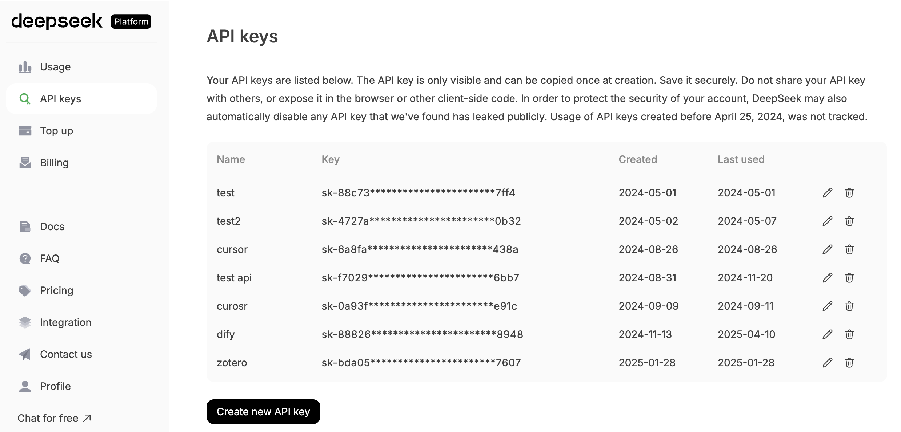
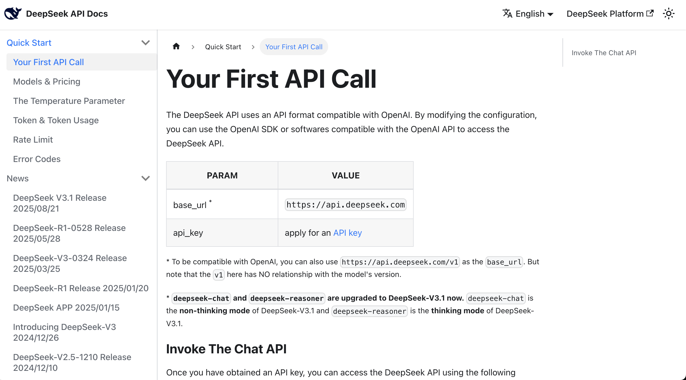
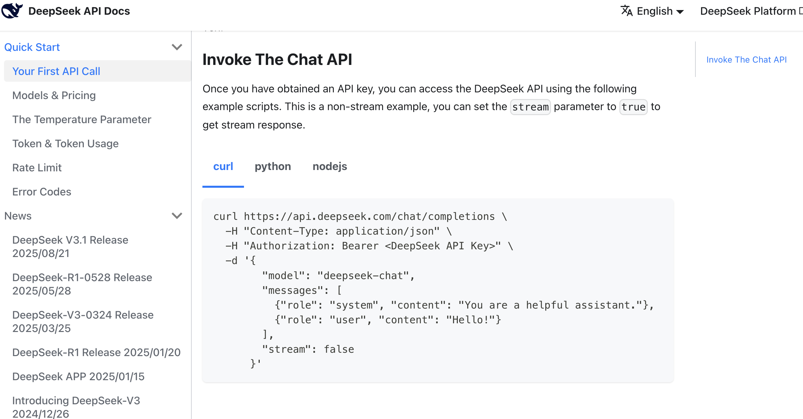
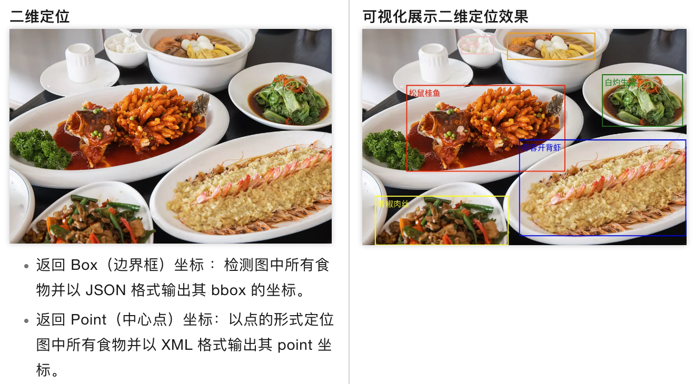
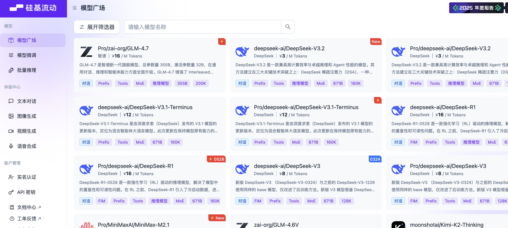

<script setup>
const duration = 'About <strong>1 day</strong>'
</script>

# Beginner Level 4: Injecting AI Capabilities into Your Prototype

## Chapter Introduction

<ChapterIntroduction :duration="duration" :tags="['API', 'Text Model', 'Text-to-Image', 'Prototype Integration']" coreOutput="Prototype integrated with 1 text model + 1 image model (optional)" expectedOutput="AI prototype capable of calling real APIs">

In the previous chapters, we completed the entire process from **finding a great idea** to **building a product prototype**. But the current prototype is still just a "shell" — clicking buttons won't actually generate content, and all the data on the page is hardcoded.

Remember what we emphasized in the first chapter? **We want to build "products people are willing to pay for," not "prototypes that just look good."** Real value comes from a product that can **solve real problems**, and to achieve that, the prototype must be able to **actually run**.

This chapter will bring your prototype **"to life"**: we'll integrate **real AI capabilities**, starting from obtaining an API Key, reading official documentation, and having the AI IDE help you integrate the interface into your code. Using **DeepSeek's text model** as an example, you'll learn how to make your application **actually call a large language model to generate content**; if you're interested, you can also **optionally integrate image generation**.

After completing this chapter, your prototype will **no longer be a static demo**, but rather **an application that can call real AI capabilities and solve real problems**.

</ChapterIntroduction>

<div style="margin: 50px 0;">
  <ClientOnly>
    <StepBar :active="0" :items="[
      { title: 'API Basics', description: 'Understand core concepts and security practices' },
      { title: 'Text Integration', description: 'DeepSeek text generation hands-on' },
      { title: 'Image Integration', description: 'VLM image understanding and generation' }
    ]" />
  </ClientOnly>
</div>

# 1. API Fundamentals

As mentioned earlier, our goal is to "integrate AI capabilities" so that the prototype is no longer a static demo but a tool that can call real AI services. The key to achieving this lies in understanding and using APIs (Application Programming Interfaces).

API is an important abstraction concept in computer science. Simply put: **you send a request in the format the other party requires, and they send back a result in the same format**.

- **What you send out**: Usually includes a "key (API Key)" and "what you want to generate"
- **What they send back**: If successful, you get the result; if it fails, they tell you why (e.g., "invalid key," "insufficient balance," "incorrect parameters")

Specifically, you need to master the following core elements:

1. **API Key**: Your "pass" and also your "wallet key." Anyone who gets it can make API calls on your behalf and incur charges.
2. **Endpoint**: The specific path for the API request, telling the server which function you want to access. The full request URL is typically composed of "Base URL + Endpoint path." For example:
   - Text generation: Base URL (`https://api.service.com`) + Endpoint (`/v1/chat/completions`) = Full URL `https://api.service.com/v1/chat/completions`
   - Image generation: Base URL (`https://api.service.com`) + Endpoint (`/v1/images/generations`) = Full URL `https://api.service.com/v1/images/generations`
3. **Call/Request**: The process of sending a task to the AI service and getting results back
4. **Request Content**: The specific content you send to the AI, such as the topic you want the AI to write about, the description of the image to generate, etc.
5. **Response**: The content the AI returns after processing, such as the generated article, image, etc.
6. **Error Handling**: Knowing how to troubleshoot when problems occur (such as incorrect API Key, too many requests, etc.)

::: info ℹ️ What is an API
For a more in-depth explanation of APIs, see the appendix: [Introduction to APIs](/zh-cn/appendix/4-server-and-backend/api-intro).

::: warning 🔐 **API Security Notes**
The API Key is your "pass" for requesting AI services — it's a secret string used for authentication and billing.

Since the API Key is directly linked to your account and charges, be sure to:

- **Never share it** in group chats, screenshots uploaded online, or public forums
- **Never hardcode it** into your code and commit it to a Git repository (especially public repositories)
- If you suspect your Key has been leaked, **replace it with a new Key immediately**

In the content below, we will **paste the API KEY directly into the AI IDE for operations**. **Don't do this in real projects!!** Since we're just practicing, it's fine for now. (Once you're more experienced, you can have the AI generate a configuration file and simply put the API KEY in the config file.)
:::

<div style="margin: 50px 0;">
  <ClientOnly>
    <StepBar :active="1" :items="[
      { title: 'API Basics', description: 'Understand core concepts and security practices' },
      { title: 'Text Integration', description: 'DeepSeek text generation hands-on' },
      { title: 'Image Integration', description: 'VLM image understanding and generation' }
    ]" />
  </ClientOnly>
</div>

# 2. Integrating the Text Generation API: DeepSeek

Although APIs involve these technical concepts, the actual operation during the prototyping phase can be very simple and efficient. The core approach is:

> **Find the official example, get the API Key, and have the AI IDE help you wire it to a button.**

Once you've grasped these concepts, you'll find that whether you're integrating a text model or an image model, the underlying process is the same: when the user clicks a button, the frontend organizes the input and sends a request; after the API returns a result, it displays the result on the page. Let's verify this through hands-on practice.

In `1.2 Building Your Prototype`, you already created an interactive prototype. What we need to do next is turn the "AI-like features" in the prototype into real, working capabilities: **when the user clicks a button, the prototype sends a request to an external AI service and displays the returned text.**

::: info ℹ️ Further Reading on Principles
If you want to learn more about the underlying principles, check out the appendix: [Introduction to Large Language Models (LLM)](/zh-cn/appendix/8-artificial-intelligence/llm-principles).
::: details Learn More: What is DeepSeek?

**Hangzhou DeepSeek Artificial Intelligence Basic Technology Research Co., Ltd.**, operating under the brand name DeepSeek, is a **Chinese artificial intelligence (AI) company that develops large language models (LLMs)**. DeepSeek is headquartered in Hangzhou, Zhejiang, and is owned and funded by the Chinese hedge fund High-Flyer. DeepSeek was founded in July 2023 by Liang Wenfeng, co-founder of High-Flyer, who also serves as CEO of both companies. The company launched its eponymous chatbot and its DeepSeek-R1 model in January 2025.

Let's look at how DeepSeek compares with other top models in the GPQA benchmark rankings. Notably, DeepSeek is an open-source model (anyone can download the model from the internet), while other common models like Grok, Google Gemini, and ChatGPT are closed-source. As we can see, DeepSeek has largely caught up with the first tier of models.


GPQA stands for "Graduate-Level Google-Proof Q&A Benchmark," a graduate-level benchmark for scientific question-answering tasks. Here's a detailed introduction.

GPQA contains 448 multiple-choice questions covering subfields of biology, physics, and chemistry, such as quantum mechanics, organic chemistry, molecular biology, and more. These questions were written by 61 experts who hold or are pursuing doctoral degrees and have undergone a rigorous validation process.
:::

Follow these 3 steps to quickly integrate a large model generation API:

1. **Create an API Key on the DeepSeek platform**
2. **Find the text generation example in the DeepSeek documentation** (there's usually ready-made code you can copy directly)
3. **Open the AI IDE, paste in the API Key + official example**, and tell the AI what functionality to implement:
   > Help me integrate this large model's API to support the copywriting generation task for this application

Next, we'll walk through a demo. You can follow along with the entire process. First, register a [DeepSeek](https://platform.deepseek.com/usage) account, create an API Key, and top up a small amount for testing.


Click "API KEYS" and find "create new API key" at the bottom of the screen. You'll end up with an API key that looks something like sk-8573341c39fc44315aadc071c53rh7d2.



Once you have the key, you have permission to call the model.

At this point, you can directly read the [API](https://api-docs.deepseek.com/) documentation, which typically provides curl or Python call examples.



After finding the example, you can copy all the content from the documentation along with your key into the AI IDE's chat box, asking it to help you integrate the large language model into the prototype you've already developed.



Here's a reference prompt:

```
Based on this API call method, help me implement a copywriting generation feature that can generate Douyin (TikTok) e-commerce copy in various styles based on product information when clicked.

Reference materials:
api key: sk-8573341c39aefa1efe
api request reference:
curl  \
  -H "Content-Type: application/json" \
  -H "Authorization: Bearer ${DEEPSEEK_API_KEY}" \
  -d '{
        "model": "deepseek-chat",
        "messages": [
          {"role": "system", "content": "You are a helpful assistant."},
          {"role": "user", "content": "Hello!"}
        ],
        "stream": false
      }'
```

After some AI code generation, you'll easily get a corresponding copywriting generation button to test. If you can't find the entry point, you can ask the AI IDE to tell you which page leads to it. If you really can't find it, you can ask the AI IDE to directly refactor and improve based on your ideas to get the final copywriting generation result.


Of course, you might be wondering: how do I know it's actually calling the large model and not just returning hardcoded responses? You can enter custom copy and have the large model generate corresponding content based on your custom analysis specified on the spot.

If you find that the results are different each time and logically coherent, you can be confident that the API is being called correctly. You can also check the [API usage management platform](https://platform.deepseek.com/usage) to see if the calls were successful (though it may take a few minutes to show up).

# 3. Integrating the Image-to-Text API: Qwen3 VL

::: info ℹ️ Further Reading on Principles
If you want to learn more about the underlying principles, check out the appendix: [Introduction to Vision Language Models (VLM)](/zh-cn/appendix/8-artificial-intelligence/multimodal-models).

::: details Learn More: What is Qwen3 VL?

**Qwen3 VL** is the latest version in the multimodal vision-language model series developed by Alibaba Cloud's Tongyi Qianwen team. VL stands for "Vision-Language," meaning it's a vision-language model. It can understand image content and generate text descriptions based on images, answer questions about images, extract information from images, and more.




**Key capabilities of Qwen3 VL include:**

- **Image Understanding**: Can recognize objects, scenes, people, text, and other content in images
- **Visual Q&A**: Accurately answers questions about images based on user queries
- **Image Captioning**: Generates detailed or concise text descriptions of images
- **Multi-image Understanding**: Supports processing multiple images simultaneously for comparative analysis
- **Text Extraction**: Extracts text content from images (OCR capability)

**Why choose Qwen3 VL?**

Compared to the previous generation, Qwen3 VL has significantly improved image understanding accuracy and supports longer, more complex image analysis tasks. It excels in Chinese language understanding, has relatively low API call costs, and offers good value for money. Additionally, its larger context window enables it to handle more complex visual reasoning tasks.

**Typical use cases:**

- E-commerce: Automatically generate titles, descriptions, and selling points from product images
- Content creation: Automatically generate copy or image suggestions based on reference images
- Office: Image content extraction, automatic report recognition
- Education: Automatic parsing of image-based questions, knowledge point extraction

:::

In the previous section, we explained how to integrate a text generation API. But for the application scenario above, we'll notice a problem: we're uploading an image, and if we only use a large language model, it can't understand the content of the image very well, so the generated results may be off.

We want a model that can help us turn an image into a text description — this requires a Vision Language Model (VLM). In our case, we'll use a vision language model to generate product selling point descriptions, improving the user experience.

For convenience, we'll use the API provided by [SiliconFlow cloud platform](https://cloud.siliconflow.cn/me) to integrate the image-to-text API.

::: details Learn More: What is SiliconFlow?
**SiliconFlow** is a well-known AI model aggregation platform in China, providing API services for various mainstream large language models and vision language models.

**Platform features:**

- **Multi-model support**: Integrates various mainstream AI models, including DeepSeek, Qwen, Llama series, and other open-source models
- **Technical optimization**: Optimized inference for open-source models, providing low-latency, high-concurrency API services
- **Interface compatibility**: Provides OpenAI-compatible API interfaces for easy integration with existing applications
- **Pay-as-you-go**: Supports usage-based billing

SiliconFlow is relatively mature in inference services for open-source large models and is a common choice for using domestic open-source AI models.
:::

Go to the SiliconFlow platform homepage, where you'll see many models to choose from. Find the filter in the upper left corner, click to expand it, select the "Vision" tag, and you'll see many image-to-text models, such as Zhipu GLM-4.6V or Qwen3-VL.



You can choose any one to test. Here we'll use `Qwen/Qwen3-VL-8B-Instruct` as an example.


Go to the [SiliconFlow platform](https://cloud.siliconflow.cn/me/account/ak), click "Create New API Key" in the API Keys section to create a new API Key.

You can directly use the code below as reference code, and send it along with the generated API Key to the AI IDE for feature integration.

::: details Image-to-Text Reference Code

```python
from openai import OpenAI
from typing import Dict, Any, List
import base64
import os
SILICONFLOW_API_KEY: str = ""
SILICONFLOW_BASE_URL: str = "https://api.siliconflow.cn/v1/"
MODEL_NAME: str = "Qwen/Qwen3-VL-8B-Instruct"

def encode_image(image_path: str) -> str:
    with open(image_path, "rb") as image_file:
        return base64.b64encode(image_file.read()).decode('utf-8')

def get_vlm_completion(client: OpenAI, messages: List[Dict[str, Any]]) -> str:
    response = client.chat.completions.create(
        model=MODEL_NAME,
        messages=messages,
        max_tokens=512,
        temperature=0.7,
        top_p=0.7,
        frequency_penalty=0.5,
        stream=False,
        n=1
    )
    return response.choices[0].message.content

def caption_image(image_path: str) -> str:
    base64_image = encode_image(image_path)
    messages = [
        {
            "role": "user",
            "content": [
                {
                    "type": "text",
                    "text": "Please describe this image in detail."
                },
                {
                    "type": "image_url",
                    "image_url": {
                        "url": f"data:image/jpeg;base64,{base64_image}"
                    }
                }
            ]
        }
    ]

    client = OpenAI(
        api_key=SILICONFLOW_API_KEY,
        base_url=SILICONFLOW_BASE_URL
    )

    return get_vlm_completion(client, messages)

image_path = "images.jpg"
caption = caption_image(image_path)
```

:::
