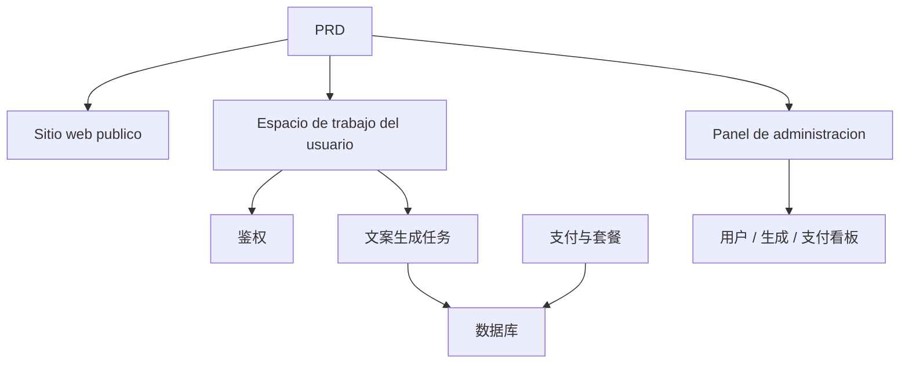

# AI 营销文案 SaaS 开发实战

## Descripcion general

Este proyecto practico te requiere trabajar con un PRD real，completar desde cero un面向独立开发者和内容团队的 AI 营销文案 SaaS 产品。你将使用 Supabase 作为后端服务、Stripe 作为支付系统，完成从Analisis de requisitos到Despliegue上线的全过程。

Esta es la seccion de practica integral de la Etapa 2。在前面几章中，你已经分别学习了前端页面搭建、后端接口开发、数据库操作、Integracion de pagos等单项技能——这个项目要求你把它们全部串起来，交付一个可运行的产品原型。

## Conocimientos previos

Antes de comenzar este proyecto, ya deberias dominar lo siguiente:

- Diseno de paginas frontend y uso de bibliotecas de componentes（[UI 设计](../../frontend/ui-design/)、[现代组件库](../../frontend/modern-component-library/)）
- Diseno y desarrollo de interfaces backend（[接口代码编写](../../backend/ai-interface-code/)）
- Fundamentos de bases de datos y Supabase（[从数据库到 Supabase](../../backend/database-supabase/)）
- Integracion de pagos（[Stripe 收费系统](../../backend/stripe-payment/)）
- Flujo de trabajo de Git y despliegue（[Git 和 GitHub](../../backend/git-workflow/)、[Despliegue Web 应用](../../backend/zeabur-deployment/)）

## Objetivos de aprendizaje

Despues de completar esta practica, podras:

1. Leer y comprender un PRD real, extrayendo una lista de tareas de desarrollo
2. 使用 AI 辅助分步Generar paginas frontend和后端接口
3. Usar Supabase para implementar autenticacion de usuarios y operaciones de base de datos
4. Integrar Stripe para implementar funcionalidad de suscripcion de pago
5. Construir un panel de administracion y completar la integracion de extremo a extremo

## Introduccion del proyecto

El producto que vas a construir es一个 AI 营销文案 SaaS，包含三个Subsistema：

| Subsistema | Responsabilidad |
|--------|------|
| **Sitio web publico** | Introduccion del producto, precios, FAQ, conversion de registro |
| **Espacio de trabajo del usuario** | Ingresar informacion del producto, generar textos, ver historial, mejorar plan |
| **Panel de administracion** | Gestion de usuarios, registros de generacion, datos de pago, resumen de operaciones |

El backend usa Supabase 提供数据库和鉴权能力，使用 Stripe 处理支付，使用 AI 模型生成营销文案。

::: tip PRD 入口
El documento de requisitos de este proyecto esta en GitHub： [Ver PRD](https://github.com/datawhalechina/easy-vibe/blob/main/docs/es-es/stage-2/assignments/copywriting-platform-supabase/PRD.md)
:::

<div style="margin: 32px 0;">
  <ClientOnly>
    <StepBar :active="0" :items="[
      { title: 'Analisis de requisitos', description: 'Leer el PRD，明确页面、功能、鉴权、支付范围' },
      { title: 'Construccion del esqueleto', description: '用 AI 生成三套前端骨架（www / app / admin）' },
      { title: '后端集成', description: 'Supabase 鉴权、生成接口、Stripe 支付' },
      { title: 'Integracion y despliegue', description: 'Verificar de extremo a extremo，Desplegar y preparar la demostracion' }
    ]" />
  </ClientOnly>
</div>

## Primera parte：Analisis de requisitos

### 1.1 Leer el PRD

打开 PRD 文档，重点回答以下问题：

- 系统有几个入口？各自覆盖哪些页面？
- 每个页面的核心功能是什么？
- 后端包含哪些模块和数据表？
- 套餐定价、支付流程、免费额度如何设计？
- MVP 范围是什么？第一版哪些做，哪些不做？

::: warning
Si no tienes respuestas claras a las preguntas anteriores, no comiences a escribir codigo. La comprension inadecuada de los requisitos es la causa mas comun de retrabajo.
:::

### 1.2 Confirmar la arquitectura del sistema

Segun el PRD, organiza la arquitectura general del sistema:



## Segunda parte：搭建项目骨架

### 2.1 Generar paginas frontend

使用 AI 先生成所有页面的基本结构和假数据。

Referencia de prompts：

```text
请基于当前 PRD，帮我生成一个 AI 营销文案 SaaS 的前端骨架。

要求：
1. 分成三个入口：www、app、admin
2. 官网包括：首页、定价、FAQ
3. app 包括：登录、注册、生成工作台、历史记录、套餐页
4. admin 包括：后台首页、用户管理、生成记录、支付订单
5. 先只生成页面结构和假数据，不接真实接口
6. 风格要像现代 SaaS，不像课堂 demo
```

### 2.2 Mejorar paginas clave

骨架搭好后，重点完善文案生成工作台（Dashboard）页面：

```text
请继续完善 /dashboard 页面。

这是一个 AI 营销文案工作台。

左侧表单字段：
- 产品名
- 一句话介绍
- 目标用户
- 3 个卖点
- 投放渠道（官网、朋友圈、小红书、抖音、邮件）

右侧结果区域预留：
- 主标题
- 副标题
- CTA
- 3 版短文案
- 长文案

先用 mock 数据跑通交互。

要求：
- 点击"生成文案"后有 loading 状态
- 结果区域设计空状态
- 响应式布局，宽屏窄屏都能正常显示
```

### 2.3 Verificar la estructura de paginas

Verificar item por item:

- [ ] 三个入口的路由是否独立
- [ ] 页面数量是否与 PRD 一致
- [ ] Dashboard 的表单和结果区域布局合理
- [ ] 假数据展示了基本的 UI 状态

### Encontraste un obstaculo?

Si te quedas atascado en la etapa de construccion del frontend, puedes revisar estos capitulos:

- [UI 设计](../../frontend/ui-design/)
- [参考 UI 设计规范设计页面和按钮](../../frontend/multi-product-ui/)
- [用 LLM 和 Skills 让界面变好看](../../frontend/llm-skills-beautiful/)
- [从设计原型到项目代码](../../frontend/design-to-code/)
- [使用现代组件库更新你的界面](../../frontend/modern-component-library/)

## Tercera parte：后端集成

### 3.1 接入 Supabase 登录

```text
Tratame como un principiante total，一步一步带我完成 Supabase 登录接入。

需要你帮我完成：
1. 项目接入 Supabase
2. 实现注册、登录、退出功能
3. 登录成功后跳转到 /dashboard
4. 未登录用户访问 /dashboard、/billing、/admin 时自动跳转 /login
5. 创建 profiles 表
6. 用户注册成功后自动在 profiles 表创建记录
7. profiles 表包含 email、role、plan 字段

实现要求：
- 每步都说明在修改哪些文件
- 密钥不要硬编码
- 需要在 Supabase 后台手动操作的地方请明确标注
- 完成后说明如何验证注册和登录
```

### 3.2 接入生成接口和数据库

```text
Tratame como un principiante total，帮我完成网站的核心功能：生成营销文案并保存。

目标效果：
1. 用户在 /dashboard 填写表单，点击"生成文案"
2. 后端接收：产品名、介绍、目标用户、卖点、投放渠道
3. 后端调用模型生成结果
4. 页面展示生成结果
5. 输入和输出都保存到数据库
6. 用户下次进入可查看历史记录

需要你完成：
- 创建生成接口 /api/generate
- 创建 generations 表
- 设计输入和输出字段
- Dashboard 页面读取当前用户的历史记录

用户体验：
- 按钮 loading 状态
- 生成失败时的错误提示
- 无历史记录时的空状态

完成后请说明：
- 前端页面文件位置
- 后端接口文件位置
- 数据写入数据库的逻辑位置
- 如何测试完整生成链路
```

### 3.3 接入 Stripe 付费

```text
Tratame como un principiante total，帮我给 LaunchKit 加上最简可用的 Stripe 付费。

不需要复杂系统，先跑通最基本的付费链路。

需要你完成：
1. /billing 页面展示 free 和 pro 两个套餐
2. 用户点击升级后跳转 Stripe Checkout
3. 支付成功后返回网站
4. 支付结果保存到 subscriptions 表
5. 同步更新 profile.plan 字段
6. free 用户每日限 3 次生成，pro 用户不限

实现原则：
- 先跑通主流程，暂不考虑复杂边界
- 需要在 Stripe 后台配置的地方请写清楚
- 完成后说明如何测试完整支付流程
```

### 3.4 搭建Panel de administracion

```text
Tratame como un principiante total，帮我做一个简洁可用的Panel de administracion。

仅限管理员访问。

需要你完成：
1. 仅 role = admin 的用户可访问 /admin
2. 后台包含 3 个 Tab：用户列表、生成记录、订阅状态
3. 用户列表显示：email、plan、创建时间
4. 生成记录显示：用户、产品名、渠道、创建时间
5. 订阅状态显示：用户、套餐、支付状态

要求：
- 界面简洁清晰
- 使用现有组件库的表格、Tab、Badge
- 完成后说明如何将账号设为 admin
```

### Encontraste un obstaculo?

如果你在Desarrollo backend阶段卡住，可以回顾这些章节：

- [从数据库到 Supabase](../../backend/database-supabase/)
- [大模型辅助编写接口代码与接口文档](../../backend/ai-interface-code/)
- [如何集成 Stripe 等收费系统](../../backend/stripe-payment/)

## Cuarta parte：联调与上线

### 4.1 Pruebas de extremo a extremo

Verificar al menos los siguientes escenarios:

- 注册 → 登录 → 生成文案 → 查看历史 → 升级套餐
- 管理员登录 → 查看用户数据 → 查看生成记录 → 查看支付状态

Verificacion antes del despliegue:

```text
Tratame como un principiante total，帮我Item de verificacion目是否具备Despliegue条件。

检查重点：
- 环境变量是否完整
- 登录回调地址是否正确
- Stripe 支付回调地址是否正确
- 页面是否缺少 loading、空状态、错误提示
- README 是否包含启动说明和Despliegue说明

需要你：
1. 按优先级列出待修复事项
2. 标注哪些必须先修
3. 说明修复后的Despliegue步骤
```

### 4.2 Despliegue

Desplegar el proyecto en un entorno publico. Tutorial de despliegue de referencia:[Git 和 GitHub 工作流](../../backend/git-workflow/)、[如何Despliegue Web 应用](../../backend/zeabur-deployment/)。

## Entregables

Despues de completar este proyecto, necesitas enviar lo siguiente:

- [ ] Enlace de demostracion en linea accesible
- [ ] Enlace al repositorio de codigo fuente (incluyendo README)
- [ ] PRD 文档
- [ ] Capturas de pantalla de paginas clave（首页、Dashboard、Billing、Admin）
- [ ] 60 segundos de video de demostracion（覆盖注册 → 生成 → 支付 → 后台）

README 至少包含：Introduccion del proyecto、核心页面说明、技术栈、本地启动步骤、环境变量清单。

## Criterios de evaluacion

| 维度 | Requisitos basicos | Requisitos avanzados |
|------|---------|---------|
| 产品完整度 | 首页、登录、Dashboard、Billing、Admin 都能访问 | 首页文案和视觉风格像真实 SaaS |
| Ciclo completo del negocio | 注册 → 登录 → 生成 → 查看历史可以跑通 | 免费/Pro 权限差异清晰可见 |
| Correccion de datos | 生成结果和支付状态都写入数据库 | 有明确的错误提示、空状态和 loading |
| Permisos y seguridad | 未登录不能访问受保护页面，普通用户不能进 Admin | 有基本的输入校验和服务端鉴权 |
| Entrega de ingenieria | 项目可本地启动，也可Despliegue到公网 | README 清楚，演示视频结构完整 |

::: tip
如果你觉得任务太大，记住一个原则：**先保证"能跑通"，再去追求"做漂亮"。**
:::

## Verificacion antes de enviar

<el-card shadow="hover" style="margin: 20px 0; border-radius: 12px;">
  <template #header>
    <div style="font-weight: bold; font-size: 16px;">提交前最后看一眼</div>
  </template>

  <ul style="list-style-type: none; padding-left: 0;">
    <li><label><input type="checkbox" disabled /> 首页、登录页、Dashboard、Billing、Admin 均已完成</label></li>
    <li><label><input type="checkbox" disabled /> 用户可以注册、登录、退出</label></li>
    <li><label><input type="checkbox" disabled /> 生成结果真实写入数据库</label></li>
    <li><label><input type="checkbox" disabled /> 支付主流程已跑通</label></li>
    <li><label><input type="checkbox" disabled /> 管理员可查看用户、生成记录和支付状态</label></li>
    <li><label><input type="checkbox" disabled /> 项目已Despliegue到公网</label></li>
  </ul>
</el-card>

## Referencias

- [UI 设计](../../frontend/ui-design/)
- [参考 UI 设计规范设计页面和按钮](../../frontend/multi-product-ui/)
- [用 LLM 和 Skills 让界面变好看](../../frontend/llm-skills-beautiful/)
- [从设计原型到项目代码](../../frontend/design-to-code/)
- [使用现代组件库更新你的界面](../../frontend/modern-component-library/)
- [从数据库到 Supabase](../../backend/database-supabase/)
- [大模型辅助编写接口代码与接口文档](../../backend/ai-interface-code/)
- [Git 和 GitHub 工作流](../../backend/git-workflow/)
- [如何Despliegue Web 应用](../../backend/zeabur-deployment/)
- [如何集成 Stripe 等收费系统](../../backend/stripe-payment/)
