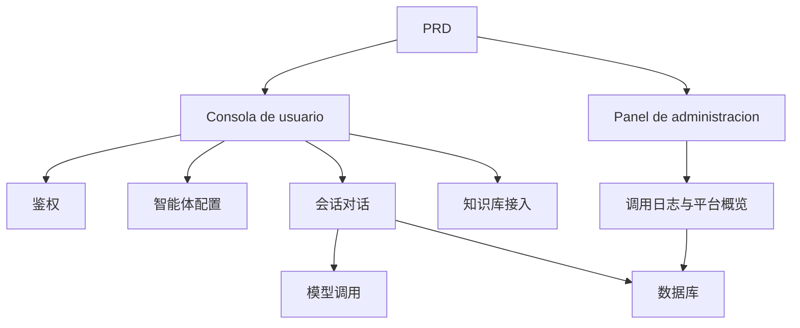

# 类 Dify 智能体平台开发实战

## Descripcion general

Este proyecto practico te requiere trabajar con un PRD real，completar desde cero un模仿 Dify 核心体验的智能体平台。你将构建Consola de usuario、Panel de administracion和平台后端，实现智能体管理、对话、日志和知识库等核心功能。

Esta es la seccion de practica integral de la Etapa 2。与前面的单页面或单功能项目不同，这个项目要求你构建一个有"平台感"的 AI 产品——包含多角色、多模块、数据持久化和模型调用链路。

## Conocimientos previos

Antes de comenzar este proyecto, ya deberias dominar lo siguiente:

- Diseno de paginas frontend y uso de bibliotecas de componentes（[UI 设计](../../frontend/ui-design/)、[现代组件库](../../frontend/modern-component-library/)）
- Diseno y desarrollo de interfaces backend（[接口代码编写](../../backend/ai-interface-code/)）
- Fundamentos de bases de datos y Supabase（[从数据库到 Supabase](../../backend/database-supabase/)）
- Flujo de trabajo de Git y despliegue（[Git 和 GitHub](../../backend/git-workflow/)、[Despliegue Web 应用](../../backend/zeabur-deployment/)）

## Objetivos de aprendizaje

Despues de completar esta practica, podras:

1. Leer y comprender un PRD real, extrayendo una lista de tareas de desarrollo
2. Disenar la arquitectura de paginas y el modelo de datos de una plataforma de agentes
3. Implementar el ciclo completo de creacion de agentes, conversacion y registro de logs
4. Usar IA para asistir en el desarrollo de productos tipo plataforma
5. Completar la integracion de extremo a extremo, entregando un prototipo de plataforma IA demostrable

## Introduccion del proyecto

El producto que vas a construir es一个类 Dify 智能体平台，包含两个Subsistema：

| Subsistema | Responsabilidad |
|--------|------|
| **Consola de usuario** | Crear agentes, configurar Prompt, iniciar conversaciones, ver registros, gestionar base de conocimientos |
| **Panel de administracion** | Ver datos de usuarios, uso de recursos de la plataforma, estadisticas de llamadas |

后端necesita soportar las siguientes capacidades centrales：Gestion de agentes, gestion de sesiones, almacenamiento de mensajes, llamadas a modelos, registro de llamadas, integracion de base de conocimientos。

::: tip PRD 入口
El documento de requisitos de este proyecto esta en GitHub： [Ver PRD](https://github.com/datawhalechina/easy-vibe/blob/main/docs/es-es/stage-2/assignments/custom-dify-agent-platform/PRD.md)
:::

<div style="margin: 32px 0;">
  <ClientOnly>
    <StepBar :active="0" :items="[
      { title: 'Analisis de requisitos', description: 'Leer el PRD，明确页面、能力边界、鉴权、数据模型' },
      { title: 'Construccion del esqueleto', description: '用 AI 生成Consola de usuario和Panel de administracion骨架' },
      { title: 'Desarrollo iterativo', description: '逐模块补充智能体、对话、日志、知识库' },
      { title: 'Integracion y despliegue', description: 'Verificar de extremo a extremo，Desplegar y preparar la demostracion' }
    ]" />
  </ClientOnly>
</div>

## Primera parte：Analisis de requisitos

### 1.1 Leer el PRD

打开 PRD 文档，重点回答以下问题：

- 智能体、会话、日志、知识库哪些要进 MVP？
- 页面和路由清单是否拍板？
- 模型调用和日志记录的边界是什么？
- 多租户和复杂工作流是否先不做？

::: warning
Si no tienes respuestas claras a las preguntas anteriores, no comiences a escribir codigo. La comprension inadecuada de los requisitos es la causa mas comun de retrabajo.
:::

### 1.2 Confirmar la arquitectura del sistema

Segun el PRD, organiza la arquitectura general del sistema:



## Segunda parte：搭建项目骨架

### 2.1 Generar paginas frontend

Referencia de prompts：

```text
请基于当前 PRD，帮我生成一个类 Dify 智能体平台的前端骨架。

要求：
1. 用户侧包括：登录、智能体列表、智能体配置、对话页、日志页、知识库页
2. 后台侧包括：后台首页、用户概览、资源使用概览
3. 先只生成页面结构和假数据，不接真实接口
4. 风格要像现代 AI 平台
```

### 2.2 Verificar la estructura de paginas

Verificar item por item:

- [ ] Consola de usuario和Panel de administracion入口是否分开
- [ ] 智能体列表、配置、对话、日志、知识库页面是否完整
- [ ] Panel de administracion首页、用户概览页面是否可访问
- [ ] 假数据展示了基本的 UI 状态

## Tercera parte：Desarrollo iterativo

### 3.1 Avanzar por modulos

在骨架的基础上，按以下顺序逐模块补充功能：

1. **鉴权**：注册、登录、角色区分
2. **智能体管理**：创建、编辑、删除、Prompt 配置
3. **对话功能**：会话创建、消息收发、模型调用
4. **日志记录**：耗时、token 用量、错误记录
5. **知识库接入**（加分项）：文档上传、检索、结果注入
6. **Panel de administracion**：用户数据、资源使用、调用统计

每完成一个模块，使用下表进行自检：

| Item de verificacion | Metodo de verificacion |
|--------|----------|
| 页面一致性 | 页面数量、功能是否符合 PRD |
| 接口闭环 | agents、chat、logs、knowledge 接口是否完整 |
| Aislamiento de permisos | 用户是否只能管理自己的 agent 和会话 |
| Consistencia de datos | messages、logs、documents 数据是否对得上 |
| Demostrabilidad | 是否能演示"创建 agent → 对话 → 查看日志"完整链路 |

### 3.2 知识库接入（加分项）

如果你想增加知识库能力，可以给每个智能体增加一个"知识库开关"：

- 开启后先检索知识片段，再和用户问题一起发送给模型
- 关闭后按普通对话模式响应

第一版不必追求复杂 RAG，只要有"检索结果可见、调用链路可解释"即可。

## Cuarta parte：联调与上线

### 4.1 Pruebas de extremo a extremo

Verificar al menos los siguientes escenarios:

- 注册 → 创建智能体 → 配置 Prompt → 发起对话 → 查看日志
- 管理员登录 → 查看用户数据 → 查看调用统计

Verificacion antes del despliegue:

- [ ] 所有核心接口都做了登录校验
- [ ] 智能体归属权限检查通过
- [ ] 会话记录、日志记录真实落库
- [ ] 模型 Key 使用环境变量，不硬编码
- [ ] 错误提示可在前端看到，不只打控制台

### 4.2 Despliegue

Desplegar el proyecto en un entorno publico. Tutorial de despliegue de referencia:[Git 和 GitHub 工作流](../../backend/git-workflow/)、[如何Despliegue Web 应用](../../backend/zeabur-deployment/)。

## Entregables

Despues de completar este proyecto, necesitas enviar lo siguiente:

- [ ] Enlace de demostracion en linea accesible
- [ ] Enlace al repositorio de codigo fuente (incluyendo README)
- [ ] PRD 文档
- [ ] Capturas de pantalla de paginas clave（智能体管理页、对话页、日志页、后台首页）
- [ ] 60 segundos de video de demostracion（覆盖创建智能体 → 对话 → 查看日志）

README 至少包含：Introduccion del proyecto、架构说明、技术栈、本地启动步骤、环境变量清单、接口说明。

## Criterios de evaluacion

| 维度 | Requisitos basicos | Requisitos avanzados |
|------|---------|---------|
| 平台完整度 | agents / chat / logs 三页可用 | 有清晰导航与统一设计语言 |
| Ciclo completo del negocio | 可创建智能体并真实对话 | 支持多智能体切换与历史会话 |
| 数据与追踪 | 消息与调用日志可查询 | 有 token / 耗时统计看板 |
| 权限安全 | 仅登录用户可访问核心接口 | 资源归属校验完善 |
| Entrega de ingenieria | 可Despliegue、可演示、README 清晰 | 接入知识库并可解释检索结果 |

## Verificacion antes de enviar

<el-card shadow="hover" style="margin: 20px 0; border-radius: 12px;">
  <template #header>
    <div style="font-weight: bold; font-size: 16px;">提交前最后看一眼</div>
  </template>

  <ul style="list-style-type: none; padding-left: 0;">
    <li><label><input type="checkbox" disabled /> 登录后可访问智能体管理、对话、日志页面</label></li>
    <li><label><input type="checkbox" disabled /> 至少可以创建 1 个智能体并成功对话</label></li>
    <li><label><input type="checkbox" disabled /> 每轮问答都能在数据库查到记录</label></li>
    <li><label><input type="checkbox" disabled /> 调用失败时前端可见错误信息且日志已记录</label></li>
    <li><label><input type="checkbox" disabled /> El proyecto esta desplegado, README y video de demostracion completos</label></li>
  </ul>
</el-card>

## Referencias

- [UI 设计](../../frontend/ui-design/)
- [使用现代组件库更新你的界面](../../frontend/modern-component-library/)
- [从数据库到 Supabase](../../backend/database-supabase/)
- [大模型辅助编写接口代码与接口文档](../../backend/ai-interface-code/)
- [Git 和 GitHub 工作流](../../backend/git-workflow/)
- [如何Despliegue Web 应用](../../backend/zeabur-deployment/)
