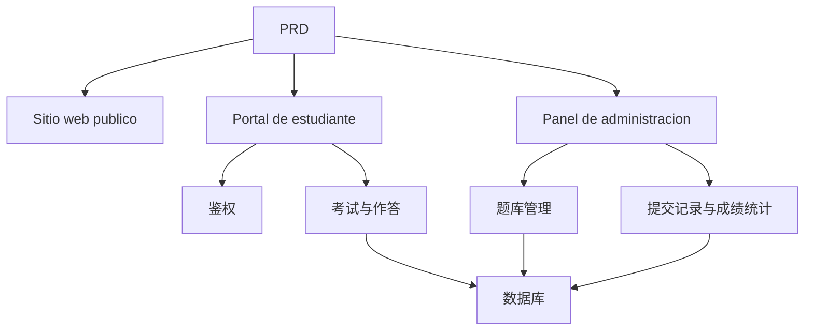

# 在线考试与管理系统开发实战

## Descripcion general

Este proyecto practico te requiere trabajar con un PRD real，completar desde cero un在线考试与管理系统。这个项目的特别之处在于它包含多个角色（学生和管理员），每个角色看到的页面和能执行的操作不同。你将使用 Express 构建后端，实现完整的考试业务链路。

Esta es la seccion de practica integral de la Etapa 2。多角色权限系统在实际工作中非常常见，掌握这种模式后，你能够应对教培、SaaS、后台管理等各类业务场景。

## Conocimientos previos

Antes de comenzar este proyecto, ya deberias dominar lo siguiente:

- Diseno de paginas frontend y uso de bibliotecas de componentes（[UI 设计](../../frontend/ui-design/)、[现代组件库](../../frontend/modern-component-library/)）
- Diseno y desarrollo de interfaces backend（[接口代码编写](../../backend/ai-interface-code/)）
- Fundamentos de bases de datos y Supabase（[从数据库到 Supabase](../../backend/database-supabase/)）
- Flujo de trabajo de Git y despliegue（[Git 和 GitHub](../../backend/git-workflow/)、[Despliegue Web 应用](../../backend/zeabur-deployment/)）

## Objetivos de aprendizaje

Despues de completar esta practica, podras:

1. Leer y comprender un PRD real, extrayendo una lista de tareas de desarrollo
2. 设计多角色系统的Control de permisos和页面路由
3. Usar Express para implementar una API backend completa
4. Implementar el flujo de negocio de examenes, envio y calificacion automatica
5. Completar la integracion de extremo a extremo, entregando un prototipo de sistema empresarial demostrable

## Introduccion del proyecto

El producto que vas a construir es一个在线考试与管理系统，包含三个Subsistema：

| Subsistema | Responsabilidad |
|--------|------|
| **Sitio web publico** | Introduccion de la plataforma, entrada de login |
| **Portal de estudiante** | Lista de examenes, responder preguntas, enviar, ver calificaciones |
| **Panel de administracion** | Gestion del banco de preguntas, gestion de examenes, registros de envio, estadisticas de calificaciones |

El backend usa Express，需要支持：登录鉴权、角色权限、考试和题库管理、提交流程与自动判分、成绩和统计管理。

::: tip PRD 入口
El documento de requisitos de este proyecto esta en GitHub： [Ver PRD](https://github.com/datawhalechina/easy-vibe/blob/main/docs/es-es/stage-2/assignments/exam-management-express/PRD.md)
:::

<div style="margin: 32px 0;">
  <ClientOnly>
    <StepBar :active="0" :items="[
      { title: 'Analisis de requisitos', description: 'Leer el PRD，明确角色、页面、考试链路和数据模型' },
      { title: 'Construccion del esqueleto', description: '用 AI 生成Portal de estudiante和Portal de administracion页面骨架' },
      { title: 'Desarrollo backend', description: 'Express 接通登录、考试、提交、判分' },
      { title: 'Integracion y despliegue', description: 'Verificar de extremo a extremo，Desplegar y preparar la demostracion' }
    ]" />
  </ClientOnly>
</div>

## Primera parte：Analisis de requisitos

### 1.1 Leer el PRD

打开 PRD 文档，重点回答以下问题：

- Cuales roles tiene el sistema? Que puede hacer cada uno?
- 页面清单是否完整？Portal de estudiante和Portal de administracion分别有哪些页面？
- Que tipos de preguntas se soportan? Cual es la logica de calificacion para cada tipo?
- Cual es el flujo completo del examen? (Publicar -> Comenzar -> Responder -> Enviar -> Calificar -> Ver calificaciones)

::: warning
Si no tienes respuestas claras a las preguntas anteriores, no comiences a escribir codigo. La comprension inadecuada de los requisitos es la causa mas comun de retrabajo.
:::

### 1.2 Confirmar la arquitectura del sistema

Segun el PRD, organiza la arquitectura general del sistema:



## Segunda parte：搭建项目骨架

### 2.1 Generar paginas frontend

Referencia de prompts：

```text
请基于当前 PRD，帮我生成一个在线考试与管理系统的前端骨架。

技术栈要求：
- Next.js App Router
- TypeScript
- Tailwind CSS
- shadcn/ui

页面清单：
1. 首页 /
2. 登录页 /login
3. 学生考试列表页 /student/exams
4. 学生答题页 /student/exams/[id]
5. 学生成绩页 /student/history
6. Panel de administracion首页 /admin
7. 考试管理页 /admin/exams
8. 题库管理页 /admin/questions
9. 提交记录页 /admin/submissions

要求：
- Portal de estudiante页面强调清晰、专注、易答题
- Portal de administracion页面使用侧边栏 + 顶部栏布局
- 先使用 mock 数据，不接真实接口
- 注意桌面端和移动端的基本可用性
```

### 2.2 完善学生答题页

答题页是Portal de estudiante的核心页面，重点完善：

```text
请继续完善学生答题页。

这是一个在线考试系统的答题页面，需要包含：
- 顶部显示考试标题、倒计时、已答题数量
- 中间显示题干和选项
- 支持单选、判断、简答三种题型
- 左侧或顶部有答题卡，显示每道题是否已作答
- 点击提交前弹出确认框

先用 mock 数据实现交互，不接真实接口。

要求：
- 界面简洁，不要像后台表格页
- 倒计时要醒目，但不要制造过强压迫感
- 有空状态和 loading 状态
```

### 2.3 Mejorar el backend de administracion

管理员后台第一版聚焦三个核心区域：

- **考试管理**：创建考试、设置时长、发布状态
- **题库管理**：新增题目、编辑题目、按题型筛选
- **提交记录**：查看学生提交、分数、时间

### 2.4 Verificar la estructura de paginas

Verificar item por item:

- [ ] Portal de estudiante和Portal de administracion入口是否分开
- [ ] 登录页、考试列表、答题页、成绩页是否完整
- [ ] Portal de administracion题库、考试管理、提交记录页是否可访问
- [ ] Portal de estudiante和Portal de administracion的页面风格有明显区分

### Encontraste un obstaculo?

Si te quedas atascado en la etapa de construccion del frontend, puedes revisar estos capitulos:

- [从数据库到 Supabase](../../backend/database-supabase/)
- [应用Diseno y desarrollo de interfaces backend](../../backend/ai-interface-code/)
- [使用现代组件库更新你的界面](../../frontend/modern-component-library/)

## Tercera parte：Desarrollo backend

### 3.1 登录与Control de permisos

```text
Tratame como un principiante total，帮我完成在线考试系统的登录与Control de permisos。

El backend usa Express。

目标：
1. 学生和管理员都可以登录
2. 登录后返回用户角色
3. 学生只能访问 /student/* 相关接口
4. 管理员只能访问 /admin/* 相关接口
5. 未登录用户访问受保护页面时跳转 /login

实现要求：
- 给出清晰的目录结构建议
- 明确说明中间件负责什么
- 涉及环境变量的地方不要硬编码
- 完成后说明如何验证权限是否生效
```

### 3.2 考试与题库管理接口

建议按以下模块实现：

| 模块 | 推荐接口 |
|------|----------|
| 考试管理 | `GET /api/exams`、`POST /api/admin/exams`、`PATCH /api/admin/exams/:id` |
| 题库管理 | `GET /api/admin/questions`、`POST /api/admin/questions` |
| 开始考试 | `POST /api/submissions/start` |
| 提交试卷 | `POST /api/submissions/:id/submit` |
| 成绩记录 | `GET /api/student/history`、`GET /api/admin/submissions` |

Referencia de prompts：

```text
请帮我为在线考试系统设计并实现 Express API。

功能范围：
- 管理员创建考试
- 管理员维护题库
- 学生查看已发布考试
- 学生开始考试并创建 submission
- 学生提交答案后自动判分单选题和判断题
- 简答题先标记为待复核
- 学生查看自己的历史成绩
- 管理员查看所有提交记录

要求：
- 接口命名清晰
- 返回统一 JSON 结构
- 代码中区分 controller、service、middleware、db 层
- 说明每个接口如何测试
```

### 3.3 判分逻辑

判分逻辑是考试系统的核心业务规则：

- **单选题**：用户答案与标准答案一致则得分
- **判断题**：同样可以自动判分
- **简答题**：第一版先只保存答案，分数为空，状态为 `reviewed = false`

::: tip 加分项
如果你想增加 AI 能力，可以让管理员在后台输入"主题 + 难度"，由模型先生成一批候选题，再人工审核后入库。但这属于加分项，不是必须的。
:::

## Cuarta parte：联调与上线

### 4.1 Pruebas de extremo a extremo

Verificar al menos los siguientes escenarios:

- 学生登录 → 查看考试列表 → 开始答题 → 提交 → 查看成绩
- 管理员登录 → 创建考试 → 添加题目 → 发布 → 查看提交记录

### 4.2 Despliegue

- 前端Despliegue到 Vercel / Zeabur
- Express API Despliegue到 Zeabur / Railway / Render
- 数据库用 Supabase Postgres 或托管 PostgreSQL

Verificacion antes del despliegue:

- [ ] 环境变量是否齐全
- [ ] 前后端 API 地址是否正确
- [ ] 登录态在生产环境是否正常
- [ ] 管理员账号是否能真实访问后台
- [ ] README 是否包含启动、Despliegue、测试说明

## Entregables

Despues de completar este proyecto, necesitas enviar lo siguiente:

- [ ] Enlace de demostracion en linea accesible
- [ ] Enlace al repositorio de codigo fuente (incluyendo README)
- [ ] PRD 文档
- [ ] Capturas de pantalla de paginas clave（首页、学生考试列表、答题页、Panel de administracion）
- [ ] 60 segundos de video de demostracion（覆盖学生答题流程和管理员管理流程）

README 至少包含：Introduccion del proyecto、核心页面说明、技术栈、本地启动步骤、环境变量清单。

## Criterios de evaluacion

| 维度 | Requisitos basicos | Requisitos avanzados |
|------|---------|---------|
| Completitud de paginas | Portal de estudiante和Portal de administracion主要页面都可访问 | 页面风格统一，移动端基本可用 |
| Ciclo completo del negocio | 学生可登录、参加考试、提交并查看成绩 | 管理员可完整创建并发布考试 |
| Correccion de datos | 提交答案后能写入数据库，客观题能自动判分 | 简答题支持人工复核或 AI 辅助 |
| Control de permisos | 学生与管理员访问边界清晰 | 服务端接口也有角色校验 |
| Entrega de ingenieria | 项目可运行、可Despliegue、README 清晰 | 有演示视频和测试说明 |

## Verificacion antes de enviar

<el-card shadow="hover" style="margin: 20px 0; border-radius: 12px;">
  <template #header>
    <div style="font-weight: bold; font-size: 16px;">提交前最后看一眼</div>
  </template>

  <ul style="list-style-type: none; padding-left: 0;">
    <li><label><input type="checkbox" disabled /> 首页、登录页、Portal de estudiante、Portal de administracion页面均已完成</label></li>
    <li><label><input type="checkbox" disabled /> 学生可以正常开始考试并提交答案</label></li>
    <li><label><input type="checkbox" disabled /> 管理员可以创建考试并查看提交记录</label></li>
    <li><label><input type="checkbox" disabled /> 客观题分数能够自动计算并写入数据库</label></li>
    <li><label><input type="checkbox" disabled /> 学生与管理员权限边界已验证</label></li>
    <li><label><input type="checkbox" disabled /> El proyecto esta desplegado o tiene instrucciones completas para ejecucion local</label></li>
  </ul>
</el-card>

## Referencias

- [UI 设计](../../frontend/ui-design/)
- [使用现代组件库更新你的界面](../../frontend/modern-component-library/)
- [从数据库到 Supabase](../../backend/database-supabase/)
- [大模型辅助编写接口代码与接口文档](../../backend/ai-interface-code/)
- [Git 和 GitHub 工作流](../../backend/git-workflow/)
- [如何Despliegue Web 应用](../../backend/zeabur-deployment/)
