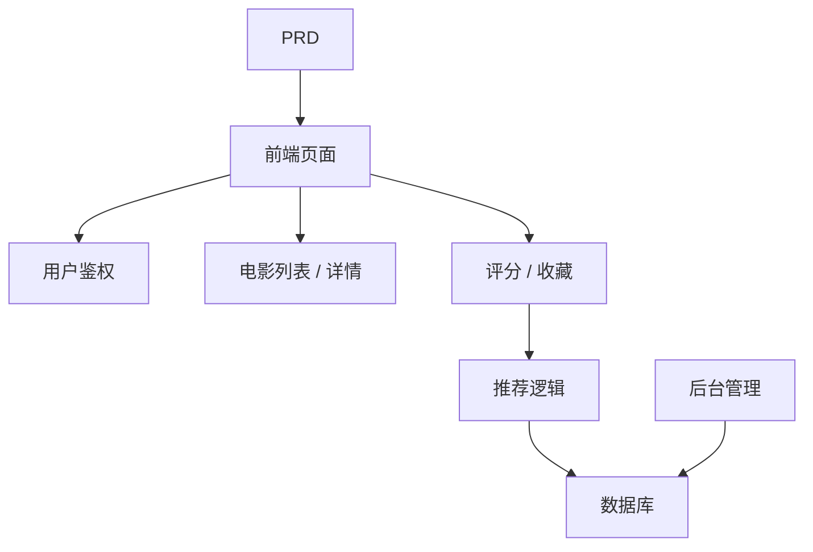

# Spring Boot 电影推荐系统开发实战

## Descripcion general

Este proyecto practico te requiere trabajar con un PRD real，使用 Spring Boot 完成一个带推荐能力的电影网站。这个项目的核心挑战在于：它不是简单的增删改查，而是需要你思考"用户行为如何影响推荐结果"以及"推荐如何可解释"。

Esta es la seccion de practica integral de la Etapa 2。你将第一次接触"内容 + 行为 + 推荐"型产品的开发模式，这种模式在电商、内容平台、个性化 Feed 等场景中非常常见。

## Conocimientos previos

Antes de comenzar este proyecto, ya deberias dominar lo siguiente:

- Diseno de paginas frontend y uso de bibliotecas de componentes（[UI 设计](../../frontend/ui-design/)、[现代组件库](../../frontend/modern-component-library/)）
- Diseno y desarrollo de interfaces backend（[接口代码编写](../../backend/ai-interface-code/)）
- Fundamentos de bases de datos y Supabase（[从数据库到 Supabase](../../backend/database-supabase/)）
- Flujo de trabajo de Git y despliegue（[Git 和 GitHub](../../backend/git-workflow/)、[Despliegue Web 应用](../../backend/zeabur-deployment/)）

## Objetivos de aprendizaje

Despues de completar esta practica, podras:

1. Leer el PRD 并从中提取推荐系统的开发任务清单
2. Usar Spring Boot para construir un proyecto backend e implementar API RESTful
3. Disenar el flujo de datos completo de "comportamiento del usuario -> recomendacion"
4. Implementar logica de recomendacion explicable
5. Completar la integracion de extremo a extremo, entregando un prototipo de producto demostrable

## Introduccion del proyecto

El producto que vas a construir es一个带推荐能力的电影网站：

| 功能 | 描述 |
|------|------|
| **Navegacion y busqueda** | Los usuarios pueden navegar y buscar peliculas |
| **Calificacion y favoritos** | Los usuarios pueden calificar peliculas y agregar a favoritos |
| **Recomendacion personalizada** | El sistema proporciona resultados de recomendacion basados en el comportamiento del usuario |
| **Panel de administracion** | Los administradores mantienen datos de peliculas y ven la efectividad de las recomendaciones |

::: tip PRD 入口
El documento de requisitos de este proyecto esta en GitHub： [Ver PRD](https://github.com/datawhalechina/easy-vibe/blob/main/docs/es-es/stage-2/assignments/movie-recommendation-springboot/PRD.md)
:::

<div style="margin: 32px 0;">
  <ClientOnly>
    <StepBar :active="0" :items="[
      { title: 'Analisis de requisitos', description: 'Leer el PRD，明确推荐策略、行为数据和后台范围' },
      { title: 'Construccion del esqueleto', description: '用 AI 生成列表页、详情页、推荐页和后台页' },
      { title: 'Desarrollo iterativo', description: '补充推荐逻辑、行为记录和后台管理' },
      { title: 'Integracion y despliegue', description: 'Verificar de extremo a extremo，Desplegar y preparar la demostracion' }
    ]" />
  </ClientOnly>
</div>

## Primera parte：Analisis de requisitos

### 1.1 Leer el PRD

打开 PRD 文档，重点回答以下问题：

- 推荐策略是什么？第一版是否使用可解释版本（如基于评分相似度）？
- 用户行为数据要存哪些？（评分、收藏、浏览记录等）
- 管理员需要看哪些推荐效果指标？
- 页面清单是否完整？

::: warning
Si no tienes respuestas claras a las preguntas anteriores, no comiences a escribir codigo. La comprension inadecuada de los requisitos es la causa mas comun de retrabajo.
:::

### 1.2 Confirmar la arquitectura del sistema



## Segunda parte：搭建项目骨架

### 2.1 Generar paginas frontend

Referencia de prompts：

```text
请基于当前 PRD，帮我生成一个 Spring Boot 电影推荐系统的前端骨架。

要求：
1. 页面包括：首页、电影列表、电影详情、推荐页、个人中心、后台管理
2. 先只生成页面结构和假数据，不接真实接口
3. 风格要像真实内容产品，而不是课堂 demo
```

### 2.2 Verificar la estructura de paginas

Verificar item por item:

- [ ] 电影列表页支持搜索和筛选
- [ ] 电影详情页包含评分和收藏按钮
- [ ] 推荐页能展示推荐结果和推荐理由
- [ ] Panel de administracion能展示电影数据和推荐效果

## Tercera parte：Desarrollo iterativo

### 3.1 Avanzar por modulos

1. **Spring Boot 项目搭建**：项目结构、数据库配置、基础 CRUD
2. **电影数据管理**：电影列表、详情、搜索接口
3. **用户行为**：评分、收藏接口，行为数据写入
4. **推荐逻辑**：基于用户行为的推荐算法实现
5. **推荐展示**：推荐结果展示，包含推荐理由
6. **Panel de administracion**：电影数据维护、推荐效果查看

### 3.2 Autoverificacion de modulos

| Item de verificacion | Metodo de verificacion |
|--------|----------|
| 基础功能 | 列表、详情、评分、收藏是否闭环 |
| 推荐联动 | 用户行为是否影响推荐结果 |
| 推荐可解释性 | 用户能理解为什么被推荐这些电影 |
| 后台数据 | 管理员能查看电影数据和推荐效果 |

## Cuarta parte：联调与上线

### 4.1 Pruebas de extremo a extremo

Verificar al menos los siguientes escenarios:

- 浏览电影 → 评分 → 收藏 → 查看推荐页，确认推荐结果发生变化
- 管理员登录 → 添加电影 → 查看推荐效果统计

## Entregables

Despues de completar este proyecto, necesitas enviar lo siguiente:

- [ ] Enlace de demostracion en linea accesible
- [ ] Enlace al repositorio de codigo fuente (incluyendo README)
- [ ] PRD 文档
- [ ] Capturas de pantalla de paginas clave（电影列表、电影详情、推荐页、Panel de administracion）
- [ ] 60 segundos de video de demostracion

## Criterios de evaluacion

| 维度 | Requisitos basicos | Requisitos avanzados |
|------|---------|---------|
| Alineacion con PRD | 页面、功能、数据结构基本符合 PRD | 能清晰说明设计决策 |
| Ciclo completo del producto | 浏览 → 评分 → 收藏 → 推荐可跑通 | 评分行为明显影响推荐结果 |
| 推荐质量 | 推荐结果合理、推荐理由可解释 | 支持多种推荐策略 |
| Capacidades del backend | 电影数据和推荐效果可查看 | 有推荐准确率等统计指标 |
| Completitud de ingenieria | 前端、Spring Boot 后端、数据库链路已接通 | 推荐接口有缓存或性能优化 |

## Referencias

- [UI 设计](../../frontend/ui-design/)
- [使用现代组件库更新你的界面](../../frontend/modern-component-library/)
- [从数据库到 Supabase](../../backend/database-supabase/)
- [大模型辅助编写接口代码与接口文档](../../backend/ai-interface-code/)
- [Git 和 GitHub 工作流](../../backend/git-workflow/)
- [如何Despliegue Web 应用](../../backend/zeabur-deployment/)
