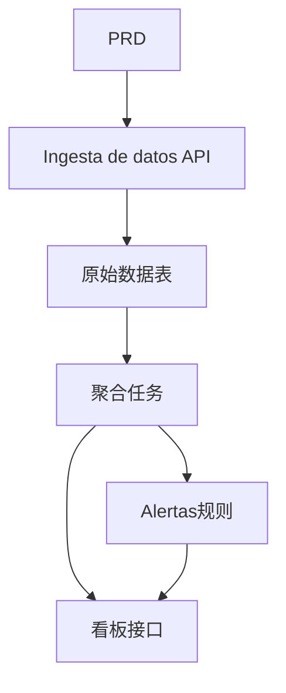

# Go 交通数据分析平台开发实战

## Descripcion general

Este proyecto practico te requiere trabajar con un PRD real，使用 Go 完成一个交通数据分析平台。这个项目的方向与前面的增删改查系统不同——你需要构建一条"Ingesta de datos → 聚合 → Alertas → 可视化"的完整数据链路。这种数据产品在 IoT、监控、运营分析等场景中非常常见。

Esta es la seccion de practica integral de la Etapa 2，也是你第一次接触 Go 语言。不用担心，有了前面 JavaScript / TypeScript 的基础，学习 Go 并不难——重点是理解数据链路的设计思路。

## Conocimientos previos

Antes de comenzar este proyecto, ya deberias dominar lo siguiente:

- Diseno de paginas frontend y uso de bibliotecas de componentes（[UI 设计](../../frontend/ui-design/)、[现代组件库](../../frontend/modern-component-library/)）
- Diseno y desarrollo de interfaces backend（[接口代码编写](../../backend/ai-interface-code/)）
- Fundamentos de bases de datos y Supabase（[从数据库到 Supabase](../../backend/database-supabase/)）
- Flujo de trabajo de Git y despliegue（[Git 和 GitHub](../../backend/git-workflow/)、[Despliegue Web 应用](../../backend/zeabur-deployment/)）

## Objetivos de aprendizaje

Despues de completar esta practica, podras:

1. Leer el PRD 并提取数据产品的开发任务清单
2. Usar Go (Gin o Fiber) para construir un servicio API backend
3. 设计Ingesta de datos、窗口聚合和Alertas的完整链路
4. Mantener la consistencia entre los datos del backend y el dashboard frontend
5. Completar la integracion de extremo a extremo, entregando un prototipo de producto de datos demostrable

## Introduccion del proyecto

El producto que vas a construir es一个 Go 交通数据分析平台：

| 模块 | Responsabilidad |
|------|------|
| **Ingesta de datos** | Recibir eventos de trafico sin procesar y almacenarlos |
| **Agregacion de datos** | Calcular tendencias e indicadores de congestion por ventana de tiempo |
| **Alertas** | 基于规则生成Alertas记录 |
| **Visualizacion de dashboard** | 在前端展示趋势图、排行榜和Alertas列表 |

::: tip PRD 入口
El documento de requisitos de este proyecto esta en GitHub： [Ver PRD](https://github.com/datawhalechina/easy-vibe/blob/main/docs/es-es/stage-2/assignments/traffic-data-visualization-go/PRD.md)
:::

<div style="margin: 32px 0;">
  <ClientOnly>
    <StepBar :active="0" :items="[
      { title: 'Analisis de requisitos', description: 'Leer el PRD，明确数据来源、指标口径和Alertas规则' },
      { title: 'Construccion del esqueleto', description: '用 AI 生成 Go API 服务和前端看板骨架' },
      { title: 'Desarrollo iterativo', description: '补充聚合逻辑、Alertas规则和看板接口' },
      { title: 'Integracion y despliegue', description: 'Verificar de extremo a extremo，Desplegar y preparar la demostracion' }
    ]" />
  </ClientOnly>
</div>

## Primera parte：Analisis de requisitos

### 1.1 Leer el PRD

打开 PRD 文档，重点回答以下问题：

- 数据来源是什么？字段有哪些？
- 核心指标的定义是什么？（比如"拥堵"的具体标准）
- Alertas规则是什么？第一版是否先收敛到简单规则？
- 看板包含哪些页面和图表？

::: warning
Si no tienes respuestas claras a las preguntas anteriores, no comiences a escribir codigo. La comprension inadecuada de los requisitos es la causa mas comun de retrabajo.
:::

### 1.2 确认数据链路



## Segunda parte：搭建项目骨架

### 2.1 生成 Go API 服务

Referencia de prompts：

```text
请基于当前 PRD，帮我生成一个 Go 交通数据分析平台骨架。

要求：
1. 使用 Gin 或 Fiber
2. 提供Ingesta de datos接口
3. 提供聚合任务骨架
4. 提供 dashboard 和 alerts 接口骨架
5. 先不做真实复杂分析，只做可运行结构
```

### 2.2 验证项目结构

Verificar item por item:

- [ ] Go 服务可以正常启动
- [ ] Ingesta de datos接口可接收并存储数据
- [ ] 聚合任务框架已搭好
- [ ] 前端看板页面可展示基本图表

## Tercera parte：Desarrollo iterativo

### 3.1 Avanzar por modulos

1. **Ingesta de datos API**：接收原始交通事件，写入数据库
2. **Agregacion de datos**：按时间窗口聚合，计算趋势和拥堵指标
3. **Alertas规则**：基于阈值生成Alertas记录
4. **看板接口**：提供趋势数据、排行数据、Alertas列表
5. **前端看板**：趋势图、排行榜、Alertas列表页面

### 3.2 Autoverificacion de modulos

| Item de verificacion | Metodo de verificacion |
|--------|----------|
| Ingesta de datos | 原始数据是否正确入库 |
| 聚合口径 | 趋势、排名指标的计算逻辑是否一致 |
| Alertas规则 | Alertas触发条件是否符合预期 |
| Consistencia de datos | Visualizacion de dashboard和后端数据是否对得上 |
| API 规范 | 是否有统一返回结构和错误处理 |

## Cuarta parte：联调与上线

### 4.1 Pruebas de extremo a extremo

Verificar al menos los siguientes escenarios:

- 接入一批测试数据 → 聚合任务执行 → Visualizacion de dashboard更新
- 触发Alertas条件 → Alertas记录生成 → Alertas页面显示

## Entregables

Despues de completar este proyecto, necesitas enviar lo siguiente:

- [ ] Enlace de demostracion en linea accesible
- [ ] Enlace al repositorio de codigo fuente (incluyendo README)
- [ ] PRD 文档
- [ ] Capturas de pantalla de paginas clave（Ingesta de datos演示、趋势看板、Alertas列表）
- [ ] 60 segundos de video de demostracion

## Criterios de evaluacion

| 维度 | Requisitos basicos | Requisitos avanzados |
|------|---------|---------|
| Alineacion con PRD | 功能和数据结构基本符合 PRD | 能清晰说明指标口径和聚合逻辑 |
| 数据链路 | 接入 → 聚合 → Alertas → 看板可跑通 | 聚合任务支持增量更新 |
| 分析能力 | 趋势、排行、Alertas三个模块可用 | 指标可配置、Alertas规则可自定义 |
| 前端展示 | 看板能展示基本图表 | 图表支持时间范围筛选 |
| Completitud de ingenieria | Go API、数据库、前端链路已接通 | API 有统一错误处理和日志 |

## Referencias

- [UI 设计](../../frontend/ui-design/)
- [使用现代组件库更新你的界面](../../frontend/modern-component-library/)
- [从数据库到 Supabase](../../backend/database-supabase/)
- [大模型辅助编写接口代码与接口文档](../../backend/ai-interface-code/)
- [Git 和 GitHub 工作流](../../backend/git-workflow/)
- [如何Despliegue Web 应用](../../backend/zeabur-deployment/)
