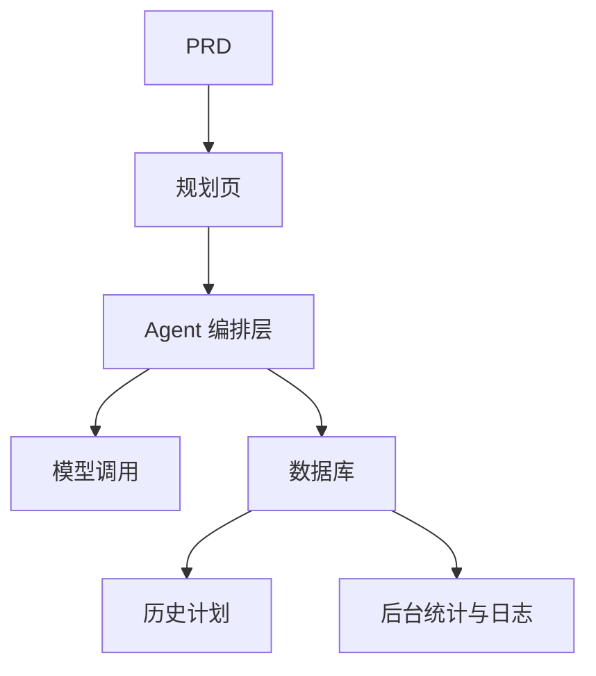

# 智能旅游规划 Agent 平台开发实战

## Descripcion general

Este proyecto practico te requiere trabajar con un PRD real，completar desde cero un智能旅游规划 Agent 平台。你将构建一个能接收结构化输入、生成每日行程、支持保存和重用的完整 AI 产品——不只是聊天机器人，而是一个有任务管理能力的产品。

Esta es la seccion de practica integral de la Etapa 2。这个项目的核心挑战在于：如何让 AI 生成结构化、可用的Planificacion de itinerario，而不是一大段不可操作的文字。

## Conocimientos previos

Antes de comenzar este proyecto, ya deberias dominar lo siguiente:

- Diseno de paginas frontend y uso de bibliotecas de componentes（[UI 设计](../../frontend/ui-design/)、[现代组件库](../../frontend/modern-component-library/)）
- Diseno y desarrollo de interfaces backend（[接口代码编写](../../backend/ai-interface-code/)）
- Fundamentos de bases de datos y Supabase（[从数据库到 Supabase](../../backend/database-supabase/)）
- Flujo de trabajo de Git y despliegue（[Git 和 GitHub](../../backend/git-workflow/)、[Despliegue Web 应用](../../backend/zeabur-deployment/)）

## Objetivos de aprendizaje

Despues de completar esta practica, podras:

1. Leer el PRD 并从中提取 Agent 平台的开发任务清单
2. Disenar formularios de entrada estructurados y formatos de salida estructurados
3. Implementar la capa de orquestacion de Agent, procesando entrada de usuarios, llamadas a modelos y almacenamiento de resultados
4. 构建"生成 → 保存 → 重用"的Ciclo completo del negocio
5. Completar la integracion de extremo a extremo, entregando un prototipo de producto IA demostrable

## Introduccion del proyecto

El producto que vas a construir es一个智能旅游规划 Agent 平台：

| 功能 | 描述 |
|------|------|
| **Planificacion de itinerario** | El usuario ingresa origen, destino, fechas, presupuesto y preferencias, el sistema genera el itinerario diario |
| **Desglose de presupuesto** | Los resultados del itinerario incluyen asignacion de presupuesto y sugerencias |
| **Gestion de historial** | Los usuarios pueden guardar planes historicos, regenerar y exportar |
| **Panel de administracion** | Los administradores ven destinos populares, tareas fallidas y retroalimentacion de usuarios |

::: tip PRD 入口
El documento de requisitos de este proyecto esta en GitHub： [Ver PRD](https://github.com/datawhalechina/easy-vibe/blob/main/docs/es-es/stage-2/assignments/travel-planning-agent-platform/PRD.md)
:::

<div style="margin: 32px 0;">
  <ClientOnly>
    <StepBar :active="0" :items="[
      { title: 'Analisis de requisitos', description: 'Leer el PRD，明确页面、Agent 编排、输入输出结构' },
      { title: 'Construccion del esqueleto', description: '用 AI 生成首页、规划页、历史页、后台页骨架' },
      { title: 'Desarrollo iterativo', description: '逐模块补充结构化输出、任务状态、Gestion de historial' },
      { title: 'Integracion y despliegue', description: 'Verificar de extremo a extremo，Desplegar y preparar la demostracion' }
    ]" />
  </ClientOnly>
</div>

## Primera parte：Analisis de requisitos

### 1.1 Leer el PRD

打开 PRD 文档，重点回答以下问题：

- 第一版是否只做单目的地？
- 行程输出是否必须结构化？结构是什么？
- 导出能力做多深？（分享链接 / PDF / 图片）
- 后台统计和任务日志的范围是什么？

::: warning
Si no tienes respuestas claras a las preguntas anteriores, no comiences a escribir codigo. La comprension inadecuada de los requisitos es la causa mas comun de retrabajo.
:::

### 1.2 Confirmar la arquitectura del sistema



## Segunda parte：搭建项目骨架

### 2.1 Generar paginas frontend

Referencia de prompts：

```text
请基于当前 PRD，帮我生成一个智能旅游规划 Agent 平台的前端骨架。

要求：
1. 页面包括：首页、规划页、行程详情页、历史记录页、管理页
2. 规划页左侧是表单，右侧是结果预览
3. 先只生成页面结构和假数据，不接真实接口
4. 风格要像现代 AI 产品
```

### 2.2 Verificar la estructura de paginas

Verificar item por item:

- [ ] 规划页的表单字段是否与 PRD 一致
- [ ] 结果预览区域能展示结构化的行程数据
- [ ] 历史记录页可以展示多条计划
- [ ] Panel de administracion页可以展示统计数据

## Tercera parte：Desarrollo iterativo

### 3.1 Avanzar por modulos

1. **鉴权**：注册、登录
2. **规划表单**：结构化输入（出发地、目的地、日期、预算、偏好）
3. **Agent 编排**：接收输入 → 调用模型 → 解析结构化输出
4. **结果展示**：行程按天展示、Desglose de presupuesto、建议
5. **Gestion de historial**：保存计划、再次生成、导出
6. **Panel de administracion**：热门目的地、失败任务、用户反馈
7. **任务状态**：生成中 / 成功 / 失败的状态管理和错误记录

### 3.2 Autoverificacion de modulos

| Item de verificacion | Metodo de verificacion |
|--------|----------|
| 输入完整性 | 表单字段是否与 PRD 一致 |
| 输出结构化 | 行程结果是不是结构化数据（而非一大段文字） |
| Consistencia de datos | trip、itinerary、logs 数据是否对得上 |
| 闭环验证 | 是否能演示"输入 → 生成 → 保存 → 再次生成" |

## Cuarta parte：联调与上线

### 4.1 Pruebas de extremo a extremo

Verificar al menos los siguientes escenarios:

- 输入行程参数 → 生成每日行程 → 查看Desglose de presupuesto → 保存到历史
- 从历史记录中再次生成行程
- 管理员查看任务统计和失败日志

## Entregables

Despues de completar este proyecto, necesitas enviar lo siguiente:

- [ ] Enlace de demostracion en linea accesible
- [ ] Enlace al repositorio de codigo fuente (incluyendo README)
- [ ] PRD 文档
- [ ] Capturas de pantalla de paginas clave（规划页、行程详情页、历史记录页、Panel de administracion）
- [ ] 60 segundos de video de demostracion

## Criterios de evaluacion

| 维度 | Requisitos basicos | Requisitos avanzados |
|------|---------|---------|
| Alineacion con PRD | 页面、功能、数据结构基本符合 PRD | 能清晰说明设计决策 |
| Ciclo completo del producto | 规划 → 保存 → 历史 → 重生成可跑通 | 支持导出和分享 |
| 输出质量 | 行程结果结构化且可读 | Desglose de presupuesto合理、建议有针对性 |
| Capacidades del backend | 任务统计和失败日志可查看 | 有热门目的地分析 |
| Completitud de ingenieria | 前端、后端、数据库、模型调用链路已接通 | 任务状态管理完善，错误可追溯 |

## Referencias

- [UI 设计](../../frontend/ui-design/)
- [使用现代组件库更新你的界面](../../frontend/modern-component-library/)
- [从数据库到 Supabase](../../backend/database-supabase/)
- [大模型辅助编写接口代码与接口文档](../../backend/ai-interface-code/)
- [Git 和 GitHub 工作流](../../backend/git-workflow/)
- [如何Despliegue Web 应用](../../backend/zeabur-deployment/)
