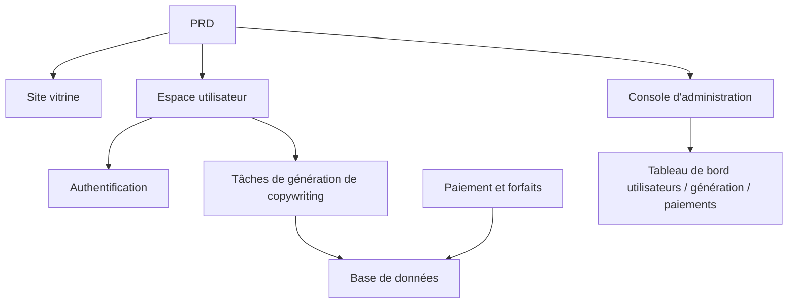

# Projet 1 : Première application full-stack SaaS — Site de génération de copywriting

## Présentation

Ce projet pratique vous demande de réaliser, à partir d'un véritable PRD (Document d'Exigences Produit), un produit SaaS de copywriting marketing IA destiné aux développeurs indépendants et aux équipes de contenu. Vous utiliserez Supabase comme service backend et Stripe comme système de paiement, en parcourant l'ensemble du processus, de l'analyse des besoins au déploiement en ligne.

Il s'agit du projet pratique synthétique de l'Étape 2. Dans les chapitres précédents, vous avez appris séparément la création de pages frontend, le développement d'interfaces backend, les opérations de base de données et l'intégration de paiements — ce projet vous demande de tout assembler pour livrer un prototype de produit fonctionnel.

## Prérequis

Avant de commencer ce projet, vous devriez maîtriser les sujets suivants :

- Conception de pages frontend et utilisation de bibliothèques de composants ([Conception UI](../../frontend/ui-design/), [Bibliothèque de composants moderne](../../frontend/modern-component-library/))
- Conception et développement d'interfaces backend ([Conception et développement d'interfaces backend](../../backend/ai-interface-code/))
- Bases de données et Supabase ([De la base de données à Supabase](../../backend/database-supabase/))
- Intégration de paiements ([Système de paiement Stripe](../../backend/stripe-payment/))
- Flux de travail Git et déploiement ([Git et GitHub](../../backend/git-workflow/), [Déployer une application web](../../backend/zeabur-deployment/))

## Objectifs d'apprentissage

Après avoir terminé ce projet, vous serez capable de :

1. Lire et comprendre un véritable PRD et en extraire une liste de tâches de développement
2. Utiliser l'IA pour générer étape par étape les pages frontend et les interfaces backend
3. Utiliser Supabase pour l'authentification utilisateur et les opérations de base de données
4. Intégrer Stripe pour la fonctionnalité d'abonnement payant
5. Construire une console d'administration et effectuer des tests de bout en bout

## Présentation du projet

Le produit que vous allez construire est un SaaS de copywriting marketing IA, comprenant trois sous-systèmes :

| Sous-système | Responsabilité |
|--------|------|
| **Site vitrine** | Présentation du produit, tarification, FAQ, conversion à l'inscription |
| **Espace utilisateur** | Saisie des informations produit, génération de copywriting, historique, mise à niveau du forfait |
| **Console d'administration** | Gestion des utilisateurs, enregistrements de génération, données de paiement, vue d'ensemble des opérations |

Le backend utilise Supabase pour la base de données et l'authentification, Stripe pour les paiements, et un modèle IA pour générer le copywriting marketing.

::: tip Accès au PRD
Le document d'exigences de ce projet se trouve sur GitHub : [Voir le PRD](https://github.com/datawhalechina/easy-vibe/blob/main/docs/zh-cn/stage-2/assignments/copywriting-platform-supabase/PRD.md)
:::

<div style="margin: 32px 0;">
  <ClientOnly>
    <StepBar :active="0" :items="[
      { title: 'Analyse des besoins', description: 'Lire le PRD, clarifier les pages, fonctionnalités, authentification et périmètre de paiement' },
      { title: 'Structure du projet', description: 'Générer trois squelettes frontend avec l\'IA (www / app / admin)' },
      { title: 'Intégration backend', description: 'Authentification Supabase, interface de génération, paiement Stripe' },
      { title: 'Tests et déploiement', description: 'Tests de bout en bout, déploiement et préparation de la démonstration' }
    ]" />
  </ClientOnly>
</div>

## Partie 1 : Analyse des besoins

### 1.1 Lire le PRD

Ouvrez le document PRD et répondez aux questions suivantes :

- Combien d'entrées le système possède-t-il ? Quelles pages couvre chacune ?
- Quelle est la fonction principale de chaque page ?
- Quels modules et tables de données le backend comprend-il ?
- Comment la tarification, le processus de paiement et le quota gratuit sont-ils conçus ?
- Quel est le périmètre MVP ? Que fait-on et que ne fait-on pas dans la première version ?

::: warning
Si vous n'avez pas de réponses claires aux questions ci-dessus, ne commencez pas à coder. Une mauvaise compréhension des besoins est la cause la plus fréquente de rework.
:::

### 1.2 Confirmer l'architecture du système

D'après le PRD, dégagez l'architecture globale du système :



## Partie 2 : Structure du projet

### 2.1 Générer les pages frontend

Utilisez l'IA pour générer d'abord la structure de base de toutes les pages avec des données fictives.

Prompt de référence :

```text
Générez un squelette frontend pour un SaaS de copywriting marketing IA, basé sur le PRD actuel.

Exigences :
1. Trois entrées séparées : www, app, admin
2. Le site vitrine comprend : page d'accueil, tarification, FAQ
3. L'app comprend : connexion, inscription, espace de génération, historique, page des forfaits
4. L'admin comprend : page d'accueil backend, gestion des utilisateurs, enregistrements de génération, commandes de paiement
5. Ne générez que la structure des pages et des données fictives, sans interfaces réelles
6. Le style doit ressembler à un SaaS moderne, pas à une démo de classe
```

### 2.2 Améliorer les pages principales

Une fois la structure en place, concentrez-vous sur l'amélioration de la page de l'espace de génération (Dashboard) :

```text
Continuez à améliorer la page /dashboard.

C'est un espace de génération de copywriting marketing IA.

Champs du formulaire à gauche :
- Nom du produit
- Description en une phrase
- Utilisateurs cibles
- 3 arguments de vente
- Canaux de distribution (site web, WeChat Moments, Xiaohongshu, Douyin, email)

Zone de résultats à droite :
- Titre principal
- Sous-titre
- CTA
- 3 versions de copywriting court
- Copywriting long

Utilisez d'abord des données mock pour valider l'interaction.

Exigences :
- État de chargement après clic sur « Générer le copywriting »
- Concevoir un état vide pour la zone de résultats
- Mise en page responsive, adaptée aux écrans larges et étroits
```

### 2.3 Vérifier la structure des pages

Vérifiez chaque élément :

- [ ] Les routes des trois entrées sont-elles indépendantes
- [ ] Le nombre de pages correspond-il au PRD
- [ ] La mise en page du formulaire et de la zone de résultats du Dashboard est-elle raisonnable
- [ ] Les données fictives présentent-elles les états UI de base

### Bloqué ?

Si vous êtes bloqué lors de la construction du frontend, vous pouvez consulter ces chapitres :

- [Conception UI](../../frontend/ui-design/)
- [Concevoir des pages et des boutons en référence aux guidelines de conception UI](../../frontend/multi-product-ui/)
- [Rendre l'interface attrayante avec les LLM et les Skills](../../frontend/llm-skills-beautiful/)
- [Du prototype de conception au code de projet](../../frontend/design-to-code/)
- [Mettre à jour votre interface avec une bibliothèque de composants moderne](../../frontend/modern-component-library/)

## Partie 3 : Intégration backend

### 3.1 Intégrer la connexion Supabase

```text
Considérez que je suis débutant et guidez-moi étape par étape pour intégrer la connexion Supabase.

J'ai besoin que vous m'aidiez à :
1. Intégrer Supabase dans le projet
2. Implémenter les fonctions d'inscription, de connexion et de déconnexion
3. Rediriger vers /dashboard après connexion réussie
4. Rediriger automatiquement vers /login les utilisateurs non connectés accédant à /dashboard, /billing, /admin
5. Créer la table profiles
6. Créer automatiquement un enregistrement dans la table profiles après inscription réussie
7. La table profiles doit contenir les champs email, role, plan

Exigences de mise en œuvre :
- Indiquez à chaque étape quels fichiers sont modifiés
- Ne pas coder en dur les clés secrètes
- Marquez clairement les opérations à effectuer manuellement dans la console Supabase
- Expliquez comment vérifier l'inscription et la connexion une fois terminé
```

### 3.2 Intégrer l'interface de génération et la base de données

```text
Considérez que je suis débutant et aidez-moi à réaliser la fonctionnalité principale du site : générer du copywriting marketing et le sauvegarder.

Résultat attendu :
1. L'utilisateur remplit le formulaire sur /dashboard et clique sur « Générer le copywriting »
2. Le backend reçoit : nom du produit, description, utilisateurs cibles, arguments de vente, canaux de distribution
3. Le backend appelle le modèle pour générer le résultat
4. La page affiche le résultat de la génération
5. Les entrées et sorties sont sauvegardées dans la base de données
6. L'utilisateur peut consulter son historique lors de sa prochaine visite

J'ai besoin que vous réalisiez :
- Créer l'interface de génération /api/generate
- Créer la table generations
- Concevoir les champs d'entrée et de sortie
- La page Dashboard lit l'historique de l'utilisateur actuel

Expérience utilisateur :
- État de chargement du bouton
- Message d'erreur en cas d'échec de la génération
- État vide en l'absence d'historique

Une fois terminé, veuillez indiquer :
- L'emplacement des fichiers de pages frontend
- L'emplacement des fichiers d'interfaces backend
- L'emplacement de la logique d'écriture en base de données
- Comment tester la chaîne de génération complète
```

### 3.3 Intégrer le paiement Stripe

```text
Considérez que je suis débutant et aidez-moi à ajouter un paiement Stripe minimal et fonctionnel au site.

Pas besoin d'un système complexe, faites d'abord fonctionner la chaîne de paiement la plus basique.

J'ai besoin que vous réalisiez :
1. La page /billing affiche les forfaits free et pro
2. L'utilisateur est redirigé vers Stripe Checkout après clic sur la mise à niveau
3. Retour sur le site après paiement réussi
4. Le résultat du paiement est sauvegardé dans la table subscriptions
5. Mise à jour synchrone du champ profile.plan
6. Limitation des utilisateurs free à 3 générations par jour, pas de limite pour les utilisateurs pro

Principes de mise en œuvre :
- Faites d'abord fonctionner le flux principal, ne vous préoccupez pas des cas limites complexes
- Indiquez clairement ce qui doit être configuré dans la console Stripe
- Expliquez comment tester le processus de paiement complet une fois terminé
```

### 3.4 Construire la console d'administration

```text
Considérez que je suis débutant et aidez-moi à créer une console d'administration simple et fonctionnelle.

Accès réservé aux administrateurs uniquement.

J'ai besoin que vous réalisiez :
1. Seuls les utilisateurs avec role = admin peuvent accéder à /admin
2. La console comprend 3 onglets : liste des utilisateurs, enregistrements de génération, statut des abonnements
3. La liste des utilisateurs affiche : email, plan, date de création
4. Les enregistrements de génération affichent : utilisateur, nom du produit, canal, date de création
5. Le statut des abonnements affiche : utilisateur, forfait, statut du paiement

Exigences :
- Interface simple et claire
- Utiliser les composants existants (tableaux, onglets, badges) de la bibliothèque de composants
- Expliquez comment définir un compte comme administrateur une fois terminé
```

### Bloqué ?

Si vous êtes bloqué lors du développement backend, vous pouvez consulter ces chapitres :

- [De la base de données à Supabase](../../backend/database-supabase/)
- [Conception et développement d'interfaces backend d'application](../../backend/ai-interface-code/)
- [Comment intégrer un système de paiement comme Stripe](../../backend/stripe-payment/)

## Partie 4 : Tests de bout en bout et déploiement

### 4.1 Tests de bout en bout

Vérifiez au moins les scénarios suivants :

- Inscription -> Connexion -> Génération de copywriting -> Consultation de l'historique -> Mise à niveau du forfait
- Connexion administrateur -> Consultation des données utilisateurs -> Consultation des enregistrements de génération -> Consultation du statut des paiements

Vérifications avant déploiement :

```text
Considérez que je suis débutant et aidez-moi à vérifier si le projet est prêt pour le déploiement.

Points de vérification :
- Les variables d'environnement sont-elles complètes
- L'URL de callback de connexion est-elle correcte
- L'URL de callback de paiement Stripe est-elle correcte
- Les pages ont-elles des états de chargement, des états vides et des messages d'erreur
- Le README contient-il les instructions de démarrage et de déploiement

J'ai besoin que vous :
1. Listiez les éléments à corriger par ordre de priorité
2. Indiquiez ceux qui doivent être corrigés en premier
3. Expliquiez les étapes de déploiement après correction
```

### 4.2 Déploiement

Déployez le projet dans un environnement public. Tutoriel de déploiement : [Flux de travail Git et GitHub](../../backend/git-workflow/), [Comment déployer une application web](../../backend/zeabur-deployment/).

## Livrables

Après avoir terminé ce projet, vous devez soumettre les éléments suivants :

- [ ] Lien de démonstration en ligne accessible
- [ ] Lien du dépôt de code source (avec README)
- [ ] Document PRD
- [ ] Captures d'écran des pages principales (accueil, Dashboard, Billing, Admin)
- [ ] Vidéo de démonstration de 60 secondes (couvrant inscription -> génération -> paiement -> console d'administration)

Le README doit contenir au minimum : présentation du projet, description des pages principales, stack technique, étapes de démarrage local, liste des variables d'environnement.

## Critères d'évaluation

| Dimension | Exigences de base | Exigences avancées |
|------|---------|---------|
| Complétude du produit | Accueil, connexion, Dashboard, Billing, Admin sont tous accessibles | Le copywriting et le style visuel de l'accueil ressemblent à un véritable SaaS |
| Boucle métier | Inscription -> Connexion -> Génération -> Historique fonctionne | La différence de permissions entre Free/Pro est clairement visible |
| Exactitude des données | Les résultats de génération et le statut des paiements sont écrits dans la base de données | Il y a des messages d'erreur clairs, des états vides et des états de chargement |
| Permissions et sécurité | Les utilisateurs non connectés ne peuvent pas accéder aux pages protégées, les utilisateurs ordinaires ne peuvent pas accéder à l'Admin | Il y a une validation basique des entrées et une authentification côté serveur |
| Livraison du projet | Le projet peut être lancé localement et déployé sur le web public | Le README est clair, la vidéo de démonstration est structurée |

::: tip
Si vous trouvez la tâche trop importante, rappelez-vous ce principe : **Assurez-vous d'abord que « ça fonctionne », puis cherchez à « le rendre beau ».**
:::

## Vérification avant soumission

<el-card shadow="hover" style="margin: 20px 0; border-radius: 12px;">
  <template #header>
    <div style="font-weight: bold; font-size: 16px;">Dernier coup d'œil avant de soumettre</div>
  </template>

  <ul style="list-style-type: none; padding-left: 0;">
    <li><label><input type="checkbox" disabled /> L'accueil, la page de connexion, le Dashboard, le Billing et l'Admin sont terminés</label></li>
    <li><label><input type="checkbox" disabled /> L'utilisateur peut s'inscrire, se connecter et se déconnecter</label></li>
    <li><label><input type="checkbox" disabled /> Les résultats de génération sont réellement écrits dans la base de données</label></li>
    <li><label><input type="checkbox" disabled /> Le processus principal de paiement fonctionne</label></li>
    <li><label><input type="checkbox" disabled /> L'administrateur peut voir les utilisateurs, les enregistrements de génération et le statut des paiements</label></li>
    <li><label><input type="checkbox" disabled /> Le projet est déployé sur le web public</label></li>
  </ul>
</el-card>

## Ressources de référence

- [Conception UI](../../frontend/ui-design/)
- [Concevoir des pages et des boutons en référence aux guidelines de conception UI](../../frontend/multi-product-ui/)
- [Rendre l'interface attrayante avec les LLM et les Skills](../../frontend/llm-skills-beautiful/)
- [Du prototype de conception au code de projet](../../frontend/design-to-code/)
- [Mettre à jour votre interface avec une bibliothèque de composants moderne](../../frontend/modern-component-library/)
- [De la base de données à Supabase](../../backend/database-supabase/)
- [Conception et développement d'interfaces backend d'application](../../backend/ai-interface-code/)
- [Flux de travail Git et GitHub](../../backend/git-workflow/)
- [Comment déployer une application web](../../backend/zeabur-deployment/)
- [Comment intégrer un système de paiement comme Stripe](../../backend/stripe-payment/)
