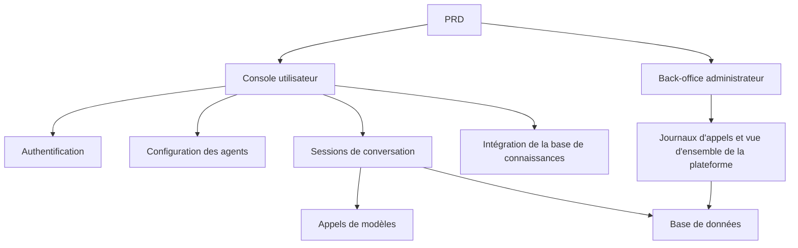

# Développement pratique d'une plateforme d'agents IA de type Dify

## Aperçu

Ce projet pratique vous demande de réaliser, à partir d'un véritable PRD, une plateforme d'agents IA reproduisant l'expérience centrale de Dify. Vous construirez une console utilisateur, un back-office administrateur et un backend de plateforme, en implémentant les fonctionnalités principales de gestion d'agents, de conversation, de journalisation et de base de connaissances.

Il s'agit du projet pratique synthétique de l'Étape 2. Contrairement aux projets précédents portant sur une seule page ou une seule fonctionnalité, ce projet vous demande de construire un produit IA avec une véritable dimension de plateforme, comprenant plusieurs rôles, plusieurs modules, la persistance des données et une chaîne d'appels de modèles.

## Prérequis

Avant de commencer ce projet, vous devriez maîtriser les éléments suivants :

- Conception de pages frontales et utilisation de bibliothèques de composants ([Conception UI](../../frontend/ui-design/), [Bibliothèque de composants moderne](../../frontend/modern-component-library/))
- Conception et développement d'API backend ([Écriture de code d'interface](../../backend/ai-interface-code/))
- Bases de données et Supabase ([Des bases de données à Supabase](../../backend/database-supabase/))
- Flux de travail Git et déploiement ([Git et GitHub](../../backend/git-workflow/), [Déployer une application web](../../backend/zeabur-deployment/))

## Objectifs d'apprentissage

Après avoir terminé ce projet, vous serez capable de :

1. Lire et comprendre un véritable PRD et en extraire une liste de tâches de développement
2. Concevoir l'architecture des pages et le modèle de données d'une plateforme d'agents
3. Implémenter le flux complet de création d'agents, de conversation et de journalisation
4. Utiliser l'IA pour vous aider à développer un produit de type plateforme
5. Effectuer des tests de bout en bout et livrer un prototype de plateforme IA démontrable

## Présentation du projet

Le produit que vous allez construire est une plateforme d'agents IA de type Dify, comprenant deux sous-systèmes :

| Sous-système | Responsabilité |
|--------|------|
| **Console utilisateur** | Créer des agents, configurer les prompts, lancer des conversations, consulter les journaux, gérer la base de connaissances |
| **Back-office administrateur** | Consulter les données utilisateurs, l'utilisation des ressources de la plateforme et les statistiques d'appels |

Le backend doit prendre en charge les capacités principales suivantes : gestion des agents, gestion des sessions, stockage des messages, appels de modèles, journalisation des appels et intégration de la base de connaissances.

::: tip Accès au PRD
Le document d'exigences de ce projet se trouve sur GitHub : [Voir le PRD](https://github.com/datawhalechina/easy-vibe/blob/main/docs/fr-fr/stage-2/assignments/custom-dify-agent-platform/PRD.md)
:::

<div style="margin: 32px 0;">
  <ClientOnly>
    <StepBar :active="0" :items="[
      { title: 'Analyse des besoins', description: 'Lire le PRD, clarifier les pages, les limites de capacités, l\'authentification et le modèle de données' },
      { title: 'Construction du squelette', description: 'Générer avec l\'IA le squelette de la console utilisateur et du back-office' },
      { title: 'Développement itératif', description: 'Compléter module par module : agents, conversations, journaux, base de connaissances' },
      { title: 'Tests et mise en ligne', description: 'Tests de bout en bout, déploiement et préparation de la démonstration' }
    ]" />
  </ClientOnly>
</div>

## Partie 1 : Analyse des besoins

### 1.1 Lire le PRD

Ouvrez le document PRD et répondez aux questions suivantes :

- Parmi les agents, les sessions, les journaux et la base de connaissances, lesquels doivent figurer dans le MVP ?
- La liste des pages et des routes est-elle finalisée ?
- Quelles sont les limites des appels de modèles et de la journalisation ?
- Le multi-locataire et les flux de travail complexes doivent-ils être exclus dans un premier temps ?

::: warning
Si les questions ci-dessus n'ont pas de réponse claire, ne commencez pas à coder. Une mauvaise compréhension des besoins est la cause la plus fréquente de retour en arrière.
:::

### 1.2 Confirmer l'architecture du système

À partir du PRD, dégagez l'architecture globale du système :



## Partie 2 : Construction du squelette du projet

### 2.1 Générer les pages frontales

Prompt de référence :

```text
Veuillez générer, sur la base du PRD actuel, le squelette frontend d'une plateforme d'agents IA de type Dify.

Exigences :
1. Côté utilisateur : connexion, liste des agents, configuration des agents, page de conversation, page des journaux, page de la base de connaissances
2. Côté back-office : accueil du back-office, vue d'ensemble des utilisateurs, vue d'ensemble de l'utilisation des ressources
3. Générer d'abord uniquement la structure des pages et des données fictives, sans connexion à une API réelle
4. Le style doit ressembler à une plateforme IA moderne
```

### 2.2 Vérifier la structure des pages

Vérifiez point par point :

- [ ] Les routes de la console utilisateur et du back-office sont-elles séparées ?
- [ ] La liste des agents, la page de configuration, la conversation et les journaux sont-ils complets ?
- [ ] Le back-office dispose-t-il de la vue d'ensemble des utilisateurs et des ressources ?

## Partie 3 : Développement itératif

### 3.1 Progresser par module

1. **Authentification** : Inscription, connexion, authentification de session
2. **Gestion des agents** : Créer, modifier, supprimer des agents, configurer les prompts système
3. **Conversations** : Envoyer des messages, recevoir des réponses du modèle, historique des conversations
4. **Base de connaissances** : Uploader des documents, lier un agent à une base de connaissances
5. **Journalisation** : Enregistrer chaque appel de modèle (prompt, réponse, durée, tokens)
6. **Back-office** : Statistiques d'utilisation, vue d'ensemble des ressources

### 3.2 Modèle de données de référence

Tables principales :

- `agents` : id, user_id, name, system_prompt, model, created_at
- `conversations` : id, agent_id, user_id, created_at
- `messages` : id, conversation_id, role, content, created_at
- `knowledge_bases` : id, agent_id, name, created_at
- `call_logs` : id, agent_id, conversation_id, model, prompt_tokens, completion_tokens, latency_ms, created_at

## Partie 4 : Tests et mise en ligne

### 4.1 Tests de bout en bout

Vérifiez au minimum les scénarios suivants :

- Créer un agent -> Lancer une conversation -> Consulter les journaux
- Uploader un document dans la base de connaissances -> Vérifier que l'agent peut l'utiliser
- Consulter les statistiques du back-office

### 4.2 Déploiement

- Déployer le frontend sur Vercel / Zeabur
- Déployer le backend sur Zeabur / Railway / Render
- Utiliser Supabase comme base de données

Vérifications avant déploiement :

- [ ] Les variables d'environnement sont-elles toutes configurées ?
- [ ] L'authentification fonctionne-t-elle correctement en production ?
- [ ] Les appels de modèles fonctionnent-ils correctement ?

## Livrables

Après avoir terminé ce projet, vous devez soumettre les éléments suivants :

- [ ] Un lien de démonstration en ligne accessible
- [ ] Un lien vers le dépôt de code source (avec README)
- [ ] Le document PRD
- [ ] Des captures d'écran des pages principales
- [ ] Une vidéo de démonstration de 60 secondes

## Critères d'évaluation

| Dimension | Exigences de base | Exigences avancées |
|------|---------|---------|
| Boucle des agents | Créer un agent, lancer une conversation, voir les journaux | La base de connaissances est intégrée et les agents peuvent l'utiliser |
| Plateforme | Console utilisateur et back-office sont accessibles | Les journaux d'appels et les statistiques sont complets |
| Technique | Le backend peut appeler des modèles et stocker les résultats | Gestion des erreurs et optimisation des performances |
| Livraison | Le projet peut être exécuté et déployé | README clair et vidéo de démonstration |

## Références

- [Conception UI](../../frontend/ui-design/)
- [Bibliothèque de composants moderne](../../frontend/modern-component-library/)
- [Des bases de données à Supabase](../../backend/database-supabase/)
- [Écriture de code d'interface assistée par IA](../../backend/ai-interface-code/)
- [Flux de travail Git et GitHub](../../backend/git-workflow/)
- [Comment déployer une application web](../../backend/zeabur-deployment/)
