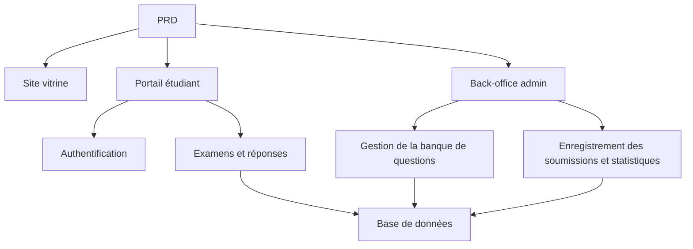

# Développement pratique d'un système de gestion d'examens en ligne

## Aperçu

Ce projet pratique vous demande de réaliser, à partir d'un véritable PRD (document d'exigences produit), un système de gestion d'examens en ligne complet, depuis zéro. La particularité de ce projet est qu'il comprend plusieurs rôles (étudiants et administrateurs), chacun voyant des pages différentes et pouvant exécuter des opérations différentes. Vous utiliserez Express pour construire le backend et implémenter le flux métier complet des examens.

Il s'agit du projet pratique synthétique de l'Étape 2. Les systèmes multi-rôles avec gestion des permissions sont très courants en milieu professionnel. Une fois ce modèle maîtrisé, vous pourrez faire face à de nombreux scénarios métier tels que la formation en ligne, les plateformes SaaS ou les back-office administratifs.

## Prérequis

Avant de commencer ce projet, vous devriez maîtriser les éléments suivants :

- Conception de pages frontales et utilisation de bibliothèques de composants ([Conception UI](../../frontend/ui-design/), [Bibliothèque de composants moderne](../../frontend/modern-component-library/))
- Conception et développement d'API backend ([Écriture de code d'interface](../../backend/ai-interface-code/))
- Bases de données et Supabase ([Des bases de données à Supabase](../../backend/database-supabase/))
- Flux de travail Git et déploiement ([Git et GitHub](../../backend/git-workflow/), [Déployer une application web](../../backend/zeabur-deployment/))

## Objectifs d'apprentissage

Après avoir terminé ce projet, vous serez capable de :

1. Lire et comprendre un véritable PRD, et en extraire une liste de tâches de développement
2. Concevoir le contrôle des permissions et le routage des pages pour un système multi-rôles
3. Implémenter une API backend complète avec Express
4. Réaliser le flux métier complet : examen, soumission, notation automatique
5. Effectuer des tests de bout en bout et livrer un prototype de système métier démontrable

## Présentation du projet

Le produit que vous allez construire est un système de gestion d'examens en ligne, comprenant trois sous-systèmes :

| Sous-système | Responsabilité |
|--------|------|
| **Site vitrine** | Présentation de la plateforme, point d'accès de connexion |
| **Portail étudiant** | Liste des examens, passage des épreuves, soumission, consultation des notes |
| **Back-office admin** | Gestion de la banque de questions, gestion des examens, enregistrement des soumissions, statistiques des résultats |

Le backend utilise Express et doit prendre en charge : l'authentification, la gestion des rôles et permissions, la gestion des examens et de la banque de questions, le processus de soumission et la notation automatique, ainsi que la gestion des notes et des statistiques.

::: tip Accès au PRD
Le document d'exigences de ce projet se trouve sur GitHub : [Voir le PRD](https://github.com/datawhalechina/easy-vibe/blob/main/docs/fr-fr/stage-2/assignments/exam-management-express/PRD.md)
:::

<div style="margin: 32px 0;">
  <ClientOnly>
    <StepBar :active="0" :items="[
      { title: 'Analyse des besoins', description: 'Lire le PRD, clarifier les rôles, les pages, le flux des examens et le modèle de données' },
      { title: 'Construction du squelette', description: 'Générer avec l\'IA le squelette des pages étudiant et admin' },
      { title: 'Développement backend', description: 'Connecter avec Express : connexion, examens, soumission, notation' },
      { title: 'Tests et mise en ligne', description: 'Tests de bout en bout, déploiement et préparation de la démonstration' }
    ]" />
  </ClientOnly>
</div>

## Partie 1 : Analyse des besoins

### 1.1 Lire le PRD

Ouvrez le document PRD et répondez aux questions suivantes :

- Quels rôles le système comprend-il ? Que peuvent-ils faire respectivement ?
- La liste des pages est-elle complète ? Quelles pages le portail étudiant et le back-office admin comportent-ils ?
- Quels types de questions sont pris en charge ? Quelle est la logique de notation pour chaque type ?
- Quel est le flux complet d'un examen ? (Publication -> Démarrage -> Réponse -> Soumission -> Notation -> Consultation des résultats)

::: warning
Si les questions ci-dessus n'ont pas de réponse claire, ne commencez pas à coder. Une mauvaise compréhension des besoins est la cause la plus fréquente de retour en arrière.
:::

### 1.2 Confirmer l'architecture du système

À partir du PRD, dégagez l'architecture globale du système :



## Partie 2 : Construction du squelette du projet

### 2.1 Générer les pages frontales

Prompt de référence :

```text
Veuillez générer, sur la base du PRD actuel, le squelette frontend d'un système de gestion d'examens en ligne.

Stack technique requise :
- Next.js App Router
- TypeScript
- Tailwind CSS
- shadcn/ui

Liste des pages :
1. Page d'accueil /
2. Page de connexion /login
3. Liste des examens (étudiant) /student/exams
4. Page de passage d'examen /student/exams/[id]
5. Page des résultats (étudiant) /student/history
6. Accueil du back-office admin /admin
7. Gestion des examens /admin/exams
8. Gestion de la banque de questions /admin/questions
9. Enregistrement des soumissions /admin/submissions

Exigences :
- Les pages étudiant doivent être claires, concentrées et faciles à utiliser
- Les pages admin doivent utiliser une mise en page avec barre latérale + barre supérieure
- Utiliser d'abord des données mock, sans connexion à une API réelle
- Assurer une utilisation de base correcte sur desktop et mobile
```

### 2.2 Améliorer la page de passage d'examen

La page de passage d'examen est la page centrale du portail étudiant. À améliorer en priorité :

```text
Veuillez continuer à améliorer la page de passage d'examen.

Il s'agit de la page de passage d'un examen en ligne, elle doit contenir :
- En haut : titre de l'examen, compte à rebours, nombre de questions déjà répondues
- Au centre : énoncé de la question et options
- Prise en charge de trois types de questions : choix unique, vrai/faux, réponse courte
- À gauche ou en haut : cartographie des réponses, indiquant si chaque question a été répondue
- Avant la soumission, afficher une boîte de confirmation

Implémenter d'abord les interactions avec des données mock, sans connexion à une API réelle.

Exigences :
- Interface épurée, ne pas ressembler à une page de back-office
- Le compte à rebours doit être visible sans être trop oppressant
- Prévoir un état vide et un état de chargement
```

### 2.3 Améliorer le back-office administrateur

La première version du back-office admin se concentre sur trois zones principales :

- **Gestion des examens** : Créer un examen, définir la durée, gérer le statut de publication
- **Gestion de la banque de questions** : Ajouter des questions, modifier des questions, filtrer par type
- **Enregistrement des soumissions** : Voir les soumissions des étudiants, les scores, les durées

### 2.4 Vérifier la structure des pages

Vérifiez point par point :

- [ ] Les points d'accès du portail étudiant et du back-office admin sont-ils séparés ?
- [ ] La page de connexion, la liste des examens, la page de passage d'examen et la page des résultats sont-elles complètes ?
- [ ] Les pages de gestion de la banque de questions, des examens et des enregistrements de soumission du back-office sont-elles accessibles ?
- [ ] Le style visuel des pages étudiant et admin est-il clairement différencié ?

### Vous êtes bloqué ?

Si vous êtes bloqué lors de la construction du frontend, vous pouvez consulter ces chapitres :

- [Des bases de données à Supabase](../../backend/database-supabase/)
- [Écriture de code d'interface assistée par IA](../../backend/ai-interface-code/)
- [Mettre à jour votre interface avec une bibliothèque de composants moderne](../../frontend/modern-component-library/)

## Partie 3 : Développement backend

### 3.1 Connexion et contrôle des permissions

```text
Considérez que je suis débutant et aidez-moi à mettre en place la connexion et le contrôle des permissions du système d'examens en ligne.

Le backend utilise Express.

Objectifs :
1. Les étudiants et les administrateurs peuvent tous les deux se connecter
2. Après connexion, le rôle de l'utilisateur est renvoyé
3. Les étudiants ne peuvent accéder qu'aux routes /student/*
4. Les administrateurs ne peuvent accéder qu'aux routes /admin/*
5. Les utilisateurs non connectés sont redirigés vers /login lorsqu'ils accèdent à une page protégée

Exigences d'implémentation :
- Proposer une structure de répertoire claire
- Expliquer clairement la responsabilité du middleware
- Ne pas coder en dur les variables d'environnement
- Après implémentation, expliquer comment vérifier que les permissions fonctionnent
```

### 3.2 API de gestion des examens et de la banque de questions

Il est recommandé d'implémenter les modules suivants :

| Module | API recommandées |
|------|----------|
| Gestion des examens | `GET /api/exams`, `POST /api/admin/exams`, `PATCH /api/admin/exams/:id` |
| Gestion de la banque de questions | `GET /api/admin/questions`, `POST /api/admin/questions` |
| Démarrer un examen | `POST /api/submissions/start` |
| Soumettre une copie | `POST /api/submissions/:id/submit` |
| Enregistrement des résultats | `GET /api/student/history`, `GET /api/admin/submissions` |

Prompt de référence :

```text
Veuillez concevoir et implémenter l'API Express pour le système d'examens en ligne.

Périmètre fonctionnel :
- L'administrateur crée des examens
- L'administrateur gère la banque de questions
- L'étudiant consulte les examens publiés
- L'étudiant commence un examen et crée une soumission
- L'étudiant soumet ses réponses et la notation automatique est effectuée pour les QCM et les questions vrai/faux
- Les questions à réponse courte sont d'abord marquées comme en attente de révision
- L'étudiant consulte ses résultats historiques
- L'administrateur consulte tous les enregistrements de soumission

Exigences :
- Nommage clair des API
- Retourner une structure JSON unifiée
- Séparer clairement les couches controller, service, middleware et db dans le code
- Expliquer comment tester chaque API
```

### 3.3 Logique de notation

La logique de notation est la règle métier essentielle du système d'examens :

- **Questions à choix unique** : La réponse de l'utilisateur est correcte si elle correspond à la réponse attendue
- **Questions vrai/faux** : La notation automatique est également possible
- **Questions à réponse courte** : Dans la première version, seule la réponse est enregistrée, le score est vide, et le statut est `reviewed = false`

::: tip Bonus
Si vous souhaitez ajouter des capacités IA, vous pouvez permettre à l'administrateur de saisir un "thème + niveau de difficulté" dans le back-office, puis laisser le modèle générer d'abord un ensemble de questions candidates, qui seront ensuite validées manuellement avant d'être intégrées à la banque. Il s'agit cependant d'un bonus, pas d'une obligation.
:::

## Partie 4 : Tests et mise en ligne

### 4.1 Tests de bout en bout

Vérifiez au minimum les scénarios suivants :

- Étudiant : connexion -> consultation de la liste des examens -> démarrage d'un examen -> soumission -> consultation des résultats
- Administrateur : connexion -> création d'un examen -> ajout de questions -> publication -> consultation des enregistrements de soumission

### 4.2 Déploiement

- Déployer le frontend sur Vercel / Zeabur
- Déployer l'API Express sur Zeabur / Railway / Render
- Utiliser Supabase Postgres ou un PostgreSQL hébergé comme base de données

Vérifications avant déploiement :

- [ ] Les variables d'environnement sont-elles toutes configurées ?
- [ ] Les adresses API frontend/backend sont-elles correctes ?
- [ ] L'état de connexion fonctionne-t-il correctement en production ?
- [ ] Le compte administrateur peut-il réellement accéder au back-office ?
- [ ] Le README contient-il les instructions de démarrage, de déploiement et de test ?

## Livrables

Après avoir terminé ce projet, vous devez soumettre les éléments suivants :

- [ ] Un lien de démonstration en ligne accessible
- [ ] Un lien vers le dépôt de code source (avec README)
- [ ] Le document PRD
- [ ] Des captures d'écran des pages principales (accueil, liste des examens étudiant, page de passage d'examen, back-office admin)
- [ ] Une vidéo de démonstration de 60 secondes (couvrant le flux de réponse de l'étudiant et le flux de gestion de l'administrateur)

Le README doit contenir au minimum : la présentation du projet, la description des pages principales, la stack technique, les étapes de démarrage local et la liste des variables d'environnement.

## Critères d'évaluation

| Dimension | Exigences de base | Exigences avancées |
|------|---------|---------|
| Complétude des pages | Les pages principales du portail étudiant et du back-office admin sont accessibles | Le style des pages est cohérent et l'utilisation mobile est correcte |
| Boucle métier | L'étudiant peut se connecter, passer un examen, soumettre et voir ses résultats | L'administrateur peut créer et publier un examen de bout en bout |
| Exactitude des données | Les réponses soumises sont écrites dans la base de données et les questions objectives sont notées automatiquement | Les questions à réponse courte prennent en charge la révision manuelle ou l'assistance IA |
| Contrôle des permissions | La séparation des accès entre étudiants et administrateurs est claire | Les API côté serveur ont également une vérification des rôles |
| Livraison technique | Le projet peut être exécuté, déployé et le README est clair | Il y a une vidéo de démonstration et des instructions de test |

## Vérification avant soumission

<el-card shadow="hover" style="margin: 20px 0; border-radius: 12px;">
  <template #header>
    <div style="font-weight: bold; font-size: 16px;">Dernier regard avant de soumettre</div>
  </template>

  <ul style="list-style-type: none; padding-left: 0;">
    <li><label><input type="checkbox" disabled /> Les pages d'accueil, de connexion, du portail étudiant et du back-office admin sont toutes terminées</label></li>
    <li><label><input type="checkbox" disabled /> L'étudiant peut démarrer un examen et soumettre ses réponses normalement</label></li>
    <li><label><input type="checkbox" disabled /> L'administrateur peut créer un examen et voir les enregistrements de soumission</label></li>
    <li><label><input type="checkbox" disabled /> Les scores des questions objectives sont calculés automatiquement et écrits dans la base de données</label></li>
    <li><label><input type="checkbox" disabled /> La séparation des permissions entre étudiants et administrateurs a été vérifiée</label></li>
    <li><label><input type="checkbox" disabled /> Le projet est déployé ou dispose d'instructions complètes d'exécution locale</label></li>
  </ul>
</el-card>

## Références

- [Conception UI](../../frontend/ui-design/)
- [Mettre à jour votre interface avec une bibliothèque de composants moderne](../../frontend/modern-component-library/)
- [Des bases de données à Supabase](../../backend/database-supabase/)
- [Écriture de code d'interface assistée par IA](../../backend/ai-interface-code/)
- [Flux de travail Git et GitHub](../../backend/git-workflow/)
- [Comment déployer une application web](../../backend/zeabur-deployment/)
