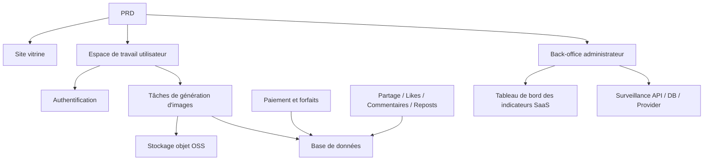

# Développement pratique d'une SaaS de génération d'images IA moderne

## Aperçu

Ce projet pratique vous demande de réaliser, à partir d'un véritable PRD (document d'exigences produit), une SaaS de génération d'images IA inspirée de l'expérience Midjourney. Vous passerez par l'ensemble du processus : analyse des besoins, décomposition du projet, développement itératif et mise en ligne.

Il s'agit du projet pratique synthétique de l'Étape 2. Dans les chapitres précédents, vous avez appris séparément la conception de pages frontend, le développement d'API backend, les opérations sur les bases de données et l'intégration de paiements. Ce projet vous demande de tout assembler pour livrer un prototype de produit fonctionnel.

## Prérequis

Avant de commencer ce projet, vous devriez maîtriser les éléments suivants :

- Conception de pages frontales et utilisation de bibliothèques de composants ([Conception UI](../../frontend/ui-design/), [Bibliothèque de composants moderne](../../frontend/modern-component-library/))
- Conception et développement d'API backend ([Écriture de code d'interface](../../backend/ai-interface-code/))
- Bases de données et Supabase ([Des bases de données à Supabase](../../backend/database-supabase/))
- Intégration de paiements ([Système de paiement Stripe](../../backend/stripe-payment/))
- Flux de travail Git et déploiement ([Git et GitHub](../../backend/git-workflow/), [Déployer une application web](../../backend/zeabur-deployment/))

## Objectifs d'apprentissage

Après avoir terminé ce projet, vous serez capable de :

1. Lire et comprendre un véritable PRD et en extraire une liste de tâches de développement
2. Décomposer les modules à partir du PRD et établir un plan de progression par étapes
3. Utiliser l'IA pour vous aider à construire le squelette frontend et développer les API backend
4. Valider et optimiser de manière itérative chaque module
5. Effectuer des tests de bout en bout et faire passer le projet du stade « fonctionnel » à « livrable »

## Présentation du projet

Le produit que vous allez construire est une plateforme SaaS de génération d'images IA moderne, comprenant trois sous-systèmes :

| Sous-système | Responsabilité |
|--------|------|
| **Site vitrine** | Présentation du produit, tarification, FAQ, conversion des inscriptions |
| **Espace de travail utilisateur** | Saisie de prompts, génération d'images, galerie, crédits, forfaits, interactions communautaires |
| **Back-office administrateur** | Gestion des utilisateurs, des tâches, des paiements, modération du contenu, indicateurs SaaS, surveillance système |

Le backend doit prendre en charge les capacités principales suivantes : authentification des utilisateurs, tâches de génération d'images, stockage objet OSS, paiement par crédits et forfaits, interactions sociales autour des images et surveillance des données opérationnelles.

::: tip Accès au PRD
Le document d'exigences de ce projet se trouve sur GitHub : [Voir le PRD](https://github.com/datawhalechina/easy-vibe/blob/main/docs/fr-fr/stage-2/assignments/modern-landing-page/PRD.md)
:::

<div style="margin: 32px 0;">
  <ClientOnly>
    <StepBar :active="0" :items="[
      { title: 'Analyse des besoins', description: 'Lire le PRD, extraire les pages, modules, modèles de données et limites' },
      { title: 'Construction du squelette', description: 'Générer avec l\'IA trois squelettes frontend (www / app / admin)' },
      { title: 'Développement itératif', description: 'Compléter module par module : API, permissions, paiement, surveillance' },
      { title: 'Tests et mise en ligne', description: 'Tests de bout en bout, déploiement et préparation de la démonstration' }
    ]" />
  </ClientOnly>
</div>

## Partie 1 : Analyse des besoins

### 1.1 Lire le PRD

Ouvrez le document PRD et répondez aux questions suivantes :

- Combien le système a-t-il de points d'accès ? Quelles pages chaque point couvre-t-il ?
- Quelle est la fonctionnalité principale de chaque page ?
- Quels modules et tables de données le backend comprend-il ?
- Quelle est la portée du MVP ? Que fait-on dans la première version, que laisse-t-on de côté ?

::: warning
Si les questions ci-dessus n'ont pas de réponse claire, ne commencez pas à coder. Une mauvaise compréhension des besoins est la cause la plus fréquente de retour en arrière.
:::

### 1.2 Confirmer l'architecture du système

À partir de la description du PRD, dégagez l'architecture globale du système :



Il est recommandé de redessiner le diagramme d'architecture vous-même pour confirmer que votre compréhension du système est complète.

## Partie 2 : Construction du squelette du projet

### 2.1 Générer les pages frontales

Utilisez l'IA pour générer d'abord la structure de base et les données fictives de toutes les pages. L'objectif de cette étape est de mettre en place l'architecture de l'information et le routage, sans connexion à une API réelle.

Prompt de référence :

```text
Veuillez générer, sur la base du PRD actuel, le squelette frontend d'une SaaS de génération d'images IA moderne.

Exigences :
1. Divisé en trois points d'accès : www, app, admin
2. Le site vitrine comprend : page d'accueil, tarification, FAQ
3. L'app comprend : connexion, inscription, espace de génération, galerie, forfaits, crédits, communauté, détails des œuvres, profil utilisateur
4. L'admin comprend : accueil du back-office, gestion des utilisateurs, gestion des tâches, gestion du contenu, gestion des forfaits, commandes de paiement, configuration opérationnelle, indicateurs SaaS, surveillance système
5. Générer d'abord uniquement la structure des pages et des données fictives, sans connexion à une API réelle
6. Style inspiré de Midjourney : épuré, moderne, avec une sensation produit
```

### 2.2 Vérifier la structure des pages

Après la génération du squelette, vérifiez point par point :

- [ ] Les routes des trois points d'accès sont-elles indépendantes (`/`, `/app`, `/admin`) ?
- [ ] Le nombre de pages correspond-il au PRD ?
- [ ] Chaque page est-elle accessible et navigable normalement ?
- [ ] Les données fictives montrent-elles les états UI de base (listes, états vides, formulaires, etc.) ?

## Partie 3 : Développement itératif

### 3.1 Progresser par module

Sur la base du squelette, complétez les fonctionnalités module par module dans l'ordre suivant :

1. **Authentification** : Inscription, connexion, distinction des rôles
2. **Base de données** : Création des tables de données, API de lecture/écriture
3. **Cœur du métier** : Tâches de génération d'images, stockage des résultats
4. **Stockage OSS** : Upload et accès aux images
5. **Paiement** : Forfaits, crédits, intégration Stripe
6. **Interactions sociales** : Partage, likes, commentaires
7. **Back-office** : Gestion des utilisateurs, des tâches, modération du contenu
8. **Surveillance des données** : Tableau de bord des indicateurs SaaS, surveillance système

Après chaque module terminé, effectuez une auto-vérification à l'aide du tableau suivant :

| Point de contrôle | Méthode de vérification |
|--------|----------|
| Cohérence des pages | Le nombre de pages, les points d'accès et les fonctionnalités correspondent-ils au PRD ? |
| Exactitude des API | Les paramètres de requête, la structure de retour et la gestion des statuts sont-ils raisonnables ? |
| Isolation des permissions | Les utilisateurs normaux et les administrateurs sont-ils correctement isolés ? |
| Cohérence des données | La base de données, le stockage OSS, les paiements et les crédits sont-ils cohérents ? |
| Démontrabilité | Pouvez-vous démontrer un flux métier complet à quelqu'un ? |

::: tip
Si vous constatez que le contenu généré par l'IA s'écarte du PRD, ne repartez pas de zéro pour toute la page. Demandez-lui simplement de modifier le module spécifique concerné.
:::

### 3.2 Rôles et responsabilités

Au cours du développement itératif, vous devez jouer trois rôles simultanément :

- **Chef de produit** : Confirmer que les fonctionnalités de chaque module correspondent au PRD
- **Responsable technique** : Confirmer que la solution d'implémentation est raisonnable
- **Ingénieur de test** : Confirmer que les fonctionnalités fonctionnent correctement

## Partie 4 : Tests et mise en ligne

### 4.1 Tests de bout en bout

L'accent dans la phase finale n'est pas sur l'ajout de nouvelles pages, mais sur la validation complète des flux métier. Vérifiez au minimum les scénarios suivants :

- Inscription -> Achat de crédits -> Génération d'images -> Consultation de l'historique -> Interactions sociales
- Connexion administrateur -> Consultation des données utilisateurs -> Consultation des statistiques de tâches -> Consultation de la surveillance système

### 4.2 Déploiement

Déployez le projet dans un environnement public et assurez-vous que :

- Les variables d'environnement sont entièrement configurées
- L'URL de callback de connexion est correcte
- L'URL de callback de paiement est correcte
- Aucune page ne présente d'états de chargement, vides ou d'erreurs manquants

Tutoriel de déploiement : [Flux de travail Git et GitHub](../../backend/git-workflow/), [Comment déployer une application web](../../backend/zeabur-deployment/).

## Livrables

Après avoir terminé ce projet, vous devez soumettre les éléments suivants :

- [ ] Un lien de démonstration en ligne accessible
- [ ] Un lien vers le dépôt de code source (avec README)
- [ ] Le document PRD
- [ ] Des captures d'écran des pages principales (accueil du site vitrine, espace de génération, galerie, page des forfaits, accueil du back-office)
- [ ] Une vidéo de démonstration de 60 secondes (couvrant : inscription -> génération -> consultation -> back-office admin)

Le README doit contenir au minimum : la présentation du projet, la description des pages principales, la stack technique, les étapes de démarrage local et la liste des variables d'environnement.

## Critères d'évaluation

| Dimension | Exigences de base | Exigences avancées |
|------|---------|---------|
| Alignement PRD | Pages, fonctionnalités et structures de données globalement conformes au PRD | Chaque décision de design peut être clairement reliée au PRD |
| Boucle produit | Inscription -> Achat de crédits -> Génération d'images -> Historique -> Interactions sociales fonctionne | État des paiements, solde des crédits et nombre de générations sont cohérents |
| Capacités du back-office | Gestion des utilisateurs, des tâches, des paiements et du contenu est visible | Le tableau de bord des indicateurs SaaS et la page de surveillance système sont complets et fonctionnels |
| Complétude technique | Frontend, backend, base de données, OSS et chaîne de paiement sont connectés | Gestion des erreurs, états vides et états de chargement sont présents |
| Qualité de livraison | Peut être déployé et exécuté | README clair, vidéo de démonstration bien structurée |

## Références

- [Conception UI](../../frontend/ui-design/)
- [Concevoir des pages et des boutons en référençant les guidelines UI](../../frontend/multi-product-ui/)
- [Rendre les interfaces attrayantes avec les LLM et les Skills](../../frontend/llm-skills-beautiful/)
- [Du prototype de design au code de projet](../../frontend/design-to-code/)
- [Mettre à jour votre interface avec une bibliothèque de composants moderne](../../frontend/modern-component-library/)
- [Des bases de données à Supabase](../../backend/database-supabase/)
- [Écriture de code d'interface assistée par IA](../../backend/ai-interface-code/)
- [Flux de travail Git et GitHub](../../backend/git-workflow/)
- [Comment déployer une application web](../../backend/zeabur-deployment/)
- [Comment intégrer Stripe et d'autres systèmes de paiement](../../backend/stripe-payment/)
