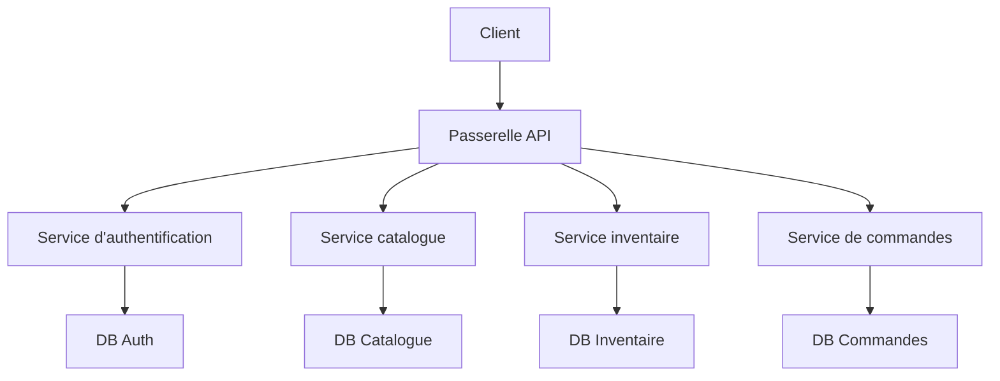

# Développement pratique d'un système de microservices pour l'e-commerce de produits frais

## Aperçu

Ce projet pratique vous demande de réaliser, à partir d'un véritable PRD, un système de microservices pour l'e-commerce de produits frais. Contrairement aux projets précédents basés sur un seul service, le backend de ce projet est découpé en plusieurs services indépendants selon le domaine métier, communiquant via une passerelle API unifiée. Vous apprendrez à concevoir les limites des services et à gérer la cohérence des données entre services.

Il s'agit du projet pratique synthétique de l'Étape 2. L'architecture microservices est très courante en milieu professionnel. Une fois les principes de découpage des services et de routage par passerelle maîtrisés, vous serez en mesure de concevoir des systèmes backend plus complexes.

## Prérequis

Avant de commencer ce projet, vous devriez maîtriser les éléments suivants :

- Conception de pages frontales et utilisation de bibliothèques de composants ([Conception UI](../../frontend/ui-design/), [Bibliothèque de composants moderne](../../frontend/modern-component-library/))
- Conception et développement d'API backend ([Écriture de code d'interface](../../backend/ai-interface-code/))
- Bases de données et Supabase ([Des bases de données à Supabase](../../backend/database-supabase/))
- Flux de travail Git et déploiement ([Git et GitHub](../../backend/git-workflow/), [Déployer une application web](../../backend/zeabur-deployment/))

## Objectifs d'apprentissage

Après avoir terminé ce projet, vous serez capable de :

1. Lire un PRD et en extraire une liste de tâches de développement pour un système de microservices
2. Découper les limites des services par domaine métier (authentification, catalogue, inventaire, commandes)
3. Concevoir et implémenter le routage d'une passerelle API
4. Gérer les problèmes inter-services tels que la décrémentation de stock et la cohérence des commandes
5. Effectuer des tests de bout en bout et livrer un prototype de microservices démontrable

## Présentation du projet

Le produit que vous allez construire est un système de microservices pour l'e-commerce de produits frais :

| Sous-système | Responsabilité |
|--------|------|
| **Portail client** | Parcourir les produits, passer des commandes, consulter les commandes |
| **Portail gestion** | Gestion des produits, gestion des stocks, gestion des commandes |

Le backend est découpé en services par domaine métier :

| Service | Responsabilité |
|------|------|
| **Passerelle API** | Point d'entrée unique, routage, validation de l'authentification |
| **Service d'authentification** | Inscription, connexion, émission de JWT |
| **Service catalogue** | Gestion des informations produits |
| **Service inventaire** | Gestion des quantités en stock |
| **Service de commandes** | Création et gestion du statut des commandes |

::: tip Accès au PRD
Le document d'exigences de ce projet se trouve sur GitHub : [Voir le PRD](https://github.com/datawhalechina/easy-vibe/blob/main/docs/fr-fr/stage-2/assignments/simple-grocery-microservices/PRD.md)
:::

<div style="margin: 32px 0;">
  <ClientOnly>
    <StepBar :active="0" :items="[
      { title: 'Analyse des besoins', description: 'Lire le PRD, clarifier la découpe des services, les API et la cohérence des données' },
      { title: 'Construction du squelette', description: 'Générer avec l\'IA le squelette de la passerelle et des services de base' },
      { title: 'Développement itératif', description: 'Compléter les services un par un : auth, catalogue, inventaire, commandes' },
      { title: 'Tests et mise en ligne', description: 'Tests de bout en bout, déploiement et préparation de la démonstration' }
    ]" />
  </ClientOnly>
</div>

## Partie 1 : Analyse des besoins

### 1.1 Lire le PRD

Ouvrez le document PRD et répondez aux questions suivantes :

- Comment les services sont-ils découpés ? Chaque service a-t-il sa propre base de données ?
- Comment la passerelle API route-t-elle les requêtes vers les services concernés ?
- Comment gérer la cohérence entre la décrémentation de stock et la création de commande ?
- Quelles sont les fonctionnalités du MVP ?

::: warning
Si les questions ci-dessus n'ont pas de réponse claire, ne commencez pas à coder. Une mauvaise compréhension des besoins est la cause la plus fréquente de retour en arrière.
:::

### 1.2 Confirmer l'architecture du système



## Partie 2 : Construction du squelette du projet

### 2.1 Générer les pages frontales

Prompt de référence :

```text
Veuillez générer, sur la base du PRD actuel, le squelette frontend d'un système e-commerce de produits frais.

Exigences :
1. Portail client : liste des produits, panier, page de commande, historique des commandes
2. Portail gestion : gestion des produits, gestion des stocks, gestion des commandes
3. Générer d'abord uniquement la structure des pages et des données fictives
```

### 2.2 Vérifier la structure des pages

- [ ] Le portail client et le portail gestion sont-ils séparés ?
- [ ] La liste des produits, le panier et les commandes fonctionnent-ils ?
- [ ] Le portail gestion permet-il de gérer les produits et les stocks ?

## Partie 3 : Développement itératif

### 3.1 Progresser par service

1. **Passerelle API** : Routage des requêtes, validation JWT
2. **Service d'authentification** : Inscription, connexion, émission de tokens
3. **Service catalogue** : CRUD des produits, recherche
4. **Service inventaire** : Suivi des stocks, décrémentation lors des commandes
5. **Service de commandes** : Création de commandes, suivi du statut, historique

### 3.2 Points d'attention inter-services

- **Cohérence des stocks** : Lorsqu'une commande est créée, le stock doit être décrémenté de manière fiable
- **Communication entre services** : Utiliser des appels API synchrones ou des événements asynchrones
- **Gestion des erreurs** : Que se passe-t-il si le service d'inventaire est indisponible lors d'une commande ?

## Partie 4 : Tests et mise en ligne

### 4.1 Tests de bout en bout

- Parcourir les produits -> Ajouter au panier -> Commander -> Vérifier la mise à jour du stock
- Gestion : Ajouter un produit -> Vérifier qu'il apparaît côté client

### 4.2 Déploiement

- Déployer chaque service indépendamment sur Zeabur / Railway / Render
- Configurer la passerelle API pour router vers les services déployés
- Utiliser des bases de données séparées ou Supabase avec des schémas distincts

## Livrables

- [ ] Un lien de démonstration en ligne accessible
- [ ] Un lien vers le dépôt de code source (avec README)
- [ ] Le document PRD
- [ ] Des captures d'écran des pages principales
- [ ] Une vidéo de démonstration de 60 secondes

## Critères d'évaluation

| Dimension | Exigences de base | Exigences avancées |
|------|---------|---------|
| Services | L'authentification et le catalogue fonctionnent | L'inventaire et les commandes sont connectés |
| Passerelle | Les requêtes sont correctement routées | La validation JWT est opérationnelle |
| Technique | Chaque service peut être démarré indépendamment | La cohérence inter-services est gérée |
| Livraison | Le projet peut être exécuté et déployé | README clair et vidéo de démonstration |

## Références

- [Conception UI](../../frontend/ui-design/)
- [Bibliothèque de composants moderne](../../frontend/modern-component-library/)
- [Des bases de données à Supabase](../../backend/database-supabase/)
- [Écriture de code d'interface assistée par IA](../../backend/ai-interface-code/)
- [Flux de travail Git et GitHub](../../backend/git-workflow/)
- [Comment déployer une application web](../../backend/zeabur-deployment/)
