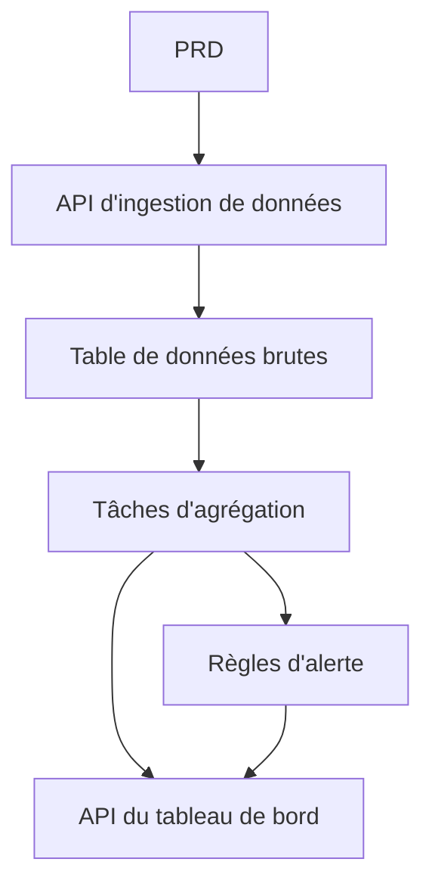

# Développement pratique d'une plateforme d'analyse de données de transport en Go

## Aperçu

Ce projet pratique vous demande de réaliser, à partir d'un véritable PRD, une plateforme d'analyse de données de transport en utilisant Go. Contrairement aux projets précédents de type CRUD, vous allez construire une chaîne de données complète : « ingestion de données → agrégation → alertes → visualisation ». Ce type de produit de données est très courant dans les scénarios IoT, la supervision et l'analyse opérationnelle.

Il s'agit du projet pratique synthétique de l'Étape 2, et c'est également votre premier contact avec le langage Go. Rassurez-vous, avec les bases en JavaScript / TypeScript acquises précédemment, l'apprentissage de Go n'est pas difficile — l'essentiel est de comprendre la logique de conception de la chaîne de données.

## Prérequis

Avant de commencer ce projet, vous devriez maîtriser les éléments suivants :

- Conception de pages frontales et utilisation de bibliothèques de composants ([Conception UI](../../frontend/ui-design/), [Bibliothèque de composants moderne](../../frontend/modern-component-library/))
- Conception et développement d'API backend ([Écriture de code d'interface](../../backend/ai-interface-code/))
- Bases de données et Supabase ([Des bases de données à Supabase](../../backend/database-supabase/))
- Flux de travail Git et déploiement ([Git et GitHub](../../backend/git-workflow/), [Déployer une application web](../../backend/zeabur-deployment/))

## Objectifs d'apprentissage

Après avoir terminé ce projet, vous serez capable de :

1. Lire un PRD et en extraire une liste de tâches de développement pour un produit de données
2. Utiliser Go (Gin ou Fiber) pour mettre en place un service d'API backend
3. Concevoir une chaîne complète d'ingestion de données, d'agrégation par fenêtre temporelle et d'alertes
4. Maintenir la cohérence entre les données backend et le tableau de bord frontend
5. Effectuer des tests de bout en bout et livrer un prototype de produit de données démontrable

## Présentation du projet

Le produit que vous allez construire est une plateforme d'analyse de données de transport en Go :

| Module | Responsabilité |
|------|------|
| **Ingestion de données** | Réceptionner les événements de transport bruts et les stocker en base |
| **Agrégation de données** | Calculer les tendances et indicateurs de congestion par fenêtre temporelle |
| **Alertes** | Générer des enregistrements d'alerte basés sur des règles |
| **Tableau de bord** | Afficher les graphiques de tendances, les classements et la liste des alertes |

::: tip Accès au PRD
Le document d'exigences de ce projet se trouve sur GitHub : [Voir le PRD](https://github.com/datawhalechina/easy-vibe/blob/main/docs/fr-fr/stage-2/assignments/traffic-data-visualization-go/PRD.md)
:::

<div style="margin: 32px 0;">
  <ClientOnly>
    <StepBar :active="0" :items="[
      { title: 'Analyse des besoins', description: 'Lire le PRD, clarifier les sources de données, les définitions des indicateurs et les règles d\'alerte' },
      { title: 'Construction du squelette', description: 'Générer avec l\'IA le service Go API et le squelette du tableau de bord frontend' },
      { title: 'Développement itératif', description: 'Compléter la logique d\'agrégation, les règles d\'alerte et les API du tableau de bord' },
      { title: 'Tests et mise en ligne', description: 'Tests de bout en bout, déploiement et préparation de la démonstration' }
    ]" />
  </ClientOnly>
</div>

## Partie 1 : Analyse des besoins

### 1.1 Lire le PRD

Ouvrez le document PRD et répondez aux questions suivantes :

- Quelle est la source des données ? Quels sont les champs disponibles ?
- Quelle est la définition des indicateurs clés ? (par exemple, le critère exact de « congestion »)
- Quelles sont les règles d'alerte ? Faut-il se limiter à des règles simples dans la première version ?
- Quelles pages et graphiques le tableau de bord doit-il contenir ?

::: warning
Si les questions ci-dessus n'ont pas de réponse claire, ne commencez pas à coder. Une mauvaise compréhension des besoins est la cause la plus fréquente de retour en arrière.
:::

### 1.2 Confirmer la chaîne de données



## Partie 2 : Construction du squelette du projet

### 2.1 Générer le service d'API Go

Prompt de référence :

```text
Veuillez générer, sur la base du PRD actuel, le squelette d'une plateforme d'analyse de données de transport en Go.

Exigences :
1. Utiliser Gin ou Fiber
2. Fournir une API d'ingestion de données
3. Fournir le squelette des tâches d'agrégation
4. Fournir le squelette des API dashboard et alerts
5. Ne pas implémenter d'analyse complexe réelle, se limiter à une structure exécutable
```

### 2.2 Vérifier la structure du projet

Vérifiez point par point :

- [ ] Le service Go démarre correctement
- [ ] L'API d'ingestion peut recevoir et stocker des données
- [ ] Le framework des tâches d'agrégation est en place
- [ ] Les pages du tableau de bord frontend affichent des graphiques de base

## Partie 3 : Développement itératif

### 3.1 Progresser par module

1. **API d'ingestion de données** : Recevoir les événements de transport bruts et les écrire en base de données
2. **Agrégation de données** : Agréger par fenêtre temporelle, calculer les tendances et indicateurs de congestion
3. **Règles d'alerte** : Générer des enregistrements d'alerte basés sur des seuils
4. **API du tableau de bord** : Fournir les données de tendances, de classement et la liste des alertes
5. **Tableau de bord frontend** : Graphiques de tendances, classements, page de liste des alertes

### 3.2 Auto-vérification par module

| Point de contrôle | Méthode de vérification |
|--------|----------|
| Ingestion de données | Les données brutes sont-elles correctement stockées en base |
| Définition des agrégations | La logique de calcul des tendances et classements est-elle cohérente |
| Règles d'alerte | Les conditions de déclenchement correspondent-elles aux attentes |
| Cohérence des données | L'affichage du tableau de bord correspond-il aux données backend |
| Conformité des API | Y a-t-il une structure de retour unifiée et une gestion des erreurs |

## Partie 4 : Tests et mise en ligne

### 4.1 Tests de bout en bout

Vérifiez au minimum les scénarios suivants :

- Ingestion d'un jeu de données de test → Exécution des tâches d'agrégation → Mise à jour de l'affichage du tableau de bord
- Déclenchement d'une condition d'alerte → Génération d'un enregistrement d'alerte → Affichage sur la page des alertes

## Livrables

Après avoir terminé ce projet, vous devez soumettre les éléments suivants :

- [ ] Un lien de démonstration en ligne accessible
- [ ] Un lien vers le dépôt de code source (avec README)
- [ ] Le document PRD
- [ ] Des captures d'écran des pages principales (démonstration d'ingestion, tableau de bord des tendances, liste des alertes)
- [ ] Une vidéo de démonstration de 60 secondes

## Critères d'évaluation

| Dimension | Exigences de base | Exigences avancées |
|------|---------|---------|
| Alignement PRD | Les fonctionnalités et structures de données sont globalement conformes au PRD | Les définitions des indicateurs et la logique d'agrégation sont clairement expliquées |
| Chaîne de données | Ingestion → Agrégation → Alertes → Tableau de bord fonctionnel | Les tâches d'agrégation supportent les mises à jour incrémentales |
| Capacités d'analyse | Les trois modules tendances, classement et alertes sont opérationnels | Les indicateurs sont configurables et les règles d'alerte personnalisables |
| Affichage frontend | Le tableau de bord affiche des graphiques de base | Les graphiques supportent le filtrage par plage de dates |
| Complétude technique | L'API Go, la base de données et la chaîne frontend sont connectées | L'API dispose d'une gestion des erreurs et de journaux unifiés |

## Références

- [Conception UI](../../frontend/ui-design/)
- [Bibliothèque de composants moderne](../../frontend/modern-component-library/)
- [Des bases de données à Supabase](../../backend/database-supabase/)
- [Écriture de code d'interface assistée par IA](../../backend/ai-interface-code/)
- [Flux de travail Git et GitHub](../../backend/git-workflow/)
- [Comment déployer une application web](../../backend/zeabur-deployment/)
