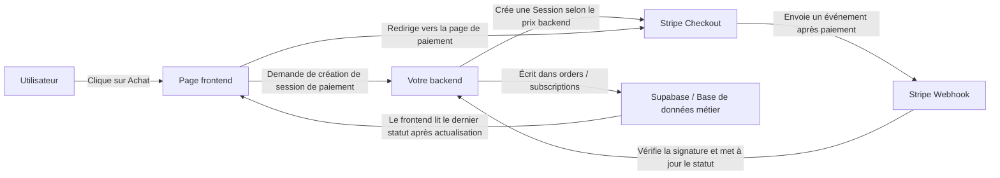
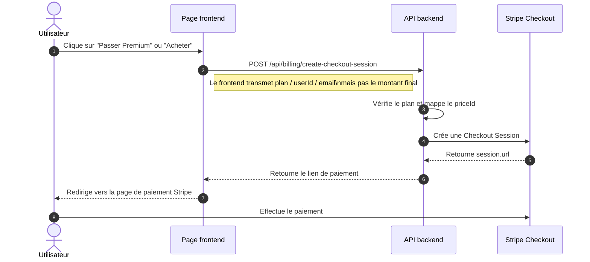
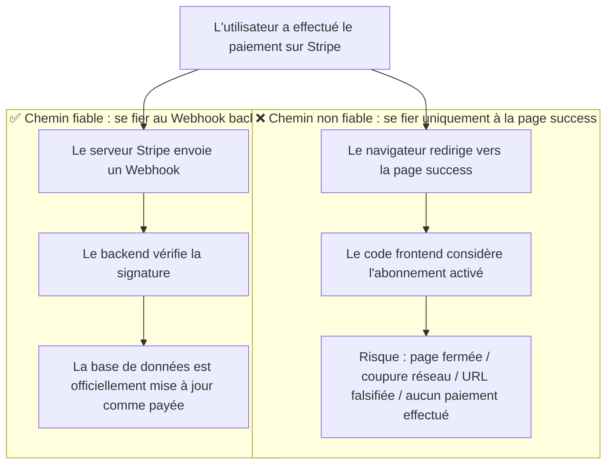
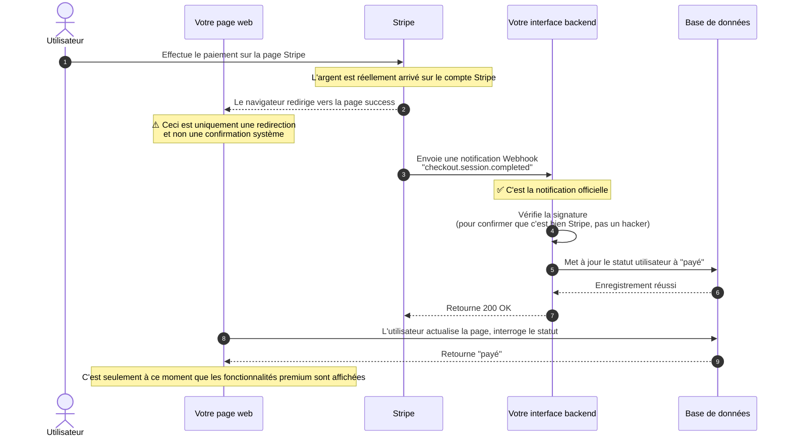
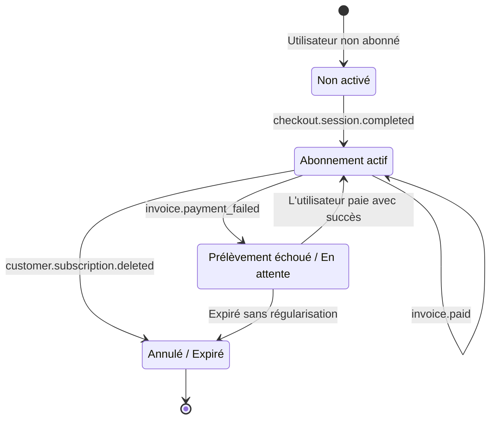
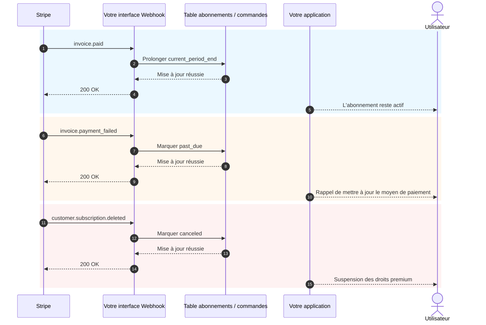

# Comment intégrer Stripe et d'autres systèmes de paiement

Lorsque votre produit dispose déjà de pages, d'un système de connexion, d'une base de données et d'un backend fonctionnel, la question suivante est : **comment facturer**.

Beaucoup de personnes qui intègrent un paiement pour la première fois concentrent toute leur attention sur « comment rediriger vers la page de paiement ». Mais ce qui détermine vraiment la stabilité du système, ce n'est pas le bouton, c'est l'ensemble de la chaîne de facturation : qui décide du prix, qui confirme le succès du paiement, qui met à jour la base de données, qui gère les droits d'accès.

Cet article est divisé en deux parties :

- **La première partie** se concentre uniquement sur l'intégration de base la plus pratique, avec pour objectif de vous permettre d'intégrer Stripe à votre projet le plus rapidement possible.
- **La seconde partie** est regroupée en annexe et couvre les détails des Webhooks, les événements d'abonnement, et les différences de solutions de paiement selon les pays et régions.

> 💡 Il est recommandé d'avoir terminé ces chapitres avant de continuer
>
> - [De la base de données à Supabase](../database-supabase/)
> - [Grands modèles pour écrire du code d'interface et de la documentation d'API](../ai-interface-code/)
> - [Comment déployer une application Web](../zeabur-deployment/)

# Ce que vous allez apprendre

1. À quoi ressemble un système de paiement minimum viable.
2. Comment intégrer Stripe dans votre projet de la manière la plus rapide.
3. Comment rédiger des prompts pour que l'IA ajoute directement un système de paiement.
4. Si vous ne faites pas un projet Stripe à l'international, quelle solution de paiement privilégier selon les régions.

---

# Première partie : prise en main

## 1. Retenez d'abord ces 3 principes

Si vous ne deviez retenir que trois choses, voici lesquelles :

1. **Le prix doit être décidé par le backend**, vous ne pouvez pas faire confiance au montant envoyé par le frontend.
2. **Ce qui active réellement les droits, c'est le Webhook**, pas la page `success`.
3. **Votre propre base de données doit conserver l'état du paiement**, vous ne pouvez pas dépendre uniquement du tableau de bord Stripe.

Ces trois principes constituent les limites essentielles d'un système de paiement. Tant que ces limites sont respectées, que vous passiez ensuite à Stripe, PayPal, Alipay ou WeChat Pay, il s'agit au fond uniquement d'un « changement d'interface, l'architecture reste la même ».

## 2. Que se passe-t-il si, au lieu de traiter côté backend, on connecte Stripe directement depuis le frontend ?

C'est l'idée la plus naturelle pour beaucoup de personnes qui font leur premier paiement :

- Il y a déjà un bouton « Acheter » sur la page
- Ne pourrais-je pas laisser le frontend se connecter directement à Stripe
- Ainsi, pas besoin de backend

Si vous faites simplement une fausse page de démonstration, cette approche ne pose évidemment aucun problème.
Mais si vous comptez vraiment encaisser de l'argent, **cette voie mène généralement à des problèmes sérieux**.

Les problèmes les plus courants sont les suivants :

1. **Le prix est facilement modifiable**
   Les requêtes dans le navigateur sont envoyées depuis l'ordinateur de l'utilisateur. N'importe qui peut modifier le contenu de la requête.
2. **Exposition facile d'informations sensibles**
   Les clés secrètes véritablement importantes, la logique de prix et la logique d'activation des abonnements ne doivent jamais se trouver côté frontend.
3. **Impossible de confirmer de manière fiable « ce paiement est-il vraiment un succès »**
   Le fait que l'utilisateur soit redirigé vers la page de succès ne signifie pas que votre base de données a été correctement synchronisée.
4. **La base de données devient incohérente**
   L'utilisateur peut dire « j'ai bien payé », mais votre propre système n'en a gardé aucune trace.

Une répartition des rôles plus sûre serait donc :

- Frontend : afficher les boutons, initier l'achat, rediriger les pages
- Backend : décider des prix, créer les sessions de paiement, recevoir les Webhooks, mettre à jour la base de données

::: info Vous pouvez résumer cette section en une seule phrase
**Le frontend peut gérer la redirection, mais le backend doit gérer la tarification et la confirmation.**

Dès qu'il s'agit de vrais encaissements, ne confiez jamais au frontend « le pouvoir ultime de décider du prix » ni « la logique d'activation après un paiement réussi ».
:::

## 3. Quand est-il judicieux de commencer par Stripe ?

Si vous travaillez sur les scénarios suivants, Stripe est souvent le point de départ le plus naturel :

- Un SaaS destiné aux utilisateurs internationaux
- Un produit par abonnement
- Des produits numériques, des templates, des packs de crédits IA
- Vous souhaitez valider rapidement la monétisation, plutôt que de gérer d'emblée trop de détails de paiement locaux

Si vos utilisateurs principaux se trouvent en Chine continentale, Stripe n'est généralement pas le premier choix -- ce point sera abordé en annexe.

## 4. La chaîne de paiement minimum viable

Commençons par la version minimale. Tant que cette chaîne fonctionne, votre système de paiement possède une ossature.



Traduit en langage simple :

1. L'utilisateur clique sur le bouton.
2. Le frontend demande au backend un lien de paiement.
3. Le backend crée une session de paiement avec la clé Stripe.
4. L'utilisateur paie sur la page Stripe.
5. Stripe vous notifie que « le paiement a vraiment réussi » via un Webhook.
6. Votre backend met ensuite à jour la base de données.

## 5. Diagramme de séquence standard pour l'initiation d'un paiement

Si vous préférez regarder un diagramme système plus formel, voici le diagramme de séquence :



## 6. Démarrage rapide

Si vous souhaitez l'intégrer le plus rapidement possible dans votre projet, suivez ces 5 étapes.

### 6.1 Étape 1 : Créer des produits et des prix dans le tableau de bord Stripe

L'objectif de cette étape n'est pas « de configurer quelques choses au hasard », mais de définir clairement dans Stripe **ce que vous vendez exactement et comment vous prévoyez de facturer**.

Dans le modèle de Stripe :

- **Product** représente « ce que vous vendez », par exemple `Abonnement Pro`
- **Price** représente « à quel prix vous le vendez et selon quel cycle », par exemple `9,90 USD/mois`, `99 USD/an`

Pourquoi commencer par cette étape ?
Car lorsque votre backend crée ensuite une Checkout Session, il ne transmet pas directement un montant à Stripe, mais un `price_id` déjà existant. Stripe utilise ensuite ce `price_id` pour générer la véritable page de paiement, le montant, la devise et le cycle d'abonnement.

Si vous sautez cette étape, l'étape « créer un lien de paiement » sera tout simplement impossible.

::: info Pourquoi faut-il s'arrêter ici
Beaucoup de débutants trouvent les termes `Product` et `Price` un peu fastidieux, avec l'impression d'apprendre le jargon interne de Stripe.

En réalité, cette étape consiste à faire quelque chose de très simple :
- Définir clairement « ce qu'on vend »
- Définir clairement « à quel prix on le vend »
- Permettre au backend d'utiliser ensuite un `price_id` stable pour créer des liens de paiement

Une fois ce principe compris, les Checkout Sessions ne vous sembleront plus abstraites.
:::

Pour un système d'abonnement minimum viable, vous devez au moins créer ces deux niveaux :

- un `Product`
- un ou plusieurs `Price`

Vous pouvez ouvrir directement ces pages :

- Page de connexion Stripe Dashboard : [Dashboard Login](https://dashboard.stripe.com/login)
- Documentation Stripe sur la gestion des produits et prix : [Manage products and prices](https://docs.stripe.com/products-prices/manage-prices)
- Documentation Stripe de démarrage rapide Checkout : [Build a Stripe-hosted checkout page](https://docs.stripe.com/checkout/quickstart?lang=node)
- Page des produits Stripe Dashboard : [Product catalog](https://dashboard.stripe.com/test/products)

Nous vous recommandons de travailler d'abord en **mode Test**, plutôt que de créer directement en environnement de production.

La configuration minimale la plus courante est :

- `Product` : `Pro Plan`
- `Price 1` : `pro_monthly`
- `Price 2` : `pro_yearly`

Dans le tableau de bord, vous pouvez comprendre l'ordre comme suit :

1. Créez d'abord un produit `Pro Plan`
2. Puis ajoutez deux prix sous ce produit
3. L'abonnement mensuel et l'abonnement annuel sont en réalité deux modes de facturation pour un même produit

Une fois terminé, vous devez au minimum noter ces informations :

- Le `price_id` du prix mensuel
- Le `price_id` du prix annuel
- Vos propres noms de plan, par exemple `pro_monthly`, `pro_yearly`

Si c'est votre première visite dans le tableau de bord Stripe, nous vous conseillons de considérer cette étape comme suit :

- `Product` détermine ce qui est vendu sur la page de paiement
- `Price` détermine le montant facturé sur la page de paiement
- Ce que le backend utilisera réellement par la suite, c'est principalement le `price_id`

::: info Les valeurs vraiment importantes à retenir
Le plus important sur cette page n'est pas le nom du produit, mais le `price_id`.

Par la suite, que ce soit pour demander à l'IA d'intégrer le backend ou pour résoudre vous-même un problème, ce que vous utiliserez le plus souvent est :
- `STRIPE_PRICE_PRO_MONTHLY`
- `STRIPE_PRICE_PRO_YEARLY`
- Les deux `price_id` correspondants
:::

Si vous souhaitez que l'IA vous guide d'abord dans la configuration du tableau de bord, vous pouvez utiliser directement ce prompt :

```text
Je découvre Stripe, ne modifie pas le code pour le moment, guide-moi d'abord pour effectuer la configuration minimale de paiement dans le tableau de bord Stripe.

Base-toi sur ces documents officiels pour me donner des instructions étape par étape :
- https://docs.stripe.com/products-prices/manage-prices
- https://docs.stripe.com/checkout/quickstart?lang=node

Ma situation :
- Je veux créer un abonnement payant le plus simple possible
- Seulement deux plans : mensuel et annuel
- Je ne comprends pas encore les termes Product et Price

Merci de :
1. M'expliquer en termes simples ce que sont Product et Price.
2. Puis me guider dans l'ordre « quelle page ouvrir -> où cliquer -> quoi remplir ».
3. Enfin me rappeler ce que je dois copier depuis le tableau de bord pour le backend.
4. Si je risque de me tromper, me rappeler de rester en mode test.
```

### 6.2 Étape 2 : Préparer les variables d'environnement

Vous aurez généralement besoin d'au moins ces variables d'environnement :

- `STRIPE_SECRET_KEY`
- `STRIPE_WEBHOOK_SECRET`
- `STRIPE_PRICE_PRO_MONTHLY`
- `STRIPE_PRICE_PRO_YEARLY`
- `APP_URL`
- `SUPABASE_URL`
- `SUPABASE_SERVICE_ROLE_KEY`

Vous pouvez ouvrir directement ces pages :

- Documentation Stripe API Keys : [API keys](https://docs.stripe.com/keys)
- Page Stripe Dashboard API Keys : [API Keys](https://dashboard.stripe.com/test/apikeys)
- Documentation Stripe Webhooks : [Receive Stripe events in your webhook endpoint](https://docs.stripe.com/webhooks)
- Page Stripe Dashboard Webhooks : [Workbench Webhooks](https://dashboard.stripe.com/test/workbench/webhooks)

> ⚠️ `STRIPE_SECRET_KEY` et `SUPABASE_SERVICE_ROLE_KEY` ne doivent être placés que côté backend.

::: info L'objectif de cette étape sur les variables d'environnement
Cette étape ne vise pas à « remplir le `.env` au maximum », mais à placer les éléments les plus sensibles du système de paiement sous la garde du backend :

- La clé secrète Stripe
- La clé de vérification Webhook
- Votre mapping de prix

En résumé :
Le frontend ne fait qu'initier l'achat, les véritables secrets et la logique de tarification doivent rester côté serveur.
:::

Cette étape peut aussi être confiée directement à l'IA :

```text
Regarde d'abord comment mon projet stocke actuellement les variables d'environnement, puis aide-moi à lister celles dont Stripe a besoin.

Référence-toi à ces documents :
- https://docs.stripe.com/keys
- https://docs.stripe.com/webhooks

Ma situation :
- Je suis débutant
- Je ne distingue pas quelles variables vont au frontend et lesquelles au backend
- Je ne suis pas sûr de devoir modifier `.env`, `.env.local` ou un autre fichier

Merci de :
1. Chercher dans le projet où les variables d'environnement sont habituellement stockées.
2. Lister les variables minimales nécessaires pour l'intégration Stripe.
3. M'expliquer en termes simples le rôle de chaque variable.
4. M'indiquer sur quelle page Stripe aller copier chaque variable.
5. S'il existe un fichier d'exemple de variables d'environnement dans le projet, ajouter directement les noms de variables.
```

### 6.3 Étape 3 : Le backend crée la Checkout Session

Vous n'avez pas besoin d'écrire l'interface vous-même, laissez l'IA s'en charger en se référant à la documentation officielle.

Commencez par lui fournir ces documents :

- Démarrage rapide Stripe Checkout : [Build a Stripe-hosted checkout page](https://docs.stripe.com/checkout/quickstart?lang=node)
- API Checkout Sessions : [Create a Checkout Session](https://docs.stripe.com/api/checkout/sessions/create)
- Documentation sur les abonnements : [Subscriptions](https://docs.stripe.com/payments/subscriptions)

Puis collez directement ce prompt :

```text
Regarde d'abord comment le code backend de mon projet actuel est organisé, puis aide-moi à y intégrer le paiement Stripe.

Référence-toi à ces documents officiels :
- https://docs.stripe.com/checkout/quickstart?lang=node
- https://docs.stripe.com/api/checkout/sessions/create
- https://docs.stripe.com/payments/subscriptions

Mon objectif est simple :
- Après que l'utilisateur a cliqué sur le bouton d'achat, il est redirigé vers la page de paiement Stripe
- Il n'y a que deux plans : mensuel et annuel
- Ne me laisse pas décider moi-même où placer le code, analyse d'abord le projet puis place-le au bon endroit

Merci de :
1. Rechercher dans le projet pour identifier le fichier d'entrée backend, les fichiers de route et le format des variables d'environnement.
2. En te référant à la documentation officielle, intégrer l'étape « création du lien de paiement Stripe ».
3. Ne pas me laisser transmettre le montant moi-même, le prix doit être déterminé par les variables d'environnement du backend.
4. M'indiquer quels fichiers tu as modifiés.
5. Me dire quelles configurations supplémentaires je dois effectuer dans le tableau de bord Stripe.
```

### 6.4 Étape 4 : Le frontend redirige vers la page de paiement

L'objectif de cette étape est très simple : faire en sorte que le bouton de la page de tarification appelle votre interface backend, puis redirige vers Stripe Checkout.

Documentation de référence :

- Guide d'intégration Stripe Checkout : [Build an integration with Checkout](https://docs.stripe.com/payments/checkout/build-integration)

Prompt pour l'IA :

```text
Aide-moi à connecter le bouton « Acheter » du projet à Stripe.

Exigences :
- Ne pas modifier les pages existantes, uniquement changer la logique après le clic sur le bouton
- Après le clic, appeler l'interface backend pour obtenir le lien de paiement, puis rediriger vers Stripe
- En cas d'erreur, afficher un message simple à l'utilisateur (par exemple « Le paiement est temporairement indisponible, veuillez réessayer plus tard »)

Documentation de référence : https://docs.stripe.com/payments/checkout/build-integration
```

### 6.5 Étape 5 : Le Webhook met à jour l'état dans la base de données

C'est l'étape la plus critique.

::: info Pourquoi cette étape est-elle la plus critique
Beaucoup de gens pensent que « l'utilisateur a payé et a été redirigé vers la page de succès » signifie que c'est terminé.

Non.

Pour votre système, ce qui compte vraiment est :
**Stripe a-t-il officiellement envoyé l'événement à votre Webhook, et votre backend a-t-il réussi à mettre à jour l'état dans la base de données ?**
:::

Vous pouvez également demander à l'IA d'implémenter directement cette étape en suivant la documentation officielle des Webhooks Stripe, sans l'écrire manuellement.

Documentation de référence :

- Stripe Webhooks : [Receive Stripe events in your webhook endpoint](https://docs.stripe.com/webhooks)
- Stripe CLI : [Stripe CLI](https://docs.stripe.com/stripe-cli)
- Utilisation de Stripe CLI : [Use the Stripe CLI](https://docs.stripe.com/stripe-cli/use-cli)

Prompt pour l'IA :

```text
Continue à m'aider à intégrer l'étape « activation automatique après un paiement réussi » avec Stripe.

Référence-toi à ces documents officiels :
- https://docs.stripe.com/webhooks
- https://docs.stripe.com/stripe-cli
- https://docs.stripe.com/stripe-cli/use-cli

Mon objectif :
- Après que l'utilisateur a payé, il ne s'agit pas simplement d'être redirigé vers la page de succès
- Il faut réellement mettre à jour le statut d'abonnement dans ma base de données

Merci de :
1. Rechercher d'abord dans le projet comment le code lié à la base de données et le statut utilisateur sont stockés.
2. Ajouter le webhook Stripe.
3. Après un paiement réussi, passer l'utilisateur en statut actif, ou mettre à jour le champ de statut d'abonnement déjà utilisé dans le projet.
4. S'il existe déjà des tables d'abonnement, de commandes ou d'utilisateurs dans le projet, continuer à utiliser la structure existante.
5. M'indiquer quels fichiers tu as modifiés.
6. M'expliquer comment tester localement si cette étape fonctionne réellement.
```

## 7. Prompt pour une intégration rapide par l'IA

Si vous utilisez un outil comme Codex, Claude Code, Trae ou Cursor, vous pouvez directement coller le prompt suivant pour lui demander d'intégrer le paiement dans votre projet.

```text
Aide-moi à intégrer le paiement Stripe dans le projet actuel. Je veux créer la fonctionnalité d'abonnement payant la plus simple possible qui fonctionne.

Mes exigences :
1. Je suis débutant, commence par analyser le projet toi-même, puis décide où modifier le code.
2. Ne me laisse pas juger moi-même la structure des répertoires, des routes ou de la base de données.
3. Je veux uniquement la version la plus simple : deux plans, mensuel et annuel.
4. Après que l'utilisateur a cliqué sur Acheter, il est redirigé vers la page de paiement Stripe.
5. Après un paiement réussi, le statut d'abonnement dans ma base de données passe à activé.
6. N'ajoute pas trop de fonctionnalités complexes au début, comme des coupons, des montées ou descentes de grade, des factures complexes.

Résultat attendu :
1. Donne-moi d'abord un plan de modifications.
2. Modifie ensuite directement le code.
3. Explique-moi ensuite comment tester étape par étape en local.
4. S'il y a des étapes nécessitant des opérations dans le tableau de bord Stripe, donne-moi directement le lien et les points clés.
```

Si vous souhaitez que l'IA soit plus adaptée à votre projet, vous pouvez également ajouter en début de prompt :

- Votre framework frontend
- La structure des répertoires de votre backend
- Les noms de vos tables de base de données
- Que votre système utilisateur est Supabase Auth ou un système Auth personnalisé

## 7.1 Déléguer également les tests d'intégration locaux à l'IA

Si vous souhaitez que l'IA vous guide même pour les tests d'intégration locaux, vous pouvez utiliser directement ce prompt :

```text
Continue à m'aider à faire fonctionner réellement le paiement Stripe. Je veux suivre étape par étape, sans avoir à deviner.

Référence-toi à la documentation officielle :
- https://docs.stripe.com/webhooks
- https://docs.stripe.com/stripe-cli
- https://docs.stripe.com/stripe-cli/use-cli

Mon objectif :
1. Dis-moi d'abord quelles pages Stripe ouvrir.
2. Explique-moi comment obtenir le STRIPE_WEBHOOK_SECRET.
3. Explique-moi comment utiliser stripe login et stripe listen.
4. Montre-moi comment vérifier que checkout.session.completed a bien atteint le webhook local.
5. Si le projet nécessite de lancer d'abord le frontend et le backend, donne-moi aussi les commandes spécifiques.
6. Ne te contente pas de théorie, donne-moi les étapes opérationnelles concrètes.
7. Si je me trompe à une étape, dis-moi à quoi ressemblent les erreurs les plus courantes.
```

## 8. Les 4 pièges les plus fréquents

1. **Considérer la page `success` comme un paiement réussi**
   Ce qui détermine réellement le statut, c'est le Webhook, pas la redirection frontend.
2. **Laisser le frontend transmettre le montant**
   Cela crée un risque sérieux de falsification du prix.
3. **La route Webhook est pré-traitée par `express.json()`**
   La vérification de signature Stripe nécessite le corps brut de la requête.
4. **Absence de traitement idempotent**
   Les Webhooks peuvent être renvoyés. Si vous ajoutez un abonnement ou des crédits à chaque fois, vous créez un incident.

## 9. Recommandation de sélection en une phrase

Si vous voulez simplement faire fonctionner la facturation dès maintenant :

| Vos utilisateurs principaux | Solution à essayer en premier |
| :--- | :--- |
| SaaS international / utilisateurs étrangers | Stripe |
| Utilisateurs en Chine continentale | Alipay / WeChat Pay |
| Hong Kong ou équipes transfrontalières | Stripe + solution agrégée portefeuille local / FPS |

Les détails spécifiques sont regroupés en annexe.

::: info L'approche de sélection la plus simple
Ne commencez pas par vouloir « intégrer tous les moyens de paiement du monde d'un coup ».

L'ordre plus pragmatique est généralement :
- Choisir d'abord une chaîne de paiement principale selon la région de vos utilisateurs principaux
- Faire fonctionner le paiement minimum viable
- Puis ajouter un deuxième, puis un troisième moyen de paiement selon les sources réelles d'utilisateurs
:::

## 10. Résumé

Vous maîtrisez désormais la chaîne de facturation la plus basique mais la plus importante :

1. Le frontend initie l'achat.
2. Le backend crée une Checkout Session.
3. L'utilisateur paie sur la page Stripe.
4. Stripe notifie le backend via un Webhook.
5. Le backend met à jour la base de données.
6. Le frontend affiche le nouveau statut d'abonnement ou de commande après actualisation.

Si vous souhaitez simplement intégrer rapidement le paiement dans votre projet, le contenu précédent suffit. Les annexes ci-dessous sont à consulter lorsque vous rencontrerez réellement des problèmes.

---

# Annexes

## Annexe A : Les objets les plus courants dans Stripe

Lorsque vous lisez la documentation Stripe pour la première fois, ces noms d'objets peuvent facilement vous désorienter. Vous n'avez en réalité besoin de comprendre que les quelques suivants :

| Objet | Rôle | À quoi vous pouvez le comparer |
| :--- | :--- | :--- |
| `Product` | Décrit ce qui est vendu | Un produit ou un plan d'abonnement |
| `Price` | Décrit le prix et le cycle de facturation | Mensuel, annuel, achat unique |
| `Checkout Session` | Flux de paiement hébergé par Stripe | La page de paiement |
| `Subscription` | Relation d'abonnement récurrent | Abonnement à renouvellement automatique |
| `Customer` | L'utilisateur qui paie | Le dossier client dans Stripe |
| `Webhook` | Notification asynchrone | Stripe vous indique « que s'est-il passé avec ce paiement » |

## Annexe B : Pourquoi la page `success` ne signifie pas que le paiement a réussi

Beaucoup de gens pensent que « l'utilisateur a payé et a été redirigé vers la page de succès » équivaut à un paiement réussi. C'est le piège le plus fréquent.

### Un scénario réel

Supposons que vous ayez créé un site d'abonnement :
1. L'utilisateur clique sur « Acheter un abonnement »
2. Redirection vers la page de paiement Stripe
3. L'utilisateur saisit sa carte bancaire et clique sur payer
4. La page redirige vers votre `success.html`
5. Vous avez écrit du code sur la page success : « puisque l'on est sur cette page, activer l'abonnement pour l'utilisateur »

**Où est le problème ?**

L'utilisateur peut ne pas avoir payé du tout, ou avoir quitté la page en cours de paiement, et quand même accéder directement à `success.html`.

### Deux chemins totalement différents



**Différences clés :**

| | Redirection vers la page success | Notification Webhook |
| :--- | :--- | :--- |
| Qui initie | Le navigateur de l'utilisateur | Le serveur de Stripe |
| Peut être falsifié | Oui, il suffit d'accéder directement à l'URL | Non, il y a une vérification de signature |
| Garantit le succès du paiement | Pas nécessairement | Oui, garanti |
| Comment votre système le sait | Le code frontend devine | Notification officielle de Stripe |

### Quel devrait être le flux complet



### Les points critiques de chaque étape

**Étape 1 : L'utilisateur paie sur Stripe**

C'est le seul moment où l'on peut affirmer « l'argent a réellement été payé » :
- L'utilisateur saisit les informations de sa carte et clique sur confirmer
- La banque débite la carte de l'utilisateur
- Stripe confirme avoir reçu le paiement

**Étape 2 : Le navigateur redirige vers la page success (le plus problématique)**

Cette étape est totalement non fiable, car :
- L'utilisateur peut saisir directement `yoursite.com/success` dans le navigateur et y accéder sans avoir payé
- L'utilisateur a quitté la page en cours de paiement, mais avait copié le lien success auparavant, puis l'a ouvert plus tard
- Un problème réseau peut empêcher la redirection, alors que l'argent a été débité (l'utilisateur a payé mais ne voit pas la page de succès)
- L'utilisateur clique sur le bouton retour et paie deux fois, mais les deux fois il est redirigé vers la même page success

**Étape 3 : Stripe envoie le Webhook**

C'est Stripe qui notifie proactivement votre serveur que « ce paiement a été reçu » :
- Seul le serveur de Stripe peut initier cette requête
- La requête contient une signature que votre backend peut vérifier pour confirmer qu'elle provient bien de Stripe
- Même si la page success ne s'est pas ouverte ou si l'utilisateur a été déconnecté, le Webhook est tout de même envoyé

**Étape 4 : Le backend vérifie la signature**

Pourquoi vérifier ? Pour empêcher les hackers de falsifier les notifications.

Supposons qu'il n'y ait pas de vérification : un hacker pourrait envoyer directement une fausse notification à votre serveur : « l'utilisateur A a payé 1000 euros ». Votre système activerait alors l'abonnement pour le hacker.

Le processus de vérification :
- Stripe génère une signature à partir du contenu de la notification en utilisant la clé secrète convenue
- Votre backend vérifie avec la même clé si la signature correspond
- Correspondance = 100% certain que c'est Stripe, non-correspondance = rejet immédiat

**Étape 5 : Mise à jour de la base de données**

Ce n'est qu'après vérification réussie que la base de données est mise à jour :
- Passer le statut utilisateur de « en attente de paiement » à « payé »
- Enregistrer le numéro de commande, le montant, l'heure du paiement
- Activer les droits d'abonnement correspondants

**Étape 6 : Le frontend interroge le statut**

La page success ne doit pas considérer que « être sur cette page signifie le succès ». La bonne approche est :
- Au chargement de la page, envoyer une requête au backend : « cet utilisateur a-t-il payé ? »
- Le backend interroge la base de données et retourne le statut réel
- Afficher « activation réussie » ou « en attente de confirmation » selon le résultat

### Une erreur courante

```javascript
// Erreur : activer directement sur la page success
// success.html
if (window.location.pathname === '/success') {
  // Dangereux ! N'importe qui peut accéder /success
  activateMembership();
}
```

```javascript
// Correct : interroger le backend à chaque actualisation
// success.html
async function checkStatus() {
  const response = await fetch('/api/user/status');
  const data = await response.json();
  
  if (data.paymentStatus === 'paid') {
    showMemberFeatures();
  } else {
    showPendingMessage();
  }
}
```

### Résumé en une phrase

**La page success est uniquement une « redirection réussie du navigateur », le Webhook est la « confirmation officielle de réception par Stripe ».**

Votre système doit se fier au Webhook, pas à la redirection frontend.

## Annexe C : Les événements les plus importants à surveiller pour un système d'abonnement

| Événement | Signification | Action habituelle |
| :--- | :--- | :--- |
| `checkout.session.completed` | Première activation réussie | Créer l'enregistrement d'abonnement local |
| `invoice.paid` | Renouvellement automatique réussi | Prolonger la date de validité |
| `invoice.payment_failed` | Échec du prélèvement automatique | Marquer le statut à risque et alerter l'utilisateur |
| `customer.subscription.deleted` | Abonnement annulé | Retirer les droits ou marquer l'expiration |

### Diagramme d'états de l'abonnement



### Diagramme de séquence : renouvellement / échec / annulation



## Annexe D : Comment choisir parmi les autres solutions de paiement

### 1. Chine continentale

Si vos utilisateurs principaux sont en Chine continentale, le premier choix reste **[Alipay](https://open.alipay.com/)** et **[WeChat Pay](https://pay.wechatpay.cn/)**.

**Modèle de gestion :**

Les deux fonctionnent en mode « passerelle de paiement ». Vous devez :
- Demander une qualification de commerçant (licence commerciale, compte bancaire professionnel)
- L'argent payé par les utilisateurs arrive directement sur votre compte commerçant
- Vous êtes responsable de la fiscalité, des remboursements et du rapprochement comptable

**Modèle technique :**

Les deux adoptent le modèle « commande backend + appel frontend + notification backend », comme Stripe.

**Processus d'intégration Alipay :**
1. Créer une application sur la plateforme ouverte Alipay
2. Configurer les clés publique/privée et l'URL de callback
3. Le backend appelle l'interface de création de commande pour générer un lien ou un QR code de paiement
4. L'utilisateur scanne le code ou est redirigé pour payer
5. Alipay notifie votre backend de manière asynchrone pour mettre à jour le statut de la commande

**Processus d'intégration WeChat Pay :**
- Paiement JSAPI : adapté aux comptes officiels et mini-programmes WeChat, l'utilisateur paie directement dans WeChat
- Paiement Native : génère un QR code sur PC, l'utilisateur scanne pour payer
- Paiement H5 : le navigateur mobile ouvre l'application WeChat pour payer

Processus : commande backend -> obtention de `prepay_id` ou `code_url` -> appel frontend -> réception de la notification backend confirmant le succès

**Liens de référence :**
- Plateforme ouverte Alipay : https://open.alipay.com/
- Documentation commerçant WeChat Pay : https://pay.wechatpay.cn/doc/v3/merchant/

### 2. Hong Kong

Le marché de Hong Kong est assez mixte, avec des combinaisons courantes :

- Cartes bancaires : Visa / Mastercard
- FPS (Fast Payment System) : virement instantané local à Hong Kong
- AlipayHK / WeChat Pay HK : versions hongkongaises d'Alipay et WeChat

**Combinaison recommandée :**
- Utiliser **[Stripe](https://stripe.com/hk)** pour les cartes internationales et les abonnements
- Utiliser **[Airwallex](https://www.airwallex.com/)** ou **[Adyen](https://www.adyen.com/)** pour les portefeuilles locaux et FPS

### 3. International / SaaS

#### [Stripe](https://stripe.com/)

**Modèle de gestion :** Passerelle de paiement

- Vous devez demander vous-même une qualification de commerçant (Stripe peut s'en charger dans certains pays)
- L'argent payé par les utilisateurs arrive sur votre compte Stripe, puis est reversé sur votre compte bancaire
- Vous êtes responsable de vos déclarations fiscales

**Modèle technique :**

- Meilleure expérience API, documentation claire
- Prend en charge Checkout (page hébergée), Elements (formulaire personnalisé), Payment Links (sans code)
- Notification de l'état du paiement par Webhook
- Prend en charge les abonnements, les factures, les devises multiples

**Pour qui :** SaaS international, développeurs indépendants, équipes nécessitant une personnalisation flexible

**Lien de référence :** https://docs.stripe.com/

#### [PayPal](https://www.paypal.com/)

**Modèle de gestion :** Passerelle de paiement

- L'argent payé par les utilisateurs arrive sur votre compte PayPal, puis vous le retirez sur votre banque
- Vous êtes responsable de la fiscalité

**Modèle technique :**

- Paiement unique : bouton sur le frontend, création/confirmation de commande par le backend
- Abonnement : créer d'abord un Product et un Plan, puis utiliser le SDK pour lancer
- Nécessite également un backend et des Webhooks, ne pas se fier uniquement au callback frontend

**Pour qui :** Activités internationales nécessitant un canal supplémentaire, utilisateurs habitués à payer avec PayPal

**Lien de référence :** https://developer.paypal.com/docs/

#### [Paddle](https://www.paddle.com/)

**Modèle de gestion :** Merchant of Record (MoR)

- Paddle est le « commerçant inscrit », juridiquement c'est Paddle qui encaisse auprès de l'utilisateur
- Paddle gère pour vous la fiscalité mondiale, la TVA, les remboursements, la conformité
- L'argent payé par les utilisateurs arrive à Paddle, qui déduit taxes et frais puis vous reverse le solde
- Vous n'avez pas besoin de créer une société dans chaque pays ni de gérer la fiscalité

**Modèle technique :**

- Paddle.js : page de paiement hébergée intégrée au frontend
- API backend : crée une transaction, la confie au checkout
- Webhook pour synchroniser le statut de l'abonnement

**Pour qui :** Équipes SaaS ne souhaitant pas gérer la fiscalité mondiale, en particulier les SaaS B2B

**Lien de référence :** https://developer.paddle.com/

#### [Lemon Squeezy](https://www.lemonsqueezy.com/)

**Modèle de gestion :** Merchant of Record (MoR)

- Similaire à Paddle, Lemon Squeezy est le « commerçant inscrit »
- Gère la fiscalité mondiale, la TVA, la conformité
- Racheté par Stripe en 2024, mais fonctionne indépendamment

**Modèle technique :**

- Hosted Checkout : le plus simple, génère directement un lien de paiement
- Checkout Overlay : surcouche intégrée à votre page
- API backend : crée un checkout, pour un contrôle flexible

**Pour qui :** Développeurs indépendants, produits numériques, licences logicielles

**Lien de référence :** https://docs.lemonsqueezy.com/

### 4. Solutions d'entreprise

#### [Airwallex](https://www.airwallex.com/)

**Modèle de gestion :** Passerelle de paiement + comptes globaux

- Fournit des comptes de réception mondiaux (similaires à des comptes bancaires virtuels)
- Prend en charge la réception dans plusieurs devises, les conversions et les paiements
- Vous êtes responsable de la fiscalité

**Modèle technique :**

- Payment Links : quasi sans code, génère un lien de paiement
- Hosted Payment Page : page hébergée
- Drop-in / Embedded / Native API : intégration profonde, haut niveau de personnalisation
- Prend en charge Alipay HK, FPS, WeChat Pay et autres moyens de paiement locaux

**Pour qui :** Équipes à Hong Kong, activités transfrontalières, entreprises nécessitant des comptes multidevises

**Lien de référence :** https://www.airwallex.com/docs/

#### [Adyen](https://www.adyen.com/)

**Modèle de gestion :** Passerelle de paiement

- Plateforme de paiement de niveau entreprise, traitant des billions d'euros de transactions par an
- Prend en charge tous les canaux : en ligne, en point de vente, mobile
- Vous êtes responsable de la fiscalité

**Modèle technique :**

- Pay by Link : le plus simple, génère un lien de paiement
- Drop-in / Components : intégration en ligne standard
- Possibilité d'activer Alipay, Alipay HK, PayMe et autres moyens locaux depuis le tableau de bord

**Pour qui :** Grandes entreprises, entreprises nécessitant un paiement omnicanal

**Lien de référence :** https://docs.adyen.com/

### 5. Comparaison des solutions

| Solution | Modèle de gestion | Gestion fiscale | Pour qui |
| :--- | :--- | :--- | :--- |
| Stripe | Passerelle de paiement | À votre charge | SaaS international, développeurs |
| PayPal | Passerelle de paiement | À votre charge | Canal supplémentaire international |
| Paddle | MoR | Géré par Paddle | SaaS B2B, sans gestion fiscale |
| Lemon Squeezy | MoR | Géré par LS | Développeurs indépendants, produits numériques |
| Adyen | Passerelle de paiement | À votre charge | Grandes entreprises |
| Airwallex | Passerelle + comptes | À votre charge | Activités transfrontalières, équipes HK |
| Alipay/WeChat | Passerelle de paiement | À votre charge | Utilisateurs en Chine |

### 6. Choix par région

| Votre marché | Solution recommandée |
| :--- | :--- |
| Chine continentale | Alipay / WeChat Pay |
| Hong Kong | Stripe + Airwallex / Adyen |
| SaaS international | Stripe (vous gérez la fiscalité) ou Paddle (MoR, géré pour vous) |
| Produits numériques internationaux | Stripe / Lemon Squeezy / Paddle |
| Multi-régions entreprise | Combinaison Adyen / Airwallex / Stripe |