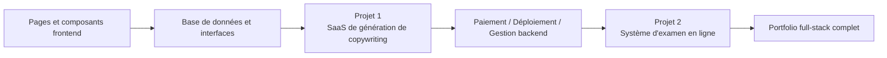

# Développement Junior-Intermédiaire

Bienvenue à l'étape **Développement Junior-Intermédiaire** ! Ici, vous approfondirez le développement full-stack, maîtrisant la componentisation frontend, la conception de bases de données, le développement d'API backend et le déploiement.

## Ce que vous allez apprendre

### Développement Frontend

Maîtriser le développement frontend moderne, apprendre à utiliser des bibliothèques de composants et des outils de conception :

<NavGrid>
  <NavCard
    href="/fr-fr/stage-2/frontend/lovart-assets/"
    title="De Lovart à la création de votre propre Agent de production de ressources"
    description="De zéro, utilisez Nanobanana et Lovart pour générer massivement des ressources de conception de haute qualité, et construisez un Agent de dessin avec reconnaissance d'intention"
  />
  <NavCard
    href="/fr-fr/stage-2/frontend/figma-mastergo/"
    title="Introduction à Figma et MasterGo"
    description="Maîtriser les opérations de base des outils professionnels de conception UI et le flux de collaboration du design au code"
  />
  <NavCard
    href="/fr-fr/stage-2/frontend/ui-design/"
    title="Construire votre première application moderne - Conception UI"
    description="Apprendre les bases de la conception UI pour les applications modernes"
  />
  <NavCard
    href="/fr-fr/stage-2/frontend/multi-product-ui/"
    title="Concevoir des pages et des boutons en référence aux guidelines de conception UI"
    description="Apprendre les guidelines de conception UI dominantes pour concevoir des pages et des boutons avec une hiérarchie plus claire"
  />
  <NavCard
    href="/fr-fr/stage-2/frontend/llm-skills-beautiful/"
    title="Rendre l'interface attrayante avec les LLM et les Skills"
    description="Utiliser les prompts et les plugins en pratique pour que l'IA génère des interfaces belles et uniques"
  />
  <NavCard
    href="/fr-fr/stage-2/frontend/hogwarts-portraits/"
    title="Créons ensemble des portraits de Poudlard"
    description="Projet pratique : combiner des images générées par IA pour construire une application interactive de portraits de Poudlard"
  />
  <NavCard
    href="/fr-fr/stage-2/frontend/design-to-code/"
    title="Du prototype de conception au code de projet"
    description="Apprendre à transformer les prototypes des outils de conception en code frontend fonctionnel dans le navigateur"
  />
  <NavCard
    href="/fr-fr/stage-2/frontend/modern-component-library/"
    title="Mettre à jour votre interface avec une bibliothèque de composants moderne"
    description="Apprendre à utiliser des bibliothèques de composants pour construire rapidement des interfaces de niveau professionnel"
  />
</NavGrid>

### Développement Backend

Apprendre la conception d'API, la gestion de bases de données et les stratégies de déploiement d'applications :

<NavGrid>
  <NavCard
    href="/fr-fr/stage-2/backend/git-workflow/"
    title="Apprendre à utiliser Git et GitHub"
    description="Maîtriser les opérations centrales et les flux de travail de collaboration du système de contrôle de version Git"
  />
  <NavCard
    href="/fr-fr/stage-2/backend/database-supabase/"
    title="De la base de données à Supabase"
    description="Maîtriser les bases des bases de données relationnelles et apprendre à utiliser Supabase, une plateforme BaaS moderne"
  />
  <NavCard
    href="/fr-fr/stage-2/backend/ai-interface-code/"
    title="Conception et développement d'interfaces backend d'application"
    description="Utiliser l'IA pour générer du code d'interface backend et de la documentation API standard, améliorant l'efficacité du développement"
  />
  <NavCard
    href="/fr-fr/stage-2/backend/zeabur-deployment/"
    title="Publier votre prototype de produit"
    description="Apprendre à utiliser Zeabur pour déployer rapidement votre application full-stack dans le cloud"
  />
  <NavCard
    href="/fr-fr/stage-2/backend/modern-cli/"
    title="Des IDE aux outils de programmation IA en CLI"
    description="Explorer les outils CLI modernes pour améliorer l'expérience de développement en ligne de commande"
  />
  <NavCard
    href="/fr-fr/stage-2/backend/stripe-payment/"
    title="Comment intégrer un système de paiement comme Stripe"
    description="Pratique : intégrer la fonctionnalité de paiement Stripe dans votre application pour la monétisation"
  />
</NavGrid>

### Projets principaux

Les chapitres précédents consistent à apprendre les « pièces », les projets principaux consistent à apprendre « comment assembler les pièces en un produit fonctionnel, démontrable et déployable ».

Il est recommandé de suivre l'ordre **Projet 1 -> Projet 2** :

- **Projet 1** vous guide d'abord à travers la chaîne principale la plus courante des SaaS modernes : connexion, génération, base de données, paiement, console d'administration.
- **Projet 2** vous plonge ensuite dans un scénario plus proche d'un système métier : rôles et permissions, banque de questions, examens, soumissions, console d'administration.

Si vous ne savez pas par lequel commencer, vous pouvez vous référer à ce tableau comparatif :

| Projet | Compétences clés pratiquées | Pour qui | Livrable final |
|------|------|------|------|
| Projet 1 : Site de génération de copywriting | Structure de page SaaS, connexion utilisateur, génération IA, paiement Stripe, gestion backend | Ceux qui créent leur premier site commercial complet | Un prototype SaaS avec inscription, génération, paiement et gestion |
| Projet 2 : Système d'examen et de gestion en ligne | Rôles et permissions, modélisation de banque de questions, flux d'examen, soumissions, correction et statistiques | Ceux qui veulent vraiment réaliser un « système métier » complet | Une plateforme d'examen avec un côté étudiant et un côté administrateur |

Quel que soit le projet choisi, il est recommandé de préparer au moins ces 3 livrables :

- Un dépôt de projet fonctionnel
- Un lien de démonstration accessible
- Un README et une vidéo de démonstration

<NavGrid>
  <NavCard
    href="/fr-fr/stage-2/assignments/copywriting-platform-supabase/"
    title="Projet 1 : Première application full-stack SaaS — Site de génération de copywriting"
    description="Créer de zéro un atelier de copywriting marketing IA, couvrant connexion, génération, paiement et console d'administration"
  />
  <NavCard
    href="/fr-fr/stage-2/assignments/exam-management-express/"
    title="Projet 2 : Système d'examen et de gestion en ligne"
    description="Construire un système d'examen en ligne avec génération automatique de questions, passage d'examen et gestion backend"
  />
</NavGrid>

Si vous avez déjà terminé les deux projets principaux ci-dessus, ou si vous souhaitez construire votre portfolio selon votre propre direction technique, vous pouvez choisir un sujet approfondi parmi ces projets optionnels :

<NavGrid>
  <NavCard
    href="/fr-fr/stage-2/assignments/modern-landing-page/"
    title="Projet optionnel : Page d'atterrissage web moderne"
    description="Pratiquer l'expression de valeur, les chemins de conversion, la conception CTA et le tracking de base, pour créer une page qui convertit vraiment le trafic"
  />
  <NavCard
    href="/fr-fr/stage-2/assignments/custom-dify-agent-platform/"
    title="Projet optionnel : Plateforme d'orchestration d'agents intelligents de type Dify"
    description="Implémenter la gestion d'agents, le chat, les logs et le contrôle des permissions, pour créer une plateforme IA minimale viable"
  />
  <NavCard
    href="/fr-fr/stage-2/assignments/travel-planning-agent-platform/"
    title="Projet optionnel : Plateforme d'orchestration d'agents de planification de voyage intelligente"
    description="Autour d'entrées structurées, de l'orchestration d'agents et de la gestion de l'historique des plans, créer un produit IA de planification de voyage exécutable"
  />
  <NavCard
    href="/fr-fr/stage-2/assignments/movie-recommendation-springboot/"
    title="Projet optionnel : Système de recommandation de films Spring Boot"
    description="Combiner Spring Boot, notes et favoris avec des recommandations explicables, pour compléter un prototype de système de recommandation complet"
  />
  <NavCard
    href="/fr-fr/stage-2/assignments/simple-grocery-microservices/"
    title="Projet optionnel : Système de microservices d'épicerie fraîche"
    description="Pratiquer le fractionnement de services, le routage de passerelle, la collaboration inventaire et commandes, pour expérimenter l'approche ingénierique du monolithique aux microservices"
  />
  <NavCard
    href="/fr-fr/stage-2/assignments/traffic-data-visualization-go/"
    title="Projet optionnel : Plateforme Go de visualisation et d'analyse de données de trafic"
    description="De l'ingestion de données, de l'agrégation par fenêtre au tableau de bord de tendances et aux alertes, créer un prototype de produit de données complet"
  />
</NavGrid>

### Extension des capacités IA

<NavGrid>
  <NavCard
    href="/fr-fr/stage-2/ai-capabilities/dify-knowledge-base/"
    title="Introduction à Dify et intégration de base de connaissances"
    description="Apprendre à utiliser Dify pour construire des applications IA et intégrer des bases de connaissances privées"
  />
</NavGrid>

## Pour qui c'est

- Développeurs avec une certaine base de programmation qui veulent apprendre systématiquement le développement full-stack
- Apprenants qui souhaitent passer de chef de produit à ingénieur full-stack
- Développeurs juniors à intermédiaires qui veulent maîtriser les outils et flux de travail de développement modernes
- Entrepreneurs qui veulent développer des produits complets de manière indépendante

## Prérequis

- Avoir complété l'étape « Débutant et prototype de produit », ou avoir des connaissances de base équivalentes
- Comprendre les concepts de base de HTML/CSS/JavaScript
- Avoir des connaissances préliminaires sur les outils de programmation IA

Prêt à approfondir le développement full-stack ? Cliquez sur la navigation de gauche pour commencer à apprendre !
