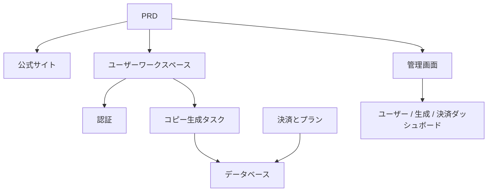

# AI マーケティングコピー SaaS 開発実践

## 概要

本実践プロジェクトでは、実際の PRD（要件定義書）に基づき、独立開発者やコンテンツチーム向けの AI マーケティングコピー SaaS 製品をゼロから構築します。Supabase をバックエンドサービスとして、Stripe を決済システムとして使用し、要件分析からデプロイまでの全プロセスを完了します。

これは Stage 2 の総合実践セクションです。これまでの章で、フロントエンドページの構築、バックエンドインターフェースの開発、データベース操作、決済統合などの個別スキルを学びました。このプロジェクトでは、それらすべてを統合し、実行可能な製品プロトタイプを納品します。

## 前提知識

本プロジェクトを開始する前に、以下の内容を習得している必要があります：

- フロントエンドページ設計とコンポーネントライブラリの使用（[UI 設計](../../frontend/ui-design/)、[モダンコンポーネントライブラリ](../../frontend/modern-component-library/)）
- バックエンドインターフェースの設計と開発（[インターフェースコードの記述](../../backend/ai-interface-code/)）
- データベースの基礎と Supabase（[データベースから Supabase へ](../../backend/database-supabase/)）
- 決済統合（[Stripe 決済システム](../../backend/stripe-payment/)）
- Git ワークフローとデプロイ（[Git と GitHub](../../backend/git-workflow/)、[Web アプリケーションのデプロイ](../../backend/zeabur-deployment/)）

## 学習目標

本実践を完了すると、以下のことができるようになります：

1. 実際の PRD を読み解き、開発タスクリストを抽出する
2. AI を活用して段階的にフロントエンドページとバックエンドインターフェースを生成する
3. Supabase を使用してユーザー認証、データベース操作を実装する
4. Stripe を統合して有料サブスクリプション機能を実装する
5. 管理画面を構築し、エンドツーエンドの結合テストを完了する

## プロジェクト概要

構築する製品は AI マーケティングコピー SaaS であり、3つのサブシステムで構成されます：

| サブシステム | 責務 |
|--------|------|
| **公式サイト** | 製品紹介、料金プラン、FAQ、登録コンバージョン |
| **ユーザーワークスペース** | 製品情報の入力、コピー生成、履歴確認、プランのアップグレード |
| **管理画面** | ユーザー管理、生成記録、決済データ、運用概要 |

バックエンドは Supabase でデータベースと認証機能を提供し、Stripe で決済を処理し、AI モデルでマーケティングコピーを生成します。

::: tip PRD 入口
本プロジェクトの要件定義書は GitHub にあります： [PRD を確認](https://github.com/datawhalechina/easy-vibe/blob/main/docs/zh-cn/stage-2/assignments/copywriting-platform-supabase/PRD.md)
:::

<div style="margin: 32px 0;">
  <ClientOnly>
    <StepBar :active="0" :items="[
      { title: '要件分析', description: 'PRD を読み、ページ、機能、認証、決済の範囲を明確にする' },
      { title: 'スケルトン構築', description: 'AI で3つのフロントエンドスケルトン（www / app / admin）を生成' },
      { title: 'バックエンド統合', description: 'Supabase 認証、生成インターフェース、Stripe 決済' },
      { title: '結合・デプロイ', description: 'エンドツーエンドで動作確認し、デプロイしてデモを準備' }
    ]" />
  </ClientOnly>
</div>

## 第1部：要件分析

### 1.1 PRD の読解

PRD 文書を開き、以下の質問に重点的に答えてください：

- システムにはいくつの入口がありますか？それぞれどのページをカバーしていますか？
- 各ページのコア機能は何ですか？
- バックエンドにはどのモジュールとデータテーブルが含まれていますか？
- 料金プラン、決済フロー、無料枠はどのように設計されていますか？
- MVP の範囲は何ですか？初版で何を作り、何を作らないか？

::: warning
上記の質問に明確な答えがない場合は、コードを書き始めないでください。要件の理解が不明確であることは、手戻りの最も一般的な原因です。
:::

### 1.2 システムアーキテクチャの確認

PRD に基づいてシステムの全体アーキテクチャを整理します：



## 第2部：プロジェクトスケルトンの構築

### 2.1 フロントエンドページの生成

AI を使用して、まずすべてのページの基本構造とモックデータを生成します。

プロンプトの参考例：

```text
現在の PRD に基づいて、AI マーケティングコピー SaaS のフロントエンドスケルトンを生成してください。

要件：
1. 3つの入口に分ける：www、app、admin
2. 公式サイトには：ホーム、料金プラン、FAQ
3. app には：ログイン、登録、生成ワークスペース、履歴、プランページ
4. admin には：管理画面ホーム、ユーザー管理、生成記録、決済オーダー
5. まずページ構造とモックデータのみを生成し、実際のインターフェースには接続しない
6. モダンな SaaS のようなスタイルにし、授業のデモのような見た目にしない
```

### 2.2 コアページの充実

スケルトンができたら、コピー生成ワークスペース（Dashboard）ページを重点的に充実させます：

```text
/dashboard ページをさらに充実させてください。

これは AI マーケティングコピーのワークスペースです。

左側のフォームフィールド：
- 製品名
- 一言での紹介
- ターゲットユーザー
- 3つのセールスポイント
- 配信チャネル（公式サイト、WeChat モーメンツ、小紅書、Douyin、メール）

右側の結果エリアの予約：
- メインタイトル
- サブタイトル
- CTA
- 3パターンの短いコピー
- 長いコピー

まずモックデータでインタラクションを動作させる。

要件：
- 「コピー生成」クリック後にローディング状態を表示
- 結果エリアに空の状態をデザイン
- レスポンシブレイアウトで、ワイド画面でもナロー画面でも正常に表示
```

### 2.3 ページ構造の検証

各項目をチェック：

- [ ] 3つの入口のルーティングが独立しているか
- [ ] ページ数が PRD と一致しているか
- [ ] Dashboard のフォームと結果エリアのレイアウトが適切か
- [ ] モックデータが基本的な UI の状態を表現しているか

### 行き詰まったら

フロントエンド構築の段階で行き詰まった場合は、以下の章を振り返ってください：

- [UI 設計](../../frontend/ui-design/)
- [UI 設計仕様を参考にページとボタンを設計](../../frontend/multi-product-ui/)
- [LLM と Skills でインターフェースを見栄えよくする](../../frontend/llm-skills-beautiful/)
- [デザインプロトタイプからプロジェクトコードへ](../../frontend/design-to-code/)
- [モダンコンポーネントライブラリでインターフェースをアップデート](../../frontend/modern-component-library/)

## 第3部：バックエンド統合

### 3.1 Supabase ログインの統合

```text
私はプログラミング初心者です。ステップバイステップで Supabase のログイン統合を案内してください。

私のために以下を完了してください：
1. プロジェクトに Supabase を統合
2. 登録、ログイン、ログアウト機能を実装
3. ログイン成功後に /dashboard にリダイレクト
4. 未ログインユーザーが /dashboard、/billing、/admin にアクセスした場合、自動的に /login にリダイレクト
5. profiles テーブルを作成
6. ユーザー登録成功後、自動的に profiles テーブルにレコードを作成
7. profiles テーブルには email、role、plan フィールドを含める

実装要件：
- 各ステップでどのファイルを変更しているかを説明
- 秘密鍵をハードコーディングしない
- Supabase 管理画面で手動操作が必要な箇所は明確に記載
- 完了後、登録とログインの確認方法を説明
```

### 3.2 生成インターフェースとデータベースの統合

```text
私はプログラミング初心者です。サイトのコア機能である「マーケティングコピーの生成と保存」を実装するのを手伝ってください。

目標とする効果：
1. ユーザーが /dashboard でフォームに入力し、「コピー生成」をクリック
2. バックエンドが受け取る：製品名、紹介、ターゲットユーザー、セールスポイント、配信チャネル
3. バックエンドがモデルを呼び出して結果を生成
4. ページに生成結果を表示
5. 入力と出力の両方をデータベースに保存
6. ユーザーが次回アクセス時に履歴を確認可能

私のために以下を完了してください：
- 生成インターフェース /api/generate を作成
- generations テーブルを作成
- 入力と出力のフィールドを設計
- Dashboard ページで現在のユーザーの履歴を読み込む

ユーザーエクスペリエンス：
- ボタンのローディング状態
- 生成失敗時のエラーメッセージ
- 履歴がない場合の空の状態

完了後、以下を説明してください：
- フロントエンドページファイルの場所
- バックエンドインターフェースファイルの場所
- データベースへの書き込みロジックの場所
- 完全な生成チェーンのテスト方法
```

### 3.3 Stripe 決済の統合

```text
私はプログラミング初心者です。LaunchKit に最小限の Stripe 決済を追加するのを手伝ってください。

複雑なシステムは不要で、まず最基本的な決済フローを動作させます。

私のために以下を完了してください：
1. /billing ページに free と pro の2つのプランを表示
2. ユーザーがアップグレードをクリックした後、Stripe Checkout にリダイレクト
3. 決済成功後にサイトに戻る
4. 決済結果を subscriptions テーブルに保存
5. profile.plan フィールドを同期的に更新
6. free ユーザーは1日3回まで生成可能、pro ユーザーは無制限

実装原則：
- まずメインフローを動作させ、複雑なエッジケースは後回し
- Stripe 管理画面での設定が必要な箇所は明確に記載
- 完了後、完全な決済フローのテスト方法を説明
```

### 3.4 管理画面の構築

```text
私はプログラミング初心者です。シンプルで使いやすい管理画面を作成してください。

管理者のみアクセス可能。

私のために以下を完了してください：
1. role = admin のユーザーのみ /admin にアクセス可能
2. 管理画面には3つのタブを含める：ユーザーリスト、生成記録、サブスクリプション状況
3. ユーザーリストの表示：email、plan、作成日時
4. 生成記録の表示：ユーザー、製品名、チャネル、作成日時
5. サブスクリプション状況の表示：ユーザー、プラン、決済ステータス

要件：
- インターフェースはシンプルで見やすく
- 既存のコンポーネントライブラリのテーブル、タブ、バッジを使用
- 完了後、アカウントを管理者に設定する方法を説明
```

### 行き詰まったら

バックエンド開発の段階で行き詰まった場合は、以下の章を振り返ってください：

- [データベースから Supabase へ](../../backend/database-supabase/)
- [大規模言語モデルによるインターフェースコードとインターフェース文書の作成支援](../../backend/ai-interface-code/)
- [Stripe などの決済システムの統合方法](../../backend/stripe-payment/)

## 第4部：結合テストとデプロイ

### 4.1 エンドツーエンドテスト

少なくとも以下のシナリオを検証してください：

- 登録 → ログイン → コピー生成 → 履歴確認 → プランのアップグレード
- 管理者のログイン → ユーザーデータの確認 → 生成記録の確認 → 決済ステータスの確認

デプロイ前チェック：

```text
私はプログラミング初心者です。プロジェクトがデプロイ可能かどうかを確認するのを手伝ってください。

チェックのポイント：
- 環境変数は完全か
- ログインのコールバックアドレスは正しいか
- Stripe 決済のコールバックアドレスは正しいか
- ページにローディング、空の状態、エラーメッセージが欠落していないか
- README に起動説明とデプロイ説明が含まれているか

私のために以下をしてください：
1. 優先度順に修正項目をリストアップ
2. どれを先に修正すべきかをマーク
3. 修正後のデプロイ手順を説明
```

### 4.2 デプロイ

プロジェクトをパブリックネットワーク環境にデプロイします。デプロイのチュートリアルはこちらを参照してください：[Git と GitHub ワークフロー](../../backend/git-workflow/)、[Web アプリケーションのデプロイ方法](../../backend/zeabur-deployment/)。

## 提出物

本プロジェクト完了後、以下の内容を提出してください：

- [ ] アクセス可能なオンラインデモリンク
- [ ] ソースコードリポジトリのリンク（README を含む）
- [ ] PRD 文書
- [ ] コアページのスクリーンショット（ホーム、Dashboard、Billing、Admin）
- [ ] 60秒のデモ動画（登録 → 生成 → 決済 → 管理画面を網羅）

README には少なくとも以下を含めてください：プロジェクト概要、コアページの説明、技術スタック、ローカル起動手順、環境変数リスト。

## 評価基準

| 項目 | 基本要件 | 応用要件 |
|------|---------|---------|
| 製品の完成度 | ホーム、ログイン、Dashboard、Billing、Admin にすべてアクセス可能 | ホームのコピーとビジュアルスタイルが本物の SaaS のように見える |
| ビジネス完了 | 登録 → ログイン → 生成 → 履歴確認が動作する | 無料 / Pro の権限差が明確に確認できる |
| データの正確性 | 生成結果と決済ステータスがデータベースに書き込まれる | 明確なエラーメッセージ、空の状態、ローディングがある |
| 権限とセキュリティ | 未ログインで保護されたページにアクセスできず、一般ユーザーは Admin に入れない | 基本的な入力バリデーションとサーバーサイド認証がある |
| エンジニアリング品質 | プロジェクトがローカルで起動可能で、パブリックネットワークにもデプロイ可能 | README が明確で、デモ動画の構造が完全 |

::: tip
タスクが大きすぎると感じた場合は、この原則を覚えておいてください：**まず「動くこと」を確保してから、「美しくすること」を追求してください。**
:::

## 提出前チェック

<el-card shadow="hover" style="margin: 20px 0; border-radius: 12px;">
  <template #header>
    <div style="font-weight: bold; font-size: 16px;">提出前の最終確認</div>
  </template>

  <ul style="list-style-type: none; padding-left: 0;">
    <li><label><input type="checkbox" disabled /> ホーム、ログイン、Dashboard、Billing、Admin がすべて完了している</label></li>
    <li><label><input type="checkbox" disabled /> ユーザーが登録、ログイン、ログアウトできる</label></li>
    <li><label><input type="checkbox" disabled /> 生成結果が実際にデータベースに書き込まれる</label></li>
    <li><label><input type="checkbox" disabled /> 決済のメインフローが動作する</label></li>
    <li><label><input type="checkbox" disabled /> 管理者がユーザー、生成記録、決済ステータスを確認できる</label></li>
    <li><label><input type="checkbox" disabled /> プロジェクトがパブリックネットワークにデプロイされている</label></li>
  </ul>
</el-card>

## 参考資料

- [UI 設計](../../frontend/ui-design/)
- [UI 設計仕様を参考にページとボタンを設計](../../frontend/multi-product-ui/)
- [LLM と Skills でインターフェースを見栄えよくする](../../frontend/llm-skills-beautiful/)
- [デザインプロトタイプからプロジェクトコードへ](../../frontend/design-to-code/)
- [モダンコンポーネントライブラリでインターフェースをアップデート](../../frontend/modern-component-library/)
- [データベースから Supabase へ](../../backend/database-supabase/)
- [大規模言語モデルによるインターフェースコードとインターフェース文書の作成支援](../../backend/ai-interface-code/)
- [Git と GitHub ワークフロー](../../backend/git-workflow/)
- [Web アプリケーションのデプロイ方法](../../backend/zeabur-deployment/)
- [Stripe などの決済システムの統合方法](../../backend/stripe-payment/)
