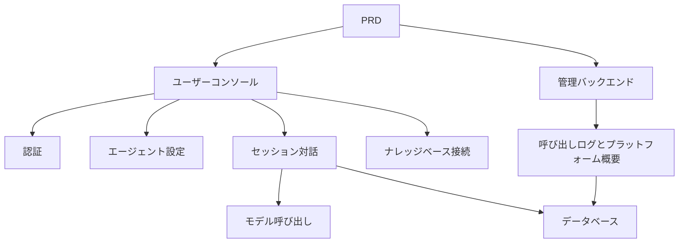

# Dify 型エージェントプラットフォーム開発実践

## 概要

本実践プロジェクトでは、実際の PRD に基づいて、Dify のコア体験を模倣したエージェントプラットフォームを一から完成させます。ユーザーコンソール、管理バックエンド、プラットフォームバックエンドを構築し、エージェント管理、対話、ログ、ナレッジベースなどのコア機能を実装します。

これは Stage 2 の総合実践セクションです。これまでの単一ページや単一機能のプロジェクトとは異なり、このプロジェクトでは「プラットフォーム感」のある AI 製品を構築する必要があります。マルチロール、マルチモジュール、データ永続化、モデル呼び出しパイプラインを含みます。

## 前提知識

このプロジェクトを始める前に、以下の内容をすでに習得している必要があります：

- フロントエンドページ設計とコンポーネントライブラリの使用（[UI 設計](../../frontend/ui-design/)、[モダンコンポーネントライブラリ](../../frontend/modern-component-library/)）
- バックエンドインターフェース設計と開発（[インターフェースコード作成](../../backend/ai-interface-code/)）
- データベース基礎と Supabase（[データベースから Supabase まで](../../backend/database-supabase/)）
- Git ワークフローとデプロイ（[Git と GitHub](../../backend/git-workflow/)、[Web アプリのデプロイ](../../backend/zeabur-deployment/)）

## 学習目標

本実践完了後、以下のことができるようになります：

1. 実際の PRD を読み、開発タスクリストを抽出する
2. エージェントプラットフォームのページアーキテクチャとデータモデルを設計する
3. エージェント作成、対話、ログ記録の完全なパイプラインを実装する
4. AI を活用してプラットフォーム型製品の開発を完了する
5. エンドツーエンドの結合テストを完了し、デモ可能な AI プラットフォームプロトタイプを納品する

## プロジェクト概要

あなたが構築する製品は、Dify 型エージェントプラットフォームです。2 つのサブシステムを含みます：

| サブシステム | 責務 |
|--------|------|
| **ユーザーコンソール** | エージェント作成、Prompt 設定、対話開始、ログ確認、ナレッジベース管理 |
| **管理バックエンド** | ユーザーデータ、プラットフォームリソース使用状況、呼び出し統計の確認 |

バックエンドは以下のコア機能をサポートする必要があります：エージェント管理、セッション管理、メッセージ保存、モデル呼び出し、呼び出しログ記録、ナレッジベース接続。

::: tip PRD 入口
本プロジェクトの要件文書は GitHub にあります： [PRD を表示](https://github.com/datawhalechina/easy-vibe/blob/main/docs/ja-jp/stage-2/assignments/custom-dify-agent-platform/PRD.md)
:::

<div style="margin: 32px 0;">
  <ClientOnly>
    <StepBar :active="0" :items="[
      { title: '要件分析', description: 'PRD を読み、ページ、機能境界、認証、データモデルを明確にする' },
      { title: 'スケルトン構築', description: 'AI でユーザーコンソールと管理バックエンドのスケルトンを生成' },
      { title: '反復開発', description: 'モジュールごとにエージェント、対話、ログ、ナレッジベースを追加' },
      { title: '結合とリリース', description: 'エンドツーエンドで動作確認し、デプロイしてデモを準備' }
    ]" />
  </ClientOnly>
</div>

## 第 1 部：要件分析

### 1.1 PRD を読む

PRD 文書を開き、以下の質問に重点的に答えてください：

- エージェント、セッション、ログ、ナレッジベースのうち、どれを MVP に入れますか？
- ページとルートのリストは確定していますか？
- モデル呼び出しとログ記録の境界は何ですか？
- マルチテナントや複雑なワークフローはまず実装しませんか？

::: warning
以上の質問に対する明確な答えがない場合は、コードを書き始めないでください。要件の理解が不明確なのは、手戻りの最も一般的な原因です。
:::

### 1.2 システムアーキテクチャの確認



## 第 2 部：プロジェクトスケルトンの構築

### 2.1 フロントエンドページの生成

プロンプト参考：

```text
現在の PRD に基づいて、Dify 型エージェントプラットフォームのフロントエンドスケルトンを生成してください。

要件：
1. ユーザー側には以下を含む：ログイン、エージェントリスト、エージェント設定、対話ページ、ログページ、ナレッジベースページ
2. 管理側には以下を含む：管理ホーム、ユーザー概要、リソース使用概要
3. まずページ構造とモックデータのみを生成し、実際のインターフェースには接続しない
4. モダンな AI プラットフォームのようなスタイルにする
```

### 2.2 プロジェクト構造の検証

項目ごとにチェック：

- [ ] ユーザーコンソールと管理バックエンドのエントリが分離されている
- [ ] エージェントリスト、設定、対話、ログ、ナレッジベースページが完全
- [ ] 管理バックエンドのホーム、ユーザー概要ページがアクセス可能
- [ ] モックデータで基本的な UI ステータスが表示されている

## 第 3 部：反復開発

### 3.1 モジュールごとに進める

スケルトンをベースに、以下の順序でモジュールごとに機能を追加：

1. **認証**：登録、ログイン、ロール区分
2. **エージェント管理**：作成、編集、削除、Prompt 設定
3. **対話機能**：セッション作成、メッセージ送受信、モデル呼び出し
4. **ログ記録**：所要時間、トークン使用量、エラー記録
5. **ナレッジベース接続**（ボーナス）：ドキュメントアップロード、検索、結果注入
6. **管理バックエンド**：ユーザーデータ、リソース使用状況、呼び出し統計

各モジュール完了後、以下の表で自己チェック：

| チェック項目 | 検証方法 |
|--------|----------|
| ページ整合性 | ページ数、機能が PRD に適合しているか |
| インターフェースクロージャ | agents、chat、logs、knowledge のインターフェースが完全か |
| 権限分離 | ユーザーが自分のエージェントとセッションのみを管理できるか |
| データ整合性 | messages、logs、documents のデータが一致しているか |
| デモ可能性 | 「エージェント作成 → 対話 → ログ確認」の完全なフローがデモできるか |

### 3.2 ナレッジベース接続（ボーナス）

ナレッジベース機能を追加したい場合、各エージェントに「ナレッジベーススイッチ」を追加できます：

- オンにした場合、まずナレッジ断片を検索し、ユーザーの質問と一緒にモデルに送信
- オフにした場合、通常の対話モードで応答

第 1 版では複雑な RAG を追求せず、「検索結果が可視で、呼び出しパイプラインが説明可能」であれば十分です。

## 第 4 部：結合テストとリリース

### 4.1 エンドツーエンドテスト

少なくとも以下のシナリオを検証：

- 登録 → エージェント作成 → Prompt 設定 → 対話開始 → ログ確認
- 管理者ログイン → ユーザーデータ確認 → 呼び出し統計確認

デプロイ前チェック：

- [ ] すべてのコアインターフェースにログインチェックがある
- [ ] エージェントの所有権限チェックが通っている
- [ ] セッション記録、ログ記録が実際にデータベースに保存されている
- [ ] モデルキーが環境変数を使用しており、ハードコードされていない
- [ ] エラーがフロントエンドで確認でき、コンソールのみに出力されていない

### 4.2 デプロイ

プロジェクトをパブリックネットワークにデプロイ。デプロイチュートリアル参照：[Git と GitHub ワークフロー](../../backend/git-workflow/)、[Web アプリのデプロイ方法](../../backend/zeabur-deployment/)。

## 提出物

本プロジェクト完了後、以下の内容を提出する必要があります：

- [ ] アクセス可能なオンラインデモリンク
- [ ] ソースコードリポジトリリンク（README を含む）
- [ ] PRD 文書
- [ ] コアページのスクリーンショット（エージェント管理ページ、対話ページ、ログページ、管理ホーム）
- [ ] 60 秒のデモ動画（エージェント作成 → 対話 → ログ確認をカバー）

README には少なくとも以下を含む：プロジェクト概要、アーキテクチャ説明、技術スタック、ローカル起動手順、環境変数リスト、インターフェース説明。

## 評価基準

| 項目 | 基本要件 | 応用要件 |
|------|---------|---------|
| プラットフォーム完成度 | agents / chat / logs の 3 ページが利用可能 | 明確なナビゲーションと統一されたデザイン言語がある |
| ビジネスクロージャ | エージェントを作成して実際に対話できる | マルチエージェント切り替えと履歴セッションをサポート |
| データとトラッキング | メッセージと呼び出しログがクエリ可能 | トークン / 所要時間の統計ダッシュボードがある |
| 権限セキュリティ | ログインユーザーのみがコアインターフェースにアクセス可能 | リソース所有権の検証が充実 |
| エンジニアリング納品 | デプロイ可能、デモ可能、README が明確 | ナレッジベースを接続し、検索結果を説明可能 |

## 提出前チェック

<el-card shadow="hover" style="margin: 20px 0; border-radius: 12px;">
  <template #header>
    <div style="font-weight: bold; font-size: 16px;">提出前の最終確認</div>
  </template>

  <ul style="list-style-type: none; padding-left: 0;">
    <li><label><input type="checkbox" disabled /> ログイン後、エージェント管理、対話、ログページにアクセス可能</label></li>
    <li><label><input type="checkbox" disabled /> 少なくとも 1 つのエージェントを作成し、対話に成功する</label></li>
    <li><label><input type="checkbox" disabled /> 各ラウンドのQ&Aがデータベースで確認できる</label></li>
    <li><label><input type="checkbox" disabled /> 呼び出し失敗時にフロントエンドでエラー情報が表示され、ログが記録されている</label></li>
    <li><label><input type="checkbox" disabled /> プロジェクトがデプロイされ、README とデモ動画が揃っている</label></li>
  </ul>
</el-card>

## 参考資料

- [UI 設計](../../frontend/ui-design/)
- [モダンコンポーネントライブラリでインターフェースを更新](../../frontend/modern-component-library/)
- [データベースから Supabase まで](../../backend/database-supabase/)
- [大規模モデルによるインターフェースコードとドキュメント作成](../../backend/ai-interface-code/)
- [Git と GitHub ワークフロー](../../backend/git-workflow/)
- [Web アプリのデプロイ方法](../../backend/zeabur-deployment/)
