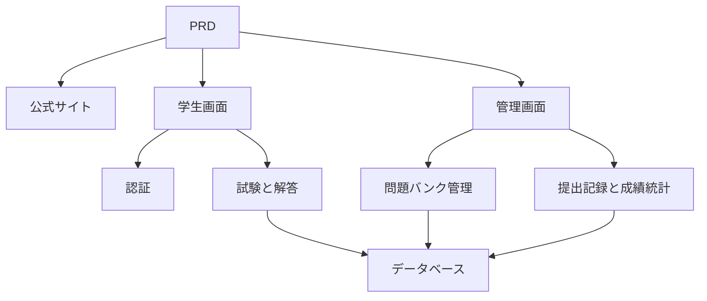

# オンライン試験・管理システム開発実践

## 概要

本実践プロジェクトでは、実際の PRD（要件定義書）に基づき、オンライン試験・管理システムをゼロから構築します。このプロジェクトの特徴は、複数のロール（学生と管理者）が存在し、各ロールによって表示されるページや実行可能な操作が異なる点にあります。Express を使用してバックエンドを構築し、試験業務の完全なフローを実装します。

これは Stage 2 の総合実践セクションです。マルチロール権限システムは実際の業務でも非常に一般的であり、このパターンを習得すれば、教育、SaaS、管理画面など、あらゆる業務シナリオに対応できるようになります。

## 前提知識

本プロジェクトを開始する前に、以下の内容を習得している必要があります：

- フロントエンドページ設計とコンポーネントライブラリの使用（[UI 設計](../../frontend/ui-design/)、[モダンコンポーネントライブラリ](../../frontend/modern-component-library/)）
- バックエンドインターフェースの設計と開発（[インターフェースコードの記述](../../backend/ai-interface-code/)）
- データベースの基礎と Supabase（[データベースから Supabase へ](../../backend/database-supabase/)）
- Git ワークフローとデプロイ（[Git と GitHub](../../backend/git-workflow/)、[Web アプリケーションのデプロイ](../../backend/zeabur-deployment/)）

## 学習目標

本実践を完了すると、以下のことができるようになります：

1. 実際の PRD を読み解き、開発タスクリストを抽出する
2. マルチロールシステムの権限制御とページルーティングを設計する
3. Express を使用して完全なバックエンド API を実装する
4. 試験、提出、自動採点の業務フローを実装する
5. エンドツーエンドの結合テストを完了し、デモ可能な業務システムプロトタイプを納品する

## プロジェクト概要

構築する製品は、オンライン試験・管理システムであり、3つのサブシステムで構成されます：

| サブシステム | 責務 |
|--------|------|
| **公式サイト** | プラットフォーム紹介、ログイン入口 |
| **学生画面** | 試験一覧、解答、提出、成績確認 |
| **管理画面** | 問題バンク管理、試験管理、提出記録、成績統計 |

バックエンドは Express を使用し、以下をサポートする必要があります：ログイン認証、ロール権限、試験と問題バンクの管理、提出フローと自動採点、成績と統計管理。

::: tip PRD 入口
本プロジェクトの要件定義書は GitHub にあります： [PRD を確認](https://github.com/datawhalechina/easy-vibe/blob/main/docs/ja-jp/stage-2/assignments/exam-management-express/PRD.md)
:::

<div style="margin: 32px 0;">
  <ClientOnly>
    <StepBar :active="0" :items="[
      { title: '要件分析', description: 'PRD を読み、ロール、ページ、試験フロー、データモデルを明確にする' },
      { title: 'スケルトン構築', description: 'AI で学生画面と管理画面のスケルトンを生成' },
      { title: 'バックエンド開発', description: 'Express でログイン、試験、提出、採点を実装' },
      { title: '結合・デプロイ', description: 'エンドツーエンドで動作確認し、デプロイしてデモを準備' }
    ]" />
  </ClientOnly>
</div>

## 第1部：要件分析

### 1.1 PRD の読解

PRD 文書を開き、以下の質問に重点的に答えてください：

- システムにはいくつのロールがありますか？それぞれ何ができますか？
- ページ一覧は完全ですか？学生画面と管理画面にそれぞれどのページがありますか？
- どの問題形式をサポートしていますか？各形式の採点ロジックは何ですか？
- 試験の完全なフローは何ですか？（公開 → 開始 → 解答 → 提出 → 採点 → 成績確認）

::: warning
上記の質問に明確な答えがない場合は、コードを書き始めないでください。要件の理解が不明確であることは、手戻りの最も一般的な原因です。
:::

### 1.2 システムアーキテクチャの確認

PRD に基づいてシステムの全体アーキテクチャを整理します：



## 第2部：プロジェクトスケルトンの構築

### 2.1 フロントエンドページの生成

プロンプトの参考例：

```text
現在の PRD に基づいて、オンライン試験・管理システムのフロントエンドスケルトンを生成してください。

技術スタックの要件：
- Next.js App Router
- TypeScript
- Tailwind CSS
- shadcn/ui

ページ一覧：
1. ホーム /
2. ログインページ /login
3. 学生試験一覧ページ /student/exams
4. 学生解答ページ /student/exams/[id]
5. 学生成績ページ /student/history
6. 管理画面ホーム /admin
7. 試験管理ページ /admin/exams
8. 問題バンク管理ページ /admin/questions
9. 提出記録ページ /admin/submissions

要件：
- 学生画面は見やすく、集中して解答しやすいデザインにする
- 管理画面はサイドバー＋トップバーのレイアウトを使用
- まずモックデータを使用し、実際のインターフェースには接続しない
- デスクトップとモバイルの基本的な使いやすさに配慮する
```

### 2.2 学生解答ページの充実

解答ページは学生画面のコアページです。以下を重点的に実装してください：

```text
学生の解答ページをさらに充実させてください。

これはオンライン試験システムの解答ページで、以下を含める必要があります：
- 上部に試験タイトル、カウントダウン、解答済み問題数を表示
- 中央に問題文と選択肢を表示
- 単一選択、正誤判定、記述の3つの問題形式をサポート
- 左側または上部に解答カードを配置し、各問題の解答状況を表示
- 提出前に確認ダイアログを表示

まずモックデータでインタラクションを実装し、実際のインターフェースには接続しない。

要件：
- インターフェースはシンプルにし、管理画面のテーブルページのような見た目にしない
- カウントダウンは目立つようにするが、過度なプレッシャーを与えない
- 空の状態とローディング状態を含める
```

### 2.3 管理画面の充実

管理画面の初版は3つのコア領域に焦点を当てます：

- **試験管理**：試験の作成、時間の設定、公開ステータス
- **問題バンク管理**：問題の追加、編集、問題形式によるフィルタリング
- **提出記録**：学生の提出、スコア、時間の確認

### 2.4 ページ構造の検証

各項目をチェック：

- [ ] 学生画面と管理画面の入口が分離されているか
- [ ] ログインページ、試験一覧、解答ページ、成績ページが完全か
- [ ] 管理画面の問題バンク、試験管理、提出記録ページにアクセスできるか
- [ ] 学生画面と管理画面のデザインに明確な差異があるか

### 行き詰まったら

フロントエンド構築の段階で行き詰まった場合は、以下の章を振り返ってください：

- [データベースから Supabase へ](../../backend/database-supabase/)
- [アプリケーションバックエンドインターフェースの設計と開発](../../backend/ai-interface-code/)
- [モダンコンポーネントライブラリでインターフェースをアップデート](../../frontend/modern-component-library/)

## 第3部：バックエンド開発

### 3.1 ログインと権限制御

```text
私はプログラミング初心者です。オンライン試験システムのログインと権限制御を実装するのを手伝ってください。

バックエンドには Express を使用します。

目標：
1. 学生と管理者の両方がログインできる
2. ログイン後にユーザーロールを返す
3. 学生は /student/* 関連のインターフェースにのみアクセスできる
4. 管理者は /admin/* 関連のインターフェースにのみアクセスできる
5. 未ログインユーザーが保護されたページにアクセスした場合、/login にリダイレクトする

実装要件：
- 明確なディレクトリ構造の提案を提供する
- ミドルウェアの責務を明確に説明する
- 環境変数に関わる部分はハードコーディングしない
- 完了後、権限が正しく機能しているかの確認方法を説明する
```

### 3.2 試験と問題バンク管理インターフェース

以下のモジュールごとに実装することをお勧めします：

| モジュール | 推奨インターフェース |
|------|----------|
| 試験管理 | `GET /api/exams`、`POST /api/admin/exams`、`PATCH /api/admin/exams/:id` |
| 問題バンク管理 | `GET /api/admin/questions`、`POST /api/admin/questions` |
| 試験開始 | `POST /api/submissions/start` |
| 答案提出 | `POST /api/submissions/:id/submit` |
| 成績記録 | `GET /api/student/history`、`GET /api/admin/submissions` |

プロンプトの参考例：

```text
オンライン試験システムの Express API を設計・実装してください。

機能範囲：
- 管理者が試験を作成
- 管理者が問題バンクを管理
- 学生が公開済みの試験を閲覧
- 学生が試験を開始し、submission を作成
- 学生が答案を提出した後、単一選択問題と正誤判定問題を自動採点
- 記述問題はまず「要レビュー」としてマーク
- 学生が自分の過去の成績を閲覧
- 管理者がすべての提出記録を閲覧

要件：
- インターフェース名は明確に
- 統一された JSON 構造を返す
- コード内で controller、service、middleware、db 層を区別する
- 各インターフェースのテスト方法を説明する
```

### 3.3 採点ロジック

採点ロジックは試験システムのコアとなるビジネスルールです：

- **単一選択問題**：ユーザーの回答が正解と一致すれば得点
- **正誤判定問題**：同様に自動採点可能
- **記述問題**：初版では回答のみを保存し、スコアは空欄、ステータスを `reviewed = false` とする

::: tip ボーナス項目
AI 機能を追加したい場合は、管理者が「トピック + 難易度」を入力すると、モデルが候補問題を生成し、それを人工でレビュー後に問題バンクに登録する、という仕組みも可能です。ただし、これはボーナス項目であり必須ではありません。
:::

## 第4部：結合テストとデプロイ

### 4.1 エンドツーエンドテスト

少なくとも以下のシナリオを検証してください：

- 学生のログイン → 試験一覧の確認 → 解答開始 → 提出 → 成績確認
- 管理者のログイン → 試験の作成 → 問題の追加 → 公開 → 提出記録の確認

### 4.2 デプロイ

- フロントエンドを Vercel / Zeabur にデプロイ
- Express API を Zeabur / Railway / Render にデプロイ
- データベースは Supabase Postgres またはマネージド PostgreSQL を使用

デプロイ前のチェック：

- [ ] 環境変数は揃っているか
- [ ] フロントエンドとバックエンドの API アドレスは正しいか
- [ ] 本番環境でログイン状態は正常に機能するか
- [ ] 管理者アカウントで管理画面に実際にアクセスできるか
- [ ] README に起動、デプロイ、テストの説明が含まれているか

## 提出物

本プロジェクト完了後、以下の内容を提出してください：

- [ ] アクセス可能なオンラインデモリンク
- [ ] ソースコードリポジトリのリンク（README を含む）
- [ ] PRD 文書
- [ ] コアページのスクリーンショット（ホーム、学生試験一覧、解答ページ、管理画面）
- [ ] 60秒のデモ動画（学生の解答フローと管理者の管理フローを網羅）

README には少なくとも以下を含めてください：プロジェクト概要、コアページの説明、技術スタック、ローカル起動手順、環境変数リスト。

## 評価基準

| 項目 | 基本要件 | 応用要件 |
|------|---------|---------|
| ページの完全性 | 学生画面と管理画面の主要ページにアクセス可能 | ページのデザインが統一され、モバイルでも基本的に利用可能 |
| ビジネス完了 | 学生がログイン、試験参加、提出、成績確認が可能 | 管理者が試験の作成から公開まで完全に実行可能 |
| データの正確性 | 提出した回答がデータベースに書き込まれ、客観問題が自動採点される | 記述問題が手動レビューまたは AI 支援をサポート |
| 権限制御 | 学生と管理者のアクセス境界が明確 | サーバーサイドのインターフェースにもロール検証がある |
| エンジニアリング品質 | プロジェクトが実行可能、デプロイ可能、README が明確 | デモ動画とテスト説明がある |

## 提出前チェック

<el-card shadow="hover" style="margin: 20px 0; border-radius: 12px;">
  <template #header>
    <div style="font-weight: bold; font-size: 16px;">提出前の最終確認</div>
  </template>

  <ul style="list-style-type: none; padding-left: 0;">
    <li><label><input type="checkbox" disabled /> ホーム、ログイン、学生画面、管理画面のページがすべて完了している</label></li>
    <li><label><input type="checkbox" disabled /> 学生が正常に試験を開始し、回答を提出できる</label></li>
    <li><label><input type="checkbox" disabled /> 管理者が試験を作成し、提出記録を確認できる</label></li>
    <li><label><input type="checkbox" disabled /> 客観問題のスコアが自動計算され、データベースに書き込まれる</label></li>
    <li><label><input type="checkbox" disabled /> 学生と管理者の権限境界が検証済み</label></li>
    <li><label><input type="checkbox" disabled /> プロジェクトがデプロイされている、または完全なローカル実行説明がある</label></li>
  </ul>
</el-card>

## 参考資料

- [UI 設計](../../frontend/ui-design/)
- [モダンコンポーネントライブラリでインターフェースをアップデート](../../frontend/modern-component-library/)
- [データベースから Supabase へ](../../backend/database-supabase/)
- [大規模言語モデルによるインターフェースコードとインターフェース文書の作成支援](../../backend/ai-interface-code/)
- [Git と GitHub ワークフロー](../../backend/git-workflow/)
- [Web アプリケーションのデプロイ方法](../../backend/zeabur-deployment/)
