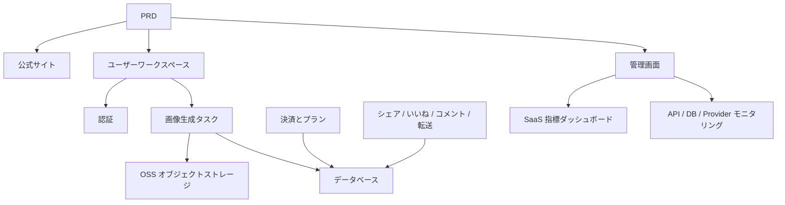

# モダン AI 画像生成 SaaS 開発実践

## 概要

本実践プロジェクトでは、実際の PRD（要件定義書）に基づき、Midjourney の体験を参考にした AI 画像生成 SaaS 製品をゼロから構築します。要件分析、プロジェクト分割、反復開発、結合テストとデプロイまでの全プロセスを経験します。

これは Stage 2 の総合実践セクションです。これまでの章で、フロントエンドページ設計、バックエンドインターフェース開発、データベース操作、決済統合などの個別スキルを学びました。このプロジェクトでは、それらすべてを統合し、実行可能な製品プロトタイプを納品します。

## 前提知識

本プロジェクトを開始する前に、以下の内容を習得している必要があります：

- フロントエンドページ設計とコンポーネントライブラリの使用（[UI 設計](../../frontend/ui-design/)、[モダンコンポーネントライブラリ](../../frontend/modern-component-library/)）
- バックエンドインターフェースの設計と開発（[インターフェースコードの記述](../../backend/ai-interface-code/)）
- データベースの基礎と Supabase（[データベースから Supabase へ](../../backend/database-supabase/)）
- 決済統合（[Stripe 決済システム](../../backend/stripe-payment/)）
- Git ワークフローとデプロイ（[Git と GitHub](../../backend/git-workflow/)、[Web アプリケーションのデプロイ](../../backend/zeabur-deployment/)）

## 学習目標

本実践を完了すると、以下のことができるようになります：

1. 実際の PRD を読み解き、開発タスクリストを抽出する
2. PRD に基づいてモジュールを分割し、段階的な推進計画を策定する
3. AI を活用してフロントエンドスケルトンの構築とバックエンドインターフェース開発を完了する
4. 各モジュールを検証し、反復的に最適化する
5. エンドツーエンドの結合テストを完了し、プロジェクトを「動く」状態から「納品可能」な状態に引き上げる

## プロジェクト概要

構築する製品は、モダンな AI 画像生成 SaaS プラットフォームであり、3つのサブシステムで構成されます：

| サブシステム | 責務 |
|--------|------|
| **公式サイト** | 製品紹介、料金プラン、FAQ、登録コンバージョン |
| **ユーザーワークスペース** | Prompt 入力、画像生成、ギャラリー、クレジット、プラン、コミュニティ交流 |
| **管理画面** | ユーザー管理、タスク管理、決済管理、コンテンツ審査、SaaS 指標、システムモニタリング |

バックエンドは以下のコア機能をサポートする必要があります：ユーザー認証、画像生成タスク、OSS オブジェクトストレージ、クレジットとプラン決済、画像ソーシャルインタラクション、運用データモニタリング。

::: tip PRD 入口
本プロジェクトの要件定義書は GitHub にあります： [PRD を確認](https://github.com/datawhalechina/easy-vibe/blob/main/docs/zh-cn/stage-2/assignments/modern-landing-page/PRD.md)
:::

<div style="margin: 32px 0;">
  <ClientOnly>
    <StepBar :active="0" :items="[
      { title: '要件分析', description: 'PRD を読み、ページ、モジュール、データモデルと境界を抽出' },
      { title: 'スケルトン構築', description: 'AI で3つのフロントエンドスケルトン（www / app / admin）を生成' },
      { title: '反復開発', description: 'モジュールごとにインターフェース、権限、決済、モニタリングを追加' },
      { title: '結合・デプロイ', description: 'エンドツーエンドで動作確認し、デプロイしてデモを準備' }
    ]" />
  </ClientOnly>
</div>

## 第1部：要件分析

### 1.1 PRD の読解

PRD 文書を開き、以下の質問に重点的に答えてください：

- システムにはいくつの入口がありますか？それぞれどのページをカバーしていますか？
- 各ページのコア機能は何ですか？
- バックエンドにはどのモジュールとデータベーステーブルが含まれていますか？
- MVP の範囲は何ですか？初版で何を作り、何を作らないか？

::: warning
上記の質問に明確な答えがない場合は、コードを書き始めないでください。要件の理解が不明確であることは、手戻りの最も一般的な原因です。
:::

### 1.2 システムアーキテクチャの確認

PRD の記述に基づいて、システムの全体アーキテクチャを整理します：



自分の言葉でアーキテクチャ図を描き直し、システムの理解が完全であることを確認することをお勧めします。

## 第2部：プロジェクトスケルトンの構築

### 2.1 フロントエンドページの生成

AI を使用して、まずすべてのページの基本構造とモックデータを生成します。このステップの目標は、情報アーキテクチャとルーティングを構築することであり、実際のインターフェースに接続する必要はありません。

プロンプトの参考例：

```text
現在の PRD に基づいて、モダンな AI 画像生成 SaaS のフロントエンドスケルトンを生成してください。

要件：
1. 3つの入口に分ける：www、app、admin
2. 公式サイトには：ホーム、料金プラン、FAQ
3. app には：ログイン、登録、生成ワークスペース、ギャラリー、プラン、クレジット、コミュニティ、作品詳細、個人センター
4. admin には：管理画面ホーム、ユーザー管理、タスク管理、コンテンツ管理、プラン管理、決済オーダー、運用設定、SaaS 指標、システムモニタリング
5. まずページ構造とモックデータのみを生成し、実際のインターフェースには接続しない
6. Midjourney を参考に、シンプルでモダン、製品感のあるスタイルにする
```

### 2.2 ページ構造の検証

スケルトン生成後、各項目をチェック：

- [ ] 3つの入口のルーティングが独立しているか（`/`、`/app`、`/admin`）
- [ ] ページ数が PRD と一致しているか
- [ ] 各ページが正常にアクセス・ナビゲーションできるか
- [ ] モックデータが基本的な UI の状態を表現しているか（リスト、空の状態、フォームなど）

## 第3部：反復開発

### 3.1 モジュールごとの推進

スケルトンをベースに、以下の順序でモジュールごとに機能を追加します：

1. **認証**：登録、ログイン、ロールの区別
2. **データベース**：データテーブルの作成、読み書きインターフェース
3. **コア業務**：画像生成タスク、結果の保存
4. **OSS ストレージ**：画像のアップロードとアクセス
5. **決済**：プラン、クレジット、Stripe 統合
6. **ソーシャルインタラクション**：シェア、いいね、コメント
7. **管理画面**：ユーザー管理、タスク管理、コンテンツ審査
8. **データモニタリング**：SaaS 指標ダッシュボード、システムモニタリング

各モジュールの完了後、以下の表で自己チェック：

| チェック項目 | 検証方法 |
|--------|----------|
| ページの一致性 | ページ数、入口、機能が PRD に合致しているか |
| インターフェースの正確性 | リクエストパラメータ、返却構造、ステータス処理が適切か |
| 権限の分離 | 一般ユーザーと管理者が相互に分離されているか |
| データの整合性 | データベース、OSS、決済、クレジットが一致しているか |
| デモ可能性 | 他の人に完全な業務チェーンをデモできるか |

::: tip
AI が生成した内容が PRD から逸脱していることに気づいた場合は、ページ全体をやり直すのではなく、具体的なモジュールの修正を指示してください。
:::

### 3.2 ロールと役割分担

反復開発の過程では、3つのロールを同時に演じる必要があります：

- **プロダクトマネージャー**：各モジュールの機能が PRD に合致しているかを確認
- **テックリード**：実装方法が適切であるかを確認
- **テストエンジニア**：機能が正しく動作するかを確認

## 第4部：結合テストとデプロイ

### 4.1 エンドツーエンドテスト

最終段階の重点は新しいページを追加することではなく、完全な業務チェーンを動作させることです。少なくとも以下のシナリオを検証してください：

- 登録 → クレジット購入 → 画像生成 → 履歴確認 → シェアとインタラクション
- 管理者のログイン → ユーザーデータの確認 → タスク統計の確認 → システムモニタリングの確認

### 4.2 デプロイ

プロジェクトをパブリックネットワーク環境にデプロイし、以下を確認：

- 環境変数の設定が完全であること
- ログインのコールバックアドレスが正しいこと
- 決済のコールバックアドレスが正しいこと
- ページにローディング、空の状態、エラーメッセージが欠落していないこと

デプロイのチュートリアルはこちらを参照してください：[Git と GitHub ワークフロー](../../backend/git-workflow/)、[Web アプリケーションのデプロイ方法](../../backend/zeabur-deployment/)。

## 提出物

本プロジェクト完了後、以下の内容を提出してください：

- [ ] アクセス可能なオンラインデモリンク
- [ ] ソースコードリポジトリのリンク（README を含む）
- [ ] PRD 文書
- [ ] コアページのスクリーンショット（公式サイトホーム、生成ワークスペース、ギャラリー、プランページ、管理画面ホーム）
- [ ] 60秒のデモ動画（登録 → 生成 → 確認 → 管理画面を網羅）

README には少なくとも以下を含めてください：プロジェクト概要、コアページの説明、技術スタック、ローカル起動手順、環境変数リスト。

## 評価基準

| 項目 | 基本要件 | 応用要件 |
|------|---------|---------|
| PRD への整合 | ページ、機能、データ構造が基本的に PRD に合致 | 各設計決定と PRD の対応関係を明確に説明できる |
| 製品完了 | 登録 → クレジット購入 → 画像生成 → 履歴確認 → シェアとインタラクションが動作 | 決済ステータス、クレジット残高、生成回数のデータが一致 |
| 管理画面の機能 | ユーザー、タスク、決済、コンテンツ管理が閲覧可能 | SaaS 指標ダッシュボードとシステムモニタリングページが完全に利用可能 |
| エンジニアリング完成度 | フロントエンド、バックエンド、データベース、OSS、決済チェーンが接続済み | エラー処理、空の状態、ローディング状態がある |
| 納品品質 | デプロイ可能、実行可能 | README が明確で、デモ動画の構造が完全 |

## 参考資料

- [UI 設計](../../frontend/ui-design/)
- [UI 設計仕様を参考にページとボタンを設計](../../frontend/multi-product-ui/)
- [LLM と Skills でインターフェースを見栄えよくする](../../frontend/llm-skills-beautiful/)
- [デザインプロトタイプからプロジェクトコードへ](../../frontend/design-to-code/)
- [モダンコンポーネントライブラリでインターフェースをアップデート](../../frontend/modern-component-library/)
- [データベースから Supabase へ](../../backend/database-supabase/)
- [大規模言語モデルによるインターフェースコードとインターフェース文書の作成支援](../../backend/ai-interface-code/)
- [Git と GitHub ワークフロー](../../backend/git-workflow/)
- [Web アプリケーションのデプロイ方法](../../backend/zeabur-deployment/)
- [Stripe などの決済システムの統合方法](../../backend/stripe-payment/)
