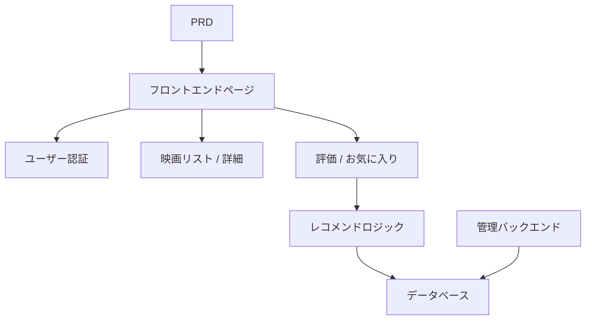

# Spring Boot 映画レコメンドシステム開発実践

## 概要

本実践プロジェクトでは、実際の PRD に基づいて、Spring Boot を使用してレコメンド機能付きの映画サイトを完成させます。このプロジェクトのコアチャレンジは、単純な CRUD ではなく、「ユーザーの行動がレコメンド結果にどう影響するか」「レコメンドをどう説明可能にするか」を考えることにあります。

これは Stage 2 の総合実践セクションです。「コンテンツ + 行動 + レコメンド」型製品の開発パターンに初めて触れる機会であり、このパターンは EC、コンテンツプラットフォーム、パーソナライズフィードなどのシナリオで非常に一般的です。

## 前提知識

このプロジェクトを始める前に、以下の内容をすでに習得している必要があります：

- フロントエンドページ設計とコンポーネントライブラリの使用（[UI 設計](../../frontend/ui-design/)、[モダンコンポーネントライブラリ](../../frontend/modern-component-library/)）
- バックエンドインターフェース設計と開発（[インターフェースコード作成](../../backend/ai-interface-code/)）
- データベース基礎と Supabase（[データベースから Supabase まで](../../backend/database-supabase/)）
- Git ワークフローとデプロイ（[Git と GitHub](../../backend/git-workflow/)、[Web アプリのデプロイ](../../backend/zeabur-deployment/)）

## 学習目標

本実践完了後、以下のことができるようになります：

1. PRD を読み、レコメンドシステムの開発タスクリストを抽出する
2. Spring Boot を使用してバックエンドプロジェクトを構築し、RESTful API を実装する
3. 「ユーザー行動 → レコメンド」の完全なデータパイプラインを設計する
4. 説明可能なレコメンドロジックを実装する
5. エンドツーエンドの結合テストを完了し、デモ可能な製品プロトタイプを納品する

## プロジェクト概要

あなたが構築する製品は、レコメンド機能付きの映画サイトです：

| 機能 | 説明 |
|------|------|
| **閲覧と検索** | ユーザーは映画を閲覧・検索できる |
| **評価とお気に入り** | ユーザーは映画を評価し、お気に入りに追加できる |
| **パーソナライズレコメンド** | システムがユーザー行動に基づいてレコメンド結果を表示 |
| **管理バックエンド** | 管理者が映画データを管理し、レコメンド効果を確認 |

::: tip PRD 入口
本プロジェクトの要件文書は GitHub にあります： [PRD を表示](https://github.com/datawhalechina/easy-vibe/blob/main/docs/ja-jp/stage-2/assignments/movie-recommendation-springboot/PRD.md)
:::

<div style="margin: 32px 0;">
  <ClientOnly>
    <StepBar :active="0" :items="[
      { title: '要件分析', description: 'PRD を読み、レコメンド戦略、行動データ、管理範囲を明確にする' },
      { title: 'スケルトン構築', description: 'AI でリストページ、詳細ページ、レコメンドページ、管理ページを生成' },
      { title: '反復開発', description: 'レコメンドロジック、行動記録、管理機能を追加' },
      { title: '結合とリリース', description: 'エンドツーエンドで動作確認し、デプロイしてデモを準備' }
    ]" />
  </ClientOnly>
</div>

## 第 1 部：要件分析

### 1.1 PRD を読む

PRD 文書を開き、以下の質問に重点的に答えてください：

- レコメンド戦略は何ですか？第 1 版では説明可能なバージョン（評価類似度に基づくなど）を使用しますか？
- ユーザー行動データとして何を保存しますか？（評価、お気に入り、閲覧履歴など）
- 管理者が確認すべきレコメンド効果指標は何ですか？
- ページリストは完全ですか？

::: warning
以上の質問に対する明確な答えがない場合は、コードを書き始めないでください。要件の理解が不明確なのは、手戻りの最も一般的な原因です。
:::

### 1.2 システムアーキテクチャの確認



## 第 2 部：プロジェクトスケルトンの構築

### 2.1 フロントエンドページの生成

プロンプト参考：

```text
現在の PRD に基づいて、Spring Boot 映画レコメンドシステムのフロントエンドスケルトンを生成してください。

要件：
1. ページには以下を含む：ホーム、映画リスト、映画詳細、レコメンドページ、個人センター、管理バックエンド
2. まずページ構造とモックデータのみを生成し、実際のインターフェースには接続しない
3. 授業のデモではなく、実際のコンテンツ製品のようなスタイルにする
```

### 2.2 プロジェクト構造の検証

項目ごとにチェック：

- [ ] 映画リストページで検索とフィルタリングがサポートされている
- [ ] 映画詳細ページに評価とお気に入りボタンがある
- [ ] レコメンドページでレコメンド結果とレコメンド理由が表示できる
- [ ] 管理バックエンドで映画データとレコメンド効果が確認できる

## 第 3 部：反復開発

### 3.1 モジュールごとに進める

1. **Spring Boot プロジェクト構築**：プロジェクト構造、データベース設定、基本 CRUD
2. **映画データ管理**：映画リスト、詳細、検索インターフェース
3. **ユーザー行動**：評価、お気に入りインターフェース、行動データ書き込み
4. **レコメンドロジック**：ユーザー行動に基づくレコメンドアルゴリズムの実装
5. **レコメンド表示**：レコメンド結果の表示、レコメンド理由を含む
6. **管理バックエンド**：映画データのメンテナンス、レコメンド効果の確認

### 3.2 モジュール自己チェック

| チェック項目 | 検証方法 |
|--------|----------|
| 基本機能 | リスト、詳細、評価、お気に入りのクロージャが完了しているか |
| レコメンド連動 | ユーザー行動がレコメンド結果に影響しているか |
| レコメンド説明可能性 | ユーザーがなぜこれらの映画をレコメンドされたか理解できるか |
| 管理データ | 管理者が映画データとレコメンド効果を確認できるか |

## 第 4 部：結合テストとリリース

### 4.1 エンドツーエンドテスト

少なくとも以下のシナリオを検証：

- 映画を閲覧 → 評価 → お気に入り → レコメンドページを確認し、レコメンド結果が変化したことを確認
- 管理者ログイン → 映画を追加 → レコメンド効果統計を確認

## 提出物

本プロジェクト完了後、以下の内容を提出する必要があります：

- [ ] アクセス可能なオンラインデモリンク
- [ ] ソースコードリポジトリリンク（README を含む）
- [ ] PRD 文書
- [ ] コアページのスクリーンショット（映画リスト、映画詳細、レコメンドページ、管理バックエンド）
- [ ] 60 秒のデモ動画

## 評価基準

| 項目 | 基本要件 | 応用要件 |
|------|---------|---------|
| PRD 整合性 | ページ、機能、データ構造が基本的に PRD に適合 | 設計決定を明確に説明できる |
| 製品クロージャ | 閲覧 → 評価 → お気に入り → レコメンドが動作する | 評価行動がレコメンド結果に明確に影響する |
| レコメンド品質 | レコメンド結果が合理的で、理由が説明可能 | 複数のレコメンド戦略をサポート |
| 管理機能 | 映画データとレコメンド効果が確認可能 | レコメンド精度などの統計指標がある |
| エンジニアリング完成度 | フロントエンド、Spring Boot バックエンド、データベースのパイプラインが接続されている | レコメンドインターフェースにキャッシュやパフォーマンス最適化がある |

## 参考資料

- [UI 設計](../../frontend/ui-design/)
- [モダンコンポーネントライブラリでインターフェースを更新](../../frontend/modern-component-library/)
- [データベースから Supabase まで](../../backend/database-supabase/)
- [大規模モデルによるインターフェースコードとドキュメント作成](../../backend/ai-interface-code/)
- [Git と GitHub ワークフロー](../../backend/git-workflow/)
- [Web アプリのデプロイ方法](../../backend/zeabur-deployment/)
