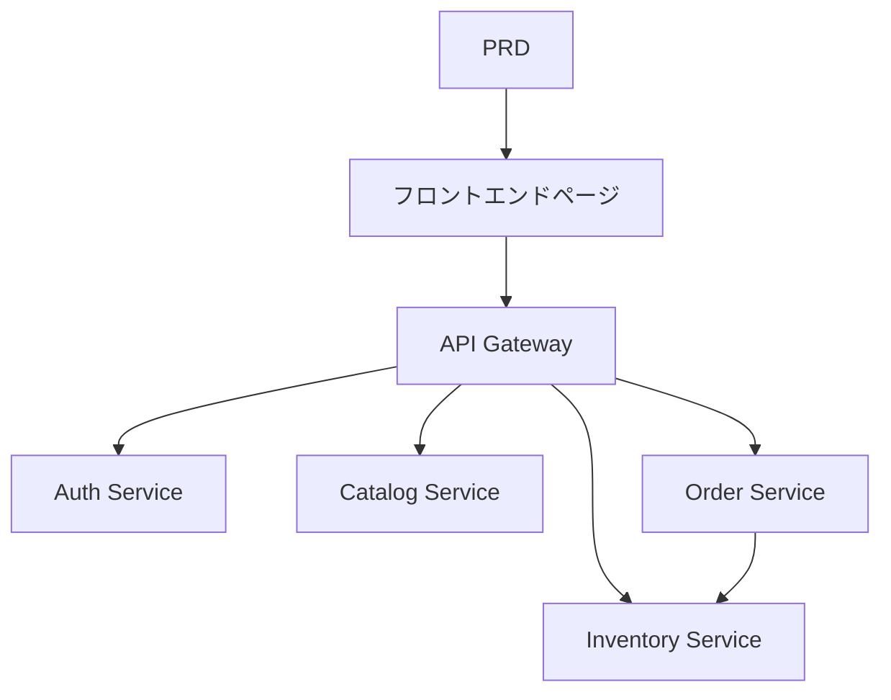

# 生鮮 EC マイクロサービスシステム開発実践

## 概要

本実践プロジェクトでは、実際の PRD に基づいて、生鮮 EC マイクロサービスシステムを一から完成させます。これまでの単一サービスプロジェクトとは異なり、このプロジェクトのバックエンドはビジネスごとに複数の独立したサービスに分割され、API ゲートウェイを通じて統一的に外部に公開されます。サービス境界の設計方法や、クロスサービスのデータ整合性の処理方法を学びます。

これは Stage 2 の総合実践セクションです。マイクロサービスアーキテクチャは実際の業務で非常に一般的であり、サービス分割とゲートウェイルーティングの基本的な考え方を習得すれば、より複雑なバックエンドシステム設計に対応できるようになります。

## 前提知識

このプロジェクトを始める前に、以下の内容をすでに習得している必要があります：

- フロントエンドページ設計とコンポーネントライブラリの使用（[UI 設計](../../frontend/ui-design/)、[モダンコンポーネントライブラリ](../../frontend/modern-component-library/)）
- バックエンドインターフェース設計と開発（[インターフェースコード作成](../../backend/ai-interface-code/)）
- データベース基礎と Supabase（[データベースから Supabase まで](../../backend/database-supabase/)）
- Git ワークフローとデプロイ（[Git と GitHub](../../backend/git-workflow/)、[Web アプリのデプロイ](../../backend/zeabur-deployment/)）

## 学習目標

本実践完了後、以下のことができるようになります：

1. PRD を読み、マイクロサービスシステムの開発タスクリストを抽出する
2. ビジネスドメインごとにサービス境界を分割する（認証、商品、在庫、注文）
3. API ゲートウェイルーティングを設計・実装する
4. 在庫引き当てや注文整合性などのクロスサービス問題を処理する
5. エンドツーエンドの結合テストを完了し、デモ可能なマイクロサービスプロトタイプを納品する

## プロジェクト概要

あなたが構築する製品は、生鮮 EC マイクロサービスシステムです：

| サブシステム | 責務 |
|--------|------|
| **ユーザー側** | 商品閲覧、注文、注文確認 |
| **管理側** | 商品管理、在庫管理、注文管理 |

バックエンドはビジネスごとに以下のサービスに分割されます：

| サービス | 責務 |
|------|------|
| **API Gateway** | 統一エントリ、ルーティング転送、認証チェック |
| **Auth Service** | ユーザー登録、ログイン、JWT 発行 |
| **Catalog Service** | 商品情報管理 |
| **Inventory Service** | 在庫数量管理 |
| **Order Service** | 注文作成、ステータス管理 |

::: tip PRD 入口
本プロジェクトの要件文書は GitHub にあります： [PRD を表示](https://github.com/datawhalechina/easy-vibe/blob/main/docs/ja-jp/stage-2/assignments/simple-grocery-microservices/PRD.md)
:::

<div style="margin: 32px 0;">
  <ClientOnly>
    <StepBar :active="0" :items="[
      { title: '要件分析', description: 'PRD を読み、サービス分割、ページ、取引フローを明確にする' },
      { title: 'スケルトン構築', description: 'フロントエンド、ゲートウェイ、各サービスのスケルトンを生成' },
      { title: '反復開発', description: 'モジュールごとにインターフェースを追加し、在庫と注文の整合性を修正' },
      { title: '結合とリリース', description: 'エンドツーエンドで動作確認し、デプロイしてデモを準備' }
    ]" />
  </ClientOnly>
</div>

## 第 1 部：要件分析

### 1.1 PRD を読む

PRD 文書を開き、以下の質問に重点的に答えてください：

- サービスはどのように分割しますか？各サービスの責任境界は何ですか？
- フロントエンドと管理側にはそれぞれどのページがありますか？
- 注文後の在庫引き当ての戦略は何ですか？成功/失敗/タイムアウトの各ケースにどう対応しますか？
- 第 1 版では、どの複雑な機能（分散トランザクション、メッセージキューなど）を先送りにしますか？

::: warning
以上の質問に対する明確な答えがない場合は、コードを書き始めないでください。要件の理解が不明確なのは、手戻りの最も一般的な原因です。
:::

### 1.2 システムアーキテクチャの確認



## 第 2 部：プロジェクトスケルトンの構築

### 2.1 プロジェクト構造の生成

プロンプト参考：

```text
現在の PRD に基づいて、生鮮 EC マイクロサービスシステムのプロジェクトスケルトンを生成してください。

要件：
1. フロントエンドのユーザー側と管理側のスケルトンを生成
2. api-gateway、auth-service、catalog-service、inventory-service、order-service の 5 つのディレクトリを生成
3. 各サービスはまず最小限の実行可能エントリのみを作成
4. 実際のデータベースと決済はまだ接続しない
```

### 2.2 プロジェクト構造の検証

項目ごとにチェック：

- [ ] 5 つのサービスディレクトリ構造が明確
- [ ] API Gateway が起動してリクエストを転送できる
- [ ] 各サービスのヘルスチェックインターフェースが利用可能
- [ ] フロントエンドのユーザー側と管理側ページがアクセス可能

## 第 3 部：反復開発

### 3.1 モジュールごとに進める

1. **API Gateway**：ルーティング設定、JWT 検証ミドルウェア
2. **Auth Service**：登録、ログイン、JWT 発行
3. **Catalog Service**：商品 CRUD、リストクエリ
4. **Inventory Service**：在庫照会、在庫引き当て
5. **Order Service**：注文作成、ステータス遷移、在庫連動
6. **管理側**：商品管理、在庫管理、注文管理

### 3.2 モジュール自己チェック

| チェック項目 | 検証方法 |
|--------|----------|
| ゲートウェイルーティング | 各サービスのインターフェースがゲートウェイ経由で正しく転送されているか |
| 権限分離 | ユーザー側と管理側のインターフェースが分離されているか |
| データ整合性 | 商品と在庫のデータが同期しているか |
| 取引クロージャ | 注文後の在庫引き当て、注文ステータスが一致しているか |
| 障害処理 | 在庫不足やタイムアウト時に補償メカニズムがあるか |

## 第 4 部：結合テストとリリース

### 4.1 エンドツーエンドテスト

少なくとも以下のシナリオを検証：

- 商品を閲覧 → カートに追加 → 注文 → 注文確認
- 管理者 → 商品を追加 → 在庫を更新 → 注文確認

## 提出物

本プロジェクト完了後、以下の内容を提出する必要があります：

- [ ] アクセス可能なオンラインデモリンク
- [ ] ソースコードリポジトリリンク（README を含む）
- [ ] PRD 文書
- [ ] コアページのスクリーンショット（商品リスト、注文ページ、注文ページ、管理バックエンド）
- [ ] 60 秒のデモ動画

## 評価基準

| 項目 | 基本要件 | 応用要件 |
|------|---------|---------|
| PRD 整合性 | ページ、機能、サービス分割が基本的に PRD に適合 | サービス分割の理由を明確に説明できる |
| 製品クロージャ | 閲覧 → 注文 → 在庫引き当て → 注文確認が動作する | 注文タイムアウトや在庫不足時に補償メカニズムがある |
| サービスアーキテクチャ | 各サービスが独立して起動でき、ゲートウェイ経由で統一アクセス可能 | サービス間通信にエラー処理とリトライがある |
| 管理機能 | 商品、在庫、注文管理が操作可能 | 管理側にデータ統計がある |
| エンジニアリング完成度 | フロントエンド、ゲートウェイ、サービス、データベースのパイプラインが接続されている | Docker Compose などのオーケストレーションがある |

## 参考資料

- [UI 設計](../../frontend/ui-design/)
- [モダンコンポーネントライブラリでインターフェースを更新](../../frontend/modern-component-library/)
- [データベースから Supabase まで](../../backend/database-supabase/)
- [大規模モデルによるインターフェースコードとドキュメント作成](../../backend/ai-interface-code/)
- [Git と GitHub ワークフロー](../../backend/git-workflow/)
- [Web アプリのデプロイ方法](../../backend/zeabur-deployment/)
