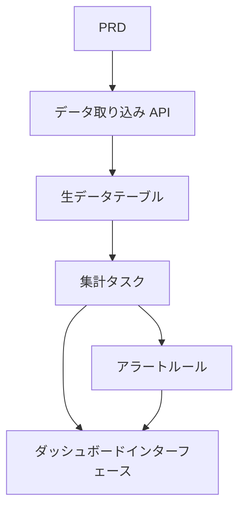

# Go 交通データ分析プラットフォーム開発実践

## 概要

本実践プロジェクトでは、実際の PRD に基づいて、Go を使用して交通データ分析プラットフォームを完成させます。このプロジェクトの方向性は、これまでの CRUD システムとは異なり、「データ取り込み → 集計 → アラート → 可視化」という完全なデータパイプラインを構築します。このようなデータ製品は、IoT、モニタリング、運用分析などのシナリオで非常に一般的です。

これは Stage 2 の総合実践セクションであり、Go 言語に初めて触れる機会でもあります。心配しないでください。これまでの JavaScript / TypeScript の基礎があれば、Go の学習は難しくありません。重要なのは、データパイプラインの設計思路を理解することです。

## 前提知識

このプロジェクトを始める前に、以下の内容をすでに習得している必要があります：

- フロントエンドページ設計とコンポーネントライブラリの使用（[UI 設計](../../frontend/ui-design/)、[モダンコンポーネントライブラリ](../../frontend/modern-component-library/)）
- バックエンドインターフェース設計と開発（[インターフェースコード作成](../../backend/ai-interface-code/)）
- データベース基礎と Supabase（[データベースから Supabase まで](../../backend/database-supabase/)）
- Git ワークフローとデプロイ（[Git と GitHub](../../backend/git-workflow/)、[Web アプリのデプロイ](../../backend/zeabur-deployment/)）

## 学習目標

本実践完了後、以下のことができるようになります：

1. PRD を読み、データ製品の開発タスクリストを抽出する
2. Go（Gin または Fiber）を使用してバックエンド API サービスを構築する
3. データ取り込み、ウィンドウ集計、アラートの完全なパイプラインを設計する
4. バックエンドデータとフロントエンドダッシュボードの整合性を保つ
5. エンドツーエンドの結合テストを完了し、デモ可能なデータ製品プロトタイプを納品する

## プロジェクト概要

あなたが構築する製品は、Go 交通データ分析プラットフォームです：

| モジュール | 責務 |
|------|------|
| **データ取り込み** | 生の交通イベントを受信してデータベースに格納 |
| **データ集計** | 時間ウィンドウごとにトレンドと渋滞指標を計算 |
| **アラート** | ルールに基づいてアラートレコードを生成 |
| **ダッシュボード表示** | フロントエンドでトレンドグラフ、ランキング、アラートリストを表示 |

::: tip PRD 入口
本プロジェクトの要件文書は GitHub にあります： [PRD を表示](https://github.com/datawhalechina/easy-vibe/blob/main/docs/ja-jp/stage-2/assignments/traffic-data-visualization-go/PRD.md)
:::

<div style="margin: 32px 0;">
  <ClientOnly>
    <StepBar :active="0" :items="[
      { title: '要件分析', description: 'PRD を読み、データソース、指標定義、アラートルールを明確にする' },
      { title: 'スケルトン構築', description: 'AI で Go API サービスとフロントエンドダッシュボードのスケルトンを生成' },
      { title: '反復開発', description: '集計ロジック、アラートルール、ダッシュボードインターフェースを追加' },
      { title: '結合とリリース', description: 'エンドツーエンドで動作確認し、デプロイしてデモを準備' }
    ]" />
  </ClientOnly>
</div>

## 第 1 部：要件分析

### 1.1 PRD を読む

PRD 文書を開き、以下の質問に重点的に答えてください：

- データソースは何ですか？フィールドには何がありますか？
- コア指標の定義は何ですか？（例：「渋滞」の具体的な基準）
- アラートルールは何ですか？第 1 版ではまずシンプルなルールに絞りますか？
- ダッシュボードにはどのページとグラフが含まれますか？

::: warning
以上の質問に対する明確な答えがない場合は、コードを書き始めないでください。要件の理解が不明確なのは、手戻りの最も一般的な原因です。
:::

### 1.2 データパイプラインの確認



## 第 2 部：プロジェクトスケルトンの構築

### 2.1 Go API サービスの生成

プロンプト参考：

```text
現在の PRD に基づいて、Go 交通データ分析プラットフォームのスケルトンを生成してください。

要件：
1. Gin または Fiber を使用
2. データ取り込みインターフェースを提供
3. 集計タスクのスケルトンを提供
4. dashboard と alerts インターフェースのスケルトンを提供
5. まずは複雑な分析を実装せず、実行可能な構造のみを構築
```

### 2.2 プロジェクト構造の検証

項目ごとにチェック：

- [ ] Go サービスが正常に起動できる
- [ ] データ取り込みインターフェースでデータを受信して保存できる
- [ ] 集計タスクのフレームワークが構築されている
- [ ] フロントエンドダッシュボードページで基本グラフが表示できる

## 第 3 部：反復開発

### 3.1 モジュールごとに進める

1. **データ取り込み API**：生の交通イベントを受信し、データベースに書き込む
2. **データ集計**：時間ウィンドウごとに集計し、トレンドと渋滞指標を計算
3. **アラートルール**：閾値に基づいてアラートレコードを生成
4. **ダッシュボードインターフェース**：トレンドデータ、ランキングデータ、アラートリストを提供
5. **フロントエンドダッシュボード**：トレンドグラフ、ランキング、アラートリストページ

### 3.2 モジュール自己チェック

| チェック項目 | 検証方法 |
|--------|----------|
| データ取り込み | 生データが正しくデータベースに格納されているか |
| 集計定義 | トレンド、ランキング指標の計算ロジックが一致しているか |
| アラートルール | アラートのトリガー条件が期待通りか |
| データ整合性 | ダッシュボードの表示とバックエンドデータが一致しているか |
| API 仕様 | 統一されたレスポンス構造とエラー処理があるか |

## 第 4 部：結合テストとリリース

### 4.1 エンドツーエンドテスト

少なくとも以下のシナリオを検証：

- テストデータを取り込み → 集計タスクを実行 → ダッシュボード表示が更新される
- アラート条件をトリガー → アラートレコードが生成 → アラートページに表示

## 提出物

本プロジェクト完了後、以下の内容を提出する必要があります：

- [ ] アクセス可能なオンラインデモリンク
- [ ] ソースコードリポジトリリンク（README を含む）
- [ ] PRD 文書
- [ ] コアページのスクリーンショット（データ取り込みデモ、トレンドダッシュボード、アラートリスト）
- [ ] 60 秒のデモ動画

## 評価基準

| 項目 | 基本要件 | 応用要件 |
|------|---------|---------|
| PRD 整合性 | 機能とデータ構造が基本的に PRD に適合 | 指標定義と集計ロジックを明確に説明できる |
| データパイプライン | 取り込み → 集計 → アラート → ダッシュボードが動作する | 集計タスクが増分更新をサポート |
| 分析能力 | トレンド、ランキング、アラートの 3 モジュールが利用可能 | 指標が設定可能、アラートルールがカスタマイズ可能 |
| フロントエンド表示 | ダッシュボードで基本グラフが表示できる | グラフが時間範囲フィルタをサポート |
| エンジニアリング完成度 | Go API、データベース、フロントエンドのパイプラインが接続されている | API に統一されたエラー処理とログがある |

## 参考資料

- [UI 設計](../../frontend/ui-design/)
- [モダンコンポーネントライブラリでインターフェースを更新](../../frontend/modern-component-library/)
- [データベースから Supabase まで](../../backend/database-supabase/)
- [大規模モデルによるインターフェースコードとドキュメント作成](../../backend/ai-interface-code/)
- [Git と GitHub ワークフロー](../../backend/git-workflow/)
- [Web アプリのデプロイ方法](../../backend/zeabur-deployment/)
