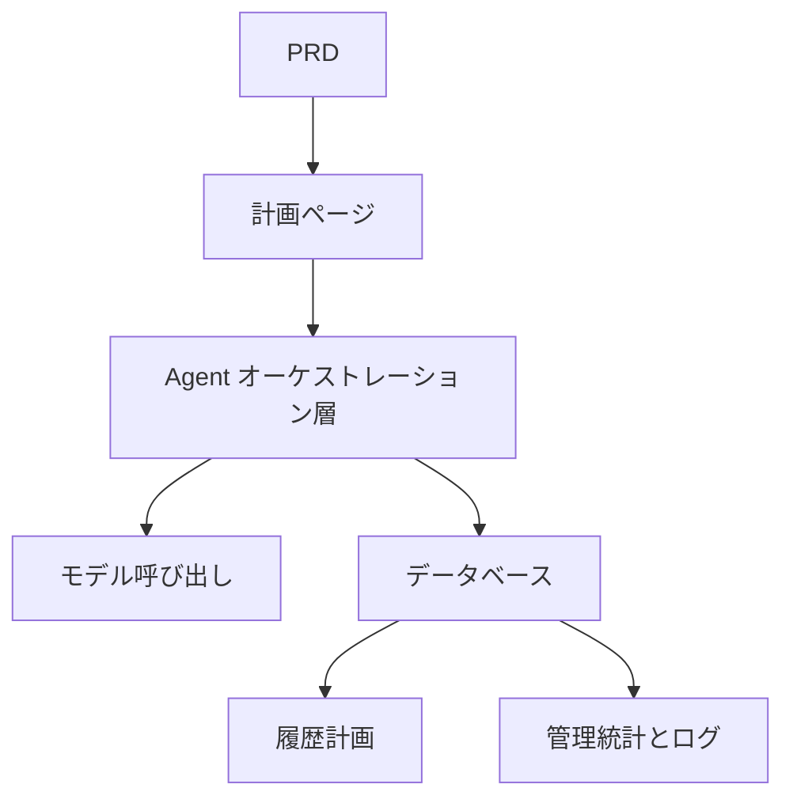

# スマート旅行計画 Agent プラットフォーム開発実践

## 概要

本実践プロジェクトでは、実際の PRD に基づいて、スマート旅行計画 Agent プラットフォームを一から完成させます。構造化された入力を受け取り、毎日の旅程を生成し、保存と再利用をサポートする完全な AI 製品を構築します。単なるチャットボットではなく、タスク管理能力を持つ製品です。

これは Stage 2 の総合実践セクションです。このプロジェクトのコアチャレンジは、AI が構造化された使用可能な旅程計画を生成するようにすることであり、操作不可能な長いテキストではなく、実用的な出力を生み出すことにあります。

## 前提知識

このプロジェクトを始める前に、以下の内容をすでに習得している必要があります：

- フロントエンドページ設計とコンポーネントライブラリの使用（[UI 設計](../../frontend/ui-design/)、[モダンコンポーネントライブラリ](../../frontend/modern-component-library/)）
- バックエンドインターフェース設計と開発（[インターフェースコード作成](../../backend/ai-interface-code/)）
- データベース基礎と Supabase（[データベースから Supabase まで](../../backend/database-supabase/)）
- Git ワークフローとデプロイ（[Git と GitHub](../../backend/git-workflow/)、[Web アプリのデプロイ](../../backend/zeabur-deployment/)）

## 学習目標

本実践完了後、以下のことができるようになります：

1. PRD を読み、Agent プラットフォームの開発タスクリストを抽出する
2. 構造化された入力フォームと構造化された出力形式を設計する
3. Agent オーケストレーション層を実装し、ユーザー入力、モデル呼び出し、結果保存を処理する
4. 「生成 → 保存 → 再利用」のビジネスクロージャを構築する
5. エンドツーエンドの結合テストを完了し、デモ可能な AI 製品プロトタイプを納品する

## プロジェクト概要

あなたが構築する製品は、スマート旅行計画 Agent プラットフォームです：

| 機能 | 説明 |
|------|------|
| **旅程計画** | ユーザーが出発地、目的地、日付、予算、好みを入力し、システムが毎日の旅程を生成 |
| **予算配分** | 旅程結果に予算配分と提案を含む |
| **履歴管理** | ユーザーは過去の計画を保存、再生成、エクスポート可能 |
| **管理バックエンド** | 管理者が人気の目的地、失敗タスク、ユーザーフィードバックを確認 |

::: tip PRD 入口
本プロジェクトの要件文書は GitHub にあります： [PRD を表示](https://github.com/datawhalechina/easy-vibe/blob/main/docs/ja-jp/stage-2/assignments/travel-planning-agent-platform/PRD.md)
:::

<div style="margin: 32px 0;">
  <ClientOnly>
    <StepBar :active="0" :items="[
      { title: '要件分析', description: 'PRD を読み、ページ、Agent オーケストレーション、入出力構造を明確にする' },
      { title: 'スケルトン構築', description: 'AI でホーム、計画ページ、履歴ページ、管理ページのスケルトンを生成' },
      { title: '反復開発', description: '構造化出力、タスクステータス、履歴管理をモジュールごとに追加' },
      { title: '結合とリリース', description: 'エンドツーエンドで動作確認し、デプロイしてデモを準備' }
    ]" />
  </ClientOnly>
</div>

## 第 1 部：要件分析

### 1.1 PRD を読む

PRD 文書を開き、以下の質問に重点的に答えてください：

- 第 1 版は単一目的地のみにしますか？
- 旅程出力は構造化されている必要がありますか？その構造は何ですか？
- エクスポート機能はどの程度深く実装しますか？（共有リンク / PDF / 画像）
- 管理バックエンドの統計とタスクログの範囲は何ですか？

::: warning
以上の質問に対する明確な答えがない場合は、コードを書き始めないでください。要件の理解が不明確なのは、手戻りの最も一般的な原因です。
:::

### 1.2 システムアーキテクチャの確認



## 第 2 部：プロジェクトスケルトンの構築

### 2.1 フロントエンドページの生成

プロンプト参考：

```text
現在の PRD に基づいて、スマート旅行計画 Agent プラットフォームのフロントエンドスケルトンを生成してください。

要件：
1. ページには以下を含む：ホーム、計画ページ、旅程詳細ページ、履歴記録ページ、管理ページ
2. 計画ページの左側にフォーム、右側に結果プレビュー
3. まずページ構造とモックデータのみを生成し、実際のインターフェースには接続しない
4. モダンな AI 製品のようなスタイルにする
```

### 2.2 ページ構造の検証

項目ごとにチェック：

- [ ] 計画ページのフォームフィールドが PRD と一致している
- [ ] 結果プレビュー領域で構造化された旅程データが表示できる
- [ ] 履歴記録ページで複数の計画が表示できる
- [ ] 管理バックエンドページで統計データが表示できる

## 第 3 部：反復開発

### 3.1 モジュールごとに進める

1. **認証**：登録、ログイン
2. **計画フォーム**：構造化入力（出発地、目的地、日付、予算、好み）
3. **Agent オーケストレーション**：入力の受信 → モデル呼び出し → 構造化出力の解析
4. **結果表示**：旅程を日ごとに表示、予算配分、提案
5. **履歴管理**：計画の保存、再生成、エクスポート
6. **管理バックエンド**：人気の目的地、失敗タスク、ユーザーフィードバック
7. **タスクステータス**：生成中 / 成功 / 失敗のステータス管理とエラー記録

### 3.2 モジュール自己チェック

| チェック項目 | 検証方法 |
|--------|----------|
| 入力完全性 | フォームフィールドが PRD と一致しているか |
| 出力構造化 | 旅程結果が構造化データであるか（長いテキストではないか） |
| データ整合性 | trip、itinerary、logs のデータが一致しているか |
| クロージャ検証 | 「入力 → 生成 → 保存 → 再生成」のデモができるか |

## 第 4 部：結合テストとリリース

### 4.1 エンドツーエンドテスト

少なくとも以下のシナリオを検証：

- 旅程パラメータを入力 → 毎日の旅程を生成 → 予算配分を確認 → 履歴に保存
- 履歴記録から旅程を再生成
- 管理者がタスク統計と失敗ログを確認

## 提出物

本プロジェクト完了後、以下の内容を提出する必要があります：

- [ ] アクセス可能なオンラインデモリンク
- [ ] ソースコードリポジトリリンク（README を含む）
- [ ] PRD 文書
- [ ] コアページのスクリーンショット（計画ページ、旅程詳細ページ、履歴記録ページ、管理バックエンド）
- [ ] 60 秒のデモ動画

## 評価基準

| 項目 | 基本要件 | 応用要件 |
|------|---------|---------|
| PRD 整合性 | ページ、機能、データ構造が基本的に PRD に適合 | 設計決定を明確に説明できる |
| 製品クロージャ | 計画 → 保存 → 履歴 → 再生成が動作する | エクスポートと共有をサポート |
| 出力品質 | 旅程結果が構造化され読みやすい | 予算配分が合理的で、提案に针对性がある |
| 管理機能 | タスク統計と失敗ログが確認可能 | 人気の目的地分析がある |
| エンジニアリング完成度 | フロントエンド、バックエンド、データベース、モデル呼び出しパイプラインが接続されている | タスクステータス管理が充実し、エラーがトレース可能 |

## 参考資料

- [UI 設計](../../frontend/ui-design/)
- [モダンコンポーネントライブラリでインターフェースを更新](../../frontend/modern-component-library/)
- [データベースから Supabase まで](../../backend/database-supabase/)
- [大規模モデルによるインターフェースコードとドキュメント作成](../../backend/ai-interface-code/)
- [Git と GitHub ワークフロー](../../backend/git-workflow/)
- [Web アプリのデプロイ方法](../../backend/zeabur-deployment/)
