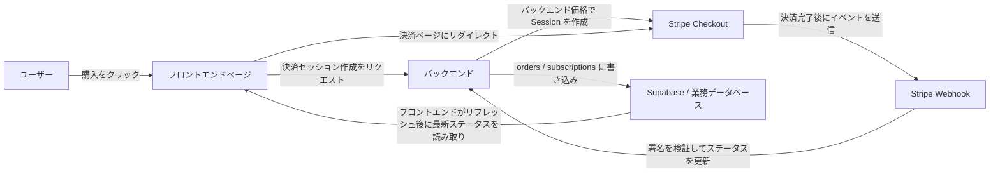
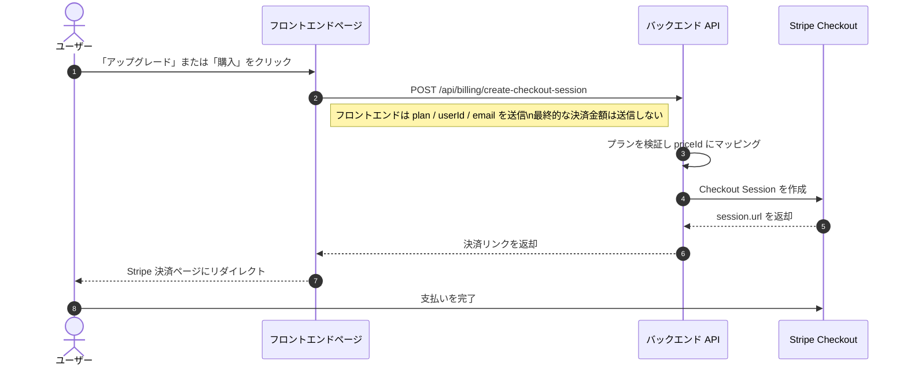
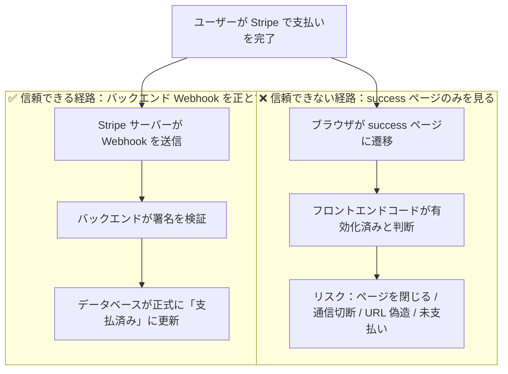
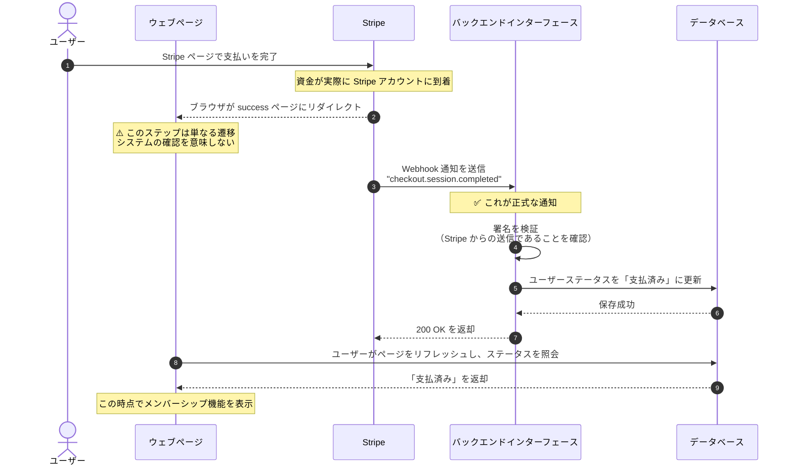
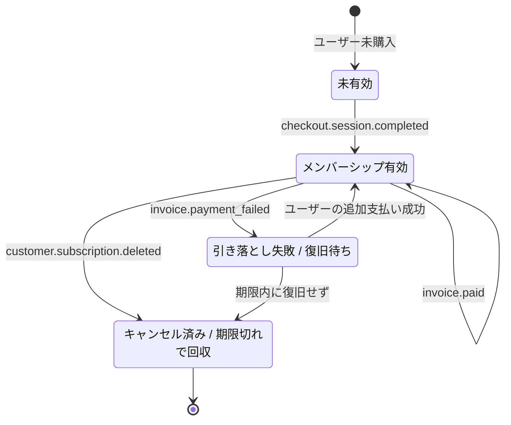
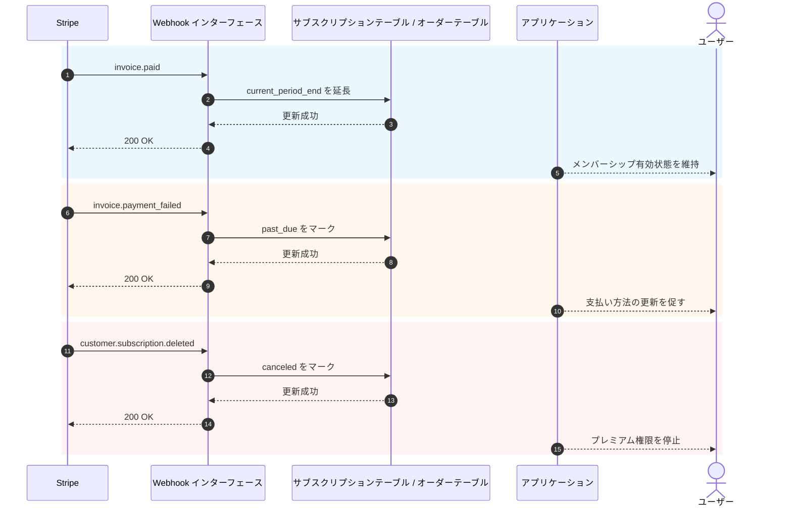

# Stripe などの決済システムの統合方法

製品にページ、ログイン、データベース、基本的なバックエンドが揃った後、次に直面する現実的な課題は **「どうやって料金を徴収するか」** です。

決済を初めて導入する際、多くの人が「どうやって支払いページにリダイレクトするか」にばかり注意を向けます。しかし、システムが安定しているかどうかを本当に左右するのはボタンではなく、決済チェーン全体です。誰が価格を決定するのか、誰が決済の成功を確認するのか、誰がデータベースを更新するのか、誰が権限を回収するのか。

本記事では、内容を2つの部分に分けて解説します。

- **前半**では最も実用的な基本導入のみを扱い、Stripe をプロジェクトにできるだけ早く組み込めるようにします。
- **後半**は付録としてまとめ、Webhook の詳細、サブスクリプションイベント、国や地域による決済ソリューションの違いを取り上げます。

> **前提として、以下の章を先に学ぶことをお勧めします**
>
> - [データベースから Supabase へ](../database-supabase/)
> - [大規模言語モデルによるインターフェースコードとインターフェース文書の作成支援](../ai-interface-code/)
> - [Web アプリケーションのデプロイ方法](../zeabur-deployment/)

# このレッスンで学ぶこと

1. 最小実現可能な決済システムがどのようなものか。
2. Stripe を最速でプロジェクトに組み込む方法。
3. AI に決済システムを直接追加させるためのプロンプトの書き方。
4. 海外向けの Stripe プロジェクトではない場合、地域ごとにどの決済ソリューションを優先すべきか。

---

# 第1部：基本編

## 1. まず3つの原則を覚える

3つのことだけ覚えるなら、次の3つです。

1. **価格は必ずバックエンドで決定する**。フロントエンドから送られてくる金額を信用してはいけない。
2. **権限を本当に有効にするのは Webhook であり**、`success` ページではない。
3. **自前のデータベースに必ず決済ステータスを保存する**。Stripe の管理画面だけに頼ってはいけない。

この3つが決済システムの最も中核的な境界です。この境界さえ間違えなければ、後で Stripe、PayPal、Alipay、WeChat Pay に切り替えても、本質的には「インターフェースが変わるだけで、アーキテクチャは変わらない」ことになります。

## 2. バックエンドではなく、フロントエンドから直接 Stripe に接続するとどうなるか？

決済を初めて実装する際、多くの人が真っ先に思いつく考え方です。

- ページにはすでに「購入」ボタンがある
- フロントエンドから直接 Stripe に接続すればいいのではないか
- そうすればバックエンドを作らなくても済むのではないか

デモ用の偽ページを作るだけなら、この考え方で問題ありません。
しかし、本当に料金を徴収するなら、**この方法は通常、問題を引き起こします。**

最もよくある問題は以下の通りです。

1. **価格が簡単に改ざんされる**
   ブラウザからのリクエストは、ユーザー自身の PC から送信されます。リクエストの内容を書き換えることができます。
2. **機密情報が漏洩しやすい**
   本当に重要なシークレットキー、価格ロジック、メンバーシップの有効化ロジックは、そもそもフロントエンドに置くべきではありません。
3. **「この支払いは本当に成功したのか」を確実に確認できない**
   ユーザーが成功ページに遷移したからといって、データベースが正しく同期されているとは限りません。
4. **データベースの状態が混乱する**
   ユーザーは「ちゃんと支払った」と主張するのに、システム側には記録がないという事態が発生します。

より安全な役割分担は次のようになります。

- フロントエンドの担当：ボタンの表示、購入の開始、ページ遷移
- バックエンドの担当：価格の決定、決済セッションの作成、Webhook の受信、データベースの更新

::: info 一言でまとめると
**フロントエンドはリダイレクトを担当し、バックエンドが価格決定と確認を担当する。**

本当に料金を徴収するのであれば、「最終的な価格決定権」と「決済成功後の有効化ロジック」をフロントエンドに置いてはいけません。
:::

## 3. Stripe をまず選ぶべきケース

次のようなケースでは、Stripe を最初の選択肢とするのが最もスムーズです。

- 海外ユーザー向けの SaaS
- サブスクリプション型のメンバーシップ製品
- デジタル製品、テンプレート、AI クレジットパック
- 商用化を素早く検証したいが、最初からローカル決済の細かな対応に時間をかけたくない場合

主なユーザーが中国大陸にいる場合、通常は Stripe を第一選択としません。この点については付録でまとめて説明します。

## 4. 最小実現可能な決済チェーン

まず最小バージョンを見てみましょう。このチェーンが動けば、決済システムの骨格が完成します。



これを分かりやすく言い換えると、次の通りです。

1. ユーザーがボタンをクリックする。
2. フロントエンドがバックエンドに決済リンクを要求する。
3. バックエンドが Stripe のシークレットキーを使って決済セッションを作成する。
4. ユーザーが Stripe のページで支払いを行う。
5. Stripe が「支払いが本当に成功した」ことを Webhook で通知する。
6. バックエンドがデータベースを更新する。

## 5. 標準的な決済フローのシーケンス図

より規格化されたシステム図に慣れている場合は、以下のシーケンス図を直接ご覧ください。



## 6. クイックスタート

Stripe を最速でプロジェクトに組み込むには、以下の5ステップに従うだけで十分です。

### 6.1 ステップ1：Stripe 管理画面で商品と価格を作成する

このステップの目的は、「とりあえず適当に設定する」ことではなく、Stripe 上で **何を売るのか、どのように料金を徴収するのか** を明確に定義することです。

Stripe のモデルでは次のようになります。

- **Product** は「何を売るのか」を表します。例：`Pro メンバーシップ`
- **Price** は「いくらで、どの周期で売るのか」を表します。例：`月額 9.9 ドル`、`年額 99 ドル`

なぜ最初にこのステップを行う必要があるのでしょうか？
バックエンドが Checkout Session を作成する際、Stripe に金額を直接渡すのではなく、すでに存在する `price_id` を渡すからです。Stripe はこの `price_id` に基づいて、実際の決済ページ、金額、通貨、サブスクリプション周期を生成します。

このステップを飛ばすと、後の「決済リンクの作成」ができません。

::: info なぜここで立ち止まる必要があるのか
`Product`、`Price` という言葉を見ると、Stripe の内部用語を学んでいるように感じて煩わしくなる初心者の方もいるでしょう。

しかし実際には、このステップは非常にシンプルなことを行っています。
- 「何を売るのか」を明確にする
- 「いくらで売るのか」を明確にする
- バックエンドが後で安定した `price_id` を使って決済リンクを作成できるようにする

この関係を理解すれば、Checkout Session も抽象的には感じなくなります。
:::

最小限のサブスクリプションシステムでは、少なくとも次の2つのレベルを最初に作成します。

- 1つの `Product`
- 1つ以上の `Price`

以下のページを直接開けます。

- Stripe Dashboard ログイン：<https://dashboard.stripe.com/login>
- Stripe 商品と価格の管理ドキュメント：<https://docs.stripe.com/products-prices/manage-prices>
- Stripe Checkout クイックスタート：<https://docs.stripe.com/checkout/quickstart?lang=node>
- Stripe Dashboard 商品ページ：<https://dashboard.stripe.com/test/products>

まずは **テストモード（Test mode）** で操作することをお勧めします。最初から本番環境で作成しないでください。

最も一般的な最小構成は以下の通りです。

- `Product`: `Pro Plan`
- `Price 1`: `pro_monthly`
- `Price 2`: `pro_yearly`

管理画面で操作する際は、次の順序で理解できます。

1. まず `Pro Plan` という商品を作成する
2. その商品の下に2つの価格を紐付ける
3. 月額と年額は同じ商品の2つの課金方式

完了後、少なくとも以下の情報をメモしておいてください。

- 月額価格の `price_id`
- 年額価格の `price_id`
- 自分のプラン名（例：`pro_monthly`、`pro_yearly`）

初めて Stripe の管理画面に入る場合は、次のように理解することをお勧めします。

- `Product` が決済ページで何を売るかを決める
- `Price` が決済ページでいくら徴収するかを決める
- バックエンドが後で実際に使うのは、主に `price_id`

::: info 本当にメモしておくべき値
このページで最も重要なのは商品名ではなく、`price_id` です。

後で AI にバックエンドの実装を依頼する際も、自分で問題を調査する際も、頻繁に使うのは通常以下の値です。
- `STRIPE_PRICE_PRO_MONTHLY`
- `STRIPE_PRICE_PRO_YEARLY`
- これらに対応する2つの `price_id`
:::

AI にまず管理画面の設定を案内させたい場合は、次のプロンプトを直接使用できます。

```text
私は初めて Stripe を使います。まずコードを変更せずに、Stripe 管理画面で最基本的な課金設定を手順通りに教えてください。

以下の公式ドキュメントに基づいて、ステップバイステップで操作説明をお願いします：
- https://docs.stripe.com/products-prices/manage-prices
- https://docs.stripe.com/checkout/quickstart?lang=node

私の状況：
- 最もシンプルなメンバーシップ課金をしたい
- 月額と年額の2つのプランのみ
- Product と Price という言葉の意味がまだ分からない

お願い：
1. まず Product と Price がそれぞれ何かを最も分かりやすい言葉で説明してください。
2. 「どのページを開き → どこをクリックし → 何を入力するか」の順に教えてください。
3. 最後に、設定完了後に管理画面からコピーすべき値を教えてください。
4. 間違いやすいポイントがあれば、テストモードで操作することも併せて教えてください。
```

### 6.2 ステップ2：環境変数の準備

通常、少なくとも以下の環境変数を準備する必要があります。

- `STRIPE_SECRET_KEY`
- `STRIPE_WEBHOOK_SECRET`
- `STRIPE_PRICE_PRO_MONTHLY`
- `STRIPE_PRICE_PRO_YEARLY`
- `APP_URL`
- `SUPABASE_URL`
- `SUPABASE_SERVICE_ROLE_KEY`

以下のページを直接開けます。

- Stripe API Keys ドキュメント：<https://docs.stripe.com/keys>
- Stripe Dashboard API Keys ページ：<https://dashboard.stripe.com/test/apikeys>
- Stripe Webhooks ドキュメント：<https://docs.stripe.com/webhooks>
- Stripe Dashboard Webhooks ページ：<https://dashboard.stripe.com/test/workbench/webhooks>

> **注意**：`STRIPE_SECRET_KEY` と `SUPABASE_SERVICE_ROLE_KEY` は必ずバックエンドにのみ配置してください。

::: info 環境変数の目的
このステップは「`.env` を埋める」ことが目的ではなく、決済システムの中で最も機密性の高い要素をバックエンドに保管することが目的です。

- Stripe のバックエンドシークレットキー
- Webhook 署名検証キー
- 自分の価格マッピング

端的に言えば、フロントエンドは購入の開始のみを担当し、本当のシークレットと価格設定ロジックはすべてサーバー側に残すべきです。
:::

このステップも AI に整理を依頼できます。

```text
私のプロジェクトが現在どのように環境変数を管理しているかを確認し、Stripe に必要な環境変数を整理してください。

以下のドキュメントを参考にしてください：
- https://docs.stripe.com/keys
- https://docs.stripe.com/webhooks

私の状況：
- 初心者です
- どの変数をフロントエンドに置き、どれをバックエンドに置くべきか分からない
- 現在のプロジェクトで `.env`、`.env.local` など、どのファイルを変更すべきかも分からない

お願い：
1. まず現在のプロジェクト内で環境変数が通常どこに書かれているかを検索してください。
2. Stripe 導入に最低限必要な変数をリストアップしてください。
3. 各変数の役割を最も分かりやすい言葉で説明してください。
4. 各変数をどの Stripe ページからコピーすればよいか教えてください。
5. プロジェクトにサンプル環境変数ファイルがあれば、変数名を直接追加してください。
```

### 6.3 ステップ3：バックエンドで Checkout Session を作成する

このステップは自分でインターフェースを書く必要はありません。AI に公式ドキュメントを参考にして実装させましょう。

まず以下のドキュメントを AI に渡します。

- Stripe Checkout クイックスタート：<https://docs.stripe.com/checkout/quickstart?lang=node>
- Checkout Sessions API：<https://docs.stripe.com/api/checkout/sessions/create>
- サブスクリプション説明：<https://docs.stripe.com/payments/subscriptions>

そして次のプロンプトを貼り付けます。

```text
現在のプロジェクトのバックエンドコードの構成を確認し、Stripe 決済を組み込んでください。

以下の公式ドキュメントを参考にしてください：
- https://docs.stripe.com/checkout/quickstart?lang=node
- https://docs.stripe.com/api/checkout/sessions/create
- https://docs.stripe.com/payments/subscriptions

私の目標はシンプルです：
- ユーザーが購入ボタンをクリックした後、Stripe の支払いページに遷移する
- プランは月額と年額の2種類のみ
- コードをどこに置くべきか自分で判断せず、まずプロジェクトを見て適切な場所に配置してください

お願い：
1. まずプロジェクト内を検索し、バックエンドのエントリーファイル、ルーティングファイル、環境変数の書き方がどこにあるか把握してください。
2. 公式ドキュメントを参考に、「Stripe 決済リンクの作成」ステップを組み込んでください。
3. 金額は自分で指定させるのではなく、バックエンドの環境変数で価格を決定してください。
4. 完了後、どのファイルを変更したか教えてください。
5. 最後に、Stripe 管理画面でまだ追加が必要な設定があれば教えてください。
```

### 6.4 ステップ4：フロントエンドから決済ページにリダイレクトする

このステップの目標は非常にシンプルです。価格ページのボタンからバックエンドのインターフェースを呼び出し、Stripe Checkout にリダイレクトさせます。

参考ドキュメント：

- Stripe Checkout 統合説明：<https://docs.stripe.com/payments/checkout/build-integration>

AI 用プロンプト：

```text
プロジェクト内の「購入」ボタンに Stripe を接続してください。

要件：
- 既存のページは変更せず、ボタンクリック後のロジックのみを変更する
- クリック後にバックエンドインターフェースを呼び出して決済リンクを取得し、Stripe にリダイレクトする
- エラーが発生した場合は、ユーザーにシンプルなメッセージを表示（例：「現在決済機能を利用できません。しばらくしてからお試しください」）

参考ドキュメント：https://docs.stripe.com/payments/checkout/build-integration
```

### 6.5 ステップ5：Webhook でデータベースステータスを更新する

これが最も重要なステップです。

::: info なぜこのステップが最も重要なのか
「ユーザーが支払いを完了し、success ページに遷移した」だけで完了と思っている人が多いです。

違います。

あなたのシステムにとって本当に重要なのは、
**Stripe が Webhook を通じて正式にあなたのサーバーにイベントを送信し、バックエンドがデータベースのステータス更新に成功したかどうか** です。
:::

AI に Stripe 公式の Webhook ドキュメントに従って直接実装させ、自分で手書きしないようにしましょう。

参考ドキュメント：

- Stripe Webhooks：<https://docs.stripe.com/webhooks>
- Stripe CLI：<https://docs.stripe.com/stripe-cli>
- Stripe CLI 使用方法：<https://docs.stripe.com/stripe-cli/use-cli>

AI 用プロンプト：

```text
Stripe の「支払い成功後に自動で有効化する」ステップを引き続き実装してください。

以下の公式ドキュメントを参考にしてください：
- https://docs.stripe.com/webhooks
- https://docs.stripe.com/stripe-cli
- https://docs.stripe.com/stripe-cli/use-cli

私の目標：
- ユーザーが支払いを完了した後、ただ success ページに遷移するだけではなく
- 本当にデータベース内のメンバーシップステータスを「有効」に変更したい

お願い：
1. まず現在のプロジェクト内でデータベース関連のコードとユーザーステータスの保存方法を検索してください。
2. Stripe Webhook を追加してください。
3. 支払い成功後、該当ユーザーを active に変更するか、プロジェクトで現在使用しているメンバーシップステータスフィールドを更新してください。
4. プロジェクトに既存のサブスクリプションテーブル、オーダーテーブル、ユーザーテーブルがあれば、既存の構造を優先して使用してください。
5. 完了後、どのファイルを変更したか教えてください。
6. ローカルでこのステップが本当に機能しているかを確認する方法も教えてください。
```

## 7. AI に素早く導入させるためのプロンプト

Codex、Claude Code、Trae、Cursor などのツールを使用している場合、以下のプロンプトを直接貼り付けて、プロジェクトに決済導入を行わせることができます。

```text
現在のプロジェクトに Stripe 決済を組み込んでください。最もシンプルに動作するメンバーシップ課金機能を実装したいと考えています。

私の要件：
1. 私は初心者なので、まずプロジェクトを確認してから、コードをどこに変更すべきか判断してください。
2. ディレクトリ構造、ルーティング構造、データベース構造は自分で判断しないでください。
3. 最もシンプルなバージョンのみを作成：月額と年額の2つのプラン。
4. ユーザーが購入をクリックした後、Stripe の支払いページに遷移する。
5. 支払い成功後、データベースのメンバーシップステータスが「有効」になる。
6. 最初から複雑な機能（クーポン、アップグレード/ダウングレード、複雑な請求書など）は追加しないでください。

出力要件：
1. まず変更計画を提示してください。
2. その後、コードを直接変更してください。
3. 最後に、ローカルでステップバイステップでテストする方法を説明してください。
4. Stripe 管理画面での操作が必要なステップがあれば、リンクと要点を直接教えてください。
```

AI にプロジェクトにより密接に対応させたい場合は、先頭に以下の情報を追加することもできます。

- 使用しているフロントエンドフレームワーク
- バックエンドのディレクトリ構造
- データベースのテーブル名
- 現在のユーザー認証が Supabase Auth か自前の Auth か

## 7.1 ローカル連携テストも AI に任せる

ローカル連携テストも AI に一任したい場合は、以下のプロンプトをそのまま使用できます。

```text
Stripe 決済を本当に動作するようにしてください。ステップバイステップで実行したいので、推測は避けたいと考えています。

以下の公式ドキュメントを参考にしてください：
- https://docs.stripe.com/webhooks
- https://docs.stripe.com/stripe-cli
- https://docs.stripe.com/stripe-cli/use-cli

私の目標：
1. まずどの Stripe ページを開けばよいか教えてください。
2. STRIPE_WEBHOOK_SECRET の取得方法を教えてください。
3. stripe login と stripe listen の使用方法を教えてください。
4. checkout.session.completed がローカル Webhook に正常に送信されたことを確認する方法を教えてください。
5. 現在のプロジェクトでフロントエンドとバックエンドを先に起動する必要があれば、具体的なコマンドも教えてください。
6. 原理だけではなく、実際の操作手順に従って出力してください。
7. あるステップで間違えた場合、最もよくあるエラーメッセージがどのようなものかも教えてください。
```

## 8. 最も陥りやすい4つの落とし穴

1. **`success` ページを決済成功とみなす**
   本当にステータスを決定するのは Webhook であり、フロントエンドのリダイレクトではありません。
2. **フロントエンドに金額を渡させる**
   これには深刻な価格改ざんリスクが伴います。
3. **Webhook ルートが `express.json()` によって先に処理される**
   Stripe の署名検証には元のリクエストボディが必要です。
4. **冪等処理を行っていない**
   Webhook は再試行される可能性があります。毎回メンバーシップやクレジットを重複して追加すると、事故につながります。

## 9. ワンラインでの選択アドバイス

今すぐ決済を動かしたい場合。

| 主なユーザー | 最初に試すべきソリューション |
| :--- | :--- |
| 海外 SaaS / 国際ユーザー | Stripe |
| 中国大陸のユーザー | Alipay / WeChat Pay |
| 香港またはクロスボーダーチーム | Stripe + ローカルウォレット / FPS 統合ソリューション |

具体的な違いについては、付録でまとめて説明します。

::: info 最もシンプルな選択の考え方
最初から「世界中のすべての決済方法を一度に導入する」と考える必要はありません。

より現実的な順序は通常次の通りです。
- まず主なユーザーの地域に合わせてメインの決済チェーンを1つ選ぶ
- 最小実現可能な決済をまず動かす
- その後、実際のユーザー来源に基づいて第2、第3の決済方法を追加していく
:::

## 10. まとめ

ここまでで、最も基本でありながら最も重要な決済チェーンを習得しました。

1. フロントエンドが購入を開始する。
2. バックエンドが Checkout Session を作成する。
3. ユーザーが Stripe のページで支払う。
4. Stripe が Webhook でバックエンドに通知する。
5. バックエンドがデータベースを更新する。
6. フロントエンドがリフレッシュ後、新しいメンバーシップやオーダーのステータスを表示する。

決済を素早くプロジェクトに組み込むだけであれば、前半の内容ですでに十分です。以下の付録は、実際に問題に遭遇した時に改めて参照してください。

---

# 付録

## 付録 A：Stripe で最もよく登場するオブジェクト

Stripe のドキュメントを初めて読む際、これらのオブジェクト名に最も戸惑うでしょう。まずは以下のものだけ理解すれば十分です。

| オブジェクト | 役割 | 例え |
| :--- | :--- | :--- |
| `Product` | 何を売るかを表す | 商品またはメンバーシッププラン |
| `Price` | いくらで、どの周期で売るかを表す | 月額、年額、買い切り |
| `Checkout Session` | Stripe がホストする決済フロー | 支払いページ |
| `Subscription` | 定期サブスクリプション関係 | 自動更新メンバーシップ |
| `Customer` | 支払いユーザー | Stripe 内の顧客プロファイル |
| `Webhook` | 非同期通知 | Stripe が「この支払いがどうなったか」を伝える |

## 付録 B：なぜ `success` ページは決済成功を意味しないのか

「ユーザーが支払いを完了し、success ページに遷移した」だけで決済成功とみなす人がたくさんいます。これが最も陥りやすい落とし穴です。

### 実際のシナリオ

メンバーシップサイトを作ったとします。

1. ユーザーが「メンバーシップを購入」をクリックする
2. Stripe の支払いページにリダイレクトされる
3. ユーザーがクレジットカード情報を入力し、支払いをクリックする
4. ページが `success.html` にリダイレクトされる
5. success ページで「このページに来たのだから、メンバーシップを有効化する」というコードを書く

**問題点は？**

ユーザーは実際には支払っていなくても、支払いの途中でページを閉じても、`success.html` に直接アクセスできます。

### 2つの全く異なる経路



**重要な違い：**

| | success ページ遷移 | Webhook 通知 |
| :--- | :--- | :--- |
| 誰が開始するか | ユーザーのブラウザ | Stripe のサーバー |
| 偽造可能か | 可能。URL に直接アクセスすればよい | 不可能。署名検証がある |
| 必ず支払い成功を意味するか | 意味しない | 意味する |
| システムがどう知るか | フロントエンドコードの推測 | Stripe からの正式通知 |

### 完全なフローはどうあるべきか



### 各ステップのポイント

**ステップ1：ユーザーが Stripe で支払う**

「お金が本当に支払われた」ことが確定する唯一の瞬間です。
- ユーザーがクレジットカード情報を入力し、確認をクリックする
- 銀行がユーザーのカードから引き落とす
- Stripe がこの支払いの受領を確認する

**ステップ2：ブラウザが success ページにリダイレクト（最大の問題点）**

このステップは全く信頼できません。理由は以下の通りです。
- ユーザーはブラウザで直接 `yoursite.com/success` と入力でき、支払っていなくてもアクセスできる
- ユーザーが支払いの途中でページを閉じたが、以前に success リンクをコピーしており、後で直接開く
- ネットワークの問題で遷移に失敗するが、引き落としは完了している（ユーザーは支払ったのに成功ページが表示されない）
- ユーザーが戻るボタンを押して、再度支払うが、どちらも同じ success ページに遷移する

**ステップ3：Stripe が Webhook を送信する**

Stripe が能動的にサーバーに「この支払いが到着した」ことを通知します。
- Stripe サーバーのみがこのリクエストを発行できる
- リクエストには署名が含まれており、バックエンドで本当に Stripe からのものか検証できる
- success ページが開かれていなくても、ユーザーの通信が切断していても、Webhook は送信される

**ステップ4：バックエンドが署名を検証する**

なぜ検証が必要なのか？ハッカーによる偽の通知を防ぐためです。

検証がない場合、ハッカーはあなたのサーバーに「ユーザー A が 1000 元支払った」という偽の通知を送信でき、システムがハッカーにメンバーシップを付与してしまいます。

検証のプロセス：
- Stripe が双方で合意したシークレットキーを使って通知内容の署名を生成する
- バックエンドが同じシークレットキーで署名が一致するか検証する
- 一致 = 100% Stripe からの送信、不一致 = 直ちに拒否

**ステップ5：データベースを更新する**

検証が通った後にのみ、データベースを更新します。
- ユーザーステータスを「支払待ち」から「支払済み」に変更
- オーダー番号、金額、支払い時刻を記録
- 対応するメンバーシップ権限を有効化

**ステップ6：フロントエンドがステータスを照会する**

success ページで「このページに来たから成功」と判断してはいけません。正しいやり方は以下の通りです。
- ページ読み込み時にバックエンドにリクエストを送る。「このユーザーは支払い済みか？」
- バックエンドがデータベースを検索し、実際のステータスを返す
- 返された結果に基づいて「有効化成功」または「確認中」を表示する

### よくある誤った実装

```javascript
// 誤り：success ページで直接有効化
// success.html
if (window.location.pathname === '/success') {
  // 危険！誰でも /success にアクセス可能
  activateMembership();
}
```

```javascript
// 正しい：毎回バックエンドに確認する
// success.html
async function checkStatus() {
  const response = await fetch('/api/user/status');
  const data = await response.json();

  if (data.paymentStatus === 'paid') {
    showMemberFeatures();
  } else {
    showPendingMessage();
  }
}
```

### 一言でまとめると

**success ページは「ブラウザのリダイレクト成功」に過ぎず、Webhook こそが「Stripe による正式な入金確認」です。**

システムは Webhook を正として扱い、フロントエンドのリダイレクトを信用してはいけません。

## 付録 C：サブスクリプションシステムで最も監視すべきイベント

| イベント | 意味 | 通常すべきこと |
| :--- | :--- | :--- |
| `checkout.session.completed` | 初回の有効化成功 | ローカルのサブスクリプションレコードを作成 |
| `invoice.paid` | 自動更新の成功 | 有効期限を延長 |
| `invoice.payment_failed` | 自動引き落としの失敗 | リスクステータスをマークし、ユーザーに通知 |
| `customer.subscription.deleted` | サブスクリプションのキャンセル | 権限を回収するか、期限切れ後に無効化 |

### サブスクリプションの状態遷移図



### 継続 / 失敗 / キャンセルのシーケンス図



## 付録 D：その他の決済ソリューションの選び方

### 1. 中国大陸

主なユーザーが中国大陸にいる場合、第一選択はやはり **[Alipay](https://open.alipay.com/)** と **[WeChat Pay](https://pay.wechatpay.cn/)** です。

**ビジネスモデル：**

どちらも「決済ゲートウェイ」モデルです。必要な作業は以下の通りです。
- 商事資格の申請（営業許可証、法人口座）
- ユーザーが支払った資金は直接あなたの商事口座に入金される
- 税務、返金、帳簿管理は自身で担当

**技術モデル：**

どちらも「バックエンドでオーダー作成 + フロントエンドで支払い起動 + バックエンドで通知受信」のモデルであり、Stripe と同じ考え方です。

**Alipay の導入フロー：**
1. Alipay オープンプラットフォームでアプリケーションを作成
2. 公開鍵・秘密鍵とコールバック URL を設定
3. バックエンドで統一下注インターフェースを呼び出し、決済リンクまたは QR コードを生成
4. ユーザーがスキャンまたはリダイレクトで支払い
5. Alipay が非同期でバックエンドに通知し、オーダーステータスを更新

**WeChat Pay の導入フロー：**
- JSAPI 決済：公式アカウントやミニプログラムに適しており、WeChat 内で直接支払い
- Native 決済：PC で QR コードを生成し、ユーザーがスキャンして支払い
- H5 決済：モバイルブラウザから WeChat アプリを起動して支払い

フロー：バックエンドでオーダー作成 → `prepay_id` または `code_url` を取得 → フロントエンドで支払い起動 → バックエンドで通知を受信して成功を確認

**参考リンク：**
- Alipay オープンプラットフォーム：<https://open.alipay.com/>
- WeChat Pay 商事ドキュメント：<https://pay.wechatpay.cn/doc/v3/merchant/>

### 2. 香港

香港市場は比較的ミックスされており、一般的な組み合わせは以下の通りです。

- 銀行カード：Visa / Mastercard
- FPS（転数快）：香港ローカルの即時送金
- AlipayHK / WeChat Pay HK：香港版の Alipay と WeChat

**おすすめの組み合わせ：**
- **[Stripe](https://stripe.com/hk)** で国際カードとサブスクリプションをカバー
- **[Airwallex](https://www.airwallex.com/)** または **[Adyen](https://www.adyen.com/)** でローカルウォレットと FPS を補完

### 3. 海外 / 国際 SaaS

#### [Stripe](https://stripe.com/)

**ビジネスモデル：** 決済ゲートウェイ

- 商事資格の申請が必要（一部の国では Stripe が代行可能）
- ユーザーの支払いは Stripe アカウントに入金され、その後銀行口座に決済される
- 税務申告は自身で担当

**技術モデル：**

- API 体験が最も良く、ドキュメントが明確
- Checkout（ホスティングページ）、Elements（カスタムフォーム）、Payment Links（ノーコード）をサポート
- Webhook で決済ステータスを通知
- サブスクリプション、請求書、多通貨をサポート

**対象者：** 海外 SaaS、独立開発者、柔軟なカスタマイズが必要なチーム

**参考リンク：** <https://docs.stripe.com/>

#### [PayPal](https://www.paypal.com/)

**ビジネスモデル：** 決済ゲートウェイ

- ユーザーの支払いは PayPal アカウントに入金され、その後銀行口座に引き出す
- 税務は自身で担当

**技術モデル：**

- 一回限り決済：フロントエンドにボタンを配置し、バックエンドでオーダーを作成/確認
- サブスクリプション：先に Product と Plan を作成し、SDK で起動
- バックエンドと Webhook が同様に必要。フロントエンドのコールバックのみを見ないこと

**対象者：** 追加チャネルが必要な海外ビジネス、PayPal 決済に慣れているユーザー

**参考リンク：** <https://developer.paypal.com/docs/>

#### [Paddle](https://www.paddle.com/)

**ビジネスモデル：** Merchant of Record (MoR)

- Paddle が「記録商人」となり、法的には Paddle がユーザーから代金を徴収
- Paddle が世界の税務、VAT、返金、コンプライアンスを処理
- ユーザーの支払いは Paddle に入金され、Paddle が税金と手数料を控除後に決済
- 各国で法人を設立したり税務を処理したりする必要がない

**技術モデル：**

- Paddle.js：フロントエンドにホスティング決済ページを組み込み
- バックエンド API：transaction を作成し、checkout に渡す
- Webhook でサブスクリプションステータスを同期

**対象者：** 世界の税務を処理したくない SaaS チーム、特に B2B SaaS

**参考リンク：** <https://developer.paddle.com/>

#### [Lemon Squeezy](https://www.lemonsqueezy.com/)

**ビジネスモデル：** Merchant of Record (MoR)

- Paddle と同様、Lemon Squeezy が「記録商人」
- 世界の税務、VAT、コンプライアンスを処理
- 2024年に Stripe に買収されたが、独立して運営

**技術モデル：**

- Hosted Checkout：最もシンプル。直接決済リンクを生成
- Checkout Overlay：レイヤーでページに組み込み
- バックエンド API：checkout を作成し、柔軟にコントロール

**対象者：** 独立開発者、デジタル製品、ソフトウェアライセンス

**参考リンク：** <https://docs.lemonsqueezy.com/>

### 4. エンタープライズソリューション

#### [Airwallex（空中雲匯）](https://www.airwallex.com/)

**ビジネスモデル：** 決済ゲートウェイ + グローバル口座

- グローバル受取口座を提供（バーチャル銀行口座に類似）
- 多通貨での受取、両替、送金をサポート
- 税務は自身で担当

**技術モデル：**

- Payment Links：ほぼコード不要で決済リンクを生成
- Hosted Payment Page：ホスティングページ
- Drop-in / Embedded / Native API：深い統合、高いカスタマイズ性
- Alipay HK、FPS、WeChat Pay などのローカル決済方法をサポート

**対象者：** 香港チーム、クロスボーダービジネス、多通貨口座が必要な企業

**参考リンク：** <https://www.airwallex.com/docs/>

#### [Adyen](https://www.adyen.com/)

**ビジネスモデル：** 決済ゲートウェイ

- エンタープライズグレードの決済プラットフォーム。年間処理額は数兆ユーロ規模
- オンライン、オフライン、モバイルの全チャネルをサポート
- 税務は自身で担当

**技術モデル：**

- Pay by Link：最もシンプル。決済リンクを生成
- Drop-in / Components：標準的なオンライン統合
- 管理画面で Alipay、Alipay HK、PayMe などのローカル決済方法を有効化可能

**対象者：** 大規模企業、全チャネル決済が必要な企業

**参考リンク：** <https://docs.adyen.com/>

### 5. ソリューション比較

| ソリューション | ビジネスモデル | 税務処理 | 対象者 |
| :--- | :--- | :--- | :--- |
| Stripe | 決済ゲートウェイ | 自身で処理 | 海外 SaaS、開発者 |
| PayPal | 決済ゲートウェイ | 自身で処理 | 海外の追加チャネル |
| Paddle | MoR | Paddle が代行処理 | B2B SaaS、税務を管理したくない場合 |
| Lemon Squeezy | MoR | LS が代行処理 | 独立開発者、デジタル製品 |
| Adyen | 決済ゲートウェイ | 自身で処理 | 大規模企業 |
| Airwallex | 決済ゲートウェイ + 口座 | 自身で処理 | クロスボーダービジネス、香港チーム |
| Alipay / WeChat Pay | 決済ゲートウェイ | 自身で処理 | 中国大陸ユーザー |

### 6. 地域別のソリューション選択

| ターゲット市場 | 推奨ソリューション |
| :--- | :--- |
| 中国大陸 | Alipay / WeChat Pay |
| 香港 | Stripe + Airwallex / Adyen |
| 海外 SaaS | Stripe（税務を自身で管理）または Paddle（MoR が代行） |
| 海外デジタル製品 | Stripe / Lemon Squeezy / Paddle |
| 複数地域エンタープライズ | Adyen / Airwallex / Stripe の組み合わせ |
