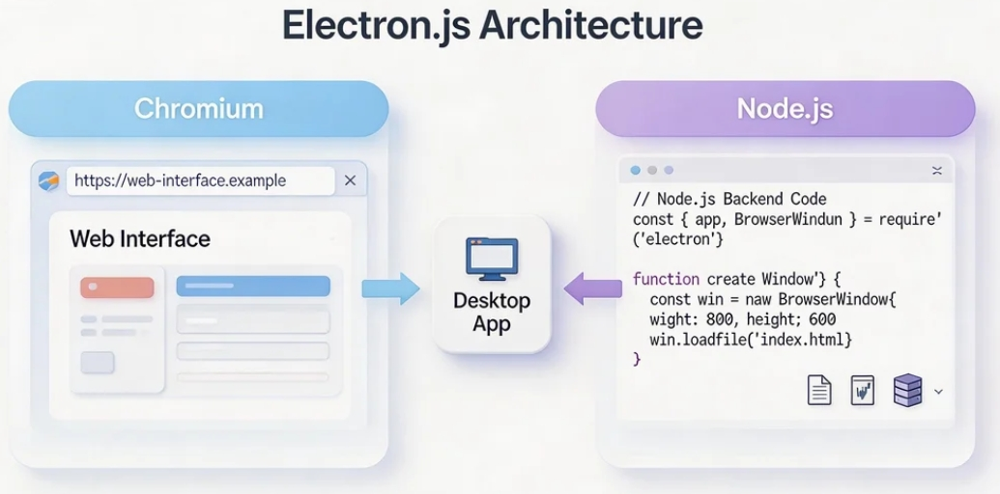
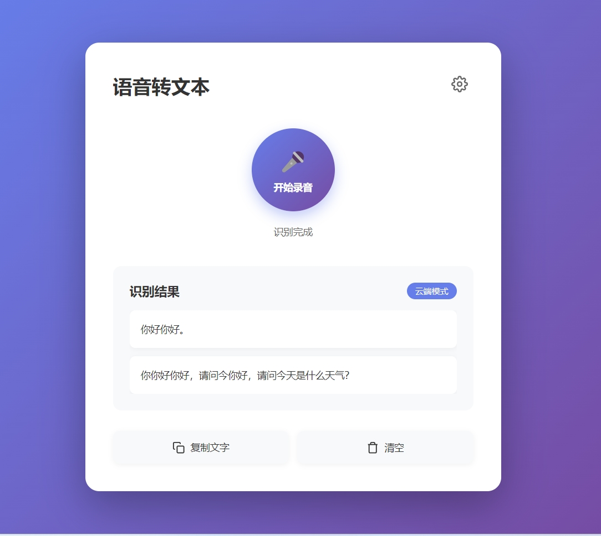
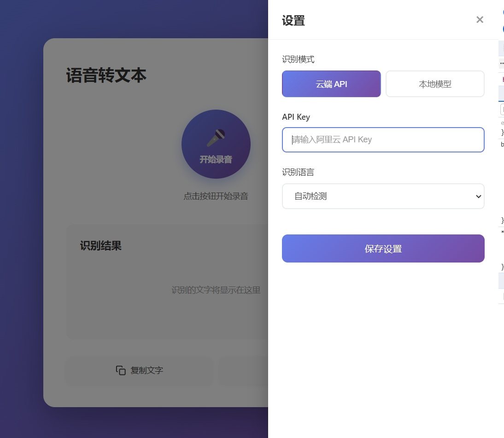

# クロスプラットフォームElectronデスクトップアプリの作り方：音声テキスト変換アプリケーション

# 第1章：Electronとデスクトップアプリ開発とは

このチュートリアルでは、完全なクローズドループを完成させます：Electronで音声テキスト変換デスクトップアプリをゼロから構築し、クラウドAPIとローカルモデル認識モードの両方をサポートし、最終的にWindows、macOS、Linuxでインストール・実行可能な本物のデスクトップアプリケーションにパッケージ化します。

このチュートリアルにあたり、少なくとも以下を用意してください：

- コンピュータ（WindowsまたはMac、Apple Siliconではローカルモデルが非常に高速に動作するためMac推奨）
- Node.js環境（バージョン18.0以上）
- AIコーディングアシスタント（Cursor / Trae / Claude Code）
- （オプション）OpenAI API Key（クラウドモードを使用する場合）
- マイクロフォン（ノートPC内蔵マイクで可）

## 1.1 Electronとは

日常的に使用している**VS Code、Slack、Discord、Notion**などのアプリに共通点があります：すべて**Electron**で構築されたデスクトップアプリケーションです。

Electronは、**HTML + CSS + JavaScript**（Webページと同じ技術スタック）を使用して、**Windows、macOS、Linux**で動作するデスクトップアプリを構築できるオープンソースフレームワークです。その原理はシンプルです：ChromiumとNode.jsを一緒にパッケージ化し、Webページがスタンドアロンのデスクトップアプリになります。

**一文で理解**：Electron = 「見えないChromeブラウザ」 + Node.jsシステム機能。

<!--  -->

## 1.2 Electronのコアアーキテクチャ

Electronアプリは2種類のプロセスで構成されています。これらを理解することが開発の鍵です：

**メインプロセス**

* アプリの「総責任者」
* ウィンドウの作成、アプリライフサイクルの管理、ファイルシステムなどのネイティブ機能へのアクセスを担当
* Node.js環境で実行され、すべてのNode.jsモジュールを使用可能
* アプリごとに1つのメインプロセスのみ

**レンダラープロセス**

* アプリの「顔」
* 本質的にはChromiumのWebページで、UIレンダリングを担当
* 各ウィンドウに1つのレンダラープロセスが対応
* セキュリティ上の理由から、レンダラープロセスはNode.js APIに直接アクセス不可

**プリロードスクリプト**

* メインプロセスとレンダラープロセス間の「橋渡し」
* `contextBridge`を使用して、選択されたAPIをレンダラープロセスに安全に公開

これらは**IPC（プロセス間通信）**を通じて通信します。電話をかけるようなものです：レンダラーが「録音を開始したい」と言い、メインプロセスがそのリクエストを受けてシステムマイクを呼び出します。

<!--  -->

## 1.3 何を作るのか

このチュートリアルでは、**音声テキスト変換**デスクトップアプリを構築します。機能はシンプルです：

1. 「録音開始」ボタンをクリックすると、アプリがマイクのリスニングを開始
2. 話し終えたら「停止」をクリックし、アプリが音声をAIに送信して認識
3. 認識されたテキストがUIに表示され、ワンクリックでコピー可能

**2つの認識モードが利用可能：**

| 比較項目 | クラウドAPIモード | ローカルモデルモード |
|---------|-------------|------------|
| 代表的なソリューション | OpenAI Whisper API | whisper.cpp |
| インターネット要件 | 必要 | 不要 |
| 認識速度 | ネットワーク依存 | ハードウェア依存（Apple Siliconでは非常に高速） |
| 日本語認識品質 | 優秀 | 優秀（large-v3モデル） |
| コスト | $0.006/分 | 無料 |
| モデルサイズ | ダウンロード不要 | tinyモデル75MB、largeモデル3GB |
| 最適な用途 | クイックスタート、軽量使用 | プライバシー重視、オフライン使用、長期高頻度使用 |

<!--  -->

## 1.4 重要な注意：Web Speech APIはElectronで使用不可

「Electron音声認識」で検索した場合、ブラウザ内蔵の`Web Speech API`を使用する推奨を見たことがあるかもしれません。**注意：これはElectronでは動作しません。**

GoogleはChrome/Edge以外のブラウザシェルに対する音声APIサポートを終了しました。ElectronはChromiumベースですが、Chromeそのものではないため、`window.SpeechRecognition`は直接失敗します。

そのため、OpenAI Whisper APIやwhisper.cppなどの独立したソリューションが必要なのです。

## 1.5 チュートリアルのロードマップ

以下のステップで完全なフローを完了します：

1. **Electronプロジェクトの作成**：Electron Forgeを使用してプロジェクトをスキャフォールドし、プロセス間通信を理解
2. **録音の実装**：レンダラープロセスでマイク入力をキャプチャし、オーディオデータを処理
3. **クラウド認識（オプションA）**：OpenAI Whisper APIを使用した音声テキスト変換
4. **ローカル認識（オプションB）**：インターネットなしでwhisper.cppをローカル使用
5. **パッケージングと配布**：アプリをインストール可能なデスクトッププログラムにパッケージ化

# 第2章：Electronプロジェクトの作成

## 2.1 AIでプロジェクトを初期化

AIコーディングアシスタントを開き、このプロンプトを入力：

```
Please help me create a new Electron project with Electron Forge using the Vite template.
The project name is voice-to-text.
Please run: npx create-electron-app voice-to-text --template=vite
After creation, enter the project directory and install dependencies.
```

Electron Forgeは、Electron公式推奨のスキャフォールドツールです。プロジェクトの初期化、パッケージング、配布などの面倒なセットアップを支援します。

作成後、プロジェクト構造は概ね以下のようになります：

```text
voice-to-text/
├── src/
│   ├── main.js            # メインプロセスエントリ
│   ├── preload.js         # プリロードスクリプト（橋渡し）
│   ├── renderer.js        # レンダラープロセスエントリ
│   └── index.html         # アプリHTMLページ
├── forge.config.js        # Electron Forge設定
├── vite.main.config.mjs   # メインプロセスVite設定
├── vite.preload.config.mjs # プリロードスクリプトVite設定
├── vite.renderer.config.mjs # レンダラープロセスVite設定
└── package.json
```

## 2.2 起動とプレビュー

AIに開発サーバーの起動を依頼：

```
Please help me start the Electron development server by running npm start
```

数秒後、デスクトップウィンドウが表示されます。これがあなたのElectronアプリです。今はまだデフォルトのウェルカムページしか表示されていませんが、すでに本物のデスクトッププログラムです。

<!--  -->

## 2.3 IPC（プロセス間通信）の理解

音声機能を実装する前に、Electronの最も重要な概念を理解する必要があります：**IPC（プロセス間通信）**。

レンダラープロセス（UI）とメインプロセス（システム機能）は分離されているため、IPC「電話」を使用して協力する必要があります：

```text
レンダラープロセス (UI)                 メインプロセス (システム)
    │                                │
    │── 「録音を開始したい」 ──────────→   │
    │                                │── マイクを呼び出す
    │                                │── オーディオを処理
    │   ←──── 「結果はこれ」 ─────────────│
    │                                │
    │── UIにテキストを表示           │
```

コードでは、この通信は`preload.js`を介して橋渡しされます：

```javascript
// preload.js - レンダラープロセスにAPIを安全に公開
const { contextBridge, ipcRenderer } = require('electron')

contextBridge.exposeInMainWorld('electronAPI', {
  // レンダラー -> メイン
  sendAudio: (audioData) => ipcRenderer.invoke('transcribe-audio', audioData),
  // メイン -> レンダラー
  onResult: (callback) => ipcRenderer.on('transcription-result', callback)
})
```

```javascript
// main.js - メインプロセスがメッセージをリッスン
const { ipcMain } = require('electron')

ipcMain.handle('transcribe-audio', async (event, audioData) => {
  // ここでWhisper APIまたはwhisper.cppを呼び出す
  const text = await transcribe(audioData)
  return text
})
```

<!--  -->

# 第3章：録音の実装

## 3.1 レンダラープロセスでマイク入力をキャプチャ

ブラウザ（つまりElectronレンダラープロセス）は、マイクへのアクセスに`navigator.mediaDevices.getUserMedia`を提供します。AIに録音の実装を依頼：

```
Please help me modify src/index.html and src/renderer.js to implement:

UI:
1. 大きな丸い「録音開始」ボタン。クリックすると赤い「録音停止」ボタンに変わる
2. 録音中はシンプルなパルスアニメーションを表示
3. 下部に認識結果を表示するテキスト表示エリア
4. 下部に2つのボタン：「テキストをコピー」と「クリア」
5. 右上に設定アイコン：認識モード切替（クラウド/ローカル）

録音ロジック（renderer.js内）：
1. ボタンクリック時、navigator.mediaDevices.getUserMediaでマイクアクセスを要求
2. MediaRecorderを使用してwebm形式でオーディオを録音
3. 停止後、オーディオBlobをArrayBufferに変換
4. window.electronAPI.sendAudioでメインプロセスに送信
5. メインプロセスからの認識結果を待ち、表示
```

核心的な録音コード：

```javascript
// renderer.js
let mediaRecorder = null
let audioChunks = []

async function startRecording() {
  const stream = await navigator.mediaDevices.getUserMedia({
    audio: {
      channelCount: 1,
      sampleRate: 16000,
      echoCancellation: true,
      noiseSuppression: true
    }
  })

  mediaRecorder = new MediaRecorder(stream, {
    mimeType: 'audio/webm;codecs=opus'
  })

  audioChunks = []
  mediaRecorder.ondataavailable = (e) => audioChunks.push(e.data)

  mediaRecorder.onstop = async () => {
    const audioBlob = new Blob(audioChunks, { type: 'audio/webm' })
    const arrayBuffer = await audioBlob.arrayBuffer()

    // メインプロセスに文字起こしのために送信
    const result = await window.electronAPI.sendAudio(arrayBuffer)
    document.getElementById('result').textContent = result
  }

  mediaRecorder.start()
}
```

<!--  -->

## 3.2 マイク権限の処理

Electronはデフォルトで権限要求をブロックします。メインプロセスでマイクアクセスを明示的に許可する必要があります：

```
Please help me add microphone permission handling in main.js:
1. Use session.defaultSession.setPermissionRequestHandler to handle permission requests
2. Auto-allow when request type is 'media'
3. For macOS, ensure microphone usage description is declared in package.json or entitlements
```

```javascript
// main.jsに追加
const { session } = require('electron')

session.defaultSession.setPermissionRequestHandler(
  (webContents, permission, callback) => {
    if (permission === 'media') {
      callback(true)
    } else {
      callback(false)
    }
  }
)
```

> **macOSユーザーへの注意**：macOSはシステムレベルのマイク権限ダイアログを表示します。これは正常です。「許可」をクリックしてください。

# 第4章：オプションA - クラウド認識（OpenAI Whisper API）

これが最もシンプルなオプションです。APIキーと数行のコードだけで済みます。

## 4.1 OpenAI APIキーの取得

1. [OpenAI Platform](https://platform.openai.com/)にアクセスし、サインアップしてログイン
2. API Keysページに移動し、**「Create new secret key」**をクリック
3. 生成されたキー（`sk-`で始まる）をコピーし、安全に保管

> **コスト参考**：Whisper APIは**$0.006/分**です。つまり1時間のオーディオ認識はわずか$0.36で、非常に手頃です。

## 4.2 メインプロセスでWhisper APIを呼び出す

AIにメインプロセスでの音声認識の実装を依頼：

```
Please help me implement OpenAI Whisper API in main.js:
1. Install node-fetch (if needed) or use built-in fetch in Node.js
2. Create transcribeWithWhisper function that accepts audio ArrayBuffer
3. Convert ArrayBuffer to Blob/File and build FormData
4. Call https://api.openai.com/v1/audio/transcriptions
5. Use model whisper-1 and set language to zh (Chinese)
6. Return the recognized text
7. Read API key from environment variables or config file
```

核心コード：

```javascript
// main.js
async function transcribeWithWhisper(audioBuffer, apiKey) {
  const blob = new Blob([audioBuffer], { type: 'audio/webm' })
  const formData = new FormData()
  formData.append('file', blob, 'audio.webm')
  formData.append('model', 'whisper-1')
  formData.append('language', 'zh')

  const response = await fetch(
    'https://api.openai.com/v1/audio/transcriptions',
    {
      method: 'POST',
      headers: { Authorization: `Bearer ${apiKey}` },
      body: formData
    }
  )

  const data = await response.json()
  return data.text
}
```

<!--  -->

## 4.3 設定UIの追加

AIにレンダラープロセスにシンプルな設定パネルを追加して、APIキーの入力と認識モードの切り替えを依頼：

```
Please help me add a settings panel in index.html:
1. 右上に歯車アイコンを追加。クリックで設定パネルを展開
2. パネルには以下を含む：
   - 認識モード切替（クラウドAPI / ローカルモデル）
   - API Key入力（クラウドモード時のみ表示）
   - 言語ドロップダウン（日本語 / 英語 / 自動検出）
3. 設定をlocalStorageに保存
4. 外部をクリックでパネルを閉じる
```

<!--  -->

# 第5章：オプションB - ローカル認識（whisper.cpp）

クラウドAPIに依存したくない場合や、オフライン使用が必要な場合、whisper.cppが最適です。OpenAI WhisperモデルのC++移植版で、インターネットなしで完全にローカルで動作します。

## 5.1 whisper.cpp Node.jsバインディングのインストール

AIにインストールと設定を依頼：

```
Please help me install nodejs-whisper in the project:
npm install nodejs-whisper

After installation, please help me download the whisper tiny model (small size, fast for testing).
nodejs-whisper will handle model download automatically.
```

> **モデル選択ガイド**：
> * `tiny`（75MB）：最速、テストと軽量使用に適している、精度は平均的
> * `base`（142MB）：速度と精度のバランス
> * `small`（466MB）：日本語認識品質が明確に向上
> * `large-v3-turbo`（1.5GB）：推奨；largeより5-8倍高速で、精度はわずか1-2%低下のみ
> * `large-v3`（3GB）：最高精度、ただし遅く、より良いハードウェアが必要

## 5.2 メインプロセスにwhisper.cppを統合

AIにローカル認識の実装を依頼：

```
Please help me add whisper.cpp local recognition in main.js:
1. Import nodejs-whisper
2. Create transcribeWithLocal function
3. Accept audio ArrayBuffer and save it as a temporary WAV file first (16kHz mono)
4. Call nodejs-whisper for recognition
5. Return recognized text
6. Delete temporary file after recognition
```

核心コード：

```javascript
// main.js
const { nodewhisper } = require('nodejs-whisper')
const path = require('path')
const fs = require('fs')
const os = require('os')

async function transcribeWithLocal(audioBuffer) {
  // 一時ファイルとして保存
  const tempPath = path.join(os.tmpdir(), `recording-${Date.now()}.wav`)
  fs.writeFileSync(tempPath, Buffer.from(audioBuffer))

  try {
    const result = await nodewhisper(tempPath, {
      modelName: 'base',
      autoDownloadModelName: 'base',
      whisperOptions: {
        language: 'zh',
        word_timestamps: true
      }
    })
    return result.map(r => r.speech).join('')
  } finally {
    // 一時ファイルをクリーンアップ
    fs.unlinkSync(tempPath)
  }
}
```

<!--  -->

## 5.3 Apple Siliconユーザーへの良いニュース

M1/M2/M3/M4 Macを使用している場合、whisper.cppは自動的に**Metal GPUアクセラレーション**と**Apple Neural Engine**を使用できます。認識は**リアルタイムより高速**に実行でき、1分のオーディオの処理にわずか数秒しかかからない場合があります。

NVIDIA GPUユーザーの場合、whisper.cppは**CUDAアクセラレーション**もサポートしており、強力なパフォーマンスを提供します。

# 第6章：パッケージングと配布

開発が完了したら、アプリを配布可能なインストーラーにパッケージ化する必要があります。

## 6.1 Electron Forgeでパッケージング

Electron Forgeはプロジェクトに既に含まれているため、パッケージングはシンプルです：

```
Please help me run the Electron Forge packaging command:
npx electron-forge make
```

このコマンドは現在のオペレーティングシステム向けのインストーラーを自動生成します：

* **macOS**：`.dmg`インストーラーイメージと`.zip`アーカイブ
* **Windows**：`.exe`インストーラー（Squirrel形式）
* **Linux**：`.deb`（Debian/Ubuntu）と`.rpm`（Fedora）パッケージ

ビルド出力は`out/make/`ディレクトリにあります。

<!--  -->

## 6.2 アプリサイズの最適化

Electronアプリの「痛点」の1つは大きなパッケージサイズです（Chromiumがバンドルされているため）。最適化の提案：

* `dependencies`のパッケージのみがバンドルされ、開発依存関係は`devDependencies`に保持
* Viteのツリーシェイキングを使用してJavaScriptサイズを削減
* ローカルモデルを使用する場合、インストーラーにバンドルするのではなく、初回起動時にモデルをダウンロードすることを検討

| 設定 | 推定サイズ |
|------|---------|
| 純粋なElectronアプリ（モデルなし） | ~150-200 MB |
| + whisper tinyモデル | ~250 MB |
| + whisper large-v3-turboモデル | ~1.7 GB |

## 6.3 クロスプラットフォームの注意事項

**macOS：**
* App Storeへの公開や他者への配布には**コード署名**が必要（Apple Developer ID、$99/年）
* Appleの**公証**プロセスも必要
* マイク権限には`Info.plist`で`NSMicrophoneUsageDescription`の宣言が必要
* IntelとApple Siliconの両方をサポートするUniversal Binaryのビルドを推奨

**Windows：**
* コード署名を推奨、そうでない場合Windows SmartScreenがセキュリティ警告を表示
* 未署名アプリでも「とにかく実行」を選択可能

**Linux：**
* コード署名不要
* `.deb`と`.AppImage`形式の両方を提供することを推奨

> **ヒント**：個人プロジェクトや小規模配布の場合、コード署名を一時的にスキップし、パッケージ化されたファイルを直接友人と共有できます。

# 第7章：まとめ

おめでとうございます！ゼロからクロスプラットフォーム音声テキスト変換デスクトップアプリを構築しました。振り返りましょう：

1. Electron Forgeを使用してクロスプラットフォームデスクトップアプリをスキャフォールド
2. メインプロセス、レンダラープロセス、IPC通信を理解
3. マイク録音とオーディオキャプチャを実装
4. 2つの音声認識オプションを統合：クラウドWhisper APIとローカルwhisper.cpp
5. Electronアプリのパッケージングと配布方法を学習

Electronの強力な点は、Web技術スタックでVS CodeやSlackレベルのデスクトップアプリを構築できることです。そして成熟したAI音声認識により、かつては専門チームが必要だった音声テキスト変換のような機能を、1人で構築できるようになりました。

**応用方向：**

* **リアルタイム字幕**：AudioWorkletを使用したストリーミングオーディオと、ストリーミング認識APIとの組み合わせでライブ文字起こし
* **会議アシスタント**：会議全体を録音、タイムスタンプ付き文字起こしを自動生成し、AIで要点を要約
* **多言語翻訳**：音声を文字起こしし、翻訳APIを呼び出してリアルタイム言語変換
* **音声ノートブック**：ローカルデータベース（SQLiteなど）と組み合わせて、検索可能な音声メモを構築

***あなたの声で、コードにすべてを記録させましょう。***

# 参考文献

* [Electron Official Docs](https://www.electronjs.org/docs/latest/)
* [Electron Forge Official Docs](https://www.electronforge.io/)
* [OpenAI Whisper API Docs](https://platform.openai.com/docs/guides/speech-to-text)
* [whisper.cpp GitHub Repository](https://github.com/ggml-org/whisper.cpp)
* [nodejs-whisper npm Package](https://www.npmjs.com/package/nodejs-whisper)
* [MDN MediaDevices.getUserMedia()](https://developer.mozilla.org/en-US/docs/Web/API/MediaDevices/getUserMedia)
