# iOS アプリの構築方法 - ネイティブ SwiftUI 開発

## 第1章：iOS アプリと iOS アプリ開発とは

このチュートリアルでは、完全なクローズドループを完了します：**あなたの頭の中のアイデアから、iPhone に正常にインストールして実行できる実際の iOS アプリまで。**

このチュートリアルでは、少なくとも以下が必要です：

1. 比較的新しい macOS を実行している Mac
2. 比較的新しい iOS バージョンを実行し、開発者モードが有効な iPhone
3. Xcode が正常にインストールされていること
4. Trae がインストールされて開いていること
5. 使用可能な Apple ID

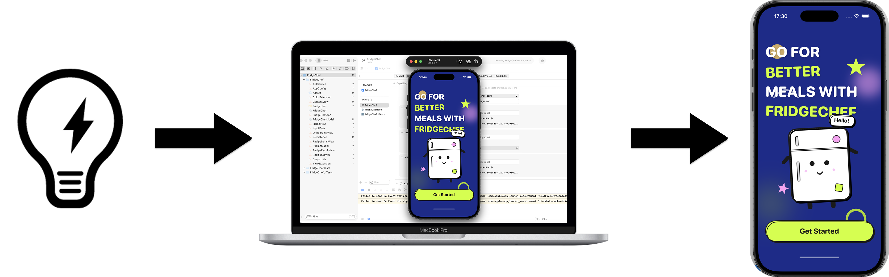

### 1.1 iOS アプリ

iOS アプリは、iPhone オペレーティングシステム上で実行されるネイティブアプリケーションです。素早く起動し、スムーズに動作し、通知、カメラ、ローカルストレージなどのシステム機能を深く活用できます。


### 1.2 iOS アプリ開発

核心的には、iOS アプリの構築はいくつかのことしか含みません：

1. アプリが解決する問題を明確にする
2. ユーザーが見て操作できるインターフェースを設計する
3. 異なるアクションでのアプリの動作を定義する
4. アプリを正しくビルドして iPhone にインストールする

### 1.3 iOS アプリ構築の一般的な方法

実際の開発では、iOS アプリを構築する方法は1つではありません。ここでは深く掘り下げず、全体的な理解のみを提供します。

最初の方法は Apple の公式ネイティブアプローチです：Xcode でプロジェクトを作成し、Swift と SwiftUI を使用してインターフェースとロジックを構築します。


2番目の方法は、React Native や Flutter などのクロスプラットフォームフレームワークを使用し、1つのコードベースを複数のプラットフォームに適応させます。


上記のアプローチに基づき、このチュートリアルは選択します：**ネイティブ SwiftUI 開発を基盤とし、AI ツールがコーディング作業の大部分を担当します。**


### 1.4 このチュートリアルでカバーする iOS アプリ開発ステップ（概要プレビュー）

このチュートリアルで使用するサンプルアプリは **FridgeChef** です。

ユーザーが冷蔵庫にある食材を入力すると、アプリが実際の AI API を使用して実現可能なレシピを生成し、結果をローカルに保存して後で確認できます。この例は、UI 入力と表示、ネットワークリクエスト、データ解析、ローカルストレージ、実機での最終インストールと実行を含む、実際の iOS アプリケーションの核心部分を完全にカバーしています。

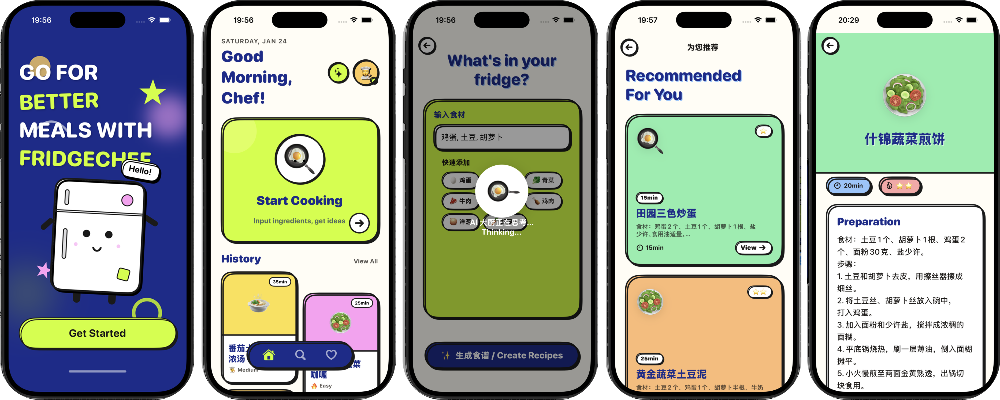

- プロトタイプからネイティブアプリまでの全体的なアイデア

実装において、このチュートリアルは段階的アプローチを採用します。まず AI を使用して HTML と CSS でインターフェースプロトタイプを素早く生成し、ブラウザでレイアウト構造と情報階層を確認してから、SwiftUI に移行します。

- 全体的な開発フローのプレビュー

全体として、次の章は順番にこれらの段階を経ます：

1. 基本的な理解の構築
   iOS アプリの形態、一般的な開発方法、このサンプルアプリが解決する問題を理解する。
2. 環境設定の完了
   Mac と iPhone を準備し、システムを更新し、Xcode と Trae をインストールし、シミュレーターで正常に実行できる基本的な iOS プロジェクトを作成する。
3. 本格的な開発の開始
   Trae でプロジェクトを開き、AI との対話を通じて段階的に UI と基本的なインタラクションを生成し、アプリを空の殻から使えるものに変える。
4. デバッグと整理
   コンパイルエラーが現れたり、動作が期待と一致しない場合、AI にトラブルシューティングを手伝わせる。構造が乱雑になったら、AI を使ってリファクタリングして簡素化する。
5. 実機での実行
   署名を設定し、実 iPhone にアプリをインストールし、コードからハードウェアまで1回の完全な検証を完了する。

## 第2章：開発環境の準備

### 2.1 必要なデバイスとシステム

この実習では、2つのハードウェアが代替不可能です：Mac と iPhone。
同時に、両デバイスは**比較的新しい公式システムバージョン**を実行している必要があります。

#### 2.1.1 Mac

iOS アプリは macOS でのみ開発およびコンパイルできます。これは Apple プラットフォームのハード要件です。

Xcode が正常にインストールおよび使用できるように、まず macOS を比較的新しい公式バージョンに更新することをお勧めします。**システム設定 -> 一般 -> ソフトウェアアップデート**から確認および更新できます。

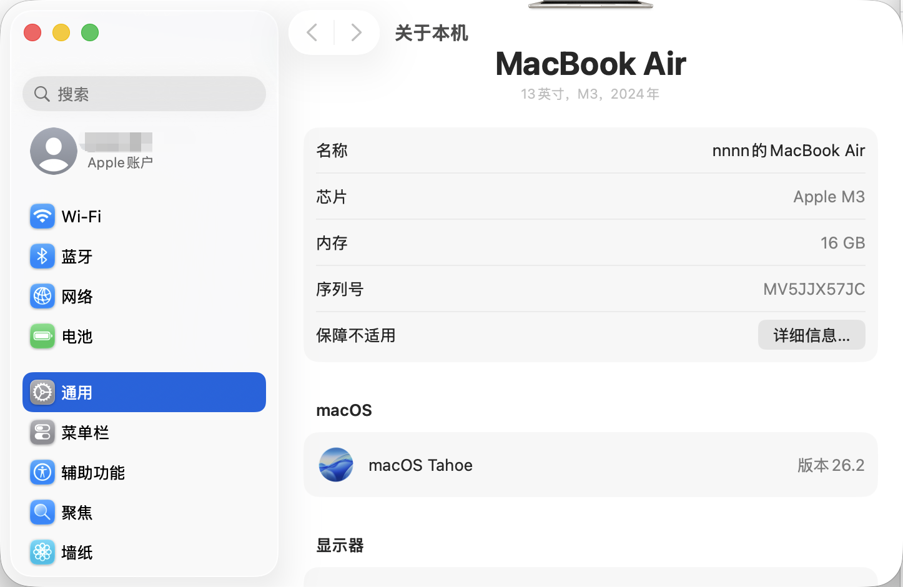

#### 2.1.2 実際の iPhone デバイス

Mac に加えて、このチュートリアルでは実際の iPhone が必要です。アプリが正しくインストールおよび起動できるかを確認するためです。

デバッグプロセスをスムーズに保つため、iPhone も比較的新しい iOS バージョンを実行している必要があります。**設定 -> 一般 -> ソフトウェアアップデート**から確認および更新できます。

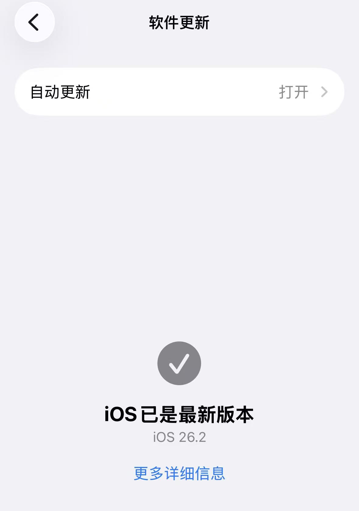

開発の後半では、この iPhone が実機デバッグのためにケーブルで Mac に接続されます。

#### 2.1.3 iPhone で開発者モードを有効にする

Xcode から実機にデバッグアプリをインストールして実行するには、iPhone で開発者モードを有効にする必要があります。

手順：

1. **設定**を開く
2. **プライバシーとセキュリティ**に入る
3. 一番下までスクロールして**開発者モード**を見つける
4. オンにし、指示に従ってデバイスを再起動
5. 再起動後、デバイスのロックを解除し、開発者モードの有効化を確認

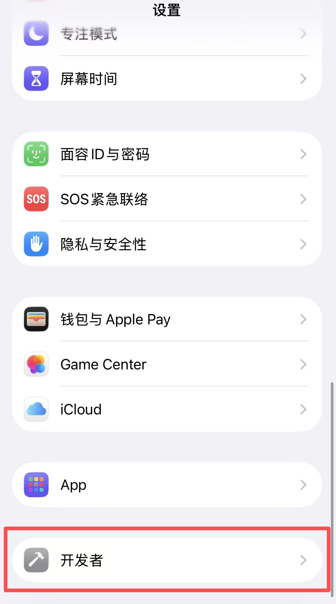

iPhone が以前に Xcode や他の開発ツールに接続されたことがない場合、**プライバシーとセキュリティ**の下に**開発者モード**が表示されないことがあります。これはシステムの問題ではなく、開発者モードがまだトリガーされていないことを意味します。

その場合は、次の手順で表示させることができます：

1. **設定 -> プライバシーとセキュリティ -> 分析と改善**を開く
2. **App 開発者と共有**をオンにする
3. 1つ前のレベルに戻り、**プライバシーとセキュリティ**に再び入り、一番下までスクロール
4. 今度は**開発者モード**が表示されるはずです。有効にしてデバイスを再起動

上記の手順を完了すると、開発者モードは1度だけ有効にすれば済みます。今後の Xcode を使用した実機デバッグでこの設定を繰り返す必要はありません。

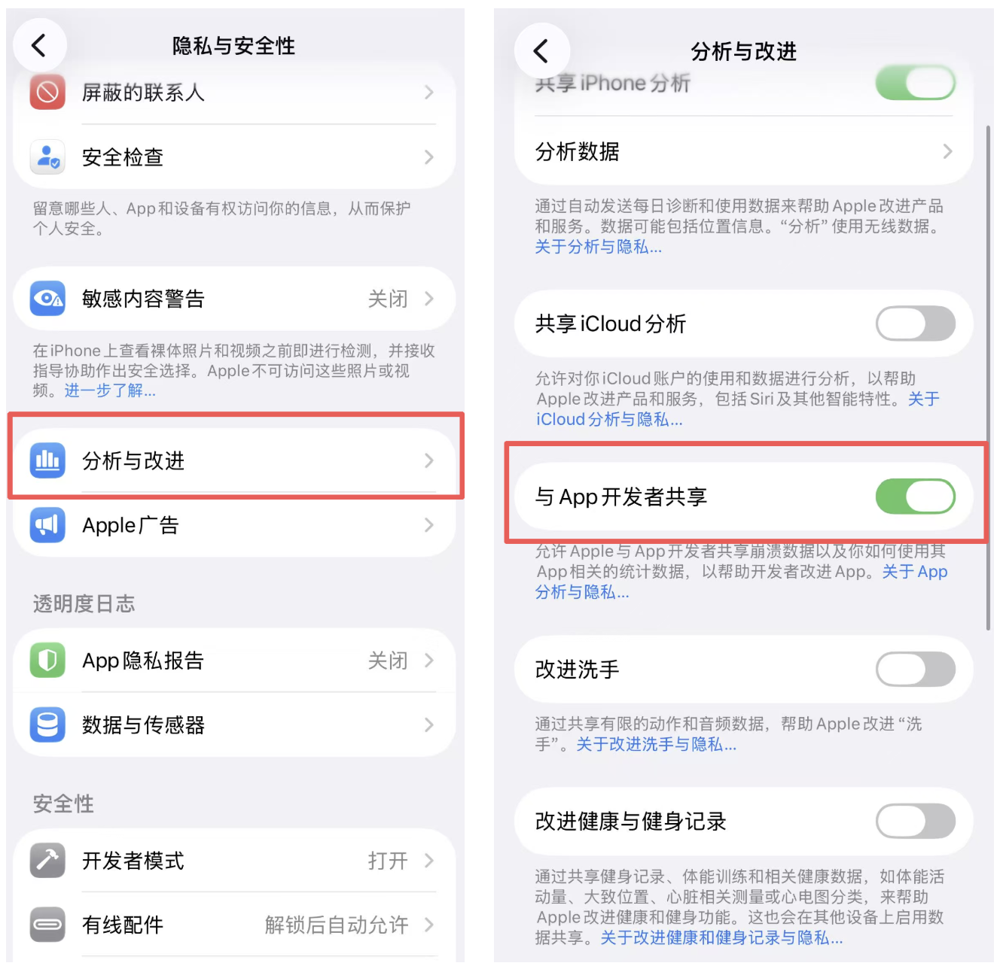

### 2.2 必要なソフトウェア

デバイスとシステムの準備ができた後も、開発に使用するソフトウェアをインストールする必要があります。このチュートリアルは2つのカテゴリのツールのみを使用します：公式 iOS 開発ツールと AI 支援開発ツールです。

#### 2.2.1 Xcode

Xcode は Apple の公式 iOS 開発ツールです。このチュートリアルでは主に、iOS プロジェクトの作成、Swift / SwiftUI コードのコンパイル、シミュレーターまたは実機でのアプリ実行に使用されます。


Xcode は App Store から直接見つけてインストールできます。インストール後、初めて開くとウェルカム画面が表示されます。以降のプロジェクト作成はそこから始まります。

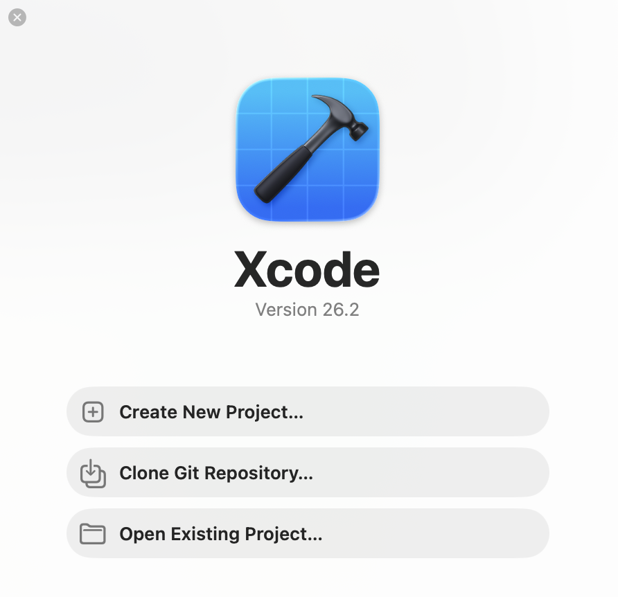

#### 2.2.2 Trae

Trae はこのチュートリアルで開発作業が行われる主要な環境です。iOS プロジェクト全体を Trae に配置し、AI との対話を通じて開発を完了します。

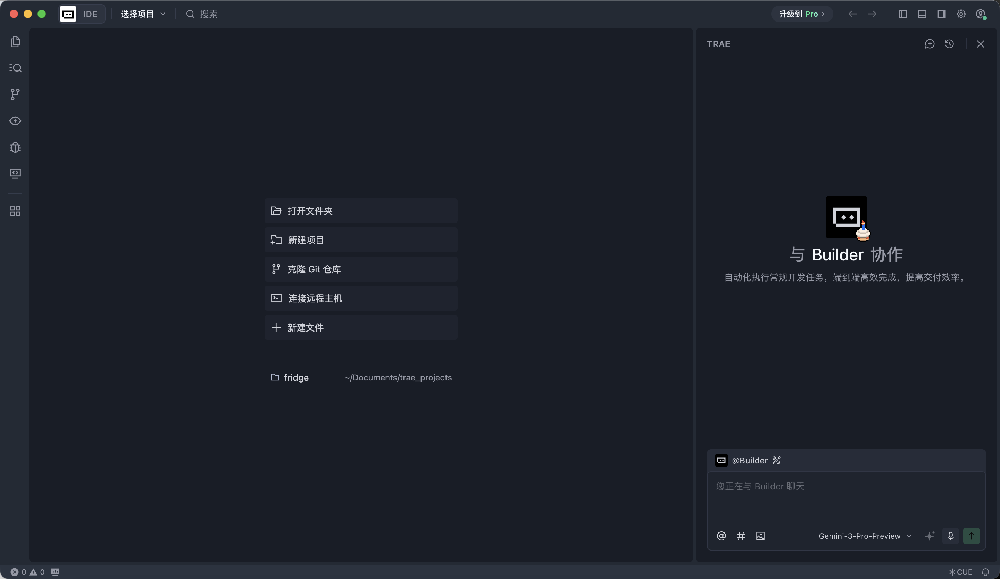

### 2.3 Apple ID と開発デバッグの注意事項

iOS プラットフォームでは、アプリを実際のデバイスにインストールするには、開発者署名を経る必要があります。このチュートリアルでは Apple Developer Program のメンバーシップに料金を支払う必要はありません。個人の Apple ID で十分です。

### 2.4 次に進む前のチェックリスト

次の章に入る前に、現在の状態を以下のチェックリストと比較できます。

すでに以下を持っている必要があります：

1. 比較的新しい macOS を実行している Mac
2. 比較的新しい iOS バージョンを実行し、開発者モードが有効な iPhone
3. Xcode が正常にインストールされていること
4. Trae がインストールされて開いていること
5. 使用可能な Apple ID

すべて準備ができていれば、続けて最初の iOS アプリを作成できます。

## 第3章：最初の iOS プロジェクトの作成

### 3.1 Xcode を使用して新規プロジェクトを作成

Xcode を開きます。ウェルカム画面で、新規プロジェクトの作成を選択します。


**Create new project** をクリックして、プロジェクトテンプレート選択画面に入ります。

### 3.2 アプリテンプレートと技術スタックの選択

テンプレート選択画面で、以下の設定を使用します：

1. プラットフォーム：iOS
2. アプリケーションタイプ：App

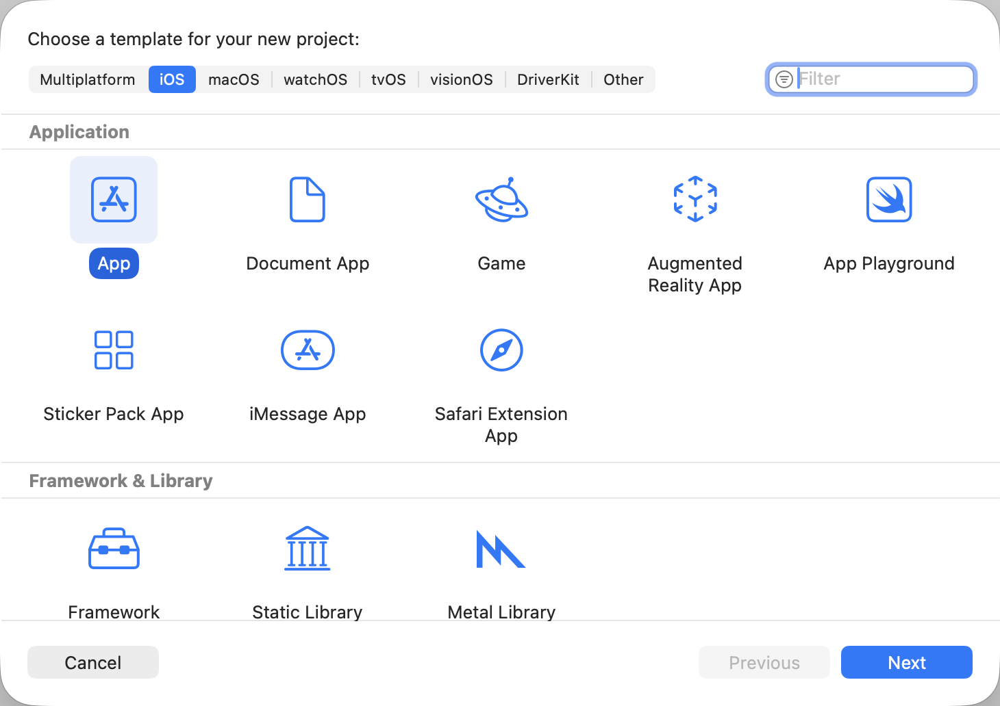

**Next** をクリックして、プロジェクト情報設定画面に入ります。

### 3.3 プロジェクト情報の設定

プロジェクト情報画面で、基本設定のみ入力します：

1. 製品名：アプリ名（例：`FridgeChef`）
2. チーム：個人の Apple ID を選択
3. 組織識別子：逆ドメイン形式（例：`com.example`）
4. Bundle Identifier：自動生成、デフォルトのまま
5. テストシステム：Swift Testing with XCTest UI Tests
6. ストレージ：Core Data を選択（後でレシピ履歴を保存するため）
7. その他のオプションはデフォルトのまま


**Next** をクリックし、プロジェクトの保存場所を選択します。


### 3.4 作成後のプロジェクト構造の認識

プロジェクトが作成されると、Xcode が自動的にワークスペースを開きます。この時点では、すべてのファイルを理解する必要はありません。いくつかの主要部分を認識するだけで十分です。

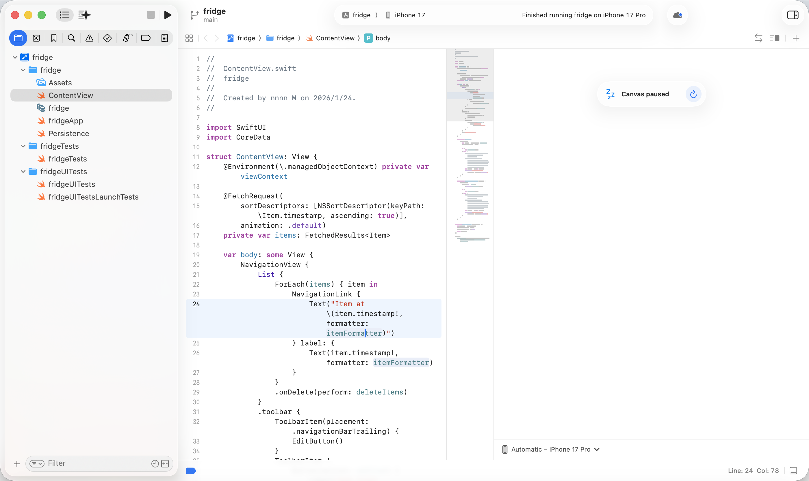

デフォルトプロジェクトでは、以下が表示されます：

- プロジェクト名の付いたフォルダー
- `App` で終わる Swift ファイル（アプリケーションのエントリーポイント）
- `ContentView.swift` ファイル（デフォルトページ）

これはすでに実行可能な最小の iOS アプリです。

### 3.5 最初の iOS アプリの実行

コードを変更する前に、元のプロジェクトを直接実行します。

Xcode の上部ツールバーで、デフォルトの iPhone シミュレーターが選択されたままにし、左上の **Run** ボタンをクリックします。

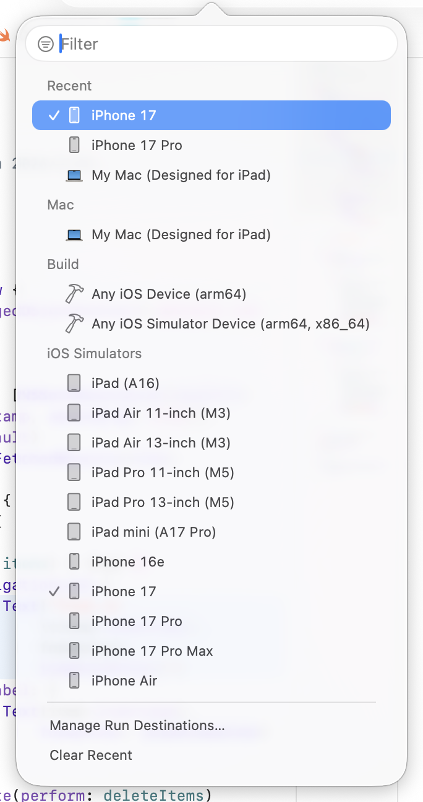

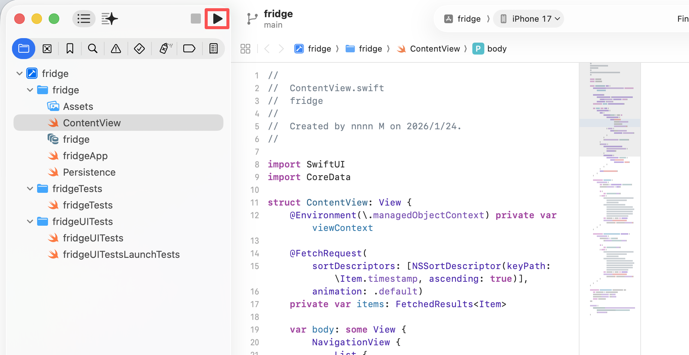

すべてが正常であれば、シミュレーターに正常に起動できる空のアプリが表示されます。最初のコンパイルは比較的長い時間がかかる場合があります。以降の章では、まず HTML プロトタイプを使用して待ち時間を短縮します。


アプリを停止するには、Run ボタンの横の **Stop** をクリックします。

### 3.6 この段階で実際に達成したこと

インターフェースはまだシンプルですが、いくつかの主要な確認を完了しています：

1. プロジェクトが正常にコンパイルできる
2. シミュレーターがアプリを正しく実行できる
3. 開発プロセスがエンドツーエンドで機能することが証明された

これは、今後の問題が主に**コードとロジック自体**に集中することを意味し、環境の問題ではありません。

### 3.7 プロジェクトを Trae に引き渡す

次のセクションから、主要な開発作業が徐々に Trae に移行します。

必要なことはシンプルです：**作成したばかりの iOS プロジェクトフォルダーを Trae で開きます。**


## 第4章：AI 支援開発の実践 - FridgeChef をゼロから構築

この章はチュートリアル全体の核心部分です。

このチュートリアルは「まず SwiftUI を書き、繰り返しコンパイルし、プレビューを調整し続ける」という従来のルートを使用しません。代わりにより効率的なフローを使用します：
**まず \*\***HTML\***\* を使用してインターフェース構造を素早く検証し、確認された結果を SwiftUI に移行し、最後に段階的にビジネスロジック、ローカルデータ、インタラクションの詳細を完了します。**

### 4.1 ステージ1：要件の明確化

コードを書く前に、最初のステップはページを構築することではありません — 何を構築するかを明確にすることです。**AI にまず \*\***プロダクトマネージャー\***\* のように振る舞わせ、要件を構造化された仕様書に整理させます。**

Trae のチャットウィンドウに次の指示を入力します。Trae はプロジェクトルートに `REQUIREMENTS.md` ファイルを生成し、アプリ全体の機能と構造を説明します。

📋 **コピーするプロンプト：**

```text
これから「FridgeChef」という iOS アプリを開発します。

1. コアコンセプト
これは「冷蔵庫に残っている食材で何を料理すればいいかわからない」という問題を解決する AI アシスタントです。
ユーザーが現在持っている食材を入力すると、アプリが大規模モデルを呼び出して実用的なレシピを生成します。

2. コア機能
- ホームページ：
  目立つ「料理を始める」エントリーを表示し、その下に履歴レシピ記録をカードまたはリスト形式で表示。
- 入力ページ：
  ユーザーが食材を入力、テキスト入力またはシンプルなクイックタグをサポート。
- 結果ページ：
  AI 生成のレシピを表示、料理名、食材リスト、調理手順を含む。

3. 技術要件
- SwiftUI を使用
- データをローカルに保存（Core Data）
- 基本的なページナビゲーションと状態更新をサポート

プロダクトマネージャーの観点から、これを明確で構造化された REQUIREMENTS.md ドキュメントに整理し、プロジェクトルートに保存してください。
```

生成後、ドキュメントをざっと読み、機能ポイントが期待と一致するか確認します。


### 4.2 ステージ2：ビジュアルプロトタイプ

AI に **HTML\*\*** + \***\*CSS** を使用して高忠実度のインターフェースプロトタイプを素早く描かせ、全体のレイアウトとスタイルを先に確認します。Trae に引き続き入力します：

📋 **コピーするプロンプト：**

```text
要件が確認されました。
HTML + Tailwind CSS を使用して高忠実度のインターフェースプロトタイプを生成してください。

デザインスタイル：Neo-Pop
カラー：
- 背景：ライトクリーム #FFFDF5
- アクセントカラー：アシッドグリーン #CCFF00、ホットピンク

視覚的特徴：
- 3px の太い黒いボーダー
- ぼかしのないハードシャドウ（オフセット 4px）
- 大きな丸みを帯びたカード、全体的にステッカー / コミック感

レイアウト要件：
- ホームページは Bento Grid のようなレイアウトを使用
- 2つの画面を含む：ホームページと入力ページ

単一ファイルの index.html を生成し、コンテンツの周囲に iPhone 画面比率をシミュレートしてください。
```

生成後、ファイルリストで `index.html` を見つけ、ブラウザで直接開きます。

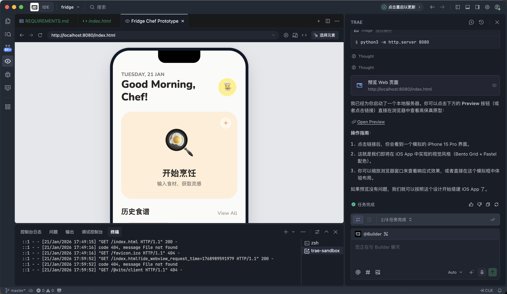

この段階で重要なのは、すべての詳細が完璧かどうかではありません。重要なのは、**ページ構造が合理的か、主要な要素が完全か、全体的な方向が正しいか**です。

### 4.3 ステージ3：ネイティブ再現

HTML プロトタイプが確定したら、**確認されたインターフェースを SwiftUI に変換します。**

手順：

1. `index.html` ファイル（またはブラウザのスクリーンショット）を Trae にアップロード
2. AI に基づいて SwiftUI コードを生成するように指示

📋 **コピーするプロンプト：**

```text
[index.html アップロード済み]

この HTML ファイルのレイアウトとスタイルを読んでください。

タスク：このインターフェースを現在のプロジェクトで SwiftUI を使用して再現してください。

要件：
1. 背景色、太いボーダー、ハードシャドウを含む NeoPopStyle modifier をカプセル化
2. ホームレイアウト用の HomeView.swift を作成
3. 入力ページ用の InputView.swift を作成
4. 今は Mock Data を使用し、Xcode Preview とシミュレーターで正しく表示されることを確認
```

完了後、Xcode を開きシミュレーターを実行します。完全な視覚構造を持つ iOS アプリが表示されます。

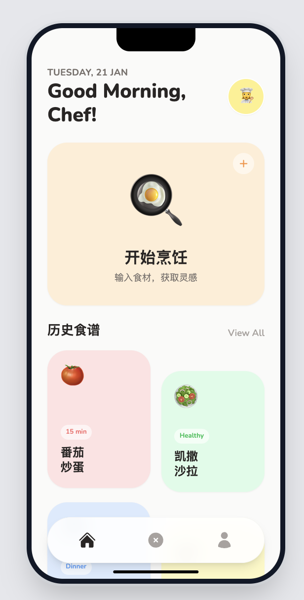

### 4.4 ステージ4：AI API の接続

インターフェースが完了すると、アプリはまだディスプレイ層にすぎません。次に実際の AI 機能を接続する必要があります。このチュートリアルでは **SiliconFlow** が提供する大規模モデルサービスを使用します：
[https://cloud.siliconflow.cn](https://cloud.siliconflow.cn/)


SiliconFlow は OpenAI API 仕様と互換性のある API を提供しているため、標準的なネットワークリクエストを使用して iOS プロジェクトから便利に呼び出すことができます。


開始する前に、サイトでアカウントを登録し API Key を作成する必要があります。


このキーは後続のモデル呼び出しに使用されます。

📋 **コピーするプロンプト：**

```text
AI 機能を接続する必要があります。

APIService.swift を作成してください。

設定：
- Base URL：https://api.siliconflow.cn/v1
- モデル：Qwen/Qwen2.5-7B-Instruct
- API Key：今は変数として定義しておいてください。後で記入します

機能：
- generateRecipe(ingredients: [String]) メソッドを書く
- System Prompt はモデルに純粋な JSON のみを返すよう厳格に要求する必要がある
- JSON フィールドは以下を含む必要がある：dishName, ingredients, steps

また、返されたデータを解析するための RecipeModel 構造体を定義してください。
```

コードが生成された後、`APIService.swift` に自分のキーを記入します。

### 4.5 ステージ5：Core Data ローカルストレージ

アプリが生成したレシピを記憶させるには、ローカルデータストレージを導入する必要があります。このステージは2つのステップに分かれています。

**ステップ1：Xcode で Core Data を手動設定**

1. `FridgeChef.xcdatamodeld` を開く
2. `RecipeEntity` という名前の新しい Entity を作成


3. 以下の属性を追加：
   1. `id`：**UUID**
   2. `name`：**String**
   3. `cookTime`：**String**
   4. `difficulty`：**String**
   5. `desc`：**String**
   6. `timestamp`：**Date**
   7. `colorIndex`：**Integer 16**

      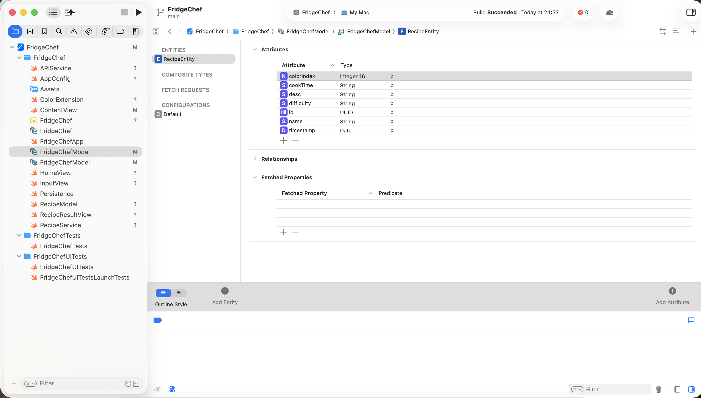

**ステップ2：AI にロジックコードを書かせる**

📋 **コピーするプロンプト：**

```text
Core Data Entity の設定が完了しました。

Entity：RecipeEntity
属性：id, name, difficulty, timestamp, colorindex, cookTime, desc

以下のタスクを完了してください：
1. レシピ生成が成功した後、データを Core Data に保存
2. ホームページで FetchRequest を使用して履歴レコードを読み取り、逆時系列順で表示
3. データベースが空の場合、フレンドリーな空状態メッセージを表示
```

### 4.6 ステージ6：アプリアイコンの生成

最後のステップはアプリに適切なアイコンを準備することです。ここでは **Lovart** を使用してアイコンアセットを生成します：[https://www.lovart.ai/zh](https://www.lovart.ai/zh)

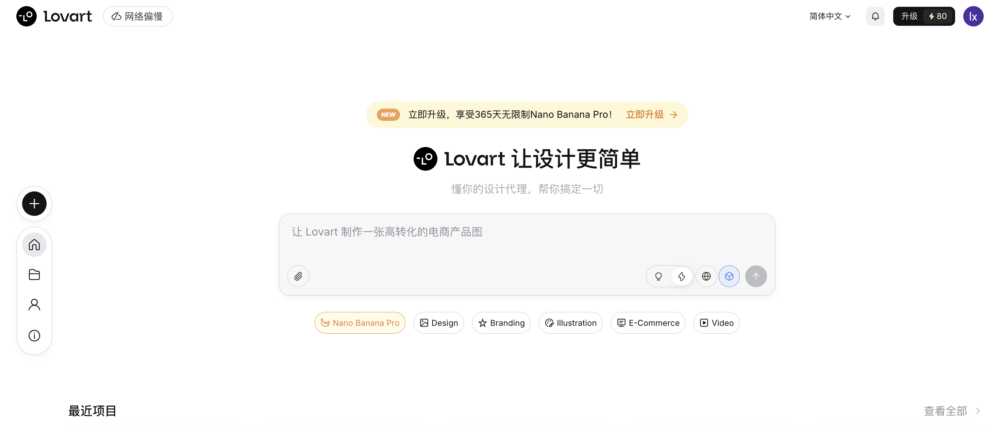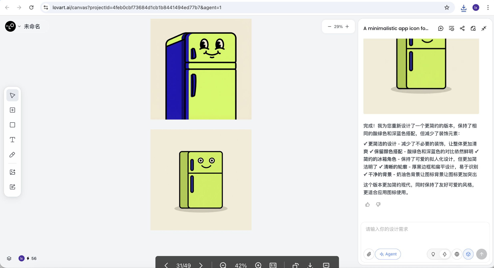

📋 **Lovart にコピーするプロンプト：**

```text
主題：幸せな顔を持つ可愛い擬人化された冷蔵庫キャラクター
スタイル：ミニマリストアプリアイコン、Neo-pop スタイル、太い黒いアウトライン、ベクターアート
カラー：アシッドグリーン (#CCFF00) とディープブルー
背景：ソリッドクリーム色
ネガティブプロンプト：テキスト、リアルな詳細、3D レンダー、複雑な背景
```

生成後、画像を 1024x1024 にクロップし、Xcode の `Assets.xcassets` -> `AppIcon` にドラッグします。


アプリを再実行すると、完全で認識可能な実際の iOS アプリケーションが表示されます。


### 4.7 ステージ7：高度な体験アップグレード

機能が安定した後、視覚スタイルをさらに改善したい場合、AI に望む効果を説明し、新しいデザイン案を生成させ、確認された結果を SwiftUI に移行するだけです。

📋 参照プロンプト：

```text
アプリの機能はすでに完成していますが、視覚的にインパクトのある UI スタイルを試してみたいです。
まず HTML + Tailwind CSS で新しいデザイン案を生成してください。ファイル名は design_v2.html です。

デザインスタイル：Neo-Pop（ドーパミンスタイル）
カラーリクエスト：
ディープロイヤルブルーをフルスクリーン背景に使用
アシッドグリーン (#CCFF00) をアクセントカラーに使用

視覚的感覚：
すべてのカードに 3px の太い黒いボーダーを使用
透明度ぼかしのないハードシャドウを使用、右下にシフト

レイアウトリクエスト：
ホームページ構造を変更せず維持
ピル型のボタンと入力ボックスを使用

ブラウザでプレビューできるように完全なコードを生成してください。
```

生成後、この HTML ファイルをブラウザで開きます。

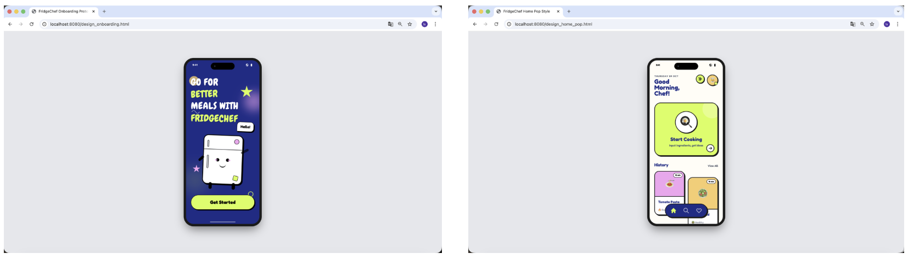

HTML バージョンが確定したら、iOS プロジェクトの修正を開始できます。

📋 参照プロンプト：

```text
[design_v2.html アップロード済み]
この HTML の視覚スタイルを分析し、現在の iOS プロジェクトに移行してください。

タスクリクエスト：
新しい NeoPopStyle.swift ファイルを作成
neoPopBlue() スタイル modifier をカプセル化

modifier には以下を含める必要がある：
- 丸みを帯びた角
- 太い黒いボーダー
- 不透明なハードシャドウ

HomeView をリファクタリング：
- 背景をディープロイヤルブルーに変更
- プライマリボタンにアシッドグリーンを使用
- 履歴レコードカードに白背景を使用
- 暗い背景でテキストが明確で読みやすいことを確認

修正された完全なコードを提供してください。
```

Xcode で再度 Run をクリックします。すべてが機能していれば、以下が表示されます：

- 機能は以前と全く同じ
- 視覚スタイルが大幅に変更
- アプリ全体の品質が明らかにアップグレード

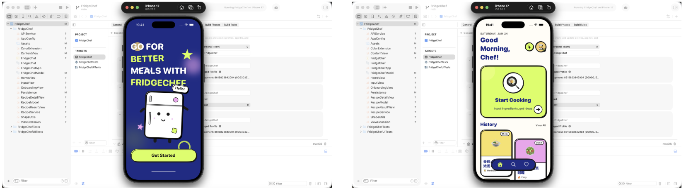

## 第5章：実行、デバッグ、エラー処理

前の章でコア機能を完了し、シミュレーターでアプリを正常に実行しました。
しかし iOS アプリにとって、真の完了は「正常にコンパイルされる」ことではありません — **安定した動作と、問題が現れた時の処理方法を知ること**です。

### 5.1 Xcode でアプリを実行

まず、プロジェクトが Xcode で正しく実行できることを確認します。

Xcode の左上で、実行デバイスを選択し、デフォルトの iPhone シミュレーターを維持します。**Run** ボタンをクリックしてコンパイルおよび実行します。すべてが正常であれば、アプリがシミュレーターで起動し、第4章で構築したインターフェースが表示されます。

### 5.2 実機でアプリを実行

ケーブルを使用して iPhone を Mac に接続します。

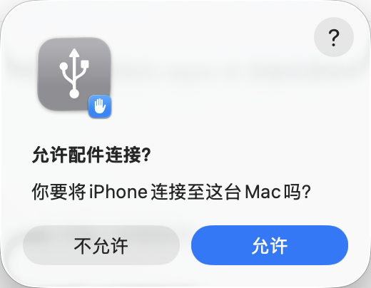

初めて接続する際、電話に**このコンピュータを信頼しますか？**と表示されます。信頼をタップし、ロック解除コードを入力します。


Xcode のデバイスリストで iPhone を選択し、再度 **Run** をクリックします。

この時点で、電話のホーム画面に **FridgeChef** アイコンが表示され、正常に開いて使用できるはずです。

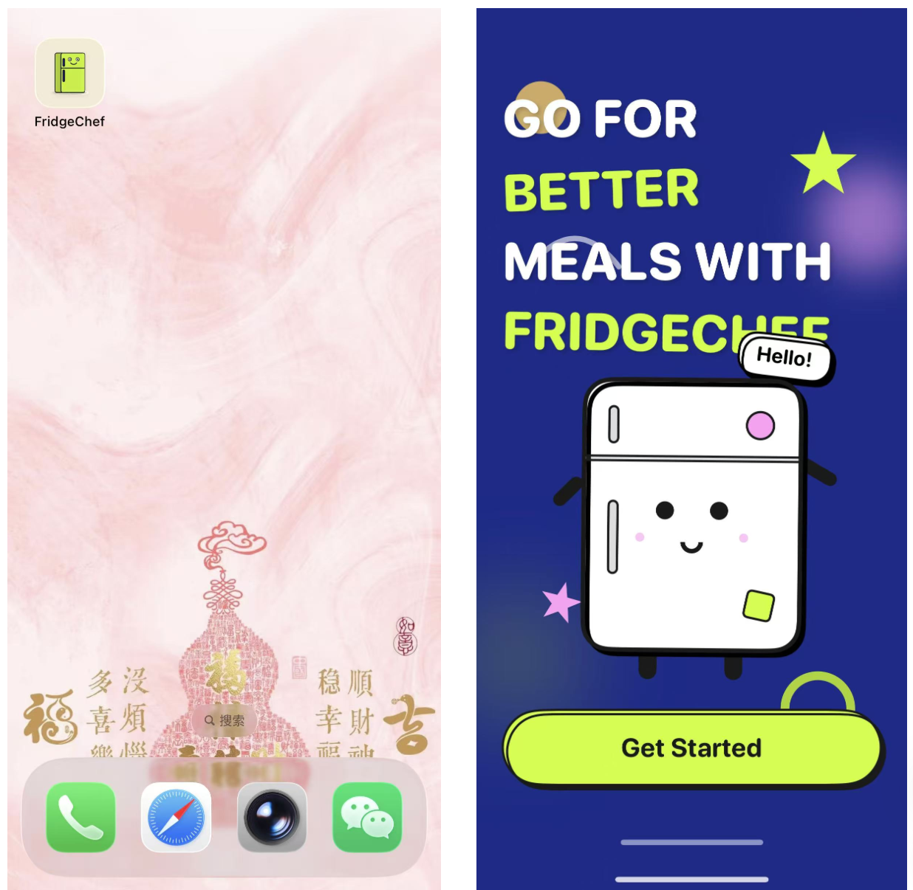

このステップは、1つの完全な iOS 開発クローズドループの完了を示します。

### 5.3 iOS 開発エラーの一般的な原因

実際の開発では、**エラーに遭遇するのは正常**であり、例外ではありません。

一般的な問題は通常、以下のカテゴリから発生します：

1. **コンパイルエラー**
   Swift 構文、型の不一致、パラメータの欠落など。Xcode は赤色で直接ハイライトします。
2. **ランタイムエラー**
   アプリはコンパイルされるが、実行中にクラッシュ — 例：配列の範囲外や nil 値の強制アンラップ。
3. **権限または設定エラー**
   ネットワークリクエストがシステムにブロック、Info.plist 設定の欠落、署名の問題など。
4. **論理エラー**
   アプリはクラッシュしないが、動作が間違っている — 例：ボタンが応答しない、データが更新されない。


エラーが現れたら、**エラーメッセージ全体をそのまま Trae のチャットボックスにコピー**するだけです。プロジェクトコンテキストを認識している Trae がデバッグを支援できます。

### 5.4 一般的な実機デバッグエラーと解決方法

実機デバッグ中のエラーは非常に一般的です。これらの問題は通常、コード自体ではなく、デバイスの信頼、セキュリティルール、または署名設定が原因です。アプリが iPhone でスムーズに実行できない場合、まずこのセクションを確認できます。

#### 1. 署名と登録の問題

**一般的な症状：**

- Xcode に次のような赤いエラーが表示される
  `"Communication with Apple failed"`
  または
  `"No profiles for 'com.xxx.xxx' were found"`
- または次のように表示される
  `"Your team has no devices which are compatible"`

**原因：**

- Bundle Identifier が一意でないか無効
- 現在の iPhone がまだ開発用 Apple ID に登録されていない

**解決方法：**

1. **Bundle Identifier を変更**
   Xcode プロジェクト設定で、Bundle Identifier をより一意なものに変更、例：
   `com.yourname.FridgeChef`
2. **Xcode に自動的にデバイスを登録させる**
   エラープロンプトで `Try Again` または `Register Device` をクリックし、Xcode にデバイス登録と証明書設定を自動的に完了させる。

#### 2. デバイスペアリングと接続の問題

**一般的な症状：**

- Xcode に次のように表示される
  `"Device is not available because pairing is in progress"`
- または次のように表示される
  `"Device Locked"`
- またはすでに信頼をタップしたのに Xcode がまだスタックしている


**原因：**

- iPhone がまだロックされている
- ペアリングプロセスが完全に完了していない
- Xcode が接続状態を更新していない

**解決方法：**

1. 電話のロックを解除
   iPhone がロック解除され、ホーム画面に留まっていることを確認。
2. 信頼プロセスを完了
   電話に**このコンピュータを信頼しますか？**が表示されたら、**信頼**をタップし、**ロック画面のコードを入力**する。
3. 接続状態を更新
   まだスタックしている場合、ケーブルを抜き、2-3秒待って再接続。必要に応じて Xcode を再起動して再試行。

#### 3. アプリはインストールされるが開けない

**一般的な症状：**

- アプリアイコンはすでに iPhone のホーム画面に表示されている
- システムが次のように表示する
  **信頼されていない開発者**

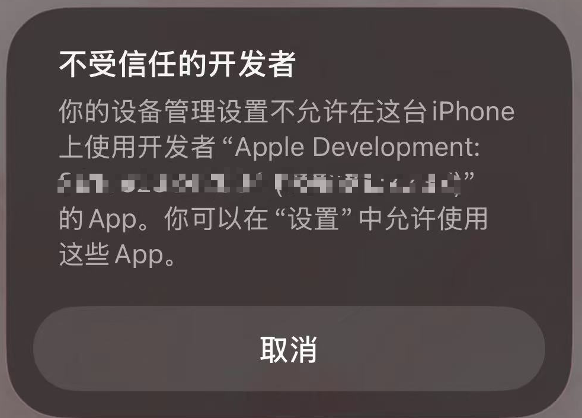

**原因：**

これは iOS のセキュリティメカニズムです。個人の Apple ID でインストールされたデバッグアプリは、手動での信頼認可が必要です。

**解決方法：**

1. **設定**を開く
2. **一般**に入る
3. **VPN とデバイス管理**をタップ
4. **デベロッパ App** の下で Apple ID を見つける
5. **信頼**をタップし、再度確認

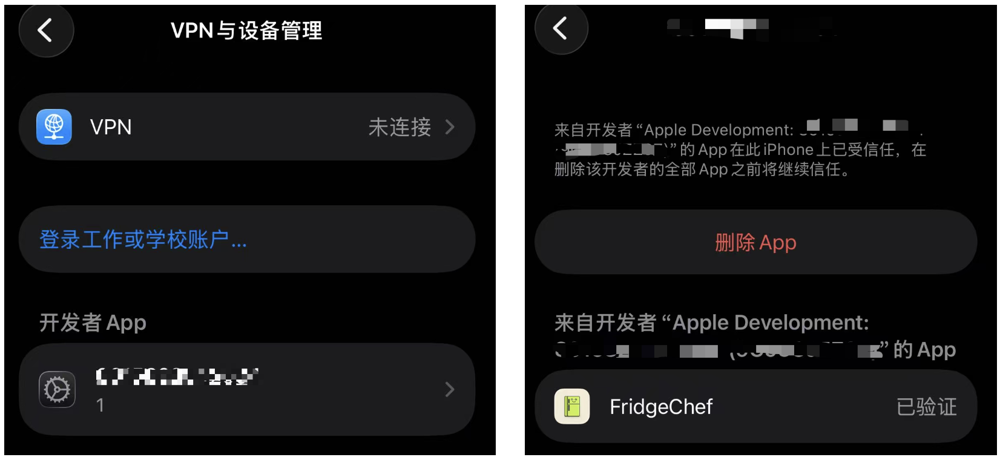

その後、ホーム画面に戻り、アプリを再度タップします。正常に実行されるはずです。

## 第6章：アプリを App Store に公開したい場合

このチュートリアルで主に完了したのは、**個人の開発およびデバッグバージョンのアプリ**の完全なクローズドループです：プロジェクトの作成、機能の実装、デバッグから、実際のデバイスへの正常なインストールと使用まで。

さらに進んで、正式に **Apple App Store** にアプリを公開し、すべてのユーザーがダウンロードして使用できるようにしたい場合、より正式なリリースプロセスに入る必要があります。そのプロセスには有料の開発者アカウント、審査ルール、コンプライアンス要件が関係し、このチュートリアルの主要な実践焦点ではないため、以下の内容は**全体的な参照とロードマップ**としてのみ提供されます。

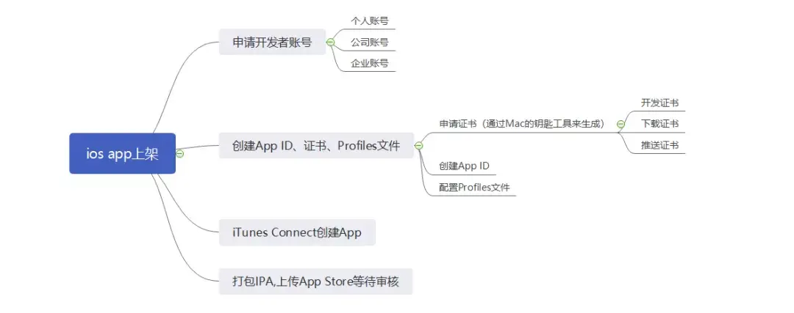

> 以下の内容は Apple の公式審査要件と公開の経験談（オリジナルの知乎シェアを含む）を参照しています。リンクは以下にリストされています。リンクにアクセスできなくなった場合、タイトルまたはキーワードで検索してオリジナルを見つけることができます。

### 6.1 Apple Developer Program

アプリを App Store に公開するには、Apple の有料開発者プログラムに参加する必要があります：

- **Apple Developer Program**（年間 USD $99）
- 公式サイト：[https://developer.apple.com/](https://developer.apple.com/)

参加後、**App Store Connect** を使用してアプリのエントリを作成し、バージョンを管理し、正式に公開できます。

### 6.2 App Store Connect：アプリエントリの作成

App Store Connect では、以下を含むがこれに限定されない、完全なアプリレコードを作成する必要があります：

1. アプリ名と Bundle ID
2. 説明、キーワード、プライバシーポリシーリンク
3. アプリアイコン、スクリーンショット、プレビュー資料
4. 価格と配布地域設定

すべての情報は提出前に完了している必要があります。

### 6.3 ビルドして審査に提出

メタデータの準備ができたら：

1. Xcode で有料開発者アカウントを使用して Release ビルドに署名
2. 正式バージョンをビルドしてアップロード
3. App Store Connect で審査に提出

提出後、アプリは Apple の審査キューに入ります。審査時間は通常 1-3 日で、ケースによります。

### 6.4 審査ルールと却下の一般的な理由

Apple は主に以下の観点からアプリを審査します：

- 機能と安定性
- プライバシーとデータコンプライアンス
- メタデータと実際の機能の間の一貫性
- 権利侵害または誤解を招く行為があるかどうか

アプリが要件を満たさない場合、審査は却下され、Apple は具体的な理由を提供します。開発者はアプリを修正して再提出する必要があります。

### 6.5 却下された後にすべきこと

アプリが却下された場合：

- フィードバックに従ってコードまたは説明を修正
- バージョンを再提出
- App Store Connect を通じて審査チームとコミュニケーション

これは公開プロセスの非常に一般的な部分であり、プロジェクトが失敗したことを意味するものではありません。

### 参照元

以下の内容は Apple の公式ドキュメントと公開の経験シェアを参照しています：

- App Store 審査ガイドライン（Apple 公式）
  [https://developer.apple.com/app-store/review/guidelines/](https://developer.apple.com/app-store/review/guidelines/?utm_source=chatgpt.com)
- 審査提出の公式ガイド
  [https://developer.apple.com/cn/help/app-store-connect/manage-submissions-to-app-review/submit-for-review](https://developer.apple.com/cn/help/app-store-connect/manage-submissions-to-app-review/submit-for-review?utm_source=chatgpt.com)
- iOS App Store 公開と審査の落とし穴の完全図解ガイド（知乎）
  [https://zhuanlan.zhihu.com/p/146128612](https://zhuanlan.zhihu.com/p/146128612)

## 第7章：まとめ

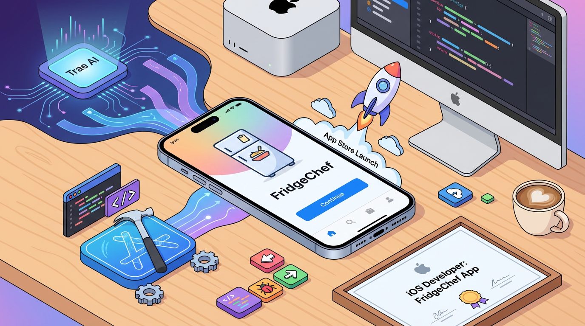

おめでとうございます！この時点で、あなたは0から1までの完全な iOS アプリ開発プロセスを自ら歩んできました。環境設定、プロジェクト実行、そして段階的にインターフェース、機能、データ、実機テストを実装するに至るまで、すべての主要な段階が順調に完了しました。さらに重要なのは、Swift 構文を暗記することでここに来たのではなく、実装の大部分を AI に任せたことです。あなたのバックグラウンドが何であれ、このような試みはあなたをより流暢にし、iOS 開発がかつて思われていたほど難しくないことに気づくでしょう。以前は1行のコードも書けなかったとしても、自分自身のアプリを構築できるのです。

振り返ってみると、全体のプロセスは実際にはそれほど複雑ではありません：構築したいものを決め、HTML でインターフェースを素早くテストし、SwiftUI に変換し、API とローカルデータを接続し、デバッグを1回実行します。これを基盤として、将来的には個人の目覚まし時計、ミニマルな todo リスト、さらにはお気に入りの有名人の口調で話すチャットボットも気軽に構築できます。

これこそが、このチュートリアル — そして easy-vibe — が教えたい最も重要なことです。未来のバイブコーディングマスターたちの最新の創作物を楽しみにしており、皆さんの作品に目を奪われる日を心待ちにしています。
