# 最もシンプルなWeChatミニプログラムの作り方

# 1. WeChatミニプログラムとミニプログラム開発とは

このチュートリアルでは、完全なクローズドループを完成させます：頭の中のアイデアから、WeChat内でQRコードで検索・開ける本物のミニプログラムまで。

構築を始める前に、まず2つの基本的な理解を確立する必要があります。

1つ目は**本質**です：WeChatミニプログラムとは一体何でしょうか？通常のアプリやウェブサイトとどう違うのか？なぜ多くの製品がこの形式を選ぶのか？核心的なロジックを理解して初めて、自分のアイデアがミニプログラムに合うか判断できます。

2つ目は**パス**です：「ミニプログラムを作りたい」と言ったとき、ゼロからリリースまでの完全なパスはどのようなものか？そのパス上の重要なノードは何か — アイデア段階で何を考えるか、環境をどうセットアップするか、AI支援開発がどのように効率を上げるか、シミュレータデバッグでどのような落とし穴があるか、テストアカウントと正式リリースがそれぞれ何を解決するか。このプロセスをまず頭の中で走り抜ければ、実装中に迷子になることはありません。

この2つの質問が明確になったら、正式に開発に入れます。最初の質問から始めましょう：WeChatミニプログラムとは一体何でしょうか？

## 1.1 WeChatミニプログラム

WeChatミニプログラムは、WeChat内に存在するアプリとして見ることができます。アプリストアで検索したり、ダウンロード、インストールする必要はありません。ユーザーはWeChatで名前検索、QRコードスキャン、共有カードを開くだけで、すぐに使用できます。使用後は閉じるだけ。スマホのホーム画面やストレージを永久に占有しません。

一般ユーザーにとって、ミニプログラムは多くの「小さなタスク」を解決します：荷物の配達確認、コーヒーの注文、注文の閲覧、ちょっとしたゲーム。高速起動とWeChat内の統一エントリが最大の体験的特徴です。

企業や開発者にとって、ミニプログラムは検索・シェア可能な「小さなアプリ形式」です。WeChat公式プラットフォームで登録し、設定を完了し、審査に通れば、ミニプログラムはすべてのWeChatユーザーに開放されます。従来のアプリと比較して、最初のユーザー獲得が容易です。人々はすでにWeChatで多くのタスクを行うことに慣れているからです。

このチュートリアルでは、複雑なビジネスシステムは構築しません。古典的な例を選びます：スネークゲーム。小さく論理が明確で、ミニプログラムが持つべき完全な要素を含んでいます：複数ページ、シンプルなインタラクション、状態変化、スコア記録など。最初のプロジェクトとして最適です。

## 1.2 WeChatミニプログラム開発

「ミニプログラムとは何か」を理解した後の次の質問は：開発とは実際に何を伴うのか？

明確な目標（例えば、いつでも遊べるスネークゲーム）を持ち、ユーザーが見るインターフェースを設計し、異なるアクションで何が起こるべきかを定義し、最後に公開します。

従来の開発では、プログラマーがこれらすべてのステップを主導し、大量のコードを書いていました。AI支援開発では、これはより明確に分割できます：あなたが欲しいものを説明し、AIがほとんどの実装詳細を手伝います。つまり初心者にとって最も重要なスキルは、構文を暗記することではなく、要件を明確に記述し、AIの出力を理解することです。

## 1.3 WeChatミニプログラム開発のいくつかの方法

実際のプロジェクトでは、異なる技術ルートが使われます。最初から用語で圧倒されないよう、一般的なパスを理解するための大まかな分類のみを行います。

1つ目は、公式ネイティブ機能を直接使用する方法です。WeChat DevToolsでプロジェクトを作成すると、ページ構造、スタイル、ロジックを記述するための固定ファイルタイプが表示されます。この方法は公式ドキュメントに近く、強い制御力がありますが、初めてフロントエンドを学ぶ人にとっては学習曲線が少し急です。

2つ目は、uni-appなどのクロスエンドフレームワークを使用する方法です。主にローカルでWebライクなコード（例えば`.vue`ファイル）を書き、フレームワークがそのコードをWeChatミニプログラムが実行できる形式に変換します。利点は統一された構造です。後で他のプラットフォーム（H5やAppなど）に公開する場合、変更が比較的少なくなります。

これら2つの方法に基づき、このチュートリアルはAI支援ツールを使用したミニプログラムSOPに焦点を当てます。例えば、プロジェクト全体をTraeで開き、内蔵AIに直接指示します：「このファイルにタイトルとボタンがあるホームページを追加して」や「スネークとスコアを表示するゲームページを作成して」。AIは現在のプロジェクトコンテキストに基づいて、新しいコードスニペットを生成したり、既存のコードを変更/リファクタリングします。

これら3つの方法は相互排他ではありません。uni-appプロジェクトで構築しながら、Trae AIにほとんどのコーディング作業を任せることも完全に可能です。重要なのは、1つの方法を選ぶことではなく、自分が今どこにいて、どのようなツールが利用可能かを知ることです。

## 1.4 この記事で扱うWeChatミニプログラムのステップ（概要）

このチュートリアルは**環境から最終製品まで**のリズムに従います。スネークの例とTraeのバイブコーディングスタイルを中心に、プロセスを再利用可能なルートに分割します。後の章で、以下の段階を経ます：

1. 概念の基礎構築：ミニプログラムとは何か、一般的な開発方法は何か、このスネークミニプログラムは誰向けでどのようなシナリオで使われるかを理解。
2. 環境準備：ミニプログラムアカウントの登録、HBuilderX、Trae、WeChat DevToolsのインストール、HBuilderXで基本プロジェクトスケルトンを作成し、WeChat DevToolsで実行して最もシンプルなページを表示。
3. 正式な開発へ：Traeでプロジェクトを開き、AIとのバイブコーディング対話を使用して、ホームページとゲームページのレイアウトを段階的に生成し、スネークの移動、餌を食べる、ゲームオーバーなどの核心ゲームプレイを実装。
4. 核心機能が動作した後、AIを「デバッグとリファクタリングのパートナー」として使用：バグの診断、コードが乱雑になったら構造の整理、スタート/ポーズ、ハイスコア記録、UIの改善などの詳細を段階的に追加。
5. 公開へ：プロジェクトをWeChatが認識可能なバージョンにビルド、WeChat DevToolsで実機プレビューとテスト、まずテストアカウントと体験版でプロセス検証を行い、その後、届出と審査を完了して正式リリースし、他の人があなたのミニプログラムを検索して遊べるようにする。

このセクションは全体マップを描くだけで、コマンドやコードの詳細にはまだ踏み込みません。今のところ、この5つのステップを覚えておいてください：**理解 -> 環境構築 -> バイブコーディング開発 -> デバッグと改善 -> ビルドとリリース**。後の章で各ステップにズームインし、何を準備するか、AIに何を言うか、各段階で画面に何が表示されるべきかを示します。

# 2. 環境準備

コードを1行書く前に、まず環境を準備しましょう。
このパートの目標は、**ツールのダウンロード先やなぜ動かないのか**で引っかからないようにし、AIとの対話と要件実装に直接集中できるようにすることです。

ブラウザを開いてファイルをダウンロードし、インストーラーをダブルクリックできるなら、このセクションは完了できます。

## 2.1 このチュートリアルで使用する3つのツール

スネークミニプログラム開発には、異なる役割を持つ3つのツールを組み合わせて使用します：

1. 1つ目はTraeです。AI統合コードエディタと考えてください。通常のIDEのようにプロジェクトファイルを開くことも、自然言語でAIと対話してコードの生成、修正、説明もできます。このチュートリアルの「AIでミニプログラムを作る」操作のほとんどはTraeで行われます。https://www.trae.cn から最新版をダウンロード。
2. 2つ目はHBuilderXです。Vueとuni-appのサポートが強力で、ミニプログラムの既製テンプレートを提供します。これを使用してベースミニプログラムプロジェクトを「ワンクリック生成」します — これはTrae + AIに渡してさらに反復するための基盤作りです。https://www.dcloud.io/hbuilderx.html からダウンロード。
3. 3つ目はWeChat DevToolsです。この公式ツールはミニプログラムの開発とプレビューに使用されます。デスクトップ上でプロジェクトを実行し、モバイルでの実機デバッグをサポートします。https://developers.weixin.qq.com/miniprogram/dev/devtools/download.html からダウンロード。

要するに：HBuilderXがベースプロジェクトを素早く作成し、TraeがAIでコーディングを助け、WeChat DevToolsが実際に動くミニプログラムを表示します。

## 2.2 WeChat公式プラットフォームアカウントの登録とAppIDの取得

ツールの準備ができたら、**ミニプログラムの身分**も必要です。これはWeChat公式プラットフォームで作成します。
ミニプログラムを登録したことがない場合は、以下の順序で進めてください：

1. ブラウザで https://mp.weixin.qq.com を開き、WeChat公式プラットフォームを開き、WeChatでQRコードをスキャンしてログイン。

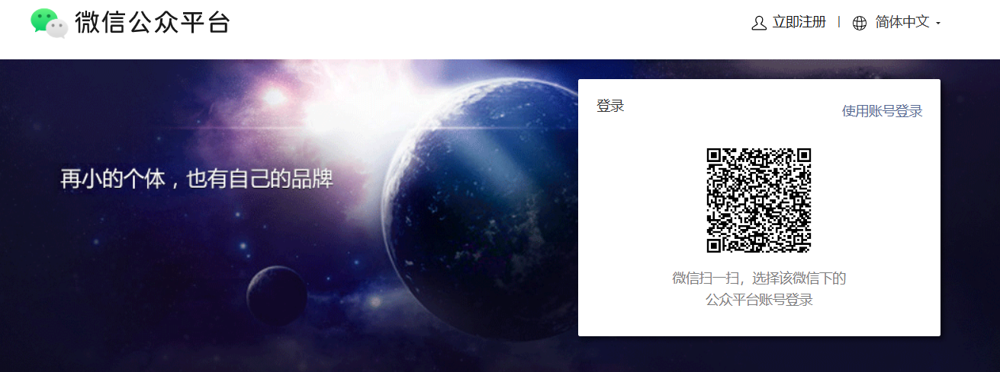

2. ホームページで「Mini Program」を選択し、メールアドレス、電話番号、主体タイプ（個人または企業）を含む登録プロンプトを完了。
   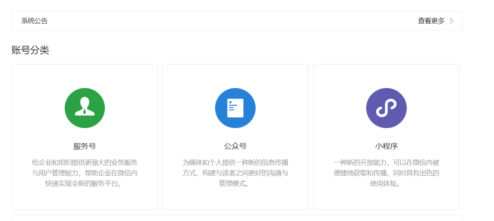
3. 登録成功後、バックエンドに入り、「Development Management」または「Development Settings」を見つけると、AppIDという名前のユニークIDが表示されます。これがあなたのミニプログラムの身分で、後のプロジェクト設定で使用します。

AppIDは見つけやすい場所に保存することをお勧めします。後のセクションで、この値を直接入力してローカルプロジェクトをオンラインミニプログラムにマッピングします。

## 2.3 WeChat DevToolsのインストール

次に、ミニプログラムを実際に実行・プレビューする場所が必要です。それがまさにWeChat DevToolsの役割です。

1. ダウンロードページ https://developers.weixin.qq.com/miniprogram/dev/devtools/download.html にアクセス。
   このページには異なるOS用のバージョンが表示されます。通常、システムに合った安定版（Windows 64ビットやmacOSなど）を選択。
2. ダウンロード後、インストーラーをダブルクリックし、ウィザードに従って進める。不明な場合はデフォルトオプションを維持。
3. インストール後、デスクトップまたはスタートメニューからWeChat DevToolsを起動。初回起動時にQRコードが表示されるので、WeChatでスキャン。スキャンして認証するとメインインターフェースに入ります。

後で、Traeでプロジェクトファイルの準備ができたら、ビルドされたミニプログラムをWeChat DevToolsにインポートし、ここで実際の実行結果を確認します。

## 2.4 TraeとHBuilderXの準備

最後に、実際のコーディングに使用する2つのツールをインストールします：TraeとHBuilderX。

まず**Traeをインストール**します。ブラウザで https://www.trae.cn にアクセスし、OSに合ったバージョンをダウンロード。インストールは通常のソフトウェアと同じ：インストーラーをダブルクリックし、プロンプトに従います。インストール後、ローカルフォルダを開き、コードを検査し、AIと対話できるIDEが手に入ります。以降のバイブコーディングステップはすべてここで行われます。

**次にHBuilderXをインストール**します。https://www.dcloud.io/hbuilderx.html にアクセスし、OS用パッケージをダウンロード。HBuilderXは軽量で起動が速いです。インストール後、インターフェースを軽く見てください。今は深く機能を学ぶ必要はありません。後の章で、uni-appミニプログラムテンプレートを作成してプロジェクトの開始点とします。

このセクションを完了すると、環境が整います：ミニプログラムアカウント + AppID、ランタイムプレビューツール、AIコーディングIDEが揃いました。次は**最初のプロジェクトスケルトンの作成**から始め、これらのツールを実際に動かします。

## 2.5 ベースファイルの準備

1. 「New Project」をクリック。

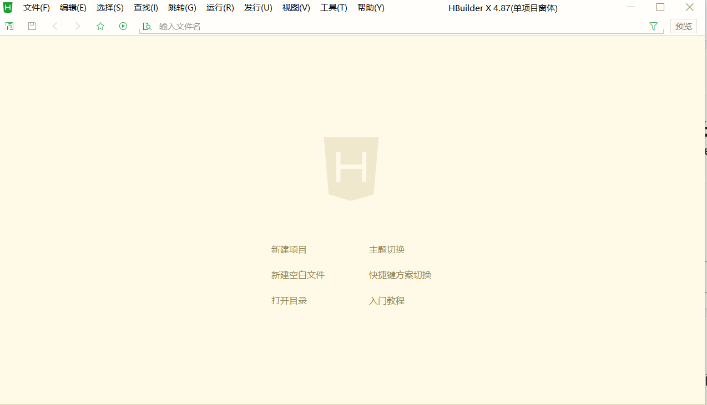

2. デフォルトテンプレートを選択、ミニプログラム名を設定、保存パスを選択し、右下の作成をクリック：

3. 作成成功画面が表示されます：

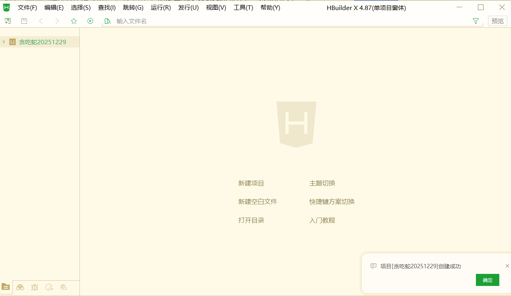

4. 次にファイルシステムでこのフォルダを見つけ、Traeで開くと、基礎ファイルがすべて準備されているのが確認できます：

# 3. ミニプログラム開発

最初の2つのパートで、「ミニプログラムとは何か」と「ツールと環境のセットアップ方法」を明確にしました。このセクションから実践に入ります：概念だけでなく、AIが実際にスネークミニプログラムをゼロから構築するのを手伝います。

このセクションでは、開発フェーズの完全なSOPを歩み、概ね以下を含みます：

1. Traeで現在のプロジェクトを開き、AIに最初の完全な指示を与え、現在のスケルトンに基づいて実行可能なスネークバージョンを設計・実装させる。
2. Traeに実際のプロジェクトファイルを直接修正させ、「サンプルコード」を出力するだけでなく、必要に応じてロールバックを使用して以前の状態に復元する方法を学ぶ。
3. HBuilderXとWeChat DevToolsに戻り、ミニプログラムシミュレータで実行し、シミュレータでこのバージョンを遊んで「コード視点」から「ユーザー視点」へ切り替える。
4. 遊んだ結果に基づき、自然言語で修正提案を続け、ボタン方式からジョイスティック方式へコントロールを反復させ、「問題発見 -> 問題記述 -> AI修正 -> 再検証」の完全ループを体験。

開発前にすべてのページとボタンを設計することもできます。
しかし完全な初心者にとって、インターフェースとインタラクション設計自体も新しい領域です（後でAI支援設計を示します）。そのため、今回は意図的に別の方法をとります：まず始め — AIに実行可能なバージョンを生成させ、効果を確認しながら自然言語での対話で徐々に改良。

## 3.1 要件を一度に明確に説明：Traeに最初の「マスタープロンプト」を与える

Traeで準備済みのミニプログラムプロジェクトを開いた後、すぐに特定の行を編集するのではなく、内蔵AIアシスタントに伝えました：

**AIに指示を出しました：現在のフレームワークに基づいて、スネークミニプログラムを構築して。このミニプログラムを設計して、プロンプトを書いて。**

つまり、「1つの関数を段階的に書いて」と頼むのではなく、まず完全な目標を投げかけ、AIに計画を手伝わせ、AIは計画するだけでなく最初の実装を直接着地させました。

この指示を受けると、Traeは現在のプロジェクト構造を読み取り、どこにページを追加し、どこにロジックを追加するかを判断し、プロジェクトファイル/コードを直接修正します。コードを手書きしたり、フォルダを手動で作成/修正する必要はありません。

## 3.2 AIに実際のコードを自動修正させ、手動コーディングではなく

Traeでこの指示を実行すると、AIは「プロジェクト編集」フローに入ります。この過程で、以下の重要なポイントを観察できます：

1. チャットエリアで思考を説明します。例えば、どのディレクトリにページを追加し、ゲームロジックをどのように整理するか。

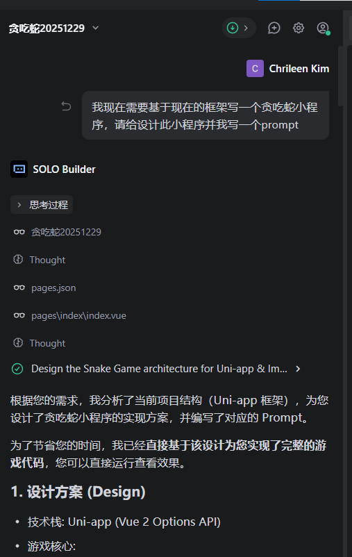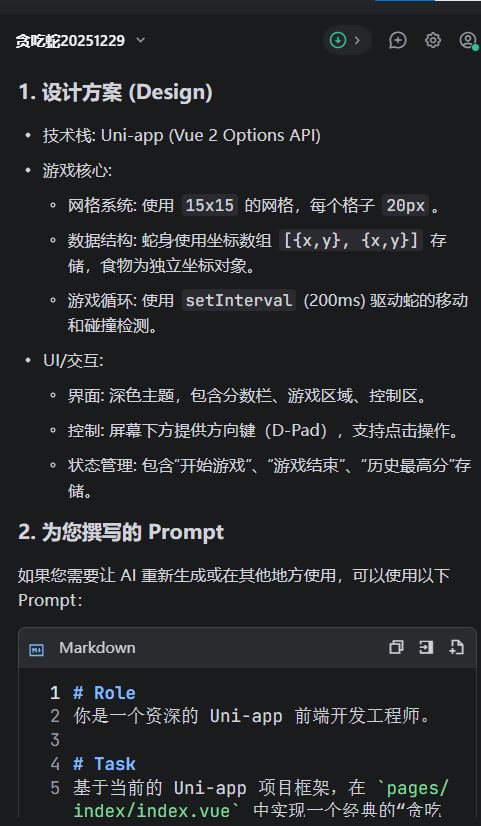

2. 実際のプロジェクトファイルを直接編集し、「サンプルコード」を与えるだけではありません。
3. 完了後、Traeはどのファイルが変更され、何が行われたかの短い要約を出力します。

このラウンドに満足できない場合（または何かが間違っている場合）、パニックになる必要はありません。Traeはチャットボックスの左上にロールバックを提供します。ワンクリックでこの指示前のプロジェクト状態に復元できます — 安全なアンドゥキーのようなものです。

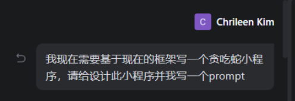

## 3.3 HBuilderXとWeChat DevToolsで効果を確認

AIが最初の開発ラウンドを完了すると、コードはプロジェクトに書き込まれていますが、実際のプレイヤー側の効果はまだ見ていません。
次に実行します。

具体的な操作：HBuilderXに戻り、上部メニューの「Run」を見つけ、「Run to Mini Program Simulator」 -> 「WeChat DevTools」を選択。これによりプロジェクトのビルドがトリガーされ、結果がWeChat DevToolsで開きます。

下部の出力パネルにビルドプロセスが表示されます。最終状態が「ready」でエラーがない場合、ビルドは成功です。次にWeChat DevToolsに切り替えて、このバージョンのUIと機能を確認します。

ほとんどの場合、HBuilderXは自動的にWeChat DevToolsを開き、更新されたミニプログラムを直接確認できます。自動で開かない場合：

1. まずHBuilderXで現在の実行を停止。
2. WeChat DevToolsを手動で起動し、開いたままにする。
3. HBuilderXに戻り、「Run -> Run to Mini Program Simulator -> WeChat DevTools」を再度クリック。

するとWeChat DevToolsでバイブコーディングミニプログラムを確認できます：

## 3.4 自然言語で満足するまで繰り返し調整

この実践では、AIは最初ボタン制御のスネークを生成しました：画面に4つの方向ボタンがあり、クリックするとスネークが方向を変えます。完全に遊べますが、私は個人的にジョイスティック操作を好みます。調整リクエスト（機能だけでなく、UIデザインやレイアウトも。経験を積めば外部モデルAPIやデータベースの統合をAIに頼むことさえ可能）についても、同じです：自然言語で要件を記述するだけで済みます。

これがバイブコーディングの核心的な利点です：イベントバインディングや座標ロジックのコードを掘り下げる必要はありません。欲しいものを直接AIに伝えます。例えば、Traeのチャットで次のように書けます：

ボタンをジョイスティック操作に置き換えて。ユーザーがジョイスティックを離したとき、スネークは次のジョイスティック操作まで現在の方向に動き続けるようにして。

要件が明確であれば、AIは自動的にターゲットファイルを見つけ、コントロールスタイル、インタラクションバインディング、方向処理ロジックを修正します。

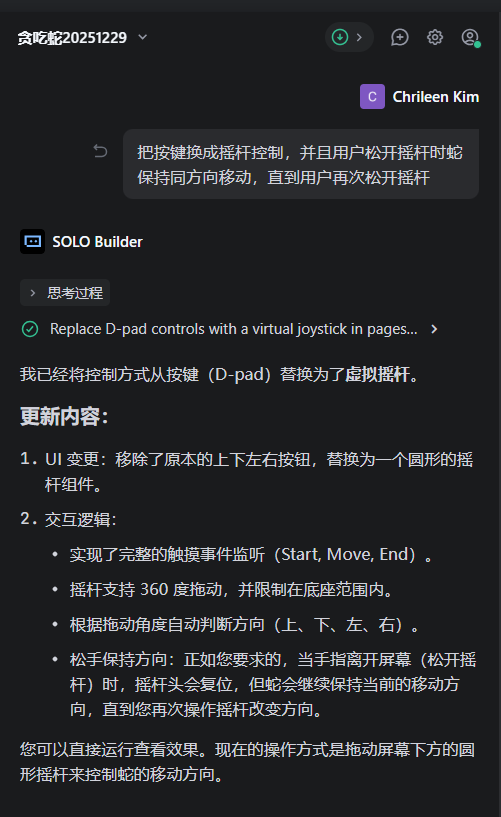

修正後、WeChat DevToolsに戻って確認。
変更がすぐに見えない場合、DevToolsの「Run」をクリックするかプレビューウィンドウを更新して最新ビルドを適用。それでも更新されない場合、HBuilderXで実行を停止し、シミュレータに再度実行すると、更新されたミニプログラムを確認できます：

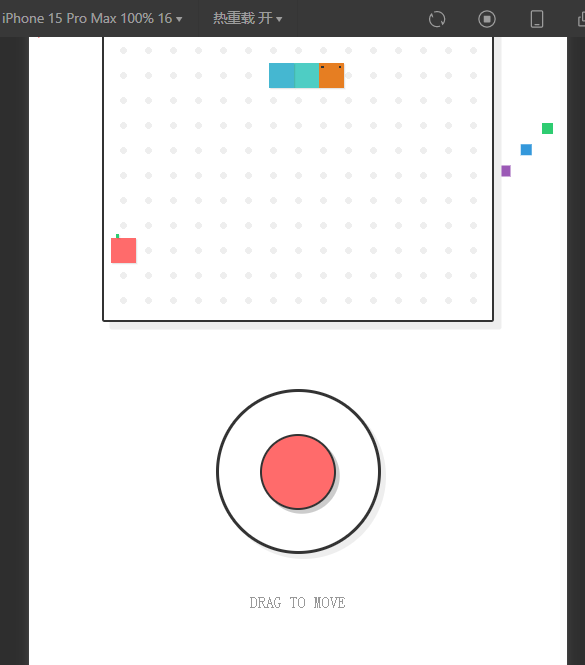

## 3.5 問題が発生したら：自然言語でコミュニケーションを続ける

AI生成バージョンは最初から完璧とは限りません。以下に遭遇する可能性があります：

- ランタイムエラーでアプリが開けない
- 機能はほぼ正しいが、詳細が期待と異なる
- UIは使えるが、まだ視覚的に美しくない、または便利ではない

このような時、自分でコードを盲目的に編集する必要はありません。問題をTrae AIアシスタントに自然言語で直接記述してください。例えば：

「ジョイスティック操作は動くようになったが、スネークが時々突然止まる。現在の実装を確認して。」  
または：「ゲームは遊べるようになったが、インターフェースが窮屈に感じる。モバイルでもっと縦方向のスペースが欲しい。レイアウトを調整して。」

AIは現在のプロジェクトコンテキスト + あなたの記述を使用し、コード変更を提供して直接適用します。結果が悪化したり方向が間違っている場合、以前の安定バージョンにロールバックして別の表現を試すこともできます。

このような数回のラウンドを通じて、「粗い初版」から自分の好みに近いジョイスティックベースのスネークに改良できます。
例えば、私はスタイル参照画像を与え、それに合わせてUIスタイルを調整するようAIに頼みました：

## 3.6 最終結果とセクションまとめ

**自然言語記述 -> AI修正 -> WeChat DevToolsでプレビュー -> 微調整を継続**の繰り返しラウンドの後、最終的にこの結果を得ました：

- 完全なゲームページ
- スネークがスムーズに動き、餌を食べる
- ジョイスティック操作対応
- ミニプログラムシミュレータで正しく動作

最終製品の例：

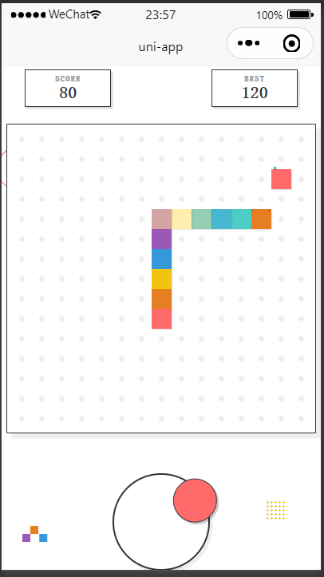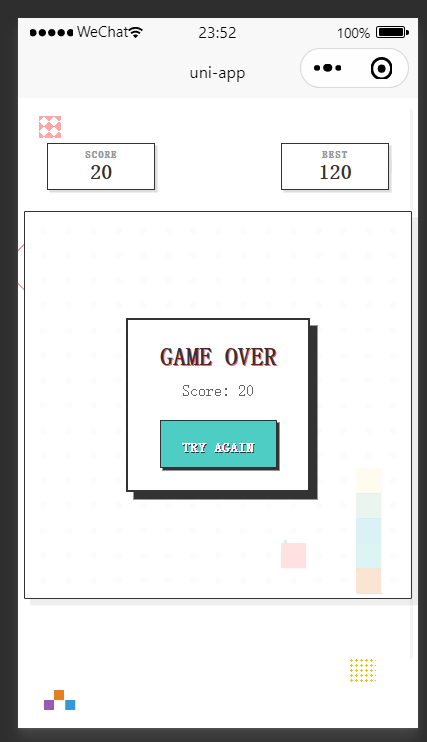

このセクションで、完全なクローズドループを見ました：

1. Traeで、1つの明確な指示でAIにスネークミニプログラムの初版を構築させた
2. HBuilderX + WeChat DevToolsで、ユーザー視点から実際の効果を検証
3. 自然言語で修正提案を続け、AIに機能とUIの最適化を担当させた
4. 問題発生時、ロールバック + 再実行でプロセスを安全に保った

次は、同じリズムで自分のアイデアに取り組めます：スネークに限らず、ユーティリティミニプログラム、イベントページ、実際のビジネスプロトタイプでも。あなたの主なタスクは、明確に考え、明確に記述すること。残りはAIとツールに任せてください。

# 4. ミニプログラムのリリース

前の3章で、**環境セットアップ** -> **AI支援開発** -> **ローカルシミュレータでスネーク実行**の完全なフローを完了しました。

この章から、重要な質問は：**この作品をWeChatに本当に公開し、おもちゃではなく使えるミニプログラムにするにはどうすればよいか？**

難易度を下げるため、まず**最短クローズドループ**を取ります：自分と少数のチームメンバー向けに**テスト/体験版**としてのみ公開。機能と体験が安定してから、正式な一般公開に進みます。

この章はまず4.1で**体験版リリース**の最短パスを完了します。全ユーザー向けの正式リリースは4.2で説明します。

## 4.1 最短SOP - 体験版としてリリース

このサブセクションの目標は1つだけ：あなたのスネークミニプログラムをWeChatで**体験版**として開けるようにすること。

全体の流れは4つのタスクです：

1. WeChat公式プラットフォームでAppIDを見つけて確認。
2. プロジェクトにこのAppIDを設定。
3. WeChat DevToolsで現在のバージョンをアップロード。
4. 公式プラットフォームに戻り、アップロードされたバージョンを「体験版」に設定。

この順序で進めましょう。

### 4.1.1 WeChat公式プラットフォームでAppIDを確認

最初のステップ：WeChat公式プラットフォームでミニプログラムAppIDを確認。

これは**セクション2環境セットアップ**で既に一度行いました。ここではそれを実際に使用します。

1. `https://mp.weixin.qq.com`にアクセスし、ミニプログラムバックエンドにログイン。
2. 左メニューの「Development Management」を見つけ、「Development Settings」に入る。
3. 上部の「Developer ID」エリアに、「AppID (Mini Program ID)」の行があります — これがあなたのユニークIDです。

このIDはプロジェクト設定と正確に一致する必要があります。そうでない場合、WeChatは別のアプリ身分と見なし、プレビュー/公開が失敗します。

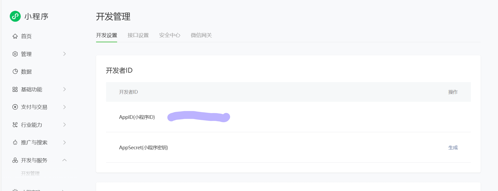

### 4.1.2 プロジェクトにAppIDを入力

2つ目のステップ：このAppIDをプロジェクト設定に書き込み、ローカルビルドがあなたの公式ミニプログラムアカウントにマッピングされるようにする。

プロジェクトがuni-appテンプレートを使用している場合：

1. HBuilderXを開き、スネークプロジェクトを読み込む。
2. ファイルツリーで`manifest.json`を見つけて開く。
3. 「WeChat Mini Program Configuration」までスクロールし、「WeChat Mini Program AppID」のような入力欄が見つかる。
4. 公式プラットフォームからコピーしたAppIDを正確に貼り付け、ファイルを保存。
   

これでローカルプロジェクトがこのミニプログラムの身分を主張しました。次にWeChat DevToolsからアップロードすると、このAppIDの下に記録されます。

### 4.1.3 WeChat DevToolsでバージョンをアップロード

プロジェクトをWeChat DevToolsに実行してシミュレータでプレビューするのは既に完了しています。

今度は：「現在のコードをバージョンとしてパッケージし、サーバーにアップロードする」を行います。

ステップ：

1. WeChat DevToolsの右上ツールバーで「Upload」をクリック。
2. ポップアップで2つの重要なフィールドに入力：
   1. バージョン番号：例えば `1.0.0`（数字とドットのみ）。
   2. プロジェクトメモ：短い説明、「Completed core gameplay」など。
3. 確認して「Upload」をクリック。出力パネルにビルドプロセスが表示。すべてのステップが緑色になりアップロードが完了すれば、このバージョンはWeChatサーバーに正常に提出されました。

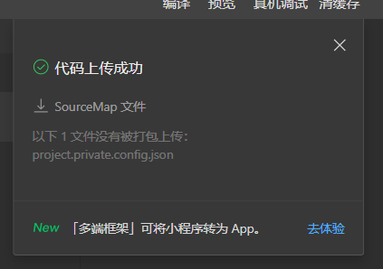

### 4.1.4 バックエンドでアップロードされたバージョンを体験版に設定

アップロードはコードをWeChat側に送信するだけです。システムに「これは体験版だ」と伝える必要があります。

最終ステップ：公式プラットフォームバックエンドに戻り、ループを完了。

1. `https://mp.weixin.qq.com`を開き、ミニプログラムバックエンドに入る。
2. 左メニューで「Management」 -> 「Version Management」を見つける。
3. 「Development Version」セクションに、アップロードされたバージョンが表示されるはず：バージョン `1.0.0`、あなたのメモ、そしてアップロードされたタイムスタンプ。
4. この行の右側で、ドロップダウン/アクションボタンを使用して「Set as Experience Version」を選択し、アクションを確認。このステップの前に、ホームページ/カテゴリ設定でメインカテゴリが設定されていることを確認。

   

   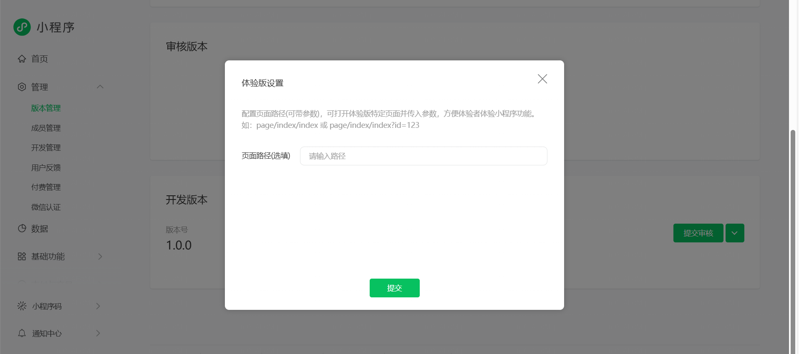

完了後、このバージョンはミニプログラムの「体験版」になります。バックエンドで体験QRコードを生成したり、自分/チームを体験メンバーとして追加し、WeChatでスキャンして実機テストができます。

これで、ローカルプロジェクトからテストリリースまでの最短ループが完了しました：

すべてのWeChatユーザーにすぐ公開する必要はありません。安全な範囲内で、実際のWeChat環境で実際のミニプログラムを動かします。機能テスト、フィードバック収集、反復には十分です。

## 4.2 ミニプログラムの正式リリース

体験版がうまく動作したら、自分のWeChatでこのスネークミニプログラムを遊べるようになっています。
次のステップは、限定体験ユーザーから完全に公開されたWeChatミニプログラムへの移行です。

ステップに分けましょう：基本情報の完了、カテゴリ選択、届出完了、そして審査提出。この順序で進めます：

### 4.2.1 ミニプログラムリリースフローに入る

まずWeChat公式プラットフォームバックエンドに戻りログイン。
左ナビゲーションで「Version Management / Release」関連のエントリを見つけ（UIは時期により多少異なる場合があります）。「Mini Program Release Flow」が見つかります。

入ると、上部エリアにプログレスバーが表示。その下に以下のステップがリストされます：

1. Mini Program Information
2. Mini Program Category
3. Operation Information / Filing
4. WeChat Verification（主体タイプによる）

最初は進捗0%。各ステップが完了すると、システムが自動更新。

### 4.2.2 基本ミニプログラム情報の入力

最初のステップはミニプログラムの「名刺」を完成させることで、ユーザーがWeChatで最初に見るものです。

「Mini Program Information」ページで、通常以下を入力/確認：

1. ミニプログラム名  
   検索結果とアプリヘッダーに表示。長さ制限と命名ルールがあります。機能を説明し覚えやすい名前を選んで。
2. 説明 / 紹介  
   1〜2文でこのミニプログラムが何をするか説明。例：「AI支援コーディングで開発されたスネークゲーム、ちょっとした暇つぶしに最適。」  
   説明は実際の機能と一致させ、誇張されたマーケティング文章は避けて。
3. アイコンとスクリーンショット
   1. アイコンは通常正方形画像で、PNG/JPG対応、サイズ/ピクセル制限あり（ページルールを確認）。シンプルで高コントラストのアイコンを使用。
   2. ホームページ、ゲームページ、設定ページなど数枚のスクリーンショットをアップロード。ユーザーが内容を理解するのに役立ちます。
4. その他の必須フィールド  
   タグやサービス地域など、プロンプトに従って入力。  
   原則は1つだけ：すべての情報はあなたのスネークミニプログラムの実際の機能と一致させること。

すべてのフィールドが完了したら、SaveまたはNextをクリック。リリースフローの最初のステップ完了。

### 4.2.3 ミニプログラムサービスカテゴリの選択

基本情報の後、ウィザードが「Mini Program Category」に案内。
カテゴリはWeChat内でのアプリの分類で、審査ルートとその後の表示/運営に影響します。

このページで「Add Category」が見えます。クリックしてシステムカテゴリツリーで適切なカテゴリを選択。例えば：

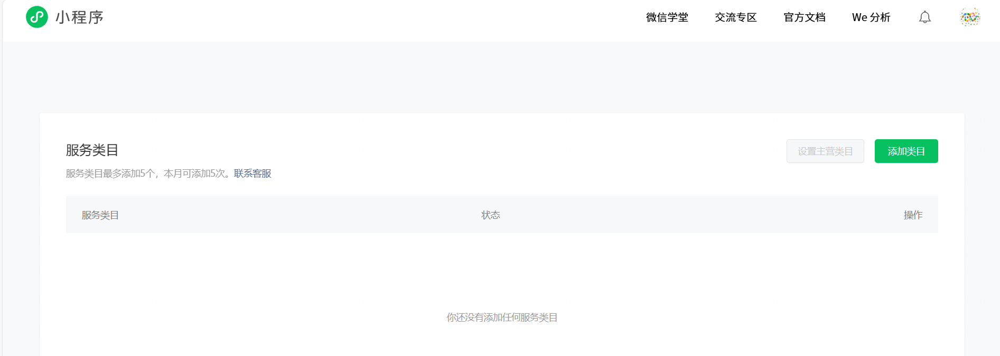

1. 最上位カテゴリとして「Education」を選択；
2. その後「Education Tools / Teaching Assistant」などのより具体的なサブカテゴリを選択。この例では、バイブコーディングの学習支援として教育ツールが選択。

自分のプロジェクトでは、実際の用途に最も近いカテゴリを選んでください。

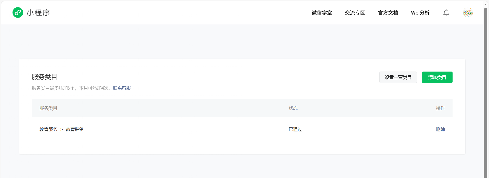

カテゴリを確認したら、Saveをクリック。ページに「category created successfully」と表示され、新しい項目が表示されれば、このステップ完了。

### 4.2.4 届出情報の完了

次に、リリースフローで「Operation Information / Filing」が求められます。これはミニプログラムの背後にある責任主体を検証します。

個人主体の例では、フローは通常以下を含みます：

1. 届出タイプの選択  
   「Individual」や「Enterprise」などのタイプから選択。登録主体と一致させる。
2. 主体情報の入力  
   名前、IDタイプ、ID番号などを含む。これは登録情報と一致する必要があり、そうでないと審査で拒否される可能性。
3. 証明書類のアップロード  
   通常、IDの写真やその他の証明ファイルが必要で、特定の形式/サイズ/鮮明度要件がページに表示。鮮明なファイルを準備してアップロード。
   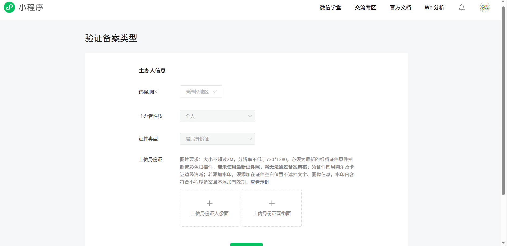

提出後、システムは「審査中」に入り、「Information submitted, please wait」のようなメッセージが表示。時間がかかる場合があります。バックエンドでいつでも進捗を確認できます。

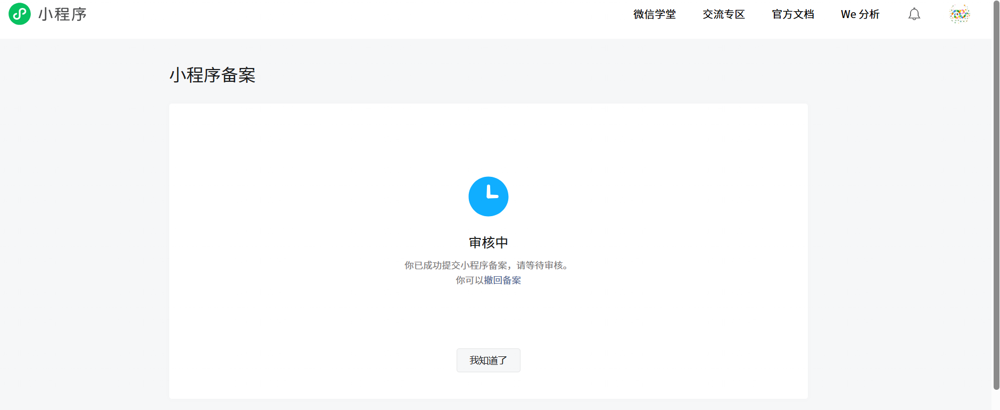

### 4.2.5 審査を提出し、正式リリースを待つ

「Mini Program Information」「Category」「Operation Information/Filing」がすべて完了したら、最後のアクション：審査の提出。

1. リリースフロー概要ページに戻り、すべての項目が完了と表示され、進捗がほぼ100%であることを確認。
2. 「Submit for Review」（または類似のボタン）をクリックして、現在の開発バージョンをWeChat審査チームに提出。
3. 「Version Management」で、このバージョンのステータスが「Under Review」に変更。承認後、「Published」または「Go Live」が可能。

届出審査に失敗した場合、開発者は失敗箇所を指定する電話を受ける場合があります。

届出では、工業情報化部から認証コードと認証リンクを受信する場合があります。リンクを開き、コード + 個人情報を入力（認証は1日間有効）。届出が通ると、届出番号とともにメールとSMS通知を受信。
WeChat認証：個人は通常30人民元、企業は約300人民元。承認結果に関わらず返金不可。認証通知と確認の電話を受ける場合があります。

審査提出時、運用ビデオ/スクリーンショットをアップロードし、必要情報を入力。その後「Submit Release」をクリックして正式リリース。

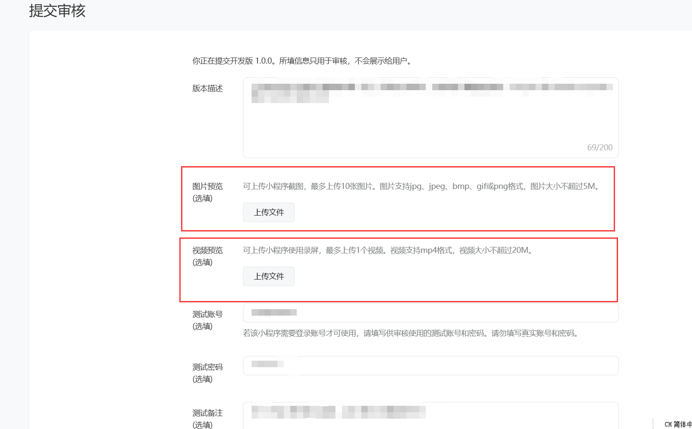

# 5. まとめ

ここまでで、完全な**0から1**のミニプログラム開発ループを完了しました：ミニプログラムの理解から、Trae、HBuilderX、WeChat DevToolsのインストール、AIにアイデアを伝えてコードで「レンガを運ばせる」ことから、シミュレータで最初のスネークバージョンを遊ぶこと、体験版としてパッケージング、届出/審査を完了してWeChatで実際に使えるようにするまで — あなたは完全なチェーンを自ら走り抜けました。

さらに重要なのは、これを構文の暗記で達成したのではないことです。要件を明確に表現し + AIと効果的にコミュニケーションすることで達成しました。あなたはすでにこれを体験しています：**1つの自然言語指示で、AIにあなたの開発ニーズを非常に効果的に満たさせることができる**。この能力はスネークに限定されません。後で構築したいあらゆるミニプログラムに転用できます — ツール、イベントページ、教育アプリ、実際の仕事のプロジェクト。

**一般的なSOP**としてまとめると、わずか5ステップです：  
**1つの小さな要件を明確に -> Traeでプロジェクトスケルトンを構築 -> バイブコーディング + AIで初版を作成 -> WeChat DevToolsで繰り返しテストと改善 -> アップロード、届出、審査、リリース。**  
この5ステップを繰り返すたびに、開いて共有できるもう1つの実際のミニプログラムと、「AIを使ってアイデアを製品にできる」というもう1層の自信が得られます。

次は、このスネークアプリを磨き続けることも、閉じて自分のアイデアから空白のプロジェクトを始めることもできます。何を構築するにせよ、1つだけ覚えておいてください：あなたはもう「何かを作りたい人」ではありません。あなたはすでに完全なワークフローを走り抜けたバイブコーディング開発者です。残りは、この能力が習慣になるまで繰り返すだけです。

# 参考文献：

- https://zhuanlan.zhihu.com/p/1889401120939567074
- https://blog.csdn.net/2401_87407347/article/details/155193007
