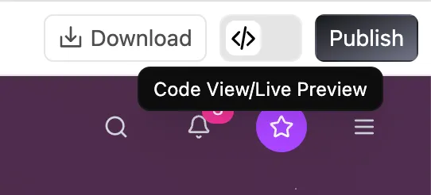
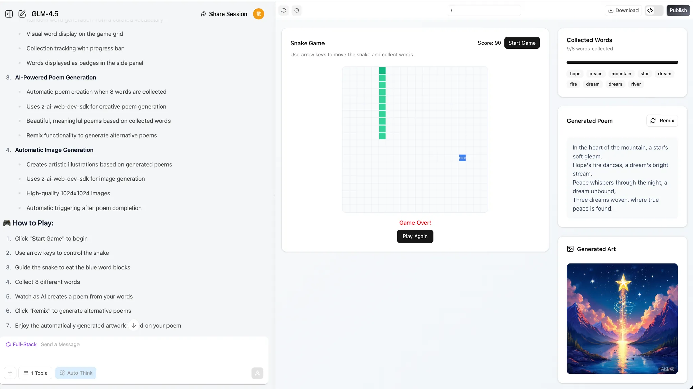
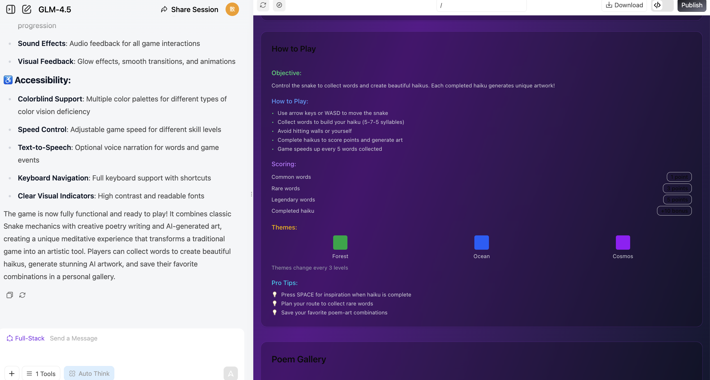

# 초급 1: AI 시대에는 말할 수 있으면 프로그래밍할 수 있다

이것은 **프로젝트 기반 학습** 튜토리얼입니다. 단계별로 따라 하며 결과를 재현해 보기를 권장합니다.
실수하거나 내용을 수정하는 것을 걱정하지 마세요. 우리는 언제나 당신이 해낼 수 있다고 믿습니다. 반드시 기억하세요.

<div style="text-align: center;">
<div style="display: inline-block; padding: 8px 20px; border-radius: 8px; border: 1px dashed #FFB6C1; background: linear-gradient(135deg, #FFF0F5 0%, #FFE4EC 100%); margin: 12px 0;">
  <span style="font-size: 15px; font-weight: 500; color: #666;">완벽보다 완성이 더 중요합니다 🐣</span>
</div>
</div>

<script setup>
import { relatedArticlesMap } from '@theme/data/relatedArticles'

const duration = '약 <strong>4시간</strong>, 여러 번에 나누어 완료 가능'
const relatedArticles =
  relatedArticlesMap['ko-kr/stage-1/ai-capabilities-through-games'] ?? []
</script>

## 이 장의 가이드

<ChapterIntroduction :duration="duration" :tags="['대화식 AI 프로그래밍', 'AI 네이티브 미니게임', '스네이크 실습']" coreOutput="AI 네이티브 스네이크 + 직접 만든 미니게임" expectedOutput="실행 가능한 AI 네이티브 스네이크 1개 + (선택) 직접 만든 AI 네이티브 미니게임 또는 Demo 1개">

만약 당신이 <strong>프로그래밍을 전혀 할 줄 모르거나</strong>, 아주 조금만 알고 있다면, 이 장은 바로 당신을 위해 준비된 것입니다. 우리는 가장 기초적인 부분부터 시작합니다. <strong>대화하는 방식</strong>으로 AI가 코드를 작성하게 하고, 문법을 외우지 않아도 되고, 환경을 설정하지 않아도 되며, 웹페이지에서 바로 실행할 수 있습니다.

당신은 직접 <strong>처음으로 실행 가능한 프로그램</strong>을 만들게 됩니다. “단어를 먹고, 시를 쓰고, 그림을 그리는” 스네이크 게임입니다. 이 실습을 통해 AI 프로그래밍이 어떤 느낌인지 체험하게 됩니다. AI가 당신을 대신해 생각하는 것이 아니라, 당신이 생각을 말로 꺼내고 AI가 그것을 구현해 주는 방식입니다.

모든 창조는 0에서 1로 시작합니다. 모든 자신감과 전문성을 당신에게 전달할 수 있어 기쁩니다. 당신에게는 <strong>실행력 is all you need</strong>입니다.

</ChapterIntroduction>

<div style="margin: 50px 0;">
  <ClientOnly>
    <StepBar :active="0" :items="[
      { title: '곤경과 기회', description: '일반인을 위한 프로그래밍의 새 가능성' },
      { title: '능력 첫 탐색', description: '60초 초고속 개발 경험' },
      { title: '네이티브 실습', description: 'AI 네이티브 스네이크 만들기' },
      { title: '확장 창작', description: '하나를 배워 여러 게임 만들기' }
    ]" />
  </ClientOnly>
</div>

## 1. 일반인의 곤경과 기회

많은 사람의 머릿속에는 제품 아이디어가 잔뜩 있습니다. 자신을 위한 가계부 작은 도구, 아이의 성장을 기록하는 웹페이지, 심지어 미니게임까지 있습니다. 하지만 코드를 써야 하고 프로그래머를 찾아야 한다고 생각하는 순간 바로 포기하게 됩니다.

AI가 등장한 뒤, 일반인에게 처음으로 완전히 새로운 가능성이 열렸습니다. 코드를 쓸 줄 몰라도 됩니다. AI에게 원하는 것을 분명히 말하는 법만 배우면 됩니다. GitHub Copilot의 [데이터](https://www.wearetenet.com/blog/github-copilot-usage-data-statistics)에 따르면 1,500만 명이 넘는 개발자가 AI 보조 프로그래밍을 사용하고 있으며, 평균적으로 코드의 46%가 AI로 생성됩니다! Java 프로젝트에서는 이 비율이 61%에 도달할 수 있습니다.

<el-card shadow="hover" style="margin: 20px 0; border-radius: 12px;">
  <template #header>
    <div style="display: flex; align-items: center; gap: 8px;">
      <span style="font-size: 20px;">🚀</span>
      <span style="font-weight: bold; font-size: 16px;">효율과 도입률의 도약</span>
    </div>
  </template>
  
  <el-row :gutter="20" style="margin-bottom: 24px;">
    <el-col :span="6" :xs="12">
      <div style="text-align: center; padding: 10px;">
        <div style="color: #409EFF; font-size: 24px; font-weight: bold;">55%</div>
        <div style="color: #909399; font-size: 12px; margin-top: 4px;">속도 향상</div>
      </div>
    </el-col>
    <el-col :span="6" :xs="12">
      <div style="text-align: center; padding: 10px;">
        <div style="color: #67C23A; font-size: 24px; font-weight: bold;">2.4 <span style="font-size: 14px;">일</span></div>
        <div style="color: #909399; font-size: 12px; margin-top: 4px;">작업 소요 시간(기존 9.6일)</div>
      </div>
    </el-col>
    <el-col :span="6" :xs="12">
      <div style="text-align: center; padding: 10px;">
        <div style="color: #E6A23C; font-size: 24px; font-weight: bold;">81%</div>
        <div style="color: #909399; font-size: 12px; margin-top: 4px;">첫날 설치율</div>
      </div>
    </el-col>
    <el-col :span="6" :xs="12">
      <div style="text-align: center; padding: 10px;">
        <div style="color: #F56C6C; font-size: 24px; font-weight: bold;">96%</div>
        <div style="color: #909399; font-size: 12px; margin-top: 4px;">제안 채택률</div>
      </div>
    </el-col>
  </el-row>

  <div style="line-height: 1.8; color: #606266;">
    정말 흥미로운 것은 효율의 도약입니다. 개발자가 작업을 완료하는 속도가 <b>55%</b> 향상되었습니다. 원래 코드를 제출하는 데 9.6일이 필요했다면, 이제는 <b>2.4일</b>이면 처리할 수 있습니다. 이렇게 눈에 보이는 효율 향상은 AI가 더 이상 “선택 가능한 도구”가 아니라 개발 흐름에서 없어서는 안 될 프로그래밍 어시스턴트가 되고 있음을 보여 줍니다. 도입률 데이터도 이를 뒷받침합니다. 접근 권한을 얻은 당일에 개발자의 <b>81%</b>가 바로 설치를 완료하고 사용을 시작했으며, 그중 <b>96%</b>는 당일에 AI가 제공한 코드 제안을 채택하기 시작했습니다. 다시 말해 개발자들은 거의 즉시 AI를 일상적인 코딩 작업에 통합했습니다.
  </div>
</el-card>

일반인에게 이 흐름은 더 큰 의미가 있습니다. 전문 프로그래머도 AI에 크게 의존해 코드를 쓴다면, **프로그래밍을 모르는 우리도 왜 AI와 직접 대화해서 자기 아이디어를 구현할 수 없을까요?**

이 수업의 목표는 당신이 새로운 능력을 익히도록 돕는 것입니다. 자연어 대화만으로 애플리케이션을 만들 수 있는 능력입니다. AI와 컴퓨터의 언어로 소통하는 법, 머릿속 아이디어를 실제로 사용할 수 있는 제품으로 바꾸도록 AI를 활용하는 법을 배웁니다.

<div style="margin: 50px 0;">
  <ClientOnly>
    <StepBar :active="1" :items="[
      { title: '곤경과 기회', description: '일반인을 위한 프로그래밍의 새 가능성' },
      { title: '능력 첫 탐색', description: '60초 초고속 개발 경험' },
      { title: '네이티브 실습', description: 'AI 네이티브 스네이크 만들기' },
      { title: '확장 창작', description: '하나를 배워 여러 게임 만들기' }
    ]" />
  </ClientOnly>
</div>

## 2. AI는 어느 정도까지 도와줄 수 있을까

이 절에서는 한 가지 문제만 다룹니다. 당신이 코드를 전혀 쓸 줄 모른다면, 지금의 AI가 어느 정도까지 도와줄 수 있을까요?

대략적으로 말하면, 현재 대형 모델의 능력은 **간단한 내부용 작은 도구**, **데이터 시각화 대시보드**, 그리고 일부 **가벼운 미니게임** 개발을 감당할 수 있는 수준이라고 이해하면 됩니다. 이런 능력은 **자기 사용 도구**를 만들거나 **제품 관리자 관점에서 요구사항을 검증**하는 데에는 기본적으로 충분합니다. 다만 버튼 한 번으로 바로 **상업용 성숙 제품**을 생성하려면, 보통 여전히 사람이 **프로세스 설계**와 **세부 다듬기**를 계속 최적화해야 합니다.

이제 스네이크를 예로 들어, AI 프로그래밍이 현재 구체적으로 어디까지 가능한지 살펴보겠습니다.

### 2.1 60초 만에 스네이크 게임 만들기

먼저 수업에서 사용하는 실험 웹페이지 [z.ai](https://chat.z.ai/)를 여세요. `z.ai`는 Zhipu AI(중국의 선도적인 대형 언어 모델 회사 중 하나)가 개발한 AI 플랫폼이며, 핵심 능력은 Zhipu가 자체 연구 개발한 GLM 계열 대형 모델이 제공합니다. 이 플랫폼은 슬라이드 생성, 포스터 디자인, 풀스택 개발 등 여러 AI 기능을 통합합니다. 이 튜토리얼에서는 그중 풀스택 개발 모듈의 사용을 중점적으로 소개합니다.

::: details 💡 “웹페이지에서 바로 프로그래밍”하는 새 방식이란?

과거에는 웹 애플리케이션을 개발하려면 다음이 필요했습니다.
- Python, Node.js 같은 프로그래밍 환경 설치
- 코드 편집기 설정
- HTML/CSS/JavaScript 같은 언어 학습
- 각종 의존성과 오류 처리

하지만 지금은 AI 프로그래밍 플랫폼의 도움으로 다음만 하면 됩니다.
- 브라우저를 열고 웹페이지에 접속
- 자연어로 원하는 기능을 설명
- AI가 자동으로 코드를 생성하고 결과를 실시간으로 미리보기

이런 “대화가 곧 프로그래밍”인 방식은 프로그래밍을 “코드 작성”에서 “요구사항 설명”으로 바꿉니다. 당신은 하위 기술 세부 사항을 신경 쓸 필요가 없고, AI에게 원하는 것을 명확히 알려 주기만 하면 됩니다. 그러면 AI가 아이디어를 실행 가능한 프로그램으로 바꿔 줍니다. 이것이 AI 시대 프로그래밍의 새로운 패러다임, 즉 **Vibe Coding(분위기식 코딩)** 입니다.
:::


간단한 요구사항을 입력한 뒤 **풀스택 개발** 버튼을 클릭하면, 웹페이지가 생성되는 전체 과정을 실시간으로 볼 수 있습니다. 보통 커피 한 잔을 내릴 시간 정도면 웹페이지가 자동으로 완성됩니다!

```
스네이크 게임을 만들어 주세요:
1. 방향키로 뱀의 이동을 제어합니다.
2. 먹이를 먹으면 뱀이 길어지고 점수가 증가합니다.
3. 벽이나 자신의 몸에 부딪히면 게임이 끝납니다.
4. 시작 버튼과 다시 시작 버튼이 있어야 합니다.
5. 인터페이스는 간결하고 보기 좋아야 합니다.
```


생성이 끝나면 오른쪽에 탐색 가능한 웹 인터페이스가 나타납니다. 페이지 내용을 위아래로 스크롤해 보거나, 페이지 상단의 🧭 버튼을 클릭해 전체 화면 모드로 전환해 결과를 확인할 수 있습니다.

> 상단 버튼의 역할은 왼쪽부터 차례대로 다음과 같습니다. 화살표 버튼은 사이드 대화 기록 영역을 펼치고, 연필 버튼은 새 대화를 만들며, 순환 화살표 버튼은 페이지를 새로고침하고, 나침반 버튼은 전체 화면 모드로 전환합니다. Download 버튼은 프로젝트 다운로드, <> 버튼은 코드 보기 전환, Publish 버튼은 프로젝트 게시에 사용됩니다.


이 웹페이지의 소스 코드를 보고 싶다면 오른쪽 위의 코드 아이콘을 클릭해 전체 코드를 확인할 수 있습니다.



::: tip 🌐 더 많은 AI 프로그래밍 도구 탐색하기

z.ai 외에도 아래의 훌륭한 AI 프로그래밍 플랫폼을 시도해 볼 것을 추천합니다.

| 도구 | 주소 | 특징 |
|------|------|------|
| **Google AI Studio**(추천) | [aistudio.google.com/apps](https://aistudio.google.com/apps) | Google 공식 제품이며 Gemini 모델을 지원하고 빠른 프로토타입 개발에 적합합니다 |
| **Figma Make** | [figma.com/make](https://www.figma.com/make) | 디자인 도구와 깊게 통합되어 디자이너가 상호작용 프로토타입을 빠르게 구현하기에 적합합니다 |
| **Coze** | [coze.com](https://www.coze.cn) | ByteDance가 출시한 AI Bot 개발 플랫폼이며, 노코드 시각적 구축 능력을 제공합니다. Doubao, Kimi 등 중국산 대형 모델과 깊게 통합되어 있고, 플러그인 마켓, 예약 작업, 여러 채널 배포(Feishu, WeChat 등)를 지원하므로 C-end 사용자를 위한 대화형 애플리케이션이나 기업 내부 지능형 어시스턴트를 빠르게 만들기에 적합합니다 |
| **v0.dev** | [v0.dev](https://v0.dev) | Vercel이 만든 AI UI 생성 도구로, 설명을 입력하면 실행 가능한 React 컴포넌트 코드를 생성합니다 |
| **Bolt.new** | [bolt.new](https://bolt.new) | StackBlitz가 출시한 AI 풀스택 개발 플랫폼으로, 완전한 Web 애플리케이션을 바로 생성하고 배포할 수 있습니다 |
| **Lovable** | [lovable.dev](https://lovable.dev) | 고품질 React 애플리케이션 생성에 집중하며 GitHub 통합과 원클릭 배포를 지원합니다 |
| **Replit Agent** | [replit.com](https://replit.com) | AI 프로그래밍 어시스턴트를 통합한 온라인 IDE이며, 여러 언어와 실시간 협업을 지원합니다 |

웹 프로그래밍 도구에 대한 더 자세한 비교와 사용 튜토리얼을 알고 싶다면 확장 읽기인 [7가지 주요 Vibe Coding 온라인 플랫폼 실제 비교](../../stage-1/appendix-articles/example0-1/vibe-coding-tools-snake-game-tutorial.md)를 참고하세요.
:::

### 2.2 대화식 프로그래밍은 무엇을 할 수 있고 무엇을 할 수 없을까

이 절은 하나의 구체적인 문제에 집중합니다. 대화식 AI에만 의존하고 코드를 전혀 쓰지 않을 때, 그것이 일을 어디까지 밀고 갈 수 있을까요?
경험적으로 비교적 안정적인 결론은 이렇습니다. AI는 “작지만 완전한” 것을 완성하도록 도울 수 있습니다. 하지만 “어느 정도까지 하면 충분한가”는 여전히 당신이 각 단계의 세부 절차를 직접 결정해야 합니다.

#### “작고 명확한” 애플리케이션에 더 강하다

앞의 스네이크 예시에서 이미 전형적인 패턴을 보았습니다.
인터페이스와 상호작용을 분명히 말할 수 있다면, AI는 보통 몇 번의 대화 안에 열 수 있고, 클릭할 수 있고, 플레이할 수 있는 완전한 웹페이지를 조립할 수 있습니다.

이런 작업에는 보통 몇 가지 공통 특징이 있습니다.

- 범위가 명확함: 한 페이지 웹페이지, 간단한 내부 도구, 작은 플레이 방식
- 결과가 보임: 브라우저에서 예상대로 동작하는지 즉시 검증할 수 있음
- 오류 수정이 직접적임: 문제를 발견한 뒤 후속 대화에서 구체적인 현상을 지적하고 수정을 요청할 수 있음. 오류를 복사해 그대로 붙여 넣거나, 스크린샷을 붙여 넣어 AI가 수정하게 할 수 있음

이 경계 안에서 대화식 AI는 실행력이 꽤 괜찮은 “보조 개발자”로 볼 수 있습니다. 매 라운드마다 자연어로 요구사항을 세분화하고 수정하기만 하면, 빠르게 사용할 수 있는 프로토타입을 얻을 수 있습니다.

**AI가 독립적으로 작은 프로젝트를 완성할 성공률:**
<el-progress :percentage="90" :stroke-width="15" status="success" striped striped-flow />

#### 대형 프로젝트에는 “프로세스 관점”이 필요하다

작고 명확한 범위를 벗어나면, 몇 번의 대화만으로 AI가 복잡한 시스템을 처음부터 끝까지 완성해 주길 기대하는 것은 곧 한계에 부딪힙니다. 대형 프로젝트는 보통 백엔드를 연결하고, 데이터베이스를 붙이고, 서드파티 서비스를 통합해야 하며, 권한, 보안, 동시성, 다수의 비즈니스 규칙도 얽힙니다. 목표는 한 페이지 웹페이지가 아니라 기존 비즈니스와 깊게 연결된 전체 시스템을 납품하는 것입니다.

이 경우 더 합리적인 방법은 모든 요구사항을 한꺼번에 AI에게 던지는 것이 아니라, 먼저 명확한 전체 프로세스를 정리하는 것입니다. 핵심 단계가 무엇인지, 각 단계의 입력과 출력 및 상태 변화가 무엇인지, 어떤 지점이 성능과 보안에 가장 민감한지를 파악합니다. 그런 다음 이 흐름도를 바탕으로 상대적으로 독립적인 부분을 분해해 대화식 AI에게 인터페이스, 모듈, 스크립트, 테스트를 생성하게 합니다.

현재 능력으로 보면 AI는 작은 단계 하나하나를 가속하는 데 더 강합니다. 어떻게 단계를 나누고 어떻게 연결할지는 당신(또는 당신의 팀)이 결정해야 하며, 최종 아키텍처 설계, 시스템 통합, 운영 유지도 책임져야 합니다.

#### 쓸 수 있는 것과 사용할 만한 것의 차이

겉으로 보면 AI는 무엇이든 쓸 수 있을 것 같습니다. 하지만 이것들이 실제로 쓸 수 있는지, 어느 정도까지 쓸 수 있는지, 우리는 어떻게 구분해야 할까요?

참고할 만한 경험칙은 다음과 같습니다.

::: warning ⚠️ 적합한 상황 가이드

- **프로토타입 / Demo / 내부 자사용 도구**: 첫 번째 버전을 AI에게 맡기고, 이후 직접 세부 사항을 반복 개선하기에 매우 적합합니다.
- **실제 사용자를 대상으로 하는 대형 제품**: 보통 엔지니어가 아키텍처, 추상화, 성능, 유지보수에 장기적으로 투입되어야 합니다.
- **강한 보안 / 강한 규정 준수 시스템(예: 결제, 리스크 관리, 의료 등)**: 현재 단계에서는 “생성한 뒤 바로 배포”해서는 안 되며, 엄격한 검토와 테스트 절차를 반드시 도입해야 합니다.
  :::

현재 당신은 AI를 효율적인 Demo 및 자사용 도구 파트너로 비교적 안심하고 볼 수 있습니다.
더 많이 테스트하고, 더 많이 반복하며, “여기가 틀렸어. 고치고 이유를 설명해 줘”라고 몇 번 더 묻는다면, 프로토타입과 내부 도구 수준에서는 전체 품질이 대체로 충분하고 실천 가치도 있습니다.

<div style="margin: 50px 0;">
  <ClientOnly>
    <StepBar :active="2" :items="[
      { title: '곤경과 기회', description: '일반인을 위한 프로그래밍의 새 가능성' },
      { title: '능력 첫 탐색', description: '60초 초고속 개발 경험' },
      { title: '네이티브 실습', description: 'AI 네이티브 스네이크 만들기' },
      { title: '확장 창작', description: '하나를 배워 여러 게임 만들기' }
    ]" />
  </ClientOnly>
</div>

## 3. 실습: 당신의 첫 번째 AI 네이티브 애플리케이션

다시 실습 부분으로 돌아갑시다. 앞부분에서 우리는 AI로 플레이 가능한 스네이크 프로토타입을 빠르게 만들었고, AI가 무엇을 할 수 있고 무엇을 할 수 없는지도 대략 알게 되었습니다. 이제 가장 기초적인 **vibe coding** 기술을 사용해 **현대판** AI 스네이크 게임을 만드는 법을 배웁니다. 뱀이 콩이 아니라 문자와 단어를 먹게 만들 것입니다. 마지막에는 게임이 먹은 문자와 단어를 바탕으로 시를 하나 생성하고 그림도 하나 그리게 합니다.
이 실제 사례를 통해 새로운 프로그래밍 방식의 핵심 이념을 이해할 수 있습니다. 자연어로 요구사항을 명확하게 표현하는 법입니다.

### 3.1 AI 네이티브 스네이크

처음에는 가장 간단한 방식으로 대형 모델과 대화할 수 있습니다. 이렇게 하면 제품 프로토타입을 빠르게 얻을 수 있습니다. 채팅창에 바로 다음을 입력해 볼 수 있습니다.

> **💡 예시 프롬프트:** 스네이크 게임을 만들어줘
>
> 

> **💡 예시 프롬프트:** 스네이크 게임을 만들어줘. 다음을 지원해야 해.
>
> 1. 서로 다른 단어를 먹을 수 있고, 그 단어들은 상자 안에 수집되어야 해.
>    

> **💡 예시 프롬프트:** 스네이크 게임을 만들어줘. 다음을 지원해야 해.
>
> 1. 서로 다른 단어를 먹을 수 있고, 그 단어들은 상자 안에 수집되어야 해.
> 2. 뱀이 단어 8개를 먹으면, llm이 이 단어들을 바탕으로 시를 만들어야 하고, 필요에 따라 이 시를 다시 섞을 수 있어야 해.
> 3. 시가 완성되면, 다음 단계에서 이 시를 바탕으로 이미지를 자동으로 만들어야 해.
>
> 

개발 과정에서는 기대만큼 좋지 않은 문제를 만날 수 있습니다. 예를 들어 버튼을 클릭해도 아무 반응이 없거나, 기능을 사용할 때 오류가 나거나, 기능이 예상대로 작동하지 않거나, 프론트엔드 페이지가 기대한 디자인과 맞지 않을 수 있습니다.

이런 상황에서는 모델에게 더 질문하여 예상치 못한 문제를 수정하도록 도와야 합니다.


### 3.2 게임에 새 기능 추가하기

기본 기능을 완성한 뒤에는 프로그램에 새로운 재미를 추가해 볼 수 있습니다! 뱀이 단어나 문자를 먹는 과정이 조금 지루하다고 느껴진다면, 뱀이 서로 다른 색상의 단어를 먹고 그에 따라 뱀의 색도 바뀌게 할 수 있습니다.

“먹는” 과정에 특수 효과를 추가할 수도 있고, 특수 효과를 발동하는 마법 단어를 도입할 수도 있습니다. 예를 들어 뱀의 속도나 크기를 증가시키는 단어입니다. 또 다른 아이디어는 뱀이 단어를 8개 먹을 때까지 기다리는 대신, 단어를 하나 먹을 때마다 모델이 시와 그림을 생성하게 하는 것입니다.

이것들이 어렵게 느껴진다면 언어 모델에게 직접 도움을 요청할 수 있습니다! 모델은 창의적인 제안을 제공해 게임을 더 흥미롭게 만들 수 있습니다. 한번 시도해 보세요!

```
1. "단어로 세계 잠금 해제" 메커니즘
뱀이 단어 하나를 먹을 때마다 LLM이 해당 단어를 시적으로 연상합니다. 예: “나무” → “숲”, “초록 그늘”. 이미지 모델은 즉시 그 단어를 위한 작은 예술품을 생성합니다. 이 이미지들은 점차 하나의 독특한, 플레이어가 만든 파노라마로 조립되므로, 플레이어는 매번 플레이할 때 “그림을 그리고 시를 쓰는” 셈입니다.

2. "시 퍼즐" 플레이 방식
뱀이 먹는 각 단어는 LLM이 짧은 시구를 생성하게 하고, 이미지 모델은 삽화를 생성합니다. 이 시구와 이미지는 퍼즐처럼 결합되어 라운드가 끝날 때 AI와 협업한 시와 그림을 형성합니다.

3. "마법 단어" & "스토리 분기"
특수한 “마법 단어”(예: “바람”, “밤”, “꿈”)는 LLM이 시를 생성하게 할 뿐 아니라 장면의 정서나 주제를 바꿉니다. 생성 이미지의 스타일을 밤, 폭풍우, 꿈같은 분위기로 전환합니다.
분기 스토리: LLM은 시작 시 하나의 주제나 수수께끼를 제공합니다. 예: “가을의 기억”. 플레이어의 단어 선택은 이야기와 시의 진화에 직접 영향을 미치며, 이미지 모델은 배경과 시각 효과를 실시간으로 업데이트합니다.

4. "실시간 상호작용 생성"
각 단어 이후 LLM은 한 줄의 대화나 묘사를 생성합니다. 게임 속 NPC가 플레이어에게 “말”하거나, 환경이 그에 따라 바뀔 수 있습니다.
이미지 모델 덕분에 뱀의 외형이나 게임 속 장애물도 먹은 단어에 따라 시각적으로 달라질 수 있습니다.

5. "창작 & 공유"
플레이어는 세션이 끝날 때 AI가 창작한 시와 이미지를 저장하고 공유하여, 자신만의 독특한 “AI 협업” 결과물을 자랑할 수 있습니다.
“가장 아름다운 시+예술”, “가장 창의적인 단어 조합” 같은 순위표를 통해 재플레이와 창의성을 장려합니다.

6. "문장별 스네이크" 도전
역방향 모드: LLM이 시 한 줄이나 수수께끼를 주면, 플레이어는 뱀을 이끌어 순서대로 단어를 먹게 하여 문장을 재구성해야 합니다. 잘못된 단어를 먹으면 이미지 생성 모델이 재미있거나 예술적인 결과를 발동합니다.

7. "테마 스테이지" & "스타일 선택"
게임 시작 시 플레이어는 하나의 테마를 선택합니다. 예: “동화”, “SF”, “당시”. LLM과 이미지 모델은 단어 선택, 시 스타일, 시각 효과를 모두 조정해 테마와 맞추므로 매번 새롭게 느껴집니다.

8. "현장 공동 창작"
특수 단어를 먹었을 때 LLM은 플레이어에게 문구를 입력하거나 스타일을 선택하라고 요청할 수 있습니다. 그런 다음 AI가 이에 맞는 시구와 삽화를 생성하여 진정한 인간-AI 공동 창작이 되게 합니다.

9. "AI 이스터에그 & 업적"
어떤 단어 조합은 LLM이 특수 주제나 내부 농담으로 인식합니다. 예: “달”, “계수나무꽃”, “강가”. 그러면 희귀한 시구와 삽화가 발동되어 탐색을 보상합니다.

10. "성장하는 이야기"
뱀이 성장함에 따라 LLM은 연속적인 이야기시를 생성하고, 이미지 모델은 매끄러운 긴 두루마리나 파노라마를 만듭니다. 그래서 플레이어는 동시에 “쓰기, 그리기, 플레이하기”를 하게 됩니다.
```

또한 LLM에게 프로젝트 수준의 프롬프트를 직접 생성해 달라고 요청할 수도 있습니다. 지난 절에서는 스네이크 게임의 프롬프트만 우리가 직접 작성했습니다. 이제 대형 모델에게 전체 프레임워크와 구현 경로가 포함된 프롬프트를 생성하게 해 봅시다. z.ai로 바로 생성할 수 있습니다.

더 좋은 프롬프트를 작성하는 법을 배우고 싶다면 [프롬프트 엔지니어링 부록](/ko-kr/appendix/8-artificial-intelligence/prompt-engineering)을 확인하세요.

> AI가 웹 스네이크 게임을 생성하게 하고 싶습니다. 더 완성도 높은 프롬프트가 필요합니다. 생성 결과가 더 인상적이고 재미있어야 합니다. 이에 맞는 프롬프트를 생성해 주세요. 현재 목표는 다음과 같습니다. 서로 다른 단어를 먹으면 시를 생성하는 기능이 있는 스네이크 게임을 만들고, 이미지 생성 모듈도 포함해야 합니다.

z.ai의 답변은 다음과 같을 것입니다.


이 프롬프트를 사용해 풀스택 개발 모드에서 프로젝트를 다시 생성할 수 있습니다.




<div style="margin: 50px 0;">
  <ClientOnly>
    <StepBar :active="3" :items="[
      { title: '곤경과 기회', description: '일반인을 위한 프로그래밍의 새 가능성' },
      { title: '능력 첫 탐색', description: '60초 초고속 개발 경험' },
      { title: '네이티브 실습', description: 'AI 네이티브 스네이크 만들기' },
      { title: '확장 창작', description: '하나를 배워 여러 게임 만들기' }
    ]" />
  </ClientOnly>
</div>

### 3.3 다른 미니게임 만들어 보기

스네이크(게임) 외에도 상상력을 마음껏 펼칠 수 있습니다.

우리가 만들고 싶은 무엇이든 만들어 보세요. 심지어 모든 것을 망쳐 보는 시도도 해 보세요! 그리고 처음부터 다시 시작하면 됩니다!

```
1. AI 아트 갤러리 플랫폼
   설명: AI 생성 예술 작품을 전시하는 온라인 갤러리. 사용자는 AI 예술 작품을 업로드하고 공유하고 댓글을 달 수 있습니다.
   기능: 사용자 계정 시스템, 예술 작품 업로드와 전시, 평점 시스템, 카테고리 탐색, AI 생성 도구 통합.
   기술 포인트: React/Vue 프론트엔드, Node.js 백엔드, MongoDB 데이터베이스, AI API 통합.

2. 레트로 게임 아카이브
   설명: 고전 게임에 경의를 표하는 웹사이트. 게임 역사, 플레이 가이드, 온라인으로 플레이 가능한 레트로 게임을 포함합니다.
   기능: 게임 데이터베이스, 타임라인 전시, 온라인 에뮬레이터, 사용자 댓글, 게임 컬렉션 기능.
   기술 포인트: 반응형 디자인, WebGL/Canvas 게임 구현, RESTful API, 사용자 인증 시스템.

3. 지속 가능한 생활 추적기
   설명: 친환경 팁과 커뮤니티 챌린지를 통해 사용자가 탄소 발자국을 추적하고 줄이도록 돕는 웹사이트.
   기능: 개인 탄소 발자국 계산기, 목표 설정, 진행 상황 추적, 커뮤니티 챌린지, 친환경 지식 베이스.
   기술 포인트: 데이터 시각화, 모바일 최적화, 소셜 기능, 푸시 알림.

4. 가상 주방 어시스턴트
   설명: AI 기반 요리 안내 플랫폼. 개인화된 레시피 추천과 단계별 조리 설명을 제공합니다.
   기능: 레시피 데이터베이스, 식재료 인식, 개인화 추천, 조리 타이머, 영양 분석.
   기술 포인트: 이미지 인식 API, 머신러닝 추천 시스템, 음성 제어, 실시간 영상 안내.

5. 언더그라운드 음악 발견 플랫폼
   설명: 독립 및 신진 아티스트에 집중한 음악 스트리밍 플랫폼. 독특한 발견 경험을 제공합니다.
   기능: 음악 스트리밍, 아티스트 프로필, 개인화 추천, 플레이리스트 생성, 커뮤니티 댓글.
   기술 포인트: 오디오 스트림 처리, 추천 알고리즘, 소셜 기능, 음악 시각화.

6. 미니멀 작업 관리 시스템
   설명: 명상적인 미학을 가진 작업 관리 도구. 단순하고 효율적인 작업 정리에 집중합니다.
   기능: 작업 생성과 분류, 우선순위 설정, 진행 상황 추적, 팀 협업, 데이터 분석.
   기술 포인트: 미니멀 UI 디자인, 드래그 앤 드롭 기능, 실시간 동기화, 크로스 플랫폼 호환성.

7. SF 글쓰기 공방
   설명: SF 작가를 위한 창작 도구와 영감을 제공하는 플랫폼. 세계관 구축 보조와 캐릭터 개발 도구를 포함합니다.
   기능: 이야기 구조 도구, 캐릭터 프로필, 세계관 구축 템플릿, 글쓰기 통계, 커뮤니티 피드백.
   기술 포인트: 리치 텍스트 에디터, 데이터 시각화, 협업 편집, AI 보조 창작.

8. 개인 지식 그래프
   설명: 사용자가 개인 지식 네트워크를 구축하고, 다양한 생각과 정보를 시각화하고 연결하도록 돕는 도구.
   기능: 노드 생성과 연결, 태그 시스템, 검색 기능, 가져오기/내보내기 도구, 시각화 차트.
   기술 포인트: 그래프 데이터베이스, 데이터 시각화 알고리즘, Markdown 지원, 여러 기기 동기화.

9. 가상 식물원
   설명: 상호작용형 식물 백과사전. 사용자는 식물 세계를 탐색하고 가상 정원을 만들 수 있습니다.
   기능: 식물 데이터베이스, 3D 식물 모델, 성장 시뮬레이션, 원예 가이드, 커뮤니티 전시.
   기술 포인트: 3D 렌더링, 계절 변화 시뮬레이션, AR 통합, 식물 인식 API.

10. 프로그래밍 챌린지 아레나
    설명: 프로그래머를 위한 온라인 경기 플랫폼. 다양한 난이도의 프로그래밍 챌린지를 제공합니다.
    기능: 챌린지 문제, 코드 에디터, 자동 평가, 순위표, 학습 경로.
    기술 포인트: 코드 샌드박스 환경, 실시간 평가 시스템, 알고리즘 시각화, 소셜 학습 기능.
```

그리고... 게임을 좋아한다면, 함께 게임을 만들어 봅시다!

```
1. 3D 오픈월드 RPG
   설명: 광활한 오픈월드, 퀘스트, 캐릭터 성장이 있는 판타지 RPG.
   기능: 낮밤 순환, 동적 날씨, 스킬 트리, 멀티플레이 협동, 제작 시스템.
   기술 포인트: 3D 렌더링을 위한 Three.js 또는 Babylon.js, 서버 측 게임 로직, 캐릭터 커스터마이징, 저장 시스템.

2. 1인칭 슈팅(FPS) 아레나
   설명: 다양한 게임 모드와 맵이 있는 빠른 템포의 멀티플레이 FPS.
   기능: 팀 데스매치, 깃발 뺏기, 무기 커스터마이징, 랭크전.
   기술 포인트: 3D 그래픽을 위한 WebGL/Three.js, 멀티플레이 네트워크 코드, 명중 판정, 음성 채팅.

3. AI 체스와 멀티플레이 게임
   설명: AI 상대와 온라인 대전 기능을 가진 완전한 체스 플랫폼.
   기능: AI 난이도 단계, 엔드게임 챌린지, 토너먼트 모드, 리플레이 분석.
   기술 포인트: 체스 로직 라이브러리, 실시간 대전을 위한 WebSocket, ELO 랭킹 시스템, 부정행위 방지.

4. 마작 온라인 멀티플레이 게임
   설명: 온라인 멀티플레이와 점수 계산 기능이 있는 전통 마작 게임.
   기능: 여러 규칙 세트, 비공개 방, 랭킹 시스템, 리플레이 기능.
   기술 포인트: 패 매칭 로직, 실시간 멀티플레이, 로비 시스템, 점수 추적.

5. 턴제 전략 게임
   설명: 격자 전투와 유닛 관리가 있는 전술 전략 게임.
   기능: 캠페인 모드, 스커미시, 유닛 업그레이드, 전장의 안개, 멀티플레이 대전.
   기술 포인트: 격자 이동 시스템, AI 의사결정, 턴 동기화, 저장/불러오기 시스템.

6. 타임 트라이얼 레이싱 게임
   설명: 시간 기록과 트랙 기록에 집중한 3D 레이싱 게임.
   기능: 여러 트랙, 자동차 커스터마이징, 고스트 리플레이, 순위표.
   기술 포인트: 3D 자동차 물리, 트랙 에디터, 리플레이 시스템, 온라인 순위표.

7. 카드 대전 게임(덱 빌딩)
   설명: 플레이어가 덱을 구성하고 상대와 싸우는 전략 카드 게임.
   기능: 카드 수집, 덱 구성, 랭크전, 시즌 이벤트.
   기술 포인트: 카드 게임 로직, 매칭 시스템, AI 상대, 카드 애니메이션.

8. 배틀로얄(탑다운 2D)
   설명: 축소되는 게임 구역과 전리품 메커니즘이 있는 탑다운 2D 배틀로얄 게임.
   기능: 솔로 및 스쿼드 모드, 다양한 무기, 게임 내 이벤트, 순위표.
   기술 포인트: 실시간 멀티플레이, 구역 축소 로직, 전리품 생성 시스템, 매칭.

9. 공포 생존 게임(1인칭)
   설명: 자원 관리와 탈출 메커니즘이 있는 1인칭 공포 게임.
   기능: 분위기 있는 환경, 퍼즐, 적 AI, 다중 결말.
   기술 포인트: 동적 조명, 사운드 디자인, 적 경로 탐색, 저장 시스템.

10. 음악 리듬 게임(3D)
    설명: 플레이어가 음악 박자에 맞춰 노트를 치는 3D 리듬 게임.
    기능: 여러 난이도 단계, 트랙 에디터, 사용자 지정 곡 지원, 순위표.
    기술 포인트: 오디오 분석, 비트 동기화, 3D 노트 트랙, 입력 타이밍 판정.
```

## 📚 과제

<el-card id="assignment-card" shadow="hover" style="margin: 20px 0; border-radius: 12px;">
  <template #header>
    <div style="font-weight: bold; font-size: 16px;">🎯 이 장의 과제: 첫 번째 AI 네이티브 미니게임 묶음 완성하기</div>
  </template>

  <p>
    이 절에서 당신은 “대화로 스네이크 생성하기”부터 “AI 네이티브 미니게임 설계 사고 이해하기”까지의 전체 흐름을 단계별로 경험했습니다. 아래 과제는 이러한 이해를 진짜 자신의 능력으로 바꾸도록 돕습니다.
  </p>

  <ol>
    <li>
      <strong>AI 네이티브 스네이크 게임 완전히 재현하기</strong>
      <ul>
        <li>최소한 다음을 구현하세요. 뱀이 움직일 수 있고, “먹이”를 먹으면 길이와 점수가 변하며, 벽이나 자기 몸에 부딪히면 종료되어야 합니다.</li>
        <li>재현 과정에서 오류 현상 + 오류 정보 + 핵심 코드 조각을 한 번에 AI에게 던지고, “초보자 모드”로 수정해 달라고 요청하는 연습을 하세요.</li>
      </ul>
    </li>
    <li>
      <strong>(선택) 직접 AI 네이티브 미니게임 또는 Demo 1개 만들기</strong>
      <ul>
        <li>문자, 이미지, 음악, 리듬 등을 중심으로 한 어떤 가벼운 플레이 방식도 가능합니다. 예: “단어를 먹고 시 쓰기”, “리듬 클릭”, “생성형 러닝 게임” 등.</li>
        <li>중요한 것은 화면이 얼마나 화려한지가 아니라, AI가 여기서 구체적으로 어떤 도움을 주었는지, 그리고 어떤 “사람이 직접 하기 어렵거나 번거로운” 부분을 해결했는지 분명히 말할 수 있는 것입니다.</li>
      </ul>
    </li>
  </ol>

  <p>
    이것이 전체 튜토리얼입니다! 모든 내용을 완료하고 자신만의 스네이크 게임을 만들려면 <strong>4시간</strong>이 필요할 수 있습니다. 서두르지 마세요. 탐색하고, 실험하고, 이 과정을 즐기세요. 진행 중 이해하기 어려운 개념을 만나면 아래 부록의 관련 부분을 바로 확인하는 것을 추천합니다.
  </p>
</el-card>

## 부록

<el-card id="appendix-nav" shadow="hover" style="margin-top: 24px; margin-bottom: 24px; border-left: 5px solid #67C23A;">
  <div style="font-weight: bold; margin-bottom: 8px;">부록 내비게이션</div>
  <div style="color: #606266; font-size: 14px; line-height: 1.6; margin-bottom: 12px;">
    여기에는 이 장과 관련된 몇 가지 기초 개념을 정리했습니다. 학습 과정에서 “프론트엔드가 무엇인가”, “Vibe Coding이 정확히 무엇을 뜻하는가” 같은 문제를 만나면 언제든 여기로 돌아와 확인할 수 있습니다.
  </div>
  <el-row :gutter="16">
    <el-col :span="12">
      <a href="#appendix-1" style="text-decoration: none; color: inherit;"><b>부록 1: 프론트엔드 개발 지식이 필요한가요?</b></a><br/>
      <span style="font-size: 12px; color: #909399">전체 애플리케이션에서 프론트엔드가 차지하는 위치를 이해하고, 어떤 부분이 “보이는” 부분인지 알기.</span>
    </el-col>
    <el-col :span="12">
      <a href="#appendix-2" style="text-decoration: none; color: inherit;"><b>부록 2: Vibe Coding은 대체 무엇인가</b></a><br/>
      <span style="font-size: 12px; color: #909399">“대화식 개발”의 핵심 사고방식을 이해하고, AI와 어떻게 협력해야 하는지 알기.</span>
    </el-col>
  </el-row>
  <el-row :gutter="16" style="margin-top: 10px;">
    <el-col :span="12">
      <a href="#appendix-3" style="text-decoration: none; color: inherit;"><b>부록 3: 모델 컨텍스트</b></a><br/>
      <span style="font-size: 12px; color: #909399">“컨텍스트 길이”처럼 자주 들리지만 쉽게 헷갈리는 개념을 이해하기.</span>
    </el-col>
    <el-col :span="12">
      <a href="#appendix-4" style="text-decoration: none; color: inherit;"><b>부록 4: 지시 따르기 능력</b></a><br/>
      <span style="font-size: 12px; color: #909399">모델이 때때로 왜 “말을 못 알아듣는지”, 그리고 어떻게 더 분명히 써야 하는지 이해하기.</span>
    </el-col>
  </el-row>
  <div style="margin-top: 12px; font-size: 12px; color: #909399;">
    작은 팁: Ctrl/⌘+F로 키워드를 검색하거나, 이해되지 않는 단락을 AI에게 복사해 주고 “완전 초보자도 이해할 수 있는 방식”으로 다시 설명해 달라고 요청할 수 있습니다.
  </div>
</el-card>

## <span id="appendix-1">[부록 1: 프론트엔드 개발 지식이 필요한가요?](#appendix-nav)</span>

::: tip 💡 한 문장 요약
코드를 쓸 줄 몰라도 됩니다. 하지만 기본 개념을 이해하면 AI에게 요구사항을 더 잘 설명할 수 있습니다.
:::

<el-row :gutter="16" style="margin: 20px 0;">
  <el-col :span="12" :xs="24" style="margin-bottom: 16px;">
    <el-card shadow="hover" style="border-radius: 12px; height: 100%;">
      <template #header>
        <div style="display: flex; align-items: center; gap: 8px;">
          <span style="font-size: 20px;">👁️</span>
          <span style="font-weight: bold;">프론트엔드</span>
          <el-tag type="success" size="small">보임</el-tag>
        </div>
      </template>
      <div style="color: #606266; line-height: 1.8;">
        사용자가 <strong>볼 수 있고, 클릭할 수 있는</strong> 모든 내용
        <ul style="margin: 12px 0; padding-left: 20px;">
          <li>웹페이지 제목, 텍스트, 이미지</li>
          <li>버튼, 입력창, 드롭다운 메뉴</li>
          <li>게임 화면, 애니메이션 효과</li>
        </ul>
      </div>
    </el-card>
  </el-col>
  <el-col :span="12" :xs="24" style="margin-bottom: 16px;">
    <el-card shadow="hover" style="border-radius: 12px; height: 100%;">
      <template #header>
        <div style="display: flex; align-items: center; gap: 8px;">
          <span style="font-size: 20px;">⚙️</span>
          <span style="font-weight: bold;">백엔드</span>
          <el-tag type="info" size="small">보이지 않음</el-tag>
        </div>
      </template>
      <div style="color: #606266; line-height: 1.8;">
        서버에서 실행되는 데이터 처리
        <ul style="margin: 12px 0; padding-left: 20px;">
          <li>사용자 점수 저장</li>
          <li>로그인 계정 검증</li>
          <li>스테이지 콘텐츠 배정</li>
        </ul>
      </div>
    </el-card>
  </el-col>
</el-row>

### 프론트엔드 3종 세트

브라우저는 세 가지 “코드”를 통해 페이지를 구성합니다.

<el-tabs type="border-card" style="margin: 20px 0;">
  <el-tab-pane label="🏗️ HTML - 뼈대">
    <div style="padding: 10px;">
      <p><strong>역할:</strong> 페이지 위에 <strong>어떤</strong> 요소가 있는지 정의합니다</p>
      <p><strong>비유:</strong> 집의 구조 도면(벽, 문, 창문이 어디에 있는지)</p>
      <el-card style="background: #f5f7fa; margin-top: 12px;">
        <pre style="margin: 0;"><code>&lt;button&gt;나를 클릭&lt;/button&gt;
&lt;h1&gt;제목&lt;/h1&gt;
&lt;img src="photo.png"&gt;</code></pre>
      </el-card>
    </div>
  </el-tab-pane>
  <el-tab-pane label="🎨 CSS - 스타일">
    <div style="padding: 10px;">
      <p><strong>역할:</strong> 요소가 <strong>어떻게 생겼는지</strong> 제어합니다</p>
      <p><strong>비유:</strong> 집의 인테리어(색상, 재질, 배치)</p>
      <el-card style="background: #f5f7fa; margin-top: 12px;">
        <pre style="margin: 0;"><code>button {
  background: blue;
  color: white;
  border-radius: 8px;
}</code></pre>
      </el-card>
    </div>
  </el-tab-pane>
  <el-tab-pane label="⚡ JavaScript - 동작">
    <div style="padding: 10px;">
      <p><strong>역할:</strong> 페이지를 <strong>움직이게</strong> 합니다</p>
      <p><strong>비유:</strong> 집의 전기 스위치(클릭 후의 반응)</p>
      <el-card style="background: #f5f7fa; margin-top: 12px;">
        <pre style="margin: 0;"><code>button.onclick = () => {
  alert('클릭했습니다!')
}</code></pre>
      </el-card>
    </div>
  </el-tab-pane>
</el-tabs>

### 코드는 어떻게 페이지가 될까?

웹페이지를 열면 브라우저는 세 가지 코드를 순서대로 처리합니다.

**1. HTML - 페이지 구조 정의**
브라우저는 먼저 HTML을 해석하여 페이지 위에 어떤 요소(제목, 문단, 이미지, 버튼 등)가 있는지, 그리고 그들의 계층 관계가 어떤지 이해합니다.

**2. CSS - 스타일 적용**
그다음 브라우저는 CSS 규칙에 따라 이 요소들에 스타일을 추가합니다. 색상, 크기, 위치, 간격 등을 적용해 페이지를 보기 좋게 만듭니다.

**3. JavaScript - 상호작용 추가**
마지막으로 JavaScript 코드를 실행해 페이지를 “움직이게” 합니다. 클릭 응답, 폼 제출, 애니메이션 재생 등을 처리합니다.

**4. 페이지 표시**
세 가지가 함께 작동한 결과가 최종적으로 보이는 웹페이지입니다.

### 현대 프론트엔드 프레임워크: HTML에서 React/Vue까지

앞서 소개한 HTML, CSS, JavaScript는 프론트엔드 개발의 “3종 세트”이며, 모든 웹페이지의 기초입니다. 하지만 페이지가 복잡해지면 이 3종 세트만으로 직접 개발할 때 어려움이 생깁니다. 코드 유지보수가 어렵고, 반복 작업이 많으며, 데이터 동기화가 번거롭습니다.

**현대 프론트엔드 프레임워크**(예: React, Vue, Angular)는 HTML/CSS/JS 위에 구축되어 개발을 더 효율적으로 만듭니다.

**1. HTML/CSS/JS(기초 단계)**
페이지 요소를 직접 조작하며 간단한 페이지에 적합합니다. 하지만 코드량이 많아지면 모든 로직이 뒤섞여 유지보수가 어려워집니다.

**2. jQuery(과도기 단계)**
DOM 조작을 단순화해 코드를 더 간결하게 만들었습니다. 하지만 여전히 페이지 상태를 수동으로 관리해야 하며, 데이터가 변할 때 직접 해당 요소를 찾아 업데이트해야 합니다.

**3. React/Vue(현대 단계)**
컴포넌트화와 상태 주도 설계를 채택합니다.
- **컴포넌트화**: 페이지를 독립적이고 재사용 가능한 모듈로 나눕니다. 예: 버튼, 카드, 내비게이션 바.
- **상태 주도**: 데이터가 변하면 프레임워크가 해당 인터페이스를 자동으로 업데이트합니다. 수동 조작이 필요 없습니다.

::: tip 💡 간단한 이해
- **HTML/CSS/JS** = 기초 재료(벽돌, 시멘트, 철근)
- **React/Vue** = 건축 프레임워크(집을 짓기 위한 규범과 도구 제공)

AI 보조 프로그래밍 시대에는 프레임워크의 모든 세부 사항을 깊게 익힐 필요는 없습니다. 기본 개념만 이해하면 자연어 설명을 통해 AI가 코드를 생성하게 할 수 있습니다.
:::

### Vibe Coding에서는

**핵심 요점: 코드를 쓸 필요는 없고, 설명할 줄 알면 됩니다.**

프론트엔드 개념을 이해한 뒤에는 AI에게 이렇게 요구사항을 설명할 수 있습니다.

> "React로 순위표 페이지를 만들어줘. 오른쪽에는 점수 목록을 표시하고, 어떤 행을 클릭하면 아래에 플레이어 상세 정보를 보여 줘. 스타일은 간결하고 모던하게 해줘."

HTML, CSS, JavaScript 같은 프론트엔드 기초 지식을 더 깊이 이해하고 싶다면 [Web 기초 부록](/ko-kr/appendix/3-browser-and-frontend/javascript-deep-dive)을 확인하세요. 프론트엔드 기술의 발전 역사를 알고 싶다면 [프론트엔드 진화사 부록](/ko-kr/appendix/3-browser-and-frontend/frontend-frameworks)을 확인하세요.

## <span id="appendix-2">[부록 2: Vibe Coding은 대체 무엇인가](#appendix-nav)</span>

> 💡 Vibe Coding이란 무엇인가요? 컴퓨터 과학자 [Andrej Karpathy](https://karpathy.ai/)(OpenAI 공동 창립자 중 한 명이자 Tesla 전 AI 책임자)는 2025년 2월 **vibe coding**이라는 용어를 제안했습니다. 이 개념은 LLM에 의존하는 코딩 방법을 가리키며, **프로그래머가 코드를 직접 작성하는 대신 자연어 설명을 제공하여 작동 가능한 코드를 생성할 수 있게 합니다.**


문자 그대로 보면 Vibe Coding은 “말로 개발하는 방식”으로 이해할 수 있습니다. 핵심 변화는 다음과 같습니다. 더 이상 코드를 한 줄씩 직접 쓰고, 문법을 찾고, Bug를 고칠 필요가 없습니다. 원하는 것을 자연어로 바로 설명합니다. 예를 들면 다음과 같습니다.

“휴대폰 번호 입력창과 인증번호 입력창이 있는 로그인 페이지가 필요해.”
“로그인에 성공하면 홈으로 이동하고, 오른쪽 위에 사용자 이름을 보여 줘.”
“키보드 방향키로 조작할 수 있는 간단한 스네이크 미니게임을 만들어줘.”
대형 언어 모델(LLM)은 이런 설명을 실제로 실행 가능한 코드로 자동 번역하고, 대응되는 페이지, 로직, 데이터 구조를 생성합니다. 결과를 확인한 뒤에는 자연어로 수정 의견을 제시합니다. 예를 들어 “버튼을 더 크게 해줘”, “배경을 어두운 색으로 바꿔줘”, “점수 기록을 저장하고 순위표에 보여 줘”라고 말하면 AI가 요구에 따라 계속 구현을 조정합니다.

이런 방식에서는 먼저 프로그래밍 언어를 배운 뒤 코드를 쓰는 것이 아닙니다. 주요 에너지는 무엇을 만들지 명확히 말하고, 결과를 본 뒤 “어디가 맞지 않는지” 판단하고, 다시 새 수정사항을 제시하는 데 쓰입니다. AI는 이러한 상위 수준의 생각을 구체적인 구현으로 옮겨, 기계적이고 반복적인 코딩 작업을 크게 줄입니다.

vibe coding에 대한 더 자세한 내용은 여기에서 볼 수 있습니다: [https://www.ibm.com/think/topics/vibe-coding](https://www.ibm.com/think/topics/vibe-coding)

Karpathy의 공유 내용을 더 보려면 여기에서 확인할 수 있습니다: [https://karpathy.bearblog.dev/blog/](https://karpathy.bearblog.dev/blog/)

### Vibe Coding 고수인 척하는 법

실제로 진짜 vibe coding 과정에서는 복잡한 프롬프트를 많이 쓰지 않는 경우가 많습니다. 시작할 때 전체 프로그램을 위해 구체적이고 적당히 복잡한 프롬프트를 제공할 필요는 있을 수 있습니다. 하지만 그 이후의 각 단계에서는 아마 아래와 같은 유형의 프롬프트만 필요할 것입니다.

```
"코드에 bug가 있어. 고쳐줘."
"부분 코드 말고, 수정된 전체 코드를 줘."
"네 코드가 아직 문제가 있어."
"다시 수정하고 수정된 전체 코드를 줘."
"방금 전에는 실행됐는데 왜 지금은 안 돼?"
"내 뜻을 이해하지 못했어? 원래 코드를 바꾸지 마."
"디버그 기능을 추가하지 마."
"내가 시키지 않은 일을 하지 마."
"내가 구현하라고 한 기능은 어디 있어?"
"내 말 못 알아들어?"
"나는 함수 하나만 원해."
"내가 이전 코드 참고하라고 말했잖아."
"불필요한 주석을 추가하지 마."
"내 원본 코드의 기본 로직을 수정하지 마."
"코드를 수정해 줘."
"내 코드를 바탕으로 수정해..."
"내 변수명 바꾸지 마!!!"
"원래 함수명 바꾸지 마!"
"내 변수 함부로 건드리지 마."
"추가 기능 넣지 마."
"프레임워크만 생성하지 말고 완전한 코드를 생성해."
```

조금 과장처럼 들릴 수 있지만, 실제로 이것들은 우리가 일상 업무에서 사용할 수 있는 프롬프트입니다. 대형 언어 모델의 **컨텍스트 길이 제한** 때문에, 또는 때로는 **지시 따르기 능력**이 그렇게 강하지 않기 때문에, 모델은 대화 앞부분에서 논의한 내용을 잊어버릴 수 있습니다. vibe coding에서는 긴 컨텍스트 모델을 선호하고, 지시 따르기 능력이 강한 모델을 사용하려 합니다. 두 능력의 순위나 지표를 통해 좋은 모델인지 판단할 수 있습니다.

또는 학습 데이터셋의 스타일 때문에 대형 모델은 그 학습 데이터의 스타일로 답하려는 경향이 있습니다. 예를 들어 어떤 사람은 말투가 매우 진지하고, 어떤 사람은 수식을 많이 붙이며, 어떤 대형 모델은 코드에 많은 주석이나 불필요한 모듈을 추가하는 것을 좋아합니다.

## <span id="appendix-3">[부록 3: 모델 컨텍스트](#appendix-nav)</span>

모델 컨텍스트는 AI의 단기 기억으로 이해할 수 있습니다. 현재 한 번의 대화 또는 한 번의 작업에서 모델이 “볼 수 있고” “기억할 수 있는” 모든 텍스트 내용을 뜻합니다. 여기에는 당신이 앞서 입력한 질문, 시스템이 제공한 설명, 관련 자료 등이 포함됩니다.

바로 이 컨텍스트가 있기 때문에 AI는 당신이 앞의 내용을 이어서 질문하고 있다는 것을 이해할 수 있고, 여러 차례 이어지는 자연스러운 대화를 할 수 있습니다. 컨텍스트가 없다면 당신의 모든 문장은 모델에게 완전히 새로운 질문처럼 보입니다. 이전에 무엇을 말했는지 알 수 없으므로 대화를 이어 갈 수도 없습니다.

각 모델에는 자신만의 유효 컨텍스트 길이(context window)가 있습니다. 이 길이는 보통 token(대략 “글자와 단어 조각”의 단위로 이해할 수 있음)으로 측정합니다. 현재 주요 모델은 대부분 32k-128k token 사이입니다. 컨텍스트가 길수록 모델이 한 번에 “읽을” 수 있는 내용이 많아집니다. 예를 들어:

- 긴 논문이나 보고서를 한 번에 읽기
- 같은 대화에서 여러 자료와 여러 사례를 인용하기
- 앞선 몇 차례의 복잡한 논의 결론을 모델이 기억하게 하기

입력 내용이 모델의 컨텍스트 제한에 가까워지거나 초과하면, 종종 몇 가지 흔한 현상이 나타납니다.

- 모델이 앞쪽 긴 텍스트의 세부 사항이나 핵심 정보를 잊기 시작함
- 대화가 뒤로 갈수록 화제가 처음 목표에서 점점 벗어남
- 같은 자료에 대한 서로 다른 질의응답 사이에서 인용 내용이 일치하지 않음

이 현상은 모델이 갑자기 “멍청해진” 것이 아니라, 컨텍스트 용량이 꽉 찼거나 거의 찼을 때 생기는 자연스러운 결과입니다.

실제 사용에서는 컨텍스트가 가능한 한 길기를 바라지만, 동시에 다음도 인식해야 합니다.

- 컨텍스트가 길수록 사용하는 연산 자원이 늘어납니다.
- 대응되는 호출 비용도 함께 증가합니다.

따라서 AI 애플리케이션을 설계할 때는 모델이 충분히 많이 보게 하는 것과 비용을 통제하고 효율을 높이는 것 사이에서 균형을 잡아야 합니다. 예를 들면 다음과 같습니다.

- 오래 보존해야 할 정보는 요약한 뒤 모델에게 전달합니다.
- 더 이상 필요하지 않은 세부 정보를 매번 원문 그대로 컨텍스트에 반복해서 넣지 않습니다.
- 외부 지식 베이스 같은 방식을 사용해 “장기 기억”을 시스템에 맡기고, 모델 컨텍스트 안에 억지로 밀어 넣지 않습니다.

## <span id="appendix-4">[부록 4: 지시 따르기 능력](#appendix-nav)</span>

지시 따르기 능력이란 모델이 당신의 지시를 이해한 뒤, 요구사항에 따라 정확하고 완전하게 실행할 수 있는지를 뜻합니다. 여기에는 질문에 답하는 것뿐 아니라, 지정한 형식, 스타일, 단계에 따라 작업을 완료하는 것도 포함됩니다.

예를 들어 아래는 모두 모델에게 명확한 요구를 담은 지시입니다.

- 이 글을 세 가지 요점으로 요약하세요.
- 정중하고 예의 있는 어조로 답장 이메일을 작성하세요.
- 이 단어를 영어로 번역하고 각각 예문을 하나씩 만드세요.
- 글에서 작성자, 시간, 주요 사건을 추출하세요.

지시 따르기 능력이 강한 모델은 보통 다음 특징을 가집니다.

- 요구한 수량에 맞춰 내용을 출력합니다.  
  예를 들어 세 가지 요점으로 요약하라고 하면 다섯 개를 주지 않습니다.
- 지정된 요소를 모두 포함합니다.  
  예를 들어 작성자, 시간, 사건을 추출하라고 하면 그중 어떤 것도 빠뜨리지 않습니다.
- 지정한 형식과 어조를 지킵니다.  
  예를 들어 공식적인 어조를 요구하면 지나치게 구어체인 답변을 출력하지 않습니다.
- 불필요한 추가 확장을 하지 않습니다.  
  예를 들어 번역과 예문만 요구했는데 관련 없는 긴 설명을 추가하지 않습니다.

실제 응용에서 강한 지시 따르기 능력은 매우 중요합니다. 이유는 다음과 같습니다.

- 안정성 향상: 같은 지시를 다른 시간에 여러 번 실행해도 출력 구조와 행동 패턴이 더 일관되고, 임의로 벗어나기 어렵습니다.
- 재현성 향상: 어떤 프롬프트를 제품이나 프로세스에 설정했을 때, 모델이 대략 어떻게 응답할지 예측할 수 있어 테스트와 반복 개선이 쉬워집니다.
- 시스템 통합 편의성: 모델 출력이 기대 형식에 맞으면 백엔드 프로그램, 워크플로, 기타 도구와 자동으로 연결하기 더 쉽습니다.

따라서 대형 언어 모델을 선택하고 평가할 때는 그것이 똑똑한지, 지식 범위가 넓은지뿐만 아니라 지시 따르기 능력에도 특별히 주목해야 합니다. 산업용 애플리케이션에서는 안정적이고 정확하게 지시를 실행할 수 있는지가, 가끔 한 번 놀라운 답변을 하는 것보다 더 중요할 때가 많습니다.

<RelatedArticlesSection
  title="계속 학습하기"
  description="“게임화 경험”에서 출발해 로컬 개발과 제품 실습으로 계속 들어가 보기를 추천합니다."
  :items="relatedArticles"
/>
