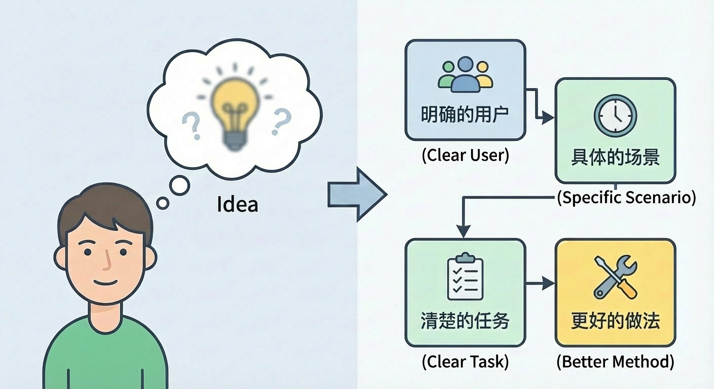
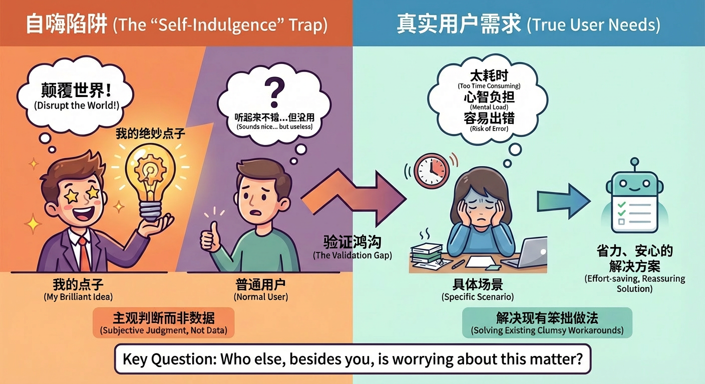
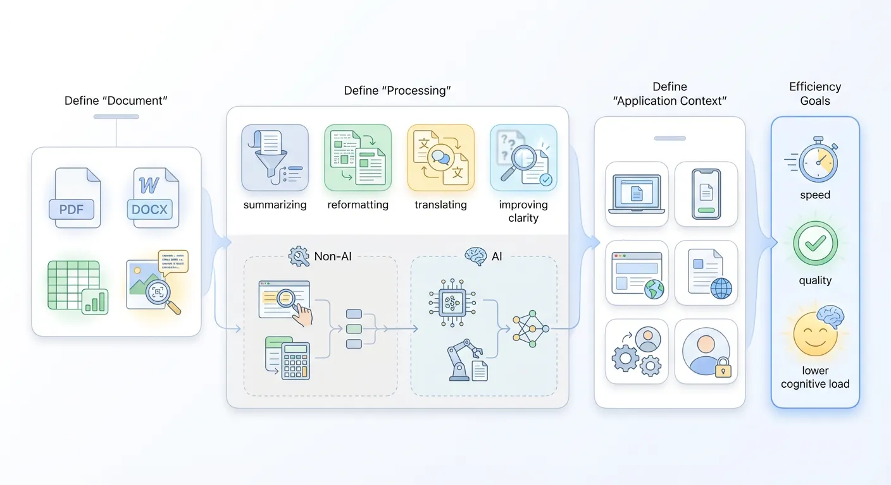
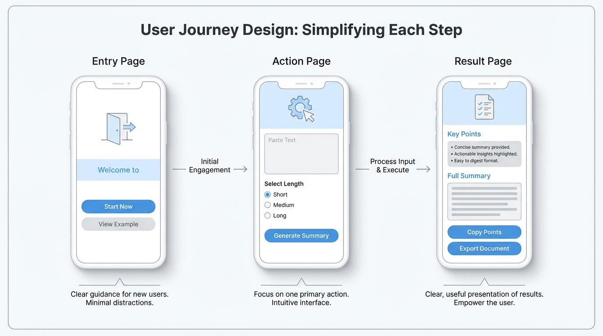
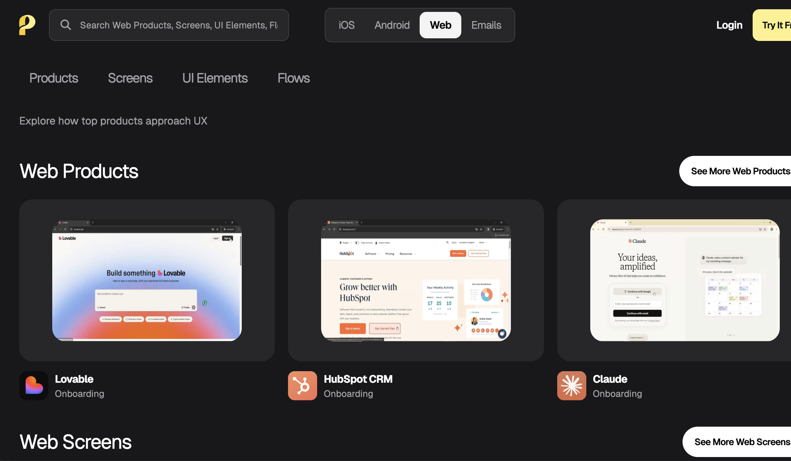
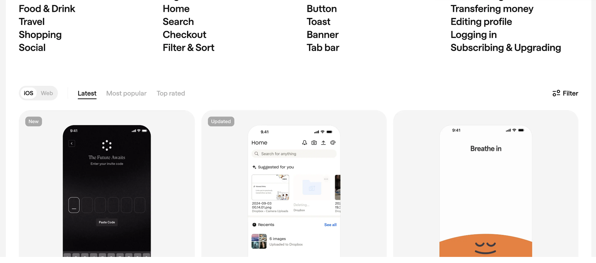
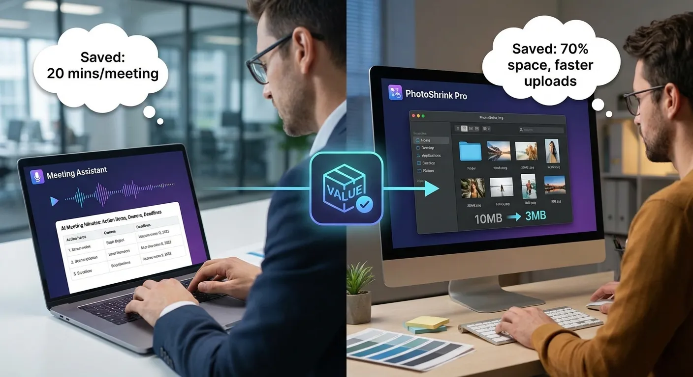
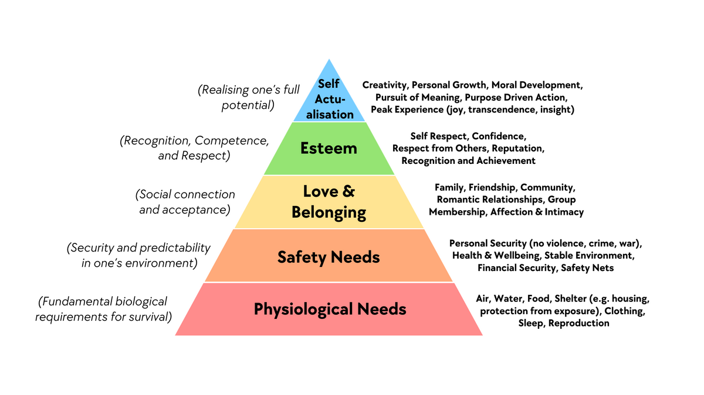
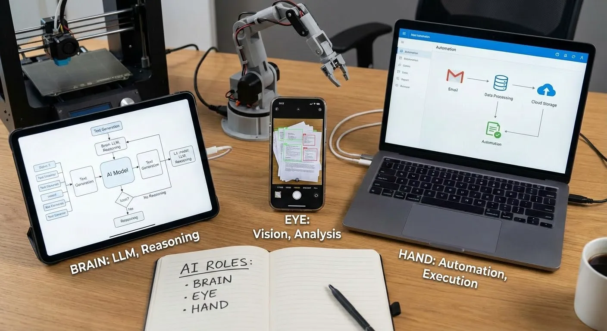

# 제품 사고와 솔루션 설계

## 이 장의 안내

<ChapterIntroduction :duration="duration" :tags="['제품 사고', '요구 분석', '솔루션 설계', '사용자 통찰']" coreOutput="완성된 제품 솔루션 1개" expectedOutput="실제로 구현 가능한 제품 설계 사고">

앞선 장에서 당신은 이미 z.ai와 로컬 AI IDE에서 여러 작은 도구를 만드는 법을 배웠고, Trae로 환경 설정, 의존성 설치 같은 엔지니어링 문제를 처리해 보면서, 아이디어를 브라우저에서 로컬 프로젝트로 옮길 수 있는 능력을 갖추었습니다.

이제부터는 관심의 초점을 <strong>"만들 수 있는가"</strong>에서 <strong>"도대체 무엇을 만들어야 만들 가치가 있는가"</strong>로 옮깁니다.

이번 수업에서는 다음 내용을 체계적으로 다룹니다.
- "아이디어"란 무엇이고, 무엇이 "좋은 아이디어"인가
- 어떤 제품 방향이 투자할 가치가 있는지 어떻게 판단하는가
- 반복 가능한 프로세스로 흐릿한 영감을 명확한 애플리케이션 방안으로 어떻게 바꾸는가

<strong>핵심 목표:</strong> 도구를 만들 줄 아는 단계에서, 실제로 누군가 사용하고 실질적 가치를 만들어 내는 AI 애플리케이션을 만들 수 있는 단계로 올라가는 것입니다.

</ChapterIntroduction>

  <ClientOnly>
    <StepBar :active="0" :items="[
      { title: '아이디어 출처', description: '믿을 만한 제품 아이디어 찾기' },
      { title: '솔루션 분해', description: '아이디어를 만들 수 있는 앱으로 바꾸기' },
      { title: '다듬기와 판단', description: '쓸 수 있음에서 쓰기 좋음으로' },
      { title: 'AI 증폭', description: 'AI를 합리적으로 사용해 가치 만들기' }
    ]" />
  </ClientOnly>

## 당신은 다음 내용을 배우게 됩니다

전체적으로 말하면, 당신은 애플리케이션을 만드는 기본 지식을 배우게 됩니다. 아이디어는 어디에서 오는가 -> 아이디어는 어떻게 앱이 되는가 -> 앱은 어떻게 쓸 수 있는 상태에서 쓰기 좋은 상태가 되는가 -> 앱은 AI를 어떻게 쓰는가 -> 완성 후 사용자는 어떻게 찾는가.

1. 내가 앱을 만들려면, 어디에서 온 아이디어가 믿을 만한가?
2. 아이디어가 생겼다면, 어떻게 만들 수 있는 앱으로 쪼갤 수 있는가?
3. 만든 뒤에는, 어떻게 판단하고 다듬어 "좋은 앱"으로 만들 수 있는가?
4. 어느 단계에서, 어떤 방식으로 AI를 합리적으로 사용해 가치를 키울 수 있는가?
5. 앱이 생겼다면, 어떻게 0에서 첫 번째 진짜 사용자를 찾을 수 있는가?

# 1. 내가 앱을 만들려면, 어디에서 온 아이디어가 믿을 만한가

많은 사람은 앱을 만든다고 하면 가장 먼저 이렇게 생각합니다. 먼저 충분히 기억에 남는 창의적인 아이디어를 떠올려야 한다. 그래서 매일 랭킹을 보고, 기사를 읽고, 여러 인기 제품을 연구하고, 다른 사람의 성공 사례를 바라보며, 언젠가 자신에게도 아주 남다른 아이디어가 찾아오기를 기대합니다.

하지만 실제 상황은 다릅니다. 많은 사람은 사실 애초에 별다른 생각이 없고, 단지 아이디어가 없어서 불안해합니다. 또 어떤 사람은 시작부터 스스로에게 아주 높은 문턱을 세웁니다. 충분히 재미있지 않으면 시작하지 않고, 평범하면 곧 실패라고 생각합니다. 그러나 실제로 조금 앞으로 걸어가 보면, 오래 가고 안정적으로 가는 앱 대부분은 어느 깊은 밤에 머리를 쥐어짜서 나온 것이 아니라, 하나하나의 구체적인 생활 장면 속에서, 실제 문제를 둘러싸고 조금씩 자라난 것임을 알게 됩니다.

그래서 이 장에서 해결하려는 것은 출발점의 문제입니다. **어떻게 해야 아이디어를 가질 수 있을까? 이 아이디어는 도대체 믿을 만한가? 앞으로 시간과 에너지를 투입해 진짜 앱으로 만들 가치가 있는가?**

## 1.1 아이디어란 무엇인가

가장 기초적이지만 자주 무시되는 질문에서 시작해 봅시다. 도대체 무엇을 아이디어라고 부를 수 있을까요.

일상 대화에서 사람들이 말하는 아이디어는 대개 아주 주관적인 흥분감입니다. 길에서 어떤 영상을 보고 순간적으로 이 방향은 정말 멋지다고 느낀 뒤, 나도 비슷한 것을 만들 수 있겠다고 생각할 수 있습니다. 또는 모임에서 어떤 제품이 쓰기 불편하다고 함께 불평하다가, 이런 걸 자동으로 다 처리해 주는 무언가가 있으면 좋겠다고 무심코 말할 수도 있습니다. 이때 당신에게 희미한 생각이 생긴 것은 맞지만, 그것이 실제로 만들 수 있는 물건이 되기까지는 아직 거리가 꽤 멉니다.

여기서는 먼저 조금 더 엄밀한 기준을 세워 보겠습니다. 어떤 생각이 적어도 아래 몇 가지를 만족할 때, 우리는 그것을 아이디어라고 부르겠습니다.

첫째, **명확한 한 종류의 사용자를 향해야 합니다**. 모두를 위한 것이라고 막연히 말하는 것이 아니라, 주로 누가 쓰는지 분명히 말할 수 있어야 합니다. 대학생인지, 사회 초년생인지, 아이를 키우는 부모인지, 독립 개발자인지, 이커머스 판매자인지, 소상공인 대표인지 말입니다. 서로 다른 사람은 같은 일에서도 완전히 다른 지점에 신경을 씁니다. 사람군을 정하지 못했다면, 이후의 모든 판단은 허공에 뜨게 됩니다.

둘째, **구체적인 장면에 뿌리내려야 합니다**. 이 앱은 사용자가 언제 쓰는 것인가요. 아침 출근길 지하철 안에서 쓰는지, 업무 중간에 쓰는지, 잠들기 전에 쓰는지, 주말에 자료를 정리할 때 쓰는지 말입니다. 노트나 작업 관리처럼 추상적으로 보이는 도구도 자세히 관찰해 보면, 실제로 자주 사용되는 부분은 반드시 어떤 장면과 아주 강하게 묶여 있습니다.

셋째, **사용자가 분명한 작업을 완료하도록 도와야 합니다**. 작업이 꼭 거창할 필요는 없지만, 말로 설명할 수 있어야 합니다. 예를 들어 하루의 할 일을 정리하기, 긴 글을 몇 개의 핵심 요점으로 압축하기, 회의에 대해 구조가 분명한 회의록을 생성하기, 또는 한 도시에서 주말 나들이를 위한 실행 가능한 코스를 만들기 같은 것입니다. 작업을 구체적으로 말할수록, 뒤에서 기능을 설계하고 가치를 평가하기가 쉬워집니다.

넷째, **현 상태보다 더 나은 방법이나 도구를 제시해야 합니다**. 사용자는 원래 이 일을 어떻게 하고 있었나요. 머리로 기억했나요, 종이와 펜으로 적었나요, Excel을 썼나요, 스크린샷을 저장했나요, 아니면 여러 앱 사이를 오가며 처리했나요. 당신이 제공하는 것이 분명히 더 수월하고, 더 안정적이고, 더 즐거운 방식이라면, 그 아이디어는 비로소 가치가 생기기 시작합니다.

위와 같은 사고가 잘 정리되지 않아도 괜찮습니다. 지금은 인공지능의 시대입니다. 위 내용을 하나의 완성된 프롬프트로 정리하고, 당신의 생각, 목표 사용자, 사용 장면을 함께 적어 대형 모델에게 보완과 정제를 맡길 수 있습니다. 모델을 언제든 온라인으로 대기하는 제품 공동창업자처럼 여기고, 반복해서 대화하고, 되묻고, 수정하면 흐릿한 개념을 구체화할 수 있습니다.

## 1.2 아이디어와 사용자 요구: 자기만족을 피하는 첫 번째 방어선

많은 사람이 처음 앱을 만들 때 가장 쉽게 빠지는 함정은 자기만족입니다. 이른바 자기만족이란, 자신이 떠올린 창의적 아이디어에 너무 흥분한 나머지 이것이 세상을 뒤흔들 방향이라고 생각하지만, 막상 보통 사용자에게 설명하면 상대의 반응은 매우 차분하거나 심지어 어찌할 바를 모르는 상태가 되는 것입니다. 상대는 예의상 고개를 끄덕이며 꽤 괜찮아 보인다고 말할 뿐입니다. 그러나 제품을 출시한 뒤에는 다운로드도 하지 않고, 오래 사용하지도 않습니다.

이런 상황을 피하려면 아이디어와 사용자 요구를 분리해서 보아야 합니다.

먼저 **사용자 요구**가 무엇인지 이야기해 봅시다. 비교적 간단한 문장으로 요약하면 이렇습니다. 어떤 구체적인 장면에서, **사용자가 어떤 목표를 달성하기 위해 낮추고 싶어 하는 여러 비용, 또는 늘리고 싶어 하는 여러 가치**입니다. 여기서 비용은 돈만 뜻하지 않습니다. 시간, 에너지, 인지 부담, 실수 위험, 심지어 사회적 압박까지 포함합니다. 예를 들어 막 입사한 사회 초년생은 첫 발표에서 덜 긴장하기 위해 템플릿 한 세트에 돈을 낼 수 있습니다. 아이를 키우는 부모는 매일 30분만이라도 자기 시간이 보장된다면 조금 더 비용을 지불할 수 있습니다.

이 점을 이해하고 나면, **단순히 멋져 보이는 것만으로는 요구가 성립하지 않는다**는 사실을 알게 됩니다. 많은 창의적 아이디어는 확실히 새롭고 신기합니다. 그러나 사용자가 어떤 구체적 목표를 이루는 데 더 수월하고, 더 안심되고, 더 자신감 있게 만들지 못한다면, 진짜로 지속 가능한 앱을 떠받치기 어렵습니다.

아이디어와 요구 사이에는 자주 무시되는 간극이 있습니다. **아이디어가 나타내는 것은 데이터가 뒷받침한 사실이 아니라 당신의 주관적 판단**입니다. 당신이 무엇을 재미있어 하는지, 무엇을 흥미롭게 느끼는지, 무엇이 앞서 보인다고 생각하는지입니다. 요구는 사용자가 실제로 무엇을 겪고 있으며, 어떤 일 때문에 고민하는지를 뜻합니다. 당신은 자동으로 시를 생성하는 기능이 아주 멋지다고 생각할 수 있습니다. 하지만 대부분의 사용자에게는 매일 반복 정리 작업에서 10분을 덜 쓰게 해 주는 도구가 더 매력적일 수 있습니다. 물론 당신이 스티브 잡스처럼 아주 뛰어난 디자인 미감과 설득력을 갖추어 사람들이 "자동 시 생성 기능"도 매우 멋지다고 느끼고 자발적으로 따르게 만들 수 있다면 예외입니다. 다만 이는 어느 정도 어렵습니다.

어떤 생각을 판단할 때 간단한 구분 방법이 있습니다. 그것이 **진짜 요구에 가까운지, 가짜 요구에 가까운지**를 보는 것입니다. 진짜 요구의 뚜렷한 특징은, 지금 당신의 앱이 없어도 사용자가 이미 그 문제를 해결하려고 능동적으로 방법을 찾고 있다는 점입니다. 기존 방법이 서툴고 번거롭더라도, 사용자는 여전히 시간과 에너지, 심지어 돈을 들여 그 구멍을 메우려 합니다. 예를 들어 어떤 사람은 반복 노동을 조금 줄이기 위해 직접 방안을 쓰거나 스크립트를 작성합니다. 이런 장면에서 당신이 더 친절하고 더 보편적인 해결책을 제공할 수 있다면, 제품이 설 자리가 생길 가능성이 큽니다.

가짜 요구의 전형적인 상황은 정반대입니다. 당신이 먼저 꺼내지 않으면 대부분의 사람은 그것이 문제라는 사실을 의식하지 못하고, 반드시 해결해야 한다고 느끼지도 않습니다. 당신이 묘사하는 사용 장면은 사용자의 일상생활보다 당신의 상상 속에 더 많이 존재합니다. 그들은 소개를 듣고 나서도 이것이 좋고 재미있다고 느낄 뿐, 돈을 내지 않고, 심지어 돌아서면 잊어버립니다. 이런 아이디어는 이야기를 쓰는 데는 괜찮을 수 있지만 제품을 만드는 데는 매우 위험합니다.

그래서 **자기만족을 피하는 첫 번째 방어선은 사용자 요구를 이해하는 것**입니다. 시작할 때부터 당신은 겉보기에는 단순하지만 매우 중요한 질문에 답하도록 스스로를 몰아붙여야 합니다. 나 자신 말고, 누가 이 일 때문에 진지하게 골머리를 앓고 있는가. 포럼, 커뮤니티, 댓글 영역을 볼 수도 있고, 주변에서 사용자가 될 가능성이 있는 몇 사람에게 직접 물어볼 수도 있습니다. "나는 매번 이 일 때문에 발목이 잡힌다"거나 "지금 방식은 정말 너무 번거롭다"와 같은 실제 감정이 담긴 불평을 듣기 어렵다면, 그 아이디어는 실제 요구와 아직 거리가 있다는 뜻입니다.

## 1.3 좋은 아이디어는 왜 좋은 아이디어인가

모든 아이디어가 같은 운명을 갖는 것은 아닙니다. 어떤 아이디어는 며칠만 들여 거칠지만 흐름이 돌아가는 버전을 만들어도, 자연스럽게 소수의 진짜 사용자를 끌어들입니다. 그들은 남아 있고, 인내심 있게 의견을 줍니다. 반면 어떤 아이디어는 기능을 필사적으로 쌓고, 광고에 돈을 쓰고, 여러 플랫폼에서 많은 홍보를 하더라도, 결국 외부 힘으로 잠깐 데이터를 쌓을 뿐 얼마 지나지 않아 조용해집니다.

그 뒤의 가장 본질적인 차이는 아이디어 자체가 어떤 핵심 문제 지점을 밟고 있는가입니다.

**좋은 아이디어는 자연스럽게 성장을 맞이할 수 있습니다**. 매우 조악한 형태로 나타나더라도, 심지어 간단한 버튼 몇 개만 있더라도, 사용자가 당장 겪는 구체적인 작은 불편을 해결할 수만 있다면 일정 수준의 자연 성장을 얻을 수 있습니다. 예를 들어 음성을 빠르게 문자로 바꿔 주는 작은 도구는 처음에는 웹페이지 하나와 간단한 버튼 몇 개뿐일 수 있습니다. 하지만 인식 품질이 충분히 좋고 기능 전환이 아주 자연스럽다면, 많은 사람이 주변 친구에게 링크를 보내고 싶어 합니다. 그야말로 시간을 절약해 주기 때문입니다.

**나쁜 아이디어는 대개 처음부터 외부 힘에 의존해야 할 운명입니다**. 겉모습이 아주 좋고 내부가 매우 고급스러워 보이더라도, 계속 밀어붙이고, 계속 외치고, 계속 설명해야 합니다. 그리고 사람을 끌어오는 행동이 조금만 느려지면 사용 데이터는 곧장 떨어집니다. 자원을 쏟고, 협업을 끌어오고, 이벤트를 열어도 언제나 물살을 거슬러 올라가는 느낌이 듭니다. 문제는 실행이 부족한 것이 아니라, 그 지점 자체가 충분히 실제적인 고통을 맞히지 못했다는 데 있습니다.

물론 위 상황이 절대적인 것은 아닙니다. 예를 들어 초기 시장에서는 사용자가 가치를 뒤늦게 인식하는 지연성이 있을 수 있고, 경쟁 제품이 있는 경우에는 외관, 조작 난이도, 브랜드 특성 등을 고려해야 합니다. 하지만 이는 더 깊은 내용이므로 지금은 잠시 다루지 않습니다.

따라서 어떤 아이디어에 계속 투자할지 논의할 때 진짜로 보아야 할 것은 창의성 자체가 얼마나 화려한지가 아닙니다. 그것이 문제에서 솔루션으로 이어지는 경로를 자연스럽게 자라나게 할 수 있는가입니다. 우리는 아이디어를 통해 자신이 얼마나 창의적인지 남에게 증명하려는 것이 아닙니다. 가치 있는 출발점을 찾고, 그 길을 따라 작은 도구를 진짜 쓰기 좋은 앱으로 천천히 다듬기 위해 아이디어를 다룹니다.

선택은 노력보다 중요합니다.

## 1.4 좋은 아이디어는 어디에서 오는가: 네 가지 출처와 구체적 예시

많은 사람이 아이디어를 떠올린다고 하면, 책상 앞에 혼자 앉아 천장을 보며 언젠가 영감이 갑자기 떨어지기를 기다리는 장면을 떠올립니다. 하지만 현실의 좋은 아이디어는 대부분 그렇게 오지 않습니다. 그것들은 생활 속 작은 관찰, 커뮤니티에서 반복되는 질문, 인터넷에 쌓이는 불평, 그리고 이미 존재하는 제품 속에서 조금씩 걸러져 나옵니다.

아래 네 가지 출처를 진지하게 실행한다면, 그 안에서 시작할 수 있는 방향을 쉽게 캐낼 수 있습니다.

### 자신의 삶을 사랑하기

아주 소박하지만 효과적인 원칙이 있습니다. **당신이 삶에 더 깊이 참여할수록 문제를 더 쉽게 발견하고, 무엇이 해결할 가치가 있는 문제인지 판단하는 능력도 더 커집니다**. 여기서 참여감이란, 화면 너머로 다른 사람이 사는 모습을 보는 것이 아니라, 직접 경험하고, 시도하고, 시행착오를 겪는 것입니다. 자신의 취미와 관심사를 진지하게 대할수록, 그것은 아이디어가 자라나는 비옥한 토양이 될 가능성이 커집니다.

예를 들어 당신이 고양이를 아주 좋아한다면, 고양이와 함께 사는 당신의 하루는 "고양이 키우기 팁" 영상 100개를 보는 것보다 더 많은 정보를 줍니다. 고양이가 어디에서 물건을 가장 잘 넘어뜨리는지 알게 되고, 매일 어느 시간에 가장 뛰어다니는지, 어떤 상황에서 스트레스를 가장 잘 받는지 기억하게 됩니다. 모래를 치우고, 털을 정리하고, 발톱을 깎고, 병원에 가는 세부 사항도 직접 겪게 됩니다. **조금이라도 매끄럽지 않았던 모든 경험은 사실 잠재적인 제품 단서입니다**.

고양이 사진을 찍는 일을 생각해 봅시다. 많은 사람이 이런 일을 겪습니다. 자신은 휴대폰을 들고 있는데 고양이는 도무지 렌즈를 보지 않습니다. 고개를 숙여 발을 핥거나 다른 구석만 바라봅니다. 그렇다면 휴대폰이나 태블릿 화면에 자동으로 움직이는 빨간 점, 깃털, 작은 벌레 애니메이션이 나타나 고양이의 시선을 끌어 주는 작은 도구를 만들 수는 없을까요? 촬영 버튼을 누르면 그것이 자동으로 전면 카메라 근처를 한 바퀴 돌며 고양이의 시선을 렌즈 방향으로 "속여" 오고, 동시에 연속 촬영을 해서 그중 선명하고 예쁜 한 장을 골라 줍니다. 한 걸음 더 생각하면, 이 앱은 고양이마다 어떤 색, 어떤 이동 경로에 가장 흥미를 보이는지도 기록하고, 다음에는 그 고양이만의 전용 낚시 모드를 자동으로 사용해 성공률을 높일 수 있습니다.

당신이 화장이나 스킨케어 과정을 즐긴다면, 집 화장대 위의 모든 제품 뒤에는 많은 시행착오와 의사결정이 숨어 있습니다. 매번 메이크업 사진을 휴대폰 앨범에 찍어 두는 데 이미 익숙할 수 있습니다. 하지만 나중에 돌아볼 때마다 그날 어떤 립스틱과 어떤 아이섀도 팔레트를 썼는지 하나하나 떠올려야 합니다. 그렇다면 이런 정보를 체계적으로 기록해서 나만의 메이크업 도감을 만들 수 있지 않을까요? 더 나아가 앱이 어떤 메이크업을 어떤 상황에서 가장 많이 사용했는지, 어떤 조합이 사진에서 가장 잘 나왔는지 통계로 보여 줄 수도 있습니다. 그러면 매번 화장을 고를 때 처음부터 다시 생각하지 않아도 됩니다.

더 구체적으로 말하면, 많은 사람에게는 이런 장면이 있습니다. 아침에 시간이 급한데 앨범을 열어 "지난번에 성공했던 출근 메이크업"을 찾고 싶습니다. 그런데 한참을 넘겨도 그때 정확히 어떤 제품을 썼는지 기억나지 않습니다. 그렇다면 사진을 찍은 뒤 휴대폰에 대고 "오늘은 면접 메이크업, 01호 오렌지 브라운 아이섀도 팔레트와 말린 장미색 립스틱을 썼어"라고 말하기만 하면, 앱이 자동으로 인식해 사진과 연결된 "메이크업 레시피"를 생성해 주는 작은 기능을 만들 수 있지 않을까요? 다음에는 "면접", "오렌지 브라운 아이섀도", "말린 장미색"만 검색하면 관련 메이크업을 한 번에 볼 수 있고, 심지어 "오늘은 출근에 어울리고 5분 안에 끝낼 수 있는 것만 보기" 같은 추천 목록도 자동으로 생성할 수 있습니다. 매일 아침 절약되는 그 몇 분이 사실은 아주 구체적인 "해결된 문제"입니다.

당신이 시티 워크나 여러 형태의 느린 여행을 좋아한다면, 이미 여러 도구를 조합해 자신의 경험을 만들고 있을 수 있습니다. 지도 앱으로 경로를 기록하고, 메모 앱에 가고 싶은 카페를 적고, 앨범에는 길에서 찍은 사진과 감상이 흩어져 있습니다. 그렇다면 경로, 방문 지점, 사진, 글을 시간선과 이야기가 있는 걷기 기록으로 함께 엮어 주는 앱이 있을 수 있지 않을까요? 더 나아가 당신의 경로를 친구에게 한 번에 공유해, 같은 도시에서 그들도 다른 버전을 걸어 볼 수 있게 할 수도 있습니다.

더 일상적인 작은 세부 사항을 파고들 수도 있습니다. 많은 사람은 시티 워크를 할 때 "지금 이 모퉁이가 정말 예쁘다고 느꼈는데, 집에 돌아가면 지도에서 그 지점을 전혀 찾을 수 없다"는 좌절감을 겪습니다. 그렇다면 아주 가벼운 기능을 만들 수 있지 않을까요? 느낌 있는 길모퉁이에 도착했을 때 이어폰 버튼을 길게 누르고 "표시해 줘, 여기는 데이트 산책에 아주 어울리는 길이야"라고 한마디만 하면, 앱이 현재 위치에 음성 메모가 붙은 마커를 즉시 찍고, 시간, 날씨, 소음 수준을 자동으로 기록합니다. 이후 당신이나 친구가 이 도시의 지도를 열면 "길에서 직접 검증된 분위기 지점"을 볼 수 있습니다. 어디가 혼자 멍때리기 좋은지, 어디가 야경 보기 좋은지, 어디가 친구와 걸으며 이야기하기 좋은지 알 수 있습니다. 원래라면 "지나가면 잊히는" 작은 길모퉁이들이 이렇게 조금씩 질감 있는 도시 경험 데이터베이스로 자랍니다.

이 예시들이 설명하려는 것은 사실 하나뿐입니다. **당신은 자신의 삶을 사랑해야 하며, 삶은 최고의 아이디어 출처입니다**. 매일 만나는 곤란함, 임시로 떠올린 우회 방법, 조금 귀찮지만 계속 참고 있던 지점들은, 당신이 조금 더 들여다보고 작은 도구로 바꿀 수 없을지 한 번 더 묻기만 한다면 모두 미래 제품의 초기 형태가 될 수 있습니다.

### 당신이 가진 사람 자산에서 캐내기

사람 자산이란 쉽게 말해 당신이 이미 도달할 수 있는 사람들의 집단입니다. 당신의 독자일 수도 있고, 운영하는 커뮤니티일 수도 있고, 당신이 속한 회사의 내부 동료 그룹일 수도 있으며, 오랫동안 참여해 온 어떤 취미 커뮤니티일 수도 있습니다. 어떤 경로든 **일정한 사람들의 일상 대화, 불만, 기대를 안정적으로 들을 수 있다면**, 당신은 완전히 0에서 시작하는 사람보다 훨씬 큰 이점을 갖고 있습니다.

흔한 예를 들어 봅시다. 당신이 디자이너 커뮤니티 운영자라면, 매일 그룹 안에서 보는 내용은 사실 매우 귀중한 요구 풀입니다. 누군가는 클라이언트가 계속 수정 요청을 반복한다고 불평하고, 누군가는 특정 소재 사이트의 과금 방식이 불만이라고 말하고, 누군가는 서로 다른 사이즈 규격 사이를 오가며 조정하는 데 시간이 너무 낭비된다고 느낍니다. 모든 불평 뒤에는 잠재적인 제품 단서가 숨어 있습니다. 예를 들어 한 세트의 디자인을 여러 주요 플랫폼의 사이즈 비율로 한 번에 생성해 주는 간단한 사이즈 맞춤 도구를 만들 수 있습니다. 또는 자주 쓰는 컴포넌트를 저장하고 재사용할 수 있는 작은 도구를 만들어, 디자이너가 반복 노동을 더 적은 시간으로 끝내도록 도울 수 있습니다.

당신이 속한 곳이 시험 준비 커뮤니티라면, 그룹 안에는 장기적으로 비슷한 화제가 가득할 수 있습니다. 오늘 컨디션이 안 좋다, 계획이 또 밀렸다, 어떤 자료를 봐야 더 효율적인가, 어떻게 해야 출석 체크를 계속할 수 있는가 같은 이야기입니다. 당신은 허공에서 상상할 필요가 없습니다. 일정 기간 관찰하고, 사람들이 반복해서 말하는 몇 가지 공통 난제를 정리하기만 하면, 학습 앱의 초기 기능 방향을 대략 그릴 수 있습니다. 예를 들어 더 합리적인 목표 분해, 더 인간적인 체크인 피드백, 더 실제적인 진도 시각화 같은 것입니다.

이런 장면에서 처음부터 모두를 대상으로 하는 크고 완전한 제품을 만들려 할 필요는 없습니다. 당신이 인정해야 할 것은 하나입니다. 지금 손에 쥔 이 작은 사람 집단이 최고의 출발점입니다. 그들을 깊이 이해할수록, 그들의 실제 생활 속에서 말로 표현되는 고민과 말로 표현되지 않는 작은 불편을 더 잘 알수록, 진짜로 사용되는 물건을 만들 기회가 커집니다.

### 공개된 공간에서 요구 캐내기

아직 자신의 커뮤니티나 독자 집단이 전혀 없어도 걱정할 필요는 없습니다. 인터넷에서는 매일 수많은 사람이 여러 플랫폼에서 자신의 어려움과 불만을 큰 소리로 말하고 있습니다. 공개된 공간의 이런 목소리 자체가 거대한 보물창고입니다. 다만 대부분의 사람이 진지하게 들으려 하지 않았을 뿐입니다.

당신은 관심 있는 업계와 관련된 플랫폼 몇 곳을 정하고, 감정이 담긴 키워드를 정기적으로 검색할 수 있습니다. 예를 들어 **너무 귀찮다, 추천 있나요, 어떻게 해결하지, 정말 번거롭다, 더 좋은 방법 없나요** 같은 표현입니다. 그리고 글과 댓글을 끈기 있게 읽으면서 두 종류의 정보에 특히 주목합니다.

한 종류는 어떤 문제가 오랫동안 반복해서 언급되는 경우입니다. 예를 들어 구직 게시판에서는 일정 기간마다 이력서를 어떻게 써야 하는지, 자기소개를 어떻게 준비해야 하는지, 면접 결과를 어떻게 후속 확인해야 하는지 묻는 사람이 나타납니다. 육아 부모 집단에서는 이유식 조합, 생활 리듬 조정, 부모와 아이의 소통 같은 곤란함이 반복해서 등장합니다. 소상공인 교류 커뮤니티에서는 재고 관리, 현금 흐름, 직원 근무표를 언제나 걱정할 수 있습니다. 이런 장기적으로 존재하는 반복 문제는 한 업계가 반복해서 드러내는 시스템적 고통입니다.

다른 한 종류는 어떤 장면에서 사용자가 매우 서툰 방식으로 억지로 버티고 있는 경우입니다. 예를 들어 어떤 사람은 모든 할 일을 종이에 쓰고 다시 사진을 찍어 클라우드에 올립니다. 어떤 사람은 한 형식의 내용을 다른 형식으로 바꾸기 위해 여러 앱 사이를 오가며 복사하고 붙여넣습니다. 어떤 사람은 서로 다른 채널의 데이터를 직접 하나의 표로 모읍니다. 이런 지점은 마음을 기울여 관찰하면 프로세스화하고 도구화할 수 있는 작은 절개면을 많이 발견하게 됩니다.

공개된 공간에서 요구를 캐내는 것은 사실 한 가지 능력을 훈련하는 일입니다. 자신을 방관자에서 포착자로 바꾸는 능력입니다. 이런 키워드를 습관적으로 검색하고, 사례를 습관적으로 기록하면, 당신의 머릿속에는 현실 문제에 대한 민감도가 천천히 쌓입니다. 이 민감도는 이후 제품 설계 과정에서 여러 번 당신을 도와줄 것입니다.

### 거인의 어깨 위에 서기

또 자주 무시되는 아이디어 출처는 기존 제품과 프로젝트입니다. 이 세상에는 이미 너무 많은 뛰어난 사람이 우리 대신 여러 탐색의 길을 걸어 보았습니다. 매번 백지에서 시작할 필요는 없습니다. 다른 사람이 이미 절반쯤 해 놓은 곳에 서서 한 걸음 더 나아가면 됩니다.

**해커톤 행사, 제품 혁신 대회, 창업 데모 데이** 같은 자리에는 대개 흥미로운 작은 작품이 많이 등장합니다. 그것들은 대부분 두 가지 특징이 있습니다. 시간이 부족하고, 자원이 제한되어 있습니다. 이는 지금 당신이 만들려는 작은 앱과 꽤 비슷합니다. 그래서 수상작을 볼 때는 두 가지 질문을 더 던져 볼 수 있습니다. 이 물건이 더 좁은 세분화 사용자만 서비스한다면 더 쉽게 구현될까. 기능을 절반, 심지어 3분의 2까지 잘라 내고 가장 핵심적인 한 고리만 남기면 오히려 더 명확해질까.

마찬가지로 **제품 랭킹, 오픈소스 프로젝트, 도구 모음 사이트**에 나열된 도구들도 모두 사고의 출발점이 될 수 있습니다. 관심 있는 것을 몇 개 고른 뒤 하나씩 분해해 볼 수 있습니다. 누구의 어떤 일을 해결하는가, 지금 형태에는 어떤 뚜렷한 빈틈이 있는가, 다른 장면이나 다른 나라로 옮기면 어떤 차이가 생기는가. 당신은 표절하려는 것이 아니라, 이런 분해 연습을 통해 문제와 솔루션 사이의 관계를 이해하는 감각을 훈련하는 것입니다.

오프라인 세계도 마찬가지입니다. 병원 접수 대기, 식당 대기, 행정기관에서 같은 정보를 여러 번 적는 일, 종이 양식에 같은 내용을 반복해서 쓰는 일을 겪을 때마다 의식적으로 멈춰서 스스로에게 물을 수 있습니다. 여기에 **시스템화, 디지털화, 자동화할 여지**가 있는가. 지저분하고 반복적이며 비효율적으로 보이는 장면들은 본질적으로 미래의 어떤 도구가 자라날 토양입니다.

이 네 경로에서 장기적으로 소재를 캐내다 보면, 아이디어는 머릿속에 갑자기 나타나는 기적이 아니라, 당신이 생활, 타인, 정보 세계와 장기간 상호작용한 뒤 자연스럽게 자라나는 부산물임을 알게 됩니다.

## 1.5 좋은 아이디어를 한 문장으로 요약하는 법: 적을수록 많아지는 기술

아이디어가 대략 어디에서 오는지 알았다면, 다음으로 중요한 연습은 **그것을 한 문장으로 명확하게 말해 보는 것**입니다. 이 연습은 간단해 보이지만 실제로는 꽤 잔혹합니다. 왜냐하면 당신에게 한 가지 사실을 마주하게 하기 때문입니다. **당신의 아이디어는 정말로 명확한 핵심을 붙잡고 있는가.**

사람이 다른 사람을 기억하는 이유는 상대가 모든 면을 갖추었기 때문이 아닌 경우가 많습니다. 오히려 어떤 뚜렷한 특징 때문인 경우가 많습니다. 항상 특정한 모자를 쓰거나, 말투가 매우 안정적이거나, 토론할 때마다 결정적인 한마디를 던지는 것일 수 있습니다. 제품도 마찬가지입니다. **상대가 열몇 가지 기능을 억지로 기억하게 하는 것보다, 소박하지만 분명한 인상을 갖게 하는 편이 낫습니다.**

이 한 문장을 쓸 때 흔한 오해는 지나치게 넓게 쓰는 것입니다. 예를 들어 "이것은 사용자의 영어 실력을 높여 주는 앱입니다"라고 말할 수 있습니다. 얼핏 틀리지는 않습니다. 하지만 더 깊이 물어보면, 이 문장은 거의 아무것도 말하지 않습니다. 누구를 돕는가. 완전 초보 학생인가, 이미 직장에 다니는 사람인가. 어떤 방식으로 돕는가. 단어 암기인가, 듣기 훈련인가, 말하기 교정인가, 글쓰기 첨삭인가. 얼마나 시간을 들여야 하고, 얼마나 큰 변화가 생기는가. 모든 핵심 정보가 희석되어 버렸습니다.

조금 더 나은 표현은 훨씬 구체적입니다. 예를 들어 "매일 출퇴근 시간 10분을 활용해 한 달에 핵심 단어 100개를 외우게 하는 단어 암기 앱"이라고 할 수 있습니다. 여기에는 적어도 세 가지가 설명되어 있습니다. 사용 비용이 통제 가능합니다. 매일 10분이면 됩니다. 기대 결과가 보입니다. 한 달에 새 단어 100개입니다. 장면이 명확합니다. 주로 출퇴근이지 다른 자투리 시간이 아닙니다. 사용자는 이런 설명을 들으면 자신에게 쓸모가 있는지 머릿속에서 빠르게 판단할 수 있습니다.

이 한 문장을 쓰는 과정은 사실 세 질문에 답하도록 자신을 반복해서 몰아붙이는 과정입니다. **당신은 도대체 누구를 돕는가, 그들이 어떤 장면에서 당신을 떠올리기를 바라는가, 당신은 어느 정도 시간 안에 어떤 결과를 달성하도록 돕고 싶은가.** 화려한 수사를 조금 희생하더라도 이 정보들을 하나로 붙일 수 있을 때, 당신의 아이디어는 비로소 이해되고 전파될 수 있는 것이 됩니다.

이 훈련을 거꾸로 자신에게 적용할 수도 있습니다. 앞으로 3년에 대해 한 문장 설명을 써 보세요. 예를 들어, 3년 뒤에는 내가 주로 어떤 사람을 위해 어떤 문제를 해결하고 있으며, 어떤 눈에 보이는 성과를 냈는지 한두 문장으로 설명할 수 있기를 바란다고 쓸 수 있습니다. 이런 훈련은 선택을 할 때 더 분명해지게 합니다. 어떤 일은 반드시 붙잡아야 하고, 어떤 일은 적절히 내려놓아도 되는지 알게 합니다. 버리는 법을 배우는 것은 더하는 법을 배우는 것보다 어렵지만 올바른 일입니다.

이런 표현을 어디에서 배워야 할지 모르겠다면 간단합니다. 매일 사용자의 주의를 얻기 위해 문구를 다듬는 콘텐츠를 보세요. **앱 마켓의 한 문장 소개, 게임과 도구 제품이 공식 홈페이지 첫 화면에 내거는 메인 제목, 여러 랜딩 페이지의 핵심 문구**를 참고할 수 있습니다. 그것들을 베껴 적고, 구조로 분해하고, AI를 바탕으로 자신의 아이디어에 맞는 새로운 문안을 써 보면 됩니다.

## 1.6 AI로 사고를 확장하고 차별점 찾기

예전에는 아이디어를 생각할 때 대부분 사람이 직접 천천히 궁리하는 수밖에 없었습니다. 이제는 AI가 있으므로 언제든 부를 수 있는 브레인스토밍 파트너가 하나 더 생긴 셈입니다. 잘 사용하면 사고의 공간을 크게 넓힐 수 있습니다.

어떤 방향에서 막혀 머릿속 생각이 몇 가지 사이에서만 맴돈다고 느낄 때는, 지금 가진 아이디어를 가능한 한 명확하게 AI에게 설명하고 몇 가지 일을 부탁해 보세요. 예를 들어 **같은 핵심 작업을 바탕으로 서로 다른 사용자 집단 20가지를 나열해 달라**고 하거나, 학생, 프리랜서, 아이를 키우는 부모, 소상공인 같은 여러 관점에서 이 아이디어의 가능한 사용 방식을 다시 설명해 달라고 할 수 있습니다. 또는 제품 매니저, 운영, 마케팅, 기술 역할에 서서 각각 무엇을 신경 쓰는지 제안해 달라고 할 수도 있습니다.

그러면 원래는 능동적으로 떠올리지 않았을 사용 장면이 이 단계에서 많이 던져지는 것을 보게 됩니다. 당신의 임무는 그 제안을 단순히 받아들이는 것이 아니라, 확장된 공간 안에서 **당신이 가장 잘 이해하고 자원 우위가 있는 작은 조각을 골라내는 것**입니다. 예를 들어 AI가 많은 업계를 나열했지만, 당신은 교육과 콘텐츠 창작 장면에 특히 감이 있다고 발견할 수 있습니다. 그러면 이 두 방향을 우선해서 더 아래로 분해할 수 있습니다.

이 과정에는 또 중요한 원칙이 있습니다. **흔한 아이디어가 반드시 무효한 아이디어인 것은 아닙니다**. 많은 초보자는 겉보기에 흔한 방향을 모두 피해야 한다고 생각합니다. 누군가 이미 한 것은 기회가 없다고 느끼기 때문입니다. 하지만 실제 세계는 그렇게 단순하지 않습니다. 단어 암기, 할 일 목록, 가계부, 습관 체크인처럼 흔해 보이는 방향이 계속 만들어지는 이유는 그 뒤의 문제가 실제로 널리 존재하기 때문입니다. 이런 경우 경쟁의 핵심은 완전히 새로운 거대 창의성이 있는지가 아니라, **누가 어떤 작은 사람 집단을 더 잘 이해하고, 누가 세부를 그들의 생활에 더 가깝게 만들 수 있는가**입니다.

초보자가 가장 쉽게 떠올리는 아이디어를 먼저 한 묶음 나열할 수 있습니다. 단어 암기 도구, 매일 체크인 앱, 독서 노트 도우미, 이력서 생성기, 습관 형성 도구 같은 것들입니다. 그런 다음 각각에 대해 AI와 한 차례 분해를 해 보고, 세 질문에 집중하세요. 내가 디자이너, 변호사, 초보 엄마, 대학원생처럼 아주 구체적인 사람 집단만 서비스한다면 이 아이디어는 어떻게 달라질까. 출퇴근길, 점심시간 10분, 잠들기 전 30분처럼 고정된 장면만 겨냥한다면 기능과 표현을 더 집중시킬 수 있을까. **결과 표현을 극단적으로 잘 만든다면, 예를 들어 더 공유하기 쉽고, 더 인쇄하기 쉽고, 다른 시스템으로 더 가져가기 쉽다면, 그것만으로 차이가 될 수 있을까.**

여기서 AI의 가치는 당신 대신 결정하는 데 있지 않습니다. 원래 아주 좁았던 길을 더 완전한 지도로 바꾸도록 돕는 데 있습니다. 어떤 영역은 이미 다른 사람이 깊이 파고들었고, 어떤 구석은 아직 비교적 비어 있는지 더 빨리 볼 수 있습니다. 그리고 결국 어느 길을 걸을지는 언제나 오래된 질문으로 돌아갑니다. 어떤 곳이 당신이 진심으로 신경 쓰고, 충분히 깊이 이해하고, 장기적으로 투자할 의지가 있는 곳인가.

이 모든 것의 마지막에서, 다시 한 번 그 최저선을 강조해야 합니다. 아이디어와 창의성에 관한 어떤 논의든 최종적으로는 사용자 요구로 돌아가야 합니다. AI로 사고를 보조하고 변형을 더 빨리 생성할 수는 있습니다. 하지만 브레인스토밍을 몇 차례 했든, 최종 판단 기준은 변하지 않습니다. 이 생각이 어떤 사람 집단의 실제 고통에 정말 응답하는가. 그들이 이미 반복해서 해결하려 하는 문제에서 한 걸음 앞으로 나아가게 하는가.

## 소결

당신은 몇 가지 간단한 차원으로 아이디어가 충분히 명확한지 검토하는 법을 배워야 합니다. 내가 멋지다고 느끼는 것과 사용자가 정말 필요로 하는 것의 차이를 구분해야 합니다. 좋은 아이디어가 좋은 이유는 처음부터 어떤 고통 지점을 밟고 있기 때문임을 알아야 합니다. 자신의 생활, 사람 자산, 공개 정보, 기존 제품에서 지속적으로 단서를 캐내는 법을 배워야 합니다. 아이디어를 한 문장으로 말하는 연습도 해야 합니다. 또한 AI를 판단을 대신하는 도구가 아니라 사고를 확장하는 파트너로 삼는 법을 배워야 합니다.

손안에 이런 아이디어가 1개에서 3개 정도 있고, 각각이 **누구를 위한 것인지, 어떤 장면에서 쓰이는지, 대략 어떤 결과를 가져올지 한 문장으로 설명할 수 있다면**, 이제 새 아이디어를 더 떠올리려는 충동을 멈추고 다음 단계로 주의를 옮길 수 있습니다. 그중 하나를 어떻게 실제로 만들 수 있고, 실제 사용자가 쓸 수 있는 앱으로 분해할 것인가입니다.

이 아이디어가 조금 별로라면 어떻게 할까요? 괜찮습니다. 처음에 별로인 것이 오히려 정상입니다. **완성은 언제나 완벽보다 중요합니다**. 먼저 시작해야 결말도 생깁니다.

## 📚 Assignments

위 내용을 바탕으로 다음 과제를 완료하세요.

1. 자신의 관심사와 결합해 AI를 사용하여 몇 가지 앱 "아이디어"를 생성합니다.
2. AI가 자신의 생각을 바탕으로 이것이 진짜 요구인지 가짜 요구인지 평가하고, 사용자 요구 통찰과 제안을 제시하게 합니다.
3. 네 가지 출처 중 하나 또는 두 개를 골라 "아이디어"를 얻거나, AI가 몇 가지 앱 "아이디어"를 생성하게 합니다.
4. 위의 모든 아이디어 중 가장 마음에 드는 세 가지를 고르고, 정보량이 풍부한 한 문장으로 그 아이디어를 요약해 봅니다.

# 2. 아이디어가 생겼다면, 어떻게 만들 수 있는 앱으로 쪼갤 수 있는가

앞 장에서 해결한 것은 출발점의 문제였습니다. 도대체 어떤 아이디어가 진지하게 다룰 만한가.

진짜 도전은 여기서부터 시작됩니다. 많은 사람이 바로 이 단계에서 넘어집니다. 머릿속에는 완성된 것처럼 보이는 청사진이 있지만, 막상 손을 대면 너무 복잡해서 어디서부터 시작해야 할지 모릅니다. 기능이 너무 많고, 페이지가 너무 많고, 기술도 무서워 보입니다. 그래서 계속 미루다가 결국 **자기 위안** 한마디가 됩니다.

"**괜찮아, 이건 나중에 기회가 되면 만들면 되지...**"

생각만 하지 마세요. 바로 지금입니다. 이 장에서 하려는 일은, 아이디어를 만들 수 있는 버전으로 분해하는 방법을 배우도록 돕는 것입니다. 무에서 유를 만드는 일은 천재성에 의존하지 않고, 반복해서 연습할 수 있는 구체적인 동작들에 의존한다는 것을 보게 됩니다. **발산, 수렴, 분해, 세분화, 참고, 질문**입니다. 이 순서대로 하면 팀이 없어도, 시간이 많지 않아도, 하나의 아이디어를 흐름이 돌아가는 앱 데모로 바꿀 수 있습니다.

## 2.1 생각에서 솔루션으로: 더블 다이아몬드 모델로 발산에서 수렴까지

페이지를 그리고 아이디어를 내는 법을 배우고 나면 곧 또 다른 흔한 문제를 만나게 됩니다. 생각이 점점 많아지는 문제입니다. 화이트보드에 가능한 장면과 기능을 여러 개 적고, 종이에는 서로 다른 페이지 버전이 가득합니다. 보기에 성취감은 있지만, 실제로 만들려고 하면 오히려 더 손대기 어렵습니다. 모든 것이 중요해 보이고, 모두 시도해 볼 가치가 있어 보이기 때문입니다.

이때 매우 고전적이지만 이해하기 쉬운 사고 프레임워크가 필요합니다. 더블 다이아몬드 모델입니다. 이 모델의 뜻은 사실 소박합니다. 인생의 많은 단계에서 먼저 발산하고, 다시 수렴해야 한다는 것입니다. 처음부터 모든 일을 한 번에 끝내려 하면 안 됩니다.

### 더블 다이아몬드 모델이란 무엇인가

더블 다이아몬드 모델은 영국 디자인 카운슬이 제시한 혁신과 디자인 프로세스 프레임워크입니다. 전체 과정을 연속된 두 개의 마름모, 즉 "더블 다이아몬드"에 비유합니다. 첫 번째 다이아몬드는 "문제 발견"에서 "명확한 문제 정의"로 가는 과정으로, 먼저 넓게 발산하고 충분히 조사하며 사용자를 이해한 뒤, 진짜 해결해야 할 핵심 문제로 수렴하는 것을 강조합니다. 두 번째 다이아몬드는 "솔루션 발전"에서 "최종 솔루션 전달"로 가는 과정으로, 가능한 해결 생각을 과감히 발산하고 탐색하며 프로토타입을 반복한 뒤, 다시 수렴하고 선별하고 다듬어 가장 적합하고 구현 가능한 방안을 만드는 과정입니다. 더블 다이아몬드 모델은 문제와 솔루션 두 단계 모두에서 "발산-수렴"을 거쳐야 함을 강조합니다. 처음부터 솔루션으로 뛰어드는 것을 피함으로써 혁신의 품질과 성공률을 높이는 것입니다.

### 첫 번째 다이아몬드: 문제 이해, 단일 지점에서 전체 모습으로 발산하고 수렴하기

**더블 다이아몬드 모델에서 첫 번째 다이아몬드는 문제 자체에 관한 것입니다**. 당신은 먼저 흐릿한 인식에서 출발해 관련된 더 많은 상황과 가능성을 발산하고, 다시 한 번 수렴하여 진짜 해결할 가치가 있는 문제 지점을 찾습니다.

당신의 앱에 대응하면 다음 몇 가지 일입니다.

**발산 단계에서는 사용자의 가능한 사용 장면을 최대한 많이 나열합니다.** 사용자가 마주칠 수 있는 저항, 기대하는 결과도 함께 나열합니다. 서둘러 판단하지 않고, 머릿속의 관련 내용을 모두 펼쳐 놓습니다. 예를 들어 문서 처리 앱이라면, 사용자가 출퇴근 중에 쓰는지, 회의 전에 쓰는지, 보고서를 쓰기 전에 쓰는지, 회고를 할 때 쓰는지 나열할 수 있습니다. 그들이 두려워하는 것이 요약이 부정확한 것인지, 형식이 흐트러지는 것인지, 핵심을 놓치는 것인지 나열할 수 있습니다. 그들이 바라는 것이 글이 무엇을 말하는지 더 빨리 파악하는 것인지, 자신과 관련된 부분을 더 빨리 찾는 것인지도 적을 수 있습니다.

**수렴 단계에서는 가장 흔하고 가장 아픈 상황 한두 가지를 고르도록 자신을 압박해야 합니다**. 예를 들어 많은 장면 중에서 가장 많이 언급되는 것이 긴 업무 문서를 받았을 때 이 문서가 도대체 무엇을 말하는지, 주요 결론이 무엇인지 먼저 알고 싶다는 점이라고 발견했다고 합시다. 그렇다면 첫 버전의 앱 목표를 모든 문서 처리 관련 문제를 동시에 해결하는 것이 아니라, 사용자가 5분 안에 긴 글의 핵심 의미를 이해하도록 돕는 것으로 정할 수 있습니다.

첫 번째 다이아몬드가 끝날 때는 시작할 때보다 더 분명해야 합니다. **당신이 진짜 해결하려는 문제가 무엇인지, 그것이 주변의 다른 문제에 비해 왜 우선순위가 높은지** 말입니다.

### 두 번째 다이아몬드: 솔루션 설계, 거친 생각에서 실행 가능한 방안으로

**더블 다이아몬드의 두 번째 부분은 솔루션의 탄생에 관한 것입니다**. 해결해야 할 문제가 무엇인지 대략 알았으니, 다음에는 그 문제를 해결할 방법을 최대한 많이 생각하고, 그중 첫 번째 버전에 가장 적합한 것을 골라야 합니다.

여기서 발산 단계는 계속 아이디어를 추가한다는 뜻입니다. 여러 기능, 더 세부적인 장면, 가능한 다양한 활용 방식을 브레인스토밍할 수 있습니다. 긴 글 요약을 예로 들면, 서로 다른 요약 세분화 정도, 다른 결과 표현 방식, 음성 읽기 지원 여부, 사용자가 핵심을 표시할 수 있는지, 여러 스타일의 요약 버전을 제공할지 등을 생각할 수 있습니다. 이 단계에서는 즉시 결정할 필요가 없습니다. 가능한 것을 최대한 나열할 뿐입니다.

수렴 단계에서는 간단하지만 매우 실용적인 평가 도구를 꺼내야 합니다. 사용자 가치 × 실행 가능성 × 시간 비용입니다. 각 아이디어에 대해 이 세 차원에서 대략적인 점수를 줄 수 있습니다. 예를 들어 1점에서 5점까지 매기고, 종합 점수가 높고 시간 비용이 통제 가능한 생각을 우선적으로 MVP, 즉 최소 실행 가능 버전의 구성 요소로 선택합니다.

예를 들어 음성 읽기 기능은 사용자 가치는 괜찮을 수 있지만, 기술과 프론트엔드를 통합하는 시간 비용이 높습니다. 반면 간단한 텍스트 요약과 요점 추출은 사용자 가치가 뚜렷하고, 실행 가능성도 높으며, 시간 비용도 더 낮습니다. 그렇다면 첫 버전에 반드시 넣을 기능으로 더 적합합니다.

이 과정에서 끊임없이 자신에게 상기해야 할 것이 있습니다. **첫 번째 버전의 목표는 완벽한 앱을 만드는 것이 아니라, 실제로 존재하고 누군가 진짜 사용할 수 있는 버전을 만드는 것**입니다. 모든 것을 포괄할 필요는 없습니다. 하나의 구체적인 작업에서 충분히 그럴듯하게 작동하면 됩니다.

두 번째 다이아몬드에 간단한 시간 경계를 줄 수도 있습니다. 예를 들어 한 달 안에 사용 가능한 버전을 내야 한다면, 발산한 모든 아이디어 중 한 달이나 몇 달을 넘어야 구현될 기능은 일단 나중에 다시 볼 목록에 잠시 넣어둘 수 있습니다. 이렇게 하면 하고 싶은 것이 너무 많아서 시작부터 붙잡히지 않습니다.

더블 다이아몬드 모델로 생각을 정리하는 데 익숙해지면, 원래 엉켜 있던 많은 상황이 훨씬 산뜻해집니다. 어떤 단계에서는 가능한 한 많이 생각해야 하고, 어떤 단계에서는 과감히 일부 가능성을 잘라내야 하는지 알게 됩니다. 더 이상 한 번에 모든 문제를 해결하겠다고 기대하지 않고, 발산과 수렴 사이를 오가며 전환하는 법을 배우게 됩니다.

## 2.2 실행 가능한 단계 얻기: 추상에서 구체로 내려오는 법

아이디어를 발산하고 난 뒤, 생각을 얻는 것은 매우 쉽습니다. 하지만 실행 가능한 단계를 얻는 것은 매우 어렵습니다. 효율을 높이는 도구를 만들겠다, 창작자를 돕는 앱을 만들겠다고 말하는 것은 모두 거창하게 들립니다. 실제로 손을 움직이려 하면 추상은 거의 도움이 되지 않습니다. 매일 마주하는 것은 아주 구체적인 문제들입니다. **첫 번째 버전은 도대체 어느 작은 조각을 만들어야 하는가, 어떤 페이지가 필요한가**, 회원가입과 로그인을 지원해야 하는가, 결제를 붙여야 하는가.

여기서 필요한 능력은 **분해하고 세분화하여 추상을 구체로 바꾸는 능력**입니다. 크고 넓은 목표를 바로 손댈 수 있는 최소 실행 항목까지 조금씩 쪼개고 세부화하는 것입니다. 이 능력은 제품을 만들 때뿐 아니라 생활에서도 매우 중요합니다.

### 생활 예시에서 시작하기: 햄버거가 먹고 싶다는 말은 도대체 무엇을 뜻하는가

앱 이야기는 잠시 내려놓고, 생활 속 아주 간단한 예시로 돌아가 봅시다. 햄버거가 먹고 싶다. 얼핏 이 문장은 전혀 복잡하지 않습니다. 하지만 진지하게 쪼개 보면 그 안에 많은 구체적인 분기가 숨어 있음을 알게 됩니다.

먼저 **동기와 마음속 핵심 요구**입니다. 당신은 정말 햄버거가 먹고 싶은가요? 맛이 당기는 것뿐인가요, 한 끼를 빠르게 해결하고 싶은가요, 친구와 잠깐 만나고 싶은가요, 아니면 예쁜 사진을 봤기 때문인가요. 별 상관없어 보이지만 이는 이후 선택에 직접 영향을 줍니다. 친구와 만나기 위해서라면 환경과 경험에 대한 요구가 있을 가능성이 큽니다. 단지 시간이 부족하다면 맛보다 빠름이 더 중요할 수 있습니다.

다음은 **행동의 범위**입니다. 어떤 종류의 햄버거를 먹고 싶은가요? 몇 시에 먹고 싶은가요? 햄버거 자체만 원하는가요, 아니면 음료, 감자튀김, 디저트가 있는 세트를 원하는가요. 조금 뒤에 일이 있어 너무 배부르게 먹고 싶지 않다면 선택이 달라질 수 있습니다. 더 나아가 내일 아침까지 함께 해결할지, 예를 들어 간단한 햄버거 하나를 더 사 갈지 스스로 물을 수도 있습니다.

그다음은 **이 일을 어떻게 실현할 것인가**입니다. 햄버거는 반드시 매장에 가서 먹어야 하나요, 배달로 받아도 되나요, 아니면 집에서 직접 만들어 볼 의향이 있나요. 각각의 선택 뒤에는 완전히 다른 행동 경로가 있습니다. 매장에 간다는 선택은 위치를 찾고, 시간을 확인하고, 이동 경로를 잡는다는 뜻입니다. 배달을 선택하면 플랫폼을 보고, 가격과 시간을 비교해야 합니다. 직접 만든다면 재료와 도구를 준비하고 레시피를 찾아야 합니다.

이 모든 것을 분명히 쪼개고 나면, 원래 흐릿했던 "햄버거가 먹고 싶다"는 문장은 구체적인 행동 단계의 묶음으로 변합니다. 예를 들어 배달 앱을 열고, 전에 먹어 봐서 괜찮았던 가게를 검색하고, 세트를 고르고, 음료를 빼고 햄버거와 감자튀김만 선택하고, 소스를 빼 달라는 요청사항을 적고, 마지막으로 주문합니다. 이 행동들은 모두 매우 작지만 즉시 실행할 수 있습니다. 또한 AI 프로그래밍으로도 절차화된 실행 가능한 plan을 만들어 조작할 수 있습니다.

**분해하고 세분화하는 의미가 바로 여기에 있습니다. 크고 추상적으로 들리는 바람에서, 구체적으로 실행할 수 있는 목록으로 이동하도록 돕습니다.**

### 앱 예시: 문서 처리 효율을 높이는 일은 어디에서 시작하는가

좀 더 복잡하고 단계가 겹겹이 있는 예시를 보겠습니다. 당신에게 "문서 처리 효율을 높이는 앱을 만들고 싶다"는 꽤 그럴듯한 바람이 있다고 합시다. 방향은 맞지만 이 반 문장에 멈춰 있으면 거의 손댈 수 없습니다. 첫 단계에서 어떤 페이지를 그려야 할지 모르고, 첫 버전이 어느 정도까지 해야 하는지도 모르며, 다른 사람에게 자신의 생각을 어떻게 설명해야 할지도 모릅니다.

이때 방금의 분해와 세분화 방식을 빌려 한 걸음씩 구체화할 수 있습니다. 시간 관계상 여기서는 두 단계 분해 방법만 시연합니다.

#### 첫 번째 층의 분해와 세분화

**먼저 "문서"가 무엇인지 정의해야 합니다**. 문서 자체는 매우 넓은 개념입니다. 표, Word 보고서, PDF 파일일 수도 있고, 코드 주석을 기록한 Markdown 텍스트, TXT 노트일 수도 있으며, 스캔해서 만든 이미지형 문서, 도표와 수식이 들어간 학술 논문일 수도 있습니다. 문서 유형에 따라 구현 차이가 있고, 이후 설계할 "처리" 기능은 문서의 구체적 유형과 맞아야 하므로 문서 정의를 세분화할 수밖에 없습니다. 이미지형 문서라면 먼저 OCR 문자 인식 기능을 넣어야 할 수 있습니다. 표 형식 문서라면 핵심 요구는 단순한 글 축약이 아니라 데이터 추출과 분석일 가능성이 더 큽니다.

**다음으로 "처리"가 무엇인지도 정의해야 합니다. 무엇으로 처리되어야 처리한 것인가요?** 처리 방식은 또 무엇인가요? 어떤 사람이 말하는 처리는 50페이지 보고서를 5페이지짜리 읽기 쉬운 개요로 줄이는 것입니다. 어떤 사람이 말하는 처리는 뒤죽박죽인 Word, PDF, Markdown 형식을 하나의 표준 템플릿으로 통일하는 것입니다. 또 어떤 사람은 번역, 개작, 윤문에 관심이 있습니다. 겨우 읽을 만한 초안을 외부에 공개할 수 있는 정식 버전으로 바꾸는 일입니다. 이 단계에서는 스스로에게 직접 물을 수 있습니다. 내가 말하는 "처리"는 도대체 "더 빨리 읽는 것"인가, "더 잘 고치는 것"인가, 아니면 "다른 사람에게 더 편하게 전달하는 것"인가. 다른 답은 뒤에서 그릴 입구 페이지와 작업 페이지를 완전히 다르게 결정합니다.

**"앱"도 마찬가지로 정의해야 합니다. 무엇을 앱이라고 부를 것인가요?** 자기 혼자 쓰는 작은 도구인가요, 아니면 앞으로 여러 사용자가 쓰기를 바라는 것인가요? 웹 프로그램인가요, 모바일 앱인가요, 아니면 기존 시스템 안에 박힌 작은 기능인가요? 컴퓨터에서 혼자 쓰려는 것이라면 조악한 웹페이지나 명령줄 스크립트로 만드는 비용이 훨씬 낮습니다. 팀 동료와 함께 쓰려면 계정 체계, 권한, 협업 입구를 고려해야 할 수 있습니다. 이것들은 기술 선택처럼 들리지만, 분해 단계에서 당신은 아주 소박한 한 문장에 답하면 됩니다. 나는 어떤 기기, 어떤 장면에서 이것을 사용할 계획인가.

이제 **이 문장 자체, "문서 처리 효율을 높인다"로 돌아옵니다**. 몇 가지 핵심어를 더 분명히 쪼개야 합니다. 예를 들어 **"무엇으로 높이는가"**입니다. 반드시 AI를 써야 하나요? 아니면 꼭 그렇지는 않은가요? 어떤 효율 향상은 규칙, 템플릿, 단축키만으로도 충분히 해결할 수 있습니다. 예를 들어 고정 형식의 보고서 표지를 한 번에 생성하거나 표준 면책 문구를 한 번에 삽입하는 일입니다. 이런 요구는 모델이 전혀 필요 없을 수 있습니다. 반대로 대량의 비정형 긴 텍스트를 마주하고 이해, 요약, 개작을 해야 한다면 AI는 매우 자연스러운 고리가 될 수 있습니다.

"효율"이라는 말도 따로 쪼개 볼 가치가 있습니다. **효율은 도대체 무엇을 뜻할까요? 단순히 속도인가요, 아니면 속도뿐 아니라 품질, 오류율, 이해 난이도까지 포함하나요?** 예를 들어 20페이지 문서를 30분에 읽던 것을 5분에 핵심만 훑게 만드는 것은 속도입니다. 사용자가 요약에서 잘못된 논리나 데이터 모순을 빠르게 발견하게 하는 것은 품질입니다. 원래 전문 용어에 익숙하지 않은 사람도 설명과 표시를 통해 보고서를 이해하도록 돕는 것은 인지 문턱을 낮추는 일입니다. 스스로에게 아주 직접적으로 물을 수 있습니다. 이 앱이 매우 성공했다면 사용자에게 가장 큰 변화는 무엇인가. "문서에 쓰는 시간이 절반으로 줄었다"인가, 아니면 "문서 관련 일을 할 때 마음이 덜 지쳤다"인가. 이 문장에 명확히 답하면 기능 우선순위의 근거가 생깁니다.

#### 두 번째 층의 분해와 세분화

위는 첫 번째 층의 분해입니다. 이 단계에서 우리가 얻을 수 있는 초기 분해와 세분화 결과가 "AI로 PDF 문서를 문자로 바꾸는 속도와 품질을 높이는 웹 프로그램을 만들고 싶다"라고 가정해 봅시다. 이 문장은 처음의 "문서 처리 효율을 높인다"보다 훨씬 구체적입니다. 문서 유형(PDF), 처리 방식(문자로 변환), 개선 방향(속도와 품질), 기술 경로(AI), 그리고 담는 형태(웹 프로그램)를 명확히 했습니다. 요구 표현의 관점에서 보면, 추상적인 바람에서 비교적 명확한 기능 구상으로 수축되었습니다.

하지만 주의해야 할 점은 이런 설명도 여전히 "중간 목표"일 뿐, 진짜 실행 가능한 제품 방안이라고 부르기에는 부족하다는 것입니다. 이유는 **그 안의 많은 핵심 정보가 여전히 뭉뚱그려져 있기 때문입니다. 예를 들어 "어떤 AI를 쓸 것인가", "어느 정도까지 향상할 것인가", "어떤 사용 장면에 맞출 것인가", "어떤 사용자를 향할 것인가" 같은 것들입니다**. 따라서 우리는 계속 아래로 분해하여, 이 문장을 더 세밀한 설계 결정과 기술 방안의 묶음으로 바꿀 수 있고, 그렇게 해야 합니다.

먼저 "AI"를 보겠습니다. 여기서 "AI"는 도대체 문자인식만 담당하는 가벼운 OCR 모델을 뜻하나요, 아니면 이후의 교정, 레이아웃 재정리, 내용 재배치, 구조 이해까지 하도록 대형 언어 모델이나 멀티모달 모델을 도입해야 하나요? 선택이 다르면 세 차원에서 완전히 다른 결과가 생깁니다.

- 비용 소모: 연산 비용, 호출 비용, 추론 지연 등이 포함되며, 일회성 투자가 중심인지 지속 지출이 중심인지 달라집니다.
- 개발 난이도: 기존 OCR 인터페이스를 단순 통합하면 되는지, 복잡한 프롬프트, 컨텍스트 관리, 심지어 자체 학습과 평가 체계를 설계해야 하는지 달라집니다.
- 제품 형태와 출시 전략: "텍스트를 빠르게 추출하는 작은 도구"인지, 아니면 목차 구조, 표, 제목 계층을 복원할 수 있어 깊이 읽기와 내용 재사용에 적합한 "문서 지능 처리 플랫폼"인지 달라집니다.

다음은 **"PDF 문서"의 추가 분해입니다. 당신은 도대체 어떤 종류의 PDF를 지원할 것인가요?** 범위를 "문자 위주이며 복사 가능한 순수 텍스트 PDF"로 한정한다면, 처음부터 스캔본, 복잡한 도표, 수식 조판을 처리할 필요가 없고, 극단적인 다단 구성이나 화려한 편집 문서까지 책임질 필요도 없습니다. 반대로 "어떤 PDF든 던지면 된다"를 원한다면, 시작부터 이미지형 PDF의 OCR 인식, 레이아웃 재구성, 이미지와 텍스트 혼합, 표 추출 같은 고난도 문제 묶음을 동시에 해결해야 한다는 뜻입니다. 프로젝트 복잡도는 몇 배로 커집니다.

이 층에서는 의식적으로 한 번 "좁히기"를 하고, 그 선택을 명확히 적어 둘 수 있습니다. 예를 들어 현재 버전은 주로 "구조가 비교적 명확하고 문자 위주의 PDF 보고서와 설명 문서"를 서비스하며, 스캔본이나 무거운 이미지-텍스트 혼합 문서의 효과는 보장하지 않는다고 쓸 수 있습니다. 이렇게 하면 이후 "속도"와 "품질"에 관한 모든 목표에 비교적 통제 가능하고 설명 가능한 전제 조건이 생깁니다. 제품 설명과 사용자 기대 관리에서도 경계를 분명히 말하기 쉬워집니다.

다음은 "고품질로 문자로 변환"입니다. 여기서 "품질"은 적어도 세 가지 논의 가능하고 절충 가능한 차원으로 나눌 수 있습니다.

1. **인식이 대체로 정확한가**: 오탈자, 구두점, 특수기호의 인식 정확도는 어떤지, 전체 문단이 깨지는 일이 있는지.
2. **문단과 제목 구조가 유지되는가**: 원문의 장절 계층, 문단 구분, 목록 구조, 인용 블록 등이 순수 텍스트로 변환된 뒤 가능한 한 복원되는지.
3. **2차 편집과 재사용이 편한가**: 생성된 텍스트가 충분히 깔끔한지, 형식이 정돈되어 있는지, 사용자가 이후 Word, Notion, 코드 편집기로 복사할 때 대규모 수작업 정리가 필요한지.

**자신이 가장 중요하게 보는 두세 가지를 먼저 골라 "품질"의 주공 방향으로 삼을 수 있습니다**. 예를 들어 "문단 구조가 명확함"과 "제목 계층이 기본적으로 유지됨"을 우선 보장하고, 오탈자는 "사용자가 몇 분 안에 빠르게 직접 고칠 수 있는 정도"까지만 요구할 수 있습니다. 이렇게 하면 "고품질"은 더 이상 공허한 형용사가 아니며, 작성하고 측정할 수 있는 제품 기준으로 바뀝니다. 가끔 인식 오류가 있는 것은 허용되지만, 문서를 조각조각 나누어 문단을 혼란스럽게 만들거나, 사용자가 구조를 정리하는 데 수동 복사보다 더 힘들게 만드는 것은 안 됩니다.

다음은 "속도"입니다. 목표에 "속도와 품질을 높인다"고 썼다면, "빠르다"는 말은 **사용자가 체감할 수 있는 어떤 규모**로 구체화되어야 합니다. "느낌상 빠르다"에 머물러서는 안 됩니다. 여기에는 중요한 절충이 숨어 있습니다.

- 초장문 문서(수십 페이지, 수백 페이지)를 지원하고, 사용자가 오래 기다려도 되기를 바라는가?
- 아니면 중단편 문서만 대상으로 하되, 페이지 수를 제한하는 전제에서 "몇 초에서 십여 초 안에 결과를 받는" 경험을 만들 것인가?

전형적인 사용 장면이 회의 전에 10여 페이지짜리 보고서, 방안, 연구 요약을 빠르게 편집 가능한 텍스트로 바꾸어 표시, 수정, 발췌하려는 것이라면, 더 자연스러운 선택은 다음과 같습니다.

- 단일 문서에 합리적인 페이지 상한을 둡니다. 예를 들어 "20페이지 이하의 텍스트형 PDF"입니다.
- 동시에 대략적인 처리 시간 지표를 제시합니다. 예를 들어 "보통 약 10초 안에 처리가 완료됩니다"입니다.

이 두 가지가 명확히 적히면 뒤의 기술 방안(병렬 처리가 필요한지, 비동기 큐를 둘지), 인터페이스 문구(페이지에 표시할 예상 시간, 시간 초과 안내), 사용자 기대 관리는 모두 "중단편 문서 + 빠른 반환"이라는 핵심 경험을 중심으로 최적화할 수 있습니다.

**마지막은 "웹 프로그램" 자체입니다. 이 항목은 겉보기에는 단지 담는 형태의 선택 같지만, 실제로는 마찬가지로 적당히 범위를 좁혀야 합니다.** 너무 이른 시점에 무거운 제품 형태로 말려들지 않기 위해서입니다. 먼저 중요한 질문 하나를 스스로에게 물어볼 수 있습니다.

- 이것은 "나 자신과 작은 내부 범위에서 사용하는 임시 도구"에 더 가까운가?
- 아니면 처음부터 "진짜 사용자들이 장기적으로 쓰는 온라인 서비스"로 계획하는가?

전자에 더 가깝다면 많은 복잡도를 과감히 잘라낼 수 있습니다. 완전한 계정 체계와 권한 관리를 만들 필요가 없고, 첫 버전부터 작업 기록, 프로젝트 관리, 팀 협업 같은 기능을 구현할 필요도 없습니다. 대신 아주 단순한 흐름 하나에 집중합니다.
**웹페이지 열기 -> PDF 업로드 -> 처리 대기 -> 편집 가능한 텍스트 표시 -> 한 번에 복사하거나 다운로드**.
반대로 목표가 정식으로 외부에 안정적인 서비스를 제공하는 것이라면, 이후 버전에서 동시 처리 능력, 큐 스케줄링, 사용자 할당량, 예외 복구, 로그와 모니터링, 보안과 권한 관리를 점진적으로 고려해야 합니다. 하지만 지금 이 분해 단계에서는 먼저 "브라우저 기반의 작은 도구, 로그인 없이 사용 가능"으로 정의하고, 모든 상호작용을 가장 단순하고 핵심적인 한 경로에 집중해도 됩니다.

"AI", "PDF 문서", "고품질 문자 변환", "속도 요구", "웹 프로그램"이라는 **키워드 뒤의 선택을 더 구체적인 문장으로 명확히 표현**하면, 처음의 "AI로 PDF 문서를 문자로 바꾸는 속도와 품질을 높이는 웹 프로그램을 만들고 싶다"는 문장을 더 명확하고 실행 가능한 설명으로 조일 수 있습니다. 예를 들면 다음과 같습니다.

> 사용자에게 브라우저 기반의 작은 도구를 제공한다. 구조가 비교적 명확하고 문자 위주의 PDF 보고서를 우선 지원하며, 적합한 파싱 흐름과 가벼운 AI 정리를 통해 약 10초 안에 문단 구조가 명확하고 제목 계층이 기본적으로 유지되며 인식 오류율이 허용 가능한 편집 가능 텍스트를 출력한다. 로그인 없이 사용할 수 있다.

이 시점이 되면 추상 목표에서 실제 구현 가능한 방안으로 넘어가는 중요한 도약을 이미 완료한 것입니다. 조금 더 줄이면 한 문장 설명을 얻을 수 있습니다.

> 사용자에게 웹 도구를 제공해, 20페이지 이하의 텍스트형 PDF를 업로드하면 약 10초 안에 문단 구조가 명확하고 제목 계층이 유지된 편집 가능 텍스트를 얻고, 한 번에 복사하거나 `.txt`로 다운로드할 수 있게 한다.

이런 설명은 더 이상 공허한 구호가 아니라, 곧바로 프롬프트가 되거나 AI가 plan으로 실행할 수 있는 지시 묶음이 됩니다. 예를 들어 이 문장을 개발 능력을 가진 AI에게 던져 개발 방안을 생성하게 하거나, 직접 최소 사용 가능 버전의 웹 앱을 만들게 할 수 있습니다. 디자이너에게 주어 구체적인 인터페이스 프로토타입을 그리게 할 수도 있고, 엔지니어 동료에게 보내 구현 비용과 기술 방안을 빠르게 평가하게 할 수도 있습니다.

여기까지 하면 두 가지 현실적인 변화를 보게 됩니다. 첫째, 더 이상 "효율을 높이는 앱을 만들겠다"는 문장에 눌리지 않고, 즉시 손댈 수 있는 단계를 갖게 됩니다. 둘째, 다른 사람과의 소통 비용이 급격히 낮아집니다. 충분히 구체적으로 쪼갠 초기 방안을 내놓을 수 있기 때문입니다.

추상에서 구체로 내려온다는 것은, 사실 "문서 처리 효율을 높이는 앱을 만들고 싶다" 같은 큰 바람을 누구나, 심지어 어떤 AI도 즉시 이해하고 실행을 시작할 수 있는 작업 목록으로 쪼개는 것입니다. 이 방식을 통하면 해결하기 어려운 문제는 없습니다. 모든 문제는 원자화되면 결국 두 가지 선택만 남습니다. 원자화할 수 있으면 실행할 수 있습니다.

1. 내가 이 하위 문제를 해결하고 실행한다.
2. AI 또는 다른 전문가가 이 하위 문제를 실행하고 해결한다.

## 2.3 화이트보드에서 앱 구상하기: 먼저 첫 앱을 그려 보기

많은 사람이 앱 만들기를 시작한다고 생각하면 머릿속에 가장 먼저 코드, 백엔드, 데이터베이스, 인터페이스, 프레임워크가 떠오릅니다. 이상한 일이 아닙니다. 우리는 오랫동안 앱을 만든다는 것은 무엇보다 기술 문제라는 관념을 주입받았기 때문입니다. 하지만 시작부터 모든 주의를 기술에 눌러 놓으면 가장 중요한 것을 쉽게 놓칩니다. **사용자가 당신의 앱에서 도대체 무엇을 하려는가**입니다.

이 점에서 가장 단순하지만 자주 무시되는 방법이 있습니다. 먼저 그리는 것입니다. 전문 소프트웨어가 필요하지 않습니다. 화이트보드, 빈 종이, 메모장 모두 가능합니다. 중요한 것은 사용자가 들어와서 나갈 때까지의 전체 경로를 몇 장의 간단한 페이지 스케치로 먼저 그려 보는 것입니다. 편집기를 열어 코드를 쓰러 곧장 달려가면 안 됩니다.

전체 앱을 먼저 세 종류의 페이지로 나눌 수 있습니다. 입구 페이지, 작업 페이지, 결과 페이지입니다.

### 입구 페이지: 사용자는 어디에서 들어오고, 첫눈에 무엇을 보는가

입구 페이지는 사용자와 당신의 앱이 처음 마주치는 곳입니다. 많은 사람은 입구를 설계할 때 범용 홈페이지 하나만 생각합니다. 그 위에 기능 버튼, 모듈 입구, 광고 위치를 가득 쌓아야만 물건이 충분히 많고 대단해 보인다고 여깁니다. 하지만 그 페이지를 종이에 그리고 벽에 붙인 뒤, 처음 온 사람이라고 가정해 보면 아주 현실적인 문제를 깨닫게 됩니다. **나는 도대체 어디를 먼저 눌러야 하는가.**

입구 페이지를 그릴 때는 스스로를 가이드라고 생각해 볼 수 있습니다. 아주 구체적인 질문 몇 가지를 던지세요. 사용자는 어떤 방식으로 들어오는가. 공유 링크를 클릭해서 들어오는가, 앱 마켓에서 검색해서 들어오는가, 웹페이지에서 QR 코드를 스캔하는가. 출처가 다르면 사용자의 기대도 완전히 다릅니다. 예를 들어 친구가 보낸 링크로 들어온 사용자는 당신의 앱이 무엇을 할 수 있는지 대략 알고 있습니다. 이때 입구 페이지는 더 직접적으로 핵심 기능을 바로 써 보게 할 수 있습니다. 반면 앱 마켓에서 검색해 발견한 사용자는 당신에 대해 아무것도 모를 수 있습니다. 이때는 **입구 페이지가 한 문장으로 당신이 무엇을 하는지 먼저 이해시키거나, 보기만 해도 쓸 줄 알게 만들어야 합니다**.

그릴 때는 간단히 처리할 수 있습니다. 종이에 휴대폰 화면 테두리를 그리고, 맨 위에 이 페이지의 제목을 씁니다. 가운데에는 주요 영역을 그립니다. 이 페이지에서 사용자에게 무엇을 알려 주고 싶은지, 여기서 어떤 선택을 하기를 바라는지 분명히 표시합니다. 예를 들어 큰 시작 버튼을 누르게 할 것인지, 짧은 예시 결과를 먼저 보게 할 것인지, 가장 간단한 기본 정보를 입력하게 할 것인지 말입니다.

시작 페이지가 단순하고 구체적일수록, 막 도착한 사용자가 길을 잃지 않고 빠르게 익숙해질 기회가 커집니다.

### 작업 페이지: 사용자는 무엇을 입력하고, 누르고, 선택해야 하는가

사용자가 앞으로 나아가기로 했다면, 다음 단계는 작업 페이지입니다. 즉 전체 앱의 작업 공간입니다. 여기서 사용자는 실제로 당신과 상호작용합니다. 또한 가장 많은 사람이 과하게 복잡하게 설계하는 곳이기도 합니다.

작업 페이지를 그릴 때 효과적인 연습이 하나 있습니다. **사용자가 한 가지 일만 할 수 있게 허용하는 것**입니다. 종이에 그 일을 가장 단순한 표현으로 씁니다. 예를 들어 텍스트 제출하기, 음성으로 생각 하나 기록하기, 템플릿 선택하기, 매개변수 하나 설정하기 같은 것입니다. 그런 다음 그 일만 중심으로 최대한 적게 만들어 봅니다. 필요한 입력과 버튼이 최소 몇 개인지 보는 것입니다.

긴 글 자동 요약 앱을 예로 들면, 거칠지만 흐름이 돌아가는 작업 페이지는 몇 가지 요소만 있으면 됩니다. 텍스트를 붙여넣을 수 있는 입력 상자, 요약 길이를 고르는 옵션, 요약 생성 버튼입니다. 글자 크기, 색상, 아이콘 같은 시각적 세부는 먼저 생각하지 않아도 됩니다. 초점을 몇 가지 질문에 둡니다. **사용자가 이 페이지에 들어오자마자 무엇을 해야 하는지 아는가, 무엇을 준비해야 하는가, 중간에 다음 단계가 무엇인지 모르게 될 가능성은 없는가.**

종이 위에서 작업 페이지를 구상하는 장점은 매우 낮은 비용으로 여러 버전을 시도할 수 있다는 것입니다. 모든 입력이 한 페이지에 있는 버전을 먼저 그리고, 다시 두 단계의 작은 마법사로 나눈 버전을 그린 뒤, 머릿속에서 몇 번 실행해 볼 수 있습니다. 어떤 버전이 덜 막히는가. 이미 작성된 코드에서 흐름을 고치는 것에 비하면, 종이에서 조정하는 비용은 거의 없습니다.

### 결과 페이지: 사용자는 무엇을 얻었고, 어떻게 보여 줄 것인가

많은 앱은 결과 단계에서 매우 대충 처리합니다. 개발자는 결과가 한 단락의 글, 한 장의 그림, 한 줄의 데이터일 뿐이니 보여 주면 된다고 생각하는 경우가 많습니다. 하지만 사용자에게는 반대인 경우가 많습니다. 사용자가 앞 단계에서 입력하고, 기다리고, 시도할 의향을 보인 근본 이유는 결과 페이지에서 충분히 명확하고 유용한 것을 보기를 기대하기 때문입니다.

결과 페이지를 그릴 때는 이런 관점에서 생각할 수 있습니다. **사용자가 가장 신경 쓰는 핵심 정보는 무엇이며, 그것은 가장 눈에 띄는 위치에 놓여야 합니다**. 어떤 결과를 내보내고, 저장하고, 공유해야 하나요. 그 입구는 어디에 있나요. 결과에 간단한 설명을 붙여 사용자가 그것이 무엇을 의미하는지 알게 할 필요가 있나요.

마찬가지로 긴 글 요약을 예로 들면, 비교적 친절한 결과 페이지 설계는 이렇습니다. 맨 위에는 몇 줄의 간결한 요점으로 핵심 결론을 나열하고, 그 아래에는 더 자세한 요약을 둡니다. 맨 아래에는 원문 링크를 남깁니다. 옆에는 눈에 띄는 버튼 두 개를 둡니다. 하나는 요점 복사, 하나는 문서로 내보내기입니다. 종이에 이런 영역의 배치를 그려 보고, 각 버튼이 담당할 동작을 표시할 수 있습니다.

입구 페이지, 작업 페이지, 결과 페이지를 모두 그린 뒤에는 화살표로 연결해 **사용자가 처음 들어와 한 단계씩 끝까지 가는 과정**을 그립니다. 이 과정은 원래 의식하지 못했던 많은 문제를 드러냅니다. 예를 들어 사용자가 결과 페이지에서 세부 사항 하나를 수정하고 싶다면 어떻게 작업 페이지로 돌아갈 수 있는가. 또는 작업 페이지에서 사용자가 잠시 계속할지 확신이 없다면, 명확한 나가기나 임시 저장 방식이 있는가.

이 절 전체의 핵심은 한 문장입니다. 먼저 사용자 조작 과정을 그리고, 그다음 기술 구현을 생각하세요. 코드를 전혀 쓸 줄 몰라도, **간단한 스케치 몇 장으로 아이디어를 눈에 보이는 앱 초기 형태로 바꿀 수 있습니다**. 이 단계가 명확할수록, 뒤에서 직접 구현하든 다른 사람과 협업하든 훨씬 수월해집니다.

## 2.4 다른 앱 참고하기: 똑똑하게 숙제 베끼기

많은 사람이 첫 앱을 만들 때 심리적 부담을 느낍니다. 페이지 구조, 상호작용 방식, 시각적 배치를 모두 0에서 시작해 완전히 독창적으로 만들어야 하는 것처럼 느낍니다. 그래야 진짜 제품을 만드는 것 같다고 생각합니다. 현실은, 이 원칙을 고집하면 중요하지 않은 곳에서 엄청난 에너지를 소모하게 됩니다.

앱 설계에는 **똑똑하게 숙제 베끼기**라는 더 효율적이고 성숙한 태도가 있습니다. 단순 모방이 아니라, 이미 검증된 좋은 해법을 선택적으로 빌려 오고, 당신의 에너지는 가장 당신만의 가치가 필요한 곳에 남겨 두는 것입니다.

인터넷에는 앱 인터페이스 스크린샷을 모아 둔 사이트가 많고, 앱 마켓의 상세 페이지도 많이 있습니다. 이런 곳은 그 자체로 거대한 참고 도감입니다. 당신은 자신의 방향과 가까운 앱 몇 개, 예를 들어 같은 종류의 도구나 같은 사람군의 제품을 골라 샘플을 연구하듯 한 페이지씩 볼 수 있습니다.

중점적으로 관찰할 것은 색상이 얼마나 예쁜지가 아니라, 몇 가지 핵심 영역을 어떻게 처리했는가입니다.

- 내비게이션 바는 어떻게 설계했는가. 아래쪽인가 위쪽인가. 고정된 핵심 입구 몇 개인가, 아니면 주요 버튼 하나뿐인가.
- 폼은 어떻게 조직했는가. 한 페이지에서 한 번에 다 입력하는가, 아니면 여러 작은 단계로 나누는가.
- 결과를 보여 줄 때 가장 중요한 정보가 가장 눈에 띄는 곳에 놓여 있는가. 부차 정보는 어떻게 접어 두었는가.
- 새 사용자가 처음 들어올 때 다음에 어떻게 쓰는지 알려 주는 짧은 안내 흐름이 있는가.

다음과 같은 웹페이지 스크린샷 수집 사이트를 참고할 수 있습니다.

- [https://www.uisources.com/](https://www.uisources.com/)
- [https://screenlane.com/](https://screenlane.com/)
- [https://pagecollective.com/](https://pagecollective.com/)
- [https://patttterns.net/](https://patttterns.net/)
- [https://mobbin.com/](https://mobbin.com/)
- [https://refero.design/](https://refero.design/)
- [https://scrnshts.club/](https://scrnshts.club/)
- [https://godly.website](https://godly.website/)

다른 앱을 직접 참고하는 것 외에도, 해커톤(제한된 시간 안에 고강도로 팀 협업 개발을 진행해 짧은 시간에 제품 프로토타입이나 솔루션을 완성하는 활동) 수상작이나 공개 데모 사이트 같은 여러 대회에서 영감을 얻을 수 있습니다. 본질적으로 이것들은 실천자들이 아주 짧은 시간 안에 제출한 해결책입니다. 거칠지만, 제한된 시간 안에 아이디어에서 실행 가능한 제품까지 압축된 과정을 어떻게 완성하는지 보여 줍니다. 그들의 작품을 참고해 최소 제품 프로토타입이 무엇인지 생각할 수 있습니다. 다만 해커톤은 어디까지나 짧은 시간의 대회이므로, 창의성이 실용성보다 앞설 수 있고, 수상작이 반드시 장기 제품으로 참고하고 개발하기에 적합한 것은 아닙니다. 실제 상황에 따라 판단해야 합니다.

그 밖에 이른바 도구형 사이트도 참고할 수 있습니다. 도구형 사이트는 날씨 조회 사이트, 다국어 번역 사이트, 포켓몬 도감 수집 사이트, 게임 공략 사이트, 인기 차량 순위 사이트, AI 도구 사이트 같은 것으로 이해하면 됩니다. 이런 도구 사이트는 기능이 매우 단순하지만, 어쩌면 어떤 사람의 요구를 만족시키는 아주 좋은 "앱"일 수 있습니다. 아이디어는 복잡함이 아니라 유용함에 있습니다. 서로 다른 앱을 참고하면 무엇이 시장 요구인지 정말로 알 수 있습니다.

## 2.5 모든 것이 준비될 때까지 기다렸다가 사용자 요구를 조사하지 말기

많은 사람이 말로는 사용자 주도 제품을 만들겠다고 하지만, 실제로는 먼저 문을 닫고 자신이 생각하는 완성 버전을 만든 뒤에야 용기를 내어 다른 사람에게 보여 주는 데 익숙합니다. **겉으로는 더 체면이 있어 보일 수 있습니다. 적어도 다른 사람 앞에서 반제품을 드러내지는 않으니까요. 하지만 제품 관점에서 보면 이는 매우 위험한 습관입니다.**

이유는 간단합니다. 사용자를 늦게 만날수록, 앞에서 세부에 투입한 것이 많아지고, 방향이 틀렸을 때 손실이 커집니다. 중요하지 않은 기능에 이미 많은 코드를 썼을 수 있고, 많은 사람이 신경 쓰지 않는 세부를 위해 많은 그림을 설계했을 수 있습니다. 그리고 나중에야 사용자가 진짜 막히는 곳은 당신이 가장 많은 시간을 쓴 부분이 전혀 아니라는 사실을 발견할 수 있습니다.

이 상황을 피하려면 스스로에게 늘 상기할 수 있는 간단하지만 효과적인 원칙이 있습니다. 그리면서 묻고, **만들면서 묻고, 다 만든 뒤에 묻지 마세요**.

### 그리면서 묻기: 종이 단계에서 피드백 수집을 시작하기

화이트보드나 종이에 입구 페이지, 작업 페이지, 결과 페이지를 막 그렸을 때도 이미 사용자와 대화할 기반이 있습니다. 이 단계에서 목표 사용자가 될 가능성이 있는 두세 명을 찾아 보여 주고, 첫 반응을 들을 수 있습니다.

복잡한 인터뷰를 할 필요는 없습니다. 몇 가지 세부만 관찰하면 됩니다. 그들이 입구 페이지를 보고 당신이 기대한 말을 자연스럽게 하는가. 예를 들어 "이건 긴 글 요약을 하는 것 같네요" 같은 말입니다. 작업 페이지에서 당신이 예상한 순서대로 자연스럽게 진행하는가. 예를 들어 먼저 글을 붙여넣고, 그다음 요약 길이를 선택하는가. 결과 페이지에서는 당신이 보기를 바라는 부분에 한눈에 끌리는가, 아니면 중요하지 않은 구석에 얽매이는가.

이런 관찰은 첫 줄의 코드를 쓰기 전부터 가장 뚜렷한 설계 문제를 드러내 줍니다. 이 피드백을 바탕으로 종이 위 프로토타입을 한 번 고치고, 다시 아래로 진행할 수 있습니다. 전체 앱을 이미 다 만든 뒤에 구조를 크게 바꾸는 것보다 훨씬 낫습니다.

### 만들면서 묻기: 반제품 단계에서 사람을 불러 사용해 보게 하기

기본 흐름이 돌아가는 반제품 버전이 생겼다면, 혼자 묵혀 둘 이유는 더더욱 없습니다. 화면이 거칠어도, 많은 기능이 아직 없어도, **당신이 정의한 최소 작업을 완료할 수만 있다면, 이미 진짜 사용자를 초대해 사용해 보게 할 조건을 갖춘 것**입니다.

먼저 주변 사람부터 시작할 수 있습니다. 또한 앞 장에서 말한 사람 자산이나 공개 공간에서 접촉한 사용자 중 새 도구를 시도할 의향이 비교적 큰 사람을 고를 수도 있습니다. 그들에게 링크를 보내고, 지금 할 수 있는 일을 간단히 설명한 뒤, 당신이 너무 많이 설명하지 않는 상태에서 입구부터 결과까지 걸어가 보게 하세요.

**이 과정에서 당신이 해야 할 일은 변명하는 것이 아니라 관찰하는 것입니다**. 그들은 어디에서 망설이는가, 어떤 단계에서 멈추는가, 어떤 버튼을 오래 보고도 감히 누르지 못하는가. 사후에 몇 가지 구체적인 질문을 할 수도 있습니다. 어떤 단계가 가장 힘들었나요. 어떤 결과가 가장 만족스러웠나요. 있을 줄 알았는데 결국 보지 못한 것은 무엇인가요.

반제품 단계에서 이런 일을 하는 데에는 큰 장점이 있습니다. 아직 어떤 방안에도 지나치게 감정적으로 의존하지 않았기 때문에, 보기에는 멋지지만 사용자가 전혀 신경 쓰지 않는 기능을 잘라내기 더 쉽습니다. 또한 눈에 띄지 않지만 실제 사용에서 자주 나타나는 작은 세부를 최적화하는 데 시간을 쓰려는 마음도 더 커집니다.

### 거칠게 드러나는 것을 두려워하지 않기

많은 사람이 초기에 다른 사람에게 보여 주기 싫어하는 이유는 자신의 거친 상태가 드러나는 것이 두렵기 때문입니다. 프로답지 않아 보일까 걱정합니다. 하지만 오히려 반대입니다. 정말 성숙한 제품 담당자는 초기 버전에 대해 이런 부끄러움을 거의 갖지 않습니다. 문제는 일찍 드러낼수록 비용이 가장 낮다는 것을 알기 때문입니다.

이 일을 바라보는 관점을 마음속에서 바꿔 볼 수 있습니다. 당신은 미완성품을 전시하는 것이 아니라, 상대를 함께 다듬는 과정에 초대하는 것입니다. 이것이 매우 초기 버전이고, 당신이 원하는 것이 칭찬이 아니라 가능한 한 직접적인 사용감이라고 미리 분명히 말하면, 대부분의 사람은 도움을 줄 의향이 있습니다. 특히 당신이 해결하려는 문제로 실제로 곤란을 겪고 있는 사람일수록 그렇습니다.

여기까지 당신은 화이트보드와 종이로 추상적인 아이디어를 구체적인 사용자 경로로 바꾸는 법을 배웠습니다. 분해를 통해 크고 넓은 바람을 내일 바로 시작할 수 있는 최소 실행 항목으로 쪼개는 법을 알게 되었습니다. 또한 욕심내서 모든 생각을 첫 버전에 한꺼번에 넣지 말고, 더블 다이아몬드 모델로 발산과 수렴 사이를 오가며 먼저 할 가치가 가장 큰 MVP를 고르는 법도 알게 되었습니다. 기존 앱을 똑똑하게 참고하고, 내비게이션, 폼, 결과 표현 같은 기본 구조에서 다른 사람의 어깨 위에 서는 법을 배웠습니다. 더 중요한 것은, 모든 것이 준비될 때까지 기다렸다가 사용자를 찾는 것이 아니라, 데모 단계부터 그들을 들여보내고, 그들의 사용감을 통해 함께 방향을 수정해야 한다는 것을 알게 된 것입니다.

이 도구와 단계를 통해, 당신은 이미 하나의 아이디어를 초기 사용 가능한 앱으로 쪼갤 능력을 갖추었습니다. 하지만 쓸 수 있는 앱과 진짜 쓰기 좋은 앱 사이에는 아직 한 겹의 장막이 있다는 것도 알게 될 것입니다.

다음으로는 따로 이야기해 보겠습니다. 어떤 앱이 좋은 앱이라고 할 수 있는가. 첫 사용 가능 버전을 얻은 뒤, 다음 단계에서 어떻게 앱을 더 멀리 가게 만들 수 있는가.

## 📚 Assignments

위 내용을 바탕으로 다음 과제를 완료하세요.

1. 어떤 대형 언어 모델이든 사용해, 이전 아이디어에 대해 AI가 더블 다이아몬드 모델을 참고하여 발산 결과를 제시하게 합니다. 당신은 그 발산 결과를 바탕으로 실행 가능한 솔루션 하나를 골라야 합니다.
2. 이전에 떠올린 아이디어를 바탕으로, 분해와 세분화 방법을 사용해 더 구체적인 실행 가능 내용을 얻습니다. 예: "사용자에게 웹 도구를 제공해, 20페이지 이하의 순수 텍스트 PDF를 업로드하면 10초 안에 문단 구조가 명확하고 제목 계층이 유지된 편집 가능 텍스트를 얻고, 한 번에 복사하거나 `.txt`로 다운로드할 수 있게 한다."
3. 세분화한 아이디어를 바탕으로 화이트보드에 앱을 그려 봅니다. 앱은 두 부분에 주목해야 합니다. 하나는 UI를 어떻게 설계할지, 다른 하나는 어떤 기능이 있어야 하며 각 기능이 어디에 있는지입니다.

# 3. 만든 뒤에는, 어떻게 판단하고 다듬어 좋은 앱으로 만들 수 있는가

마침내 첫 버전을 만들어 실제 세계에 내놓고 사람들이 사용하게 하면, 완전히 다른 단계에 들어갑니다. 앞서의 모든 논의는 아직 생각과 설계 차원에 머물러 있었지만, 이제 제품은 처음으로 진짜 사용 장면의 검증을 받습니다. 사용자가 잘못 누르는 곳, 망설이는 곳, 멈춰 움직이지 않는 곳을 보게 되고, 어떤 단계에서는 의외로 아주 매끄럽게 지나가거나, 어떤 구석에 뜻밖에 몇 초 더 머무는 것도 보게 됩니다. 이런 세부는 머릿속의 온갖 제품 상상보다 훨씬 정직합니다.

이 장에서 해결하려는 핵심 문제는 이것입니다. 앱이 이미 만들어졌고, 심지어 초기 사용자가 어느 정도 사용하고 있을 때, 그것이 좋은 앱에서 얼마나 떨어져 있는지 어떻게 판단하고, 실제 사용 과정에서 얻은 정보를 어떻게 활용해 한 걸음씩 잘 다듬을 것인가.

## 3.1 좋은 앱이란 무엇인가: 4가지 핵심 특징

앱이 좋은지 판단할 때는 당신 자신이 얼마나 좋아하는지만 보아서는 안 되고, 다운로드 수나 하루 이틀의 사용 횟수만 보아도 안 됩니다. 더 아래에 있고 더 안정적인 특징을 갖추었는지를 보아야 합니다. 간단히 말하면 다음 몇 가지 특징을 참고할 수 있습니다.

### 좋은 앱은 구체적 가치를 가져온다

좋은 앱의 가장 직접적인 특징은, 어떤 장면에서 사람이 실제로 조금이라도 이익을 얻도록 한다는 것입니다. 이 이익은 거창할 필요도 없고, 어려운 말로 포장할 필요도 없습니다. 하지만 당신이 분명히 말할 수 있을 정도로 구체적이어야 합니다. **그것이 도대체 사용자가 무엇을 덜 하게 했는지, 얼마나 시간을 덜 쓰게 했는지, 또는 어떤 일을 덜 실수하게 만들었는지** 말입니다.

예를 들어 간단한 회의록 도구가 있다고 합시다. 녹음을 업로드하거나 회의 중 직접 녹음하기만 하면, 회의가 끝난 뒤 구조화된 회의록을 자동으로 생성하고, 할 일, 담당자, 마감일을 목록으로 정리해 준다면, 사용자가 절약하는 것은 단순한 타자 시간이 아닙니다. 기록, 정리, 선별, 형식화 출력까지 전체 과정의 정신적 에너지입니다. 이 도구가 회의 한 번마다 한 사람에게 대략 20분을 절약해 준다고 매우 명확히 말할 수 있습니다. 팀 전체가 매주 이런 회의를 10번 한다면 총 절약 시간은 상당합니다.

또 예를 들어 별것 아닌 것처럼 보이는 이미지 압축 도구가 있습니다. 육안으로 거의 차이를 볼 수 없는 전제에서 이미지 묶음의 용량을 원래의 3분의 1로 줄이고, 동시에 한 번에 내보내기, 폴더 구조 유지, 이름 규칙 통일까지 보장한다면, 그것이 가져오는 가치는 단지 하드디스크 공간 절약만이 아닙니다. 더 빠른 전송, 더 매끄러운 업로드, 다른 시스템과 연결할 때 더 적은 오류도 포함됩니다. 이런 평범해 보이는 구체적 가치는 "효율 향상"이라는 모호한 말보다 훨씬 믿을 만한 경우가 많습니다.

따라서 자신의 앱이 가치 있다고 말할 때는, 가치를 한두 가지 구체적 장면으로 쪼개고, 평범한 사람이 이해할 수 있는 말로 설명하는 것이 가장 좋습니다. 당신의 앱은 사용자가 원래 얼마나 오래 걸리고, 얼마나 많은 수작업을 해야 하며, 얼마나 큰 위험을 감수해야 했던 일을 더 수월하게 만듭니까.

### 사용자가 쉽게 시작하고, 거의 설명서를 보지 않아도 이해한다

또 하나 과소평가되기 쉽지만 매우 중요한 특징은 **좋은 앱은 대개 많은 설명이 필요 없다는 것**입니다. 사용자가 처음 열었을 때 직감만으로 어디서 시작해야 할지, 무엇을 누르면 무슨 일이 생기는지 대략 알 수 있습니다. 가장 큰 버튼은 보통 가장 핵심적인 일을 하며, 가장 중요한 입구는 진짜 중요한 위치에 놓여 있습니다. 메뉴 세 번째 층에 숨어 있지 않습니다.

방금 당신의 앱을 다운로드한 새 사용자를 상상해 보세요. 그는 줄을 서 있거나, 차 안에 있거나, 카페에서 무심코 열었을 수 있습니다. 그때 네트워크 신호가 꼭 좋지는 않고, 긴 설명서를 읽을 인내심도 없습니다. 그가 견딜 수 있는 혼란의 시간은 대개 몇 초뿐입니다. 이 몇 초 안에 어떤 명확한 안내도 보이지 않고, 다음에 무엇을 해야 할지 모르면, 바로 닫아 버리고 다시 돌아오지 않을 가능성이 큽니다.

그래서 자신이 제품 로직이 매우 매끄럽다고 느낄 때는, 당신의 앱을 전혀 본 적 없는 사람을 찾아 아무 말도 하지 않고 0에서부터 만져 보게 하는 것이 좋습니다. 당신은 그가 어디에서 멈추는지, 어디에서 망설이는지, 언제 "이게 뭐지"라는 표정을 짓는지만 관찰합니다. 사용자가 들어오자마자 온갖 시작 팝업, 복잡한 옵션, 계정 연결에 막힌다면, 당신이 제공하려는 진짜 가치를 진지하게 경험하기 어렵습니다.

**시작하기 쉬움은 본질적으로 제품이 사용자 비용을 존중하는 방식입니다**. 당신은 한 가지 사실을 인정하고 있습니다. 아무도 당신의 앱을 연구하는 데 시간을 써야 할 의무가 없습니다.

### 자주 쓰거나 중요한 장면에서 자연스럽게 당신을 떠올린다

좋은 앱은 대개 안정적인 사용 리듬이 있습니다. 자주 쓰이거나, 중요할 때 쓰입니다. **고빈도란 매일 여러 번 여는 메시지 앱처럼 사용자의 일상에 녹아든다는 뜻**입니다. 매일 출퇴근에 쓰는 이동 도구, 매일 기록하는 습관 체크 앱이 그렇습니다. 중요하다는 것은 매일 쓰지는 않더라도 어떤 장면을 만나면 사용자가 가장 먼저 당신을 떠올린다는 뜻입니다. 예를 들어 세금 신고 도구, 인테리어 예산 계산기, 면접 질문 관리 도구, 비자 서류 체크리스트 도우미 같은 것입니다.

스스로에게 몇 가지 질문을 할 수 있습니다. 사용자는 진짜로 언제, 어떤 상황에서 당신의 앱을 쓰게 되는가. 당신의 앱을 놓치면 정말 불편함을 느끼는가. 같은 장면에서 지금은 어떤 방식으로 살아가고 있는가. 대체 수단이 있고, 그것이 번거롭더라도 이미 익숙하다면, 당신이 해야 할 일은 기능을 맞추는 것뿐 아니라 이쪽으로 옮겨 오는 것이 정말 더 가치 있다고 느끼게 하는 것입니다.

흔한 오해는 사용 빈도와 앱의 좋고 나쁨을 직접 묶는 것입니다. 사실 꼭 그렇지는 않습니다. 연말 보고서를 만들거나, 어떤 증명서를 처리하거나, 큰 금액을 이체하는 일은 그 자체로 빈도가 높지 않습니다. 하지만 한 번 발생하면 사용자에게는 그 순간 가장 중요한 일 중 하나입니다. **당신의 앱이 이런 중요한 장면을 안정적이고 빠르며 마음이 놓이게 처리할 수 있다면, 그것 역시 좋은 앱이라고 할 수 있습니다.**

**정말 경계해야 할 것은, 사용자가 당신을 자주 쓰지도 않고, 어떤 중요한 순간에도 능동적으로 떠올리지 않는 경우**입니다. 심지어 당신의 앱이 휴대폰에서 사라져도 몇 달 뒤 저장공간을 정리하다가 예전에 이런 걸 설치했었다고 흐릿하게 떠올릴 뿐입니다. 이런 상황은 대개 당신의 앱이 어떤 실제 장면과도 깊이 묶이지 않았고, 기능 차원에서 존재감이 약한 것들을 쌓아 놓았을 뿐임을 뜻합니다.

### 이타심

많은 사람이 처음 제품을 만들 때 마음속으로 여러 가지를 동시에 계산합니다. 만들고 나서 어떻게 과금할지, 어떻게 가격을 올릴지, 어떻게 사용자가 조금 더 쓰면 돈을 내게 할지, 어떻게 데이터를 묶어 사용자가 떠나지 못하게 할지 같은 것들입니다. 비즈니스 계산 자체는 문제가 없습니다. 하지만 시작부터 사고가 온통 여기에만 둘러싸이면, 한눈에 경계심을 일으키는 앱을 만들기 쉽습니다. 처음부터 온갖 권한을 요구하고, 곳곳에 교묘한 과금 지점을 두고, 기능 설계가 사용자가 매끄럽게 작업을 끝내도록 돕기보다 어떤 유료 버튼으로 유도하려는 것처럼 보입니다.

그에 비해 진짜 좋은 앱에는 대개 소박한 이타심이 있습니다. 어떻게 살아남을지 분명히 생각하고, 합리적인 과금 방식도 설정하지만, 경로와 경험을 설계할 때 우선순위는 언제나 **사용자가 이 일을 더 쉽게, 더 순조롭게 완료하도록 하는 방법**에 놓여 있습니다. 몇 단계를 더 넣어 추가 장벽을 만드는 방법이 아닙니다. 이런 앱은 많은 곳에서 사용자에게 더 친절한 방식을 사용합니다. 핵심 단계에서 명확한 안내를 주고, 내보내기와 이전에 과도한 장벽을 만들지 않으며, 과금 전에 적어도 일부 실질적 가치를 경험하게 합니다.

이런 이타심은 자주 작은 설계 세부에서 드러납니다. 예를 들어 폼 항목이 더 많은 정보를 얻기 위해 작업과 무관한 데이터를 잔뜩 요구하지 않습니다. 튜토리얼의 순서는 기능 모듈 자체가 아니라 사용자가 달성하려는 목표를 중심으로 설계됩니다. 사용자는 이 앱이 나를 짜내야 할 대상으로 보는 것이 아니라, 내가 한 가지 일을 해내도록 진지하게 돕고 있다고 느낍니다.

또 한 가지 중요한 점이 있습니다. **좋은 앱이 반드시 큰 앱일 필요는 없습니다. 작아도 됩니다. 한 종류의 사람, 한 장면, 한 작업만 서비스해도 됩니다**. 다만 그 작은 조각 안에서 충분히 잘해 내면 됩니다. 예를 들어 디자이너가 출력소가 요구하는 형식으로 시안을 내보내도록 돕는 전용 도구나, 프리랜서가 개인 프로젝트 사례를 정리하도록 돕는 전용 도구는 범위가 크지 않지만 그 안의 가치는 전혀 작지 않습니다.

## 3.2 요구 통찰: **매슬로의 욕구 단계 이론**

앱을 만들기 전에 많은 사람은 곧장 기능 차원으로 뛰어듭니다. 이쪽에 무엇을 더 만들 수 있을까, 저쪽에 버튼을 하나 더 넣을까. 그러나 앱이 살아남을 수 있는지를 진짜로 결정하는 것은, 당신이 사람의 어느 층위의 욕구를 얼마나 정확히 밟았는가입니다.

매슬로의 욕구 단계 이론이 이렇게 많은 분야에서 반복해서 언급되는 이유는, 그것이 엄밀해서가 아니라 충분히 쓰기 좋은 관찰 프레임워크를 제공하기 때문입니다. 이를 엄격한 심리학 결론으로 볼 필요는 없습니다. 간단한 틀로만 보면 됩니다. 사용자의 여러 동기를 비교적 명확한 몇 층위에 걸어 두고, 당신의 앱이 도대체 어떤 종류의 욕구를 만족시키는지 판단하기 쉽게 도와줍니다. 더 많은 욕구를 만족시킬수록 더 좋은 앱이 됩니다.

매슬로의 욕구 단계 이론은 보통 다섯 층으로 나뉩니다. 아래에서 위로 생리적 욕구, 안전 욕구, 소속과 사랑, 존중 욕구, 자아실현입니다.

### 생리와 생존 관련 욕구

이 층은 가장 기초적이며, 먹기, 자기, 생존 상태 자체와 직접 관련됩니다. 인터넷 제품과는 조금 멀어 보이지만, 사실 적지 않은 앱이 이 층에서 작동합니다.

예를 들어 배달, 장보기, 심부름, 숙소 예약, 택시 호출 같은 대표적인 생활과 이동 서비스는 본질적으로 사용자가 더 낮은 시간 비용으로 먹기, 외출, 휴식 같은 가장 기본 문제를 해결하도록 돕습니다. 또 운동 기록, 수면 모니터링, 식단 체크인은 겉으로는 건강 관리에 더 가까워 보이지만, 많은 사람에게는 통제 불능이 되지 않는 신체 상태를 유지하려는 시도입니다. 이것도 생리와 생존 층의 확장으로 볼 수 있습니다.

당신의 앱이 이 층에서 힘을 쓴다면 한 가지 특징이 있습니다. **사용자는 안정성, 신뢰성, 예측 가능성에 특히 민감합니다**. 배달이 오지 않거나, 택시가 계속 잡히지 않거나, 숙소 예약 정보가 틀리는 일은 매우 강한 감정 반응을 일으킵니다. 이런 문제는 생활의 기본 리듬을 직접 끊어 버리기 때문입니다.

### 안전감과 확실성의 욕구

안전 욕구에는 물리적 안전뿐 아니라 경제, 정보, 심리적 안전감도 포함됩니다.

많은 도구형 앱은 사실 주로 이 안전 층에서 작동합니다. 예를 들어 가계부, 자산 관리, 보험 도우미, 계약서 템플릿 도구, 비밀번호 관리자, 백업 도구, 개인정보 보호 도구, 클라우드 동기화, 데이터 복구 같은 것들입니다. 이런 앱의 핵심 약속은 대개 실수 확률을 낮춰 주고, 문제가 생겼을 때 대안을 갖게 해 주며, 적어도 마음이 놓이게 해 준다는 것입니다.

전형적인 종류 중 하나는 잃어버림, 잊어버림, 실수를 막는 여러 작은 도구입니다. 일정 알림, 약 복용 알림, 중요 문서 만료 알림, 핵심 시점의 메모 같은 것들입니다. 이런 앱은 매일 몇 번만 알려 주더라도, 한두 번 결정적인 순간에 당신을 구해 주면 곧장 반드시 남겨 두어야 할 도구로 분류됩니다.

이런 제품을 설계할 때는 한 문장을 더 물어볼 수 있습니다. **당신은 도대체 사용자의 어떤 위험을 낮추는가. 돈의 위험인가, 시간의 위험인가, 관계의 위험인가**, 아니면 규정 준수와 법률의 위험인가. 당신 자신도 말하지 못한다면 사용자가 당신을 진짜로 신뢰하기 어렵습니다.

### 소속감, 연결, 보인다는 느낌

그 위층은 소속과 사랑의 욕구입니다. 간단히 말하면 나는 혼자이고 싶지 않으며, 어떤 사람들과 연결되어 있고 싶다는 것입니다. 이 층은 소셜 앱, 커뮤니티 앱, 관심사 그룹 앱의 본거지입니다.

친구 피드, 그룹 채팅, 관심 포럼, 동호회 커뮤니티, 온라인 독서 모임, 게임 속 길드, 심지어 초보 부모 모임, 유학생 상호 지원, 업계 내부 익명 불평 플랫폼처럼 특정 정체성을 중심으로 한 도구는 본질적으로 어떤 소속감을 제공합니다. 나와 비슷한 사람들이 있고, 우리는 비슷한 주제를 보고, 비슷한 어려움을 불평하고, 비슷한 경험을 나눕니다.

어떤 도구는 겉으로 기능형 앱이지만, 실제로 사용자를 붙잡는 것은 이 층의 욕구인 경우가 많습니다. 예를 들어 가계부 앱에서 사람들이 자신의 저축 진도를 공유하거나, 러닝 앱의 순위와 체크인 모임, 학습 앱의 상호 감독 그룹이 그렇습니다. 이런 부가적인 소셜 모듈은 사실 사용자가 당신의 앱을 자신의 어떤 집단 정체성과 묶게 만드는 역할을 합니다.

당신의 앱이 이 층에 서려고 한다면, 내용만으로는 부족합니다. 생각해야 할 것은 **사용자가 왜 여기를 자기 사람들의 공간이라고 느끼는가, 이곳에 흔적을 남기고 다른 사람과 가볍지만 진짜 상호작용을 하려 하는가**입니다. 그렇지 않으면 당신이 만든 것은 단방향 방송 도구일 뿐입니다.

### 존중, 자기 가치, 성취감

그 위층은 존중과 자존 욕구입니다. 사람은 받아들여지고 싶어 할 뿐 아니라, 어느 단계에서는 이곳에서 나는 괜찮은 사람인가, 내가 보이고 인정받는가, 내가 해낸 일을 누군가 아는가를 신경 쓰기 시작합니다.

많은 체크인, 배지, 순위표, 칭호, 성취 시스템은 사실 이 층에서 작동합니다. 학습 앱에서 몇 시간의 수업을 완료하면 칭호를 주고, 운동 앱에서 목표를 달성하면 인증서를 주며, 창작 플랫폼은 작가에게 서로 다른 등급의 신분 표시를 열어 주고, 커뮤니티에서는 좋은 콘텐츠 작성자에게 뚜렷한 강조 표시를 줍니다.

여기서 쉽게 생기는 오해는 배지, 포인트, 칭호를 잔뜩 붙이면 사용자를 자극할 수 있다고 생각하는 것입니다. 사용자가 원하는 것은 과장된 장식이 아니라, 자신의 실제 노력이 기록되고 진지하게 다루어지는 것입니다. 당신이 설계한 성취 시스템이 사용자의 실제 투입과 전혀 연결되어 있지 않다면, 예를 들어 몇 번만 아무렇게나 누르면 고급 칭호를 받을 수 있다면, 그 동기는 곧 효력을 잃고 심지어 싸구려처럼 느껴질 수 있습니다.

그래서 이 층에서 핵심은 동기부여 시스템이 있는지 여부가 아닙니다. **당신의 앱이 사용자에게 축적 가능한 무대를 제공하는가, 사용자가 초보자에서 숙련자로 변하는 모습을 분명히 볼 수 있게 하는가**, 그리고 중요한 지점에서 이 단계는 기록할 가치가 있다는 의식을 주는가입니다.

### 자아실현과 자기 초월

피라미드의 가장 위층은 내가 어떤 사람이 되고 싶은가, 그리고 내 일부를 어떻게 기여하고 싶은가를 향합니다. 추상적으로 들리지만 구체적인 장면으로 내려오면 매우 실제적인 표현이 있습니다.

예를 들어 창작 도구가 있습니다. 글쓰기, 그림, 음악 제작, 영상 편집, 프로그래밍 프로젝트 관리는 겉으로는 기술 능력을 제공하지만, 그 뒤에는 자신만의 무언가를 만들고 싶다는 사용자의 갈망을 받칩니다. 또 장기 학습 플랫폼, 커리어 계획 도구, 습관 형성 도구도 단일 기술만 서비스하는 것이 아니라 더 장기적인 자기 성장 목표를 서비스합니다.

또 다른 종류는 다른 사람을 더 좋게 만들고 싶은 요구입니다. 많은 사람이 지식 공유 플랫폼, 질의응답 커뮤니티, 공익 앱, 협업 창작 도구를 사용하는 이유는 단지 포인트나 트래픽을 얻기 위해서가 아닙니다. 다른 사람을 돕고, 어떤 프로젝트를 앞으로 밀어내는 과정에서 내가 의미 있는 일을 하고 있다는 느낌을 얻기 때문입니다. 이것도 자아실현의 일부입니다.

당신의 앱이 진짜로 이 층을 건드릴 때는 대개 매우 강한 점성이 생깁니다. 화면이 가장 예쁘지 않아도, 기능이 가장 완전하지 않아도 사용자는 이곳에 머뭅니다. **그것이 내가 어떤 사람인지, 내가 어떤 일을 하고 있는지와 더 깊은 연결을 맺기 때문**입니다.

매슬로 피라미드를 제품 시각의 하나로 삼는 장점은 두 가지 흔한 편향을 피하게 해 준다는 점입니다.

**첫 번째 편향은 잘못된 한 층위만 계속 바라보는 것입니다**. 예를 들어 사용자가 파일을 안전하게 저장하도록 돕는 도구를 만든다면 본질적으로 안전 층에 서 있습니다. 그런데 당신이 소셜 제품을 무작정 따라 하며 화면에 좋아요, 댓글, 순위표를 잔뜩 쌓는다면, 소셜 제품의 사용자 마음도 얻지 못하고, 그저 안전한 저장 도구를 원하는 사람에게는 본업을 하지 않는 것처럼 보입니다.

**두 번째 편향은 층위 사이의 선후 관계를 무시하는 것입니다**. 사람이 가장 기본적인 안정적 사용 경험조차 보장받지 못할 때, 당신의 앱에서 진지하게 자아실현을 추구하기는 어렵습니다. 예를 들어 앱이 자주 멈추고 데이터가 가끔 사라진다면, 아무리 많은 배지와 성장 곡선을 주어도 사용자는 진심으로 몰입하지 않습니다. 반대로 기초 층위가 단단하게 만들어져 있고, 그 위에 더 높은 층위의 가치를 점진적으로 더한다면, 사용자는 당신과 함께 더 쉽게 위로 올라갑니다.

실제 설계에서는 이렇게 자가 점검할 수 있습니다.

- 먼저 묻습니다. 내 앱이 가장 주로, 가장 핵심적으로 만족시키는 욕구 층은 어디인가. 하나만 고를 수 있습니다.
- 다음으로 묻습니다. 이 핵심 층 위에서, 억지로 개념을 붙이는 것이 아니라 자연스럽게 한 층 위로 확장할 기회가 있는가.
- 마지막으로 봅니다. 목표 층보다 아래의 층들에서 명백한 단점이 있거나, 심지어 사용자의 발목을 잡고 있지는 않은가.

이 질문들에 명확히 답할 수 있다면, 사용자가 진짜로 원하는 것이 무엇인지에 대한 이해는 더 이상 "그들이 아마 좋아할 것 같다"는 흐릿한 수준에 머물지 않습니다. 이는 더 좋은 앱을 만드는 데 도움이 됩니다.

## 3.3 사용자 유형별 분류: C 사이드 앱과 B 사이드 앱의 차이

앱을 만들고 나면 곧 또 하나 중요한 사실을 발견하게 됩니다. 일반 개인 사용자를 상대하는 것과 기업이나 기관 사용자를 상대하는 것은 완전히 다른 게임 규칙입니다. 둘 다 사용자라고 부르지만, 신경 쓰는 중점은 완전히 다릅니다.

- C 사이드(Consumer End): "소비자 쪽"을 뜻하며, 핵심은 일반 개인 사용자입니다.
  예를 들어 우리가 일상적으로 쓰는 WeChat, Douyin, Meituan 배달 같은 앱의 사용자는 하나하나의 독립된 개인입니다. 이런 개인에게 서비스를 제공하는 장면이 C 사이드 비즈니스입니다.
- B 사이드(Business End): "기업 쪽"을 뜻하며, 핵심은 기업, 기관, 조직 사용자입니다.
  예를 들어 회사에서 쓰는 DingTalk(기업 협업 도구), 재무 소프트웨어(예: Yonyou, Kingdee), 소매 매장의 POS 시스템 같은 제품의 사용자는 기업 직원, 팀, 전체 기관입니다. 기업의 경영, 관리, 생산 등을 서비스하는 장면이 B 사이드 비즈니스입니다.

### C 사이드 앱: 보통 사람의 생활, 감정, 습관을 향한다

C 사이드 앱은 개인 사용자를 향하며, 각자의 일상생활 안에 박혀 있습니다. 흔한 유형에는 콘텐츠형, 도구형, 엔터테인먼트형, 소셜형, 학습형 등이 있습니다.

콘텐츠형 앱은 뉴스 읽기, 짧은 영상 플랫폼, 팟캐스트 도구 같은 것입니다. 핵심 작업은 보통 제한된 시간 안에 방대한 정보에서 사용자가 관심 있는 내용을 걸러 내게 하는 것입니다. 동시에 계속 새로운 것이 있어 사용자가 돌아오게 해야 합니다.

도구형 앱은 가계부, 할 일 목록, 파일 관리, 캘린더 일정 같은 것입니다. 이들은 대개 어떤 구체적 작업에서 원래 방식보다 더 손쉬운 해결책을 제공합니다. 사용자가 일상적으로 쓰는 기초 인프라 중 하나입니다.

엔터테인먼트형 앱에는 게임, 가벼운 상호작용, 재미있는 작은 도구가 포함됩니다. 이들이 사용자에게 제공하는 것은 감정적 이완과 즐거움입니다. 좋고 나쁨을 판단하는 기준은 사용자가 계속 시간을 쓰고 싶어 하는가에 더 가깝습니다.

소셜형 앱은 사람 사이의 연결과 상호작용을 중심으로 하며, 학습형 앱은 단어 암기, 문제 풀이, 독서 체크인, 수업 관리처럼 어떤 능력 향상을 중심으로 합니다.

이 앱들은 종류가 다르지만 몇 가지 공통 관심사가 있습니다.

**첫째, 사용자 성장입니다.** 즉 더 많은 사람이 처음으로 당신의 앱을 시도하게 하는 방법입니다. 여기에는 채널, 전파 문구, 사용자 인센티브가 관련됩니다. 하지만 전제는 언제나 같습니다. 먼저 충분히 명확한 사용 장면이 있어야 합니다. 그렇지 않으면 아무리 뛰어난 성장 수단도 단기적인 호기심만 가져올 수 있습니다.

**둘째, 리텐션과 재방문입니다.** 누군가 왔다는 것이 아니라, 그가 남고 돌아오려 하는가입니다. 콘텐츠형 앱이 사용자가 관심 있어 하는 콘텐츠를 지속적으로 생산하지 못하면 곧 대체됩니다. 도구형 앱이 핵심 몇 번의 사용에서 사용자가 진짜로 작업을 완료하도록 돕지 못하면 장기 사용 습관도 만들기 어렵습니다. 1일차, 7일차, 30일차 리텐션을 관찰해, 도대체 얼마나 많은 사람이 당신을 생활 리듬 안에 넣었는지 판단할 수 있습니다.

**셋째, 전환과 결제입니다.** 사용자가 결제하려는 이유는 보통 당신이 무료 버전을 아주 형편없게 만들었기 때문이 아닙니다. 이미 당신에게서 일부 가치를 얻은 뒤, 유료 기능이 더 높은 수준의 편의를 가져온다는 것을 보았기 때문입니다. 예를 들어 더 높은 사용 한도, 더 강한 협업 능력, 더 전문적인 템플릿, 더 안정적인 성능이 그렇습니다.

**넷째, 공유 전파성입니다.** 많은 C 사이드 제품이 빠르게 퍼지는 이유는 사용 과정에 자연스럽게 공유 속성이 있기 때문입니다. 예를 들어 이미지, 영상, 텍스트를 생성할 때, 사용자는 자신의 목표를 완료하기 위해 결과를 다른 사람에게 보내야 합니다. 이 과정에서 브랜드 노출을 자연스럽고 거슬리지 않게 만들 수만 있다면 일부 입소문 전파를 얻을 수 있습니다.

C 사이드의 진짜 요구를 판단하는 간단한 방법은, 사용자가 그것을 중심으로 자기만의 작은 습관을 만들려 하는지 보는 것입니다. 매일 열어 보고 싶어 하는지, 자신의 생활 리듬과 묶으려 하는지, 중요한 순간의 기록에 그것을 참여시키려 하는지입니다. 반대로 사용자가 행사나 광고 때문에 한 번 들어와 쓰고 바로 떠나며 거의 돌아오지 않는다면, 당신이 해결한 것은 장기 요구가 아니라 일시적인 호기심일 가능성이 큽니다.

### B 사이드 앱: 조직의 효율, 비용, 위험 통제를 향한다

B 사이드 앱은 기업, 팀, 기관 또는 어떤 부서를 향합니다. 흔한 유형에는 ERP(자원 관리 시스템), CRM(고객 관계 관리), 협업 오피스 도구, 각종 SaaS 도구, 업계 내부 관리 시스템 등이 있습니다.

이런 앱이 C 사이드와 가장 다른 점은 여러 역할의 요구를 동시에 만족시켜야 한다는 것입니다. 사용자는 현장 직원일 수 있지만, 의사결정자는 관리자나 대표일 수 있습니다. 데이터의 소유자는 조직 자체일 수 있고, 승인 흐름은 여러 부서를 포함할 수 있습니다. 당신은 사용자가 쓰기 좋다고 느끼게 해야 할 뿐 아니라, **의사결정자가 투자 대비 수익을 보게 해야 하며**, 전체 조직이 위험과 규정 준수 측면에서 안전하다고 느끼게 해야 합니다.

B 사이드 앱에는 특히 핵심적인 관심사가 몇 가지 있습니다.

**첫째, 효율 향상입니다.** 이는 한 사람의 시간이 줄어드는 것만 뜻하지 않습니다. 전체 프로세스 시간이 줄고, 협업 비용이 낮아지며, 커뮤니케이션 단계가 줄어드는 것을 뜻합니다. 예를 들어 주문 하나가 생성에서 출고까지 원래 다섯 개 시스템을 거쳤는데, 이제 하나의 통합 입구로 전체 흐름이 이어진다면, 이런 향상은 기업에게 매우 구체적인 가치입니다.

**둘째, 비용 절감입니다.** 인건비, 교육 비용, 시스템 유지 비용 등이 포함됩니다. 어떤 시스템이 보기에는 기능이 매우 강력하지만, 간신히 돌아가게 하려면 많은 교육과 유지 자원을 투입해야 한다면, 많은 중소기업에는 비용 대비 효용이 낮아 보일 수 있습니다. 오히려 겉보기에는 더 가볍지만 빠르게 시작하고 빠르게 수익을 볼 수 있는 SaaS 도구가 현실 세계에서 더 쉽게 살아남습니다.

**셋째, 위험 통제와 규정 준수 보장입니다.** 많은 B 사이드 장면에서는 금융, 의료, 제조, 공공 행정 같은 업계처럼 규정 준수와 추적 가능성에 높은 요구가 있습니다. 좋은 B 사이드 앱은 종종 사용상의 자유도를 조금 희생해 더 명확한 권한 관리, 더 엄격한 로그 기록, 더 분명한 승인 사슬을 얻습니다. 개인 사용자에게는 마음대로 할 수 있는 공간이 조금 줄어드는 것처럼 보일 수 있지만, 조직 전체에는 오히려 가치가 됩니다.

**넷째, 권한 관리와 책임 경계입니다.** 누가 무엇을 볼 수 있는가, 누가 무엇을 고칠 수 있는가, 누가 어떤 결과에 책임을 지는가. 이런 문제는 B 사이드 시스템 설계의 핵심입니다. 여기서 잘못하면 이후 감사, 분쟁, 책임 추적에 큰 문제가 생깁니다. 따라서 B 사이드 앱이 좋은 앱인지 판단할 때는 화면이 보기 좋은지만 볼 수 없습니다. 권한 모델이 엄격한지, 이해하고 유지하기 쉬운지도 보아야 합니다.

업계에서 앱으로 이어지는 사고는 이렇게 할 수 있습니다. **교육훈련, 이커머스, 제조, 금융, 의료처럼 어느 정도 이해가 있는 업계를 하나 고르고**, 그 업계의 일상 운영에서 어떤 프로세스가 특히 사람의 손에 의존하는지, 어떤 정보가 자주 여러 시스템이나 여러 개인 채팅에 흩어지는지, 어떤 단계의 오류율이 특히 높지만 즉시 발견하기 어려운지 쪼개서 봅니다. 이런 지점을 둘러싸면 매우 집중된 작은 도구를 설계할 수 있는 경우가 많습니다.

예를 들어 교육훈련 업계에서 아주 구체적인 앱 절개면은 수업 시간표와 강의실 이용률 최적화 도구를 만드는 것입니다. 전체 학사 시스템을 대체할 필요는 없습니다. 교무 담당자가 강사, 강의실, 수업 시간을 더 쉽게 배치하고, 충돌을 자동으로 피하며, 최적 조합을 제시하고, 모두가 이해할 수 있는 시간표를 내보내게 하는 데 집중하면 됩니다. 이것만으로도 반복 커뮤니케이션과 수정 시간을 많이 줄일 수 있습니다.

이커머스 업계에서 흔한 요구는 다채널 주문 관리입니다. 판매자는 여러 플랫폼에 동시에 매장을 갖고 있을 수 있고, 주문 정보는 곳곳에 흩어져 있습니다. 여러 플랫폼의 주문을 한데 모아 애프터서비스와 물류 정보를 통합 처리하는 작은 도구를 제공할 수 있다면, 그들이 매일 반복 조작하는 큰 고통 하나를 이미 해결한 것입니다.

제조업에서는 여전히 많은 기업이 생산 진도 추적을 위해 종이 기록이나 Excel에 의존합니다. 간단한 작업지시 추적 도구에서 시작해, 현장 관리자가 하루 종일 사람에게 묻고 전화하는 대신 각 공정의 상태를 더 직관적으로 볼 수 있게 할 수 있습니다.

금융이나 의료 업계에서 당신의 진입점은 반드시 프론트 업무일 필요는 없습니다. 규정 준수 검사 보조 도구, 문서 템플릿 생성, 승인 자료 체크리스트 관리가 될 수 있습니다. 어떤 프로세스에서 어떤 직무의 어떤 작업을 더 통제 가능하게 만드는지 말할 수만 있다면, 이미 시도해 볼 만한 방향입니다.

위 업계의 앱에는 대개 성숙한 회사의 제품이 홍보 중인 경우가 많습니다. 이는 오히려 당신에게 좋은 참고 경로를 제공합니다. 인터넷에서 "대응 업계 + 핵심 요구 + 제품" 키워드(예: "교육훈련 업계 교무 시간표 시스템", "이커머스 다채널 주문 관리 도구")를 능동적으로 검색할 수 있습니다. 구체적인 제품 홈페이지와 기능 소개뿐 아니라 사용자 평가, 업계 사례, 심지어 제품 데모 영상까지 볼 수 있습니다. 이런 정보는 성숙한 제품이 같은 종류의 문제를 어떻게 해결하는지 직관적으로 이해하게 하며, 0에서 더듬어 가는 시행착오 비용을 줄여 줍니다.

## 3.4 사용자 데이터로 다듬기: 내가 좋다고 느끼는 것에서 사용자가 좋다고 느끼는 것으로

앱을 만든 뒤 가장 쉽게 생기는 착각이 있습니다. 자신이 쓰면 쓸수록 편하고, 어디든 합리적이라고 느끼니 사용자도 그럴 것이라고 생각하는 것입니다. 실제로는 자신이 쓴 제품일수록 다른 사람의 문제를 보지 못하기 쉽습니다. 앱을 자기 만족스러운 작품에서 진짜 좋은 앱으로 자라게 하려면, 실제 사용자 피드백을 해결 과정 안으로 끌어들일 줄 알아야 합니다.

### 간단한 피드백 메커니즘을 설계해 사용자가 말할 출구를 만들기

처음부터 복잡한 고객센터 시스템과 데이터 플랫폼을 만들 필요는 없습니다. 아주 간단한 방식부터 시작할 수 있습니다.

**그룹 채팅은 가장 직접적인 방식입니다.** 이미 작은 범위의 사용자 그룹이 있다면, 평소 사용 과정의 문제와 생각을 그룹에 보내 달라고 초대할 수 있습니다. 당신이 해야 할 일은 진지하게 답하고, 기록하고, 정기적으로 정리하는 것입니다. 그룹 안에서 변명하거나 방어하는 것이 아닙니다. 이 작은 집단 안에 솔직히 말할 수 있는 분위기를 만들수록, 뒤에서 수집하는 피드백은 더 가치 있어집니다.

설문은 **한 번에 비교적 많은 구조화 정보를 수집해야 할 때** 적합합니다. 예를 들어 버전 하나를 반복한 뒤, 몇 가지 구체적인 기능에 대해 모두가 어떻게 느끼는지 알고 싶을 때입니다. 작성률을 높이고 싶다면 설문은 너무 길지 않는 것이 좋고, 질문은 최대한 구체적이어야 합니다. 예를 들어 이 기간에 가장 자주 사용한 기능은 무엇인가, 어느 단계에서 가장 많이 막혔는가를 묻습니다. 앱에 대한 전반적인 느낌은 어떠냐고 막연히 묻는 것보다 낫습니다.

사용 후 팝업도 흔히 쓰는 방식입니다. 예를 들어 사용자가 작업 하나를 완료한 뒤, 매우 짧은 점수와 제안 입력 상자로 이번 경험이 순조로웠는지 묻는 것입니다. 때로는 간단한 숫자 점수 하나만으로도 특정 흐름에 뚜렷한 문제가 있는지 판단하는 데 충분합니다.

일대일 인터뷰는 비용이 높지만, 보상도 자주 더 큽니다. **서로 다른 유형의 사용자 몇 명을 골라 20분에서 40분 정도 약속을 잡고**, 평소 사용 습관을 자세히 이야기해 보세요. 그들이 조작하면서 무엇을 보고, 무엇을 느꼈는지 말하게 합니다. 어떤 창업자는 사용자 제안을 듣기 위해 매일 10회가 넘는 미팅을 잡고 사용자와 대화했다고 합니다. 시간을 들여 사용자 요구를 이해하는 것은 언제나 나쁜 일이 아닙니다.

### 뒤섞인 피드백에서 세 종류의 정보를 뽑아내기

사용자 피드백은 보통 뒤섞여 있어 한눈에 보기 어렵습니다. 그것들을 세 종류로 나누어 볼 수 있습니다. **버그, 경험 문제, 신규 요구**입니다.

**버그는 원래 어떤 동작이 일어난다고 말했지만 어떤 상황에서는 전혀 일어나지 않거나, 잘못된 동작이 일어나는 것**입니다. 예를 들어 업로드 실패, 강제 종료, 버튼 무응답, 결과가 명백히 틀림 같은 것들입니다. 이런 문제에 대해 해야 할 일은 최대한 빨리 재현하고, 수정하고, 수정 후 영향을 받은 사용자들에게 능동적으로 알려 그 문제를 진지하게 다루고 있음을 알리는 것입니다.

**경험 문제는 흐름 길이, 조작 위치, 문구 표현에서 가장 매끄러운 경로를 고르지 못한 것입니다.** 예를 들어 사용자가 어떤 버튼에서 계속 망설이며, 눌렀을 때 되돌릴 수 없는 결과가 생기는지 모릅니다. 어떤 기능이 중요하지만 눈에 띄지 않는 구석에 놓여 있습니다. 일부 기본 설정이 대부분 사람의 습관과 반대라 매번 한 단계 더 조정해야 합니다. 이런 피드백은 데이터와 관찰을 결합해 판단해야 하며, 바꿀지, 어느 정도까지 바꿀지 결정해야 합니다.

**신규 요구는 사용자가 원래 당신이 생각하지 못했던 기능과 장면을 제안하기 시작하는 것입니다.** 어떤 신규 요구는 진지하게 고려할 가치가 있습니다. 예를 들어 여러 내보내기 형식, 팀 협업 능력, 다른 자주 쓰는 도구와의 연동 같은 것입니다. 하지만 사용자가 무엇을 제안하든 다 따라 해야 하는 것은 아닙니다. 진짜 해야 할 일은 이 신규 요구 뒤에 공통 문제가 있는지, 당신이 원래 서비스하려던 사람 집단과 핵심 작업에 일치하는지 구분하는 것입니다. 그렇지 않으면 흩어진 요구에 여러 방향으로 끌려 다니다가, 결국 무엇이든 하려 하지만 아무것도 제대로 하지 못하는 제품이 되기 쉽습니다.

습관 하나를 만들 수 있습니다. 모든 피드백에 라벨을 붙이고 그것이 버그인지, 경험 문제인지, 신규 요구인지 표시합니다. 정기적으로 이 라벨들을 모아 어느 종류의 문제가 어떤 기능이나 흐름에 집중되어 있는지 봅니다. 그러면 더 이상 수동적으로 땜질만 하는 것이 아니라, 고빈도 문제를 중심으로 의식적으로 반복 개선할 수 있습니다.

### 세 가지 간단한 지표로 계속 투자할지 판단하기

자원이 제한된 상황에서는 이 앱에 장기적으로 계속 투자할 가치가 있는지 판단하기 위해 간단하지만 효과적인 지표도 필요합니다.

**첫 번째는 리텐션입니다.** 리텐션은 어느 하루에 몇 명이 열었는지를 보는 것이 아니라, **일정 기간 동안 얼마나 많은 사용자가 계속 사용하고 있는지**를 보는 것입니다. 거칠게라도 통계낼 수 있습니다. 예를 들어 다운로드 후 일주일 안에 적어도 한 번 사용한 사람이 얼마나 되는지, 한 달 안에 다시 돌아온 사람이 얼마나 되는지입니다. 대부분의 사용자가 한두 번 쓰고 다시 돌아오지 않는다면, 앱이 초기에 충분한 가치를 보여 주지 못했거나 사용 문턱이 너무 높다는 뜻입니다.

**두 번째는 재방문 빈도입니다.** 당신의 앱을 삭제하지 않은 사람들은 도대체 얼마나 자주 돌아오는가. 매일 쓸 수 있는 도구와 분기마다 한 번 떠올리는 앱은 제품 포지셔닝이 다르며, 서로 다른 잣대로 측정해야 합니다. 하지만 어느 쪽이든 합리적인 사용 리듬 기대치를 제시할 수 있어야 하며, 실제 데이터와 비교해 큰 차이가 있는지 보아야 합니다. 빈도가 기대보다 높다면 가치가 예상보다 클 수 있습니다. 빈도가 기대보다 훨씬 낮다면 장면을 정확히 잡지 못했거나, 사용 경험의 어떤 부분이 사용자를 피곤하게 만드는지 돌아봐야 합니다.

**세 번째는 추천 의향입니다.** 누군가 당신의 앱을 다른 사람에게 능동적으로 추천하려 하는가. 이 일은 몇 가지 방식으로 관찰할 수 있습니다. 예를 들어 사용자가 특히 순조로운 작업 하나를 완료한 뒤 자연스러운 공유 입구를 제공하고, 실제로 얼마나 많은 사람이 사용하는지 봅니다. 그룹 안에서 누군가 자발적으로 당신의 제품을 추천하는지 봅니다. 또는 작은 규모의 사용자 인터뷰에서, 주변 사람이 비슷한 문제를 만난다면 이 도구를 추천하겠는지 물어봅니다. 추천 의향은 보통 단순 만족도 점수보다 문제를 더 잘 설명합니다. 추천은 개인 신용을 걸고 하는 행동이기 때문입니다. 사용자는 당신이 정말 큰 도움을 주었다고 느낄 때만 자신의 친구에게 앱을 소개하려 합니다.

이 세 지표를 앞서 말한 사용자 피드백과 함께 보면, 앱이 현재 어떤 상태에 있는지 대략 판단할 수 있습니다. 기능이 아직 완전하지 않아도 특정 장면에서 반복해서 사용하며 남아 있는 사람들이 있다면, 그런 앱은 계속 투자하고 다듬을 가치가 있습니다. 반대로 많은 버그를 고치고 새 기능도 꽤 쌓았는데 리텐션과 재방문이 계속 올라가지 않고, 능동적으로 추천하는 사람도 거의 없다면, 범위를 줄이고 처음의 핵심 장면으로 돌아가야 하는지, 심지어 방향을 바꿔야 하는지 차분히 생각해야 합니다.

# 4. 어느 단계에서, 어떤 방식으로 AI를 합리적으로 사용해 가치를 키울 수 있는가?

앱을 진지하게 만들기 시작하면 곧 보편적인 유혹을 만나게 됩니다. AI를 조금 더 넣을 수 없을까. 이 유혹이 강한 이유는 매일 온갖 홍보를 보기 때문입니다. AI가 어느 업계를 강화한다, AI가 어느 프로세스를 완전히 재구성한다, AI가 모든 것을 한 번에 처리해 준다는 식입니다. 시간이 지나면 원래 소박했던 문제를 과장된 구호로 바꾸고, 기술 스택에 모델 호출을 쌓아 계정 비용이 점점 새어 나가는 모습을 보기 쉽습니다.

이 튜토리얼이 AI 네이티브 앱을 개발하는 법을 가르친다는 점에서 이 주제를 말하는 것은 자기 밥그릇을 스스로 깨는 것처럼 보일 수도 있습니다. 하지만 작은 앱이나 이제 막 시작한 제품에서 **가장 위험한 것은 AI를 쓰지 않는 것이 아니라, AI를 위한 AI를 하는 것**입니다. 당신은 먼저 단순하지만 믿을 만한 도구를 만들 수 있는데, 여러 새로운 능력에 끌려 똑똑해 보이는 기능을 계속 추가하고, 결국 원래 구현 가능했던 방향을 비싸고 복잡하게 만들며, 뚜렷한 가치 상승도 얻지 못할 수 있습니다. 이 장의 핵심 문제는 명확히 설명하는 것입니다. 어떤 단계에서, 어떤 고리에, 어떤 방식으로 AI가 진짜로 앱의 가치를 키울 수 있는가.

## 4.1 AI를 위한 AI를 하지 말기

자신이 어느새 AI를 위한 AI를 하고 있는지 판단하는 실용적인 방법이 있습니다. 어떤 AI 기능을 넣을지 고민할 때마다, 먼저 자신에게 두 질문을 진지하게 답하도록 강제하는 것입니다.

**첫 번째 질문은: AI가 없어도 이 앱은 성립하는가**입니다. 즉 모든 AI 능력을 잠시 지워 버렸을 때, 당신이 하는 이 일이 그 자체로 가치 있는 일인지, 사용자가 현실 요구를 가지고 있는지, 매일, 매주, 매월 이 일에 실제 시간을 들일 의향이 있는지 보는 것입니다.

이 말은 지금의 흐름과 조금 반대로 들릴 수 있습니다. 거의 모든 제품 소개가 AI를 매우 눈에 띄는 위치에 놓고, AI가 없으면 현대적인 도구가 아닌 것처럼 보이기 때문입니다. 하지만 AI가 없을 때 당신의 앱이 완전히 서지 못한다면, 많은 경우 그것은 기술이 충분히 앞서 있지 않다는 뜻이 아닙니다. 더 깊은 문제를 뜻합니다. 당신이 붙잡은 요구가 애초에 별로 아프지도 가렵지도 않거나, 심지어 실제로 존재하지 않을 수 있다는 것입니다.

사람들이 할 일을 정리하도록 돕는 도구를 만든다고 상상해 봅시다. 당신의 주요 차별점이 할 일 목록에 모델이 생성한 몇 가지 안내를 붙이는 것이라면, 예를 들어 자동 제목 생성, 자동 분류, 설명 자동 보완 같은 것이라면 어떨까요. 하지만 사용자가 원래 할 일을 적을 때 제목을 붙이는 것이 전혀 고통스럽지 않고, 그저 빨리 일을 적고 싶어 할 뿐이라면, 이런 똑똑한 능력이 아무리 화려해도 지속적인 가치를 만들기 어렵습니다. 반대로 한 걸음 물러나, AI가 없을 때 이 앱의 가장 소박한 가치는 무엇인지 분명히 물어보면 더 단단한 방향을 발견할 수 있습니다. 여러 채널에 흩어진 작업을 하나로 모아 주고, 매일 실제로 끝낼 수 있는 일이 얼마나 되는지 보게 하며, 일정이 끝나기 전에 위험을 보게 해서 덜어내고 선택하도록 돕는 것입니다. 이런 기본 능력을 단단히 만드는 것이, 처음부터 할 일에 온갖 지능형 태그를 붙이는 것보다 훨씬 중요할 때가 많습니다.

**두 번째 질문은: AI를 사용한 뒤 구체적으로 무엇이 향상되었는가**입니다. 여기서는 효율 향상, 경험 재구성, 지능 업그레이드 같은 넓은 요약은 받아들이지 않습니다. 사용자 자신도 분명히 체감할 수 있는 한두 가지 차원으로 내려와야 합니다.

스스로 이렇게 캐물을 수 있습니다.

- 작업 완료 속도가 뚜렷하게 올라갔는가. 예를 들어 원래는 한 페이지 문안을 처음부터 직접 써야 했는데, 이제는 5분 동안 검토하고 고치기만 하면 되는가.
- 결과 품질이 분명히 올라갔는가. 예를 들어 사용자가 같은 시간 안에 더 구조적이고, 더 전문적이며, 목표 독자에게 더 맞는 내용을 만들 수 있는가.
- 사용 과정이 더 매끄럽거나 더 가벼워졌는가. 예를 들어 매우 지루한 폼 흐름을 더 대화 같은 문답으로 바꾸었는가.
- 실제 비용이 줄었는가. 예를 들어 외주 횟수, 인공 고객지원 시간, 교육 주기, 의사결정 시간을 줄였는가.

머릿속의 답이 아직 **느낌상** 더 편할 것 같다거나, 더 멋져 보인다는 수준에 머문다면, 십중팔구 그 AI 기능은 아직 가장 중요한 작용점을 찾지 못했다는 뜻입니다.

이 두 질문에는 사실 분명한 순서가 있습니다. 먼저 AI가 없어도 이 앱이 말이 되는지 보장하고, 그 기초 위에서 AI를 더했을 때 구체적으로 무엇이 좋은지 묻는 것입니다.

## 4.2 AI가 어떤 역할을 맡는지 생각하기

AI가 없어도 앱이 성립하고, 명확한 향상 지점도 찾았다면, 다음 단계에서는 더 구체적으로 생각해야 합니다. **당신의 앱에서 AI는 도대체 무엇을 하는가**입니다. 많은 제품은 이 단계에서 실수합니다. AI를 구체적인 분업을 가진 역할이 아니라 추상적인 에너지처럼 다루기 때문입니다. 결과적으로 기능은 많이 쌓이지만 각 부분의 작용은 흐릿하고, 사용자는 곳곳에 지능이 묻어 있는 것 같다고 느낄 뿐 어디가 진짜로 AI 없이는 안 되는지 말하지 못합니다.

더 명확한 사고 방식은 AI를 몇 가지 다른 부품으로 보는 것입니다. **AI는 두뇌가 될 수도 있고, 눈이 될 수도 있고, 손이 될 수도 있습니다**. 제품 목표에 따라 AI가 그중 어떤 부분을 담당하는지 결정해야 합니다. 가능하다면 처음에는 한두 가지 역할만 골라 잘 만드는 것이 좋습니다. 한꺼번에 모두 집어넣지 마세요.

**AI가 두뇌 역할을 할 때는 주로 문자 내용을 이해하고 생성하거나, 복잡한 정보 사이에서 추론을 담당합니다.** 예를 들어 회의록 도우미를 만든다면, 긴 녹음에서 진짜 핵심 토론 지점을 잡아낼 수 있어야 합니다. 단순히 시간 순서대로 나열하는 것이 아닙니다. 학습 앱을 만든다면, 사용자의 답을 바탕으로 그가 개념을 이해하지 못한 것인지, 아니면 단지 부주의하게 단계를 잘못 쓴 것인지 판단하고 서로 다른 피드백을 제공할 수 있어야 합니다. 이런 장면에서 AI의 가치는 사용자가 한 말을 읽고, 사용자가 제공한 자료를 이해한 뒤, 구조와 논리를 가진 출력을 생성할 수 있다는 데 있습니다. 당신이 해야 할 일은 사용자의 문제를 분명히 묻고, 컨텍스트를 충분히 정확하게 먹여 이 두뇌가 판단할 만큼 충분한 정보를 갖게 하는 것입니다.

**AI가 눈 역할을 할 때는 이미지, 영상 같은 비텍스트 내용을 처리하는 데 초점이 있습니다.** 이런 것들을 기계가 이해할 수 있는 설명으로 바꾸고, 다시 그 설명을 바탕으로 더 행동하는 것입니다. 예를 들어 종이 문서를 정리하는 도구는 사진 촬영 인식을 통해 영수증, 계약서, 포장 설명서 더미를 검색 가능한 글자로 바꿀 수 있습니다. 그림 학습 앱은 사용자가 그린 스케치를 이해하고 구도와 선의 문제를 지적할 수 있습니다. 홈 정리 제안 도구는 사용자가 올린 사진을 통해 현재 방의 배치와 물건 분포를 식별하고, 실행 가능한 간단한 개선 방안을 줄 수 있습니다. 여기서 AI의 핵심은 분석할 줄 아는 눈처럼 작동해, 앱이 더 이상 키보드로 입력한 글자만 처리하는 것이 아니라 사용자의 생활 속 실제 사물 세계에 닿기 시작하게 한다는 점입니다.

**AI가 손 역할을 할 때는, 단지 제안이나 문자 결과를 내는 것이 아니라 구체적인 일련의 동작을 실행하기 시작한다는 뜻**입니다. 예를 들어 어떤 자동화 플랫폼은 여러 단계를 하나의 워크플로로 엮게 합니다. 이메일에서 첨부파일을 읽고, 내용을 요점으로 요약하고, 그룹에 보내고, 원문을 클라우드 드라이브에 저장하고, 마지막으로 작업 관리 도구에 후속 작업을 자동 생성하는 것입니다. 여기서 AI의 역할은 복잡한 흐름에서 컨텍스트에 따라 다음에 무엇을 해야 할지 동적으로 결정하도록 돕는 것입니다. 예를 들어 어떤 이메일이 불만인지 식별하고, 어떤 폼이 완전히 작성되었는지 판단한 뒤, 그에 따라 서로 다른 후속 동작을 트리거합니다.

위의 단순한 설명 외에도 실제 앱에서 AI가 맡는 역할은 더 구체적이고 다양할 때가 많습니다. 예를 들면 다음과 같습니다.

텍스트 처리에서는 번역, 요약, 질의응답, 이어 쓰기, 감정 분석을 할 수 있습니다. 예를 들어 고객지원 시스템에서 사용자 문의를 자동 분류하거나, 법률 문서 도우미에서 계약 조항을 추출하거나, 교육 앱에서 작문을 첨삭하는 것입니다.

- 기술 기반은 주로 딥러닝의 **대형 언어 모델(LLM)**입니다. 방대한 말뭉치에서 언어 규칙과 세계 지식을 학습해, 긴 글과 여러 차례 대화의 컨텍스트를 "이해"할 수 있고, 일관되고 스타일이 맞는 내용을 "작성"할 수도 있습니다.
- "이해" 측면에서 LLM은 사용자 의도를 식별하고, 핵심 정보를 추출하며, 감정 경향을 판단할 수 있습니다. "생성" 측면에서는 자동 요약 작성, 질문 답변, 이어 쓰기와 개작, 다국어 번역에 사용되어, 사람이 읽고 요약하고 작성해야 했던 많은 일을 자동화하거나 반자동화합니다.
- **온라인 고객지원 봇**을 예로 들면, 시스템은 먼저 사용자의 한 문장을 바탕으로 문의, 불만, 애프터서비스 중 어디에 속하는지 대략 판단하고, 말 속에서 주문 번호, 시간, 상품명 같은 핵심 정보를 식별합니다. 그다음 LLM이 컨텍스트와 기업 지식베이스를 결합해 자연스럽고 완전한 답변을 생성합니다. 이는 인력 부담을 줄이고, 피크 시간에도 안정적인 서비스 품질을 유지하게 합니다.

이미지 처리에서는 인식, 분류, 생성, 복원, 향상을 할 수 있습니다. 예를 들어 의료 영상에서 병변 위치를 표시하거나, 이커머스 플랫폼에서 자동으로 배경을 제거하고 바꾸거나, 디자인 도구에서 텍스트 설명에 따라 그림을 생성하는 것입니다.

- 이미지 이해는 보통 **합성곱 신경망(CNN)** 같은 시각 딥러닝 모델에 의존합니다. 방대한 이미지에서 가장자리, 질감, 구조 같은 특징을 학습해, 객체 탐지, 이미지 분할, 세밀한 분류(예: 서로 다른 병변, 서로 다른 상품 종류 구분)에 사용합니다.
- 이미지 생성과 복원은 **확산 모델, GAN 같은 생성 모델**에 의존합니다. 텍스트 설명이나 참고 이미지를 바탕으로 완전히 새로운 이미지를 만들고, 흐릿하거나 결손되었거나 저해상도인 이미지를 복원하고 초해상도로 향상할 수 있습니다.
- 많은 시스템은 LLM도 함께 결합합니다. 먼저 자연어로 사용자의 텍스트 설명을 이해하고, 다시 시각 모델에 적합한 "프롬프트", 스타일 태그, 구도 제약을 자동 생성합니다. 이를 통해 "당신이 원하는 것을 알아듣는 것"에서 "당신이 원하는 것을 그리는 것"까지 구현합니다.
- 이커머스 플랫폼의 **"스마트 대표 이미지 생성"**을 예로 들면, 시스템은 먼저 탐지와 분할 모델로 상품을 원본 이미지에서 정교하게 잘라 냅니다. 그런 다음 LLM이 판매자가 입력한 문구(예: "미니멀 북유럽풍 거실 장면, 부드러운 자연광")를 해석해 구체적인 장면, 색조, 스타일 매개변수로 바꿉니다. 마지막으로 확산 모델이 어울리는 배경과 빛 효과를 생성하고, 구도가 좋지 않거나 스타일이 맞지 않는 결과를 자동으로 걸러, 바로 상품 등록에 사용할 수 있는 대표 이미지를 출력합니다.

오디오와 비디오 처리에서는 오디오와 영상의 생성, 전사, 노이즈 제거, 편집, 자막 제작을 할 수 있습니다. 예를 들어 팟캐스트 도구에서 오프닝과 엔딩 내레이션을 자동 생성하고, 영상 플랫폼에서 스크립트에 따라 해설 영상을 자동 합성하며, 회의 소프트웨어에서 대화를 실시간 전사하고 번역해 다국어 자막과 녹화 다시보기를 생성하는 것입니다.

- "이해" 측면에서 시스템은 **음성 인식 모델**로 음성을 글자로 바꾸고, 동시에 화자, 언어, 말 속도, 대략적인 감정을 분석합니다. 시각 모델로는 영상 화면 속 장면, 인물, 핵심 물체를 이해합니다.
- "생성" 측면에서는 LLM을 핵심으로 삼아 스크립트, 회의 내용, 사용자 지시를 이해하고, 분해하고, 고쳐 씁니다. 그다음 **음성 합성(TTS)**을 구동해 자연스러운 음성 해설을 생성하고, 영상 생성과 편집 모델을 구동해 화면을 자동 합성하거나 편집하고, 배경을 교체하고, 컷과 자막을 삽입합니다. 오디오 측의 생성 모델은 배경음악과 환경음을 자동 생성할 수도 있으며, 딥러닝 기반 노이즈 제거와 음질 향상을 결합해 전체 청감을 높입니다.
- **"텍스트로 짧은 영상 생성"** 제품을 예로 들면, 사용자는 한 단락의 문안만 입력하면 됩니다. 시스템은 먼저 LLM으로 글을 자연스러운 여러 단락과 화면으로 나누고, 구어 해설문과 간단한 스토리보드 설명을 생성합니다. 그런 다음 TTS 모델이 더빙을 합성하고, 영상 템플릿과 생성 모델이 스토리보드에 따라 화면을 선택하거나 생성하며, 시간축에서 자막과 음성을 자동으로 맞춥니다. 마지막으로 바로 게시할 수 있는 짧은 영상을 한 번에 내보냅니다.

음성 상호작용에서는 인식, 합성, 감정 감지, 대화 관리를 할 수 있습니다. 예를 들어 스마트 스피커에서 사용자 지시를 이해하고, 음성 내비게이션에서 경로를 읽어 주며, 언어 학습 앱에서 발음을 교정하는 것입니다.

- 프론트엔드는 딥러닝 **음성 인식 모델**로 사용자의 음성을 글자로 바꾸고, 억양, 음량, 말 속도 같은 특징을 추출해 감정과 상태 판단에 단서를 제공합니다.
- 백엔드는 **음성 합성(TTS)**으로 이 문자 답변을 자연스럽고 매끄러운 음성 출력으로 바꿉니다. 감정 인식 모델은 사용자의 현재 말 방식에 따라 답변의 어조와 속도를 조정해 상호작용이 실제 대화에 더 가깝게 느껴지도록 합니다.
- **스마트 스피커**를 예로 들면, 사용자가 "오늘 좀 피곤해, 편안한 음악 좀 틀어 줘"라고 말할 때, 시스템은 먼저 음성 인식으로 글자로 바꾸고, 다시 LLM이 이전 재생 기록을 결합해 사용자가 선호하는 "편안한" 스타일을 이해하여 더 부드러운 재생 목록을 자동으로 고릅니다. 감정 인식이 사용자가 피곤한 상태라고 판단하면, TTS는 답변을 합성할 때 말 속도를 낮추고 억양을 부드럽게 하여, 전체 교류 과정이 "알아듣는" 동시에 "듣기 편한" 느낌이 되도록 합니다.

위 내용은 AI가 몇 가지 주요 방향에서 어떻게 적용되고 어떤 기술을 쓰는지 간단히 소개한 것일 뿐입니다. 실제 비즈니스 장면에 들어가면, 여러 최신 AI API를 도입해 서로 다른 작업에서 더 전면적인 테스트를 해야 하는 경우가 많습니다. 또한 현재 AI의 능력이 도대체 얼마나 강한지, 어떤 문제를 해결할 수 있는지, 어떤 상황에서 쉽게 틀리는지, 그 경계가 어디인지 점차 파악해야 합니다. 이를 인식해야만 기능과 흐름을 합리적으로 설계할 수 있고, 능력을 잘못 판단해 위험을 묻어 두지 않을 수 있습니다.

다음으로는 이 점을 중심으로 다음 절에서 더 체계적으로 논의합니다. AI의 능력과 경계를 어떻게 이해할 것인지, 실제 제품을 만들 때 무엇을 고려해야 하는지입니다.

## 4.3 AI 능력과 경계에 익숙해지기

실제로 AI를 앱에 넣기 시작하면 곧 한 가지 현실을 발견하게 됩니다. 홍보에서 말하는 만능성과 구체적인 기능에서 만나는 제약 사이에는 때때로 상당한 차이가 있습니다. 과도하게 약속했다가 결과가 빗나가는 일을 피하려면, **현재 AI 능력의 몇 가지 주요 방향에 대한 기본 인식을 갖고, 각자의 경계가 어디인지 분명히 해야 합니다. 많은 테스트를 통해 나쁜 사례를 얻고 반성하며, 사용 중 AI가 매우 높은 확률로 실수할 상황을 피해야 합니다. 또는 오류에 경고 설명을 붙여야 합니다.**

현재 모델은 많은 장면에서 여전히 지어내는 문제가 있습니다. 특히 자유롭게 발휘하게 하거나 충분히 믿을 만한 참고 자료를 주지 않을 때 그렇습니다. 때로는 매우 자신감 있어 보이지만 완전히 틀린 답을 내고, 존재하지 않는 파일, 데이터, 경험을 만들어 내기도 합니다. 따라서 결과가 엄중한 후과와 관련된 장면, 예를 들어 재무 보고서, 법률 문서, 의료 조언에서는 설계 안에 반드시 사람이 교정하거나 여러 겹으로 검사하는 단계를 넣어야 합니다. 모델의 출력을 자동 실행 가능한 지시로 직접 취급하면 안 됩니다.

동시에 개인정보와 데이터 보안도 반드시 직시해야 합니다. 어떤 데이터를 모델에 직접 보낼 수 있고, 어떤 데이터는 익명화해야 하며, 어떤 데이터는 아예 제3자 시스템에 나타나면 안 되는지 매우 분명히 알아야 합니다. 사용자가 업로드한 계약서, 진료 기록, 개인 신원 정보 같은 민감한 내용에 대해서는 인터페이스와 약관에서 처리 방식을 명확히 설명해야 합니다. 가능하다면 이런 장면을 위해 더 안전하고 통제 가능한 모델 배포 방식을 따로 선택해야 합니다.

더 구체적으로, 지능형 에이전트 Agent와 관련된 예시를 빌려 AI 능력의 경계를 진짜로 이해한다는 것이 무엇인지 설명해 보겠습니다. 주의할 점은, 여기서 Agent를 처음부터 구현하는 법을 가르치려는 것이 아니며, 지금 어떤 특정 아키텍처를 좇으라고 말하는 것도 아닙니다. 이 예시를 통해 한 가지 사고 방식을 보려는 것입니다. 똑같이 Agent를 논의하더라도, 어떤 사람은 그것을 새 용어로만 여기고, 어떤 사람은 이 주제를 빌려 작업을 아주 분명히 쪼개고 경계를 아주 분명히 그릴 수 있습니다.

오랫동안 현장에서 AI 앱을 만들어 온 저자 Barret Li Jing은 Agent를 잘 만드는 법과 AI를 활용해야 하는지에 관해 제가 매우 동의하는 요약을 제시한 적이 있습니다. 그것은 성숙한 이해 방식을 잘 보여 줍니다. 먼저 문제를 쪼개고, 그다음 AI가 쓰일 자리를 이야기하는 것입니다.

> Agent에는 두 가지 변수가 있습니다. 하나는 작업의 방향을 제어하는 workflow, 즉 워크플로이고, 다른 하나는 내용 생성을 제어하는 context, 즉 컨텍스트입니다.
>
> 1) workflow와 context의 확실성이 모두 높다면, 이런 작업은 자동화되기 쉽습니다. 전통적인 RPA와 비슷합니다. 예를 들어 청구서 처리, 폼 작성 작업을 처리할 때 AI는 더 많이 접착제 역할을 하며, 발휘 공간은 비교적 제한적입니다.
>
> 2) workflow는 확실하지만 context는 불확실하다면, 즉 흐름은 고정되어 있지만 입력이 다양하다면, Agent가 의미와 이해 측면에서 보완해야 합니다. 예를 들어 고객지원 질의응답, 계약 분석은 외부 검색, 지식 그래프 같은 도구로 정보의 빈틈을 메워 추론 결과가 기대에 더 부합하게 해야 합니다.
>
> 3) workflow는 불확실하지만 context는 확실하다면, 즉 입력은 분명하지만 갈 수 있는 길이 다양하다면, Agent가 스스로 경로를 계획해야 합니다. 예를 들어 시장 분석 보고서 생성, 개인화 추천 등이 있습니다. 대부분의 End-to-End RL Agent는 이런 작업을 잘합니다. 학습 단계에서 많은 경로 계획과 문제 풀이 사고를 익혔기 때문입니다.
>
> 4) workflow와 context가 모두 불확실할 때는 가장 복잡한 장면입니다. 추론도 해야 하고 탐색도 해야 합니다. 혁신 방안 설계, 부서 간 정보 수집 같은 것이 여기에 해당하며, 이런 것은 더 일반형 Agent에 가깝습니다. 실행 효과는 어떤 도구를 얼마나 풍부하게 붙여 주었는지에 달려 있고, 특히 프로그래밍 능력을 최대한 열어 주어야 합니다. 예를 들어 GitHub에서 저장소를 찾아 클론하고 코드를 수정해 문제를 해결하는 법을 배우게 하여, 사람처럼 일하게 하는 것입니다.
>
> 그래서 Agent를 잘 만들려면 먼저 장면을 명확히 해야 합니다. 본질적으로 자동화는 "확실성" 문제를 해결하고, 지능화는 "불확실성" 문제를 해결합니다.

이 분해 방식의 가치는 "Agent를 만들겠다" 같은 흐릿한 개념을 구체적으로 판단할 수 있는 문제로 바꾸는 데 있습니다. 당신이 마주한 작업에서 확실성과 불확실성은 각각 어디에 있는가. 흐름과 정보가 모두 확실할 때는 전통적인 프로그램이면 충분합니다. 불확실성이 나타날 때만 AI의 의미 이해, 패턴 인식, 추론 계획 능력이 쓰일 자리가 생깁니다. 하지만 동시에 불확실성이 높을수록 AI가 도입하는 새로운 위험도 커집니다. 양쪽이 모두 불확실한 장면에서는 AI의 모든 단계가 빗나갈 수 있고, 그것이 어떤 선택을 할지 미리 알기 어렵습니다. 많은 팀이 두 번째 사분면(workflow 확실, context 불확실)에서 시작하는 이유도 여기에 있습니다. AI의 이해 능력을 발휘하면서도 고정된 흐름으로 위험을 통제 가능한 범위 안에 둘 수 있기 때문입니다.

이 절의 처음 문제로 돌아가 봅시다. AI 능력의 경계를 진짜로 이해한다는 것은 무엇인가.

먼저 서로 다른 장면이 AI에 요구하는 것이 다르다는 점을 이해해야 합니다. 앞의 workflow와 context 예시가 보여 준 것처럼, 흐름과 정보가 모두 확실할 때 AI는 사실 발휘할 공간이 별로 없고 전통 자동화로 충분합니다. 흐름은 확실하지만 정보가 불확실할 때 AI의 가치는 이해와 보완에 있습니다. 흐름이 불확실할 때에야 AI는 계획과 탐색을 해야 합니다. 이 분해 방식의 본질은 불확실성의 출처와 정도를 식별하는 것입니다. AI의 핵심 능력은 불확실성 속에서 패턴과 연관을 찾는 것입니다. 이 사고 방식은 Agent에만 적용되는 것이 아닙니다. 이미지 인식, 콘텐츠 생성, 추천 시스템 등 여러 영역에서도 똑같이 중요합니다. 예를 들어 AI 누끼 도구를 만든다면, 입력은 확실합니다(이미지 한 장). 하지만 가장자리 인식의 정확성, 복잡한 배경 처리 능력이 바로 불확실성이 있는 곳입니다.

하지만 AI는 불확실성을 해결하는 동시에 새로운 불확실성도 도입합니다. 출력은 확률적이며, 잘못 이해하고, 추론이 치우치고, 환각을 만들 수 있습니다. 서로 다른 장면과 서로 다른 사용자는 이런 불확실성을 견디는 정도가 완전히 다릅니다. 그래서 다음 질문도 해야 합니다.

**AI가 도입하는 새로운 불확실성을 사용자와 시스템이 감당할 수 있는가?** 예를 들어 고객지원 장면에서 AI가 사용자 의도를 잘못 이해하더라도 사용자는 곧바로 고칠 수 있습니다. 이런 불확실성은 통제 가능합니다. 하지만 자동 재무 승인이라면 AI의 오판 한 번이 심각한 결과를 일으킬 수 있고, 이런 불확실성은 받아들일 수 없습니다. 또 이미지 생성이 사용자 프로필 사진을 예쁘게 꾸미는 것이라면 결과가 마음에 들지 않을 때 다시 생성하면 되므로 시행착오 비용이 낮습니다. 하지만 건축 설계자에게 시공 도면을 생성하는 것이라면 작은 세부 오류 하나도 공사 사고를 일으킬 수 있습니다.

**AI의 정확률이 이 장면의 합격선을 넘을 수 있는가? 그리고 이 합격선은 사용자가 그것을 무엇에 쓰는지에 달려 있습니다.** 똑같은 이미지 인식이라도, 사용자의 앨범을 정리하고 얼굴별로 사진을 분류하는 일이라면 정확률 80%도 받아들일 수 있습니다. 몇 장은 직접 조정하면 됩니다. 하지만 보안 감시 장면에서는 의심 인원 20%를 놓치는 것이 심각한 안전 위험입니다. 텍스트 생성도 마찬가지입니다. 소셜 미디어 문안을 돕는 것이라면 60점짜리 창의성으로 충분하고 사용자가 직접 다듬을 수 있습니다. 하지만 법률 계약 조항을 생성한다면 95점도 부족합니다. 단어 하나가 부적절해도 법적 분쟁을 일으킬 수 있기 때문입니다. 사용자와 용도에 따라 오류율에 대한 민감도는 완전히 다르므로, 당신이 서비스하는 장면의 허용 오차가 얼마나 되는지 분명히 알아야 합니다.

**AI가 틀렸을 때 보완할 방법이 있는가?** workflow가 확실한 장면에서는 핵심 지점에 사람의 검토를 설정해 AI의 불확실성을 국소적으로 통제할 수 있습니다. 하지만 workflow도 불확실한 장면에서는 AI의 모든 단계가 빗나갈 수 있고, 언제 개입해야 하는지 판단하기 어렵습니다. 이때 비용과 위험은 급격히 올라갑니다. 예를 들어 이미지 복원 장면에서 AI가 오래된 사진을 충분히 사실적으로 복원하지 못하면 사용자는 한눈에 알아보고 채택하지 않을 수 있습니다. 하지만 의학 영상 보조 진단 장면에서 AI가 이상 위치를 잘못 표시하면 의사가 발견하기 어려울 수 있고, 결과는 훨씬 심각합니다.

**AI의 성능을 측정하고 최적화할 방법이 있는가?** 작업 자체에 명확한 정답 기준이 없다면 AI가 잘했는지 어떻게 알 수 있을까요? 사용자 피드백이 늦게 온다면 어떻게 빠르게 반복할 수 있을까요? 측정조차 할 수 없을 때, AI의 불확실성은 블랙박스가 됩니다. 예를 들어 추천 시스템은 클릭률, 체류 시간 같은 지표로 효과를 빠르게 평가할 수 있습니다. 하지만 창의적인 광고 문안을 생성하는 일이라면 무엇이 "좋은지" 자체가 주관적이며, 광고를 집행한 뒤에야 전환율을 알 수 있을 수 있습니다. 반복 주기는 길어집니다.

진짜 성숙한 판단은 "여기에 불확실성이 있으니 AI를 쓸 수 있다"가 아니라, "여기의 불확실성은 AI가 처리할 수 있고, AI가 가져오는 새로운 불확실성도 내가 관리할 수 있다"입니다. "이 기능 지점에서 AI가 어느 정도까지 도울 수 있는가, 투자할 가치가 있는가, 어떻게 투자하는 것이 비용 대비 효율이 가장 높은가." 이런 판단력을 형성해야 이후 기능을 설계하고 방안을 평가할 때 훨씬 덜 돌아가게 됩니다.

# 5. 앱이 생겼다면, 어떻게 0에서 첫 번째 진짜 사용자를 찾을 수 있는가

어렵게 앱 하나를 만들고 나면, 다음 난제는 첫 번째 진짜 사용자가 어떻게 나타나게 할 것인가입니다.

많은 팀은 이 단계에서 착각을 합니다. 물건이 이미 만들어졌으니 이제 홍보만 하면 된다고 생각합니다. 홍보하고, 광고를 사고, 노출을 찾으면, 더 많은 사람이 보기만 해도 자연스럽게 돌아갈 것처럼 여깁니다. 하지만 시작부터 대규모 노출을 급하게 추구하면 전형적인 함정에 빠지기 쉽습니다. 귀중한 시간과 예산을 태우고, 데이터상으로는 누군가 왔다 간 것처럼 보이지만, 이 앱을 지속적으로 사용하려는 사람이 실제로 있는지는 검증하지 못하는 것입니다.

이 단계에서 가장 중요한 일은 사실 하나뿐입니다. **가능한 한 작은 대가로, 실제로 이 앱을 쓰고 싶어 하는 사람이 있고, 사용 후 다시 돌아오려 한다는 것을 증명하는 것**입니다. 성장과 제품의 맥락에서 이 단계를 보통 "콜드 스타트"라고 부릅니다.

콜드 스타트란 거의 모든 것이 0인 상황에서 완전히 새로운 제품을 실제로 굴러가게 만드는 단계입니다. 이때 당신에게는 사용자 기반도 없고, 입소문도 없고, 검색량과 브랜드 인지도도 없으며, 모든 지표가 거의 0에 머물러 있습니다. 이런 차갑고 조용한 환경에서 첫 번째로 진짜 사용하려는 사람들을 나타나게 하고, 그들을 둘러싸고 최초의 사용 폐쇄고리를 만들어야 합니다.

이는 이미 사용자와 데이터가 있는 제품에서 최적화를 하는 것과 완전히 다른 종류의 일입니다. 간단히 보면 다음 네 단계로 추진할 수 있습니다.

1. 먼저 성장은 0-1과 1-N으로 나눌 수 있음을 알고, 현재 자신이 무엇만 이해하면 되는지 안다.
2. 진짜로 찾아야 할 대상이 누구인지 분명히 하고, 최종 사용자만 바라보지 않는다.
3. 대상이 분명한 전제에서, 자신에게 맞는 콜드 스타트 경로 한두 가지를 고른다.
4. 자원이 제한된 현실에서 선택하고, 힘을 가장 중요한 작은 조각에 모은다.

## 5.1 먼저 두 단계를 구분하기: 0-1과 1-N

사용자를 어떻게 찾을지 본격적으로 이야기하기 전에, 먼저 한 가지를 분명히 해야 합니다. **성장은 단계가 나뉩니다**. 성장과 관련된 모든 일을 한데 섞어 보면, 지금 어디에 힘을 써야 하는지 알 수 없습니다. 가장 간단하고 실용적인 구분 방식은 성장을 두 단계로 나누는 것입니다. 0-1과 1-N입니다.

### 0-1: 아무도 쓰지 않는 상황에서 어떻게 콜드 스타트할 것인가

이른바 0-1은 완전히 사용자가 없는 상태에서, 실제로 사용하려는 소수의 사용자가 나타나는 과정입니다. 콜드 스타트의 "콜드"는 처음에는 거의 모든 지표가 0이라는 데 있습니다. 다운로드도 없고, 검색량도 없고, 입소문도 없습니다. 당신의 앱은 이 세상에 존재하지 않는 것과 다름없습니다.

이때 자연 유입과 운을 기대할 수 없습니다. 능동적으로 움직여 최초의 기반을 세워야 합니다. 구체적으로는 반드시 완료해야 할 일이 몇 가지 있습니다.

**진짜로 사용하려는 작은 종자 사용자 집단을 찾습니다.** 지인 관계에서 아무나 모아 숫자를 채우는 것이 아닙니다. 이 사람들은 당신이 해결하려는 문제에 실제 요구가 있어야 합니다. 인정이나 호기심 때문에 한 번 눌러 보고 떠나는 사람이 아니어야 합니다.

**초기의 사용 경험과 공급을 준비합니다.** 사용자가 들어와서 빈 화면만 보지 않게 해야 합니다. 기능이 아직 완전하지 않아도, 적어도 한 번의 핵심 조작을 완료하고 이 앱의 가치를 느낄 수 있어야 합니다.

**제품이 무엇을 하고 어떤 문제를 해결하는지 간단한 말로 설명합니다.** 브랜드 보증이 없는 상황에서 사용자가 당신에게 주는 인내심은 몇 초뿐입니다. 가장 짧은 시간 안에 "이것이 나에게 어떤 쓸모가 있는가"를 이해시켜야 합니다.

**첫 번째 도달 채널을 찾습니다.** 이 정보를 잠재 사용자에게 전달해야 합니다. 작은 커뮤니티일 수도 있고, 포럼 하나일 수도 있고, 친구 피드일 수도 있습니다. 핵심은 규모가 얼마나 큰지가 아니라, 진짜 필요한 사람에게 정확히 도달할 수 있는가입니다.

0-1 단계에서 진짜로 고려해야 할 것은, 첫 번째 실제 요구가 있는 사람들을 들여오고, 그들이 들어와 사용하고 피드백하는 폐쇄고리를 한 번 완성하게 하는 것입니다. 이 폐쇄고리가 돌아갈 수만 있다면, 이 앱은 공중누각이 아니라 실제로 누군가 필요로 하고 쓰고 싶어 하는 것임을 증명한 것입니다.

### 1-N: 이미 쓰려는 사람이 있는 기초 위에서 어떻게 규모화할 것인가

반복해서 사용하려는 사용자를 천천히 쌓고 나면, 문제는 비로소 수십 명, 수백 명에서 수천 명, 수만 명, 심지어 그 이상으로 어떻게 넓힐 것인가로 바뀝니다. 이 구간이 전통적인 의미에서 사람들이 말하는 성장, 확장, 규모화입니다.

1-N 단계에서는 메커니즘, 조직, 상업화, 브랜드, 팀 등 더 복잡한 전체 문제 묶음을 신경 쓰기 시작해야 합니다. 예를 들면 다음과 같습니다.

**상대적으로 안정적인 사용자 획득 채널을 찾았는가.** 예산이나 시간을 얼마나 투입하면 대략 얼마나 새로운 사용자가 오는지 알고 있는가. 이때 필요한 것은 더 이상 운이 아니라 반복 가능하고 예측 가능한 성장 경로입니다.

**서비스 메커니즘을 구축하기 시작했는가.** 예를 들어 고객지원, 운영 이벤트, 사용자 교육 같은 것입니다. 사용자가 많아지면 초기처럼 일대일로 모든 사람에게 손잡고 사용법을 가르칠 수 없습니다. 표준화된 서비스 체계를 세워야 합니다.

**이 제품을 어떻게 돈 벌게 할 것인가.** 구독인지, 단건 결제인지, 부가 서비스인지 또는 다른 방식인지입니다. 비즈니스 모델을 처음부터 명확히 해야 하는 것은 아니지만, 1-N 단계에 들어가면 이 제품을 지속 가능하게 운영하는 방법을 진지하게 고려해야 합니다.

**사용자에게 어떤 브랜드 인상을 남기고 싶은가.** 초기에는 작은 범위에서 전파했을 수 있지만, 사용자 규모가 커지면 더 많은 사람이 당신을 기억하고 신뢰하며, 자발적으로 다른 사람에게 추천하게 만드는 방법을 생각해야 합니다.

**팀에 아직 어떤 능력이 부족하고, 어떤 고리는 누군가 장기적으로 지켜봐야 하는가.** 완전히 외주화할 수 없는 부분입니다. 한 사람이나 작은 팀은 0-1을 버틸 수 있지만, 1-N은 대개 더 많은 역할의 협력이 필요합니다.

이 질문들은 모두 중요하지만, 0-1 단계에서부터 급하게 이것들을 고민하면 대개 공회전에 빠집니다. 이 제품을 정말 누군가 쓰고 싶어 하는지, 남아 있으려 하는지 아직 모르는 상황에서 비즈니스 모델과 브랜드 전략을 말하면, 진짜 중요한 일에서 주의가 멀어질 뿐입니다.

### 왜 먼저 0-1에 집중해야 하는가?

개인 개발자와 작은 팀에게 1-N보다 **진짜로 가장 신경 써야 할 것은 0-1**입니다. 이유는 간단합니다. 첫 번째 진짜 사용자도 찾지 못한다면, 이후의 모든 규모화, 상업화, 브랜드 구축 논의는 공허한 말입니다.

0-1 단계는 전체 제품 생명주기에서 가장 취약하면서도 가장 중요한 순간입니다. 이 단계는 이 제품의 가치를 증명할 수 있는지, 최초의 신뢰를 세울 수 있는지, 이후 성장의 토대를 놓을 수 있는지를 결정합니다. 0-1을 실제로 통과했을 때만 1-N 문제를 고려할 자격이 생깁니다.

이제 0-1 단계에 더 집중해, "도대체 누구를 찾아야 하는가"라는 문제를 분명히 말하고, 그다음 구체적인 콜드 스타트 경로를 이야기하겠습니다.

## 5.2 콜드 스타트 대상: 종자 사용자, 공급자, 트래픽 제공자, 채널 제공자

서로 다른 유형의 앱은 대개 몇 가지 핵심 대상을 피하기 어렵습니다. 종자 사용자, 공급자, 트래픽 제공자, 채널 제공자입니다.

### 첫 번째 종류: 종자 사용자

**종자 사용자는 당신이 가장 먼저 도달하는 사용자 집단입니다.** 전형적인 특징은 숫자가 많지 않지만 목표 프로필과 매우 잘 맞는다는 것입니다. 그들에게서 얻어야 할 것은 단순한 가입과 사용 데이터가 아니라, 일차적인 방향과 경험 피드백입니다.

- 개인 도구형 제품을 향한다면, 종자 사용자는 어떤 문제에 장기적으로 고통을 겪는 사람들일 수 있습니다. 예를 들어 긴 글을 자주 써서 정리가 필요한 콘텐츠 창작자, 발표 자료를 자주 준비하는 직장인, 매일 많은 자료를 다루는 학생입니다.
- 교육 앱이라면, 종자 사용자는 같은 시험을 준비 중인 소수의 수험생이거나 특정 학년대의 학부모일 수 있습니다.

콜드 스타트 때는 먼저 명확한 종자 사용자 목표를 세울 수 있습니다. 예를 들어 협조할 의향이 있는 사용자 20명에서 50명을 먼저 찾고, 1-2주 동안 사용하면서 대화하는 것입니다. 핵심은 숫자가 아니라, 고밀도 교류를 통해 제품 로직을 분명히 갈아내는 것입니다.

### 두 번째 종류: 공급자

**일부 양면 또는 다면 플랫폼형 제품에서는** 사용자 쪽만 있어서는 충분하지 않습니다. 충분한 공급자가 없다면 사용자가 들어와도 쓸 수 있는 것을 찾지 못해 곧 떠납니다.

**공급자는 콘텐츠 창작자, 강의 교사, 서비스 제공자, 판매자, 기사, 집주인** 등이 될 수 있으며, 이들이 플랫폼의 풍부함과 매력을 결정합니다.

- 디자이너를 위한 소재 플랫폼을 만든다면, 먼저 일부 디자이너가 작품을 올리도록 설득해야 합니다. 작은 규모로 일부 무료 소재만 열더라도 그렇습니다. 그렇지 않으면 사용자가 들어와 몇 장의 예시 이미지만 보고 끈끈함을 형성하기 어렵습니다.
- 온라인 예약 도구를 만든다면, 사용 의향이 있는 몇몇 상점이나 기관을 미리 연결해 두지 않으면, 일반 사용자가 들어와도 실제로 예약할 대상을 찾지 못합니다.

콜드 스타트 때는 자신이 먼저 사용자 쪽을 해결하는지, 공급 쪽을 먼저 해결하는지, 아니면 양쪽을 동시에 밀어붙이는지 매우 분명히 알아야 합니다. 많은 플랫폼은 초기 단계에서 이런 선택과 균형을 겪었습니다. 이것이 정면으로 마주해야 할 구조적 문제임을 인식하기만 해도, 최종 사용자만 더 많이 끌어오려는 사람보다 이미 한 걸음 앞서 있습니다.

### 세 번째 종류: 트래픽 제공자

트래픽 제공자는 **짧은 시간 안에 일정 규모의 사용자 주의를 당신에게 향하게 할 수 있는 사람이나 기관**입니다. 인플루언서, 버티컬 계정, 미디어, 커뮤니티 운영자일 수도 있고, 많은 사용자를 가진 도구 플랫폼일 수도 있습니다.

- 직장 도구형 제품이라면, 몇몇 커리어 발전 블로거를 설득해 콘텐츠 안에서 자연스럽게 당신의 앱을 소개하게 할 수 있습니다. 그러면 짧은 시간 안에 직장 효율 도구에 민감한 사람들을 얻을 기회가 생깁니다.
- Xiaohongshu 창작자를 위한 주제 선정 도우미라면, 몇몇 중간 규모 블로거와 협업해 실제 사례 속에서 사용 과정을 보여 주게 할 수 있습니다. 그러면 이 창작자 집단은 자연스럽게 당신의 잠재 종자 사용자가 됩니다.

콜드 스타트 단계에서 가장 큰 트래픽 제공자를 급하게 찾을 필요는 없습니다. 심지어 바로 상위권과 협업을 이야기할 필요도 없습니다. 많은 경우 규모는 중간이지만 목표 사용자와 고도로 겹치는 작은 트래픽 제공자가, 오히려 당신과 함께 맞춤형 시도를 해 볼 의향이 더 큽니다. 당신이 해야 할 일은 이런 사람이나 기관을 찾고, 당신이 무엇을 하려는지, 그들에게 어떤 이익을 가져다줄 수 있는지 상대가 이해할 수 있는 명확한 협업 제안을 내는 것입니다.

### 네 번째 종류: 채널 제공자

채널 제공자는 **특정 장면에서 목표 사용자에게 안정적으로 도달하도록 도와줄 수 있는 조직이나 입구**입니다. 트래픽 제공자와의 차이는, 트래픽 제공자는 일회성 주의 유입에 더 가깝고, 채널 제공자는 장기적이고 구조화된 연결 방식에 더 가깝다는 점입니다.

- 학교, 교육기관, 기업, 업계 협회, 소프트웨어 서비스 제공자는 모두 대표적인 채널 제공자입니다.
  당신의 앱이 어떤 기관의 효율 향상, 비용 절감, 서비스 품질 향상에 실질적으로 도움이 된다면, 그들은 자신의 체계 안의 많은 사용자에게 당신의 제품을 소개할 동기가 있습니다.

콜드 스타트 단계에서 대형 채널을 한 번에 따내겠다는 망상을 할 필요는 없습니다. 작은 범위의 파일럿에서 시작할 수 있습니다. 예를 들어 한두 개 반, 작은 회사 하나, 지역 커뮤니티 하나와 협업해 내부에서 일정 기간 먼저 사용하게 하고, 피드백에 따라 규모를 키울지 결정합니다.

콜드 스타트 대상을 나누어 보면 직접적인 장점이 있습니다. 모든 에너지를 최종 사용자 신규 유입에 쏟고, 제품 구조 안의 다른 핵심 고리를 무시하는 일을 피할 수 있습니다. 자신의 제품 형태에 따라 간단한 역할 그림을 그리고, 각 종류의 대상이 누구인지, 현재 얼마나 있는지, 단기 목표가 각각 무엇인지 적어 보세요. 이 대상 그림이 분명해진 뒤, 구체적인 콜드 스타트 경로를 이야기할 수 있습니다.

## 5.3 콜드 스타트 방법: 서로 다른 대상을 겨냥한 세 가지 주요 경로

찾아야 할 사람이 누구인지 알았다면, 다음 문제는 어떤 경로로 그들을 찾아가고 서비스할 것인가입니다.

실제로는 특정 경로 하나에 얽매일 필요가 없습니다. 자신의 자원 상태와 제품 특성에 따라 선택하면 됩니다. 대부분의 경우 그중 하나를 주된 흐름으로 삼고, 다른 한두 가지를 보조로 사용하게 됩니다.

### 경로 1: 종자 사용자로 돌파하고, 먼저 사적 네트워크를 잘 활용하기

이 경로는 주로 종자 사용자와 일부 공급자를 겨냥합니다.

막 시작한 개인 개발자, 작은 팀, 심지어 스타트업 대부분에게 가장 현실적이고 비용이 낮으며 리듬을 잡기 쉬운 방법은 보통 자신이 이미 가진 사적 네트워크에서 출발하는 것입니다.

사적 네트워크란 복잡한 운영 개념이 아니라, 당신이 이미 능동적으로 도달할 수 있는 사람들입니다. 예를 들어 친구 피드, 참여 중인 업계 커뮤니티, 발언권이 있는 관심사 그룹, 한동안 운영해 온 뉴스레터나 블로그 독자 등이 있습니다.

이 경로에는 대략 세 가지 핵심 행동이 있습니다.

1. **소수의 정밀한 사용자를 능동적으로 초대해 경험하게 하기**
   핵심은 숫자가 아니라 목표 프로필과의 일치도입니다. 사회 초년생의 이력서 작성을 돕는 도구를 만들고 있다면, 졸업한 지 1-2년 된 친구, 인턴십을 준비하는 후배를 우선 찾아야 합니다. 이미 10년 일한 지인이 아닙니다.
   초대할 때는 세 가지를 가능한 한 분명히 말합니다.
   1. 이것은 어떤 사람을 위해 어떤 문제를 해결하는 앱인가.
   2. 상대가 대략 얼마나 시간을 들여 써 보기를 바라는가.
   3. 그들이 제공한 피드백을 당신이 어떻게 다룰 것인가.
2. **의식적으로 피드백을 수집하고 빠르게 최적화하기**
   종자 사용자의 가치는 숫자를 채우는 데 있지 않고, 제품의 사각지대를 보게 하는 데 있습니다. 일대일 대화, 작은 설문 등을 통해 어떤 장면에서 그것을 떠올리는지, 사용할 때 어디에서 막히는지, 어느 부분이 가장 유용하거나 전혀 쓸모없는지 분명히 물을 수 있습니다.
3. **종자 사용자가 첫 콘텐츠나 사례를 만들어 내게 하기**
   실제 사용 흔적이 곧 콘텐츠입니다. 평가, 비교 스크린샷, 사용 이야기는 모두 이후 외부에 소개할 때의 소재가 될 수 있습니다.

이 과정에서 시작부터 대규모 확산을 추구하고 싶은 충동을 특히 절제해야 합니다. 이 수십 명도 제대로 서비스하지 못했다면, 더 큰 노출로 더 많은 사람을 같은 구덩이에 밀어 넣는 것은 본질적으로 문제를 확대하는 것이지 해결하는 것이 아닙니다.

### 경로 2: 콘텐츠나 혜택으로 움직이게 하고, 충분히 분명한 첫 이유를 주기

이 경로는 종자 사용자와 트래픽 제공자를 함께 겨냥하는 경우가 많으며, 경쟁이 치열한 분야에서 특히 흔합니다.

사용자에게 대체 선택지가 많을 때, "새로 나왔으니 한번 써 보세요"라는 말만으로는 감동시키기 어렵습니다. 상대가 첫걸음을 내딛도록 더 분명하고 더 매력적인 이유를 주어야 합니다.

흔한 두 가지 진입 방식은 다음과 같습니다.

1. **실질적인 혜택을 직접 미끼로 사용하기**
   1. 새로 출시한 강의 플랫폼은 초기에 품질 좋은 무료 강의 몇 개를 열거나, 한정 할인 자리를 제공할 수 있습니다.
   2. 이커머스 앱은 보조금 쿠폰, 저가 공동구매, 할인권 같은 방식으로 새 사용자가 먼저 한 번 와도 손해 보지 않는다고 느끼게 합니다.
2. **버티컬 콘텐츠로 지속적으로 끌어들이기**
   Douyin, Xiaohongshu, 공개 계정, 팟캐스트 같은 플랫폼에서 목표 사용자가 신경 쓰는 어떤 버티컬 주제를 중심으로, 직장 노하우, 프로그래밍 팁, 감정 관리, 요리 튜토리얼, 학습 방법 같은 가치 있는 콘텐츠를 안정적으로 내보냅니다.
   콘텐츠로 끌어온 첫 사람들은 반드시 곧바로 앱 사용자로 전환되지는 않습니다. 하지만 적어도 당신에게 기본 신뢰가 생겼기 때문에, 적절한 시점에 도구나 앱을 던졌을 때 더 진지하게 볼 가능성이 큽니다.

콘텐츠 주도 경로를 택한다면, 이는 비교적 천천히 달아오르지만 장기 보상이 있는 길임을 받아들여야 합니다. 에너지를 계속 투입해 콘텐츠를 단단히 만들어야 하며, 시작부터 조회 수와 읽은 수에 끌려 다니지 않도록 해야 합니다. **콜드 스타트에 진짜 도움이 되는 것은 콘텐츠 안에서 공감을 찾은 작은 집단이지, 짧은 시간에 몰려왔다가 곧 흩어지는 트래픽이 아닙니다.** 혜택이든 콘텐츠 유입이든, 마지막에는 같은 문장으로 돌아갑니다. 반드시 사람을 당신의 앱 안으로 매끄럽게 이끌어, 완전한 경험 한 번을 완료하게 해야 합니다.

### 경로 3: 큰 플랫폼의 힘을 빌려 기존 생태 안에서 돌파구 찾기

이 경로는 주로 공급자, 트래픽 제공자, 채널 제공자를 겨냥합니다.

많은 영역에서 새 앱이 완전히 스스로 생태계를 만들려면 비용이 매우 높습니다. 하지만 자신을 큰 플랫폼 위의 새 상점, 새 계정, 새 플러그인으로 먼저 여길 수 있다면, 콜드 스타트 난이도는 훨씬 낮아집니다.

- 이커머스 영역에서는 새 상점이 Taobao, Pinduoduo, JD 같은 플랫폼에 입점하면 적어도 결제, 물류, 평가 시스템을 0에서 만들 필요가 없습니다. 콜드 스타트 때 자주 쓰는 방식에는 인플루언서 판매, 플랫폼 내부 홍보와 이벤트 자리, 라이브 커머스 등이 있습니다.
- 도구형, 콘텐츠형 앱은 성숙한 플랫폼용 플러그인이나 작은 도구를 개발해, 서비스를 오픈 플랫폼의 기능 마켓에 올릴 수 있습니다. 그러면 이미 명확한 요구가 있는 사용자가 더 쉽게 당신을 찾습니다.

이 길의 뒤에 있는 논리는 **큰 플랫폼이 이미 특정 장면에 사용자를 모아 두었다는 사실을 인정하고, 당신은 그 장면 안에서 당신의 제품과 맞는 작은 구석을 찾는다는 것**입니다. 힘을 빌린다고 해서 독립성을 포기하는 것은 아닙니다. 콜드 스타트 단계에서 더 현실적인 방식으로 국면을 여는 것입니다.

## 5.4 자원이 제한될 때의 선택: 0-1 단계에서는 가장 중요한 작은 조각만 하기

자신이 아직 0-1 단계에 있음을 확인하고, 서비스할 대상도 분명히 했으며, 콜드 스타트 경로도 대략 골랐는데, 자원이 턱없이 부족하다는 사실을 발견할 수 있습니다.

여기서 자원은 돈만 뜻하지 않습니다. 시간, 에너지, 인력, 주의력, 인맥, 채널도 포함합니다. 콜드 스타트 때 처음부터 "여러 길을 함께 시도하자"고 하면 결과는 대개 이렇습니다. 매일 바쁘고, 한 일은 적지 않지만, 어느 경로도 깊게 걸어가지 못합니다. 결국 설득력 있는 결과도 얻지 못하고, 사용자를 제대로 이해하지도 못합니다.

이 단계에서는 의식적으로 수축해야 합니다. 목표는 "많이 하는 것"이 아니라 "가장 중요한 작은 조각을 단단히 하는 것"입니다. 세 관점에서 자신의 행동 방식을 재구성할 수 있습니다.

### 목표에서 구체적 작업으로

많은 사람이 콜드 스타트 때 세우는 목표는 "먼저 시장 반응을 보자", "먼저 사용자를 키우자", "먼저 한 번 사람들을 불러 써 보게 하자"입니다. 이런 말은 너무 넓어서 매일 하는 일이 정말 목표에 가까워지고 있는지 판단하기 어렵습니다.

더 실무적인 방법은 목표를 하나의 구체적인 작은 일로 조이는 것입니다. 예를 들어 앞으로 4주 동안 목표 프로필에 맞는 진짜 사용자 20명이 자신의 실제 장면에서 당신의 앱을 여러 번 완전히 사용하게 하고, 그들에게서 충분히 구체적인 피드백을 얻는 것입니다.

**이른바 "세분화 사람군"은 "이런 도구를 쓸 수도 있는 아무 사람"이 아니라, 어떤 라벨을 가리키며 구체적으로 설명할 수 있는 사람들의 집단입니다.** 예를 들어 업무 보고서를 생성해 주는 도구를 만든다면, 목표는 막연한 "직장인"이 아니라 "인터넷 업계 운영 직무 1-3년 차"일 수 있습니다. 이 사람들은 몇 가지 공통점이 있습니다. 매달 실제로 보고해야 하고, 시간이 제한적이며, 내용이 조금 더 전문적으로 보이기를 바랍니다. 그들의 문제는 구체적이고 지속적입니다.

**"완전한 사용 작업"도 모호해서는 안 됩니다**. 이 보고서 도구를 예로 들면, 한 번의 완전한 작업은 다음과 같을 수 있습니다. 사용자가 최근 일주일의 운영 데이터와 소재를 정리해 도구에 넣고, 초안을 생성한 뒤, 추천 구조와 요점에 따라 두세 차례 수정하고, 마지막으로 PPT나 문서로 내보내 실제 부서 회의에서 발표합니다. 사용자가 아무렇게나 몇 번 눌러 보고 대략 어떻게 생겼는지만 본 뒤 닫고 다시 열지 않는 것은 완전한 사용으로 볼 수 없습니다.

구체적 피드백은 충분히 세밀하게 물어야 합니다. 예를 들어 다음과 같습니다.

- 데이터를 가져올 때 이해가 안 되거나, 입구를 찾지 못하거나, 늘 잘못 누르는 단계가 있었는가.
- 생성된 구조가 그 사용자의 회사 보고 습관과 맞는가. 예를 들어 그에게 필요한 "배경-목표-과정-결과" 형식이 있는가.
- 어떤 페이지를 실제로 가져다 쓰고, 어떤 페이지는 매번 삭제하는가.
- 사용 후 한 번의 보고서를 준비하는 시간이 3시간에서 1시간으로 줄었다고 뚜렷하게 느끼는가, 아니면 "조금 편해진 것 같지만 말로 설명하기는 어렵다"고 느끼는가.

### 무엇이든 한 번씩 다 해 보려 하지 않기

"작은 목표"를 정했다면, 다음 문제는 이 20명의 사용자를 어떻게 찾고, 그들이 실제 장면을 끝까지 걸어가게 할 것인가입니다.

콜드 스타트 방법은 많습니다. 글 쓰기, 커뮤니티 만들기, 광고 집행, 인플루언서 찾기, 기관 찾기, 플랫폼에 올리기. 하지만 자원이 제한된 전제에서 당신에게 필요한 것은 방법이 몇 가지인지 아는 것이 아니라, **지금의 당신에게 어떤 방식이 가장 자연스럽고, 가장 지속하기 쉬운가**입니다.

평소 긴 글 쓰기에 익숙하고, 당신의 글을 진지하게 끝까지 읽는 사람이 어느 정도 있다면, 콘텐츠에서 먼저 출발할 수 있습니다. 예를 들어 아주 구체적인 실전 기록을 씁니다. 이 도구로 실제 월간 보고서를 어떻게 준비했는지, 원본 데이터를 받는 것에서 시작해 구조를 구상하고, 초안을 생성하고, 세부를 수정하고, 실제 회의실에서 발표하는 과정까지 말입니다. 중간에 비교 스크린샷을 몇 장 넣어 도구 사용 전후의 시간, 효과, 조리 측면의 차이를 보여 줄 수 있습니다. 글 마지막에는 차가운 다운로드 링크만 두지 말고 분명히 말합니다. 당신도 운영 보고를 하는 사람이고, 나와 함께 이 도구를 다듬어 볼 의향이 있다면 저에게 연락하거나 간단한 양식을 작성해 달라. 제가 20명을 골라 일대일로 따라가 보겠다.

운영 교류 그룹, 동문 직장 그룹처럼 안정적인 커뮤니티 몇 개를 갖고 있다면, 이런 "사적 네트워크"에서 시작하는 것이 더 적합합니다. 그룹에 솔직하게 말할 수 있습니다. 업무 보고서 생성을 돕는 도구를 만들고 있는데 이제 막 쓸 수 있는 정도이고 아직 거칠다. 실제로 보고 요구가 있는 사람들을 찾아 함께 써 보며 매끄럽게 만들고 싶다. 자원한 사람들 중 직무와 업무 내용을 기준으로 가장 잘 맞는 사람들을 골라 별도 작은 그룹을 만들고, 그 안에서 사용해 보고, 스크린샷을 올리고, 불평과 의견을 말하게 하며, 당신은 매일 시간을 들여 따라갑니다.

어떤 버티컬 업계에 인맥이 있다면, 예를 들어 교육기관 교사 몇 명과 관계가 좋거나 중소기업의 사업 책임자를 안다면, 파일럿을 한 반이나 작은 팀 안에서 할 수 있습니다. 구체적인 방법은 명확한 시범 사용 방안을 제시하는 것입니다. 예를 들어 앞으로 한 달 동안 이 팀의 모든 주간 보고서를 당신의 도구로 생성해 보게 하고, 당신은 실시간 지원과 조정을 제공합니다. 그 대가로 그들은 매주 10분짜리 짧은 회의를 열어 가장 잘 된 부분과 가장 불편한 부분을 알려 줍니다.

### 가장 핵심적인 부분만 다듬기

작은 목표가 있고, 주된 경로도 정했다면, 다음에 해야 할 일은 스스로에게 이 작은 조각만 하도록 제한을 거는 것입니다.

많은 팀의 콜드 스타트 단계 공통 특징은 불안입니다. 불안해지면 밖에서 새로운 행동을 찾기 쉽습니다. 짧은 영상 계정을 만들고 사용 튜토리얼 몇 개를 찍어야 하나, 작은 예산을 들여 광고를 한번 해 봐야 하나, 몇몇 미디어에 연락해 기사 하나라도 써 줄 수 있는지 봐야 하나. **각각은 문제 없어 보이지만, 합치면 매일 방향을 바꾸고 어느 길에도 깊이 들어가지 못하는 결과가 됩니다.**

**아주 구체적인 단계 제약을 스스로 정할 수 있습니다. 예를 들어 앞으로 4주 동안 두 가지 일에만 집중합니다**. 첫째, 그 20명의 사용자를 중심으로 그들이 실제 장면에서 쓰는 경험을 반복해서 최적화하여, "간신히 쓸 수 있음"에서 "대체로 손에 익음"으로 바꿉니다. 둘째, 당신이 고른 주된 경로를 따라 소수의 새 사용자를 계속 찾고, 그들의 행동과 피드백을 기록해 앞선 사람들과 어떤 공통점과 차이가 있는지 봅니다.

이 4주 동안 어떤 새로운 생각이나 새로운 기회를 만나든 먼저 자신에게 한 문장을 묻습니다. 이 일이 이 기간 안에 그 20명의 사용자가 더 잘 쓰도록 뚜렷하게 밀어 주는가, 또는 다음 비슷한 사용자를 더 분명히 찾게 해 주는가.

이 방법의 뒤에는 콜드 스타트의 본질을 인정하는 태도가 있습니다. 손에 쥔 정보가 매우 제한되어 있어 많은 방향에서 동시에 좋은 판단을 할 수 없다는 것입니다. 열 곳에서 조금씩 하는 것보다, 하나의 구체적인 장면과 하나의 구체적인 사람 집단 안에서 반복 검증 가능한 개선을 만드는 편이 낫습니다. 예를 들어 이 운영 신입 집단에서 도구가 실제로 보고서 준비 시간을 줄였고, 그들이 요점을 더 쉽게 말하게 했다는 것을 분명히 볼 수 있습니다.

당신은 **사용자 찾기 -> 사용 유도 -> 피드백 수집 -> 경험 개선 -> 사용자가 계속 쓰고 싶어 함**이라는 폐쇄고리를 통과해야 합니다. 그래야 이후 어떤 사용자를 찾아야 하는지, 어떤 말로 그들과 소통해야 하는지, 어느 단계에서 가장 문제가 생기기 쉬운지, 어떤 조정으로 그들을 다시 데려올 수 있는지 알 수 있습니다. 이 길이 매끄러워진 뒤에야 새 채널을 하나 추가하거나 새로운 협업을 시도하는 것이 의미 있습니다.

# 정리

가장 처음의 질문으로 돌아가 봅시다. 앱을 만들려면, 이 일은 도대체 어디에서 시작해야 믿을 만한 시작이 될까요.

이 글의 모든 내용은 사실 하나의 주선을 둘러싸고 펼쳐집니다. **먼저 아이디어가 무엇인지 분명히 하고, 그것과 사용자 요구 사이의 관계를 본 뒤, 한 걸음씩 그것을 만들 수 있고, 사용될 수 있고, 다듬어질 수 있고, AI로 키울 수 있으며, 사용자를 찾을 수 있는 하나의 전체 사용 경로로 쪼개는 것**입니다.

먼저 첫 장에서 우리는 아이디어 자체에서 출발했습니다. 하나의 아이디어는 더 이상 머릿속의 "느낌상 멋지다"는 말이 아니라, 반드시 명확한 한 종류의 사용자를 향하고, **어떤 구체적 장면에 뿌리내리며, 그들이 구체적 작업 하나를 완료하도록 돕고, 현 상태보다 더 나은 방법을 제시해야 합니다**. 당신은 **놀이 방식, 사용자 경로, 어떤 일을 하는가, 어떤 문제를 해결하는가**라는 네 차원에서 자신의 생각을 살피는 법을 배웠고, 아이디어와 사용자 요구 사이에 쉽게 무시되는 간극이 있음을 의식하기 시작했습니다. 자기만족의 충동을 누르고 진짜 요구와 가짜 요구를 구분하기 시작했으며, 좋은 아이디어와 나쁜 아이디어는 처음부터 운명에서 차이가 있다는 점을 인정했습니다. 그런 다음 수동적으로 영감을 기다리지 않고, 자신이 사랑하는 생활, 사람 자산, 공개 공간, 기존 제품에서 능동적으로 단서를 캐내는 법을 배웠습니다. 더 아래로는, 한 문장으로 아이디어의 본질을 요약하는 훈련을 하고, AI로 브레인스토밍하며, 흔한 방향 안에서 자신만의 사람군과 장면 차별화를 찾았습니다.

이어 두 번째 장에서는 더 이상 생각에 머물지 않고 **손을 움직이는 법을 배우기 시작했습니다**. **발산과 수렴** 사이를 오가며, 더블 다이아몬드 방식으로 먼저 아이디어를 펼친 뒤, 사용자 가치, 실행 가능성, 시간 비용에 따라 **진짜 실행 가능한 길로 조이는 법**을 배웠습니다. **추상에서 구체로 내려오는 법**을 연습해, "효율을 높이는 앱을 만들고 싶다" 같은 흐릿한 바람을 층층이 최소 실행 항목으로 쪼개고, 각 단계가 오늘 손댈 수 있는 작업이 될 때까지 내렸습니다. 화이트보드나 종이를 들고 먼저 그리고 나서 만들며, 앱을 입구 페이지, 작업 페이지, 결과 페이지로 나누고, 사용자가 들어와 결과를 얻기까지의 전체 경로를 그렸습니다. 또한 더 이상 다른 사람을 참고하는 일을 단순한 숙제 베끼기로 여기지 않고, **다른 앱의 내비게이션, 폼, 결과 표시, 안내 흐름을 의식적으로 분석하고 기존 경험을 빌리는 법**을 배웠습니다. 동시에 제품을 완전히 다 만든 뒤에야 사용자에게 묻지 않고, 프로토타입과 반제품 단계에서부터 의식적으로 그리면서 묻고 만들면서 물으며, 진짜 사용자가 가능한 한 빨리 설계에 들어오게 했습니다.

세 번째 장에서는 무엇이 단지 쓸 수 있는 것이고, 무엇이 쓰기 좋은 것인지 구분하기 위한 자신만의 판단 기준을 천천히 세웠습니다. **이 앱이 괜찮다고 모호하게 말하지 않고, 사용자의 시간을 절약했는지, 오류율을 낮췄는지, 커뮤니케이션 비용을 줄였는지, 인지 부담을 덜었는지 구체적으로 보기 시작했습니다**. **좋은 앱은 설명서 없이도 거의 시작할 수 있어야 한다**는 것을 알았고, 중요한 장면에서 자연스럽게 떠올라야 하며, 좋은 앱 뒤에는 진짜 이타심이 있다는 것도 이해했습니다. 실제 문제와 사용자 고통을 한계 비용의 차원까지 쪼개어, 그 뒤에서 소비되는 것이 시간인지, 돈인지, 마음의 힘인지, 위험인지 구분하기 시작했습니다. 동시에 **C 사이드와 B 사이드의 차이**를 처음 이해했습니다. 전자는 감정 가치와 전파를 더 신경 쓰고, 후자는 효율, 비용, 위험, 규정 준수를 더 신경 씁니다. 더 이상 자신이 좋다고 느끼는 것만 믿지 않고, 간단한 피드백 메커니즘을 만들고, 리텐션, 재방문, 추천이라는 세 지표로 이것을 계속 투자할 가치가 있는지 판단하며, 반복되는 사용자 피드백으로 앱을 내가 좋다고 느끼는 것에서 사용자가 좋다고 느끼는 것으로 다듬었습니다.

네 번째 장에서는 시각을 순수 제품에서 AI 능력으로 확장했습니다. 먼저 **AI를 위한 AI를 하고 싶은 충동을 눌렀고**, 자신에게 두 가지를 진지하게 물었습니다. AI가 없어도 이 앱은 성립하는가. AI를 쓰면 구체적으로 무엇이 향상되는가. 텍스트, 이미지, 영상, 자동화에서 AI의 기본 능력과 경계를 익히고, 어디를 모델에 맡길 수 있고 어디에는 반드시 사람의 검토가 필요한지 알았습니다. 단지 기능 구현 차원에 머무르지 않고, 더 본질적인 지표를 바라보았습니다. 작업 완료 시간이 줄었는가, 결과 품질이 더 좋아졌는가, 사용 빈도가 올라갔는가, 사용자가 AI 기능에 따로 돈을 낼 의향이 있는가.

마지막 다섯 번째 장은 모든 것을 현실 문제로 다시 끌고 왔습니다. 이미 꽤 괜찮고, 심지어 AI까지 들어간 앱이 있더라도 사용자가 없다면 그 가치는 여전히 0입니다. 먼저 **0-1과 1-N을 구분하는 법을 배웠고, 규모화, 브랜드, 조직에 관한 모든 거대한 문제를 잠시 내려놓고, 한 가지 일에 집중했습니다. 먼저 20명의 진짜 사용자가 쓰게 만들고**, 사용 후 다시 돌아오게 하는 것입니다. 더 이상 맹목적으로 그물을 넓게 던지지 않고, 세 가지 주요 흐름을 따라 콜드 스타트했습니다. 주변 커뮤니티, 동료, 친구를 활용해 종자 사용자를 천천히 쌓고, 콘텐츠와 제한된 혜택으로 첫 번째 시도 의향이 있는 사람들을 끌어오며, 기존 플랫폼과 채널의 힘을 빌려 이미 트래픽이 있는 곳에 자신의 입구를 만들었습니다. 또한 대상에 따라 콜드 스타트 전략을 쪼개기 시작했습니다. 종자 사용자, 공급자, 트래픽 제공자, 채널 제공자를 구분하고, 각자 다른 방식으로 뚫었습니다. 자원이 제한될 때는 더 이상 무엇이든 한 번씩 해 보려 하지 않고, 자신이 가장 잘하고 손에 쥔 것 중 가장 쉽게 시작할 수 있는 길을 보고, 그 길 하나를 깊고 철저하게 걸었습니다. 채널 열 개의 반제품을 한꺼번에 펼치지 않았습니다.

이 내용을 합쳐 보면, 전체 방법은 신비롭지 않습니다. **믿을 만한 아이디어에서 출발하고, 그것이 실제 요구에 뿌리내렸는지 확인합니다. 그리고 그리기, 쓰기, 쪼개기로 그것을 최소 실행 가능 앱으로 수렴시키고, 진짜 사용자와 명확한 지표로 조금씩 좋은 앱으로 다듬습니다. 핵심 지점에 AI를 합리적으로 도입해 가치를 키우고, 마지막으로 제한된 자원 아래에서 적합한 콜드 스타트 방식으로 기꺼이 돈을 낼 첫 사용자들을 찾습니다**.

다음 단계에서 당신이 해야 할 일은 지나친 환상을 버리고, 그중 하나를 착실히 골라 만들어 세상에 내놓는 것입니다. 실제 세계 안으로 들어가 검증을 받게 하세요. **아이디어, 방법론, AI, 성장에 관한 모든 논의는 결국 구체적인 한 사람, 구체적인 한 장면, 구체적인 한 작업 위에 떨어져야 합니다.**

그렇기 때문에 처음에 아주 거칠어도 괜찮습니다. 기능이 부족하고, 흐름이 뻣뻣하고, 화면이 투박해도 괜찮습니다. 한참 밀어붙였는데 아무도 반응하지 않고, 등록이나 결제를 원하는 사람이 없어도 여전히 괜찮습니다. 이것들은 모두 과정의 상태일 뿐 최종 결론이 아닙니다. 그것들은 다음에 어떻게 수정할 수 있는지를 알려 줄 뿐입니다. 진짜 중요한 것은 진전이 있어야 한다는 점입니다. 과정 속에서 끊임없이 회고하고, 정리하고, 한계를 높이고, 기꺼이 조언해 줄 더 많은 사람을 알아가야 합니다.

이 단계에서 필자는 과정을 즐기기만 하면 된다고 생각합니다. 유명한 전자 이야기 게임 "To the Moon"이 말한 것처럼요.

**_"The ending isn't any more important than any of the moments leading to it."_**

**_결말은 그곳에 이르기까지의 어떤 순간보다도 더 중요하지 않습니다._**

