# 7가지 AI 코딩 도구 비교

## 이 장의 가이드

수많은 AI 코딩 도구 중에서 어떤 도구가 가장 나에게 잘 맞을까요? 이 장에서는 하나의 통일된 실습 과제인 “스네이크 + AI 시 쓰기” 게임 개발을 통해 Lovable, Replit, Z.ai 등 7가지 주요 Web Vibe Coding 플랫폼을 깊이 있게 가로로 비교합니다. 초보자 친화성, 코드 제어 가능성, 배포 편의성 등 여러 관점에서 비교하여, 가장 강력한 개발 보조 도구를 빠르게 고를 수 있도록 돕습니다.

---

# 1. Vibe Coding으로 스네이크 게임 만들기: 전체 실습 튜토리얼

이 글은 새로운 소프트웨어 개발 실천 방식인 “Vibe Coding(분위기식 코딩)”을 소개합니다. Vibe Coding은 인공지능을 활용해 애플리케이션 구축 과정을 가속합니다.

이제 Vibe Coding의 핵심 개념을 차례대로 소개하고, AI Agent가 무엇인지 설명한 뒤, 실용적인 프롬프트 작성 방법을 제시합니다. 마지막에는 “스네이크(Snake)” 게임을 처음부터 구축하는 전체 실습을 진행하고, 여러 주요 Vibe Coding 플랫폼을 상세히 비교 평가하여 자신에게 가장 적합한 도구 조합을 선택할 수 있도록 돕습니다.

## 배우게 될 것

- **Vibe Coding이란 무엇인가:** 정의, 워크플로, 핵심 장점을 이해합니다.
- **AI Agent의 역할:** AI Agent의 작동 방식과 전통적인 프로그램과의 차이를 이해합니다.
- **좋은 프롬프트를 쓰는 법:** 더 좋은 결과를 얻기 위해 명확하고 구체적인 프롬프트 작성법을 익힙니다.
- **Vibe Coding 도구:** 주요 AI 코딩 및 디자인 플랫폼들을 알아봅니다.
- **플랫폼 비교:** 초보자의 관점에서 7가지 서로 다른 AI Agent 플랫폼의 장단점을 평가하고 비교합니다.
- **UI / UX 도구:** Figma, Mastergo 같은 UI/UX 도구를 전체 워크플로에 통합하는 방법을 배웁니다.

## 1. 들어가며

이전 수업에서는 계속 z.ai의 풀스택 개발 모델을 사용해 프로그래밍 과제를 완성해 왔습니다.

하지만 우리는 생각해 본 적이 있을까요? 그 핵심은 사실 “AI Agent”입니다. 일반적인 채팅형 AI와는 다르고, 훨씬 더 지능적입니다. 단지 당신과 대화만 하는 것이 아니라 생각할 수 있고(당신이 작업을 주면 먼저 계획을 세웁니다), 주도적으로 행동할 수도 있기 때문입니다. 예를 들어 웹 검색 호출, 컴퓨터 명령 실행, 웹페이지 열기 같은 도구를 사용할 수 있습니다. 뒤에서 더 자세히 소개하겠습니다.

## 1. Vibe Coding이란 무엇인가?

Vibe Coding은 AI를 활용해 애플리케이션 개발 흐름을 가속하는 새로운 소프트웨어 개발 방식입니다. 전통적인 프로그래밍의 대체물이 아니라, 더 “대화식”인 프로그래밍 모델에 가깝습니다. 이 개념은 AI 연구자 Andrej Karpathy가 제시했습니다. 이 워크플로에서 개발자는 더 이상 코드를 한 줄씩 직접 작성하는 데 중심을 두지 않고, 주로 AI Agent를 이끌어 애플리케이션을 생성하고, 최적화하고, 디버깅합니다.

Vibe Coding의 핵심 생각은 **“코드 중심(code-first)”** 에서 **“의도 중심(intent-first)”** 으로 전환하는 것입니다. 더 이상 첫 번째 코드 줄부터 구상할 필요가 없습니다. 자연어로 원하는 결과를 설명하면 됩니다.

전형적인 Vibe Coding 워크플로는 끊임없이 반복되는 순환입니다.

- **목표 설명:** 먼저 한 문장이나 한 단락으로 구현하고 싶은 기능을 설명합니다. 예: “Python 백엔드가 있고 시를 생성할 수 있는 간단한 스네이크 게임을 만들어줘.”
- **AI가 코드 생성:** AI Agent가 요구사항을 해석하고, 기본 구조, 프론트엔드 페이지, 백엔드 로직을 포함한 첫 번째 코드 버전을 생성합니다.
- **실행하고 관찰:** 생성된 코드를 실행해 예상대로 동작하는지 확인하고, 동시에 버그나 부족한 점을 찾습니다.
- **피드백하고 반복:** 오류가 있거나 결과가 마음에 들지 않으면 대화에서 계속 지시합니다. 예: “뱀이 너무 느리게 움직여. 속도를 더 빠르게 해줘”, 또는 “지금 `.env` 파일의 API Key가 제대로 읽히지 않아. 백엔드 코드를 고쳐줘.”
- **위 단계를 반복:** “설명 → 생성 → 실행 → 피드백” 순환을 계속 반복해 애플리케이션이 만족스러운 상태에 도달할 때까지 개선합니다.

### Vibe Coding의 주요 장점

- **진입 장벽 감소:** 프로그래밍 경험이 부족한 디자이너, 창업자, 학생 등도 자연어를 통해 애플리케이션 개발에 참여할 수 있습니다.
- **빠른 프로토타입:** 아이디어에서 최소 기능 제품(MVP)까지 걸리는 시간이 크게 줄어듭니다.
- **효율 향상:** 템플릿 코드처럼 반복적이고 기계적인 코딩 작업을 자동으로 처리하여, 개발자가 아키텍처 설계와 문제 추상화에 더 집중할 수 있게 합니다.
- **실험에 유리:** 먼저 빠르게 만들어 보고 계속 개선하는 방식을 장려하므로, 새로운 아이디어와 기능을 시도하기가 더 쉽습니다.

## 2. Vibe Coding 온라인 플랫폼(Web-based)이란 무엇인가?

이번 실제 테스트에서 평가한 도구는 **Web-based(온라인 플랫폼)** 과 **IDE(로컬 개발 환경)** 두 종류로 나뉩니다.

둘 다 핵심은 AI가 코드를 작성하도록 돕는 것이지만, 사용 경험과 적합한 상황에는 큰 차이가 있습니다.

### Vibe Coding 온라인 플랫폼(Web-based)

**대표 도구:** Lovable, Replit, Z.ai, v0

이는 “짐만 들고 들어가면 되는” 호텔식 아파트와 비슷합니다.

- **환경 설정 불필요:** Python 환경이 무엇인지, Node.js 버전이 무엇인지 신경 쓸 필요가 없고, 의존성 설치도 신경 쓰지 않아도 됩니다. 브라우저를 열고 주소를 입력하면 바로 코딩을 시작할 수 있습니다.
- **원클릭 미리보기와 배포:** 코드가 생성되면 플랫폼은 보통 오른쪽 창에 실행 결과를 자동으로 보여줍니다. 완성되면 버튼 하나로 링크를 생성해 친구에게 공유할 수 있습니다.
- **적합한 상황:**
  - **아이디어 빠른 검증(MVP):** 머릿속에 아이디어가 있고, 30분 정도 써서 만들 수 있는지 보고 싶을 때.
  - **초보자 입문:** 복잡한 환경 오류에 막혀 포기하고 싶지 않고, AI 코딩의 재미를 경험하고 싶을 때.
  - **가벼운 애플리케이션:** 간단한 도구 웹페이지, 미니게임, 개인 소개 페이지를 만들 때.

### AI IDE(로컬 개발 환경)

**대표 도구:** Cursor, Trae, VS Code + AI 플러그인

이는 “고급 인테리어가 된” 자가 주택과 비슷합니다.

- **강력한 로컬 능력:** 당신의 컴퓨터에서 실행되며, 모든 로컬 파일에 직접 접근하고 컴퓨터의 연산 자원을 활용할 수 있습니다.
- **전문 워크플로와 매끄러운 연결:** 대형 프로젝트에 적합하며, 다양한 플러그인을 자유롭게 설치하고, 로컬 데이터베이스에 연결하고, 복잡한 디버깅을 수행할 수 있습니다.
- **적합한 상황:**
  - **전문 프로젝트 개발:** 장기 유지보수가 필요하고 구조가 복잡한 상업 프로젝트.
  - **깊은 맞춤화:** 코드 세부 사항을 극도로 제어해야 하거나 Git, Docker 같은 기존 로컬 워크플로와 깊게 결합해야 할 때.
  - **데이터 프라이버시:** 코드가 완전히 로컬에 있으므로 일부 기업의 보안 규정에 더 잘 맞습니다.

**정리하면:** AI 코딩을 막 시작했거나 작은 것을 빠르게 만들어 보고 싶다면 **온라인 플랫폼**이 훌륭한 출발점입니다. 전문 개발자이거나 프로젝트가 점점 복잡해진다면 **로컬 IDE**가 더 높은 상한을 제공합니다.

---

## 3. AI Agent란 무엇인가?

### AI Agent란 무엇인가?

AI Agent는 환경을 감지하고, 결정을 내리고, 특정 목표를 달성하기 위해 자율적으로 행동할 수 있는 소프트웨어 시스템입니다. 고정된 지시를 따르고 흐름이 단일한 전통적인 소프트웨어와 비교하면, AI Agent는 더 유연하고 적응적입니다.

아래는 AI Agent를 전통적인 프로그램과 구분하는 몇 가지 핵심 특징입니다.

- **자율성(Autonomy):** AI Agent는 비교적 높은 독립성을 가집니다. 전통적인 프로그램은 보통 사람이 한 단계씩 트리거해야 하지만, Agent는 목표에 따라 다음에 무엇을 할지 스스로 결정할 수 있습니다.
- **지각과 기억(Perception & Memory):** Agent는 환경에서 데이터를 수집합니다. 예를 들어 API 응답, 센서 데이터, 사용자 입력 등이 있습니다. 또한 “기억”을 통해 맥락을 보존하여 이후 행동에서 경험을 재사용하고 결과를 지속적으로 개선합니다.
- **합리성과 목표 지향(Rationality & Goal-Orientation):** Agent는 주어진 목표를 중심으로 분석하고 계획하며, 더 높은 “성과 지표”를 추구하기 위해 가장 적절한 행동 순서를 선택합니다.
- **도구 사용(Tool Use):** 현대 AI Agent의 큰 특징 중 하나는 외부 도구를 호출할 수 있다는 점입니다. 더 이상 “텍스트 생성”에만 갇혀 있지 않습니다. 예를 들어 웹을 탐색하고, 코드를 실행하고, 데이터베이스를 조회하고, 이메일을 보낼 수 있습니다. 즉 “도구를 조율하는” 두뇌입니다.

다음과 같이 비유해 이해할 수 있습니다.

- **전통적인 프로그램**은 계산기와 같습니다. 숫자와 연산자를 입력하면, 버튼을 눌렀을 때만 계산을 수행합니다.
- **AI 어시스턴트**는 인간 비서와 같습니다. “근처 식당을 찾아줘”라고 하면 검색 결과를 주고 선택지를 나열하지만, 최종 결정은 여전히 당신이 합니다.
- **AI Agent**는 자동화된 연구팀에 더 가깝습니다. 당신은 “일본 여행 일정을 계획해줘” 같은 상위 목표만 주면 됩니다. 그러면 Agent는 작업을 분해하고, 인터넷에서 자료를 찾고, 항공권과 호텔을 예약하고(API를 통해), 일정을 정리한 뒤 최종 결과를 전달합니다. 전체 과정에서 세부 사항에 대한 당신의 개입은 거의 필요하지 않습니다.

---

# 2. 프롬프트 작성에 대하여

## 1. 프롬프트를 한 번에 다 쓰는 것이 좋을까, 여러 단계로 나누는 것이 좋을까?

많은 사람은 “완전한 풀스택 애플리케이션을 만들어줘”라는 내용을 하나의 프롬프트 안에 한 번에 다 설명하고 싶어 합니다. 실제로 현재 도구들은 이미 충분히 강력해서, 한 번에 꽤 괜찮아 보이는 결과를 내놓을 가능성도 있습니다. 하지만 전체 경험과 성공률을 보면, 작업을 작은 단계로 나누고 단계별로 반복하는 편이 대체로 더 좋습니다. “더 이상 고쳐지지 않는” 막다른 길에 빠질 가능성도 줄어듭니다.

> **작은 팁:** “한 번에 완성”을 기대하기보다, 큰 목표를 실행 가능한 작은 할 일(To-do)들로 나누는 편이 좋습니다.  
> 예를 들어 “build me a Snake game”이라고 바로 말하지 말고, 다음처럼 나누세요.  
> “1. 먼저 스네이크 게임의 프론트엔드를 만들어줘”,  
> “2. 그다음 점수를 기록하는 백엔드를 구현해줘”,  
> “3. 마지막으로 프론트엔드와 백엔드를 연결해줘”.  
> 이렇게 하면 AI가 요구사항을 더 정확히 이해하고 더 신뢰할 수 있는 출력을 낼 수 있습니다.

## 2. 명확할수록 좋다

- Vibe Coding에서 당신이 쓰는 프롬프트는 당신이 쓰는 코드만큼 중요합니다. 프롬프트가 명확하고 구체적일수록 결과는 당신이 마음속으로 생각한 것에 더 가까워집니다.
- 처음부터 목표와 제약 조건을 명확히 말하면 이후 반복 수정 횟수를 줄일 수 있습니다. 이는 시간을 아낄 뿐 아니라 사용량과 비용도 절약합니다.

---

# 3. 도구 개요(Vibe Coding / UIUX 도구)

## 1. AI Agent 플랫폼

| **Name**                                   | **Platform** |
| ------------------------------------------ | ------------ |
| **[Lovable](https://lovable.dev/)**        | Web-based    |
| **[Cursor](https://cursor.com/cn/agents)** | PC           |
| **[Z.ai](https://chat.z.ai/)**             | Web-based    |
| **[Replit](https://replit.com/~)**         | Web-based    |
| **[Minimax](https://agent.minimaxi.com/)** | Web-based    |
| **[Trae](https://www.trae.ai/)**           | PC           |
| **[V0](https://v0.app/)**                  | Web-based    |

## 2. AI UIUX 플랫폼

| **Name**                              | **Platform**         |
| ------------------------------------- | -------------------- |
| **[Mastergo](https://mastergo.com/)** | Web-based            |
| **[FIgma](https://www.figma.com/)**   | Web-based, PC Plugin |

---

# 4. 실습 튜토리얼(Vibe Coding + UI 결합)

1. Vibe Coding을 진행하려는 플랫폼의 채팅창에 원하는 프로그램 설명을 입력합니다.
   예시:

   > 프론트엔드와 백엔드가 있는 간단한 스네이크(Snake) 웹 애플리케이션을 만들어 주세요.
   >
   > 1. 프론트엔드
   >
   > - 페이지 1: 게임 페이지
   >   - 키보드로 뱀의 이동을 제어합니다.
   >   - 뱀이 먹는 것은 음식이 아니라 영어 단어입니다.
   >   - 페이지 사이드바에 수집한 단어와 개수를 표시합니다.
   >   - 게임이 끝난 뒤에도 수집한 단어는 그대로 남아 있고, 새 게임에서도 이어집니다.
   > - 페이지 2: 시 쓰기 페이지(Make Poem)
   >   - 게임 페이지와 같은 단어 목록을 표시합니다. 데이터는 동일해야 합니다.
   >   - 현재 수집한 단어를 백엔드로 보내 시를 생성하는 버튼을 제공합니다.
   >   - 시가 생성된 뒤, 사용된 단어를 목록에서 제거하거나 개수를 줄입니다.
   >
   > * Game과 Make Poem 두 페이지 사이를 전환할 수 있도록 간단한 내비게이션을 추가합니다.
   > * 수집된 단어가 두 페이지 모두에서 보이도록 보장합니다.
   >
   > 2. 백엔드
   >
   > - 수집한 단어를 받아 시를 반환하는 백엔드 API를 제공합니다.
   > - DeepSeek API를 사용해 시를 생성합니다.
   > - API Key는 `.env` 파일에 저장하고, `.gitignore`에서 해당 파일을 무시합니다.

2. DeepSeek API Key를 입력합니다. ([https://platform.deepseek.com/](https://platform.deepseek.com/) 에서 받을 수 있습니다.)
   1. LLM의 API Key는 자신의 프로젝트에서 대형 모델을 호출하는 데 사용됩니다. 민감한 정보이기 때문에 공개하면 안 되며, 별도의 설정 파일에 작성해야 합니다.
      **왜 `.env` 파일을 사용하고 GitHub에 업로드하면 안 될까요?**
   - `.env` 파일은 **키 또는 비밀번호**를 저장하는 데 전용으로 쓰입니다. 예: DeepSeek API Key.
   - 이 파일이 GitHub에 업로드되면 전 세계 사람이 당신의 키를 보고 도용할 수 있습니다.
   - 보안을 위해 `.gitignore` 파일에 `.env`를 무시하도록 선언하여 Git이 추적하지 않게 해야 합니다.
   - 이렇게 하면 프로젝트는 여전히 로컬에서 이 키들을 정상적으로 사용할 수 있지만, 저장소에는 유출되지 않습니다.

3. 생성 결과를 확인한 뒤 오류가 있거나 수정할 부분이 있으면 채팅창에 바로 수정 요청을 입력할 수 있습니다.
4. 페이지 디자인이 마음에 들지 않으면 Figma나 Mastergo에서 인터페이스를 다시 디자인한 뒤, 디자인 의도를 Agent에게 피드백할 수도 있습니다.

- **예시**

> _Word-Snake_ 라는 이름의 **두 페이지 Web 애플리케이션**을 설계해 주세요.
>
> - **Game 페이지:**
> - 뱀은 키보드로 이동을 제어합니다.
> - 뱀이 먹는 것은 일반 음식이 아니라 영어 단어입니다.
> - 오른쪽 패널에 수집한 단어와 수량을 표시합니다.
> - 게임 종료 후에도 단어 재고는 초기화되지 않고, 다음 라운드에서 계속 사용됩니다.
> - **Make Poem 페이지:**
> - 같은 공유 단어 재고를 표시합니다.
> - 사용자가 일부 단어를 선택하고 **Generate Poem** 버튼을 클릭합니다.
> - 이 단어들을 백엔드로 보내 DeepSeek API가 시를 생성하게 합니다.
> - 시가 생성된 뒤, 사용된 단어를 재고에서 삭제하거나 줄입니다.
> - **내비게이션:** 간단한 Tab 또는 상단 메뉴로 두 페이지 사이를 전환합니다.
> - **공유 상태:** 수집된 단어가 두 페이지에서 항상 동기화되어 보이도록 보장합니다.

- **결과 예시**

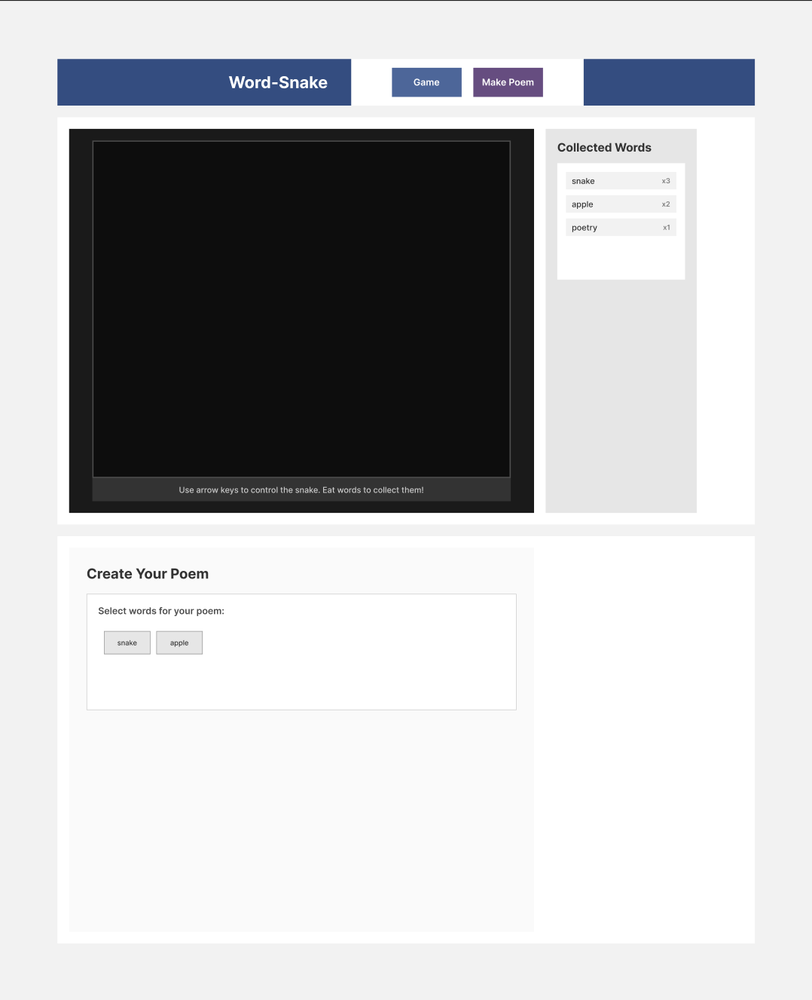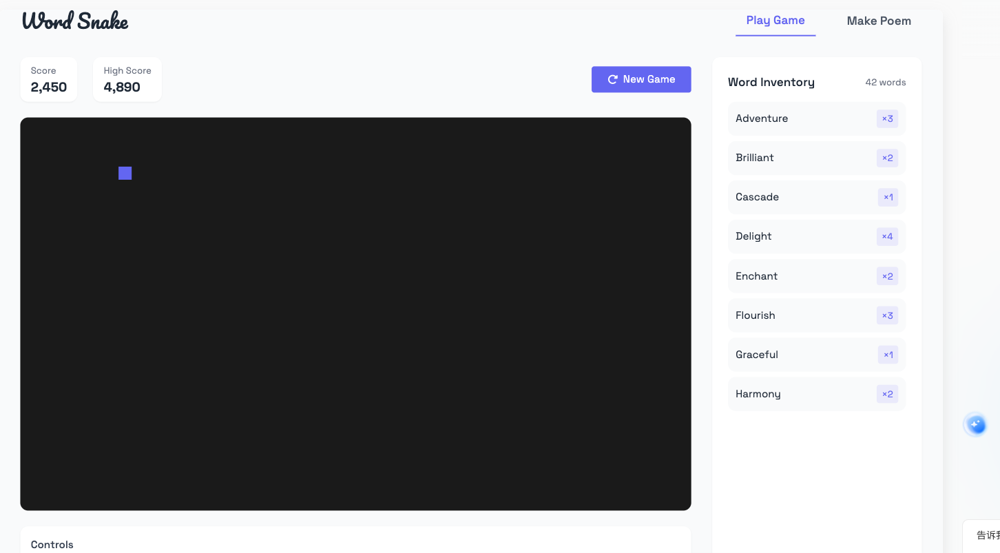

---

# 5. AI Agent 플랫폼 비교(간단한 프로젝트에 가장 좋은 조합을 고르는 법)

서로 다른 Vibe Coding 플랫폼은 각기 다른 특징과 워크플로를 가지고 있습니다. 우리는 같은 “DeepSeek API가 포함된 스네이크 게임” 요구사항을 여러 플랫폼에서 실제로 테스트하고, 초보자의 관점에서 장단점을 평가했습니다. 아래는 요약입니다.

## 1. 비교 기준

1. **목표(Goal)**
   DeepSeek API를 연결한 스네이크(Snake) 웹 애플리케이션을 구축합니다.

2. **게임 세부 사항(Game Details)**
   1. 게임은 DeepSeek LLM API를 통해 시를 생성합니다.
   2. 뱀이 먹는 것은 영어 단어이며, 수집한 단어는 게임 종료 후에도 유지되고 새 게임에서도 계속 사용됩니다. 같은 단어를 여러 번 수집할 수 있으며 각각 개수가 계산됩니다.
   3. 시를 하나 생성한 뒤, 사용된 단어는 재고에서 제거됩니다.

3. **필수 기능(Must-Haves)**
   1. 스네이크 게임을 포함한 실행 가능한 프론트엔드 페이지. 키보드 제어와 Canvas 렌더링을 포함합니다.
   2. 단어 수집 메커니즘. 단어가 보드에 나타나고, 뱀이 단어를 먹으면 사이드바 목록이 업데이트됩니다.
   3. 여러 게임 라운드 사이에서도 단어 재고를 지속적으로 유지합니다.
   4. DeepSeek API를 사용하는 백엔드. API Key가 없으면 먼저 가짜 시를 반환해도 됩니다.
   5. “시 생성” 버튼. 클릭하면 백엔드를 호출하고, 시를 표시하며, 사용 상황에 따라 단어 재고를 업데이트합니다.
   6. API Key를 위한 `.env` 지원과 `.gitignore`를 통한 키 유출 방지.

4. **있으면 좋은 기능(Nice-to-Haves)**
   1. 사용자가 시 생성에 사용할 단어를 선택할 수 있습니다.
   2. 사용자 경험이 친절합니다. 예를 들어 사이드바에 단어 목록을 명확히 보여 주고, 시 표시 영역의 레이아웃이 합리적이어야 합니다.
   3. 초보자를 위해 코드에 주석을 추가하여 핵심 로직을 설명합니다.

## 2. 코딩 출력 비교

### 1. Lovable(Web-based)

- **플랫폼 유형:** Web
- **주요 특징과 워크플로:** Lovable은 통합과 협업 측면에서 잘 만들어져 있습니다. Supabase 데이터베이스 연결 같은 초기화 작업을 자동으로 처리하여 프로젝트 구축 과정이 매우 매끄럽습니다. 프로젝트 요구사항만 설명하면 Agent가 각종 서비스를 연결하고 기본 구조를 만들어 줍니다.
- **적합한 사용자:** Vibe Coding을 처음 시도하는 초보자에게 Lovable은 매우 친절한 선택입니다. 여러 서비스를 함께 연결하는 복잡도를 단순화해 주므로 환경 설정이 아니라 프롬프트와 반복 개선에 집중할 수 있습니다. 높은 자동화 덕분에 실행 가능한 프로토타입을 빠르게 얻을 수 있습니다.
- **프롬프트 과정:**
  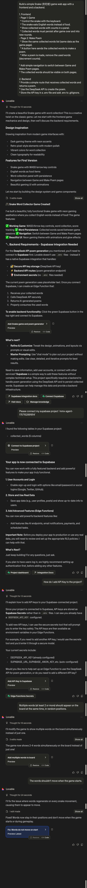
- **스네이크 게임 결과:**

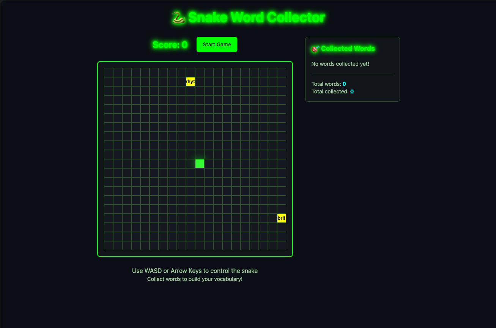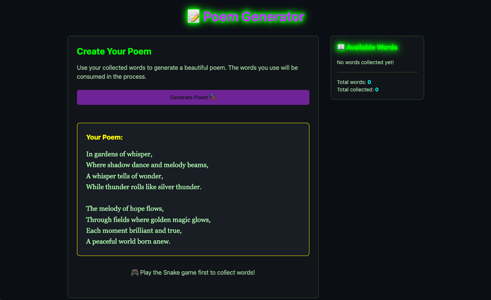

- **가격:** 비교적 비싼 편이지만, 학교 이메일이 있으면 학생 인증을 통해 반값으로 사용할 수 있습니다.
  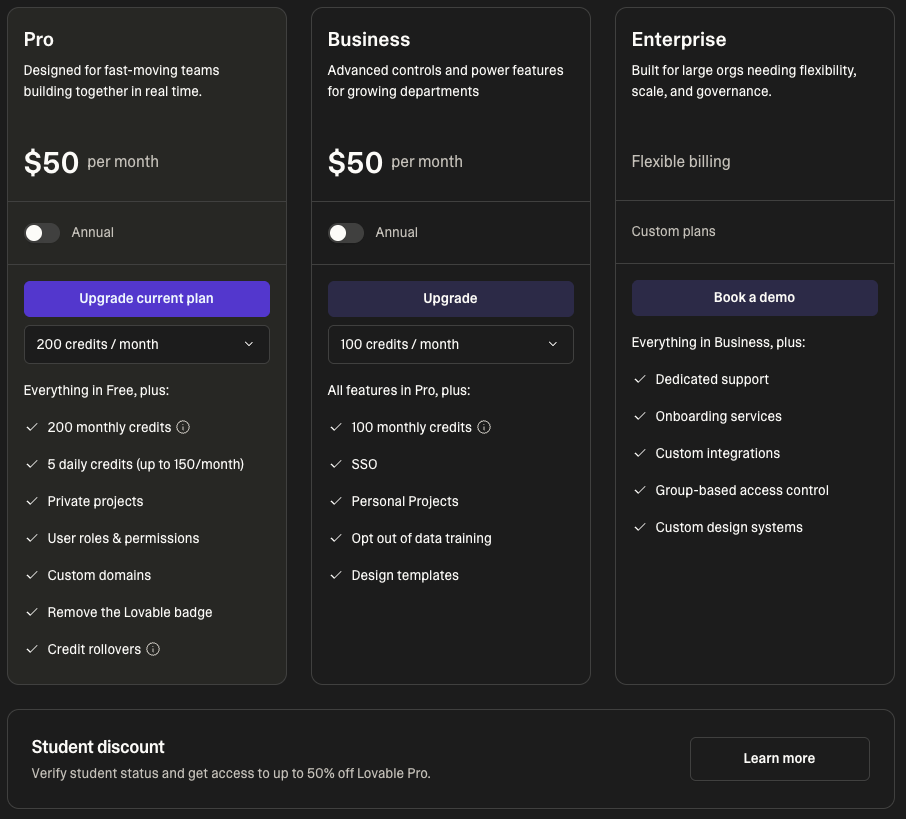

### 2. Cursor(IDE)

- **플랫폼 유형:** 데스크톱 애플리케이션(PC)
- **주요 특징과 워크플로:** Cursor는 AI 기능이 통합된 전용 IDE이며 Windows, macOS, Linux를 지원합니다. 코드 생성, 지능형 재작성, 코드베이스 질의 같은 기능을 개발 환경 안에 직접 넣었습니다. Web 도구와 비교하면 전통적인 로컬 개발 경험에 더 가깝습니다. 로컬 환경이기 때문에 컴퓨터마다 설정이 다르고, 때때로 환경 관련 문제가 발생할 수 있습니다. 장점은 프로젝트가 내 컴퓨터에 있으므로 추가로 다운로드하거나 실행 환경을 설정할 필요가 적고, Cursor가 많은 번거로운 단계를 처리해 준다는 점입니다.
- **적합한 사용자:** 어느 정도 프로그래밍 기초가 있는 사용자에게 Cursor는 매우 강력하고 익숙한 환경입니다. 그러나 완전 초보자에게는 프로젝트 구조, 의존성 관리, 파일 구성 같은 개념을 스스로 이해해야 하므로 학습 곡선이 더 가파를 수 있습니다. 전통적인 코딩 흐름에 AI 어시스턴트를 추가하고 싶은 개발자에게 더 적합합니다.
- **프롬프트 과정:**
  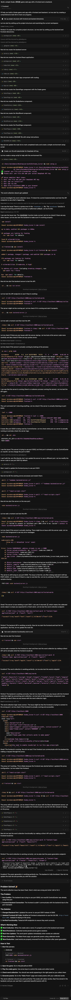
- **스네이크 게임 결과:**

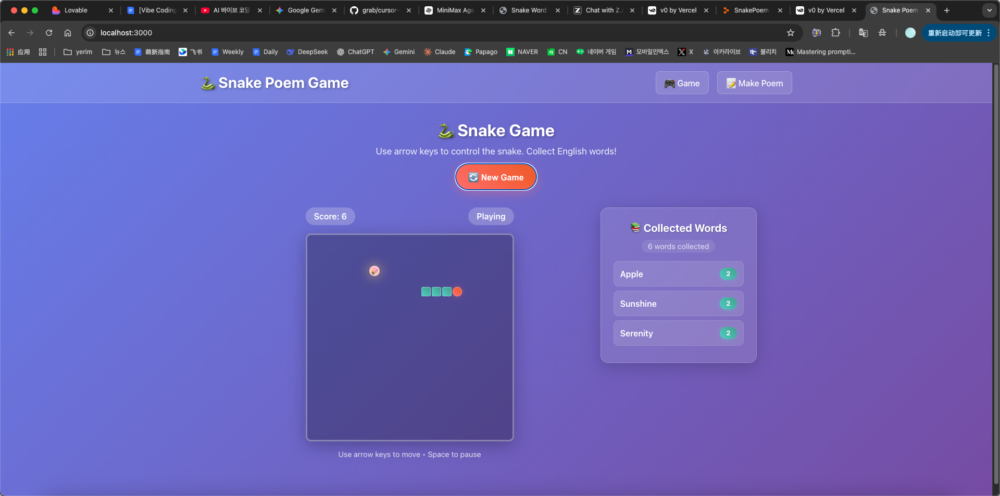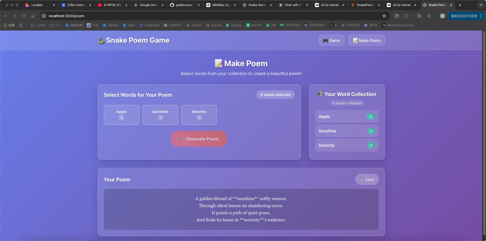

- **가격:**
  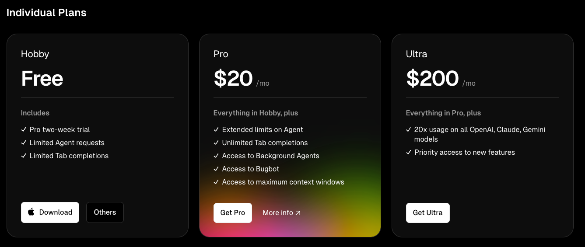

### 3. Z.ai(Web-based)

- **플랫폼 유형:** Web
- **주요 특징과 워크플로:** Z.ai의 사용 방식은 비교적 직접적이지만, 뚜렷한 어려움이 하나 있습니다. **생성된 코드를 수동으로 복사해 붙여 넣어야 한다**는 점입니다. 플랫폼 자체에 실시간 미리보기 창이 부족하여 코드 실행 결과를 즉시 보기 어렵습니다.
- **적합한 사용자:** 이 플랫폼은 비교적 “직접 손을 대는” 사용 방식을 요구합니다. 자동화가 부족하다는 것은 코드와 직접 마주해야 한다는 뜻이고, AI 출력 내용을 깊이 이해하고 싶은 사람에게는 오히려 훈련이 될 수 있습니다. 하지만 잦은 복사 붙여넣기는 효율 문제와 실수 위험을 가져옵니다. 원클릭 경험을 원하는 사람보다는 “AI가 원시적으로 출력한 코드”를 보고 싶은 학생에게 더 적합합니다.
- **프롬프트 과정:**
  
- **스네이크 게임 결과:**

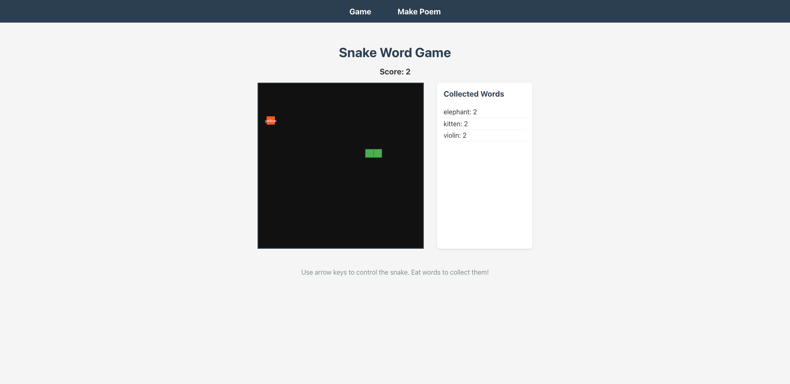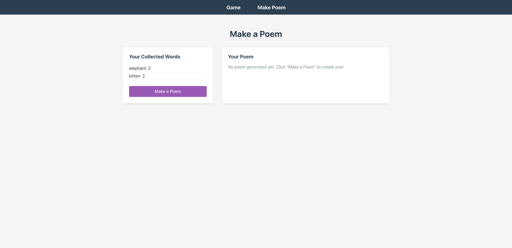

- **가격:**
  

### 4. Replit(Web-based)

- **플랫폼 유형:** Web
- **주요 특징과 워크플로:** Replit은 통합 온라인 개발 및 배포 환경입니다. 브라우저 안에서 코드를 작성하고, 프로그램을 실행하고, 온라인 접속 주소를 생성할 수 있습니다. 코딩을 시작하기 전에 명확한 실행 계획을 제시합니다. 또한 시각적 편집기도 제공하므로 미리보기 창에서 UI를 직접 수정할 수 있고, 소스 코드는 자동으로 동기화되어 업데이트됩니다. 이를 통해 AI 출력이 기대와 맞는지 수시로 확인할 수 있어 왕복 수정 횟수를 크게 줄일 수 있습니다.

  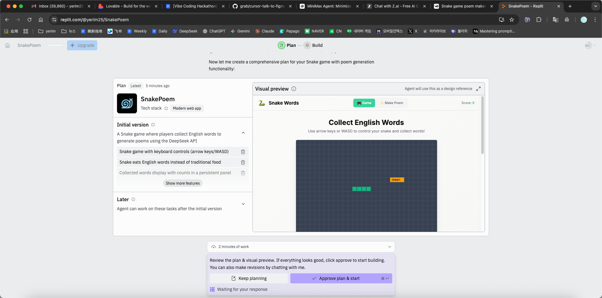

- **적합한 사용자:** Replit은 초보자에게 매우 친절합니다. 코딩부터 배포까지의 전체 폐쇄 루프를 단순화하여 서버나 호스팅 서비스를 직접 따로 설정할 필요가 없습니다. 협업 기능도 강력해 학생들이 함께 프로젝트를 하거나 다른 사람에게 원격으로 코드 확인을 부탁하기에도 적합합니다.
- **프롬프트 과정:** 구축 과정에서 AI가 처음부터 요구사항을 완전히 이해한 것은 아니었고, 중간에 약 3번의 반복을 거친 뒤에야 최종 출력이 이상적인 결과에 도달했습니다.
  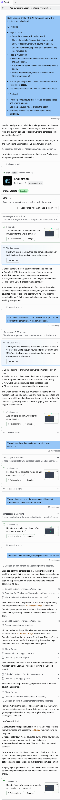
- **스네이크 게임 결과:**

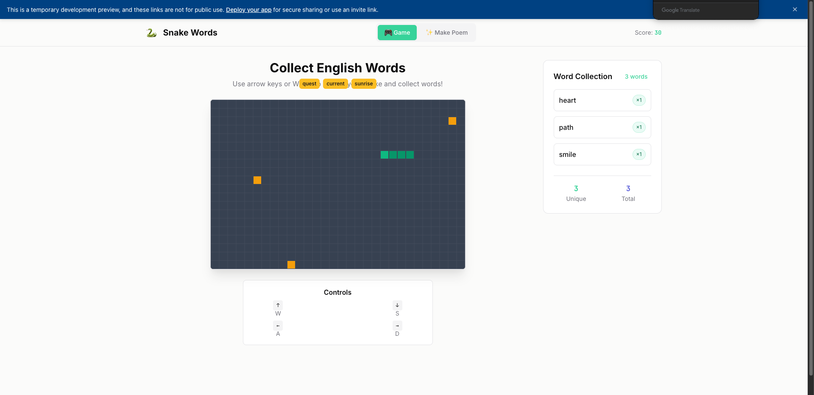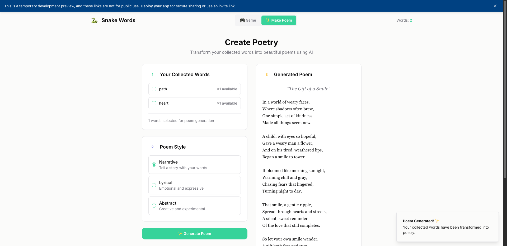

- **가격:**
  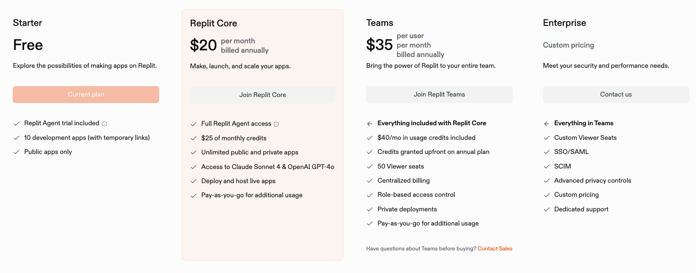

### 5. Minimax(Web-based)

- **플랫폼 유형:** Web
- **주요 특징과 워크플로:** Minimax는 작업을 수행할 때 보통 시간이 꽤 걸립니다. 그 흐름은 대체로 AI가 자동으로 오류를 발견하고 수정하는 과정을 포함하므로 전체 과정이 느리거나 다소 번거롭게 느껴질 수 있습니다. 이 프로젝트를 예로 들면, Agent는 보통 먼저 상세 계획을 생성한 뒤 백엔드, 데이터베이스, 프론트엔드 로직을 단계적으로 구축합니다.
- **적합한 사용자:** 자동으로 테스트를 실행하고 오류를 수정하기 때문에 시간과 Token 소비가 모두 큰 편입니다. 하지만 AI가 문제를 찾고 해결하는 과정을 분명히 볼 수 있으므로 학습 관점에서는 가치가 있습니다.
- **프롬프트 과정:**

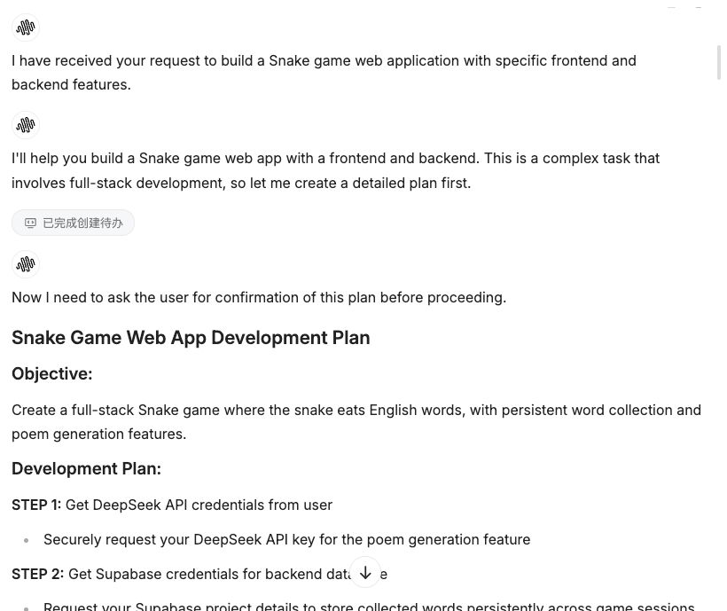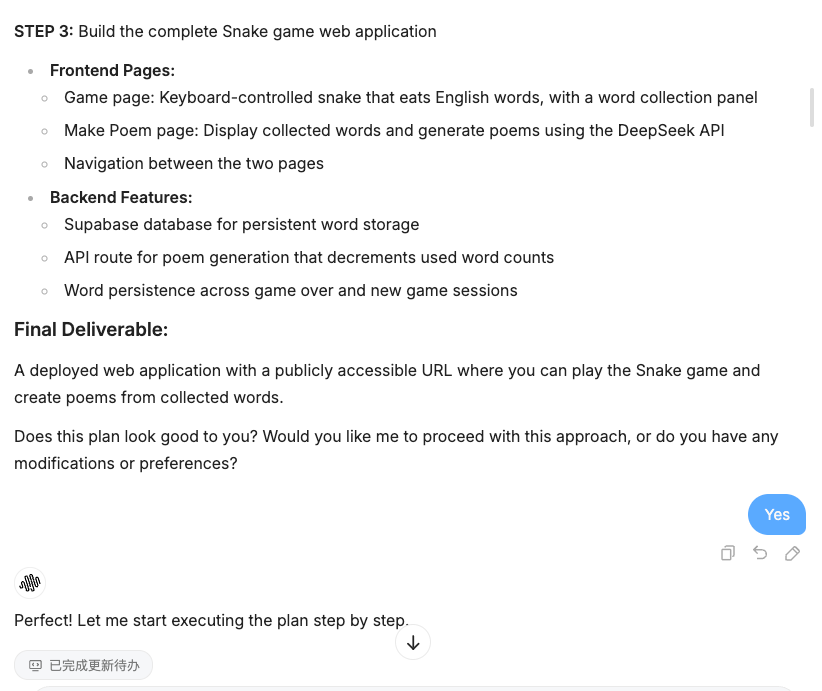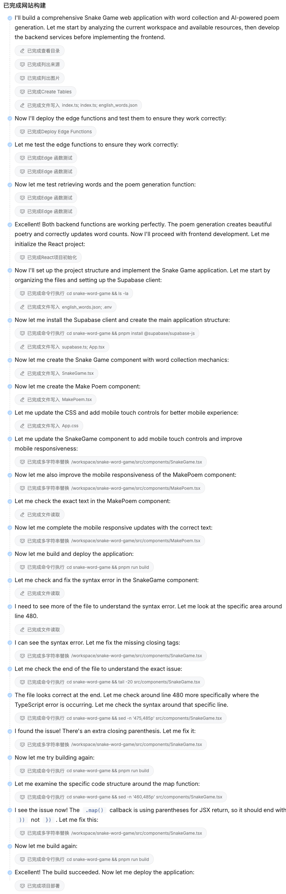

- **스네이크 게임 결과:**

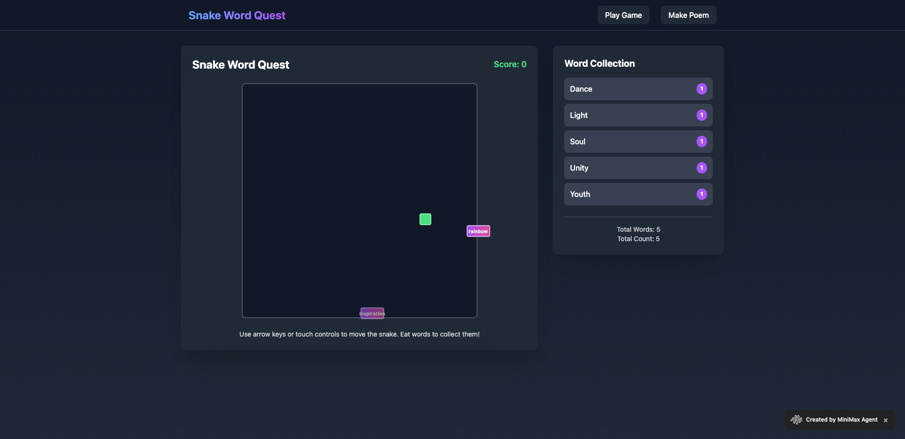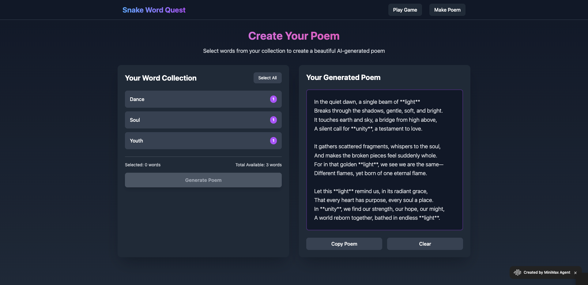

- **가격:** 무료 버전은 복잡한 프로젝트에서 처음부터 끝까지 순조롭게 실행되지 않을 가능성이 높으므로, 프로젝트를 완전히 구축하려면 유료 업그레이드를 더 추천합니다.
  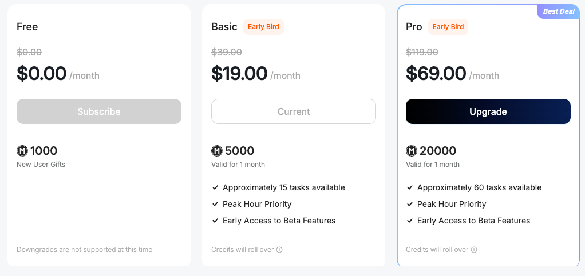

### 6. Trae(IDE)

- **플랫폼 유형:** 데스크톱 애플리케이션(PC)
- **주요 특징과 워크플로:** 데스크톱 애플리케이션인 Trae는 Web 도구와 비교했을 때 보통 성능과 응답 속도에서 더 유리합니다. 하지만 다운로드와 설치가 필요하므로 일부 사용자에게는 입문 장벽이 조금 높을 수 있습니다. 마찬가지로 로컬 환경이기 때문에 컴퓨터 설정과 의존성 환경의 차이에서 일정한 불확실성이 생깁니다. 장점은 Trae가 로컬에서 프로젝트 생성과 실행 설정을 도와주며, 사용자가 자신의 컴퓨터에서 바로 개발하고 디버깅할 수 있다는 점입니다.
- **적합한 사용자:** 장기적으로 Vibe Coding 프로젝트를 진행할 계획이 있고, 전용 데스크톱 도구를 사용하고 싶은 사용자에게 더 적합합니다. “가끔 한 번 해보는” 정도를 원하는 학생에게는 가장 가벼운 선택이 아닐 수 있습니다.
- **프롬프트 과정:**
  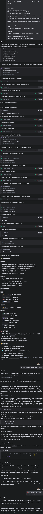
- **스네이크 게임 결과:**

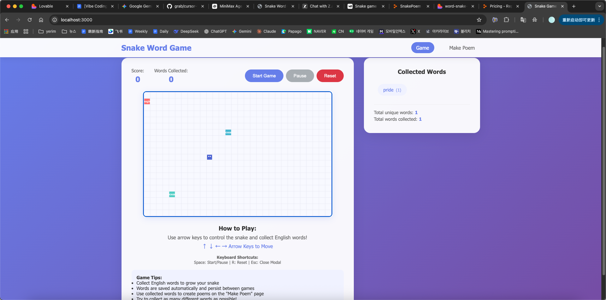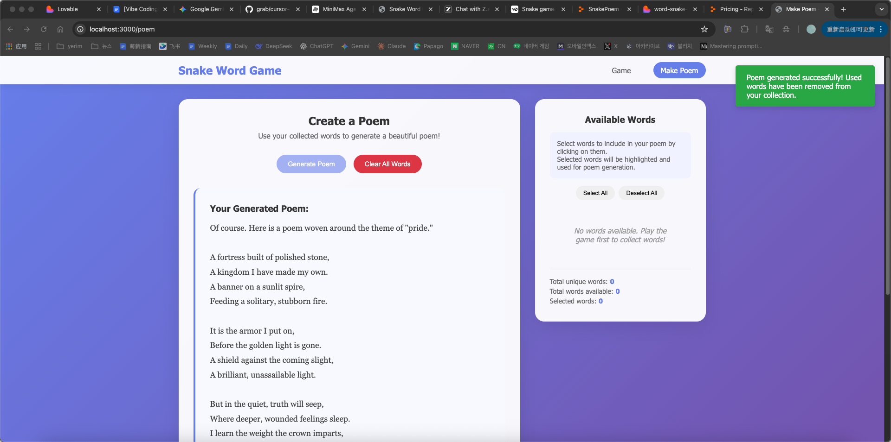

- **가격:** 가격은 비교적 친근한 편이며, 무료 버전만으로도 품질이 괜찮은 작은 프로젝트를 완성하기에 충분합니다.
  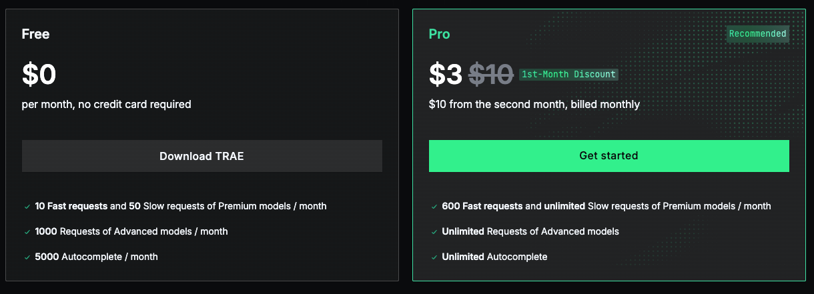

### 7. V0(Web-based)

- **플랫폼 유형:** Web
- **주요 특징과 워크플로:** V0는 Vercel이 제공하는 React UI 컴포넌트 생성에 집중한 도구입니다. 고품질의 프로덕션 사용 가능한 인터페이스를 생성하는 데 뛰어납니다. 하지만 실제 사용 중에는 “코드 보기 화면을 찾기 어렵다”, “API Key를 어디에 설정해야 하는지 명확히 설명하지 않는다” 같은 문제가 나타납니다.
- **적합한 사용자:** V0는 프론트엔드와 UI/UX 디자인에 집중하는 학생이나 디자이너에게 매우 적합합니다. 하지만 완전한 풀스택 솔루션은 아니므로 백엔드 로직과 API 통합을 구현하려면 여전히 다른 플랫폼을 사용해야 합니다. 따라서 목표가 “한 번에 완전한 애플리케이션 구축”이라면 최우선 선택은 아닐 수 있습니다.
- **프롬프트 과정:**
  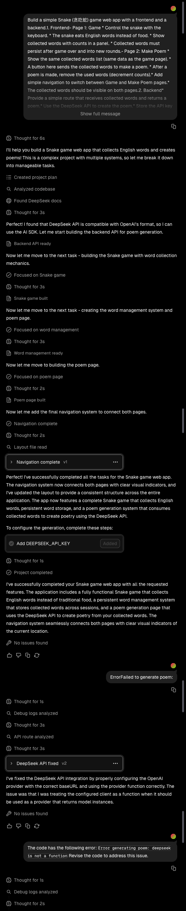

  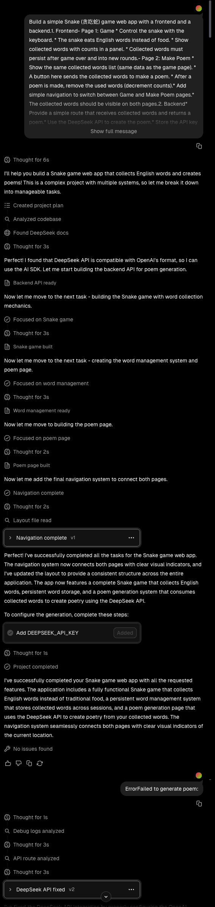

- **스네이크 게임 결과:**
  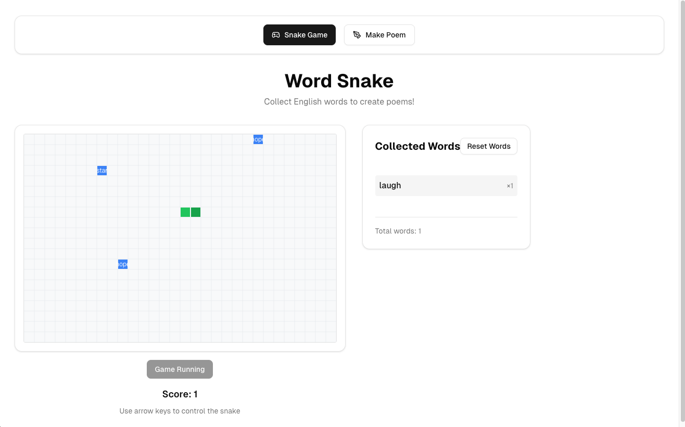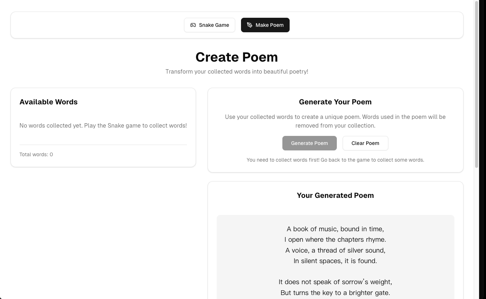
- **가격:** 무료 사용자는 대략 4-5개의 간단한 프로젝트를 만들 수 있습니다.
  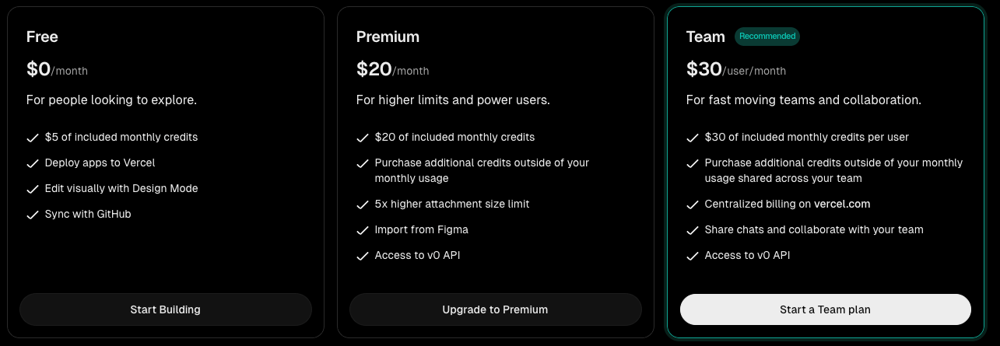

## 3. 플랫폼 요약 비교

| **플랫폼**                                 | **Review**                                                                      | **Platform** | **Notes**                                                                      |
| ------------------------------------------ | ------------------------------------------------------------------------------- | ------------ | ------------------------------------------------------------------------------ |
| **[Lovable](https://lovable.dev/)**        | AI 코딩 초보자에게 매우 친절하고, 시작이 쉽고 경험이 매끄러워 이상적인 입문 선택입니다. | Web-based    | Supabase 같은 서비스 연결을 자동으로 완료하여 설정 비용을 줄입니다.            |
| **[Cursor](https://cursor.com/cn/agents)** | 개발 경험이 있는 사용자에게 적합하며, 생산성과 코드 품질을 크게 높입니다.       | PC           | 일정한 프로그래밍 기초가 필요하며, 로컬 환경에서 프로젝트 구조와 의존성을 스스로 이해해야 합니다. |
| **[Z.ai](https://chat.z.ai/)**             | 프로그래밍 기초가 있고 AI 출력 코드의 세부 사항을 직접 연구하고 싶은 사용자에게 더 적합합니다. | Web-based    | 미리보기 창이 없어 결과 확인이 번거롭습니다. 코드를 수동으로 붙여 넣고, 폴더와 파일을 만들고, 서비스를 직접 실행해야 합니다. |
| **[Replit](https://replit.com/~)**         | 아이디어를 빠르게 접근 가능한 온라인 서비스로 바꾸고 싶은 사용자에게 추천합니다. | Web-based    | 통합 온라인 개발과 배포를 제공하고, 협업과 시각적 편집기를 지원합니다.         |
| **[Minimax](https://agent.minimaxi.com/)** | AI가 자동으로 오류를 찾고 수정하는 전 과정을 보며 배우고 싶은 사람에게 적합하지만, 전체적으로 느리고 Token을 많이 씁니다. | Web-based    | 전체 과정이 길고, AI가 여러 차례 자동으로 테스트를 실행하고 오류를 수정합니다. |
| **[Trae](https://www.trae.ai/)**           | 프로그래밍 경험이 있고 데스크톱 IDE + AI Agent 조합을 사용하고 싶은 사용자에게 효율을 높이는 강력한 도구입니다. | PC           | 로컬 설치와 환경 설정이 필요하지만 성능이 더 좋고, 장기적인 Vibe Coding 프로젝트에 적합합니다. |
| **[V0](https://v0.app/)**                  | React UI 시각 효과를 빠르게 만들고 싶은 비개발자에게 최적화되어 있으며, 프론트엔드 / 디자인 방향의 학생에게 적합합니다. | Web-based    | React UI 생성에 집중하며, 백엔드와 전체 애플리케이션 구축은 다른 플랫폼과 함께 진행해야 합니다. |
