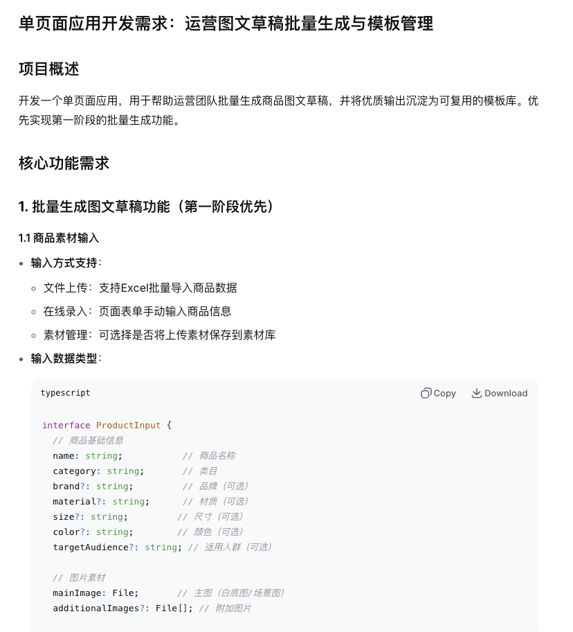
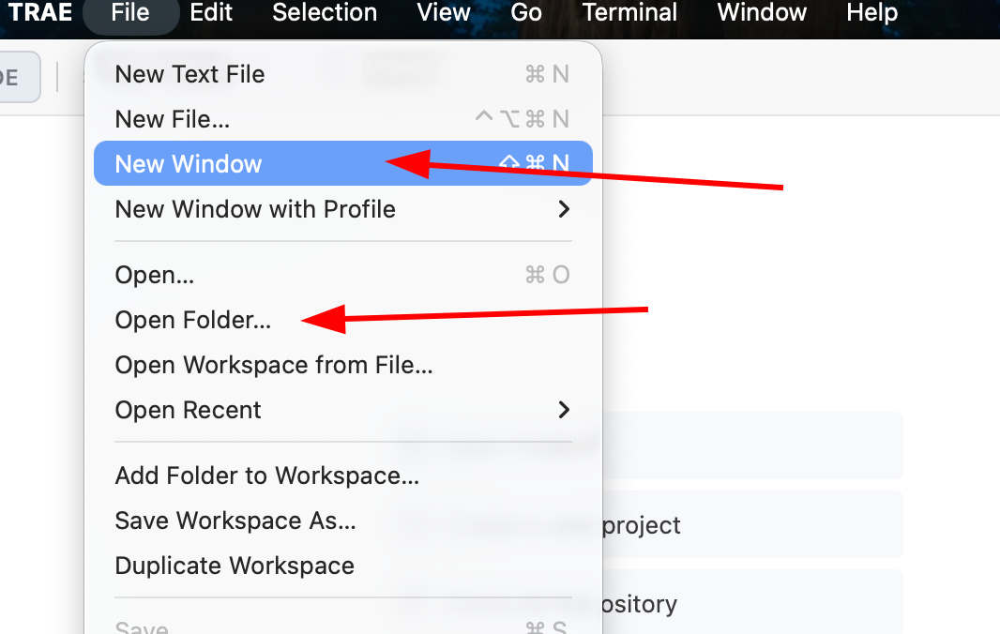
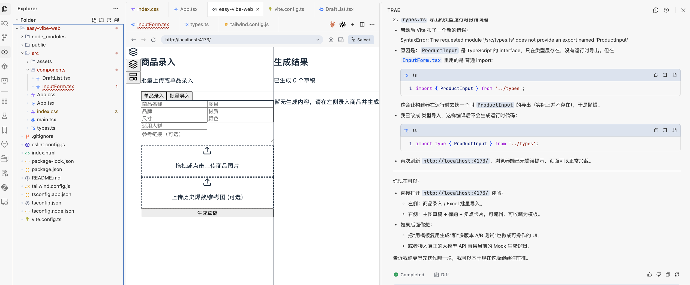
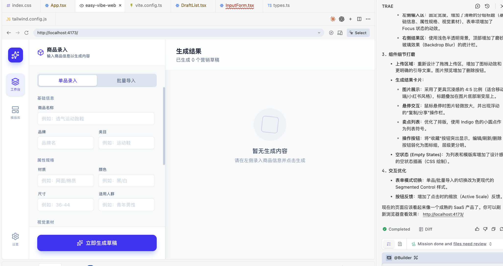
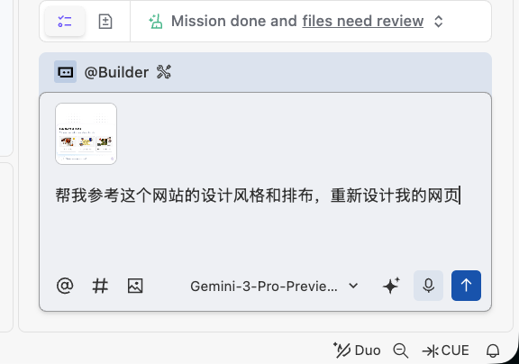
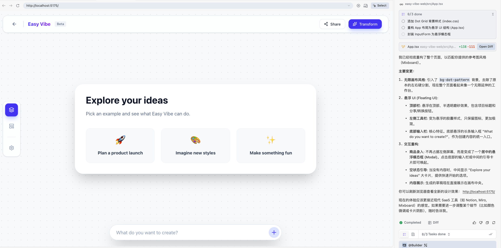
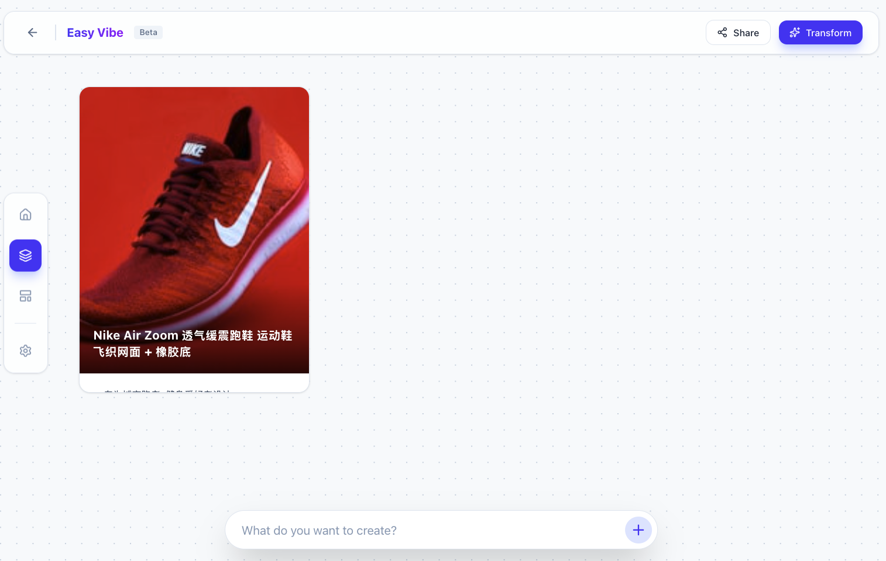
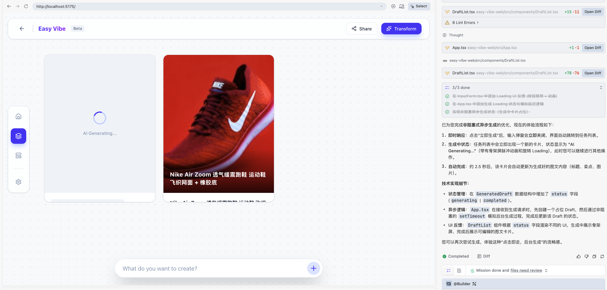
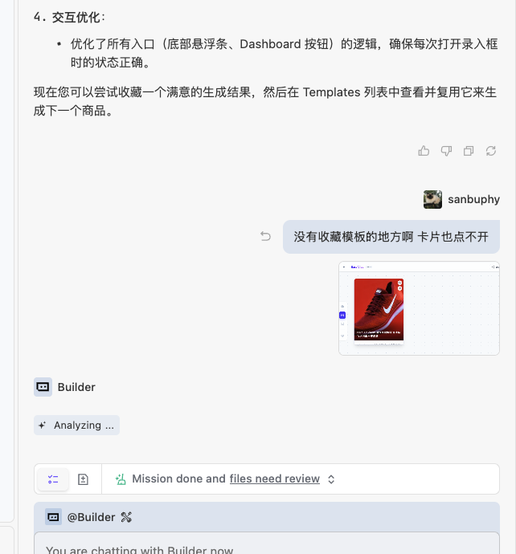

<script setup>
import { relatedArticlesMap } from '@theme/data/relatedArticles'

const duration = '약 <strong>8시간</strong>'
const relatedArticles =
  relatedArticlesMap['ko-kr/stage-1/building-prototype'] ?? []
</script>

# 초급 3: 직접 프로토타입 만들기

## 이 장의 가이드

<ChapterIntroduction :duration="duration" :tags="['비즈니스 분석', '프로토타입 설계', 'AI 보조 프로그래밍', '다중 페이지 애플리케이션']" coreOutput="이커머스 소재 워크벤치 프로토타입 1개" expectedOutput="상호작용 가능한 Web 프로토타입">

지난 장에서는 <strong>좋은 아이디어를 찾는 법</strong>을 배웠습니다. 사용자 요구에서 출발해 누군가 기꺼이 비용을 지불할 방향을 찾는 법이었습니다. 하지만 방향을 찾는 것은 첫걸음일 뿐입니다. <strong>제품 관리자를 진짜로 시험하는 것은 모호한 요구를 어떻게 사용할 수 있는 제품으로 바꾸느냐입니다.</strong>

이번 장에서 우리는 하나의 <strong>현실 문제</strong>를 해결합니다. 사장이 “AI로 상품을 이커머스 플랫폼에 게시하는 효율을 높여 봐”라는 한마디를 던졌을 때, 이것을 어떻게 <strong>사용 가능한 제품 프로토타입</strong>으로 바꿀 수 있을까요?

앞에서 만든 스네이크나 계산기와 달리, <strong>실제 비즈니스에서는 기능을 허공에서 상상하면 안 됩니다</strong>.

1. <strong>문제점 명확히 하기</strong>: 운영 담당자와 이야기하며, 모호한 “효율 향상” 속에서 <strong>진짜 문제점</strong>을 파냅니다.
2. <strong>중요한 것부터 만들기</strong>: 많은 문제 중에서 먼저 <strong>가장 아픈 문제</strong>를 해결합니다. 한 번에 전부 만들려고 하지 않습니다.
3. <strong>빠르게 검증하기</strong>: AI IDE로 먼저 <strong>단일 페이지 프로토타입</strong>을 만들고, 잘 통하면 다중 페이지로 확장합니다.
4. <strong>쓸 수 있는 것을 만들기</strong>: 마지막에는 <strong>시연할 수 있고 조작할 수 있는 이커머스 소재 워크벤치</strong>를 전달합니다.

우리는 <strong>장난감 만들기에서 애플리케이션 만들기로 전환하는 법</strong>을 배우고, <strong>고객의 실제 요구에 공감하고 사고하는 법</strong>을 배우게 됩니다.

</ChapterIntroduction>

::: info ℹ️ 설명
이 글에는 일부 비즈니스 용어가 나올 수 있습니다. 이해가 되지 않는다면 AI에게 설명을 요청해도 됩니다.
:::

<div style="margin: 50px 0;">
  <ClientOnly>
    <StepBar :active="0" :items="[
      { title: '요구사항 분석', description: '모호함에서 구체화로' },
      { title: '단일 페이지 검증', description: '핵심 플레이 방식 구현' },
      { title: '다중 페이지 확장', description: '애플리케이션 구조 보완' },
      { title: '미화와 완성', description: '사용자 경험 향상' }
    ]" />
  </ClientOnly>
</div>

## 1. 코드를 쓰기 전에 요구사항 확정하기

앞선 튜토리얼에서는 AI IDE를 사용해 스네이크와 여러 미니게임을 쉽게 생성했습니다. 하지만 이런 것들은 장난감 프로젝트라고 할 수 있을 뿐, 실제 업무와 생활에 적용되기는 어렵습니다. AI 능력이 진짜로 사람들에게 쓰이게 하려면 생활과 업무 장면을 결합해 vibe coding을 해야 합니다.

지난 장에서는 <strong>누군가 기꺼이 비용을 지불할 좋은 아이디어</strong>를 찾는 법을 배웠습니다. 하지만 방향을 찾는 것은 시작일 뿐입니다. 실제로 제품을 만들다 보면 알게 됩니다. <strong>“무엇을 만들지” 아는 것과 “어떻게 만들지” 아는 것 사이에는 거대한 간극이 있습니다.</strong>

이 간극이 바로 <strong>요구사항의 구체화</strong>입니다.

예를 들어 수업이나 개인 프로젝트에서는 보통 가장 단순하게 실행 가능한 기능에서 출발해 제품과 애플리케이션을 만듭니다.

- “칸반을 만들어서 작업을 나열해줘.”
- “그림 그리는 도구를 만들어줘.”
- “설문을 수집할 수 있는 소프트웨어를 만들어줘.”

이것들은 대개 하나의 도구, 하나의 기능 모듈일 뿐이며, 명확한 비즈니스 문제라고 부르기도 어렵습니다. 더 중요한 것은 <strong>이런 생각들이 대부분 “내가 유용하다고 느끼는 것”이지, “사용자가 정말 필요로 하는 것”이 아니라는 점입니다.</strong>

기업급 프로젝트나 창업 프로젝트에서 제품 관리자와 엔지니어는 보통 더 큰 비즈니스 명제에서 출발합니다. 예를 들어 다음과 같은 상황을 가정해 볼 수 있습니다.

<el-card shadow="hover" style="border-left: 5px solid #409EFF; background-color: #ecf5ff; margin: 20px 0;">
  <div style="font-weight: bold; color: #303133; margin-bottom: 10px;">🛍️ 비즈니스 상황:</div>
  <div style="color: #606266; line-height: 1.6;">
    <p>당신은 한 매장의 이커머스 운영 제품 관리자입니다. 사장이 모호하지만 압박이 큰 과제를 줬습니다.</p>
    <p style="font-style: italic; margin-top: 10px;">“요즘 공식 계정들에서 AI로 이미지도 만들고 문구도 만들던데, 보기엔 꽤 쉬워 보이더라. 네가 한번 해 봐. 우리가 Douyin 이커머스에 새 상품을 올릴 때 효율이 좀 높아지게 해줘.”</p>
  </div>
</el-card>

이때 당신은 “사장님 또 꿈꾸시네!”라고 생각할 수 있습니다. 하지만 실제 업무에서는 이렇게 모호한 한마디로 의사결정이 내려지는 일이 매우 흔합니다. 심지어 일주일에 밀크티를 주문하는 횟수보다 많을 수도 있습니다. 따라서 괜찮은 직장인이 되기 위해서는, 더 나아가 새롭게 떠오르는 스타트업 CEO가 되기 위해서는, 자기만 쓰는 도구 만들기에서 진짜 제품 프로토타입 만들기로 전환하는 법을 반드시 배워야 합니다.

AI IDE를 배웠으니, 곰곰이 생각하면 이 요구사항은 사실 아주 간단해 보입니다. AI에게 이 내용을 바탕으로 프롬프트를 하나 만들어 달라고 하고, Agent에게 던지면 끝나는 것 아닐까요?

```
제 요구사항 xxxx를 참고해서,
이커머스 소재 워크벤치를 설계해 주세요.
상품 설명, 이미지, 동영상 등 소재의 생성과 관리 기능을 포함해 주세요.
```

만약 신나서 이 요구사항을 바로 프로토타입으로 바꾼 다음 사장에게 보낸다면, 축하합니다. 이번 분기 보너스는 취소될 겁니다!

**왜 그럴까요? 이것이 우리가 해결해야 할 핵심 문제입니다.**

이전에 AI IDE를 배울 때 만들었던 것은 스네이크나 계산기처럼 **자기가 쓰는 장난감 프로젝트**였습니다. 기능은 단순하고, 자신이 무엇을 원하는지 잘 알고 있으며, 만들어서 스스로 쓰면 됩니다. 하지만 **실제 비즈니스 장면은 완전히 다릅니다**.

- **당신은 사용자가 아닙니다**: 사장이 원하는 것은 “효율 향상”이지만, 운영 담당자가 매일 구체적으로 어떻게 일하고 어디에서 막히는지 당신은 모릅니다.
- **AI도 비즈니스를 모릅니다**: 모호한 요구를 AI에게 던지면 AI는 일반 지식에 기반해 추측할 뿐입니다. 결과물은 그럴듯해 보이지만 실제로는 전혀 쓸 수 없을 수 있습니다.
- **좋은 아이디어가 좋은 제품은 아닙니다**: 당신은 “AI 생성 기능을 하나 넣으면 멋지다”고 생각할 수 있지만, 사용자는 전혀 필요로 하지 않거나 오히려 기존보다 더 번거롭다고 느낄 수 있습니다.

**그래서 우리는 “아이디어를 떠올리는 것에서 사용자를 이해하는 것”으로 나아가는 법을 반드시 배워야 합니다.** 당신의 창의성이 진짜로 다른 사람의 문제를 해결할 때, 질문하고 비즈니스를 깊이 이해할 때, 비로소 진정한 의미에서 가치 있는 일을 만들 수 있습니다. 좋은 아이디어는 때로 좋은 기술보다 더 중요합니다.

### 1.1 상상에서 현실로: 비즈니스에 질문하는 법 배우기

::: info 💡 먼저 분명히 하기: 요구사항이란 무엇인가? 비즈니스란 무엇인가?

**요구사항**은 사용자가 진짜로 원하는 것입니다. 그들이 겪는 불편, 해결하고 싶은 문제입니다. 예를 들어 “사장이 상품 등록을 더 빠르게 하라고 한다”는 하나의 요구사항입니다.

**비즈니스**는 사용자가 매일 실제로 하는 일과 일하는 방식입니다. 예를 들어 이커머스 운영 담당자가 매일 하는 일은 상품 등록, 가격 수정, 이미지 제작, 데이터 확인 등입니다. 이것들이 모두 비즈니스입니다.

**왜 비즈니스에 주목해야 할까요?**
비즈니스를 이해하지 못하면 만든 도구가 “보기에는 좋지만 아무도 쓰지 않는” 것이 될 수 있기 때문입니다. 사용자가 매일 어떻게 일하고 어디에서 막히는지 진짜로 이해해야, 실제로 도움 되는 것을 만들 수 있습니다.

:::

가장 단순한 관점에서 출발한다면, 먼저 자신에게 몇 가지 질문을 던질 수 있습니다.

- 사장이 말한 “**효율이 좀 높아지게**”는 구체적으로 무슨 뜻일까요? **더 빠르게** 만들고 싶은 걸까요? **비용을 덜 쓰고** 싶은 걸까요? 아니면 **더 많이 팔고** 싶은 걸까요?
- 지금은 상품을 어떻게 등록하고 있을까요? **어디가 매끄럽지 않을까요?**
- 매일 몇 개의 **신상품**을 처리해야 할까요? 상품마다 몇 장의 **이미지**와 몇 줄의 **문구**가 필요할까요?
- 현재 업무에서 **어떤 일이 가장 번거롭고**, **가장 하기 싫은 일**일까요?

하지만 이것들은 모두 추측에 기반한 질문입니다. 우리는 일선의 Douyin 이커머스 비즈니스 담당자에게 직접 “어떤 어려움이 있고, 무엇에 신경을 쓰고 있나요?”라고 물어야 합니다. 소통을 통해 더 정확한 답을 얻을 수 있습니다.

::: info 📋 실제 비즈니스 인터뷰 결과

이커머스 운영을 하는 사람들에게 물어보니, 다음과 같은 고민을 말했습니다.

**1. 일이 너무 많고 너무 잡다함**
- 한 사람이 여러 매장을 관리해야 하고, 매장마다 처리해야 할 상품이 많습니다.
- 매일 바쁘게 돌아갑니다. **새 상품 등록**, **가격 수정**, **이미지 제작**, **데이터 확인**을 하다 보면 한 일이 끝나기도 전에 다른 일을 해야 합니다.

**2. 콘텐츠 제작은 한 번에 끝나는 일이 아니라, 만들면서 테스트하는 일**
- 먼저 **제조사에서 준 이미지**, **예전에 사용했던 소재**, 또는 **인터넷에서 찾은 참고 이미지**를 사용해 상품을 빠르게 **등록**해 봅니다.
- 적은 비용으로 광고를 조금 돌려서 **구매가 발생하는지 확인**합니다.
- **잘 팔리는 상품**에 대해서만 이미지와 상세 설명, 영상을 진지하게 제작합니다.

:::

비즈니스 담당자에게 질문을 끝낸 뒤 우리는 열정에 차오릅니다. 이제야말로 비즈니스에 완벽히 맞는 제품 프로토타입을 만들 수 있을 것 같습니다. 하지만 또 틀렸습니다. 우리가 “모든 요구를 한 번에 만족시키려고” 하면 제품은 매우 거대해지고, 수업 시간 안에 구현하기도 어렵습니다. 따라서 더 정리하고 좁혀서 진짜 핵심 문제점을 찾아야 합니다.

### 1.2 발산에서 수렴으로: 비즈니스의 핵심 문제점과 기능 잠그기

::: info 💡 왜 “수렴”해야 할까요? “문제점”이란 무엇일까요?

**문제는 많은데, 무엇을 먼저 할까요?**

사용자는 A도 번거롭고, B도 번거롭고, C도 번거롭다고 여러 문제를 말할 수 있습니다. 하지만 모든 문제를 한 번에 해결하려고 하면 결국 아무것도 잘 만들지 못할 수 있습니다. 그래서 **수렴**해야 합니다. 많은 문제 중에서 **가장 아프고, 가장 급하고, 가장 해결 가능한** 것을 골라 먼저 시작하는 것입니다.

**문제점이란 무엇일까요?**
사용자가 **가장 짜증나고, 가장 시간을 많이 쓰고, 가장 해결하고 싶어 하는** 구체적인 문제입니다. “내가 유용하다고 생각하는 것”이 아니라, 사용자가 **매일 불평하고, 할 때마다 고통스러워하는** 일입니다.

:::

위 인터뷰를 통해 운영 담당자가 겪는 문제는 많다는 것을 알게 되었습니다. 행사 때문에 업무 리듬이 끊기고, 여러 매장을 관리해야 하며, 등록 / 가격 수정 / 이미지 제작 / 데이터 확인 사이를 바쁘게 오갑니다.

만약 “이 문제들을 전부 해결하겠다”고 하면, 결국 **크고 다 갖췄지만 쓰기 불편한** 도구를 만들게 됩니다.

이 문제들을 분류해 보겠습니다. AI에게 도와달라고 해도 됩니다. 대략 세 종류가 있습니다.

1. **리듬 문제**: 언제 상품을 올리고 언제 가격을 조정할 것인가.
2. **효율 문제**: 여러 매장과 여러 상품을 어떻게 동시에 잘 관리할 것인가.
3. **콘텐츠 문제**: 상품 이미지와 문구를 어떻게 빠르게 만들 것인가.

우리 수업에 가장 적합하게 먼저 해결할 것은 **세 번째: 콘텐츠 제작 문제**입니다. 하지만 “콘텐츠를 빠르게 만들기”는 여전히 조금 추상적입니다. 비즈니스 담당자에게 구체적으로 어디에서 막히는지 다시 물어봅니다.

::: info 📋 비즈니스 담당자가 말한 콘텐츠 제작의 가장 고통스러운 두 지점

**고통 1: 이미지를 대량으로 만들고 문구를 쓰는 일이 너무 힘듦**
- 소재가 여기저기 흩어져 있습니다. 클라우드 드라이브, WeChat 기록, 플랫폼 백오피스 등이라서 **찾기가 매우 힘듭니다**.
- 한 번에 많은 상품을 올려야 해서 **하나하나 정성 들여 만들 시간이 없습니다**. 대충 조합할 수밖에 없습니다.
- 요구 수준은 높지 않습니다. **볼 수 있고, 등록할 수 있으면 됩니다**. 아주 정교할 필요는 없습니다.

**고통 2: 쓸 만한 방안을 저장해 두고 재사용할 수 없음**
- 전에 잘 만들었던 제목과 레이아웃을 **다음에 쓰고 싶어도 찾을 수 없습니다**.
- 방안이 채팅 기록이나 예전 상품 링크에 흩어져 있습니다.
- 쓰고 싶을 때 **한참 뒤지고, 복사해 붙여 넣고, 한참 고쳐야 합니다**.
- **즐겨찾기, 관리, 바로 적용**을 할 수 있는 도구가 없습니다.

:::

위 두 문제점을 바탕으로 우리는 간단한 작은 도구를 만들 것입니다. **운영 담당자가 이미지와 문구를 대량으로 만들 수 있게 돕고, 쓸 만한 방안을 저장해 다음에 바로 사용할 수 있게 하는 도구**입니다.

이 도구는 두 가지만 합니다. AI에게 세부화를 도와달라고 할 수 있으며, 비즈니스 피드백에 따라 기능을 계속 줄이는 것을 기억하세요.

::: info 기능 1: 이커머스 상품 이미지와 문구 대량 생성

**무엇을 하는 기능인가요?**
시스템에 상품 정보를 주면, 이커머스 플랫폼(Douyin, Taobao 등)에 등록할 때 사용할 수 있는 상품 이미지와 문구를 자동으로 생성합니다.

**입력**
| 유형 | 내용 |
|------|------|
| 상품 정보 | 이름, 카테고리, 브랜드, 소재, 크기, 색상 등 |
| 상품 이미지 | 흰 배경 이미지 또는 간단한 장면 이미지 |
| 참고 이미지 | 예전에 잘 팔렸던 상품 스크린샷 또는 참고 링크 |
| 가져오기 방식 | Excel 일괄 가져오기 또는 페이지에서 직접 입력 |

**출력(생성된 이커머스 소재)**
- **상품 대표 이미지**: 문구형 판매 포인트가 들어간 제품 표시 이미지. 사용자가 스크롤하다가 처음 보는 이미지입니다.
- **상품 제목**: 검색에서 찾힐 수 있는 키워드 조합입니다.
- **판매 포인트 문구**: 구매자를 끌어들이는 1-2문장입니다.
- 모두 **조금만 고치면 바로 등록할 수 있는** 완성본입니다.

**효과**
- 이전: 상품마다 처음부터 이미지를 만들고 문구를 써야 했습니다.
- 현재: 상품 묶음을 시스템에 넣고, 생성된 초안을 고르고 조금 수정하면 됩니다.

:::

::: info 기능 2: 쓸 만한 방안을 템플릿으로 저장하기

**입력**
| 유형 | 내용 |
|------|------|
| 한 세트 전체 | 대표 이미지 + 제목 + 문구 |

**출력**
| 기능 | 설명 |
|------|------|
| 적용 | 다음에 새 상품을 만들 때 템플릿으로 자동 생성 |
| 수정 | 제목과 문구를 직접 수정 |
| 관리 | 이름을 붙이고 태그를 달아(예: “남성 가방 템플릿”, “대규모 프로모션 제목”) 찾기 쉽게 함 |

**효과**
1. 새 상품을 가져옵니다.
2. 선택합니다. 시스템 기본 생성 또는 **내가 저장한 템플릿 사용**.
3. 시스템이 템플릿 스타일을 자동으로 적용해 새로운 이미지와 문구를 출력합니다.

:::

---

**방금 우리가 한 일을 돌아봅시다.**

1. **먼저 질문하기**: 바로 만들기 시작하지 않고, 운영 담당자에게 “무엇이 가장 짜증나는가”를 먼저 물었습니다.
2. **문제점 찾기**: 가장 고통스러운 점이 “이미지 만들고 문구 쓰기가 너무 힘듦”과 “쓸 만한 방안을 저장할 수 없음”임을 발견했습니다.
3. **범위 수렴하기**: 크고 모든 것을 다 하는 플랫폼을 만들지 않고, “이미지와 문구 대량 생성 + 템플릿 저장” 두 기능만 만들기로 했습니다.

**왜 이렇게 하는 것이 중요할까요?**

많은 초보자가 제품을 만들 때 저지르는 오해는 기능이 많을수록 좋다고 생각하는 것입니다. 하지만 사용자가 진짜로 필요한 것은 **가장 아픈 문제를 해결하는 것**입니다. 많은 기능을 만들었지만 전부 쓰기 불편한 것보다, 한두 기능이라도 진짜로 도움 되는 것이 낫습니다.

**제품과 비즈니스 사고의 핵심:**
- “내가 보기에 사용자가 무엇을 필요로 할까”를 혼자 상상하지 않습니다.
- 사용자에게 “매일 무엇을 하나요? 어디가 가장 고통스럽나요?”라고 묻습니다.
- 많은 문제 중에서 **가장 아프고, 가장 해결 가능한 문제**로 **수렴**합니다.
- 먼저 **최소 사용 가능** 버전을 만든 뒤 천천히 반복 개선합니다.

이것이 코드를 쓰기 전에 분명히 생각해야 할 일입니다. 코드는 도구일 뿐이고, **사용자를 이해하고 문제를 정확히 찾는 것**이 첫걸음입니다.

<div style="margin: 50px 0;">
  <ClientOnly>
    <StepBar :active="1" :items="[
      { title: '요구사항 분석', description: '모호함에서 구체화로' },
      { title: '단일 페이지 검증', description: '핵심 플레이 방식 구현' },
      { title: '다중 페이지 확장', description: '애플리케이션 구조 보완' },
      { title: '미화와 완성', description: '사용자 경험 향상' }
    ]" />
  </ClientOnly>
</div>

## 2. 10분 안에 프로토타입 만들기: AI IDE로 “핵심 플레이 방식” 구현하기

::: info 💡 프로그래밍 Plan 제안
현재 IDE가 충분히 똑똑하지 않다고 느끼거나 사용량을 금방 다 쓸 것 같다면 **프로그래밍 Plan**을 구매해도 됩니다. 미리 [이 글](../../stage-2/backend/modern-cli/)을 예습하여 Claude를 사용한 프로그래밍을 참고하세요.
:::

Thinking은 좋은 일이지만 over thinking은 좋지 않습니다. 과도한 반성을 여기서 멈추고, 단일 페이지부터 프로토타입을 만들어 보겠습니다.

### 2.1 첫 번째 단계: 쉬운 말로 AI에게 원하는 것을 말하기

처음부터 완벽한 프롬프트를 추구할 필요는 없습니다. 가장 자연스러운 표현에서 시작하세요. 동료에게 요구사항을 설명하듯 쉬운 말로 AI에게 무엇을 만들고 싶은지 말한 뒤, AI가 더 전문적인 표현으로 다듬도록 하면 됩니다.

#### 2.1.1 말로 설명하는 것부터 시작하기(초보자에게 추천)

먼저 자기 말로 아이디어를 설명합니다. 거칠어도 괜찮습니다.

```
이커머스 운영 담당자가 상품 대표 이미지와 문구를 자동으로 생성하도록 돕는 도구를 만들고 싶습니다.
운영 담당자는 평소 이미지를 하나하나 만들고 문구를 직접 써야 해서 매우 번거롭습니다.
제 생각은 이렇습니다. 상품 정보를 업로드하면 시스템이 초안을 한 묶음 자동으로 생성하고,
운영 담당자는 쓸 만한 것을 골라 조금만 수정해서 사용할 수 있습니다.

먼저 가장 단순한 버전부터 만들겠습니다. 한 페이지이고, 왼쪽에는 상품 정보를 입력하며,
오른쪽에는 생성 결과를 보여 줍니다. 이미지를 업로드할 수 있고, 텍스트를 입력할 수 있으며,
생성 후에는 대표 이미지 미리보기와 문구를 표시합니다.
```

다음으로 이 문장을 AI(ChatGPT, Claude 등)에게 보내고 확장해 달라고 합니다. AI는 보통 당신이 고려하지 못한 세부 사항을 보충해 주고, 생각을 더 명확하게 정리한 뒤, AI IDE에 보내기 좋은 프롬프트를 생성해 줍니다.

AI에게 이렇게 말할 수 있습니다.

```
위 아이디어를 확장해서 명확한 비즈니스 로직 문서로 정리해 주세요.
그리고 AI IDE(예: Cursor, Trae)에 보내기 좋은 프롬프트를 생성해 주세요.
단일 페이지 애플리케이션의 프로토타입 코드를 생성하는 데 사용할 것입니다.
```

AI는 구조화된 요구사항과 대응되는 프롬프트를 반환할 것입니다. 직접 한 번 확인하고, 필요 없는 기능을 줄이고, 문제가 없다고 판단한 뒤 코드 생성에 사용하세요.

이렇게 하는 장점은 말로 설명한 내용이 가장 진짜 생각이라는 점입니다. 다만 중요한 세부 사항이 빠질 수 있습니다. AI가 확장할 때 “일괄 업로드를 지원할까요?”처럼 생각하지 못한 질문을 던지며 더 검증하게 도와줄 수 있습니다. 피드백에 따라 실제적이지 않은 기능을 보존하거나 삭제하고, 반복 수정하면서 AI에게 줄 첫 번째 프롬프트를 확정할 수 있습니다.

#### 2.1.2 확장 단계를 건너뛰기: 정리해 둔 비즈니스 문서를 AI에게 바로 던지기

앞선 장에서 이미 비즈니스 로직 문서(예: 쉬운 말로 쓴 요구사항 설명)를 정리했다면, 아래 형식을 AI IDE에 바로 적용할 수 있습니다. AI에게 확장을 시키는 중간 단계를 생략하는 방식입니다. 요구사항이 이미 명확하고 바로 코드 작성에 들어가고 싶을 때 적합합니다.

```
아래 비즈니스 로직을 참고해 핵심 플레이 기능을 검증할 단일 페이지 애플리케이션을 구현해 주세요.

비즈니스 로직 참고:
1. 운영 담당자가 첫 번째 이미지/문구 초안을 대량 생성하도록 돕기:
- **입력(소재 직접 업로드와 일괄 가져오기 지원):**
  - 상품 기본 정보: 이름, 카테고리, 브랜드, 소재, 크기, 색상, 대상 사용자 등;
  - 상품 이미지: 흰 배경 이미지 / 간단한 장면 이미지;
  - 매번 생성할 때 과거 인기 상품 스크린샷이나 참고 링크를 추가로 업로드할 수 있도록 지원하고, 참고물이 있을 수 있게 함;
  - Excel 일괄 가져오기 또는 페이지에서 온라인 입력 / 업로드를 지원함.
  - 페이지에서 상품 소재를 소재 라이브러리에 저장할지 지정할 수 있게 하여 다음 사용을 편하게 함
- **출력(바로 등록하거나 조금 고치면 등록할 수 있는 내용):**
  - 각 상품마다 “볼 만하고, 기본 판매 포인트가 들어간” 대표 이미지 초안 한 장;
  - “구조가 합리적이고, 핵심 키워드가 포함된” 제목 + 1-2문장의 판매 포인트 문구.
- **기대하는 사용 방식 변화:**
  매번 상품 묶음마다 맨땅에서 시작하던 방식에서, 상품 묶음을 시스템에 넣고 시스템이 생성한 초안을 골라 미세 조정하는 방식으로 바뀜.

먼저 첫 번째 기능을 만들고, 두 번째 기능(템플릿 라이브러리)은 나중에 추가합니다.
```

#### 2.1.3 프로그래머의 방식(심화): AI에게 “프롬프트의 프롬프트”를 작성하게 하기

코드 생성 과정을 더 세밀하게 제어하고 싶다면, 먼저 AI(ChatGPT 등)에게 요구사항을 바탕으로 AI IDE 전용 프롬프트를 생성하게 할 수 있습니다.

```
아래 아이디어를 바탕으로 coding Agent에게 보낼 코드 작성용 프롬프트를 써 주세요.
저는 이 프롬프트를 사용해 코드를 생성하려고 합니다.

[여기에 비즈니스 로직 설명을 붙여 넣으세요]

요구사항:
1. 프롬프트에 명확한 페이지 레이아웃 설명이 포함되어야 합니다.
2. 데이터 구조와 상호작용 로직을 명확히 해야 합니다.
3. 기술 스택(예: React + Tailwind)을 지정해야 합니다.
4. 구현해야 할 핵심 기능 항목을 나열해야 합니다.
```

보통 AI는 아래와 비슷한 구조화된 프롬프트를 생성합니다.


이 프롬프트를 조금 수정한 뒤 AI IDE에 보내 코드를 생성할 수 있습니다.

### 2.2 두 번째 단계: AI IDE가 직접 코드를 생성하게 하기

#### 2.2.1 준비 작업: AI IDE의 기본 조작 이해하기

AI IDE(Cursor, Trae, Windsurf 등)의 기본 사용 방식이 아직 익숙하지 않다면, 부록의 [IDE 기초 튜토리얼](/ko-kr/appendix/2-development-tools/ide-basics/)을 먼저 보고 다음을 이해하는 것이 좋습니다.
- 새 프로젝트 만들기
- AI Agent와 대화하기
- AI의 코드 생성 과정 이해하기

#### 2.2.2 코드 생성 시작하기

이제 초기 프롬프트를 얻었습니다. 첫 번째 프롬프트 스타일을 예로 들어 AI가 코드를 생성하도록 해 보겠습니다. 먼저 창과 해당 폴더를 만들고, 폴더를 엽니다. 원하는 폴더 위치에서 새 프로젝트를 초기화하면 됩니다.



사이드바에서 원하는 모델을 하나 선택합니다. gemini, gpt, glm, kimi, minimax 등을 추천합니다. 그런 다음 첫 번째 단계에서 얻은 프롬프트를 입력합니다.


생성을 클릭하면 익숙한 과정을 보게 됩니다. AI는 프롬프트에 따라 프로젝트의 디렉터리 구조, 필요한 파일, 각 파일의 초기 내용을 계획합니다.

::: warning ⚠️ 특별 주의: AI가 멈춰서 확인을 기다릴 수 있습니다
생성 과정에서 AI Agent는 자주 **멈춰서 당신의 입력이나 확인을 기다립니다**. 예를 들어:
- 다음 단계로 계속할지 묻습니다.
- 어떤 작업을 확인하려고 Enter를 누르라고 합니다.
- 어떤 기술 세부 사항을 선택할지 묻습니다.

**AI가 움직이지 않는 것처럼 보이면 먼저 대화 화면을 확인해, 답변을 기다리고 있는지 보세요.** 많은 초보자는 AI가 생각 중이라고 착각하지만, 사실 이미 거기서 멈춰 당신을 기다리고 있습니다. 직접 답하거나 Enter를 누르면 AI가 계속 작업합니다.
:::

이때도 마찬가지로 Enter를 눌러 정보를 확인하는 것을 잊지 마세요. 그렇지 않으면 대기 상태에 빠질 수 있습니다. 일부 AI IDE는 이 문제에 빠지지 않을 수도 있습니다.


아래와 같은 장면을 만났다면, 이미 로컬에서 서비스가 시작되었다는 뜻입니다. 건너뛰기를 클릭해야 합니다. 그렇지 않으면 이 화면에 머무를 수 있습니다. 코드 생성이 끝났는데 아무것도 나타나지 않으면, 직접 “이 프로젝트를 시작해 줘”라고 말해야 합니다.


::: info 💡 상황 설명
**상황 설명**: `npm create vite@latest`로 React + TypeScript 프로젝트(easy-vibe-web)를 만들었습니다. 생성이 끝나면 컴퓨터가 이 웹페이지를 자동으로 “실행”하여 즉시 결과를 볼 수 있게 합니다.

**로컬 서비스**: 컴퓨터가 임시로 웹페이지 표시 창을 열어 둔 것으로 이해할 수 있습니다. 자신의 컴퓨터에서만 실행되며 다른 사람은 접근할 수 없습니다.

**localhost(로컬 주소)**: `localhost`는 “이 컴퓨터 자신”이라는 뜻입니다. 브라우저에서 여기에 접속하는 것은 사실 내 컴퓨터에서 실행 중인 웹페이지에 접속하는 것입니다.

**포트**: 포트는 번호로 이해할 수 있습니다. 같은 컴퓨터에서 실행 중인 서로 다른 웹페이지 서비스를 구분하는 데 쓰이며, 이 프로젝트에서는 5174를 사용합니다.

**접속 링크 `http://localhost:5174/`**: 이 주소는 “내 컴퓨터에서 번호가 5174인 웹페이지에 접속한다”는 뜻입니다. 브라우저에서 열면 결과를 볼 수 있습니다.

**이번 상황 설명**: 시스템은 원래 5173을 사용하려 했지만 해당 번호가 이미 사용 중이어서 자동으로 5174로 바꿨습니다. 정상적인 상황입니다.

**조작 안내**: 브라우저 주소창에 `http://localhost:5174/`를 입력하고 Enter를 누르면 현재 프로젝트 페이지를 볼 수 있습니다.
:::

모두 확인한 뒤 Agent가 잠시 실행되기를 기다리면 아래와 같은 결과를 얻을 수 있습니다.


초기 기능 화면은 생겼지만 프론트엔드 페이지가 너무 못생겼다는 것을 볼 수 있습니다. 이때 AI와 직접 대화하며 인터페이스 표시를 최적화할 수 있습니다.


최적화 후에는 아래와 같은 더 보기 좋은 인터페이스를 얻을 수 있습니다.


자신의 필요에 따라 웹페이지 기능을 수정할 수 있습니다. 스크린샷을 첨부하고 자유롭게 질문해도 됩니다. 예를 들어 “지금은 일괄 가져오기 기능이 필요 없으니 제거해 줘”, “왼쪽 입력 항목이 너무 많으니 xxxxx만 남겨 줘”라고 할 수 있습니다. 더 나아가 다른 성숙한 웹사이트를 참고할 수도 있습니다. 예를 들어 여기서는 Google의 어떤 디자인 제품을 직접 참고해 “참고”할 수 있습니다. 마음에 드는 성숙한 웹사이트의 스크린샷을 붙여 넣어도 됩니다.


마지막으로 다음과 같은 결과를 얻을 수 있습니다.


### 2.3 오류가 나면 어떻게 할까?

실제 조작 과정에서 오류를 만나는 것은 필연적이며 정상적인 현상입니다. 이것이 당신이 뭔가 잘못했다는 뜻은 아닙니다. 오류를 이해할 필요는 없습니다. “보이는 상황”을 빠짐없이 AI에게 전달하면 됩니다.

일반적인 처리 방식은 세 가지뿐입니다.

- **방식 1: 페이지나 터미널에 오류가 표시됨**  
  페이지가 빨갛게 변하거나, 흰 화면이 뜨거나, 터미널에 빨간 글자가 잔뜩 나타나면, 바로 스크린샷을 찍거나 전체 오류 정보를 복사해 AI에게 보내고 고쳐 달라고 합니다.

- **방식 2: 기능은 틀렸지만 오류는 없음**  
  예를 들어 버튼이 반응하지 않거나, 데이터가 표시되지 않거나, 스타일이 엉켰다면, 쉬운 말로 “지금 무슨 일이 일어났는지 + 원래 무엇을 원했는지”를 설명하고 필요하면 스크린샷을 추가합니다.

- **방식 3: 문제가 있는지 확실하지 않음**  
  AI에게 바로 물어볼 수 있습니다. “이 기능에 명백한 문제가 있는지, 조정이 필요한지 확인해 줘.”

#### 2.3.1 초보자가 자주 묻는 질문

- **Q: 오류 정보가 어디 있는지 모르겠어요.**
- A: 일반적으로 모든 “빨간 글자”를 보면 됩니다. 터미널, 콘솔, 페이지에서 빨간 안내 문구를 찾아 전체 선택 후 AI에게 복사해 보내면 됩니다.

- **Q: AI가 고쳤는데도 같은 오류가 계속 나면 어떻게 하나요?**
- A: 흔한 상황입니다. 최신 오류 정보를 계속 스크린샷으로 찍거나 복사해 보내고, 지난 수정 위에서 더 고치게 하세요.

- **Q: AI의 수정 방안을 완전히 이해해야 하나요?**
- A: 한 번에 전부 이해할 필요는 없습니다. 매번 한두 가지만 집중하면 됩니다. 시간이 지나면 영어 단어를 쌓듯 점점 더 많은 코드를 이해하게 됩니다.

- **Q: 여러 번 고쳤는데도 문제가 해결되지 않으면 어떻게 하나요?**
- A: 다음을 시도할 수 있습니다.
  - IDE의 “버전 되돌리기” 기능을 사용합니다. Agent 대화 위치에서 되돌리기 버튼을 찾아 실행 가능한 버전으로 돌아간 뒤 다시 시작합니다.
  - 모델을 바꾸거나 프롬프트를 조정하고, 현상과 오류 정보를 더 구체적으로 설명합니다.
  - “현재 코드 + 오류 로그 + 기대 동작”을 묶어 한 번에 AI에게 보내고, 문제 부분을 전체적으로 재구성하게 합니다.

## 3. 단일 페이지에서 다중 페이지 애플리케이션으로 확장하기

<div style="margin: 50px 0;">
  <ClientOnly>
    <StepBar :active="2" :items="[
      { title: '요구사항 분석', description: '모호함에서 구체화로' },
      { title: '단일 페이지 검증', description: '핵심 플레이 방식 구현' },
      { title: '다중 페이지 확장', description: '애플리케이션 구조 보완' },
      { title: '미화와 완성', description: '사용자 경험 향상' }
    ]" />
  </ClientOnly>
</div>

핵심 플레이 방식의 로직이 기본적으로 생성된 뒤에는 나머지 부분의 내용을 생성할 수 있습니다. 예를 들어 지금 설정을 클릭하거나 일부 버튼을 눌러도 전혀 작동하지 않을 수 있습니다.

AI에게 비즈니스 프롬프트 요구사항에 따라 검사하고 아직 생성되지 않은 부분을 만들게 할 수 있습니다. 또는 구현이 끝나지 않은 페이지를 AI에게 바로 보완하게 할 수도 있습니다. 특정 페이지를 지정해 AI에게 구현을 보완하게 해도 됩니다. 페이지가 클릭 가능하고 기능이 정상적으로 상호작용할 때까지 진행합니다.


잠시 기다리면 프로그램이 이전 기반 위에 여러 페이지와 상호작용 기능을 보완한 것을 볼 수 있습니다.


이제 관심 있는 각 기능과 버튼을 사람이 직접 클릭해 상호작용이 정상인지 확인하면 됩니다. 상호작용이 되지 않는 기능이 있다면 AI와 소통하여 고치게 합니다.

## 4. 프로토타입을 “그럴듯하게” 만들기

<div style="margin: 50px 0;">
  <ClientOnly>
    <StepBar :active="3" :items="[
      { title: '요구사항 분석', description: '모호함에서 구체화로' },
      { title: '단일 페이지 검증', description: '핵심 플레이 방식 구현' },
      { title: '다중 페이지 확장', description: '애플리케이션 구조 보완' },
      { title: '미화와 완성', description: '사용자 경험 향상' }
    ]" />
  </ClientOnly>
</div>

다중 페이지 구조가 생긴 뒤 마지막 단계는 프로토타입을 “실행은 됨”에서 “사용하기 편하고, 보기에도 전문적으로 보임”으로 바꾸는 것입니다. 이를 위해 전체 흐름(사용자 흐름)을 직접 한 번 경험하고, 실행되지 않는 부분은 AI에게 고치게 해야 합니다. 매번 새로고침한 뒤에도 처음부터 새 사용자를 흉내 내며 전체 흐름을 끝까지 진행하고 기대 결과를 얻을 수 있어야 합니다.

처음 요구사항을 다시 봅시다.

```
1. 운영 담당자가 첫 번째 이미지/문구 초안을 대량 생성하도록 돕기:
- **입력(소재 직접 업로드와 일괄 가져오기 지원):**
  - 상품 기본 정보: 이름, 카테고리, 브랜드, 소재, 크기, 색상, 대상 사용자 등;
  - 상품 이미지: 흰 배경 이미지 / 간단한 장면 이미지;
  - 매번 생성할 때 과거 인기 상품 스크린샷이나 참고 링크를 추가로 업로드할 수 있도록 지원하고, 참고물이 있을 수 있게 함;
  - Excel 일괄 가져오기 또는 페이지에서 온라인 입력 / 업로드를 지원함.
  - 페이지에서 상품 소재를 소재 라이브러리에 저장할지 지정할 수 있게 하여 다음 사용을 편하게 함
- **출력(바로 등록하거나 조금 고치면 등록할 수 있는 내용):**
  - 각 상품마다 “볼 만하고, 기본 판매 포인트가 들어간” 대표 이미지 초안 한 장;
  - “구조가 합리적이고, 핵심 키워드가 포함된” 제목 + 1-2문장의 판매 포인트 문구.
- **기대하는 사용 방식 변화:**
  매번 상품 묶음마다 맨땅에서 시작하던 방식에서, 상품 묶음을 시스템에 넣고 시스템이 생성한 초안을 골라 미세 조정하는 방식으로 바뀜.

2. 쓸 만한 출력을 재사용 가능한 템플릿 라이브러리로 축적하기:
- **무엇을 즐겨찾기할 수 있나요?**
  - 운영 담당자가 “쓸 만하다”고 느끼는 어떤 출력도 원클릭으로 저장할 수 있습니다.
    - “대표 이미지 + 제목 + 판매 포인트”의 완전한 조합일 수 있습니다.
    - 또는 그중 일부만 저장할 수도 있습니다. 예: 어떤 제목 구조, 어떤 판매 포인트 문구.
- **저장한 뒤 무엇을 할 수 있나요?**
  - **재사용:**
    - 이 저장 항목을 사용해 새 상품 매개변수 묶음에 적용하고, 이미지/문구 초안을 다시 생성합니다.
    - 또는 같은 상품에서 이 템플릿을 바탕으로 여러 버전을 생성해 A/B 테스트를 합니다.
  - **편집:**
    - 제목 문구 / 판매 포인트 문구를 직접 수정합니다.
    - 이미지 편집을 지원한다면 대표 이미지의 텍스트, 스티커 같은 요소를 미세 조정할 수 있습니다.
  - **관리:**
    - 저장 항목에 이름과 태그를 붙입니다. 예: “남성 가방 대표 이미지 템플릿”, “대규모 프로모션 제목 구조”. 매장별 분류를 지원하여 이후 검색이 편하게 합니다.
- **다음 신상품 등록 때 어떻게 사용하나요?**
  - 새 상품을 가져온 뒤 운영 담당자는 선택할 수 있습니다.
    - 시스템 기본 로직으로 생성하거나,
    - “내가 저장한 특정 템플릿으로 생성”을 지정합니다.
  - 시스템은 새 상품 데이터를 바탕으로 템플릿의 구조와 스타일을 자동 적용해 새로운 대표 이미지 + 제목 + 판매 포인트 초안을 출력합니다.
```

테스트할 때마다 직접 새 데이터를 만들어야 한다면 시간이 많이 듭니다. 이때 우리는 보통 “테스트 데이터”라는 방식을 사용합니다. 아래 방식으로 AI와 소통해, 인터페이스에 테스트용 빠른 데이터 진입점을 만들게 할 수 있습니다. 그러면 기능이 정상적으로 끝까지 실행되는지 쉽게 테스트할 수 있습니다.

```
지금 이 사용자 사용 과정을 테스트해서 완전히 끝까지 진행되는지 확인해야 합니다. 아래 요구사항을 결합해 테스트 데이터 진입점을 만들어 주세요. 제가 클릭하면 전체 흐름이 정상인지 빠르게 테스트할 수 있어야 합니다.
1. 운영 담당자가 첫 번째 이미지/문구 초안을 대량 생성하도록 돕기:
- **입력(소재 직접 업로드와 일괄 가져오기 지원):**
  - 상품 기본 정보: 이름, 카테고리, 브랜드, 소재, 크기, 색상, 대상 사용자 등;
  - 상품 이미지: 흰 배경 이미지 / 간단한 장면 이미지;
  - 매번 생성할 때 과거 인기 상품 스크린샷이나 참고 링크를 추가로 업로드할 수 있도록 지원하고, 참고물이 있을 수 있게 함;
  - Excel 일괄 가져오기 또는 페이지에서 온라인 입력 / 업로드를 지원함.
  - 페이지에서 상품 소재를 소재 라이브러리에 저장할지 지정할 수 있게 하여 다음 사용을 편하게 함
- **출력(바로 등록하거나 조금 고치면 등록할 수 있는 내용):**
  - 각 상품마다 “볼 만하고, 기본 판매 포인트가 들어간” 대표 이미지 초안 한 장;
  - “구조가 합리적이고, 핵심 키워드가 포함된” 제목 + 1-2문장의 판매 포인트 문구.
- **기대하는 사용 방식 변화:**
  매번 상품 묶음마다 맨땅에서 시작하던 방식에서, 상품 묶음을 시스템에 넣고 시스템이 생성한 초안을 골라 미세 조정하는 방식으로 바뀜.
```

결과는 쉽게 얻을 수 있습니다. 데이터 하나가 너무 적다고 느껴지면, AI에게 테스트 케이스를 여러 개 생성하게 할 수 있습니다.


클릭하면 결과를 얻습니다.


이때 우리가 바로 얻는 것은 결과이지, “가상의 생성 과정”이 있는 것은 아닙니다. 실제 생성 과정을 모방하고 싶다면 AI와 직접 대화할 수 있습니다. “실제 생성 과정을 시뮬레이션해 주세요. 클릭한 뒤 일정 시간이 지난 후에 결과를 보여 주세요.”


생성 기능을 끝까지 통과한 뒤에는 템플릿 라이브러리 기능이 정상인지 확인해야 합니다. 페이지의 생성 카드에서 알 수 있듯 템플릿 라이브러리 저장 기능은 구현되지 않았습니다. 이때 AI와 더 깊게 대화해야 합니다. “요구사항 [여기에 위 2번 내용을 붙여 넣기] 이 정상 동작하도록 확인해 주세요. 결과 하나를 클릭해 해당 템플릿을 저장할 수 있고, 열어 보면 생성 매개변수를 볼 수 있어야 합니다.”

생성은 보통 한 번에 끝나지 않으며, 자주 스크린샷으로 수정해야 합니다.


마지막으로 기대한 결과를 얻습니다.


요구 흐름을 직접 경험하는 것 외에도, AI에게 바로 요구사항 검사를 시킬 수 있습니다. 예를 들면 다음과 같습니다.

- “처음 요구사항과 대조해 현재 애플리케이션이 모든 핵심 기능을 이미 포함했는지 확인해 주세요.”
- “기능 목록을 만들어 어떤 것은 완료되었고, 어떤 것은 아직 구현되지 않았거나 경험이 부족한지 표시해 주세요.”

AI는 보통 checklist를 출력합니다. 그 결과를 바탕으로 계속 개선할지 생각할 수 있습니다. 반복 수정 후에는 비교적 완성도 높은 프로토타입 결과를 얻을 수 있습니다.

## 5. 📚 과제: 나만의 Douyin 이커머스 워크벤치 복제하기

<el-card shadow="hover" style="margin: 20px 0; border-radius: 12px;">
  <template #header>
    <div style="font-weight: bold; font-size: 16px;">🚀 도전 과제: 이커머스 소재 워크벤치 복제하기</div>
  </template>

  <p>
    이번 수업의 프롬프트와 내용을 참고해 한 번의 완전한 폐쇄 루프를 완성하세요.
  </p>

  <ul>
    <li>
      <strong>완전한 폐쇄 루프 실습</strong>
      <ul>
        <li>비즈니스 정리 프롬프트 생성 → 단일 페이지 프로토타입 생성 → 다중 페이지 프로토타입 생성</li>
      </ul>
    </li>
    <li>
      <strong>결과 공유</strong>
      <ul>
        <li>프로그램을 스크린샷으로 찍어 모두에게 공유하세요.</li>
      </ul>
    </li>
    <li>
      <strong>생각해 볼 질문</strong>
      <ul>
        <li>다음 절 “대형 언어 모델(LLM)과 텍스트-이미지 생성 능력 연결”을 위한 공간을 남겨 두고 미리 생각해 보세요. 당신의 워크벤치 안에 “AI 문구 작성 / 이미지 생성 / 스크립트 생성” 같은 능력을 어떻게 넣을 수 있을까요?</li>
      </ul>
    </li>
  </ul>
</el-card>

## 다음 단계

다음 절에서는 이 콘텐츠 생산 워크벤치를 바탕으로 구체적인 AI 능력(텍스트-텍스트, 이미지-텍스트, 텍스트-이미지)을 연결합니다. 예를 들면 다음과 같습니다.

- 특정 콘텐츠 작업에 대해 문구 초안과 여러 제목 후보를 자동 생성하기
- 작업 설명에 따라 이미지 초안 자동 생성하기(텍스트-이미지)
- 과거 콘텐츠 작업을 자동 분류하고 요약하여 다음 이벤트의 주제 계획을 돕기

<RelatedArticlesSection
  title="계속 학습하기"
  description="“AI 능력 연결 → 전체 프로젝트 폐쇄 루프 → 디자인 엔지니어링” 순서로 이어서 학습하는 것을 추천합니다."
  :items="relatedArticles"
/>
