<script setup>
import { relatedArticlesMap } from '@theme/data/relatedArticles'

const duration = '약 <strong>1일</strong>'
const relatedArticles =
  relatedArticlesMap['ko-kr/stage-1/integrating-ai-capabilities'] ?? []
</script>

# 초급 4: 프로토타입에 AI 능력 주입하기

## 장 가이드

<ChapterIntroduction :duration="duration" :tags="['API', '텍스트 모델', '텍스트-이미지', '프로토타입 통합']" coreOutput="프로토타입에 텍스트 모델 1개 + 이미지 모델 1개(선택) 연결" expectedOutput="실제 API를 호출할 수 있는 AI 프로토타입">

앞선 장에서 우리는 <strong>좋은 아이디어 찾기</strong>부터 <strong>제품 프로토타입 만들기</strong>까지의 전체 흐름을 완성했습니다. 하지만 지금의 프로토타입은 아직 “껍데기”에 가깝습니다. 버튼을 클릭해도 실제로 콘텐츠가 생성되지 않고, 페이지의 데이터도 모두 고정되어 있습니다.

첫 장에서 강조했던 것을 기억하나요? <strong>우리가 만들려는 것은 “누군가 기꺼이 비용을 지불할 제품”이지, “그럴듯해 보이는 프로토타입”이 아닙니다.</strong> 진짜 가치는 제품이 <strong>실제 문제를 해결</strong>할 수 있는 데서 나오며, 그러려면 프로토타입이 <strong>진짜로 실행</strong>될 수 있어야 합니다.

이번 장에서는 프로토타입을 <strong>“살아 움직이게”</strong> 만듭니다. <strong>실제 AI 능력</strong>을 연결합니다. API Key를 받는 것부터 시작해 공식 문서를 읽고, AI IDE가 인터페이스를 코드에 통합하도록 돕게 합니다. <strong>DeepSeek 텍스트 모델</strong>을 예로 들어, 애플리케이션이 <strong>실제로 대형 모델을 호출해 콘텐츠를 생성</strong>하게 하는 방법을 배웁니다. 관심이 있다면 <strong>이미지 생성 연결도 선택 실습</strong>으로 할 수 있습니다.

이 장을 마치면 당신의 프로토타입은 <strong>더 이상 정적인 데모가 아니라</strong>, <strong>실제 AI 능력을 호출하고 실제 문제를 해결할 수 있는 애플리케이션</strong>이 됩니다.

</ChapterIntroduction>

<div style="margin: 50px 0;">
  <ClientOnly>
    <StepBar :active="0" :items="[
      { title: 'API 기초', description: '핵심 개념과 보안 규범 이해' },
      { title: '텍스트 연결', description: 'DeepSeek 텍스트 생성 실습' },
      { title: '이미지 연결', description: 'VLM 이미지 이해와 생성' }
    ]" />
  </ClientOnly>
</div>

# 1. API 기초 개념

앞에서 말했듯 우리의 목표는 “AI 능력을 연결”하여 프로토타입이 더 이상 정적인 데모가 아니라 실제 AI 서비스를 호출할 수 있는 도구가 되게 하는 것입니다. 이를 실현하는 핵심은 API(애플리케이션 프로그래밍 인터페이스)를 이해하고 사용하는 데 있습니다.

API는 컴퓨터 분야의 중요한 추상 개념입니다. 간단히 이해하면, **상대가 요구한 형식에 맞춰 “질문을 보내면”, 상대도 같은 형식에 따라 “결과를 돌려주는” 것**입니다.

- **당신이 보내는 내용**: 보통 “비밀키(API Key)”와 “무엇을 생성할지”를 포함합니다.
- **상대가 돌려주는 내용**: 성공하면 결과를 주고, 실패하면 이유를 알려 줍니다. 예: “키가 틀림”, “잔액 부족”, “파라미터 오류”.

구체적으로는 다음 핵심 요소를 익혀야 합니다.

1. **API Key**: 당신의 “통행증”이자 “지갑 열쇠”입니다. 다른 사람이 이것을 얻으면 당신 대신 인터페이스를 호출하고 비용을 발생시킬 수 있습니다.
2. **Endpoint(인터페이스 경로)**: API 요청의 구체적인 경로입니다. 서버에 어떤 기능에 접근할지 알려 줍니다. 완전한 요청 주소는 보통 “기본 URL + Endpoint 경로”로 구성됩니다. 예:
   - 텍스트 생성: 기본 URL (`https://api.service.com`) + Endpoint (`/v1/chat/completions`) = 전체 URL `https://api.service.com/v1/chat/completions`
   - 이미지 생성: 기본 URL (`https://api.service.com`) + Endpoint (`/v1/images/generations`) = 전체 URL `https://api.service.com/v1/images/generations`
3. **호출/요청**: AI 서비스에 작업을 보내고 결과를 받는 과정입니다.
4. **요청 내용**: AI에게 보내는 구체적인 내용입니다. 예를 들어 AI가 써야 할 글의 주제, 생성할 이미지 설명 등입니다.
5. **응답 결과**: AI가 처리한 뒤 돌려주는 내용입니다. 예를 들어 생성된 글, 이미지 등입니다.
6. **오류 처리**: 문제가 생겼을 때(API Key 오류, 요청 빈도 초과 등) 원인을 찾아 해결하는 방법을 아는 것입니다.

::: info ℹ️ API란 무엇인가
API에 대한 더 깊은 설명은 부록 [API 입문](/ko-kr/appendix/4-server-and-backend/api-intro)을 참고하세요.

::: warning 🔐 **API 보안 주의사항**
API Key는 AI 서비스 요청을 위한 “통행증”입니다. 신원 확인과 과금에 쓰이는 비밀번호 문자열입니다.

API Key는 계정과 비용에 직접 연결되므로 반드시 주의해야 합니다.

- 절대 **단체 채팅방에 공유하거나, 스크린샷을 인터넷에 올리거나**, 공개 포럼에 게시하지 마세요.
- **코드에 하드코딩한 뒤** Git 저장소에 제출하지 마세요. 특히 공개 저장소는 더 위험합니다.
- Key가 유출되었다고 의심되면 **즉시 새 Key로 교체**하세요.

아래 내용에서는 연습을 위해 **API KEY를 AI IDE에 직접 붙여 넣어 조작**합니다. **정식 프로젝트에서는 이렇게 하면 안 됩니다!!** 우리는 연습이기 때문에 이렇게 할 수 있습니다. 더 익숙해지면 AI에게 설정 파일을 생성하게 하고, API KEY는 설정 파일에만 넣으면 됩니다.
:::

<div style="margin: 50px 0;">
  <ClientOnly>
    <StepBar :active="1" :items="[
      { title: 'API 기초', description: '핵심 개념과 보안 규범 이해' },
      { title: '텍스트 연결', description: 'DeepSeek 텍스트 생성 실습' },
      { title: '이미지 연결', description: 'VLM 이미지 이해와 생성' }
    ]" />
  </ClientOnly>
</div>

# 2. 텍스트 생성 API 연결하기: DeepSeek

API에는 이런 기술 개념이 얽혀 있지만, 프로토타입 개발 단계에서 실제 조작은 아주 단순하고 효율적일 수 있습니다. 핵심 생각은 다음입니다.

> **공식 예시를 찾고, API Key를 얻고, AI IDE에게 버튼에 연결하게 한다.**

이 개념을 익히면 텍스트 모델을 연결하든 이미지 모델을 연결하든 본질적인 흐름은 같다는 것을 알게 됩니다. 사용자가 버튼을 클릭하면 프론트엔드가 입력을 정리해 요청을 보내고, 인터페이스가 결과를 반환하면 그 결과를 다시 페이지에 표시합니다. 이제 실제 조작으로 이것을 확인해 보겠습니다.

`1.2 직접 프로토타입 만들기`에서 이미 상호작용 가능한 프로토타입을 만들었습니다. 이제 해야 할 일은 프로토타입 안의 “AI처럼 보이는 기능”을 진짜 사용할 수 있는 능력으로 바꾸는 것입니다. **사용자가 버튼을 클릭하면 프로토타입이 외부 AI 서비스에 요청을 보내고, 반환된 텍스트를 화면에 표시**하게 만듭니다.

::: info ℹ️ 원리 확장
원리 관련 내용을 더 알고 싶다면 부록 [대형 언어 모델(LLM) 입문](/ko-kr/appendix/8-artificial-intelligence/llm-principles)을 확인하세요.
::: details 더 알아보기: DeepSeek이란 무엇인가?

**항저우 DeepSeek 인공지능 기초기술 연구유한회사**(Hangzhou DeepSeek Artificial Intelligence Basic Technology Research Co., Ltd.)는 DeepSeek이라는 상호로 운영되는 **대형 언어 모델(LLMs)을 개발하는 중국 인공지능(AI) 회사**입니다. DeepSeek은 저장성 항저우에 본사를 두고 있으며, 중국 헤지펀드 환팡퀀트(High-Flyer)가 소유하고 자금을 지원합니다. DeepSeek은 환팡퀀트 공동 창업자인 Liang Wenfeng이 2023년 7월 설립했으며, 그는 두 회사의 CEO도 겸하고 있습니다. 이 회사는 2025년 1월 동명의 챗봇과 DeepSeek-R1 모델을 출시했습니다.

DeepSeek이 GPQA 벤치마크 순위에서 다른 최상위 모델과 어떻게 비교되는지 보겠습니다. 주목할 점은 DeepSeek은 오픈소스(누구나 인터넷에서 모델을 다운로드 가능) 모델이고, Grok, Google Gemini, ChatGPT 같은 일반적인 다른 모델은 폐쇄형이라는 점입니다. 볼 수 있듯 DeepSeek은 이미 상당 부분 1군 모델에 가까워졌습니다.

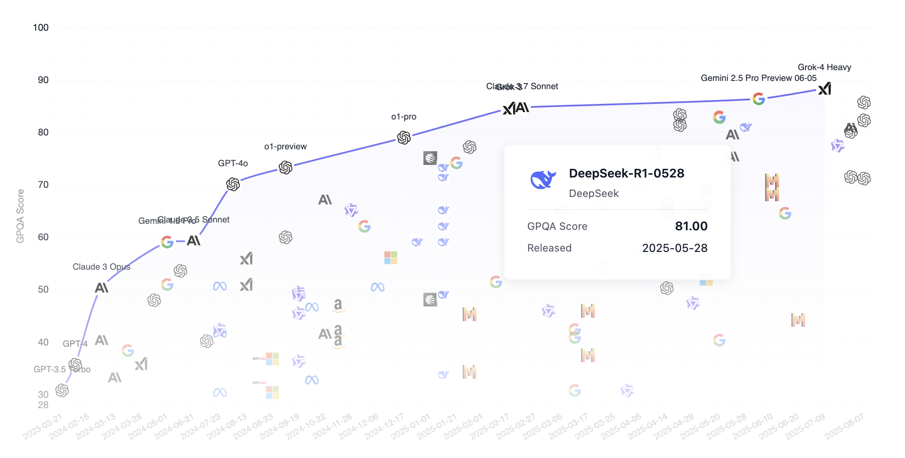

GPQA는 “Graduate-Level Google-Proof Q&A Benchmark”의 약자로, 과학 질의응답 작업을 위한 대학원 수준의 벤치마크입니다. 자세한 소개는 다음과 같습니다.

GPQA는 448개의 객관식 문제를 포함하며, 생물학, 물리학, 화학의 하위 분야를 다룹니다. 예: 양자역학, 유기화학, 분자생물학 등. 이 문제들은 박사 학위를 보유했거나 박사 과정 중인 61명의 전문가가 작성했고, 엄격한 검증 과정을 거쳤습니다.
:::

이 3단계를 따르면 대형 모델 생성 API를 빠르게 통합할 수 있습니다.

1. **DeepSeek 플랫폼에서 API Key 만들기**
2. **DeepSeek 문서에서 텍스트 생성 예시 찾기**. 보통 바로 복사할 수 있는 코드가 있습니다.
3. **AI IDE를 열고 API Key + 공식 예시를 붙여 넣은 뒤**, 구현할 기능을 알려 줍니다.
   > 이 대형 모델 API를 연결해서 이 애플리케이션의 문구 생성 작업을 지원해 줘.

이제 시연을 진행합니다. 전체 흐름을 따라 직접 한 번 조작해 보세요. 먼저 [DeepSeek](https://platform.deepseek.com/usage) 계정을 등록하고 API Key를 만든 뒤, 검증을 위해 소액을 충전합니다.

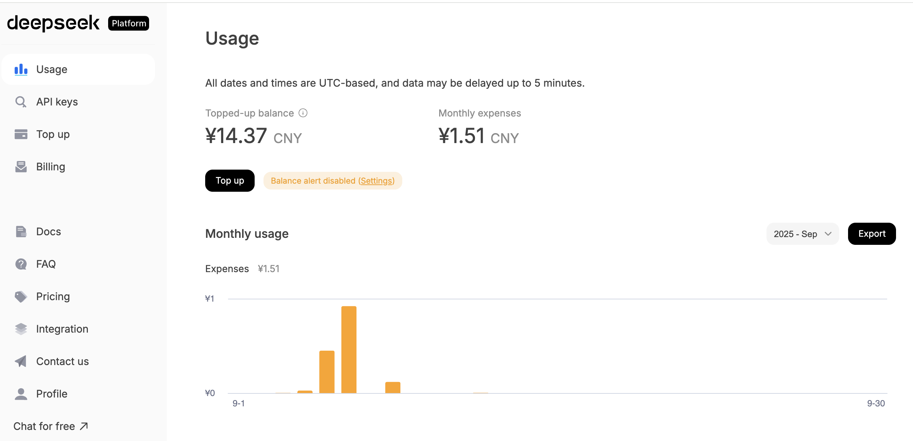

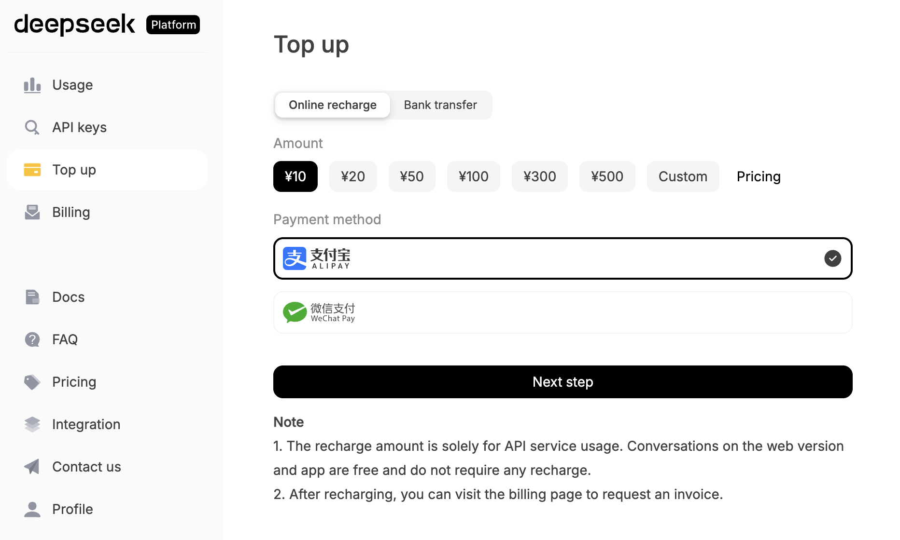

“API KEYS”를 클릭하고 화면 아래에서 “create new API key”를 찾습니다. 최종적으로 `sk-8573341c39fc44315aadc071c53rh7d2` 같은 API key를 얻게 됩니다.


키를 얻으면 모델을 호출할 권한을 가진 것입니다.

이때 [API](https://api-docs.deepseek.com/) 문서를 바로 읽을 수 있습니다. 보통 curl 또는 Python 호출 예시를 제공합니다.


예시를 찾은 뒤, 문서의 모든 내용과 키를 AI IDE의 대화창에 복사해 넣고, 이전에 개발해 둔 프로토타입에 대형 언어 모델을 통합해 달라고 요청할 수 있습니다.


참고 프롬프트는 다음과 같습니다.

```
이 호출 방법을 참고해 문구 생성 기능을 지원해 주세요. 상품 정보를 바탕으로 클릭하면 해당 Douyin 이커머스 문구를 여러 스타일로 생성할 수 있어야 합니다.

아래 참고 자료:
api key: sk-8573341c39aefa1efe
api 요청 참고:
curl  \
  -H "Content-Type: application/json" \
  -H "Authorization: Bearer ${DEEPSEEK_API_KEY}" \
  -d '{
        "model": "deepseek-chat",
        "messages": [
          {"role": "system", "content": "You are a helpful assistant."},
          {"role": "user", "content": "Hello!"}
        ],
        "stream": false
      }'
```

AI가 코드를 생성하는 데 약간의 시간이 지나면, 테스트할 수 있는 대응 문구 생성 버튼을 쉽게 얻을 수 있습니다. 입구를 찾을 수 없다면 AI IDE에게 어느 페이지에서 해당 페이지로 들어갈 수 있는지 알려 달라고 하면 됩니다. 정말 찾기 어렵다면 AI IDE에게 당신의 생각을 바탕으로 직접 리팩터링하고 개선하게 하여 최종 문구 생성 결과를 얻을 수 있습니다.

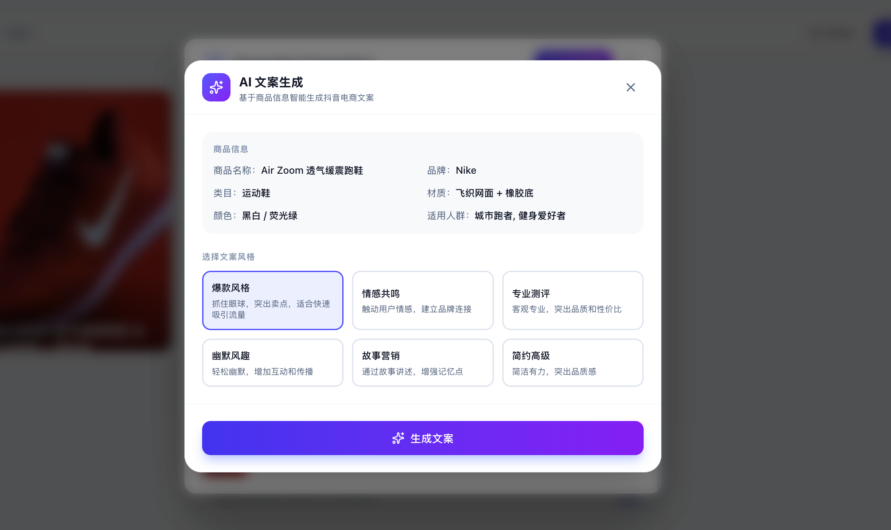

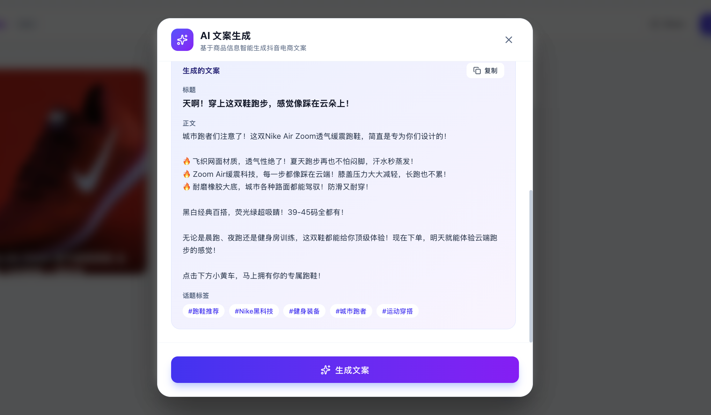

물론 여기서 이런 질문이 들 수 있습니다. 실제로 대형 모델을 호출한 것인지, 아니면 고정된 답변을 내장한 것인지 어떻게 알 수 있을까요? 사용자 지정 문구를 입력하고, 대형 모델이 당신이 즉시 지정한 사용자 정의 분석을 바탕으로 대응 문구를 생성하게 해 보면 됩니다.

매번 결과가 다르고 논리적으로도 맞는다면, 이때 API가 정상적으로 호출되어 생성되고 있다고 안심해도 됩니다. [API 사용 관리 플랫폼](https://platform.deepseek.com/usage)에서 성공적으로 호출되었는지도 확인할 수 있습니다. 다만 표시되기까지 몇 분이 걸릴 수 있습니다.

## 더 많은 텍스트 생성 모델 선택지

DeepSeek 외에도 다른 대형 언어 모델을 시도할 수 있습니다. 대부분의 모델이 **OpenAI 호환 인터페이스**를 제공하므로 전환은 매우 간단합니다. API Key, 기본 URL, 모델 이름만 바꾸면 됩니다.

### MiniMax 통합

::: details 더 알아보기: MiniMax란 무엇인가?

**MiniMax**는 범용 인공지능 기술 연구 개발에 힘쓰는 중국 인공지능 회사입니다. MiniMax는 자체 연구 개발한 MiniMax-M2.7 대형 언어 모델 시리즈를 출시했으며, 여러 벤치마크 테스트에서 우수한 성능을 보이고 매우 높은 가성비를 가지고 있습니다.

**MiniMax-M2.7 시리즈의 주요 특징:**

- **초장문 컨텍스트**: 204,800 tokens 컨텍스트 창을 지원하여 긴 문서와 다중 턴 대화 처리에 적합합니다.
- **높은 가성비**: 가격 경쟁력이 매우 높습니다.
- **OpenAI 호환 인터페이스**: OpenAI SDK로 바로 호출할 수 있어 새로운 API 형식을 추가로 배울 필요가 없습니다.
- **사용 가능한 두 모델**:
  - `MiniMax-M2.7`: 플래그십 모델로 복잡한 작업에 적합합니다.
  - `MiniMax-M2.7-highspeed`: 같은 성능을 유지하면서 더 빠른 고속 버전입니다.
:::

연결 방식은 DeepSeek과 동일하며, 세 단계만 필요합니다.

1. [MiniMax 오픈 플랫폼](https://platform.minimax.io/)으로 가서 계정을 등록하고 API Key를 만듭니다.
2. MiniMax 문서에서 호출 예시를 찾습니다.
3. API Key + 예시를 AI IDE에 붙여 넣습니다.

MiniMax는 OpenAI 호환 인터페이스를 제공하므로 아래 curl 예시와 당신의 API Key를 그대로 복사해 AI IDE에 보내 통합할 수 있습니다.

```bash
curl https://api.minimax.io/v1/chat/completions \
  -H "Content-Type: application/json" \
  -H "Authorization: Bearer ${MINIMAX_API_KEY}" \
  -d '{
        "model": "MiniMax-M2.7",
        "messages": [
          {"role": "system", "content": "You are a helpful assistant."},
          {"role": "user", "content": "Hello!"}
        ],
        "stream": false
      }'
```

::: tip ✅ 팁
MiniMax의 API 형식은 DeepSeek과 거의 완전히 같습니다. 둘 다 OpenAI 호환 형식입니다. 따라서 이미 DeepSeek을 성공적으로 연결했다면, MiniMax로 전환할 때는 세 곳만 수정하면 됩니다.
1. **기본 URL**: `https://api.minimax.io/v1`로 변경
2. **API Key**: MiniMax의 API Key 사용
3. **모델 이름**: `MiniMax-M2.7` 또는 `MiniMax-M2.7-highspeed`로 변경

자세한 내용은 [MiniMax OpenAI 호환 인터페이스 문서](https://platform.minimax.io/docs/api-reference/text-openai-api)를 참고하세요.
:::

# 3. 이미지-텍스트 API 연결하기: Qwen3 VL

::: info ℹ️ 원리 확장
원리 관련 내용을 더 알고 싶다면 부록 [비전 언어 모델(VLM) 입문](/ko-kr/appendix/8-artificial-intelligence/multimodal-models)을 확인하세요.

::: details 더 알아보기: Qwen3 VL이란 무엇인가?

**Qwen3 VL**은 Alibaba Cloud Tongyi Qianwen 팀이 출시한 멀티모달 비전 언어 모델 시리즈의 최신 버전입니다. VL은 “Vision-Language”, 즉 비전 언어 모델을 의미합니다. 이미지를 이해하고, 이미지에 대한 텍스트 설명을 생성하고, 이미지 관련 질문에 답하고, 이미지 정보를 추출하는 등의 작업을 할 수 있습니다.

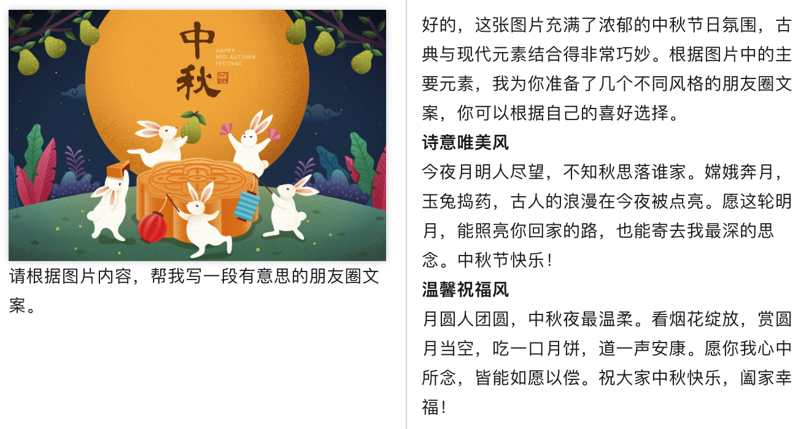


**Qwen3 VL의 주요 능력은 다음과 같습니다.**

- **이미지 이해**: 이미지 속 물체, 장면, 인물, 문자 등을 인식할 수 있습니다.
- **시각 질의응답**: 사용자 질문에 따라 이미지에 관한 질문에 정확히 답할 수 있습니다.
- **이미지 설명**: 자세하거나 간결한 이미지 텍스트 설명을 생성합니다.
- **다중 이미지 이해**: 여러 이미지를 동시에 처리하고 비교 분석할 수 있습니다.
- **텍스트 추출**: 이미지에서 문자 내용을 추출합니다. OCR 능력입니다.

**왜 Qwen3 VL을 선택할까요?**

이전 세대 모델과 비교하면 Qwen3 VL은 이미지 이해 정확도에서 뚜렷하게 향상되었고, 더 길고 복잡한 이미지 분석 작업을 지원합니다. 중국어 이해 성능이 우수하고 API 호출 비용이 상대적으로 낮아 가성비가 높습니다. 또한 컨텍스트 창이 더 커서 더 복잡한 시각 추론 작업을 처리할 수 있습니다.

**대표 적용 장면:**

- 이커머스: 상품 이미지에서 제목, 설명, 판매 포인트 자동 생성
- 콘텐츠 창작: 소재 이미지를 바탕으로 문구나 이미지 제안 자동 생성
- 사무: 이미지 내용 추출, 보고서 자동 인식
- 교육: 이미지 문제 자동 해석, 지식 포인트 추출

:::

앞부분에서 텍스트 생성 API를 연결하는 방법을 설명했습니다. 하지만 앞선 애플리케이션 장면에서는 문제가 하나 있습니다. 우리는 이미지를 업로드합니다. 대형 언어 모델만 사용하면 이미지 안의 내용을 제대로 이해하기 어렵고, 생성 결과가 달라질 가능성이 큽니다.

우리는 이미지를 텍스트 설명으로 바꿔 줄 수 있는 모델이 필요합니다. 이때 필요한 것이 비전 언어 모델(VLM)입니다. 사례에서는 비전 언어 모델을 사용해 상품의 판매 포인트 설명을 생성하여 사용자 경험을 높입니다.

편의를 위해 [클라우드 플랫폼 SiliconFlow](https://cloud.siliconflow.cn/me)가 제공하는 API 인터페이스를 사용해 이미지-텍스트 API를 연결합니다.

::: details 더 알아보기: SiliconFlow란 무엇인가
**SiliconFlow**는 중국 내에서 잘 알려진 AI 모델 집계 플랫폼으로, 여러 주요 대형 언어 모델과 비전 언어 모델의 API 인터페이스 서비스를 제공합니다.

**플랫폼 특징:**

- **다중 모델 지원**: DeepSeek, Qwen, Llama 계열 등 여러 주요 AI 모델과 오픈소스 모델을 통합합니다.
- **기술 최적화**: 오픈소스 모델에 대한 추론 최적화를 수행하여 낮은 지연 시간과 높은 동시성의 API 서비스를 제공합니다.
- **인터페이스 호환**: OpenAI 형식과 호환되는 API 인터페이스를 제공하여 기존 애플리케이션 통합이 쉽습니다.
- **사용량 기반 과금**: 호출량에 따라 비용을 지불하는 방식을 지원합니다.

SiliconFlow는 오픈소스 대형 모델 추론 서비스 측면에서 비교적 성숙했으며, 중국산 오픈소스 AI 모델을 사용할 때 자주 선택되는 플랫폼 중 하나입니다.
:::

SiliconFlow 플랫폼의 홈 화면에 들어가면 많은 모델을 선택할 수 있습니다. 왼쪽 위에서 필터를 찾아 펼친 뒤, 비전 태그를 선택하면 여러 이미지-텍스트 모델을 볼 수 있습니다. 예를 들어 Zhipu GLM-4.6V나 Qwen3-VL이 있습니다.


테스트를 위해 아무 모델이나 선택할 수 있습니다. 여기서는 `Qwen/Qwen3-VL-8B-Instruct`를 예로 들겠습니다.

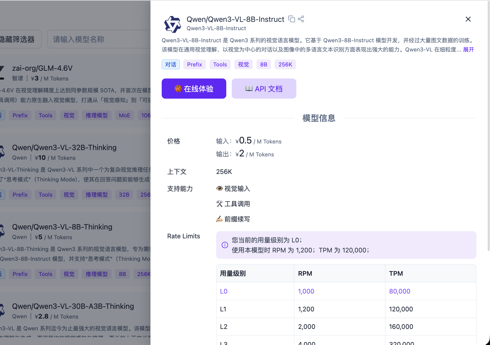

[SiliconFlow 플랫폼](https://cloud.siliconflow.cn/me/account/ak)에 들어가 API 키에서 “새 API 키”를 클릭해 새로운 API Key를 만듭니다.

아래 코드를 참고 코드로 사용할 수 있습니다. 생성한 API Key와 함께 AI IDE에 보내 기능을 통합하세요.

::: details 이미지-텍스트 참고 코드

```python
from openai import OpenAI
from typing import Dict, Any, List
import base64
import os
SILICONFLOW_API_KEY: str = ""
SILICONFLOW_BASE_URL: str = "https://api.siliconflow.cn/v1/"
MODEL_NAME: str = "Qwen/Qwen3-VL-8B-Instruct"

def encode_image(image_path: str) -> str:
    with open(image_path, "rb") as image_file:
        return base64.b64encode(image_file.read()).decode('utf-8')

def get_vlm_completion(client: OpenAI, messages: List[Dict[str, Any]]) -> str:
    response = client.chat.completions.create(
        model=MODEL_NAME,
        messages=messages,
        max_tokens=512,
        temperature=0.7,
        top_p=0.7,
        frequency_penalty=0.5,
        stream=False,
        n=1
    )
    return response.choices[0].message.content

def caption_image(image_path: str) -> str:
    base64_image = encode_image(image_path)
    messages = [
        {
            "role": "user",
            "content": [
                {
                    "type": "text",
                    "text": "Please describe this image in detail."
                },
                {
                    "type": "image_url",
                    "image_url": {
                        "url": f"data:image/jpeg;base64,{base64_image}"
                    }
                }
            ]
        }
    ]

    client = OpenAI(
        api_key=SILICONFLOW_API_KEY,
        base_url=SILICONFLOW_BASE_URL
    )

    return get_vlm_completion(client, messages)

image_path = "images.jpg"
caption = caption_image(image_path)
```

:::

이 장면에서는 AI IDE에게 업로드한 이미지를 바탕으로 이커머스 판매 포인트 텍스트와 키워드를 자동 생성하는 기능을 구현하게 해 봅니다. 아래와 같습니다.

```
아래 이미지-텍스트 API를 바탕으로, 업로드한 이미지에서 이커머스 판매 포인트 텍스트와 키워드를 자동 생성하는 기능을 구현해 주세요.

<여기서는 코드를 생략했습니다. 직접 키와 참고 코드를 붙여 넣어야 합니다.>
```

마지막으로 생성 결과를 얻습니다.
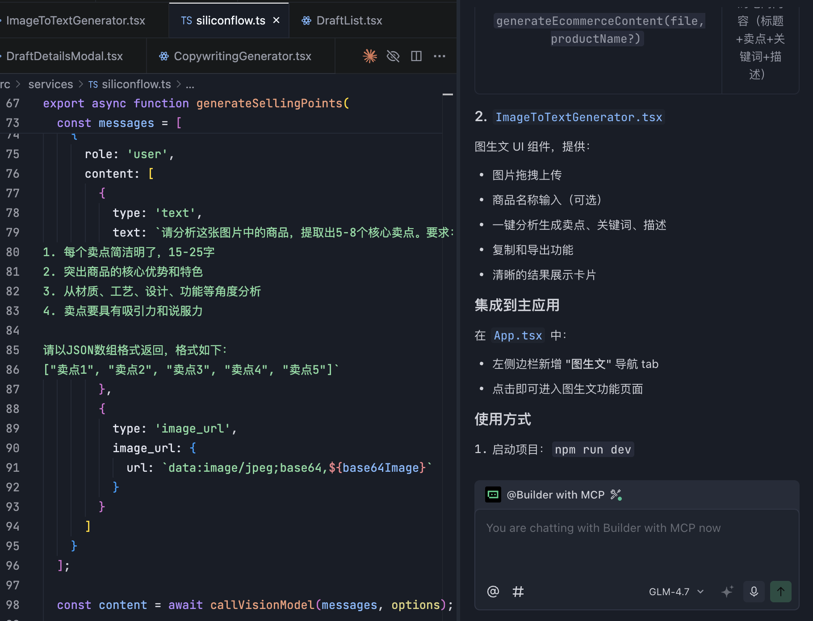

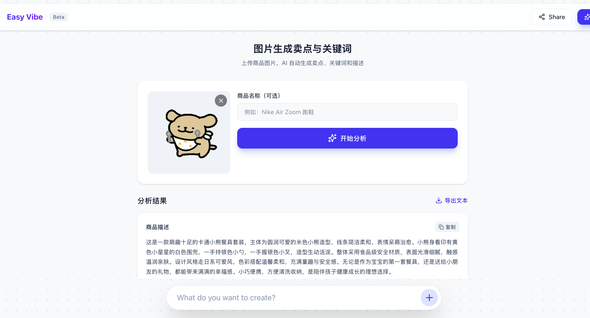

<div style="margin: 50px 0;">
  <ClientOnly>
    <StepBar :active="2" :items="[
      { title: 'API 기초', description: '핵심 개념과 보안 규범 이해' },
      { title: '텍스트 연결', description: 'DeepSeek 텍스트 생성 실습' },
      { title: '이미지 연결', description: 'VLM 이미지 이해와 생성' }
    ]" />
  </ClientOnly>
</div>

# 4. 이미지 생성 API 연결하기: Seedream

앞부분에서는 주로 텍스트 관련 작업을 다뤘습니다. 이제 이미지 생성 기능을 연결해 보겠습니다. 텍스트 설명에서 이미지를 생성하거나 이미지를 수정하는 기능을 지원합니다.

::: info ℹ️ 원리 확장
원리 관련 내용을 더 알고 싶다면 부록 [이미지 생성 입문](/ko-kr/appendix/8-artificial-intelligence/image-generation)을 확인하세요.

::: details 더 알아보기: [Seedream](https://seed.bytedance.com/en/seedream4_5)이란 무엇인가?


> 어쩌면 Nano Banana(Google 개발)를 이미 알고 있을 수 있지만, Seedream을 놓치지 않는 것이 좋습니다. Seedream 4.5는 ByteDance가 만든 차세대 이미지 창작 모델입니다. 이미지 생성과 이미지 편집 능력을 하나의 통합 아키텍처에 결합합니다. 이를 통해 지식 기반 생성, 복잡한 추론, 참조 일관성 같은 복잡한 멀티모달 작업을 유연하게 처리할 수 있습니다. 또한 추론 속도는 이전 제품보다 훨씬 빠르며, 최대 4K 해상도의 놀라운 고화질 이미지를 생성할 수 있습니다.
>
> 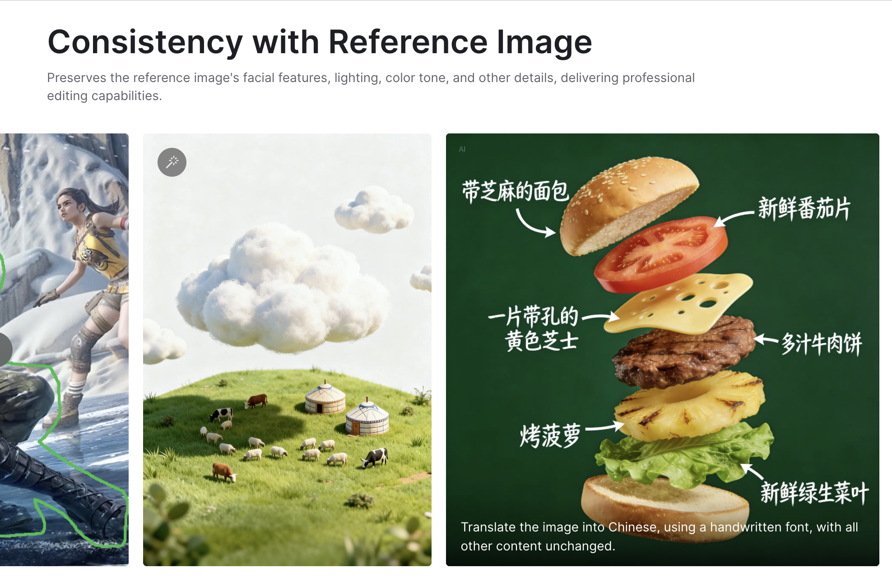
> 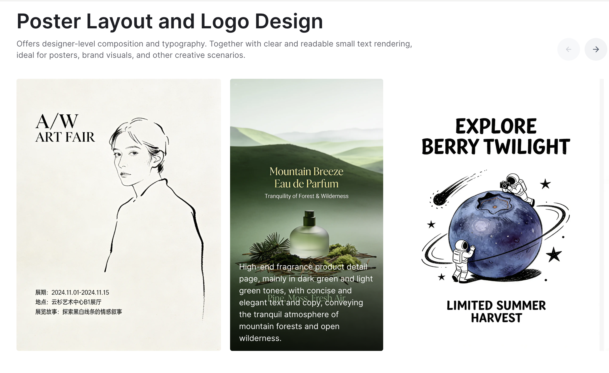

**주요 능력:**

- **텍스트-이미지**: 텍스트 설명으로 이미지를 생성하며, 다양한 스타일(실사, 카툰, 수묵화, 사이버펑크 등)을 지원합니다.
- **스타일 전이**: 이미지를 지정한 예술 스타일로 변환합니다.
- **이미지 변형**: 참고 이미지를 바탕으로 유사한 스타일의 새 이미지를 생성합니다.
- **해상도 향상**: 이미지 선명도와 세부 사항을 강화합니다.
- **이미지 편집**: 자연어 지시에 따라 기존 이미지를 편집하고 수정합니다.

**왜 Seedream을 선택할까요?**

- **중국 내 네트워크 안정성**: 중국 내 접속 속도가 빠르고 지연 시간이 낮습니다.
- **우수한 결과**: 이커머스와 소재 장면에서 안정적이고 신뢰할 만한 결과를 보입니다.
- **중국어 최적화**: 중국어 프롬프트 이해가 더 정확해 중국 사용자를 위한 작업에 적합합니다.
- **빠른 속도**: 생성 효율이 높고 응답 시간이 짧습니다.
- **안정적인 품질**: 최대 4K 해상도의 고화질 이미지를 생성합니다.

**대표 적용 장면:**

- 이커머스: 대표 이미지, 상세 페이지 이미지, 프로모션 포스터 생성
- 소셜미디어: 아바타, 이모티콘, 첨부 이미지 생성
- 디자인: 콘셉트 이미지, 소재 이미지, 배경 이미지 빠르게 제작
- 마케팅: 광고 이미지, 이벤트 banner, 명절 포스터 제작

**Qwen3 VL과의 조합:**

이 두 API는 이어서 사용할 수 있습니다. 먼저 Qwen3 VL로 참고 이미지를 분석해 화면 내용을 이해하고, 그다음 Seedream이 분석된 참고 이미지의 프롬프트 내용을 바탕으로 새 이미지를 생성합니다.
:::

Douyin, Bilibili, YouTube에서 볼 수 있는 많은 “AI 포스터 / AI 대표 이미지 / AI 캐릭터 이미지”는 본질적으로 여기서 소개하는 기술을 사용합니다. 당신이 해야 할 일은 간단합니다. 사용자 입력을 한 문장으로 정리하고 이미지 API를 요청한 뒤, 반환된 이미지를 표시하면 됩니다. 이때 사용하는 모델을 이미지 생성 / 이미지 편집 모델이라고 합니다.

이제 Seedream API를 프로젝트에 통합하는 방법을 단계별로 시연합니다. AI IDE의 도움을 받아 진행합니다.

[홈페이지](https://www.volcengine.com/experience/ark?launch=seedream)에 접속한 뒤 로그인을 클릭합니다.

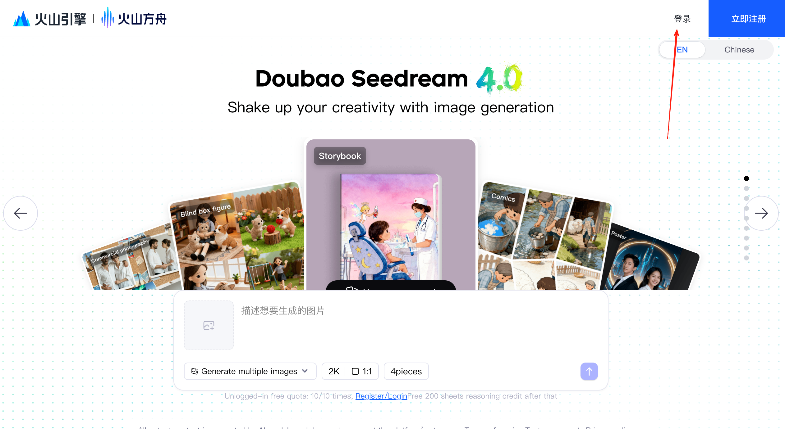

로그인 후 페이지 오른쪽 위의 충전 옵션을 찾습니다.

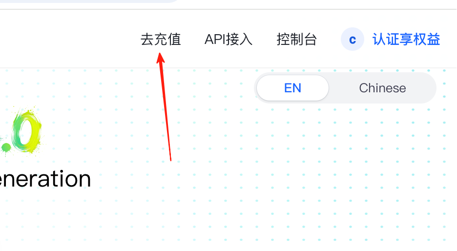

충전하려면 실명 인증이 필요합니다.

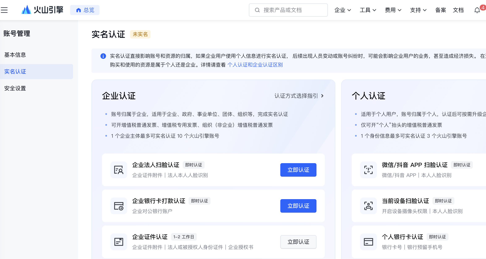

인증이 성공하면 [1위안을 충전해 테스트](https://console.volcengine.com/finance/fund/recharge)할 수 있습니다.

[초기 화면](https://www.volcengine.com/experience/ark?launch=seedream)으로 돌아가 API 접근을 클릭합니다.

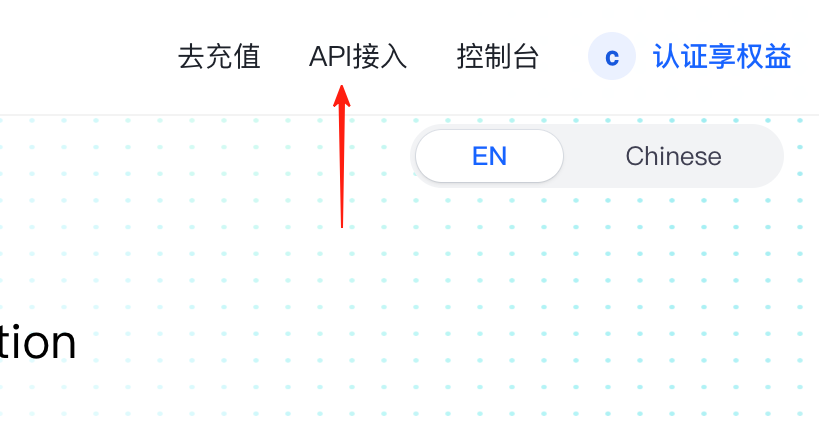

먼저 API key를 만들고, 선택 옵션을 클릭합니다.

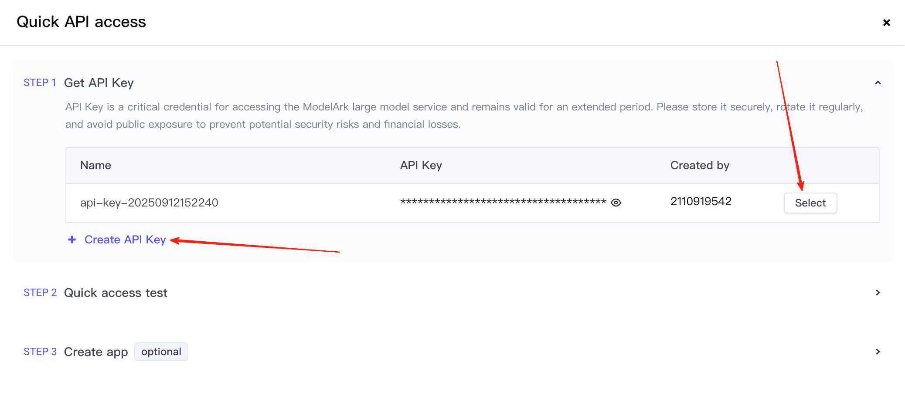

그러면 2단계로 이동합니다. 여기에서 호출할 서비스가 Seedream 4.5인지 확인하고, 제공된 호출 예시를 복사해야 합니다. 이 스크린샷은 촬영 시점이 조금 이르기 때문에 모델 버전이 여전히 4.0으로 표시되어 있습니다.

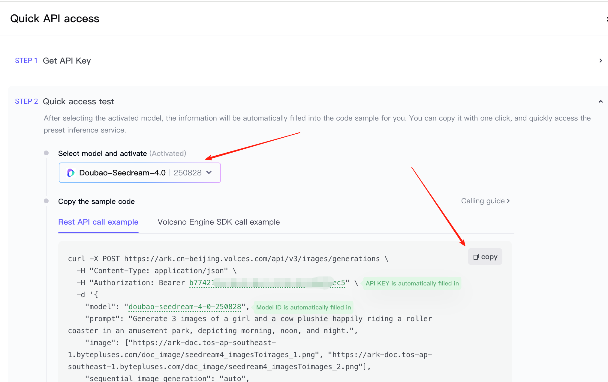

API Key와 호출 예시가 준비되면, 그것들을 AI IDE에 바로 붙여 넣어 프론트엔드 상호작용 데모를 생성하거나 기존 프로토타입에 능력을 연결하게 할 수 있습니다. 이미지에서 텍스트-이미지를 선택할지, 여러 이미지로 단일 이미지를 생성할지 선택할 수 있다는 점에 주의하세요. 현재 요구에 맞춰 참고 코드를 선택해야 합니다.

::: warning ⚠️ 중요 팁
여기의 기본 예시는 비교적 복잡합니다. **“워터마크 추가”** 와 **“스트리밍 응답”** 을 비활성화하는 것을 기억하세요. 그래야 워터마크가 생성되지 않고 요청 실패도 줄일 수 있습니다.
:::

이후에 참고 이미지 생성 모드를 사용할 것이므로, 먼저 여러 이미지로 단일 이미지를 생성하는 기능으로 갑니다. 복사한 참고 코드는 다음과 같습니다.

```
curl -X POST https://ark.cn-beijing.volces.com/api/v3/images/generations \
  -H "Content-Type: application/json" \
  -H "Authorization: Bearer xxxxxxx" \
  -d '{
    "model": "doubao-seedream-4-5-251128",
    "prompt": "이미지 1의 의상을 이미지 2의 의상으로 바꿔 주세요",
    "image": ["https://ark-project.tos-cn-beijing.volces.com/doc_image/seedream4_imagesToimage_1.png", "https://ark-project.tos-cn-beijing.volces.com/doc_image/seedream4_imagesToimage_2.png"],
    "sequential_image_generation": "disabled",
    "response_format": "url",
    "size": "2K",
    "stream": false,
    "watermark": true
}'
```

이미지 참고 코드가 생겼다면 AI IDE에게 이커머스에서 자주 쓰는 이미지 작업 기능을 지원하게 합니다.

```
아래 API를 바탕으로 이 프로젝트에서 이커머스 업무의 일반적인 기능(예: 포스터 생성, Douyin 이커머스 첫 이미지 생성 등)을 구현해 주세요.

<여기에 API KEY와 이미지 편집 코드를 붙여 넣으세요>
```

구현 결과는 다음과 같습니다.

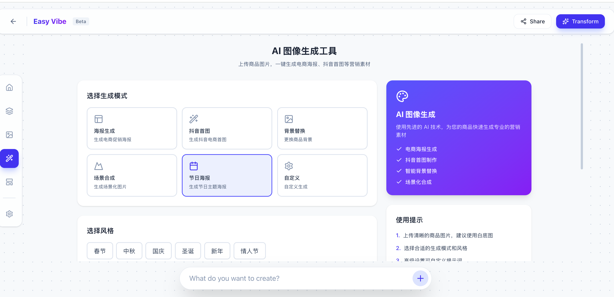

주의할 점은 이미지 생성에서는 이상한 문제를 자주 만날 수 있다는 것입니다. 따라서 AI IDE가 전체 오류 정보를 표시하도록 하는 것이 좋습니다. 그래야 복사해 붙여 넣고 수정하기 쉽습니다. 그렇지 않으면 왜 그런지 모른 채 “생성 실패”만 반복해서 보일 수 있습니다. 예를 들어 이렇게 말할 수 있습니다.

```
이미지 생성 실패라고만 표시하지 말고, 매번 전체 실패 원인을 표시해 주세요. 예: 이미지 불일치, 요청 오류, 타임아웃 등.
```

때로는 수정 후 업데이트가 웹페이지에 적용되지 않을 수 있습니다. 수정 뒤에도 웹페이지가 계속 오류를 내고 있다면(여러 번 반복된다면), AI IDE에게 직접 “이 프로젝트를 재시작해 주세요”라고 말해 보세요.

이커머스 업무에서는 사용자가 업로드한 옷을 자동으로 사람에게 입혀 보게 하거나, 상품의 매력적인 판매 이미지와 포스터를 자동 생성하게 하고 싶을 수 있습니다. 여기서 우리가 시도한 프롬프트는 이커머스 포스터를 생성하게 하는 것입니다.

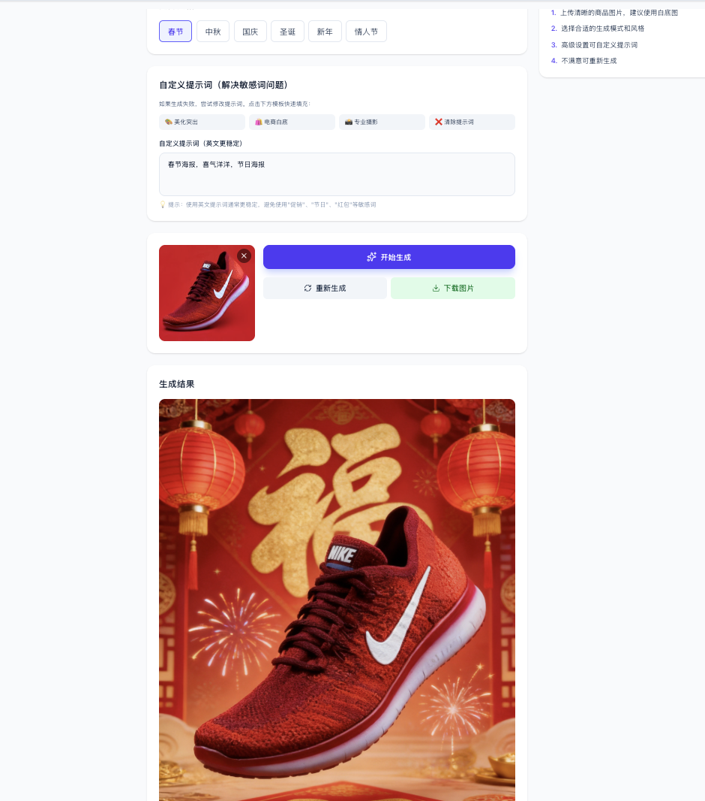

상상하는 비즈니스 장면에 따라 텍스트-이미지 또는 이미지-이미지 API를 사용해 서로 다른 기능을 구현할 수 있습니다.

## 더 많은 이미지 서비스 선택지

아래에 다른 선택지를 제시합니다. 먼저 Qwen 이미지 생성 결과를 끝까지 실행해 본 뒤, 효과와 비용에 따라 아래 서비스를 대체 사용하기를 권장합니다. 실제 사용 감각에 따라 선택하세요.

### Recraft 통합

프로토타입이 “디자인 생산” 쪽에 더 가깝다면, 예를 들어 브랜드 스타일 일러스트, 마케팅 포스터, 벡터 스타일 소재를 생성해야 한다면 Recraft가 더 편할 때가 많습니다. 연결 방식은 이전 절과 완전히 같습니다. **Key를 얻고 + 공식 예시를 찾고 + AI IDE가 예시를 버튼/페이지에 적용하게 합니다.**

::: details 더 알아보기: Recraft란 무엇인가?

> Recraft는 디자이너, 일러스트레이터, 마케터를 위한 AI 도구입니다. 2022년 미국에서 설립되었고 본사는 런던에 있습니다. 이미지, 벡터 아트, 3D 그래픽 같은 시각 결과물을 생성하고 반복 개선하도록 돕습니다. 고품질 출력(어떤 텍스트 크기/길이든), 정확한 요소 배치, 브랜드 일관성 디자인 등의 장점이 있습니다. 200개 국가/지역의 300만 명 이상 사용자(오길비, Netflix 포함)가 신뢰하며, 3.5억 장 이상의 이미지를 만들었습니다. 이 팀은 Recraft를 필수 디자이너 도구로 만들고, 창작자가 AI 보조 워크플로를 통제할 수 있게 하는 것을 목표로 합니다.
>
> 
> 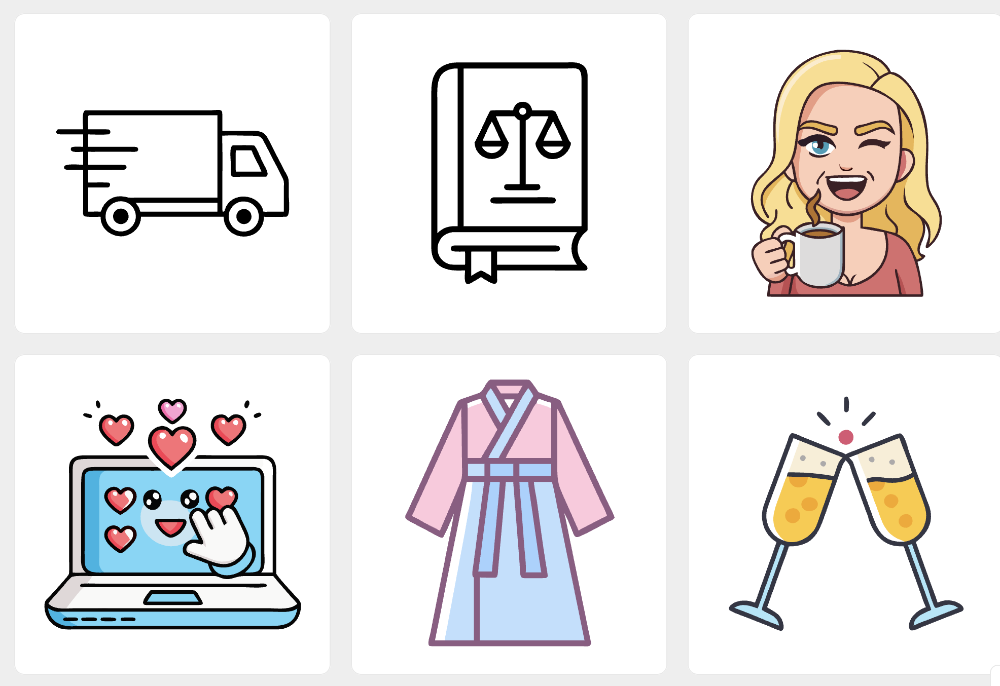

먼저 여전히 [API 입구](https://www.recraft.ai/profile/api)를 찾아 API Key를 얻어야 합니다.

여기는 무료 한도를 제공하지 않으므로 직접 1,000 크레딧을 충전해야 합니다. 이 웹사이트는 Alipay와 WeChat Pay를 지원하므로 1,000 크레딧을 쉽게 얻을 수 있습니다. 필요한 금액 이상 충전하지 않도록 주의하세요.


그 뒤에도 같은 방법을 따릅니다. 공식 문서에서 해당 요청 예시를 찾습니다.

- <https://www.recraft.ai/docs/api-reference/getting-started>
- <https://www.recraft.ai/docs/api-reference/usage>
- <https://www.recraft.ai/docs/api-reference/guides>

:::

### Qwen Image / Qwen Image Edit 통합

더 간단한 방식으로 이미지 생성 서비스를 연결하고 싶다면 Qwen Image(Tongyi Wanxiang)를 고려할 수 있습니다. 생각은 마찬가지입니다. 이것을 “이미지 생성 API”로 보고, 프로토타입 버튼에 연결하면 됩니다.

::: details 더 알아보기: Qwen Image / Qwen Image Edit란 무엇인가?

**Qwen Image**(Tongyi Wanxiang이라고도 함)는 Alibaba Cloud Tongyi 팀이 출시한 이미지 생성 모델 시리즈이며, 주로 두 가지 큰 모델을 포함합니다.

**1. Qwen Image - 텍스트-이미지(Text-to-Image) 모델**

텍스트 설명에 따라 완전히 새로운 이미지를 생성합니다. 프롬프트를 입력하면 모델이 의도를 이해하고 설명에 맞는 이미지를 생성합니다.


**주요 능력:**

- **텍스트-이미지**: 텍스트 설명으로 이미지를 생성하며, 다양한 스타일(실사, 카툰, 수묵화, 사이버펑크 등)을 지원합니다.
- **스타일 전이**: 이미지를 지정한 예술 스타일로 변환합니다.
- **이미지 변형**: 참고 이미지를 바탕으로 유사한 스타일의 새 이미지를 생성합니다.
- **해상도 향상**: 이미지 선명도와 세부 사항을 강화합니다.

**2. Qwen Image Edit - 이미지-이미지(Image-to-Image) 모델**

기존 이미지 위에서 편집과 수정을 수행합니다. 자연어 지시를 통해 모델이 수정 의도를 이해하고 결과를 생성하게 합니다.

**주요 능력:**

- **부분 교체**: 이미지 속 어떤 물체나 인물을 교체합니다. 예: “배경을 바닷가로 바꿔줘”.
- **요소 제거**: 이미지에서 필요 없는 요소를 제거합니다.
- **스타일 변환**: 이미지에 필터나 예술 효과를 추가합니다.
- **이미지 확장**: 이미지 경계를 확장하고 새 내용을 생성합니다.
- **지능형 보정**: 자동 미화, 빛과 그림자 조정, 결함 복구.

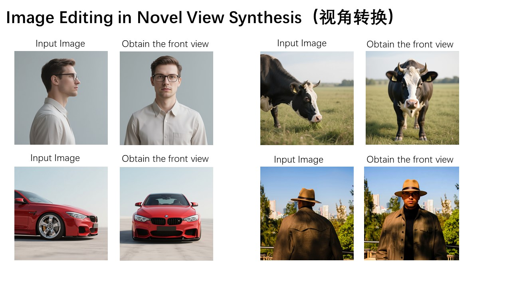

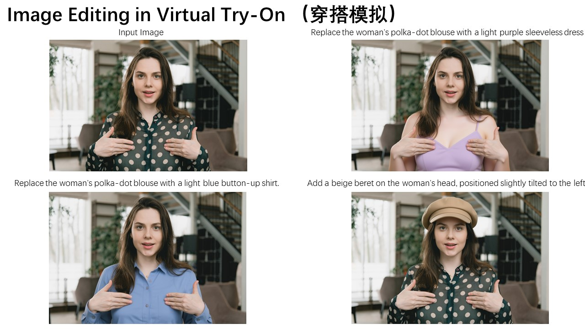

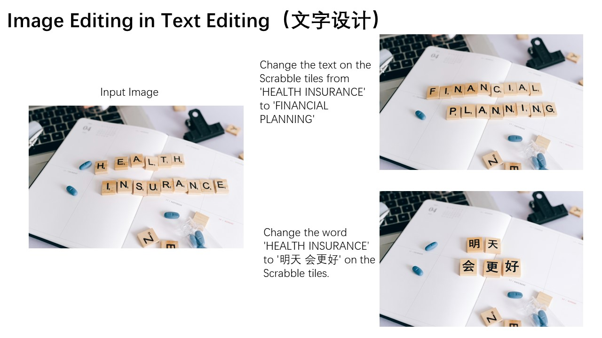

**왜 Qwen Image 시리즈를 선택할까요?**

- **중국어 최적화**: 중국어 프롬프트 이해가 더 정확해 중국 사용자를 위한 작업에 적합합니다.
- **낮은 비용**: 국제 경쟁 제품과 비교해 가격이 더 저렴합니다.
- **빠른 속도**: 생성 효율이 높고 응답 시간이 짧습니다.
- **안정적인 품질**: 이커머스와 소재 장면에서 안정적이고 신뢰할 만한 결과를 보입니다.
- **다양한 스타일**: 여러 예술 스타일과 창의적 효과를 지원합니다.

**대표 적용 장면:**

- 이커머스: 대표 이미지, 상세 페이지 이미지, 프로모션 포스터 생성
- 소셜미디어: 아바타, 이모티콘, 첨부 이미지 생성
- 디자인: 콘셉트 이미지, 소재 이미지, 배경 이미지 빠르게 제작
- 마케팅: 광고 이미지, 이벤트 banner, 명절 포스터 제작
  :::

[SiliconFlow](https://siliconflow.cn/) 공식 웹사이트를 확인합니다. 왼쪽에는 “Playground” 섹션이 있으며, API 호출 없이 여러 모델을 시험해 볼 수 있습니다. 웹페이지 상단에는 “Filters” 버튼이 있습니다. 클릭하면 오른쪽 모델 목록을 필터링할 수 있습니다.

“Image”를 선택하면 현재 지원하는 모든 텍스트-이미지 모델만 보입니다. 이 경우 우리는 Qwen/Qwen-Image를 사용할 것입니다.

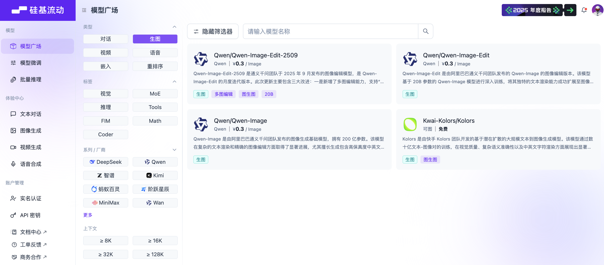

모든 설정이 끝나면 해당 이미지 생성 API 문서를 참고해야 합니다. 공식 문서 페이지에서 “API Reference”라고 표시된 부분을 찾을 수 있습니다. 그것을 클릭한 뒤 [이미지 생성 API 섹션](https://docs.siliconflow.cn/cn/api-reference/images/images-generations)으로 이동해 관련 요청 예시를 찾습니다.

아래 요청 예시와 API KEY를 함께 AI IDE에 보내면 이미지 생성 기능을 구현할 수 있습니다.

```bash
curl --request POST \
  --url https://api.siliconflow.cn/v1/images/generations \
  --header 'Authorization: Bearer <token>' \
  --header 'Content-Type: application/json' \
  --data '
{
  "model": "Qwen/Qwen-Image-Edit-2509",
  "prompt": "an island near sea, with seagulls, moon shining over the sea, light house, boats int he background, fish flying over the sea"
}
'
```

여기의 모델은 Qwen/Qwen-Image 또는 Qwen/Qwen-Image-Edit-2509를 사용할 수 있습니다.

::: details 이미지 편집 참고 코드

아래 코드와 key를 함께 복사해 AI IDE에 보내세요.

```python
import requests
import os
from typing import Dict, Any, Optional

SILICONFLOW_API_KEY: str = ""
SILICONFLOW_BASE_URL: str = "https://api.siliconflow.cn/v1/images/generations"
QWEN_IMAGE_EDIT_MODEL: str = "Qwen/Qwen-Image-Edit-2509"

def generate_image_edit(
    prompt: str,
    image: Optional[str] = None,
    image2: Optional[str] = None,
    image3: Optional[str] = None,
    negative_prompt: Optional[str] = None,
    cfg: Optional[float] = 4.0,
    seed: Optional[int] = None
) -> Optional[Dict[str, Any]]:
    payload: Dict[str, Any] = {
        "model": QWEN_IMAGE_EDIT_MODEL,
        "prompt": prompt,
    }
    if image:
        payload["image"] = image
    if image2:
        payload["image2"] = image2
    if image3:
        payload["image3"] = image3
    if negative_prompt:
        payload["negative_prompt"] = negative_prompt
    if cfg is not None:
        payload["cfg"] = cfg
    if seed is not None:
        payload["seed"] = seed

    headers: Dict[str, str] = {
        "Authorization": f"Bearer {SILICONFLOW_API_KEY}",
        "Content-Type": "application/json"
    }

    try:
        response = requests.post(SILICONFLOW_BASE_URL, json=payload, headers=headers)
        response.raise_for_status()
        return response.json()
    except requests.exceptions.RequestException as e:
        print(f"Error generating image: {e}")
        return None

def save_image_from_url(image_url: str, output_path: str = "image.png") -> bool:
    try:
        response = requests.get(image_url)
        response.raise_for_status()
        os.makedirs(os.path.dirname(output_path) if os.path.dirname(output_path) else ".", exist_ok=True)
        with open(output_path, "wb") as f:
            f.write(response.content)
        print(f"Image saved successfully to: {output_path}")
        return True
    except requests.exceptions.RequestException as e:
        print(f"Error downloading image: {e}")
        return False
    except Exception as e:
        print(f"Error saving image: {e}")
        return False

prompt: str = "하늘을 저녁으로 바꾸고, 달과 별이 보이는 몽환적인 스타일로 만들어 주세요"
negative_prompt: str = "흐림, 저품질, 왜곡"
image_url: str = "https://inews.gtimg.com/om_bt/Os3eJ8u3SgB3Kd-zrRRhgfR5hUvdwcVPKUTNO6O7sZfUwAA/641"
image2_url: Optional[str] = None
image3_url: Optional[str] = None

cfg: float = 4.0
seed: int = 12345
output_path: str = "edited_image.png"

print(f"Generating edited image with prompt: {prompt}")
print(f"Input image: {image_url}")
print(f"CFG: {cfg}, Seed: {seed}")
print("-" * 50)

result = generate_image_edit(
    prompt=prompt,
    image=image_url,
    image2=image2_url,
    image3=image3_url,
    negative_prompt=negative_prompt,
    cfg=cfg,
    seed=seed
)

if result and "images" in result:
    images = result["images"]
    if images and len(images) > 0:
        image_url_result = images[0]["url"]
        print(f"Image edit generated successfully. URL: {image_url_result}")
        success = save_image_from_url(image_url_result, output_path)
        if success:
            print(f"Image saved to: {output_path}")
        else:
            print("Failed to save image to local file")
    else:
        print("No images found in response")
else:
    print("Image generation failed")
    if result:
        print(f"Response: {result}")
```

:::

# 부록: “현재 더 강한” AI 모델을 찾는 법

텍스트 모델(흔히 “대형 언어 모델”이라고도 함)의 발전 속도는 매우 빠릅니다. 우리는 항상 우리가 사용하는 모델이 더 나은 성능을 보이는 모델 중 하나인지 확인해야 합니다. 아래 두 웹사이트를 통해 “지금 사람들이 많이 쓰고, 평가도 좋은 모델”을 편하게 볼 수 있습니다.

일반적으로 이런 웹사이트는 **“모델 경기장”** 으로 이해할 수 있습니다. 두 모델의 출력을 나란히 놓고, 당신이 더 마음에 드는 쪽에 투표합니다. 표가 많은 모델은 보통 더 많은 사람이 “더 쓰기 좋다”고 느낀다는 뜻입니다.

또한 이런 대형 모델 경기장에서 가끔 신비로운 익명 모델(“Unknown Model”)을 볼 수도 있습니다. 이는 보통 누군가 “내부 테스트 모델”을 몰래 넣어 블라인드 테스트를 하고 있다는 뜻입니다. 더 강한 능력을 미리 체험할 기회일 수도 있습니다.

## LMArena

웹사이트: <https://lmarena.ai/>

LMArena는 “다수의 사람이 어떤 모델의 답변을 더 선호하는지” 판단하는 데 더 적합합니다. 투표가 많고 점수가 높을수록 보통 실제 사용 장면에서 더 안정적이라는 뜻입니다.

간단한 사용법은 다음과 같습니다.

1. 순위표(Leaderboard)를 바로 봅니다.
2. 먼저 작업 방향을 하나 선택합니다. 예: 일반 대화 / 프로그래밍 / 비전.
3. Top 3 안에서 사용할 수 있는 것을 고릅니다. 접근 가능하고, 가격을 감당할 수 있고, 지연 시간도 받아들일 수 있어야 합니다.

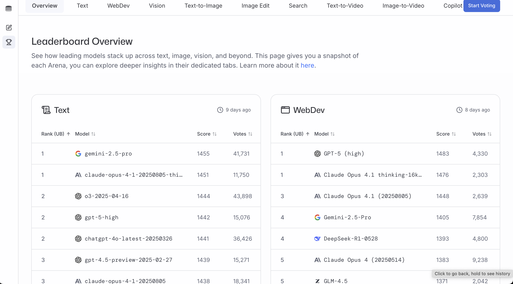

## Artificial Analysis

웹사이트: <https://artificialanalysis.ai/>

Artificial Analysis는 “효과 / 가격 / 속도”를 같은 표에서 비교하는 데 더 적합합니다. 모델 선택을 위한 매개변수 표로 볼 수 있습니다.

자주 쓰는 방법은 다음과 같습니다.

1. 관심 있는 모델 범주를 찾습니다. 텍스트 / 이미지 생성 등.
2. 품질 지표(Quality) + 가격(Price) + 지연/처리량(Latency/Throughput)을 봅니다.
3. 제품에 가장 잘 맞는 “종합 가성비” 모델을 선택합니다.

::: tip ✅ 제안
“어떤 모델이 더 강한가”를 감으로 논쟁하지 마세요. 더 믿을 만한 방법은 같은 입력 묶음으로 2-3개 모델을 동시에 테스트하고, 순위표와 가격을 함께 고려해 결정하는 것입니다.
:::

## 요약

여러 AI 서비스를 연결할 때 API를 지나치게 복잡하게 생각할 필요는 없습니다. 다음 몇 가지 핵심 개념만 잡으면 대부분의 장면에 대응할 수 있습니다.

**API의 본질은 통신 다리입니다.** 하는 일은 간단합니다. 당신의 요청을 보내고, 모델의 응답을 다시 가져옵니다. 뒤에서 무슨 일이 일어나는지 신경 쓸 필요는 없습니다. 요청 형식만 올바르게 구성하면 됩니다.

**SDK는 API의 포장입니다.** API가 raw 인터페이스라면, SDK는 준비된 도구 상자입니다. 요청 서명, 오류 처리, 파라미터 검증 같은 번거로운 세부 사항을 대신 처리합니다. 일상 개발에서는 직접 API를 호출하기보다 SDK를 우선 선택하면 많은 번거로움을 줄일 수 있습니다.

**문서를 읽을 때는 세 가지만 보면 충분합니다**. 서비스 주소(endpoint), 신원 증명(API key), 그리고 호출 파라미터를 어떻게 채우는지입니다. 이 세 가지를 명확히 하면 연결은 시간문제입니다.

나머지 작업은 IDE와 현대적인 개발 도구가 도와줄 것입니다. 비즈니스 로직에 집중하고, 하위 호출은 성숙한 SDK와 도구 체인에 맡기세요.

# 5. 📚 과제: 첫 번째 AI 능력 통합하기

<el-card shadow="hover" style="margin: 20px 0; border-radius: 12px;">
  <template #header>
    <div style="font-weight: bold; font-size: 16px;">🚀 도전 과제: AI 능력을 워크벤치에 통합하기</div>
  </template>

  <p>
    이번 수업의 프롬프트와 내용을 참고해 한 번의 완전한 폐쇄 루프를 완성하세요.
  </p>

  <ul>
    <li>
      <strong>완전한 폐쇄 루프 실습</strong>
      <ul>
        <li>AI 서비스 하나 선택 및 연결(LLM / 텍스트-이미지 / 이미지-이미지) → 프론트엔드와 백엔드 상호작용 구현 → 프로토타입에 통합</li>
      </ul>
    </li>
    <li>
      <strong>결과 공유</strong>
      <ul>
        <li>기능 페이지를 스크린샷으로 찍어 모두에게 공유하세요.</li>
      </ul>
    </li>
    <li>
      <strong>생각해 볼 질문</strong>
      <ul>
        <li>다음 절 “전체 프로젝트 실습”을 위한 공간을 남겨 두고 미리 생각해 보세요. 이 AI 능력들을 어떻게 조합해서 어떤 재미있는 기능을 만들 계획인가요?</li>
      </ul>
    </li>
  </ul>
</el-card>

## 다음 단계

다음 절에서는 흩어진 AI 능력들을 연결하고, 실제 비즈니스 장면과 결합해 완전한 제품 하나를 만듭니다.

- 콘텐츠 기획, 상품 등록, 데이터 분석 등의 단계를 하나의 완전한 비즈니스 흐름으로 연결하기
- 이번 수업에서 배운 AI 능력(LLM 문구 생성, 텍스트-이미지, 이미지 편집 등)을 실제 비즈니스 지점에 삽입하기
- 고립된 demo가 아니라 진짜 사용할 수 있는 “이커머스 AI 워크벤치” 구현하기

<RelatedArticlesSection
  title="관련 글"
  description="“단일 AI 능력”에서 “완전한 제품 흐름”으로 이어지는 추천 학습 경로입니다."
  :items="relatedArticles"
/>
