# 초급 2: AI 프로그래밍 도구 배우기

## 이 장의 가이드

<script setup>
import { relatedArticlesMap } from '@theme/data/relatedArticles'

const duration = '약 <strong>1일</strong>, 여러 번에 나누어 완료 가능'
const relatedArticles =
  relatedArticlesMap['ko-kr/stage-1/introduction-to-ai-ide'] ?? []
</script>

<ChapterIntroduction :duration="duration" :tags="['로컬 개발 환경 구축', 'IDE와 AI IDE', '효율적인 개발 팁']" coreOutput="직접 만든 미니게임 1개" expectedOutput="Trae를 사용해 산출">

앞에서 우리는 z.ai에서 AI 프로그래밍을 경험했습니다. 하지만 웹 버전에는 많은 제한이 있습니다. <strong>언제든 저장하기 어렵고</strong>, <strong>파일 관리가 불편하며</strong>, <strong>복잡한 프로젝트를 만들기도 어렵습니다</strong>. 이번 장은 개발 환경을 자신의 컴퓨터로 옮겨, <strong>진짜로 독립적으로 무언가를 만들 수 있게</strong> 돕습니다.

먼저 <strong>IDE와 AI IDE가 정확히 무엇이 다른지</strong>, 왜 후자가 <strong>효율을 몇 배로 높일 수 있는지</strong> 이해합니다. 그런 다음 <strong>손잡고 따라 하는 방식으로</strong> Trae를 사용해 로컬에서 스네이크 게임을 만들며, 설치부터 실행까지의 <strong>전체 흐름</strong>을 밟아 봅니다. 마지막으로 AI와 대화하는 <strong>실용적인 팁</strong>도 공유하여 시행착오를 줄입니다.

이 장을 마치면 <strong>프로그래머와 비슷한 개발 흐름</strong>을 익히게 됩니다.

::: tip 💡 심화 팁
프로그래밍 기초가 어느 정도 있고 더 강력한 도구를 미리 사용하고 싶다면, [현대 CLI Coding 도구](../../stage-2/backend/modern-cli/)를 참고해 명령줄 방식으로 개발해 볼 수 있습니다.
:::

</ChapterIntroduction>

<div style="margin: 50px 0;">
  <ClientOnly>
    <StepBar :active="0" :items="[
      { title: '환경 인식', description: 'IDE와 AI IDE 이해' },
      { title: '로컬 실습', description: 'Trae로 스네이크 만들기' },
      { title: '도구 상세', description: 'IDE 인터페이스 익히기' },
      { title: '소통 기술', description: 'AI와 효율적으로 대화하기' }
    ]" />
  </ClientOnly>
</div>

## 1. 코드를 쓰려면 어떤 환경과 도구가 필요할까

### 1.1 사고 전환: 문제가 생기면 먼저 AI에게 묻기

여러 환경과 도구를 소개하기 전에, 먼저 **사고 습관을 바꿔야 한다는 점**을 알려 드립니다.

전통적인 프로그래밍 학습에서는 Python 설치, Conda 설정, npm 설치 실패 해결 같은 일을 해야 할 때 보통 검색 엔진을 열고 튜토리얼을 찾아 단계별로 따라 했습니다. 중간에 오류가 나면 다시 오류 메시지를 검색하고, 여러 번 시도해야 했습니다.

틀렸습니다! ❌

AI 시대, 특히 AI IDE를 사용할 때는 핵심 원칙 하나를 기억하세요. **어떤 작업이든 먼저 AI에게 물어볼 수 있고, 심지어 직접 해 달라고 할 수도 있습니다.**

- **환경 설치 방법을 모르나요?** 사이드바에서 AI에게 바로 물어보세요. “Python을 쓰고 싶은데 Python이 설치되어 있는지 확인하고, 없으면 설치를 도와줘.”
- **네트워크에서 막혔나요?** 의존성 패키지 설치 중 계속 돌기만 하거나 오류가 나면 오류를 AI에게 바로 던지세요. “다운로드가 실패했어. 네트워크 문제일까? 중국 내 미러 소스로 바꿔줄 수 있어?”
- **명령어가 기억나지 않나요?** Git 명령이나 Conda 명령을 억지로 외울 필요가 없습니다. AI에게 바로 말하세요. “demo라는 이름의 새 가상 환경을 만들어줘.”

### 1.2 왜 환경과 도구가 필요할까

“코드 몇 줄을 시험 삼아 써 보기”에서 “장기 유지보수가 가능한 프로젝트 만들기”로 넘어가면, 환경과 도구에 대한 요구는 완전히 달라집니다.

이론적으로는 시스템에 기본으로 들어 있는 메모장으로도 코드를 쓸 수 있습니다. 하지만 문제는 금방 나타납니다.

- **코드가 전부 검은 글자**라서 키워드, 문자열, 주석이 섞여 구조를 한눈에 보기 어렵습니다.
- **지능형 힌트가 없어서** 모든 단어를 끝까지 직접 쳐야 하고, 글자 하나만 틀려도 반복해서 확인해야 합니다.
- **파일이 많아지면 엉망이 됩니다**. 십여 개 파일을 오가다 보면 고쳐야 할 줄이 어디인지 자주 잃어버립니다.
- **오류가 나면 추측만 할 수 있습니다**. 프로그램이 멈췄는데 어디가 문제인지 몰라 한 줄씩 로그를 찍어 보며 시행착오를 해야 합니다.

따라서 IDE(통합 개발 환경)가 필요합니다. IDE는 코드를 여러 색으로 표시하고, 입력할 때 자동 힌트를 주며, 파일을 프로젝트 단위로 정리하고, 오류를 한 단계씩 추적할 수 있게 해 개발을 더 효율적이고 덜 오류 나게 만듭니다.

## 2. IDE란 무엇이고 왜 필요할까

::: info 예습 팁
IDE가 무엇인지, 각 인터페이스 요소가 어떤 역할을 하는지 아직 익숙하지 않다면 [IDE 소개](/ko-kr/appendix/2-development-tools/ide-basics)를 먼저 읽고 IDE의 기본 개념과 흔한 기능을 예습하는 것이 좋습니다.
:::

초기 프로그래밍 시대에는 간단한 텍스트 편집기와 언어 처리기만 있으면 충분했습니다. 하지만 프로젝트 복잡도가 증가하면서 개발자들은 파일을 효율적으로 관리하고, 문법 강조와 디버깅을 지원하는 도구를 절실히 필요로 하게 되었고, 그래서 통합 개발 환경(IDE)이 등장했습니다.

IDE는 “코드를 편집하고, 관리하고, 실행하고, 디버깅”하기 위해 특화된 프로그램으로 이해할 수 있습니다. 초기 IDE의 외형은 매우 “원시적”이었고, 거의 전부 키보드로 조작했습니다.


터미널 인터페이스(Terminal) 이미지 출처: https://en.wikipedia.org/wiki/File:Emacs-screenshot.png

`Vim`처럼 유명하고 기능이 성숙한 “내장형 IDE”는 서버 원격 조작에 자주 쓰입니다.


더 효율적으로 작업하려면 마우스 조작을 지원하는 현대 IDE가 필요합니다. 보통 다음을 포함합니다.

- **소스 코드 편집기**: 문법 강조, 자동 완성.
- **빌드와 실행 도구**: 내장 컴파일러 / 인터프리터.
- **디버거**: 중단점 디버깅, 변수 확인.

현대 IDE는 Git 같은 도구도 내장하는 경우가 많습니다. 가장 인기 있는 것은 Microsoft의 **[Visual Studio Code (VS Code)](https://code.visualstudio.com/)** 입니다. 가볍고 확장 가능합니다. JetBrains 제품군 같은 전문 IDE도 있지만, 초보자에게는 VS Code가 가장 친절합니다.


VS Code의 핵심 철학은 “모든 것은 플러그인”입니다. 플러그인 메커니즘으로 여러 언어를 지원합니다. Python 플러그인을 설치하면 Python IDE가 되고, C++ 플러그인을 설치하면 C++ IDE가 됩니다. 플러그인을 설치하지 않으면 고급 텍스트 편집기일 뿐입니다.


심지어 Markdown 문서를 편집하는 데도 사용할 수 있습니다.


정리하면 IDE는 개발자가 코드를 효율적으로 쓰고 프로그램을 실행하도록 돕는 도구 묶음입니다.

더 구체적인 설명은 [부록의 가상 IDE 시각화 IDE 원리 부분](/ko-kr/appendix/2-development-tools/ide-basics)을 확인하세요.

## 3. AI IDE와 일반 IDE는 무엇이 다를까

일반 IDE(예: 원본 VS Code)는 본질적으로 “도구 상자”입니다.  
프로젝트를 열고, 코드를 쓰고, 실행하고, 디버깅할 수 있으며, 플러그인도 설치할 수 있습니다. 하지만 전제는 당신이 무엇을 해야 하고 어떻게 해야 하는지 스스로 알아야 한다는 것입니다.

- 오류가 나면 직접 안내를 읽고, 어느 줄에 문제가 있는지 찾아야 합니다.
- 새 페이지나 새 인터페이스를 추가하려면 직접 대응 파일을 찾고 코드를 써야 합니다.
- 환경 설정이나 패키징을 하려면 직접 문서를 찾아 단계별로 조작해야 합니다.

하지만 AI IDE에서는 대형 언어 모델을 바로 사용해 코딩과 파일 수정을 도울 수 있습니다.

- “로그인 페이지를 만들어줘”라고 직접 말하면, 기본 코드 구조를 먼저 생성합니다.
- 오류 정보와 관련 코드를 던지면, 먼저 원인을 분석하고 수정 제안을 냅니다.
- 당신이 확인하면 파일을 자동으로 새로 만들고, 코드를 일괄 수정하고, 여러 파일에 걸친 반복 작업을 처리합니다.

예를 들어 코드 한 부분을 선택하고 “리팩터링해줘” 또는 “주석을 추가해줘”라고 할 수 있습니다. 사이드바에서 “이 프로젝트는 어떻게 설계되어 있나요?”라고 물을 수도 있습니다. `@파일명` 또는 `@전체 프로젝트`로 참고 범위를 지정하면, 한 문장으로 새 파일 생성, 코드 작성, 실행 같은 번거로운 작업을 자동 완료할 수 있습니다.

최신 VS Code에는 이미 대형 언어 모델 어시스턴트가 내장되어 있습니다. 전체 코드 저장소, 특정 파일, 심지어 특정 함수에 대해 모델과 직접 대화할 수 있습니다. 이전에 Web에서 자동 코드 작성 도구를 사용했던 것처럼, 요구사항을 프롬프트 형태로 내장 코딩 Agent에게 보내면 필요한 기능 구현, 파일 생성, 코드 수정, 환경 설정 등을 자동으로 도와줍니다.

VS Code를 다운로드해 설치한 뒤, 오른쪽 위의 사이드바 입구를 클릭해 AI 기능 영역을 열고 이러한 능력을 체험할 수 있습니다.

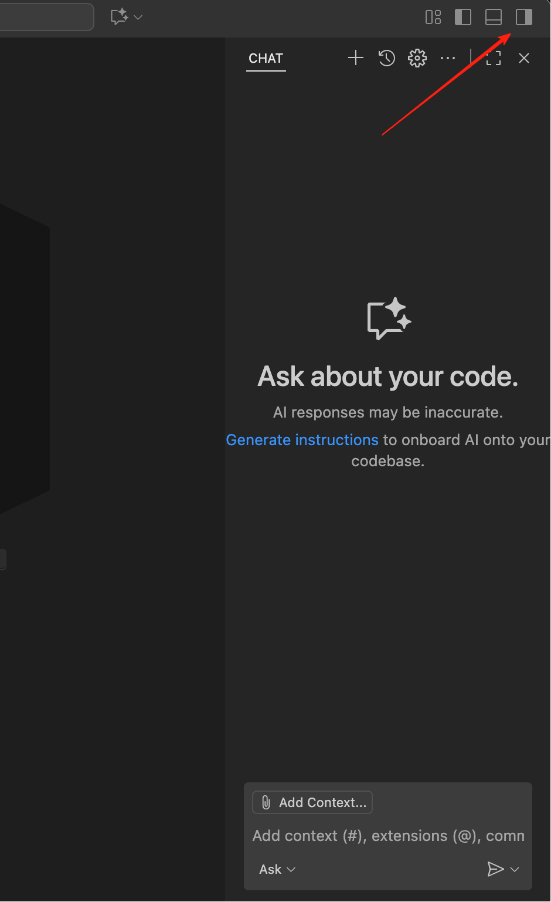

다만 VS Code가 AI 능력이 가장 강한 IDE는 아닙니다. 대량의 AI 보조 코딩이 필요한 상황에서는 보통 “더 똑똑하고 효율이 높은” 도구를 쓰고 싶어 합니다. 좋은 AI IDE는 코드 작성과 Bug 수정 시간을 크게 줄여 줍니다. 아래에서는 현재 비교적 인기 있는 AI IDE 몇 가지를 소개합니다. 취향에 맞게 아무 AI IDE나 선택해 사용해도 됩니다.

VS Code는 오픈소스이기 때문에(누구나 소스 코드를 다운로드하고 직접 컴파일 가능), 현재 시장의 대부분 AI IDE는 VS Code를 기반으로 2차 개발되어 있습니다. 그래서 “여러 IDE를 많이 배워야 한다”고 걱정할 필요는 없습니다. **VS Code의 기본 사용법만 익숙해지면** 이런 AI IDE로 이동할 때 다시 배울 필요가 크지 않습니다.

일반적으로 서로 다른 AI IDE의 차이는 주로 네 가지에 집중됩니다. 가격, 사용할 수 있는 모델 종류(일부 고급 모델은 특정 지역에서 제한될 수 있음), Agent의 능력(코드 작성을 도울 때의 지능 수준과 실행 능력), 그리고 실행 속도와 성능입니다. 실제 테스트 결과에 따라 선택하면 됩니다. 자신에게 맞는 것이 가장 좋습니다.

> 전형적인 AI IDE는 보통 다음 핵심 능력을 갖습니다.
>
> - 지능형 코드 생성과 완성: 전통 IDE에서는 보통 몇 글자를 입력해 변수명이나 함수명을 완성합니다. 현대 AI IDE에서는 몇 줄의 의사코드나 간단한 요구 설명을 쓰면 IDE가 전체 로직을 자동 완성하고, 지시에 따라 긴 코드나 전체 코드 블록을 바로 생성할 수 있습니다.
> - 코드 이해와 질의응답: IDE는 특정 코드 조각, 특정 파일, 심지어 전체 프로젝트 디렉터리 구조에 관한 질문을 이해하고 답할 수 있습니다.
> - 코드 리팩터링과 최적화: IDE는 당신의 의도에 따라 지정 코드 조각의 구현 로직을 다시 쓰거나 최적화할 수 있습니다.
> - 테스트 자동 생성: IDE는 여러 함수와 모듈에 대한 테스트 코드를 자동 생성하여 필요한 테스트를 편하게 할 수 있습니다.
> - Agent식 작업 실행: 지능형 Agent는 코드 생성, 패키징, 설치, 실행, 수정을 자동으로 수행할 수 있으며, 많은 작업에서 초급 소프트웨어 엔지니어의 일을 일부 대체할 수 있습니다.

::: details Antigravity

### [Antigravity](https://antigravity.google/)

Antigravity는 Google이 2025년 11월 Gemini 3와 함께 발표한 새로운 AI IDE이며, “Agent-First”(지능형 에이전트 우선) 개발 방식을 채택합니다. 전통적인 AI 보조 코딩과 달리 Antigravity는 AI 에이전트를 “능동적 실행자”로 두어 편집기, 터미널, 브라우저 같은 도구를 직접 조작하고 더 많은 “실행”, “기획”, “검증” 작업을 맡게 합니다. 개발자는 상위 의도만 제시하면 에이전트가 작업을 자동 분해하고, 계획을 세우고, 코드를 실행하고, 테스트를 돌리고, 산출물을 생성합니다. Gemini 3 Pro, Claude Sonnet 4.5 등 여러 모델 전환을 지원하며, 현재 공개 프리뷰 형태로 제공되고 Windows, macOS, Linux 전 플랫폼을 지원합니다.
:::

::: details Trae

### [Trae](https://www.trae.ai/)


Trae는 ByteDance가 출시한 AI 프로그래밍 어시스턴트이며 100개 이상의 프로그래밍 언어를 지원하고 주요 IDE에 통합될 수 있습니다. 기능에는 자연어로 코드 생성, 자동 디버깅, 디자인 시안을 React/Vue 컴포넌트로 변환하기 등이 포함됩니다. 2025년 8월 업데이트 이후 Trae에는 지능형 의존성 가져오기, 이름 변경 제안, 작업 목록 관리 등의 기능이 추가되었습니다. SOLO 모드도 백엔드 코드 생성과 기술 아키텍처 문서 편집을 지원하기 시작했습니다.
:::

::: details Cursor

### [Cursor](https://cursor.com/)

Cursor는 Anysphere가 개발한 AI 코드 편집기이며 VS Code 기반으로 커스터마이즈되어, 대규모 코드 저장소와 다중 파일 협업 장면을 중점적으로 최적화했습니다. GPT-4o, Claude 3.7 등 모델을 지원합니다. 2025년에 출시된 Claude Max 모드는 수백만 줄 코드 수준의 프로젝트를 처리할 수 있습니다. Pro 버전은 요청 횟수 제한을 없애 복잡한 기업급 프로젝트에 매우 적합합니다.

현재 Cursor는 “프론트엔드 인터페이스가 있는 AI IDE” 중 종합 경험이 가장 좋은 도구 중 하나라고 할 수 있습니다. 사용자 수가 많고 기능 반복 주기도 빠릅니다. 가장 큰 단점은 가격이 높다는 점입니다. Pro 버전은 월 약 20달러가 필요합니다.


:::

::: details Qoder

### [Qoder](https://qoder.com/)

Qoder는 Alibaba가 출시한 AI IDE이며 “투명한 협업”과 “강화된 컨텍스트 엔지니어링 능력”을 강조합니다. Action Flow를 통해 작업을 여러 단계로 분해하고 AI의 실행 과정을 실시간으로 추적할 수 있습니다. 또한 다중 모델 동적 라우팅과 작업 상태 머신 관리를 지원하므로, 중대형 프로젝트에서 아키텍처 거버넌스를 하거나 레거시 시스템을 “역공학” 분석하는 데 매우 적합합니다.


:::

::: details CodeBuddy

### [CodeBuddy](https://www.codebuddy.com/)

CodeBuddy는 Tencent Cloud가 출시한 AI 프로그래밍 도구이며 중국어 지시에 대한 지원과 기업급 규정 준수 능력을 강조합니다. 코드 완성, 일괄 코드 리뷰, 다중 모델 전환 등의 기능을 제공합니다. 그중 Craft 지능체는 다중 파일 코드 생성과 API 통합을 구현할 수 있습니다. 기업 버전은 사유화 배포를 지원하고 중국의 3급 등급보호 인증을 통과했으므로 금융, 의료 등 데이터 보안 요구가 높은 업종에 적합합니다.


:::

::: details VS Code + Cline

### VS Code + [Cline](https://cline.bot/)

Cline은 VS Code(Visual Studio Code)의 AI 프로그래밍 Agent 플러그인입니다. 서로 다른 API 엔드포인트를 설정해 사용하는 대형 모델을 유연하게 바꿀 수 있습니다. Cline은 멀티모달 입력, MCP 도구 확장, 비용 모니터링을 지원하며, 모든 작업은 사용자 확인 후 실행됩니다. 아이디어를 빠르게 검증하거나 기존 개발 흐름에 통합하는 데 매우 적합합니다. 기본 기능은 무료이고, 기업 버전은 사유 환경에서 모델 배포를 지원합니다.


:::

::: details Kiro

### [Kiro](https://kiro.dev/)

Kiro는 AWS(Amazon Web Services)가 출시한 AI 프로그래밍 IDE이며 Amazon Bedrock과 AWS 클라우드 서비스 생태계에 깊게 통합되어 있습니다. Claude, Nova 등 여러 대형 모델을 지원하고, AWS 클라우드 서비스와 긴밀히 통합해야 하는 개발 장면에 특히 적합합니다. Kiro는 지능형 코드 생성, 자동화 테스트, AWS 리소스(Lambda, S3, DynamoDB 등)와의 매끄러운 연결 능력을 제공하여 클라우드 네이티브 애플리케이션 개발에 독특한 장점을 가집니다.

> **비고**: Anthropic Claude 관련 모델을 사용하고 싶다면 IDE로 Cursor, Kiro 또는 Antigravity를 사용해야 합니다. 이 IDE들은 Anthropic과 공식 협력하거나 깊게 통합되어 있어 더 안정적이고 완전한 Claude 모델 경험을 제공할 수 있습니다.
:::

<div style="margin: 50px 0;">
  <ClientOnly>
    <StepBar :active="1" :items="[
      { title: '환경 인식', description: 'IDE와 AI IDE 이해' },
      { title: '로컬 실습', description: 'Trae로 스네이크 만들기' },
      { title: '도구 상세', description: 'IDE 인터페이스 익히기' },
      { title: '소통 기술', description: 'AI와 효율적으로 대화하기' }
    ]" />
  </ClientOnly>
</div>

## 4. 실습: AI IDE로 로컬에서 스네이크 게임 생성하기

앞에서 말한 것은 주로 “개념”과 “차이”였습니다. 이 절에서는 한 번의 완전한 실습을 통해 추상 개념을 구체적인 조작으로 옮깁니다. **빈 폴더 새로 만들기 → AI IDE로 열기 → 사이드바 채팅에서 React로 스네이크 게임을 처음부터 만들게 하기.** 여기서는 위에서 소개한 Trae를 예로 들며, 먼저 Trae를 설치하고 간단히 이해해야 합니다.

::: tip 💡 작은 팁: 웹에서 로컬로 매끄럽게 이어가기
이전에 z.ai나 다른 웹 기반 AI 프로그래밍 플랫폼에서 프로젝트를 개발한 적이 있다면, 코드를 로컬로 다운로드한 뒤 AI IDE로 열어 계속 개발할 수 있습니다. 이렇게 하면 이전 성과를 보존하면서 로컬 IDE의 더 강한 AI 보조 능력도 누릴 수 있습니다.

조작 단계는 간단합니다.
1. z.ai 같은 플랫폼에서 다운로드 버튼을 클릭해 프로젝트를 로컬에 저장합니다.
2. 압축을 푼 뒤 Trae/Cursor 같은 AI IDE로 해당 폴더를 엽니다.
3. 사이드바에서 AI와 계속 대화하며 프로젝트를 반복 개선합니다.
:::

### 4.1 준비 작업: Trae 설치하고 이해하기

#### 4.1.1 Trae란 무엇인가

Trae의 전체 이름은 “The Real AI Engineer”로 이해할 수 있으며, ByteDance가 개발한 적응형 AI 통합 개발 환경(IDE)입니다. 인기 있는 VS Code 위에 구축되어 있습니다. 즉 이전에 VS Code에 이미 익숙하다면 Trae를 사용할 때 인터페이스 배치나 기본 조작 모두 매우 익숙하고 편안하게 느껴질 것입니다.

Trae의 핵심 목표는 개발자의 “지능형 프로그래밍 파트너”가 되는 것입니다. AI 능력을 깊게 통합하여 대량의 반복 작업을 자동 처리하고, 더 직관적이고 효율적인 개발 경험을 제공합니다. 단순한 “코드 완성 도구”가 아니라, 프로젝트 생성, 코드 작성, 디버깅, 테스트, 배포까지 전체 개발 워크플로에서 도움을 주려 합니다.

#### 4.1.2 Trae 설치하기

Trae는 국제판과 중국판으로 나뉩니다. 국제판은 해외 네트워크에 접근할 수 있어야 하지만 GPT-5 같은 최신 해외 모델을 사용할 수 있습니다. 중국판은 주로 GLM, Qwen, Kimi 같은 중국 내 최신 대형 모델을 지원합니다.

국제판 다운로드 주소: https://www.trae.ai/
중국판 다운로드 주소: https://www.trae.cn/

##### Trae 가격과 사용 방식

::: info 💡 버전 선택 팁(입문자는 CN판 추천)
- **완전 초보 입문에는 중국판(CN판, trae.cn) 다운로드를 강력히 추천합니다**. 현재 사용 경험이 더 좋고 기본 기능이 무료이며 해외 네트워크가 필요 없습니다.
- GPT-5 같은 해외 모델을 사용해야 하고 네트워크 조건이 허용된다면 국제판을 선택할 수 있습니다.
- 이미 서드파티 모델의 API Key가 있다면, 서드파티 모델 연결로 비용을 유연하게 제어할 수 있습니다.
:::

> 💡 **현재 OpenRouter 무료 모델로 테스트하는 것을 추천합니다**
> 
> 튜토리얼 작성 시점(2026년 2월 12일) 기준, StepFun 모델은 아직 무료로 시험 사용할 수 있습니다. 구체적으로는 아래 4.2 절의 모델 연결 방식을 참고해 `stepfun/step-3.5-flash:free`를 연결하세요.

Trae의 비용과 사용 방식에는 다음 선택지가 있습니다.

- **중국판 CN판(강력 추천)**: 기본 사용은 무료이며, 현재 전체 사용 효과가 국제판보다 좋고 완전 초보 입문에 매우 적합합니다. 사용자가 많아 가끔 대기해야 할 수 있습니다.
- **국제판**: 구독 가격은 월 약 3달러 정도이며 GPT-5 같은 해외 모델에 접근할 수 있지만 해외 네트워크 접근이 필요합니다.
- **서드파티 모델 연결**: 이미 중국 내 대형 모델의 Token API(DeepSeek, Tongyi Qianwen, Kimi 등)가 있다면 Trae의 서드파티 모델 설정 기능으로 이러한 API를 연결해 사용할 수 있습니다. 주요 클라우드 서비스 업체(Alibaba Cloud, Tencent Cloud, Baidu Cloud 등)는 보통 Coding Plan 구독 플랜을 제공하며, 구매 후 더 저렴한 가격으로 대형 모델 API를 사용할 수 있습니다. 이렇게 하면 원하는 모델을 자유롭게 선택하면서 사용 비용도 제어할 수 있습니다.

초보자는 중국 CN판 무료 버전부터 경험하는 것을 권장합니다. 다운로드 주소는 https://www.trae.cn/ 입니다. 현재 CN판 사용 효과가 더 좋고 완전히 무료입니다. 대기 문제가 있거나 더 안정적인 서비스가 필요하다면 서드파티 모델을 연결하고 해당 클라우드 업체의 Coding Plan을 구매하는 것을 고려할 수 있습니다.

#### 4.1.3 Trae 인터페이스 소개

인터페이스 형태로 보면 Trae는 우리가 일상적으로 사용하는 VS Code와 매우 비슷합니다. 왼쪽 리소스 관리자, 가운데 편집 영역, 오른쪽 확장 패널이라는 고전적인 3열 배치를 사용합니다.


오른쪽 사이드바가 Copilot 상호작용 창이며, Agent 창으로 이해할 수도 있습니다. 보이지 않는다면 Trae 오른쪽 위의 사이드바 아이콘을 클릭해 열 수 있습니다.

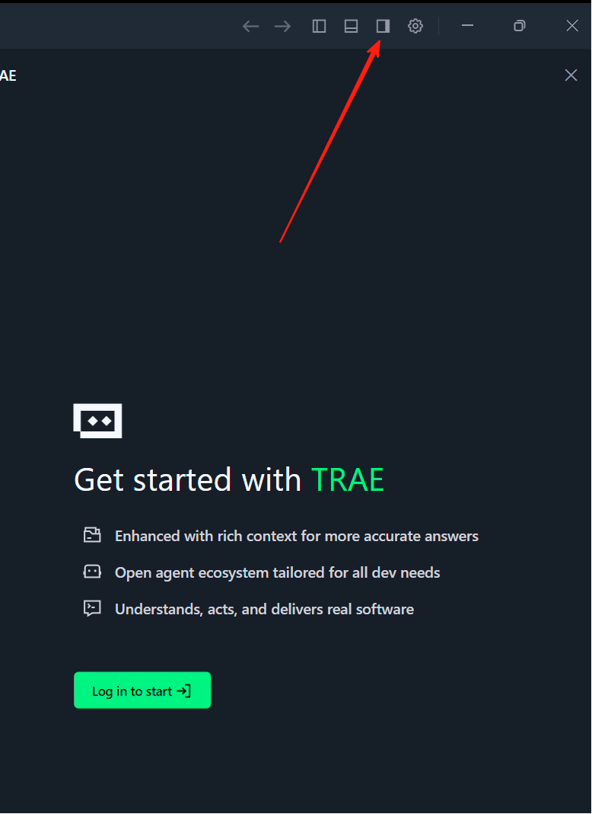

사이드바를 열면 `Builder` 옵션이 보입니다. 이것이 Agent 모드입니다. 간단히 이해하면 z.ai의 “로컬 버전”과 같으며, 내 컴퓨터 환경을 조작하고 실행 환경을 설치하고 웹페이지를 여는 일을 도와줄 수 있습니다.


“Builder”를 클릭하면 “Chat” 모드와 “Builder with MCP” 모드가 보입니다.

- **Chat 모드**: 주로 현재 폴더 안의 코드와 대화하거나 일반 채팅 모델처럼 사용하는 데 쓰입니다. 왼쪽 위의 “File” 메뉴로 폴더를 열 수 있으며, 이 폴더 안에서 편집 작업을 진행합니다. 이 경우 Builder가 만들거나 수정하는 파일은 모두 이 폴더 내부에서만 발생합니다.
- **Builder with MCP 모드**: Agent에게 더 많은 사용 가능한 도구를 제공합니다. 예를 들어 언어 모델과 다른 소프트웨어를 연결하거나 날씨를 조회하는 등의 도구입니다. 간단히 말해 MCP는 언어 모델이 여러 외부 도구를 더 편하게 호출할 수 있게 해 줍니다.


아래 영역에는 모델 선택 옵션도 보입니다. 클릭하면 현재 사용하는 대형 모델을 바꿀 수 있습니다. 중국판에서는 Kimi k2나 GLM 같은 중국 모델을 선택할 수 있습니다. 국제판 Trae를 사용한다면 ChatGPT나 Claude 같은 해외 모델도 선택할 수 있습니다. 다만 중국 내 대형 모델도 매우 빠르게 발전하고 있어 Kimi, Qwen, GLM 등은 많은 작업에서 Claude 3.5 또는 3.7에 가까운 실제 경험을 보여 주며, 일상 개발에는 충분합니다. 여기서는 국제판이나 중국판 중 하나를 반드시 사용하라고 강제하지 않습니다.

**주의할 점은 Auto 모드(자동 모델 선택)를 추천하지 않는다는 것입니다. 국제판이라면 Gemini 또는 GPT 모델을 추천하고, 중국판이라면 Kimi k2, Minimax, GLM 같은 중국 모델을 시도해 보기를 추천합니다.** 모델마다 적합한 장면이 다르며, 누가 반드시 더 좋다는 식의 교조적인 답은 없습니다. 서로 다른 작업에서 어려움을 만나 해결되지 않을 때 모델을 바꿔 보고, 여러 번 테스트해 자신만의 최적 실험 결과를 얻을 수 있습니다.


이상이 Trae에 대한 간단한 소개입니다. 이제 이전에 z.ai에서 했던 조작을 돌아보고, Trae에서 같은 일을 시도해 볼 수 있습니다.

### 4.2 첫 번째 단계: 빈 폴더를 새로 만들고 AI IDE로 열기

본격적으로 시작하기 전에 먼저 깨끗한 프로젝트 작업 디렉터리를 준비해야 합니다.
이 절의 예시에서는 로컬에 `snake-game-react`라는 이름의 빈 폴더를 만들 수 있습니다.

그다음 설치해 둔 AI IDE를 열고 시작 화면에서 폴더 열기 또는 Open Folder를 선택해 이 빈 폴더를 프로젝트 루트 디렉터리로 가져옵니다. 폴더를 IDE 창으로 직접 끌어다 놓아 열 수도 있습니다. 이때 왼쪽 리소스 관리자에는 아무 코드 파일도 나타나지 않습니다. 완전히 빈 프로젝트 상태에서 시작하고 있다는 뜻입니다.

::: details 📚 선택: 클라우드 서비스 업체의 API 또는 Coding Plan 연결하기

이 절에서는 더 안정적이고 더 자주 모델을 호출하기 위해 클라우드 서비스 업체의 API 또는 Coding Plan을 연결하는 방법을 소개합니다. 마지막에는 Trae에서 연결하는 스크린샷을 제공합니다.

**Coding Plan이란 무엇인가**

Coding Plan은 주요 클라우드 서비스 업체가 출시한 구독 플랜입니다. 구매 후 일정 기간 해당 업체의 대형 모델 API를 **무제한 또는 높은 빈도로** 사용할 수 있습니다. Token 단위 과금 방식과 비교하면 Coding Plan은 “월정액 패키지”에 더 가깝습니다. 고정 비용을 한 번 내면 매번 호출 비용을 걱정하지 않고 마음껏 사용할 수 있습니다.

**왜 Coding Plan을 구매해야 할까**

직접 API로 대형 모델을 호출할 수 있는데 왜 Coding Plan을 구매해야 하는지 궁금할 수 있습니다. 주요 이유는 다음입니다. **계속 사용할 수 있음**: Coding Plan의 핵심 장점은 언제든 자주 대형 모델을 호출할 수 있고, 많이 썼을 때 비용이 폭발할까 걱정하지 않아도 되며, 과금표를 자주 확인할 필요도 없다는 점입니다.

**추천 중국 내 클라우드 서비스 Coding Plan**

아래는 중국 내 주요 클라우드 서비스 업체가 제공하는 Coding Plan 추천 선택지입니다.

- Zhipu AI(BigModel Plan): https://bigmodel.cn/glm-coding  
- Volcengine(ByteDance Cloud AI Plan): https://www.volcengine.com/activity/codingplan

> 💡 **대형 모델 API를 바로 연결할 수도 있습니다**
> Coding Plan 외에도 Add Model을 통해 각 대형 모델의 API를 직접 연결할 수 있습니다. 아래의 OpenRouter StepFun 무료 API 연결 방식을 참고해 API를 Trae에 연결해 사용할 수 있습니다. 테스트 결과 기본 프로그래밍 요구를 충족할 수 있습니다.
> 충전이 필요하다면 먼저 10위안 정도만 충전해 얼마나 쓸 수 있는지 느껴 보기를 권장합니다. 예를 들어 DeepSeek 같은 가성비 좋은 모델이 있습니다.

**Coding Plan 연결 방법**

Coding Plan 연결 단계는 매우 간단하며 몇 분이면 완료할 수 있습니다.

1. 선택한 클라우드 서비스 업체 공식 사이트에 방문합니다. 예: Zhipu AI https://bigmodel.cn/glm-coding , Volcengine https://www.volcengine.com/activity/codingplan
2. 계정을 등록하고 로그인합니다.
3. “가격” 또는 “Coding Plan” 페이지를 찾습니다.
4. 자신에게 맞는 요금제를 선택하고 결제합니다.
5. 결제 성공 후 API Key 또는 Plan ID를 받습니다.

::: tip 🎯 사용자 지정 모델 추천

Trae에서 사용자 지정 모델을 연결할 때는 **기본적으로 OpenRouter 방식을 추천합니다**. OpenRouter는 통합 API 인터페이스를 제공하여 여러 대형 언어 모델을 편리하게 연결할 수 있습니다.

**2026년 2월 12일 기준, StepFun의 무료 API도 사용할 수 있습니다.**

- **`stepfun/step-3.5-flash:free`**: StepFun이 제공하는 무료 모델이며 Trae에 직접 연결해 사용할 수 있습니다.

**기타 무료 모델:**

- **`openrouter/free`**: 무료 LLM API를 기본으로 사용하는 모델 옵션입니다. Trae의 Custom Model 연결에서 바로 사용할 수 있고, 모델 ID에 그대로 쓰면 됩니다. 비용 없이 AI 프로그래밍 기능을 경험할 수 있습니다.

이 무료 선택지는 초보자가 경험하기에 매우 적합합니다. 실제 프로덕션 환경에 투입하기 전, 먼저 이런 무료 방식으로 AI IDE의 작업 흐름을 익힐 수 있습니다.

**선택: 대형 모델 호출 API 연결하기(DeepSeek 예시)**

1. DeepSeek 플랫폼 방문: https://platform.deepseek.com/usage
2. 계정 등록 및 로그인
3. 충전 페이지에서 10위안 Token 패키지 구매
4. 충전 성공 후 API Keys 페이지에서 API Key 생성 및 복사
5. Trae에서 **"Add Model"** 을 클릭하고 DeepSeek을 찾아 대응 모델을 선택한 뒤 API Key를 입력하면 사용할 수 있습니다.

아래 인터페이스를 통해 성공적으로 추가할 수 있습니다. 모델 선택 옵션을 본 뒤 **반드시 맨 아래까지 스크롤**해야 합니다. 아래에 “사용자 지정 모델”이 있고, 클릭하면 모델 ID를 입력할 수 있습니다. 이때 위 추천 모델 ID인 `stepfun/step-3.5-flash:free` 등을 그대로 입력하면 됩니다. 동시에 아래의 Key 얻기를 클릭해 공식 사이트로 이동하고 해당 API Key를 받아 입력하면 정상 사용 가능합니다.


:::

### 4.3 두 번째 단계: 사이드바에서 채팅하며 AI가 React로 스네이크 게임을 설계하게 하기

이제 AI 채팅 사이드바를 엽니다. 보통 `Ctrl+L`을 누르거나 오른쪽 채팅 아이콘을 클릭하면 됩니다. 그런 다음 채팅에 충분히 명확한 프롬프트를 입력합니다.

> React 아키텍처로 스네이크 게임을 구현해 주세요. 키보드 제어, 먹이를 먹으면 길이가 늘고 점수가 올라가는 기능, 벽이나 자기 몸에 부딪히면 “게임 종료”를 표시하고 다시 시작을 지원하는 기능을 포함해야 합니다. 구현 후 이 프로젝트를 시작해 주세요. 설치되지 않은 프로그램 환경이 있다면 자동으로 설치해 주세요.

이 과정에서 AI는 단순한 채팅 모델이 아니라 로컬 환경 조작을 도울 수 있다는 점을 인식해야 합니다. 파일을 만들고, 의존성을 설치하고, 실행 명령을 수행할 수 있습니다. 달성하려는 목표를 자연어로 설명하면 AI가 어떤 명령을 실행하고 코드를 어떻게 구성할지 결정합니다.

실행 중 문제가 생기면 AI는 대화 안에 오류와 처리 방안을 표시합니다. 계속 대화로 조정하게 하면 되며, 모든 명령 세부 사항을 직접 외울 필요는 없습니다.

::: warning ⚠️ 주의할 점
아래 그림처럼 **가끔 AI Agent가 실행 중 멈출 수 있습니다. 이는 이름 입력, Enter 확인, 명령 실행 클릭처럼 당신의 입력을 기다리기 때문입니다.** 보통은 바로 Enter를 누르면 됩니다. 이 단계에서 무엇을 해야 할지 확실하지 않다면 현재 화면을 스크린샷으로 찍어 대형 모델에게 어떻게 조작해야 하는지 물어볼 수 있습니다.
:::

그림처럼 여기서는 Run을 클릭해 확인해야 합니다.
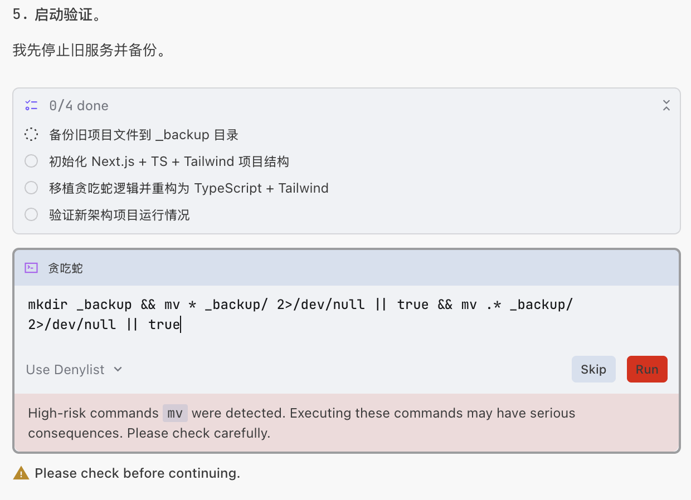

그림처럼 여기서는 y만 입력하면 확인됩니다.
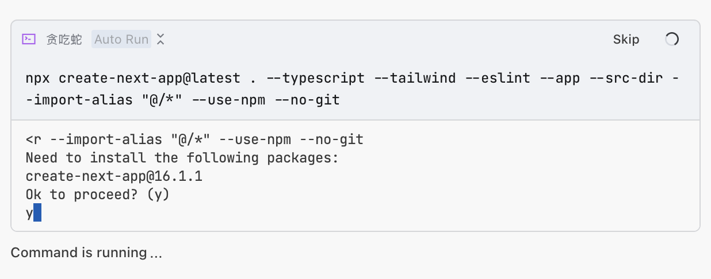

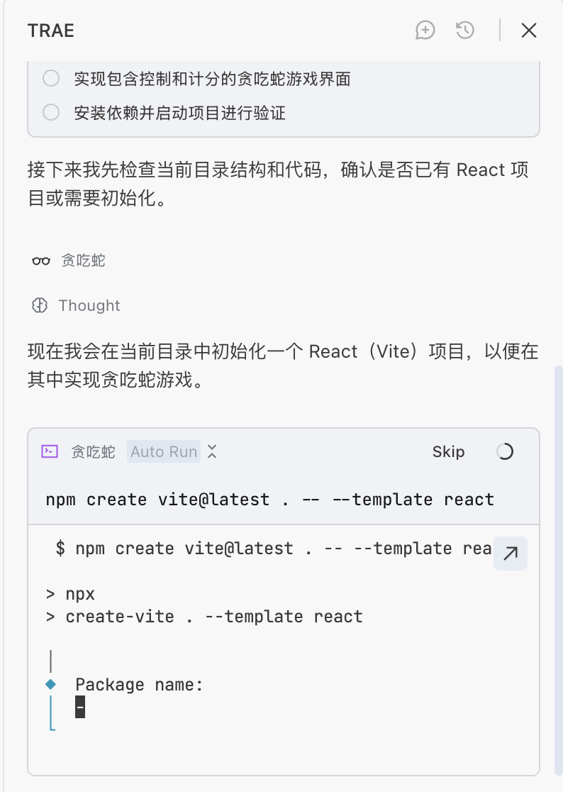

그림처럼 여기서는 템플릿을 만들고 있지만 어떻게 조작해야 할지 모르겠습니다. 이 부분을 스크린샷으로 찍어 대형 모델에게 물어볼 수 있습니다.

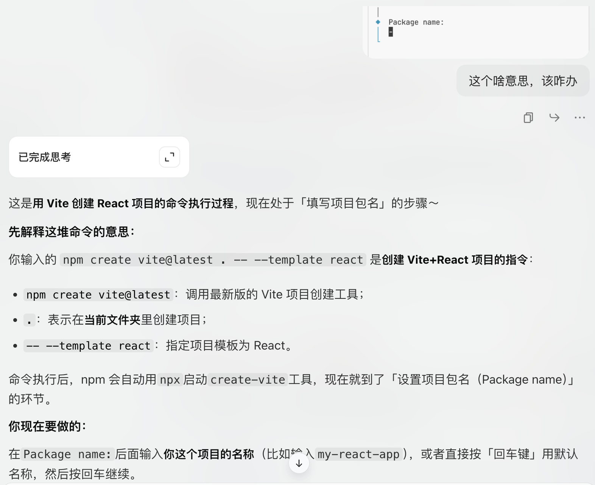

AI Agent가 실행 중 멈추는 또 다른 이유는 이때 “서비스”가 시작되었기 때문입니다. 우리의 스네이크 자체도 하나의 “서비스”입니다. 아래 명령의 URL을 보면 Agent가 로컬 컴퓨터 서비스를 실행했다는 뜻입니다. 해당 주소에 접속하면 스네이크를 볼 수 있습니다. 서비스는 계속 켜져 있어야 하므로 여기서 일시정지처럼 보입니다. 우리는 `Skip` 버튼만 클릭하면 됩니다.

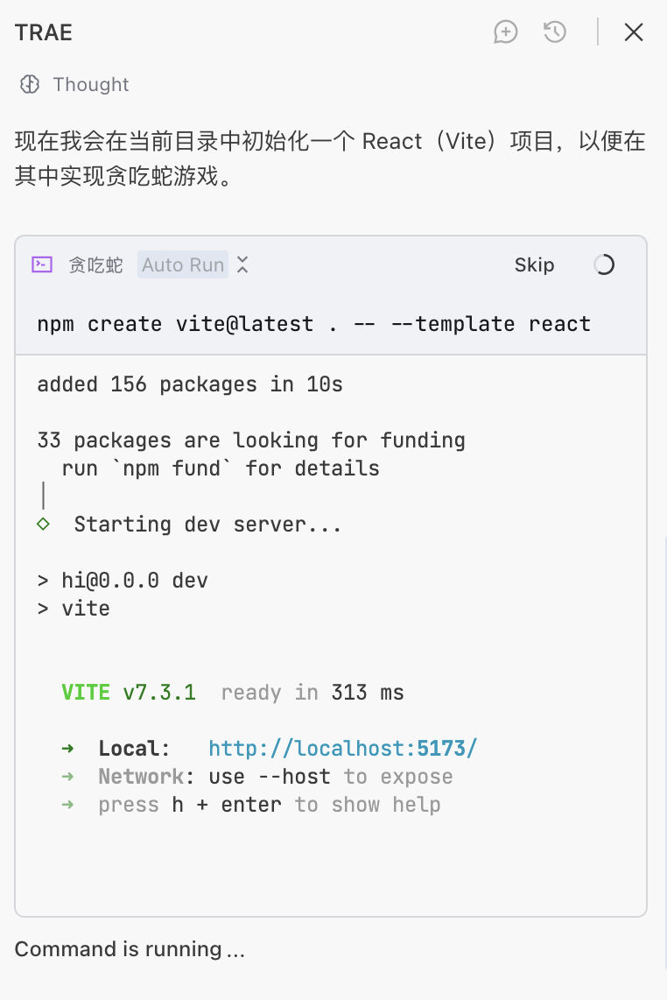

이 과정에서 용어나 이해하기 어려운 내용을 만나도 걱정하지 마세요. 부록의 “컴퓨터 용어 설명” 부분을 확인하거나, AI에게 직접 질문하거나, 바로 질문하면 됩니다!

과정 중 기대와 다른 현상을 만나면, 예를 들어 스네이크가 벽에 부딪힌 뒤 게임이 끝나지 않거나 시작을 클릭해도 뱀이 움직이지 않는다면, 그 현상을 사이드바 Agent에게 설명하기만 하면 됩니다. 오류가 있으면 스크린샷을 찍거나 오류를 복사해 사이드바 Agent에게 보내세요. 여러 번 해도 해결되지 않으면 모델을 바꿔 시도해 보세요.

잠시 기다리면 z.ai와 비슷한 결과를 얻을 수 있습니다.

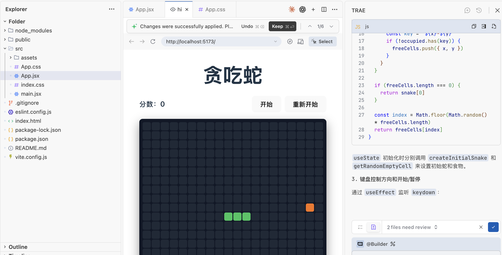

오른쪽 아래의 체크 표시를 클릭해 코드 변경을 확정할 수 있고, `Cancel` 버튼을 클릭해 변경을 취소할 수도 있습니다. 또는 “2 files need review” 위치를 클릭해 변경된 코드를 펼쳐 볼 수 있습니다.

여기서 또 주의할 점은 코드 수정이 반드시 옳은 것은 아니라는 점입니다. 또한 모든 IDE의 Agent가 코드 되돌리기를 지원한다는 사실도 알아야 합니다. 예를 들어 여기서 실수로 잘못 수정했거나 이번 작업 결과가 만족스럽지 않다면, 수정이 끝난 뒤 입력창 부분으로 돌아가 Revert 버튼을 클릭해 수정 전 상태로 되돌릴 수 있습니다. 입력 문구를 바꾸어 다시 작업할 수 있습니다.

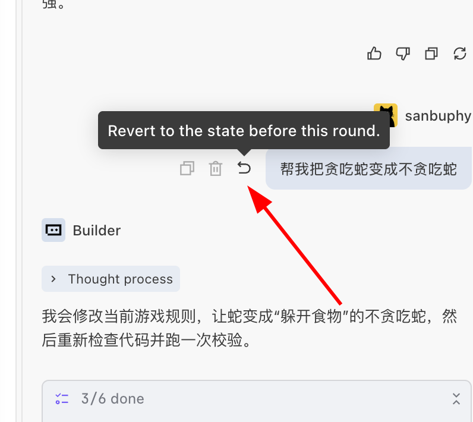

### 4.4 세 번째 단계(선택): AI에게 코드 구현 세부 사항 묻기

스네이크 게임이 정상적으로 실행되면, 프론트엔드나 React가 아직 익숙하지 않은 경우 같은 채팅 창에서 AI에게 최대한 구어체로 코드를 안내해 달라고 할 수 있습니다. 도구를 바꿀 필요도 없고, 일부러 문서를 뒤질 필요도 없습니다. 현재 프로젝트를 둘러싸고 계속 질문하면 됩니다.

비교적 실용적인 방법은 AI에게 먼저 “게임이 어떻게 움직이는지” 전체를 설명하게 하고, 그다음 구체적인 세부 사항으로 나누는 것입니다. 예를 들어 바로 이렇게 물을 수 있습니다.

> “위에서 아래로 한 번 설명해 줘. 이 스네이크 게임은 각 단계에서 어떻게 움직이는 거야? 전문 용어는 최대한 적게 써줘.”

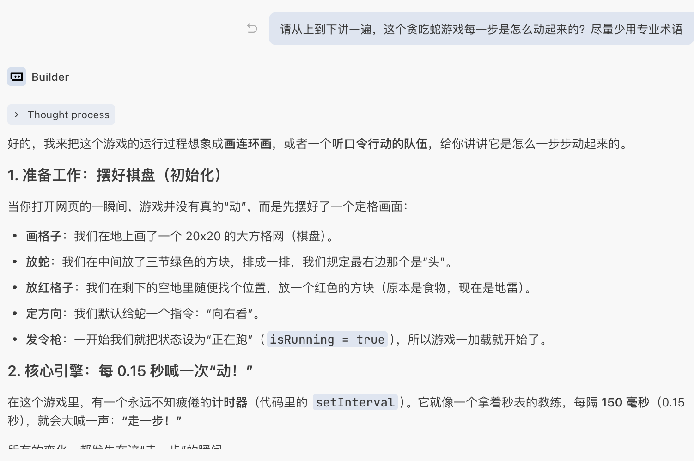

그다음 AI의 답변을 따라 핵심 지점을 계속 물어볼 수 있습니다. 예:

> “화면에 보이는 뱀의 각 몸통 칸은 어떤 데이터 구조로 기억하는 거야? 비유로 설명해 줄 수 있어?”  
> “'일정 시간마다 한 번 움직이기'는 어떻게 제어하는 거야? 코드에서는 어느 부분이야?”  
> “뱀이 먹이를 먹었을 때 어떤 순서로 처리했어? 먹었다고 판단하는 로직은 어디야?”  
> “벽에 부딪히는 것과 자기 몸에 부딪히는 것은 각각 어느 코드에서 판단해?”

어떤 파일(예: `SnakeGame.tsx`)을 봤지만 전혀 무엇을 하는지 모르겠다면, AI에게 기능별로 나눠 설명해 달라고 바로 요청할 수도 있습니다.

> “`SnakeGame.tsx`를 기능별로 몇 덩어리로 나눠 설명해 줘. 각 덩어리가 대략 무엇을 담당하는지 쉬운 말로 알려줘.”

이 대화에서 이해하지 못한 단어는 모두 추가 질문의 입구로 삼을 수 있습니다. 예:

> “방금 말한 ‘상태’가 구체적으로 뭐야? 생활 속 예로 설명해 줄 수 있어?”  
> “여기서 말한 ‘타이머’는 주로 뭘 하는 거야? 이걸 빼면 무슨 일이 생겨?”

이 방식에서 목표는 모든 개념을 한 번에 외우는 것이 아니라 먼저 세 가지를 파악하는 것입니다. 이 게임의 핵심 데이터가 무엇인지(뱀, 먹이, 점수, 게임 상태 등), 이 데이터가 언제 바뀌는지(이동, 먹이 먹기, 게임 종료 등), 그리고 각 변화가 어느 작은 코드 조각에 대응되는지입니다. 이 세 가지가 정리되면 이 코드의 주요 로직은 기본적으로 이해할 수 있습니다.

### 4.5 네 번째 단계: AI에게 화면을 조금 더 보기 좋게 만들게 하기

여기서 초보자에게 중요한 점을 먼저 알려 드립니다. AI에게 “이 화면을 예쁘게 만들어줘”라고 한 마디만 말하지 마세요. 이런 표현은 인간 디자이너에게도 너무 모호합니다. 모델에게는 더더욱 그렇습니다. “예쁘다”가 어떤 스타일인지, 어느 부분을 조정해야 하는지, 레이아웃 문제인지 색상 문제인지 AI는 이 한 문장에서 읽어낼 수 없습니다. AI가 진짜로 마음속 기대에 가까운 결과를 만들게 하려면, “예쁘게 하고 싶다”는 모호한 목표를 구체적이고 실행 가능한 작은 요구들의 묶음으로 나누는 법을 배워야 합니다.

예를 들어 많은 사람은 처음에 이렇게 말합니다.

> “이 화면을 좀 더 예쁘게 만들고 싶어.”

예를 들어 먼저 전체 요구 묶음을 제시할 수 있습니다.

> “게임 인터페이스 전체를 조금 미화해 주세요.
>
> - 게임 영역은 가운데 정렬하고, 왼쪽 위에 붙어 있지 않게 해 주세요.
> - 배경색은 비교적 밝은 색으로 바꿔서 뱀과 먹이가 더 눈에 띄게 해 주세요.
> - 점수를 크게 표시하고, 눈에 잘 띄는 위치에 놓아 주세요.
> - 파란색을 주 색상으로 해서 전체 색상과 버튼을 미화해 주세요.”

“게임 종료” 시 더 명확한 피드백을 원한다면 추가로 보충할 수 있습니다.

> “게임이 끝나면 화면 중앙에 ‘게임 종료’를 표시하고, 아래에는 게임을 초기화할 수 있는 ‘다시 시작’ 버튼을 넣어 주세요.”

AI는 설명에 따라 React 컴포넌트와 스타일을 직접 수정합니다. 저장 후 브라우저를 새로고침하면 새 인터페이스를 볼 수 있습니다. 결과가 상상과 아직 다르면 작은 단위로 계속 조정할 수 있습니다. 예:

> “점수를 더 크게 하고 색도 더 눈에 띄게 해줘.”  
> “게임 영역을 조금 더 조밀하게 하고, 사방에 여백을 조금 남겨줘.”  
> “다시 시작 버튼은 파란색 둥근 모서리 스타일로 바꾸고, 안내 문구 아래 가운데에 놓아줘.”

이 단계에서 어떤 수정이 오류를 일으켜도 직접 억지로 찾아볼 필요는 없습니다. 오류 정보를 채팅창에 복사하거나 “방금 인터페이스를 미화한 뒤 나타난 오류야” 같은 짧은 설명을 붙여, AI가 현재 프로젝트 맥락 안에서 위치를 찾고 고치게 하세요. 이렇게 “계속 대화하고, 계속 새로고침하는” 순환 속에서 실행 가능한 Demo를 점차 인터페이스가 명확하고 상호작용이 매끄러운 작은 완성품으로 다듬을 수 있습니다.

### 4.6 (선택) z.ai 아키텍처를 참고해 스네이크 결과 수정하기

vibe coding 초보자에게 가장 어려운 것은 오히려 무엇이 “베스트 프랙티스”인지, 어떤 아키텍처가 가장 적합한지 모른다는 점입니다. 컴퓨터 기초를 모르기 때문에 AI를 잘 이끌기 어렵습니다. 이 문제를 해결하는 방법은 “직접 참고”입니다. z.ai에서 코드를 볼 수 있다고 앞에서 말했던 것을 기억하나요? 사실 해당 README(프로젝트에서 기능과 기술 아키텍처를 소개하는 부분)에는 이미 최적 아키텍처 참고가 제시되어 있습니다.

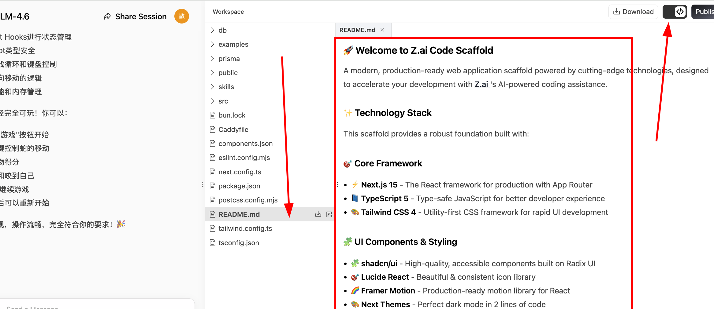

로컬 결과가 z.ai 결과와 최대한 비슷해지게 하고 싶다면, 이 README 전체 내용을 복사해 Trae 사이드바에 붙여 넣고, README의 아키텍처에 따라 로컬 코드를 수정하게 하면 됩니다.

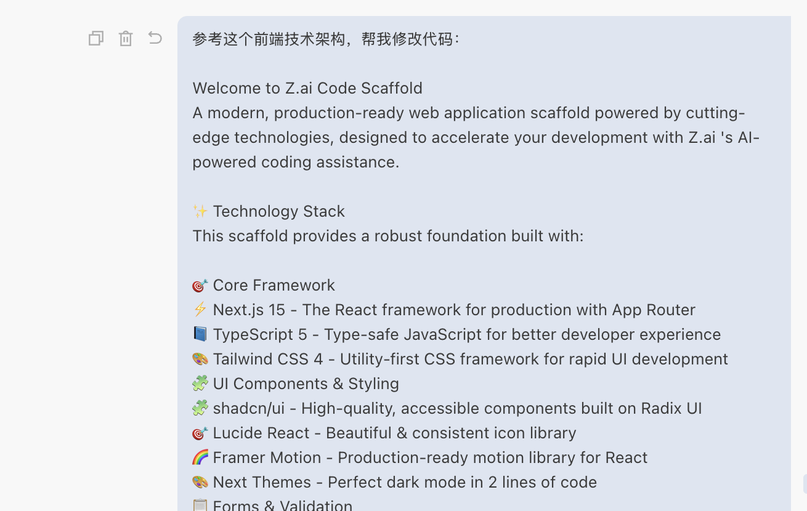

마지막으로 z.ai와 매우 비슷한 페이지 디자인 스타일을 얻을 수 있습니다.

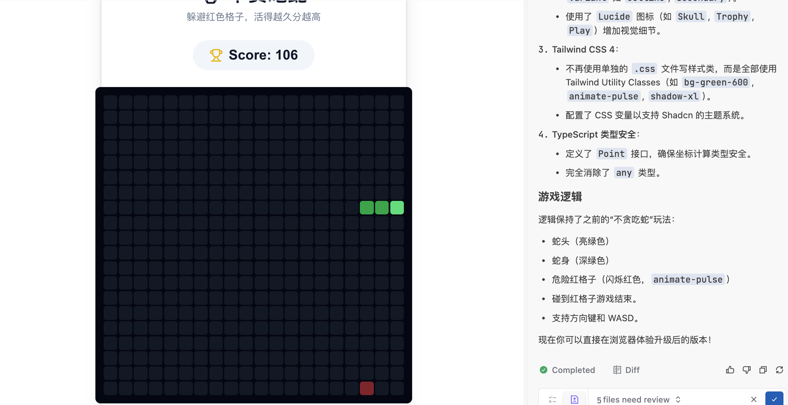

<div style="margin: 50px 0;">
  <ClientOnly>
    <StepBar :active="2" :items="[
      { title: '환경 인식', description: 'IDE와 AI IDE 이해' },
      { title: '로컬 실습', description: 'Trae로 스네이크 만들기' },
      { title: '도구 상세', description: 'IDE 인터페이스 익히기' },
      { title: '소통 기술', description: 'AI와 효율적으로 대화하기' }
    ]" />
  </ClientOnly>
</div>

## 5. 인터페이스의 각 버튼은 무엇을 할까

위 작업을 통해 최소 프로그램 생성 폐쇄 루프는 빠르게 통과했습니다. 하지만 IDE에 충분히 익숙하다고 말하기는 아직 어렵습니다. 앞으로 오래 함께할 이 도구를 제대로 익히기 위해, 이번 절에서는 IDE의 각 세부 부분을 깊이 설명합니다. 먼저 인터페이스부터 시작합니다. 서로 다른 AI IDE의 인터페이스는 약간 다르지만, 대부분 [VS Code의 레이아웃](https://code.visualstudio.com/docs/getstarted/getting-started)을 이어받았습니다.

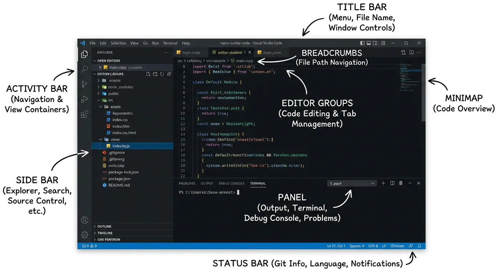

각 부분의 구체적인 역할은 다음과 같습니다.

- **Title Bar(제목 표시줄)**: 파일명과 창 제어 버튼을 표시합니다.
- **Activity Bar(활동 표시줄)**: 파일, 검색 등 기능 뷰를 전환합니다.
- **Side Bar(사이드바)**: 파일 목록 같은 구체적인 내용을 표시합니다.
- **Editor Groups(편집 영역)**: 코드를 작성하는 핵심 영역입니다.
- **Breadcrumbs(경로 탐색)**: 파일 경로를 표시하고 이동을 지원합니다.
- **Minimap(코드 미니맵)**: 코드를 빠르게 미리 보고 위치를 찾습니다.
- **Panel(하단 패널)**: 터미널과 출력 창을 포함합니다.
- **Status Bar(상태 표시줄)**: 현재 환경 상태를 표시합니다.

더 구체적인 설명은 [부록의 가상 IDE 시각화 IDE 원리 부분](/ko-kr/appendix/2-development-tools/ide-basics)을 확인하세요.

<div style="margin: 50px 0;">
  <ClientOnly>
    <StepBar :active="3" :items="[
      { title: '환경 인식', description: 'IDE와 AI IDE 이해' },
      { title: '로컬 실습', description: 'Trae로 스네이크 만들기' },
      { title: '도구 상세', description: 'IDE 인터페이스 익히기' },
      { title: '소통 기술', description: 'AI와 효율적으로 대화하기' }
    ]" />
  </ClientOnly>
</div>

## 6. AI에게 어떻게 말해야 효과적일까

AI 능력이 점점 강해지면서, 우리는 이미 “프로그래머에게 코드를 써 달라고 하는” 많은 일을 AI에게 맡길 수 있게 되었습니다.  
하지만 실제로 사용해 보면 알게 됩니다. 같은 AI를 쓰는데도 어떤 사람은 몇 마디만으로 실행 가능한 작은 프로젝트를 얻고, 어떤 사람은 한참 대화했는데 결과가 전혀 원하는 것이 아닙니다. 그 차이는 대개 “누가 더 똑똑한가”가 아니라, AI에게 말하는 방식이 충분히 구체적이고 단계적인가에 있습니다.  
이 절에서는 몇 가지 흔한 상황에서 출발해 완전 초보자에게 적합한 질문 방식을 소개하고, AI가 더 안정적으로 쓸 수 있는 결과를 내도록 돕습니다.

### 6.1 요구사항을 분명히 말하기: “모호한 생각”에서 “구체적인 설명”으로

많은 사람이 처음 AI를 사용할 때 아주 포괄적인 한 문장만 말하는 습관이 있습니다. 예:

> “웹페이지 하나 만들어줘.”  
> “작은 프로그램 하나 써줘.”

이런 경우 AI는 당신이 무엇을 원하는지 스스로 “상상”할 수밖에 없습니다. 그래서 겉보기에는 꽤 완성도 있어 보이는 것을 아무거나 줄 수 있지만, 실제로 만들고 싶은 것과는 많이 다를 때가 많습니다.  
AI가 당신의 뜻을 더 잘 이해하게 하려면 “머릿속 생각”을 나누어 몇 문장으로 단계별로 분명히 말해야 합니다.

다음 몇 가지 측면을 보충할 수 있습니다.

1. **이것을 어디에 쓰려는지 말하기**  
   예를 들어 “개인 웹사이트”라고만 하지 말고 이렇게 말합니다.
   - “채용 담당자에게 보내기 위한 한 페이지짜리 개인 소개 웹페이지를 만들고 싶어.”

2. **대략 어떤 내용 블록이 필요한지 말하기**  
   전문 용어를 쓰지 않아도 됩니다. 페이지에 무엇이 나타나길 원하는지만 설명하면 됩니다.
   - “페이지는 세 부분이어야 해. 맨 위에는 이름과 한 줄 자기소개, 가운데에는 몇 가지 업무 경력, 맨 아래에는 이메일과 WeChat 번호를 넣어줘.”

3. **자신의 수준과 제한을 말하기**  
   AI가 초보자가 받아들일 수 있는 방식으로 만들게 합니다.
   - “나는 코드를 전혀 쓸 줄 몰라. 가장 간단한 방식만 사용해서, 내가 한 파일에 바로 복사하고 브라우저에서 열 수 있게 해줘.”

4. **결과를 어떤 형태로 받고 싶은지 말하기**  
   예:
   - “`index.html`로 바로 저장하고 브라우저에서 열 수 있는 전체 코드를 주세요.”

종합하면 AI에게 이렇게 말할 수 있습니다.

> “나는 코드를 전혀 쓸 줄 몰라. 채용 담당자에게 보내기 위한 한 페이지짜리 개인 소개 웹페이지를 만들고 싶어.  
> 페이지에는 세 부분이 필요해. 위에는 이름과 한 줄 자기소개, 가운데에는 몇 가지 업무 경력, 아래에는 이메일과 WeChat 번호를 넣어줘.

이 정보를 분명히 말하면 AI는 아무거나 “멋져 보이지만 쓸 수 없는 것”을 주는 대신, 당신의 실제 요구에 더 가까운 결과를 낼 수 있습니다.

### 6.2 리듬 맞추기: 먼저 “실행되게” 하고, 그다음 조금씩 복잡하게 만들기

완전 초보자에게 가장 흔한 함정은 처음부터 “매우 완전하고” “기능이 많은” 것을 만들려고 하는 것입니다.  
예:

> “Taobao 같은 웹사이트를 만들어줘.”  
> “회원가입, 로그인, 주문이 가능한 시스템을 만들어줘.”

결과는 대개 이렇습니다. AI가 큰 코드 덩어리를 주고, 복사해 넣으면 열리지 않거나 여기저기 오류가 납니다. 어디가 문제인지도 이해할 수 없어 결국 포기하게 됩니다.

더 적합한 방법은 **능동적으로 리듬을 제어**하는 것입니다. AI가 한 번에 모든 것을 쏟아붓게 하지 말고, 당신을 따라 한 단계씩 진행하게 하세요. 아래 순서대로 요구할 수 있습니다.

1. **첫 번째 단계: 먼저 “최소 예시”를 요청하기**  
   한 가지만 확인합니다. 브라우저에서 무엇인가 보이는가.  
   예:

   > “먼저 가장 간단한 예시를 주세요. 브라우저에서 ‘여기는 내 홈페이지입니다’라는 한 줄만 보이면 됩니다.  
   > 그리고 파일명을 무엇으로 해야 하는지, 어떻게 저장하고 어떻게 여는지 단계별로 알려 주세요.”

2. **두 번째 단계: 이 기반 위에 내용을 천천히 추가하기**  
   “그 한 줄이 실제로 보인다”는 것을 확인한 뒤 이렇게 말합니다.

   > “방금 기반 위에 ‘업무 경력’ 영역을 추가해 주세요. 전체 코드를 다시 보내 주세요. 바뀐 부분만 보내지 마세요.”

3. **세 번째 단계: 구조가 거의 잡힌 뒤 보기 좋게 만들기**  
   예:
   > “이제 페이지가 정상적으로 내용을 표시합니다. 다음으로 조금 미화해 주세요. 전체를 가운데 정렬하고, 제목은 조금 크게 하고, 편안한 글꼴을 사용해 주세요. 업데이트된 전체 코드를 주세요.”

단계를 하나 추가할 때마다 먼저 한 번 실행하고 실제 변화가 있는지 확인한 뒤 AI에게 다음을 추가하게 하세요. 이렇게 하면 어떤 단계에서 문제가 생겨도 “직전 정상 버전”으로 빠르게 돌아갈 수 있고, 완전히 처음부터 다시 할 필요가 없습니다.

### 6.3 스크린샷과 복사를 잘 활용하기: 말로 못 하겠으면 “화면을 AI에게 던지기”

완전 초보자가 자주 겪는 어려움은 “코드를 못 고치는 것”보다 **문제를 어떻게 말해야 할지 모른다**는 데 있습니다.  
예:

- 브라우저에 갑자기 영어 오류가 잔뜩 뜨는데 전혀 이해할 수 없습니다.
- 웹페이지 레이아웃이 생각과 다르지만, 어떤 단어로 설명해야 할지 모릅니다.

이럴 때 전문 용어를 억지로 짜낼 필요는 없습니다. 가장 간단한 방법은 **본 것을 그대로 AI에게 던지는 것**입니다.

다음처럼 할 수 있습니다.

1. **오류 문자 복사하기**  
   빨간 오류 메시지를 보면 바로 복사한 뒤 이렇게 말합니다.

   > “이것은 실행 후 나타난 전체 오류 정보입니다. 영어를 이해하지 못하겠습니다. 먼저 일반인이 이해할 수 있는 말로 대략 무슨 뜻인지 설명해 주세요.  
   > 그리고 지금 가장 간단히 어떻게 고치면 되는지 알려 주세요.”

2. **AI에게 스크린샷 보여 주기**
   “이 페이지가 그냥 이상해 보인다”고 느끼지만 설명을 못 하겠다면:
   - 현재 페이지 스크린샷을 찍습니다.
   - 사용 중인 전체 코드를 복사해 AI에게 보냅니다.
   - 그리고 이렇게 설명합니다.
     > "이것은 현재 페이지 모습이고, 이것은 현재 전체 코드입니다.
     > 원래는 3열 레이아웃을 원했는데 지금은 1열이 되었습니다. 원인을 봐 주고, 수정된 전체 코드를 주세요."

   ::: tip 💡 스크린샷 기능 보충 설명

   주의할 점은 **모든 AI 모델이 “이미지를 볼 수 있는” 것은 아니라는 점**입니다. 여기에는 서로 다른 두 개념이 관련됩니다.

   - **순수 텍스트 대형 모델(LLM)**: 텍스트 입력만 처리할 수 있고 이미지 내용을 인식할 수 없습니다. 스크린샷을 보내면 처리를 거부하거나 이미지 안의 정보를 제대로 이해하지 못할 수 있습니다.

   - **멀티모달 모델**: 텍스트, 이미지 등 여러 유형의 입력을 동시에 처리할 수 있습니다. 당신이 보낸 스크린샷을 “이해”하고, 이미지 내용을 바탕으로 제안을 줄 수 있습니다.

   **흔한 모델 능력 참고**(Trae에서 선택 가능한 모델 기준):

   | 모델 | 이미지 입력 지원 여부 |
   |------|-----------------|
   | Doubao-Seed 시리즈 | ✅ 지원 |
   | GLM-4.7 / 4.6 | ❌ 미지원 |
   | MiniMax-M2.7 / M2.5 | ❌ 미지원 |
   | DeepSeek-V3.1 | ❌ 미지원 |
   | Kimi-K2.5 | ✅ 지원 |
   | Kimi-K2-0905 | ❌ 미지원 |
   | Qwen-3-Coder | ❌ 미지원 |
   | Gemini 시리즈 | ✅ 지원 |
   | GPT 시리즈 | ✅ 지원 |

   **사용 제안**: 스크린샷으로 AI에게 인터페이스 문제를 확인하게 하고 싶다면, 먼저 사용하는 모델이 이미지 입력을 지원하는지 확인하세요. 지원하지 않는다면 문자로 문제를 설명하거나 오류 정보를 복사해 붙여 넣으세요.

   :::

3. **마음에 드는 웹페이지를 만나 비슷하게 만들고 싶을 때**  
   “이 레이아웃을 뭐라고 부르지”라고 말할 필요가 없습니다. 바로:
   - 스크린샷을 찍거나 그 페이지의 주요 제목과 문단을 복사합니다.
   - 그리고 이렇게 말합니다.
     > “이것과 구조가 비슷한 페이지를 만들고 싶습니다. 완전히 똑같을 필요는 없습니다.  
     > 간단한 코드로 비슷한 프레임을 하나 만들어 주세요. 그다음 글자는 제가 제 것으로 바꾸겠습니다.”

간단히 말하면, 당신은 “본 것을 AI에게 옮겨 주고”, 가장 쉬운 말로 “이것이 어떻게 바뀌면 좋겠다”고 말하면 됩니다. 나머지 “코드로 번역하기, 용어 설명하기, 문제 찾기”는 AI에게 맡기면 됩니다.

### 6.4 AI가 생성한 코드가 작동하지 않을 때: 공통 대응 방법

실제 연습에서는 반드시 이런 상황을 만납니다.  
AI가 아주 성실하게 코드를 줬고, 당신도 정직하게 복사했지만 결과는 브라우저가 텅 비거나, AI가 말한 효과와 전혀 다릅니다.  
이것은 당신이 “배울 수 없다”는 뜻도 아니고, AI가 완전히 틀렸다는 뜻도 아닙니다. 다만 당신과 AI 사이에 몇 차례 “왕복 확인”이 더 필요하다는 뜻입니다.

코드가 “작동하지 않을” 때는 아래 고정 절차에 따라 AI에게 말할 수 있습니다.

1. **먼저 “무엇을 했고 + 지금 어떤 상태인지” 분명히 말하기**  
   “안 열려”, “안 돼”라고만 말하지 않습니다. 이렇게 설명할 수 있습니다.

   > 열어 보니 페이지가 완전히 비어 있고, 네가 말한 환영 문구가 표시되지 않습니다.
   > xxxx 페이지를 열었는데 방금 내가 말한 부분이 없습니다. 사용할 수 없습니다.

2. **현재 전체 코드를 AI에게 보내기**  
   많은 경우 문제는 한 줄을 덜 복사했거나, 이전 내용과 이번 내용이 섞였기 때문입니다.  
   이렇게 말할 수 있습니다.

   > “아래는 지금 이 파일 안의 전체 코드입니다.  
   > 어디가 빠졌는지, 잘못 썼는지, 순서가 틀렸는지 비교해 주세요.  
   > 수정된 전체 코드를 바로 주세요. 작은 일부만 보내지 마세요.”

3. **오류 안내가 있으면 함께 제공하기**  
   예를 들어 브라우저 오른쪽 위에 뜬 오류나 하단의 빨간 글자입니다. 다음을 할 수 있습니다.
   - 오류 문자를 복사합니다.
   - 또는 스크린샷을 찍습니다.
   - 그리고 말합니다.
     > “이것은 제가 본 오류 안내입니다. 전혀 이해하지 못하겠습니다. 먼저 쉬운 방식으로 대략 어떤 문제인지 설명하고, 지금 가장 먼저 고쳐야 할 몇 줄을 알려 주세요.”

4. **상대에게 “초보자 모드”로 단계별 설명을 요구하기**  
   자신의 상황을 분명히 말하고 중간 단계를 생략하지 말라고 할 수 있습니다.

   > “저는 코드를 전혀 쓸 줄 모릅니다. 단계별로 알려 주세요.  
   > 1단계에서는 어느 줄을 고쳐야 하는지,  
   > 2단계에서는 어떻게 저장해야 하는지,  
   > 3단계에서는 어떻게 다시 열거나 페이지를 새로고침해야 하는지.  
   > 각 단계는 완전한 문장으로 써 주세요.”

5. **마지막으로 “정상이라면 무엇을 봐야 하는지” 비교 기준을 말해 달라고 하기**  
   예:
   > 먼저 말해 주세요. 수정된 코드대로라면 정상적으로 웹페이지를 열었을 때 무엇이 보여야 하나요?

이 절차에 따라 AI와 상호작용하면 대부분의 “코드가 작동하지 않는” 상황은 몇 차례 왕복 안에 해결할 수 있습니다.  
동시에 흔한 문제 유형에도 점점 익숙해져 다음에 비슷한 상황을 만나면 직접 해결할 수 있게 됩니다.

## 7. 소결과 다음 단계

이번 장에서 당신은 “웹페이지에서 AI가 생성한 스네이크를 플레이할 수 있음”에서 “로컬에서 AI IDE로 직접 미니게임을 만들 수 있음”으로 한 단계 업그레이드했습니다. 크게 세 가지를 이해했습니다. 코드를 쓸 때 왜 VS Code 같은 IDE가 필요한지, 그 위에 AI(Trae, Cursor 등)가 더해지면 IDE가 더 이상 도구 상자에 그치지 않고 자연어를 이해하고 파일 생성, 환경 설치, 코드 수정을 도와주는 “인턴 엔지니어”가 된다는 점, 그리고 IDE 인터페이스의 각 영역(왼쪽 파일, 하단 터미널, 가운데 편집 영역, 오른쪽 AI 패널)이 각각 무엇을 담당하는지입니다. 이제 사용할 때 막막함이 줄어듭니다.

더 중요한 것은 이미 한 번의 완전한 흐름을 실제로 통과했다는 점입니다. 로컬에서 빈 폴더 만들기 → AI IDE로 열기 → 사이드바 대화에서 요구사항 설명하기 → AI가 프로젝트를 생성하고 개발 서버를 시작하게 하기 → 문제가 생기면 “현상 + 전체 코드 + 오류 스크린샷”을 함께 AI에게 던지고 “초보자 모드”로 단계별 수정 요청하기. 이 과정에서 더 효과적인 프롬프트를 쓰는 법도 연습했습니다. 목표, 내용 구조, 자신의 수준을 분명히 말하고, “먼저 실행되게” 한 다음 “더 보기 좋고 재미있게” 만드는 식으로 리듬을 제어하는 법입니다.

다음 장에서는 초점을 “도구를 사용할 줄 아는 것”에서 “진짜 누군가 쓰고 싶어 하는 프로토타입 만들기”로 옮깁니다. 사용자 관점에서 규칙, 상호작용, 피드백을 설계하고, AI가 이러한 생각을 제품의 초기 형태로 구현하게 할 것입니다.

## 8. 📚 과제: 로컬 AI IDE로 더 복잡한 게임 만들기

<el-card shadow="hover" style="margin: 20px 0; border-radius: 12px;">
  <template #header>
    <div style="font-weight: bold; font-size: 16px;">🚀 도전 과제: 나만의 게임 만들기</div>
  </template>

  <p>
    이미 로컬 AI IDE로 스네이크를 만들어 보았습니다. 이제 조금 더 복잡한 미니게임에 도전하고, “요구사항 설명 →
    프로젝트 생성 → 로컬 실행 → 디버깅 반복”의 흐름을 완전히 한 번 더 밟아 보세요.
  </p>

  <ol>
    <li>
      <strong>스네이크보다 조금 더 복잡한 게임 하나 선택하기</strong>
      <ul>
        <li>“테트리스”, “두더지 잡기”, “지뢰 찾기”, “2048”, “비행기 슈팅” 같은 것이 가능합니다.</li>
        <li>또는 직접 상상한 간단한 오리지널 게임도 됩니다.</li>
      </ul>
    </li>
    <li>
      <strong>반드시 로컬 AI IDE로 전체 과정을 완성하기</strong>
      <ul>
        <li>빈 폴더를 새로 만들고 AI IDE로 엽니다.</li>
        <li>사이드바 채팅에서 게임 요구사항을 분명히 설명합니다.</li>
        <li>AI가 파일 생성, 프로젝트 구조 구축, 주요 로직 구현을 맡게 합니다.</li>
        <li>로컬 개발 서버를 시작해 게임이 정상적으로 실행되는지 확인합니다.</li>
      </ul>
    </li>
    <li>
      <strong>기본적인 “플레이 가능성”과 피드백 갖추기</strong>
      <ul>
        <li>최소한 시작, 진행 중, 종료 세 가지 상태를 포함해야 합니다.</li>
        <li>플레이어에게 명확한 조작 방식(키보드 또는 마우스)이 있어야 합니다.</li>
        <li>화면에 명확한 점수 또는 진행 피드백이 있어야 합니다.</li>
      </ul>
    </li>
    <li>
      <strong>최소 2회 이상 반복 개선하기</strong>
      <ul>
        <li>첫 번째 라운드에서는 AI가 “플레이 가능한” 버전을 만들게 합니다.</li>
        <li>두 번째 라운드 이후에는 스타일, 난이도, 상호작용 최적화 같은 구체적인 개선을 단계적으로 제시합니다.</li>
      </ul>
    </li>
  </ol>
</el-card>

<RelatedArticlesSection
  title="계속 학습하기"
  description="먼저 프로토타입 실습에 들어가고, 이후 AI 능력을 점진적으로 연결하는 것을 추천합니다."
  :items="relatedArticles"
/>

# 부록

<el-card id="appendix-nav" shadow="hover" style="margin-top: 40px; margin-bottom: 24px; border-left: 5px solid #E6A23C;">
  <div style="font-weight: bold; margin-bottom: 8px;">부록 내비게이션</div>
  <div style="color: #606266; font-size: 14px; line-height: 1.6; margin-bottom: 12px;">
    여기는 “필요할 때 바로 찾아보는” 보충 자료입니다. 용어가 이해되지 않거나 인터페이스에서 입구를 찾지 못할 때 다시 돌아오세요.
  </div>
  <el-row :gutter="16">
    <el-col :span="12">
      <a href="#appendix-1-map" style="text-decoration: none; color: inherit;"><b>부록 1: 흔한 컴퓨터 용어 빠른 조회표</b></a><br/>
      <span style="font-size: 12px; color: #909399">이해되지 않는 컴퓨터 용어를 만났을 때 여기서 빠르게 의미를 확인하세요. 한 번 통독하는 것을 추천합니다.</span>
    </el-col>
    <el-col :span="12">
      <a href="/ko-kr/appendix/2-development-tools/ide-basics" style="text-decoration: none; color: inherit;"><b>부록 2: Visual Studio Code 메뉴 막대 해석</b></a><br/>
      <span style="font-size: 12px; color: #909399">AI IDE 인터페이스가 어떤 역할을 하는지 모를 때 아래 내용을 AI와 대화하며 확인하거나 직접 읽어 보세요.</span>
    </el-col>
  </el-row>
  <div style="margin-top: 12px; font-size: 12px; color: #909399;">
    지원: Ctrl/⌘+F로 키워드 검색. 새 단어를 만나면 오류를 복사해 AI에게 “초보자 모드”로 설명하게 할 수 있습니다.
  </div>
</el-card>

# 부록 1: 흔한 컴퓨터 용어 빠른 조회표

<el-card id="appendix-1-map" shadow="hover" style="margin-top: 40px; margin-bottom: 20px; border-left: 5px solid #409EFF;">
  <div style="font-weight: bold; margin-bottom: 10px;">🗺️ 용어 지도: 여기서 만나게 될 것들...</div>
  <el-row :gutter="20">
    <el-col :span="6">
      <a href="#term-tool-ui" style="text-decoration: none; color: inherit;">🖥️ <b>도구 인터페이스</b></a><br/>
      <span style="font-size: 12px; color: #909399">IDE / 터미널 / 패널</span>
    </el-col>
    <el-col :span="6">
      <a href="#term-network" style="text-decoration: none; color: inherit;">🌐 <b>네트워크 서비스</b></a><br/>
      <span style="font-size: 12px; color: #909399">URL / 포트 / 로컬</span>
    </el-col>
    <el-col :span="6">
      <a href="#term-frontend-backend" style="text-decoration: none; color: inherit;">⚙️ <b>프론트엔드와 백엔드</b></a><br/>
      <span style="font-size: 12px; color: #909399">API / JSON / 인터페이스</span>
    </el-col>
    <el-col :span="6">
      <a href="#term-code-basic" style="text-decoration: none; color: inherit;">📝 <b>코드 기초</b></a><br/>
      <span style="font-size: 12px; color: #909399">변수 / 함수 / 컴포넌트</span>
    </el-col>
  </el-row>
  <el-row :gutter="20" style="margin-top: 10px;">
    <el-col :span="6">
      <a href="#term-debug" style="text-decoration: none; color: inherit;">🐞 <b>디버깅과 오류 찾기</b></a><br/>
      <span style="font-size: 12px; color: #909399">Bug / 중단점 / 로그</span>
    </el-col>
    <el-col :span="6">
      <a href="#term-project" style="text-decoration: none; color: inherit;">📂 <b>프로젝트 관리</b></a><br/>
      <span style="font-size: 12px; color: #909399">Git / 저장소 / 커밋</span>
    </el-col>
    <el-col :span="6">
      <a href="#term-ai-tool" style="text-decoration: none; color: inherit;">🤖 <b>AI 도구</b></a><br/>
      <span style="font-size: 12px; color: #909399">Agent / 모델 / Key</span>
    </el-col>
    <el-col :span="6">
      <a href="#term-browser" style="text-decoration: none; color: inherit;">🛠️ <b>브라우저</b></a><br/>
      <span style="font-size: 12px; color: #909399">DevTools / 콘솔</span>
    </el-col>
  </el-row>
</el-card>

이 부분은 일부러 외울 필요가 없습니다. 먼저 머릿속에 대략적인 인상을 만드는 것이 더 중요합니다.

## <span id="term-tool-ui">[1. “도구 인터페이스”와 관련된 단어](#appendix-1-map)</span>

### 1. IDE, 편집기, 터미널

**IDE(통합 개발 환경)**  
IDE를 “프로그래머의 작업대”라고 상상할 수 있습니다.

- 한쪽에는 글을 쓰는 책상(편집기)이 있고,
- 한쪽에는 전원 콘센트와 버튼(실행, 디버깅)이 있으며,
- 서랍에는 여러 작은 도구(검색, 버전 관리)가 들어 있습니다.  
  VS Code, Trae, Cursor는 모두 IDE이거나 IDE를 기반으로 수정한 도구입니다.

**코드 편집기(Editor)**  
“고급 메모장”에 더 가깝고, 하는 일은 다음뿐입니다.

- 타이핑해서 코드를 쓰게 합니다.
- 색으로 서로 다른 내용을 구분합니다(문법 강조).
- 자동 완성을 제공합니다.  
  IDE 안에서 코드를 쓰는 그 영역이 코드 편집기입니다.

**터미널 / 명령줄(Terminal / 명령줄 창)**  
검은 배경에 흰 글자가 보이는 창입니다. 그 안에서 **명령어를 입력**해 컴퓨터가 일하게 합니다.

- 예: `npm run dev`는 “개발 서버를 시작해 줘”라는 뜻입니다.
- `python main.py`는 “이 Python 파일을 실행해 줘”라는 뜻입니다.  
  “컴퓨터에게 문자 명령을 하나씩 보내면, 컴퓨터가 문자로 실행 결과를 답한다”고 상상하면 됩니다.

### 2. IDE 안의 몇 가지 흔한 영역

**활동 표시줄(Activity Bar)**  
가장 왼쪽의 세로 아이콘 줄이며 “기능 탭”과 비슷합니다.

- 파일 아이콘 클릭 → 왼쪽에 파일 목록 표시
- 돋보기 아이콘 클릭 → 왼쪽이 검색으로 바뀜
- Git 아이콘 클릭 → 왼쪽에 버전 관리 표시

**사이드바(Side Bar)**  
활동 표시줄 오른쪽의 큰 영역이며 현재 모드의 내용을 표시합니다.

- 파일 모드: 프로젝트의 파일과 폴더 표시
- 검색 모드: 검색 결과 목록 표시
- 소스 코드 관리 모드: 어떤 파일이 수정되었는지 표시

**편집 영역(Editor)**  
가운데 가장 큰 영역이며, 파일을 열었을 때 실제 내용을 보고 수정하는 곳입니다.  
위쪽의 탭(Tab)은 “현재 어떤 파일들이 열려 있는지”를 나타냅니다.

**하단 패널(Panel)**  
보통 가장 아래쪽에 있으며 흔히 다음이 있습니다.

- Terminal(터미널): 명령어를 입력해 프로젝트 실행
- Problems(문제): 오류가 난 파일과 줄 번호 나열
- Output(출력): 일부 도구가 출력하는 실행 정보
- Debug Console(디버그 콘솔): 디버깅 중 출력

**상태 표시줄(Status Bar)**  
가장 아래의 얇은 줄입니다.

- 현재 파일의 언어(JS, HTML, Python 등) 표시
- 들여쓰기가 “공백 2개”인지 “공백 4개”인지 표시
- 오류 여부와 현재 Git 브랜치 표시  
  “현재 편집 환경의 작은 건강검진표”로 이해할 수 있습니다.

## <span id="term-network">[2. “웹페이지 / 네트워크 / 서비스”와 관련된 단어](#appendix-1-map)</span>

### 1. URL, http, 포트, 로컬 서비스

**URL(웹 주소)**  
브라우저 주소창에 있는 문자열입니다. 예:

- `https://www.trae.cn/`
- `http://localhost:3000/`  
  인터넷 세계의 어떤 방에 대한 “완전한 주소”와 같습니다.

**HTTP / HTTPS**  
URL 앞에서 보이는 `http://` 또는 `https://`입니다.

- HTTP: 일반 전송 방식
- HTTPS: 한 겹의 암호화가 더 있어 더 안전함  
  먼저 “웹 주소는 보통 `http` 또는 `https`로 시작한다”고 기억하면 됩니다.

**포트(Port)**  
컴퓨터 한 대를 건물로 상상하면, 포트는 **각 방의 문패 번호**입니다.

- `:3000`은 3000번 방을 뜻합니다.
- 같은 컴퓨터에서 여러 서비스를 동시에 열 수 있고, 각각 하나의 포트를 차지합니다.  
  `http://localhost:3000`은 “내 컴퓨터에서 실행 중인 3000번 방의 서비스에 접속한다”는 뜻입니다.

**로컬(Local / localhost)**  
당신 자신의 컴퓨터를 뜻합니다.

- `localhost`는 “이 기계 자신”으로 이해할 수 있습니다.  
  `http://localhost:3000`에 접속하면, 사실 다른 사람의 서버가 아니라 내 컴퓨터에서 실행 중인 프로그램과 상호작용하는 것입니다.

**서비스(Service / Server)**  
“서비스”는 **백그라운드에서 계속 실행되며 언제든 지시를 듣는** 프로그램입니다.

- 웹페이지 서비스: 브라우저가 어떤 주소에 접속하면 웹페이지 내용을 돌려줍니다.
- 게임 서비스: 대전, 저장, 순위표 등을 관리합니다.  
  터미널에서 `npm run dev`로 프로젝트를 시작하는 것은 본질적으로 “로컬에서 웹페이지 서비스를 하나 연다”는 뜻입니다.

## <span id="term-frontend-backend">[3. “프론트엔드 / 백엔드 / 데이터”와 관련된 단어](#appendix-1-map)</span>

### 1. 프론트엔드, 백엔드

**프론트엔드(Frontend)**  
사용자가 **볼 수 있고, 클릭할 수 있는** 부분입니다.

- 웹페이지의 버튼, 텍스트, 이미지, 애니메이션
- React / Vue로 만든 페이지  
  인터페이스를 보여 주고 사용자 조작(클릭, 입력, 드래그 등)에 응답합니다.

**백엔드(Backend)**  
사용자가 **볼 수 없는**, 서버에서 돌아가는 부분입니다.

- 데이터 저장과 읽기(사용자 정보, 주문, 점수 등)
- 비즈니스 규칙 실행(로그인 검증, 권한 판단)  
  프론트엔드를 “매장과 직원”에 비유한다면, 백엔드는 “창고와 장부 시스템”에 비유할 수 있습니다.

### 2. 인터페이스, 요청, 응답, JSON

**인터페이스 / API**  
프론트엔드와 백엔드가 미리 약속해 둔 “질문하기 + 답변하기” 규칙입니다.

- 프론트엔드: “이 주소와 이 형식으로 질문할게.”
- 백엔드: “이 형식으로 결과를 돌려줄게.”

**요청(Request)**  
프론트엔드가 백엔드로 보내는 한 번의 “질문”입니다.

- 어디로 요청하는지(URL)
- 어떤 방식인지(GET, POST 등)
- 어떤 파라미터를 가져가는지(예: 사용자 ID)

**응답(Response)**  
백엔드가 프론트엔드에 주는 “답변”입니다.

- 상태 코드(200 성공, 404 찾을 수 없음, 500 서버 오류)
- 실제 데이터(대부분 JSON)

**JSON**  
**JavaScript 코드와 매우 비슷한 작성 방식**으로 데이터를 표현하는 형식입니다. 예:

```json
{
  "name": "Alice",
  "score": 120
}
```

“기계용 키-값 메모장”으로 이해할 수 있으며, 프론트엔드와 백엔드는 자주 이것으로 데이터를 교환합니다.

## <span id="term-code-basic">[4. “코드 작성 자체”와 관련된 단어](#appendix-1-map)</span>

### 1. 변수, 식별자, 상태

**변수(Variable)**  
“어떤 데이터에 붙이는 이름표”입니다.

- 예를 들어 점수를 `score`라고 기록합니다.
- 이후 `score`라는 이름을 사용해 이 데이터를 읽고 쓸 수 있습니다.

```js
let score = 0
score = score + 10
```

**식별자(Identifier)**  
“직접 붙인 여러 이름”의 총칭입니다.

- 변수명: `score`
- 함수명: `moveSnake`
- 컴포넌트명: `SnakeGame`  
  “사진”, “업무”, “청구서”처럼 폴더에 이름을 붙여 코드 안에서 서로 다른 “것”을 구분하기 쉽게 하는 것과 같습니다.

**상태(State)**  
프로그램의 현재 “핵심 상황 기록”입니다.

- 게임이 이미 끝났는지
- 뱀이 지금 몇 번째 칸에 있는지
- 현재 점수가 얼마인지  
  React에서는 일반적으로 이렇게 이해합니다. **상태가 바뀌면 인터페이스도 따라 업데이트되어야 한다**.

### 2. 함수, 컴포넌트, 모듈

**함수(Function)**  
“반복해서 할 수 있는 일”을 묶어 이름을 붙인 것입니다.

```js
function sayHello(name) {
  console.log('Hello, ' + name)
}
```

이후 `sayHello('Bob')`라고 쓰면 안의 몇 줄을 다시 실행하는 것과 같습니다.

**컴포넌트(Component)**  
프론트엔드에서 “반복해서 사용할 수 있는 작은 인터페이스 + 작은 로직”입니다.

- 버튼 하나가 컴포넌트일 수 있습니다.
- 상단 내비게이션 하나가 컴포넌트일 수 있습니다.
- 전체 게임 영역도 컴포넌트일 수 있습니다.  
  컴포넌트들은 조립할 수 있으며, 블록을 맞추는 것과 비슷합니다.

**모듈(Module)**  
“관련 코드 한 묶음으로 이루어진 파일”입니다.

- `snakeLogic.ts`에는 “뱀이 어떻게 움직이는지”와 관련된 코드를 둡니다.
- `score.ts`에는 점수를 계산하는 코드를 둡니다.  
  모듈끼리는 서로 “가져오기 / 내보내기”를 할 수 있으며, 서로 다른 서랍에 들어 있는 도구와 같습니다.

### 3. 문법, 프로그래밍 언어, 프레임워크

**문법(Syntax)**  
어떤 프로그래밍 언어의 “문법 규칙”과 “구두점 습관”입니다.

- 문자열은 따옴표를 붙여야 합니다.
- 각 문장 끝에 세미콜론을 써야 하는지 여부가 있습니다.
- 코드 블록은 `{}`로 감싸야 합니다.  
  문법을 잘못 쓰면 컴파일러 / 인터프리터가 바로 “문법 오류”를 냅니다.

**프로그래밍 언어(Programming Language)**  
컴퓨터와 소통하는 규칙과 어휘 전체입니다. 예:

- JavaScript, Python, Java, C++, Go...  
  언어마다 적합한 일, 작성 방식, 도구 생태계가 다릅니다.

**프레임워크(Framework)**  
다른 사람이 “뼈대를 미리 세워 둔” 큰 코드와 관습 묶음입니다.

- 프론트엔드: React, Vue. 인터페이스 업데이트, 상태 관리 등을 도와줍니다.
- 백엔드: Django, Spring Boot 등.  
  “이미 준비된 뼈대 위에 내용을 채우는 것”이므로 처음부터 모든 것을 만드는 것보다 훨씬 쉽습니다.

## <span id="term-debug">[5. “디버깅 / 오류 찾기”와 관련된 단어](#appendix-1-map)</span>

### 1. Bug, 오류 메시지, 로그 / console.log

**Bug**  
프로그램의 동작이 생각과 다르면 bug입니다.

- 원래 버튼이 나타나야 하는데 나타나지 않습니다.
- 원래 10점이 올라야 하는데 훨씬 많이 올라갑니다.
- 페이지를 열자마자 흰 화면입니다.

**오류 메시지(Error Message)**  
프로그램이 멈춘 뒤 화면이나 터미널에 나타나는 “무서워 보이는” 영어 문구입니다.  
보기는 어렵지만 보통 다음을 알려 줍니다.

- 대략 어디가 틀렸는지
- 어떤 파일, 몇 번째 줄 근처를 확인해야 하는지  
  그대로 복사해 AI에게 던지면 번역과 분석을 시킬 수 있습니다.

**로그(Log)**  
프로그램이 실행되는 동안 스스로 “말하는 내용”입니다.  
가장 흔한 것은 프론트엔드의 다음 코드입니다.

```js
console.log('현재 점수', score)
```

핵심 단계에서 일부러 숫자나 정보를 보고해, 프로그램이 원하는 흐름대로 가는지 확인하는 방법으로 이해할 수 있습니다.

> **console.log란 무엇인가요?**
>
> - `console`은 “디버깅용 작은 칠판”으로 이해할 수 있습니다.
> - `.log`는 “작은 칠판에 한 줄 쓰기”입니다.
> - 브라우저에서 F12를 눌러 개발자 도구의 Console 패널을 열면 이런 출력을 볼 수 있습니다.

### 2. 디버깅, 중단점, 한 단계 실행, 스냅샷

**디버깅(Debug / 디버그 프로그램)**  
프로그램에 문제가 생겼을 때 무작정 수정하는 것이 아니라:

- 프로그램을 어떤 줄에서 잠시 멈추게 하고(중단점),
- 현재 각 변수의 값을 보고,
- 한 단계씩 내려가며 “어디서부터 이상해지는지” 관찰하는 것입니다.

**중단점(Breakpoint)**  
중단점은 “이 줄에 일시정지 버튼을 꽂아 둔다”고 상상할 수 있습니다.

- 프로그램은 평소에는 계속 아래로 실행됩니다.
- 중단점을 꽂은 줄에 도달하면 잠시 멈추고, 당신이 확인할 때까지 기다립니다.

**한 단계 실행(Step)**  
중단점에서 멈춘 뒤에는 다음을 선택할 수 있습니다.

- 한 줄씩 아래로 실행(step over)
- 어떤 함수 내부로 들어가 자세히 보기(step into)  
  빠른 영상을 바로 보는 것이 아니라 춤 동작을 하나씩 분해해 보는 것과 같습니다.

**스냅샷(Snapshot) - 단순한 이해**  
여기서 “스냅샷”은 다음처럼 이해할 수 있습니다.

> **어떤 시간점의 “현재 상태”를 사진으로 찍어 나중에 비교하기 편하게 하는 것.**  
> 실제 도구에서 “스냅샷”은 다음을 가리킬 수 있습니다.

- 한 번 커밋한 시점의 프로젝트 전체 상태
- 디버깅 중 어떤 시간점의 메모리 / 변수 전체 상황  
  먼저 이 비유만 기억해도 충분합니다. **스냅샷 ≈ 어느 순간 상태의 사진**.

## <span id="term-project">[6. “프로젝트 관리”와 관련된 단어](#appendix-1-map)</span>

### 1. 프로젝트, 작업공간, 폴더

**프로젝트(Project)**  
하나의 애플리케이션을 구현하기 위해 같은 폴더에 둔 것들입니다.

- 소스 코드 파일
- 설정 파일
- 소재(이미지, 오디오 등)

**작업공간(Workspace)**  
VS Code / Trae가 “이번에 현재 어떤 것들을 열었는지”를 설명할 때 쓰는 개념입니다.

- 폴더 하나 열기 → 간단한 작업공간
- 때로는 여러 폴더를 하나의 다중 프로젝트 작업공간으로 합칠 수도 있습니다.

### 2. Git, 저장소, 커밋(Commit)

**Git(버전 관리 도구)**  
프로젝트의 “타임머신”으로 이해할 수 있습니다.

- 매번 한 묶음의 내용을 수정한 뒤 “버전 단체 사진”을 찍을 수 있습니다.
- 나중에 필요할 때 어떤 과거 상태로 돌아갈 수 있습니다.

**저장소(Repository / Repo)**  
Git을 켠 뒤 “버전 기록”이 있는 프로젝트 폴더를 “저장소”라고 부릅니다.

**커밋(Commit)**  
매번 “이 변경 묶음은 하나의 단계적 성과다”라고 느낄 때 다음을 할 수 있습니다.

- 설명 한 줄 작성(예: `Add score panel`)
- 현재 전체 수정을 하나의 버전으로 묶기
- Git이 이 순간의 상태를 저장함  
  이 동작을 “commit을 했다”고 합니다.

## <span id="term-ai-tool">[7. “AI 개발 도구”와 관련된 단어](#appendix-1-map)</span>

### 1. AI IDE, Agent, SOLO 모드

**AI IDE**  
일반 IDE 위에 “사람 말을 이해하고 직접 손을 움직일 수 있는” AI가 한 층 더해진 것입니다.

- “스네이크를 만들어줘”라고 하면 프로젝트 구성과 코드 작성을 도와줍니다.
- 오류 스크린샷을 주면 먼저 설명하고 수정도 시도합니다.
- 한 줄씩 완성하는 데 그치지 않고 여러 파일을 함께 수정할 수 있습니다.

**Agent(지능체)**  
Agent는 **항상 대기 중인 AI 작은 엔지니어**로 상상할 수 있습니다.

- 프로젝트 구조를 읽습니다.
- 작업을 분해합니다. 먼저 의존성 설치, 그다음 코드 생성, 그다음 프로젝트 실행.
- 실행 중 오류가 나면 오류 정보를 바탕으로 스스로 방안을 조정합니다.

**SOLO 모드(Trae 예시)**  
의미는 다음과 같습니다.

> 당신은 “목적지”만 분명히 말하면 됩니다.  
> Agent가 스스로 “경로”를 계획하고,  
> 로컬에서 단계별로 실행하며,  
> 중간의 핵심 지점에서만 계속할지 묻습니다.

### 2. 모델, 비밀키(API Key)

**모델(Model, 여기서는 대형 언어 모델을 뜻함)**  
이 단어는 “뒤에서 작동하는 거대한 AI 두뇌”로 간단히 이해할 수 있습니다.

- GPT, Claude, Kimi, GLM 등이 있습니다.
- 서로 다른 모델은 “중국어 이해”, “코드 작성”, “추론”에서 수준이 다릅니다.
- AI IDE에서는 보통 드롭다운 메뉴에서 서로 다른 모델로 바꿔 사용할 수 있습니다.

**비밀키 / API Key**  
API Key는 **아주 긴 “고급 비밀번호 + 신분증 번호”**로 이해할 수 있습니다.  
역할은 하나입니다.

> 다른 사람의 서버에 “저는 어떤 사용자입니다. 당신들의 AI 서비스를 사용할 수 있게 허용하고, 비용을 제 계정에 기록해 주세요”라고 알리는 것.

몇 가지 요점:

- 이 문자열은 보통 긴 무작위 영문자와 숫자입니다.
- 공개된 곳(저장소, 스크린샷, 단체 채팅)에 올리면 안 됩니다. 다른 사람이 얻으면 당신 계정을 도용할 수 있습니다.
- 도구에 API Key를 입력하는 것은 “자물쇠에 열쇠를 꽂는 것”과 같습니다. 이후 도구가 대응 AI 서비스를 호출할 수 있습니다.

## <span id="term-browser">[8. “브라우저 / 개발자 도구”와 관련된 단어](#appendix-1-map)</span>

**Chrome(Google 브라우저)**  
현재 프론트엔드 개발에서 가장 자주 쓰는 브라우저 중 하나입니다.

- 웹페이지를 빠르게 엽니다.
- 비교적 강력한 “개발자 도구”를 내장해 문제 확인에 편리합니다.

**새로고침(Refresh / Reload)**  
현재 웹페이지를 다시 불러옵니다.

- 프론트엔드 코드를 수정한 뒤 자동 새로고침 도구가 없다면, 수동으로 새로고침해야 결과를 볼 수 있습니다.

**개발자 도구(DevTools)**  
브라우저 안에서 개발자를 위해 제공되는 도구 패널 묶음입니다.

- 웹페이지 구조 확인(Elements)
- 스타일 확인(Styles)
- 오류와 로그 확인(Console)
- 네트워크 요청 확인(Network)  
  Chrome에서는 보통 `F12` 또는 `Ctrl+Shift+I`로 엽니다.

**Console(콘솔)**  
개발자 도구 안의 탭 하나이며, 다음을 전문적으로 보여 줍니다.

- 작성한 `console.log(...)` 출력
- 실행 중 발생한 오류(빨간 글자)  
  이것을 “프로그램의 채팅창”으로 볼 수 있습니다.
- 프로그램이 할 말이 있으면 여기에 씁니다.
- 디버깅할 때 가장 자주 보는 부분이 바로 이곳입니다.

나중에 학습 과정에서 새로운 단어를 만나면, 이 스타일대로 AI에게 모든 내용을 보충하게 할 수 있습니다.

- 먼저 “이것이 무엇을 하는가”를 한 문장으로 쓰기
- 그다음 “무엇에 비유할 수 있는가”를 한 문장으로 쓰기
- 마지막으로 아주 간단한 예 하나 주기  
  이렇게 하면 당신의 “개인 용어집”이 점점 길어지고 실용적이 되어, 컴퓨터와 더 잘 소통할 수 있게 됩니다.
