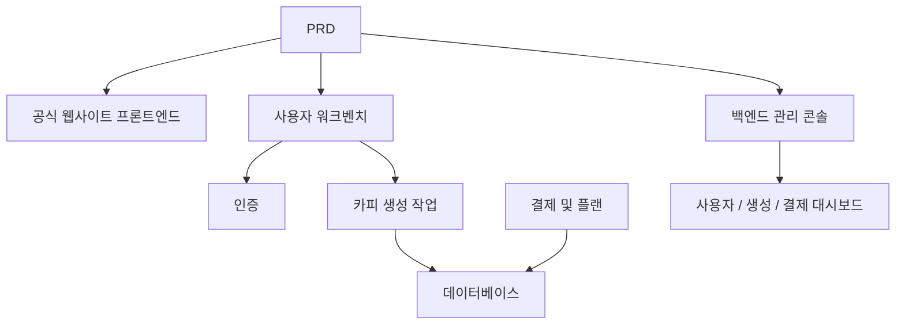

# AI 마케팅 카피 SaaS 개발 실전

## 개요

본 실전 프로젝트는 실제 PRD를 바탕으로, 인디 개발자와 콘텐츠 팀을 위한 AI 마케팅 카피 SaaS 제품을 처음부터 완성하는 것을 요구합니다. Supabase를 백엔드 서비스로, Stripe를 결제 시스템으로 사용하여, 요구사항 분석부터 배포까지의 전 과정을 완료합니다.

이것은 Stage 2의 종합 실전环节입니다. 앞선 여러 장에서 프론트엔드 페이지 구축, 백엔드 인터페이스 개발, 데이터베이스 조작, 결제 연동 등 개별 기술을 각각 배웠습니다 — 이 프로젝트는 이를 모두 연결하여 실행 가능한 제품 프로토타입을 납품하는 것을 요구합니다.

## 사전 지식

본 프로젝트를 시작하기 전에 다음 내용을 이미 숙지해야 합니다:

- 프론트엔드 페이지 디자인 및 컴포넌트 라이브러리 사용 ([UI 디자인](../../frontend/ui-design/), [현대적 컴포넌트 라이브러리](../../frontend/modern-component-library/))
- 백엔드 인터페이스 설계 및 개발 ([인터페이스 코드 작성](../../backend/ai-interface-code/))
- 데이터베이스 기초와 Supabase ([데이터베이스에서 Supabase까지](../../backend/database-supabase/))
- 결제 연동 ([Stripe 결제 시스템](../../backend/stripe-payment/))
- Git 워크플로우와 배포 ([Git과 GitHub](../../backend/git-workflow/), [웹 애플리케이션 배포](../../backend/zeabur-deployment/))

## 학습 목표

본 실전을 완료하면 다음이 가능합니다:

1. 실제 PRD를 읽고 이해하여, 개발 과제 목록을 추출
2. AI를 활용하여 단계별로 프론트엔드 페이지와 백엔드 인터페이스 생성
3. Supabase를 사용하여 사용자 인증, 데이터베이스 조작 구현
4. Stripe를 연동하여 유료 구독 기능 구현
5. 관리 백엔드를 구축하고 엔드투엔드 통합 디버깅 완료

## 프로젝트 소개

구축할 제품은 AI 마케팅 카피 SaaS로, 세 가지 하위 시스템을 포함합니다:

| 하위 시스템 | 담당 |
|--------|------|
| **공식 웹사이트 프론트엔드** | 제품 소개, 가격, FAQ, 가입 전환 |
| **사용자 워크벤치** | 제품 정보 입력, 카피 생성, 기록 조회, 플랜 업그레이드 |
| **백엔드 관리 콘솔** | 사용자 관리, 생성 기록, 결제 데이터, 운영 개요 |

백엔드는 Supabase를 사용하여 데이터베이스와 인증 기능을 제공하고, Stripe로 결제를 처리하며, AI 모델로 마케팅 카피를 생성합니다.

::: tip PRD 입구
본 프로젝트의 요구사항 문서는 GitHub에 있습니다: [PRD 보기](https://github.com/datawhalechina/easy-vibe/blob/main/docs/zh-cn/stage-2/assignments/copywriting-platform-supabase/PRD.md)
:::

<div style="margin: 32px 0;">
  <ClientOnly>
    <StepBar :active="0" :items="[
      { title: '요구사항 분석', description: 'PRD를 읽고 페이지, 기능, 인증, 결제 범위를 명확히 합니다' },
      { title: '골격 구축', description: 'AI로 세 세트의 프론트엔드 골격을 생성합니다 (www / app / admin)' },
      { title: '백엔드 연동', description: 'Supabase 인증, 생성 인터페이스, Stripe 결제' },
      { title: '통합 디버깅 및 출시', description: '엔드투엔드로 실행하고, 배포하여 데모를 준비합니다' }
    ]" />
  </ClientOnly>
</div>

## 제1부: 요구사항 분석

### 1.1 PRD 읽기

PRD 문서를 열고 다음 질문에 중점적으로 답하세요:

- 시스템에 몇 개의 진입점이 있나요? 각각 어떤 페이지를 포함하나요?
- 각 페이지의 핵심 기능은 무엇인가요?
- 백엔드에는 어떤 모듈과 데이터 테이블이 포함되나요?
- 플랜 가격, 결제 프로세스, 무료 한도는 어떻게 설계되었나요?
- MVP 범위는 무엇인가요? 첫 번째 버전에서 무엇을 하고, 무엇을 하지 않나요?

::: warning
위 질문에 명확한 답이 없다면, 코드 작성을 시작하지 마세요. 요구사항 이해가 불명확한 것은 재작업의 가장 흔한 원인입니다.
:::

### 1.2 시스템 아키텍처 확인

PRD를 바탕으로 시스템의 전체 아키텍처를 정리합니다:



## 제2부: 프로젝트 골격 구축

### 2.1 프론트엔드 페이지 생성

AI를 사용하여 먼저 모든 페이지의 기본 구조와 가짜 데이터를 생성합니다.

프롬프트 참고:

```text
현재 PRD를 기반으로 AI 마케팅 카피 SaaS의 프론트엔드 골격을 생성해 줘.

요구사항:
1. 세 개의 진입점으로 분리: www, app, admin
2. 공식 웹사이트에는: 홈페이지, 가격, FAQ
3. app에는: 로그인, 회원가입, 생성 워크벤치, 기록, 플랜 페이지
4. admin에는: 백엔드 홈페이지, 사용자 관리, 생성 기록, 결제 주문
5. 먼저 페이지 구조와 가짜 데이터만 생성하고, 실제 인터페이스는 연결하지 마
6. 수업 데모가 아닌 현대적인 SaaS 스타일로 만들어 줘
```

### 2.2 핵심 페이지 완성

골격이 완성되면, 카피 생성 워크벤치(Dashboard) 페이지를 중점적으로 완성합니다:

```text
/dashboard 페이지를 계속 완성해 줘.

이것은 AI 마케팅 카피 워크벤치입니다.

왼쪽 폼 필드:
- 제품명
- 한 줄 소개
- 타겟 사용자
- 3개의 판매 포인트
- 배포 채널 (공식 웹사이트, WeChat 모멘트, 샤오홍슈, Douyin, 이메일)

오른쪽 결과 영역 예비:
- 메인 제목
- 부제목
- CTA
- 3버전의 짧은 카피
- 긴 카피

먼저 mock 데이터로 상호작용을 완성해 줘.

요구사항:
- "카피 생성" 클릭 후 loading 상태 표시
- 결과 영역에 빈 상태 디자인
- 반응형 레이아웃, 넓은 화면과 좁은 화면 모두 정상 표시
```

### 2.3 페이지 구조 검증

항목별로 확인:

- [ ] 세 진입점의 라우팅이 독립적인지
- [ ] 페이지 수가 PRD와 일치하는지
- [ ] Dashboard의 폼과 결과 영역 레이아웃이 합리적인지
- [ ] 가짜 데이터가 기본 UI 상태를 보여주는지

### 막혔나요?

프론트엔드 구축 단계에서 막혔다면, 다음 장을 복습하세요:

- [UI 디자인](../../frontend/ui-design/)
- [UI 디자인 가이드라인을 참고하여 페이지와 버튼 디자인하기](../../frontend/multi-product-ui/)
- [LLM과 Skills로 인터페이스를 아름답게 만들기](../../frontend/llm-skills-beautiful/)
- [디자인 프로토타입에서 프로젝트 코드까지](../../frontend/design-to-code/)
- [현대적 컴포넌트 라이브러리로 인터페이스 업데이트하기](../../frontend/modern-component-library/)

## 제3부: 백엔드 연동

### 3.1 Supabase 로그인 연동

```text
나를 완전 초보자로 생각하고, 단계별로 Supabase 로그인 연동을 안내해 줘.

다음을 완료해 줘:
1. 프로젝트에 Supabase 연동
2. 회원가입, 로그인, 로그아웃 기능 구현
3. 로그인 성공 후 /dashboard로 이동
4. 미로그인 사용자가 /dashboard, /billing, /admin에 접근하면 자동으로 /login으로 이동
5. profiles 테이블 생성
6. 사용자 회원가입 성공 후 profiles 테이블에 자동으로 레코드 생성
7. profiles 테이블은 email, role, plan 필드 포함

구현 요구사항:
- 각 단계에서 어떤 파일을 수정하는지 설명
- 비밀 키를 하드코딩하지 마
- Supabase 백엔드에서 수동으로 조작해야 하는 부분은 명확히 표시
- 완료 후 회원가입과 로그인을 확인하는 방법 설명
```

### 3.2 생성 인터페이스 및 데이터베이스 연동

```text
나를 완전 초보자로 생각하고, 웹사이트의 핵심 기능인 마케팅 카피 생성 및 저장을 완료해 줘.

목표 효과:
1. 사용자가 /dashboard에서 폼을 작성하고 "카피 생성"을 클릭
2. 백엔드에서 수신: 제품명, 소개, 타겟 사용자, 판매 포인트, 배포 채널
3. 백엔드에서 모델을 호출하여 결과 생성
4. 페이지에 생성 결과 표시
5. 입력과 출력 모두 데이터베이스에 저장
6. 사용자가 다음에 접속하면 기록을 볼 수 있음

완료해야 할 사항:
- 생성 인터페이스 /api/generate 생성
- generations 테이블 생성
- 입력 및 출력 필드 설계
- Dashboard 페이지에서 현재 사용자의 기록 읽기

사용자 경험:
- 버튼 loading 상태
- 생성 실패 시 오류 메시지
- 기록이 없을 때 빈 상태

완료 후 설명:
- 프론트엔드 페이지 파일 위치
- 백엔드 인터페이스 파일 위치
- 데이터가 데이터베이스에 기록되는 로직 위치
- 전체 생성 프로세스를 테스트하는 방법
```

### 3.3 Stripe 유료 결제 연동

```text
나를 완전 초보자로 생각하고, LaunchKit에 가장 기본적으로 사용 가능한 Stripe 결제를 추가해 줘.

복잡한 시스템은 필요 없고, 가장 기본적인 결제 프로세스만 먼저 실행해.

완료해야 할 사항:
1. /billing 페이지에 free와 pro 두 가지 플랜 표시
2. 사용자가 업그레이드를 클릭하면 Stripe Checkout으로 이동
3. 결제 성공 후 웹사이트로 돌아옴
4. 결제 결과를 subscriptions 테이블에 저장
5. profile.plan 필드 동기화 업데이트
6. free 사용자는 매일 3회 생성 제한, pro 사용자는 무제한

구현 원칙:
- 먼저 메인 프로세스를 실행하고, 복잡한 경계 조건은 나중에 고려
- Stripe 백엔드에서 구성해야 하는 부분은 명확히 작성
- 완료 후 전체 결제 프로세스를 테스트하는 방법 설명
```

### 3.4 관리 백엔드 구축

```text
나를 완전 초보자로 생각하고, 간결하고 사용 가능한 관리 백엔드를 만들어 줘.

관리자만 접근 가능.

완료해야 할 사항:
1. role = admin인 사용자만 /admin에 접근 가능
2. 백엔드에 3개의 Tab 포함: 사용자 목록, 생성 기록, 구독 상태
3. 사용자 목록 표시: email, plan, 생성 시간
4. 생성 기록 표시: 사용자, 제품명, 채널, 생성 시간
5. 구독 상태 표시: 사용자, 플랜, 결제 상태

요구사항:
- 인터페이스는 간결하고 명확하게
- 기존 컴포넌트 라이브러리의 테이블, Tab, Badge 사용
- 완료 후 계정을 admin으로 설정하는 방법 설명
```

### 막혔나요?

백엔드 개발 단계에서 막혔다면, 다음 장을 복습하세요:

- [데이터베이스에서 Supabase까지](../../backend/database-supabase/)
- [대형 언어 모델 활용 인터페이스 코드 및 문서 작성](../../backend/ai-interface-code/)
- [Stripe 등 결제 시스템 통합 방법](../../backend/stripe-payment/)

## 제4부: 통합 디버깅 및 출시

### 4.1 엔드투엔드 테스트

최소한 다음 시나리오를 확인하세요:

- 회원가입 -> 로그인 -> 카피 생성 -> 기록 조회 -> 플랜 업그레이드
- 관리자 로그인 -> 사용자 데이터 조회 -> 생성 기록 조회 -> 결제 상태 조회

배포 전 확인:

```text
나를 완전 초보자로 생각하고, 프로젝트가 배포 가능한지 확인해 줘.

확인 포인트:
- 환경 변수가 완전한지
- 로그인 콜백 주소가 올바른지
- Stripe 결제 콜백 주소가 올바른지
- 페이지에 loading, 빈 상태, 오류 메시지가 누락되지 않았는지
- README에 시작 설명과 배포 설명이 포함되어 있는지

다음을 수행해 줘:
1. 우선순위별로 수정 필요 사항 나열
2. 먼저 수정해야 할 항목 표시
3. 수정 후 배포 단계 설명
```

### 4.2 배포

프로젝트를 공개 네트워크 환경에 배포합니다. 배포 튜토리얼 참고: [Git과 GitHub 워크플로우](../../backend/git-workflow/), [웹 애플리케이션 배포 방법](../../backend/zeabur-deployment/).

## 산출물

본 프로젝트를 완료한 후, 다음 내용을 제출해야 합니다:

- [ ] 접근 가능한 온라인 데모 링크
- [ ] 소스 코드 저장소 링크 (README 포함)
- [ ] PRD 문서
- [ ] 핵심 페이지 스크린샷 (홈페이지, Dashboard, Billing, Admin)
- [ ] 60초 데모 영상 (회원가입 -> 생성 -> 결제 -> 백엔드 포함)

README에는 최소한 다음이 포함되어야 합니다: 프로젝트 소개, 핵심 페이지 설명, 기술 스택, 로컬 시작 단계, 환경 변수 목록.

## 평가 기준

| 차원 | 기본 요구사항 | 심화 요구사항 |
|------|---------|---------|
| 제품 완성도 | 홈페이지, 로그인, Dashboard, Billing, Admin 모두 접근 가능 | 홈페이지 카피와 비주얼 스타일이 실제 SaaS처럼 느껴짐 |
| 비즈니스 폐루프 | 회원가입 -> 로그인 -> 생성 -> 기록 조회가 실행 가능 | 무료/Pro 권한 차이가 명확하게 보임 |
| 데이터 정확성 | 생성 결과와 결제 상태가 데이터베이스에 기록됨 | 명확한 오류 메시지, 빈 상태, loading이 있음 |
| 권한 및 보안 | 미로그인 시 보호된 페이지에 접근 불가, 일반 사용자는 Admin에 접근 불가 | 기본적인 입력 검증과 서버 측 인증이 있음 |
| 엔지니어링 납품 | 프로젝트를 로컬에서 시작할 수 있고, 공개 네트워크에 배포도 가능 | README가 명확하고, 데모 영상 구조가 완전함 |

::: tip
과제가 너무 크게 느껴진다면, 한 가지 원칙을 기억하세요: **먼저 "실행 가능하게" 만들고, 그 다음 "아름답게" 만드세요.**
:::

## 제출 전 확인

<el-card shadow="hover" style="margin: 20px 0; border-radius: 12px;">
  <template #header>
    <div style="font-weight: bold; font-size: 16px;">제출 전 마지막으로 확인</div>
  </template>

  <ul style="list-style-type: none; padding-left: 0;">
    <li><label><input type="checkbox" disabled /> 홈페이지, 로그인 페이지, Dashboard, Billing, Admin 모두 완성</label></li>
    <li><label><input type="checkbox" disabled /> 사용자가 회원가입, 로그인, 로그아웃 가능</label></li>
    <li><label><input type="checkbox" disabled /> 생성 결과가 데이터베이스에 실제로 기록됨</label></li>
    <li><label><input type="checkbox" disabled /> 결제 메인 프로세스가 실행됨</label></li>
    <li><label><input type="checkbox" disabled /> 관리자가 사용자, 생성 기록 및 결제 상태를 볼 수 있음</label></li>
    <li><label><input type="checkbox" disabled /> 프로젝트가 공개 네트워크에 배포됨</label></li>
  </ul>
</el-card>

## 참고 자료

- [UI 디자인](../../frontend/ui-design/)
- [UI 디자인 가이드라인을 참고하여 페이지와 버튼 디자인하기](../../frontend/multi-product-ui/)
- [LLM과 Skills로 인터페이스를 아름답게 만들기](../../frontend/llm-skills-beautiful/)
- [디자인 프로토타입에서 프로젝트 코드까지](../../frontend/design-to-code/)
- [현대적 컴포넌트 라이브러리로 인터페이스 업데이트하기](../../frontend/modern-component-library/)
- [데이터베이스에서 Supabase까지](../../backend/database-supabase/)
- [대형 언어 모델 활용 인터페이스 코드 및 문서 작성](../../backend/ai-interface-code/)
- [Git과 GitHub 워크플로우](../../backend/git-workflow/)
- [웹 애플리케이션 배포 방법](../../backend/zeabur-deployment/)
- [Stripe 등 결제 시스템 통합 방법](../../backend/stripe-payment/)
