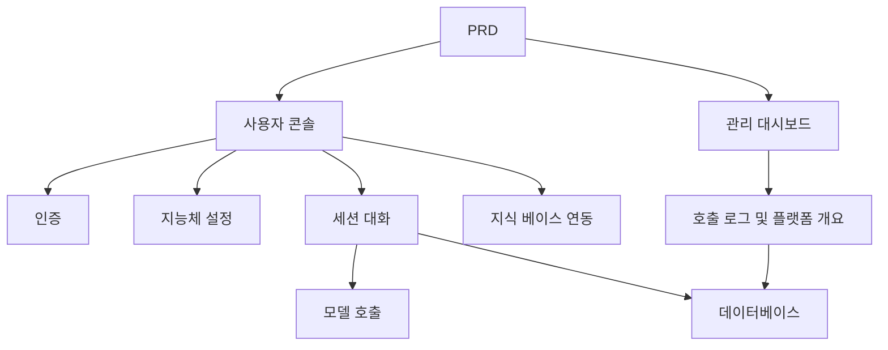

# Dify 유사 지능체 플랫폼 개발 실전

## 개요

이 실전 프로젝트에서는 실제 PRD를 바탕으로 Dify의 핵심 경험을 모방한 지능체 플랫폼을 처음부터 완성하게 됩니다. 사용자 콘솔, 관리 대시보드, 플랫폼 백엔드를 구축하고, 지능체 관리, 대화, 로깅, 지식 베이스 등의 핵심 기능을 구현하게 됩니다.

이 프로젝트는 Stage 2의 종합 실전环节입니다. 앞선 단일 페이지 또는 단일 기능 프로젝트와 달리, "플랫폼 감"이 있는 AI 제품을 구축해야 합니다. 다중 역할, 다중 모듈, 데이터 영속화, 모델 호출 체인이 포함됩니다.

## 사전 지식

이 프로젝트를 시작하기 전에 다음 내용을 이미 숙지하고 있어야 합니다:

- 프론트엔드 페이지 디자인 및 컴포넌트 라이브러리 사용 ([UI 디자인](../../frontend/ui-design/), [모던 컴포넌트 라이브러리](../../frontend/modern-component-library/))
- 백엔드 API 설계 및 개발 ([API 코드 작성](../../backend/ai-interface-code/))
- 데이터베이스 기초와 Supabase ([데이터베이스부터 Supabase까지](../../backend/database-supabase/))
- Git 워크플로우 및 배포 ([Git과 GitHub](../../backend/git-workflow/), [웹 애플리케이션 배포](../../backend/zeabur-deployment/))

## 학습 목표

이 실전을 완료하면 다음을 할 수 있게 됩니다:

1. 실제 PRD를 읽고 이해하여 개발 작업 목록을 추출하기
2. 지능체 플랫폼의 페이지 아키텍처와 데이터 모델 설계하기
3. 지능체 생성, 대화, 로그 기록의 완전한 파이프라인 구현하기
4. AI 보조를 활용하여 플랫폼형 제품 개발을 완료하기
5. 엔드투엔드 연동 테스트를 완료하고 데모 가능한 AI 플랫폼 프로토타입을 전달하기

## 프로젝트 소개

구축할 제품은 Dify 유사 지능체 플랫폼으로, 두 개의 하위 시스템을 포함합니다:

| 하위 시스템 | 역할 |
|--------|------|
| **사용자 콘솔** | 지능체 생성, Prompt 설정, 대화 시작, 로그 확인, 지식 베이스 관리 |
| **관리 대시보드** | 사용자 데이터, 플랫폼 리소스 사용 현황, 호출 통계 확인 |

백엔드는 다음 핵심 역량을 지원해야 합니다: 지능체 관리, 세션 관리, 메시지 저장, 모델 호출, 호출 로그 기록, 지식 베이스 연동.

::: tip PRD 입구
이 프로젝트의 요구사항 문서는 GitHub에 있습니다: [PRD 보기](https://github.com/datawhalechina/easy-vibe/blob/main/docs/ko-kr/stage-2/assignments/custom-dify-agent-platform/PRD.md)
:::

<div style="margin: 32px 0;">
  <ClientOnly>
    <StepBar :active="0" :items="[
      { title: '요구사항 분석', description: 'PRD를 읽고 페이지, 역량 범위, 인증, 데이터 모델을 명확히 합니다' },
      { title: '골격 구축', description: 'AI로 사용자 콘솔과 관리 대시보드 골격을 생성합니다' },
      { title: '반복 개발', description: '모듈별로 지능체, 대화, 로그, 지식 베이스를 추가합니다' },
      { title: '연동 및 배포', description: '엔드투엔드로 실행하고, 배포하여 데모를 준비합니다' }
    ]" />
  </ClientOnly>
</div>

## 제1부: 요구사항 분석

### 1.1 PRD 읽기

PRD 문서를 열고 다음 질문에 중점적으로 답해보세요:

- 지능체, 세션, 로그, 지식 베이스 중 MVP에 포함할 것은 무엇인가?
- 페이지와 라우팅 목록이 확정되었는가?
- 모델 호출과 로그 기록의 범위는 무엇인가?
- 멀티 테넌시와 복잡한 워크플로우는 일단 제외하는가?

::: warning
위 질문들에 명확한 답이 없다면, 코드 작성을 시작하지 마세요. 요구사항 이해가 불충분한 것은 재작업의 가장 흔한 원인입니다.
:::

### 1.2 시스템 아키텍처 확인

PRD에 따라 시스템의 전체 아키텍처를 정리하세요:



## 제2부: 프로젝트 골격 구축

### 2.1 프론트엔드 페이지 생성

프롬프트 참고:

```text
현재 PRD를 바탕으로 Dify 유사 지능체 플랫폼의 프론트엔드 골격을 생성해 주세요.

요구사항:
1. 사용자 측 구성: 로그인, 지능체 목록, 지능체 설정, 대화 페이지, 로그 페이지, 지식 베이스 페이지
2. 관리 측 구성: 관리 홈페이지, 사용자 개요, 리소스 사용 개요
3. 먼저 페이지 구조와 가짜 데이터만 생성하고, 실제 API는 연결하지 않습니다
4. 모던 AI 플랫폼 같은 스타일
```

### 2.2 페이지 구조 확인

항목별 확인:

- [ ] 사용자 콘솔과 관리 대시보드 진입점이 분리되어 있는가
- [ ] 지능체 목록, 설정, 대화, 로그, 지식 베이스 페이지가 완전한가
- [ ] 관리 대시보드 홈페이지, 사용자 개요 페이지에 접근 가능한가
- [ ] 가짜 데이터가 기본 UI 상태를 표시하는가

## 제3부: 반복 개발

### 3.1 모듈별 진행

골격을 기반으로 다음 순서대로 모듈별로 기능을 추가합니다:

1. **인증**: 회원가입, 로그인, 역할 구분
2. **지능체 관리**: 생성, 편집, 삭제, Prompt 설정
3. **대화 기능**: 세션 생성, 메시지 송수신, 모델 호출
4. **로그 기록**: 소요 시간, token 사용량, 오류 기록
5. **지식 베이스 연동** (보너스): 문서 업로드, 검색, 결과 주입
6. **관리 대시보드**: 사용자 데이터, 리소스 사용, 호출 통계

각 모듈 완료 후 다음 표로 자체 점검:

| 점검 항목 | 검증 방법 |
|--------|----------|
| 페이지 일관성 | 페이지 수, 기능이 PRD에 부합하는가 |
| API 루프 | agents, chat, logs, knowledge API가 완전한가 |
| 권한 격리 | 사용자가 자신의 agent와 세션만 관리할 수 있는가 |
| 데이터 일관성 | messages, logs, documents 데이터가 서로 일치하는가 |
| 데모 가능성 | "agent 생성 → 대화 → 로그 확인" 완전한 파이프라인을 데모할 수 있는가 |

### 3.2 지식 베이스 연동 (보너스)

지식 베이스 역량을 추가하고 싶다면, 각 지능체에 "지식 베이스 스위치"를 추가할 수 있습니다:

- 활성화하면 먼저 지식 조각을 검색한 다음, 사용자 질문과 함께 모델에 전송합니다
- 비활성화하면 일반 대화 모드로 응답합니다

첫 번째 버전에서는 복잡한 RAG를 추구할 필요가 없으며, "검색 결과가 보이고, 호출 파이프라인이 설명 가능하면" 충분합니다.

## 제4부: 연동 및 배포

### 4.1 엔드투엔드 테스트

최소한 다음 시나리오를 검증하세요:

- 회원가입 → 지능체 생성 → Prompt 설정 → 대화 시작 → 로그 확인
- 관리자 로그인 → 사용자 데이터 확인 → 호출 통계 확인

배포 전 점검:

- [ ] 모든 핵심 API에 로그인 검증이 적용되었는가
- [ ] 지능체 소유권 권한 검증을 통과했는가
- [ ] 세션 기록, 로그 기록이 실제로 데이터베이스에 저장되는가
- [ ] 모델 Key가 환경 변수를 사용하고, 하드코딩되지 않았는가
- [ ] 오류 메시지가 프론트엔드에서 확인 가능하고, 콘솔에만 출력되지 않는가

### 4.2 배포

프로젝트를 공개 네트워크 환경에 배포합니다. 배포 튜토리얼 참고: [Git 및 GitHub 워크플로우](../../backend/git-workflow/), [웹 애플리케이션 배포 방법](../../backend/zeabur-deployment/).

## 산출물

이 프로젝트를 완료한 후 다음을 제출해야 합니다:

- [ ] 접근 가능한 온라인 데모 링크
- [ ] 소스 코드 저장소 링크 (README 포함)
- [ ] PRD 문서
- [ ] 핵심 페이지 스크린샷 (지능체 관리 페이지, 대화 페이지, 로그 페이지, 관리 홈페이지)
- [ ] 60초 데모 영상 (지능체 생성 → 대화 → 로그 확인 포함)

README에는 최소한 다음이 포함되어야 합니다: 프로젝트 소개, 아키텍처 설명, 기술 스택, 로컬 실행 단계, 환경 변수 목록, API 설명.

## 평가 기준

| 영역 | 기본 요구사항 | 심화 요구사항 |
|------|---------|---------|
| 플랫폼 완성도 | agents / chat / logs 세 페이지 사용 가능 | 명확한 탐색과 통일된 디자인 언어가 있음 |
| 비즈니스 루프 | 지능체를 생성하고 실제 대화가 가능함 | 다중 지능체 전환과 과거 세션 지원 |
| 데이터 및 추적 | 메시지와 호출 로그를 조회할 수 있음 | token / 소요 시간 통계 대시보드가 있음 |
| 권한 보안 | 로그인한 사용자만 핵심 API에 접근 가능 | 리소스 소유권 검증이 완비됨 |
| 엔지니어링 전달 | 배포 가능, 데모 가능, README가 명확함 | 지식 베이스 연동 및 검색 결과 설명 가능 |

## 제출 전 점검

<el-card shadow="hover" style="margin: 20px 0; border-radius: 12px;">
  <template #header>
    <div style="font-weight: bold; font-size: 16px;">제출 전 마지막 확인</div>
  </template>

  <ul style="list-style-type: none; padding-left: 0;">
    <li><label><input type="checkbox" disabled /> 로그인 후 지능체 관리, 대화, 로그 페이지에 접근 가능</label></li>
    <li><label><input type="checkbox" disabled /> 최소 1개의 지능체를 생성하고 성공적으로 대화 가능</label></li>
    <li><label><input type="checkbox" disabled /> 각 질문/답변이 데이터베이스에서 조회 가능</label></li>
    <li><label><input type="checkbox" disabled /> 호출 실패 시 프론트엔드에서 오류 정보를 확인할 수 있고 로그가 기록됨</label></li>
    <li><label><input type="checkbox" disabled /> 프로젝트가 배포되었고, README와 데모 영상이 완비됨</label></li>
  </ul>
</el-card>

## 참고 자료

- [UI 디자인](../../frontend/ui-design/)
- [모던 컴포넌트 라이브러리로 인터페이스 업데이트하기](../../frontend/modern-component-library/)
- [데이터베이스부터 Supabase까지](../../backend/database-supabase/)
- [대형 언어 모델로 API 코드 및 문서 작성하기](../../backend/ai-interface-code/)
- [Git 및 GitHub 워크플로우](../../backend/git-workflow/)
- [웹 애플리케이션 배포 방법](../../backend/zeabur-deployment/)
