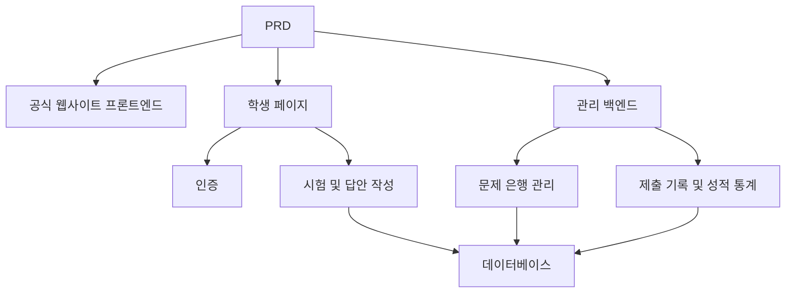

# 온라인 시험 및 관리 시스템 개발 실전

## 개요

본 실전 프로젝트는 실제 PRD를 바탕으로, 온라인 시험 및 관리 시스템을 처음부터 완성하는 것을 요구합니다. 이 프로젝트의 특별한 점은 여러 역할(학생과 관리자)이 포함되어 있으며, 각 역할이 보는 페이지와 수행할 수 있는 조작이 다르다는 것입니다. Express를 사용하여 백엔드를 구축하고, 완전한 시험 비즈니스 체인을 구현합니다.

이것은 Stage 2의 종합 실전环节입니다. 다중 역할 권한 시스템은 실제 업무에서 매우 흔하며, 이 패턴을 마스터하면 교육, SaaS, 백엔드 관리 등 다양한 비즈니스 시나리오에 대응할 수 있습니다.

## 사전 지식

본 프로젝트를 시작하기 전에 다음 내용을 이미 숙지해야 합니다:

- 프론트엔드 페이지 디자인 및 컴포넌트 라이브러리 사용 ([UI 디자인](../../frontend/ui-design/), [현대적 컴포넌트 라이브러리](../../frontend/modern-component-library/))
- 백엔드 인터페이스 설계 및 개발 ([인터페이스 코드 작성](../../backend/ai-interface-code/))
- 데이터베이스 기초와 Supabase ([데이터베이스에서 Supabase까지](../../backend/database-supabase/))
- Git 워크플로우와 배포 ([Git과 GitHub](../../backend/git-workflow/), [웹 애플리케이션 배포](../../backend/zeabur-deployment/))

## 학습 목표

본 실전을 완료하면 다음이 가능합니다:

1. 실제 PRD를 읽고 이해하여, 개발 과제 목록을 추출
2. 다중 역할 시스템의 권한 제어와 페이지 라우팅 설계
3. Express를 사용하여 완전한 백엔드 API 구현
4. 시험, 제출, 자동 채점의 비즈니스 체인 구현
5. 엔드투엔드 통합 디버깅을 완료하고, 시연 가능한 비즈니스 시스템 프로토타입 납품

## 프로젝트 소개

구축할 제품은 온라인 시험 및 관리 시스템으로, 세 가지 하위 시스템을 포함합니다:

| 하위 시스템 | 담당 |
|--------|------|
| **공식 웹사이트 프론트엔드** | 플랫폼 소개, 로그인 입구 |
| **학생 페이지** | 시험 목록, 답안 작성, 제출, 성적 조회 |
| **관리 백엔드** | 문제 은행 관리, 시험 관리, 제출 기록, 성적 통계 |

백엔드는 Express를 사용하며, 로그인 인증, 역할 권한, 시험 및 문제 은행 관리, 제출 프로세스와 자동 채점, 성적 및 통계 관리를 지원해야 합니다.

::: tip PRD 입구
본 프로젝트의 요구사항 문서는 GitHub에 있습니다: [PRD 보기](https://github.com/datawhalechina/easy-vibe/blob/main/docs/zh-cn/stage-2/assignments/exam-management-express/PRD.md)
:::

<div style="margin: 32px 0;">
  <ClientOnly>
    <StepBar :active="0" :items="[
      { title: '요구사항 분석', description: 'PRD를 읽고 역할, 페이지, 시험 체인 및 데이터 모델을 명확히 합니다' },
      { title: '골격 구축', description: 'AI로 학생 페이지와 관리 페이지 골격을 생성합니다' },
      { title: '백엔드 개발', description: 'Express로 로그인, 시험, 제출, 채점을 연결합니다' },
      { title: '통합 디버깅 및 출시', description: '엔드투엔드로 실행하고, 배포하여 데모를 준비합니다' }
    ]" />
  </ClientOnly>
</div>

## 제1부: 요구사항 분석

### 1.1 PRD 읽기

PRD 문서를 열고 다음 질문에 중점적으로 답하세요:

- 시스템에 몇 개의 역할이 있나요? 각각 무엇을 할 수 있나요?
- 페이지 목록이 완전한가요? 학생 페이지와 관리 페이지에 각각 어떤 페이지가 있나요?
- 어떤 문제 유형을 지원하나요? 각 문제 유형의 채점 로직은 무엇인가요?
- 시험의 완전한 프로세스는 무엇인가요? (발행 -> 시작 -> 답안 작성 -> 제출 -> 채점 -> 성적 조회)

::: warning
위 질문에 명확한 답이 없다면, 코드 작성을 시작하지 마세요. 요구사항 이해가 불명확한 것은 재작업의 가장 흔한 원인입니다.
:::

### 1.2 시스템 아키텍처 확인

PRD를 바탕으로 시스템의 전체 아키텍처를 정리합니다:



## 제2부: 프로젝트 골격 구축

### 2.1 프론트엔드 페이지 생성

프롬프트 참고:

```text
현재 PRD를 기반으로 온라인 시험 및 관리 시스템의 프론트엔드 골격을 생성해 줘.

기술 스택 요구사항:
- Next.js App Router
- TypeScript
- Tailwind CSS
- shadcn/ui

페이지 목록:
1. 홈페이지 /
2. 로그인 페이지 /login
3. 학생 시험 목록 페이지 /student/exams
4. 학생 답안 작성 페이지 /student/exams/[id]
5. 학생 성적 페이지 /student/history
6. 관리 백엔드 홈페이지 /admin
7. 시험 관리 페이지 /admin/exams
8. 문제 은행 관리 페이지 /admin/questions
9. 제출 기록 페이지 /admin/submissions

요구사항:
- 학생 페이지는 명확하고, 집중하기 쉬우며, 답안 작성이 편리해야 함
- 관리 페이지는 사이드바 + 상단바 레이아웃 사용
- 먼저 mock 데이터를 사용하고, 실제 인터페이스는 연결하지 마
- 데스크톱과 모바일의 기본 사용 가능성에 주의
```

### 2.2 학생 답안 작성 페이지 완성

답안 작성 페이지는 학생 페이지의 핵심 페이지이며, 중점적으로 완성합니다:

```text
학생 답안 작성 페이지를 계속 완성해 줘.

이것은 온라인 시험 시스템의 답안 작성 페이지로, 다음을 포함해야 함:
- 상단에 시험 제목, 카운트다운, 답안 작성 완료 문항 수 표시
- 중간에 문제 내용과 선택지 표시
- 단답형, 참/거짓, 서술형 세 가지 문제 유형 지원
- 왼쪽이나 상단에 답안 카드가 있어, 각 문제의 답안 작성 여부 표시
- 제출 전 확인 팝업 표시

먼저 mock 데이터로 상호작용을 구현하고, 실제 인터페이스는 연결하지 마.

요구사항:
- 인터페이스는 간결하게, 백엔드 테이블 페이지처럼 보이지 않게
- 카운트다운은 눈에 띄지만, 너무 큰 압박감을 주지 않게
- 빈 상태와 loading 상태 포함
```

### 2.3 관리자 백엔드 완성

관리자 백엔드 첫 번째 버전은 세 가지 핵심 영역에 집중합니다:

- **시험 관리**: 시험 생성, 시간 설정, 발행 상태
- **문제 은행 관리**: 문제 추가, 문제 편집, 문제 유형별 필터링
- **제출 기록**: 학생 제출, 점수, 시간 확인

### 2.4 페이지 구조 검증

항목별로 확인:

- [ ] 학생 페이지와 관리 페이지의 진입점이 분리되어 있는지
- [ ] 로그인 페이지, 시험 목록, 답안 작성 페이지, 성적 페이지가 완전한지
- [ ] 관리 페이지의 문제 은행, 시험 관리, 제출 기록 페이지에 접근 가능한지
- [ ] 학생 페이지와 관리 페이지의 스타일이 명확하게 구분되는지

### 막혔나요?

프론트엔드 구축 단계에서 막혔다면, 다음 장을 복습하세요:

- [데이터베이스에서 Supabase까지](../../backend/database-supabase/)
- [애플리케이션 백엔드 인터페이스 설계 및 개발](../../backend/ai-interface-code/)
- [현대적 컴포넌트 라이브러리로 인터페이스 업데이트하기](../../frontend/modern-component-library/)

## 제3부: 백엔드 개발

### 3.1 로그인 및 권한 제어

```text
나를 완전 초보자로 생각하고, 온라인 시험 시스템의 로그인과 권한 제어를 완료해 줘.

백엔드는 Express를 사용.

목표:
1. 학생과 관리자 모두 로그인 가능
2. 로그인 후 사용자 역할 반환
3. 학생은 /student/* 관련 인터페이스에만 접근 가능
4. 관리자는 /admin/* 관련 인터페이스에만 접근 가능
5. 미로그인 사용자가 보호된 페이지에 접근하면 /login으로 이동

구현 요구사항:
- 명확한 디렉토리 구조 제안
- 미들웨어가 담당하는 역할을 명확히 설명
- 환경 변수가 필요한 부분은 하드코딩하지 마
- 완료 후 권한이 정상 작동하는지 확인하는 방법 설명
```

### 3.2 시험 및 문제 은행 관리 인터페이스

다음 모듈별로 구현하는 것을 권장합니다:

| 모듈 | 추천 인터페이스 |
|------|----------|
| 시험 관리 | `GET /api/exams`, `POST /api/admin/exams`, `PATCH /api/admin/exams/:id` |
| 문제 은행 관리 | `GET /api/admin/questions`, `POST /api/admin/questions` |
| 시험 시작 | `POST /api/submissions/start` |
| 시험지 제출 | `POST /api/submissions/:id/submit` |
| 성적 기록 | `GET /api/student/history`, `GET /api/admin/submissions` |

프롬프트 참고:

```text
온라인 시험 시스템의 Express API를 설계하고 구현해 줘.

기능 범위:
- 관리자가 시험 생성
- 관리자가 문제 은행 유지 관리
- 학생이 발행된 시험 확인
- 학생이 시험을 시작하고 submission 생성
- 학생이 답안을 제출하면 객관식과 참/거짓 문제 자동 채점
- 서술형은 먼저 검토 대기로 표시
- 학생이 자신의 성적 기록 확인
- 관리자가 모든 제출 기록 확인

요구사항:
- 인터페이스 명명이 명확해야 함
- 통일된 JSON 구조 반환
- 코드에서 controller, service, middleware, db 계층 구분
- 각 인터페이스를 테스트하는 방법 설명
```

### 3.3 채점 로직

채점 로직은 시험 시스템의 핵심 비즈니스 규칙입니다:

- **객관식**: 사용자 답안이 정답과 일치하면 득점
- **참/거짓**: 마찬가지로 자동 채점 가능
- **서술형**: 첫 번째 버전에서는 답안만 저장하고, 점수는 비워두며, 상태를 `reviewed = false`로 설정

::: tip 보너스 항목
AI 기능을 추가하고 싶다면, 관리자가 백엔드에서 "주제 + 난이도"를 입력하면 모델이 먼저 후보 문제를 생성하고, 이를 수동으로 검토하여 문제 은행에 추가할 수 있습니다. 하지만 이것은 보너스 항목이며 필수는 아닙니다.
:::

## 제4부: 통합 디버깅 및 출시

### 4.1 엔드투엔드 테스트

최소한 다음 시나리오를 확인하세요:

- 학생 로그인 -> 시험 목록 확인 -> 답안 작성 시작 -> 제출 -> 성적 확인
- 관리자 로그인 -> 시험 생성 -> 문제 추가 -> 발행 -> 제출 기록 확인

### 4.2 배포

- 프론트엔드는 Vercel / Zeabur에 배포
- Express API는 Zeabur / Railway / Render에 배포
- 데이터베이스는 Supabase Postgres 또는 호스팅 PostgreSQL 사용

배포 전 확인:

- [ ] 환경 변수가 완전한지
- [ ] 프론트엔드와 백엔드 API 주소가 올바른지
- [ ] 프로덕션 환경에서 로그인 상태가 정상인지
- [ ] 관리자 계정으로 백엔드에 실제로 접근 가능한지
- [ ] README에 시작, 배포, 테스트 설명이 포함되어 있는지

## 산출물

본 프로젝트를 완료한 후, 다음 내용을 제출해야 합니다:

- [ ] 접근 가능한 온라인 데모 링크
- [ ] 소스 코드 저장소 링크 (README 포함)
- [ ] PRD 문서
- [ ] 핵심 페이지 스크린샷 (홈페이지, 학생 시험 목록, 답안 작성 페이지, 관리 백엔드)
- [ ] 60초 데모 영상 (학생 답안 작성 프로세스와 관리자 관리 프로세스 포함)

README에는 최소한 다음이 포함되어야 합니다: 프로젝트 소개, 핵심 페이지 설명, 기술 스택, 로컬 시작 단계, 환경 변수 목록.

## 평가 기준

| 차원 | 기본 요구사항 | 심화 요구사항 |
|------|---------|---------|
| 페이지 완성도 | 학생 페이지와 관리 페이지의 주요 페이지 모두 접근 가능 | 페이지 스타일이 통일되고, 모바일에서 기본적으로 사용 가능 |
| 비즈니스 폐루프 | 학생이 로그인, 시험 참여, 제출, 성적 조회 가능 | 관리자가 시험을 완전히 생성하고 발행 가능 |
| 데이터 정확성 | 답안 제출 후 데이터베이스에 기록되고, 객관식 문제가 자동 채점됨 | 서술형 문제에서 수동 검토 또는 AI 보조 지원 |
| 권한 제어 | 학생과 관리자의 접근 경계가 명확함 | 서버 측 인터페이스에도 역할 검증이 있음 |
| 엔지니어링 납품 | 프로젝트가 실행 가능하고, 배포 가능하며, README가 명확함 | 데모 영상과 테스트 설명이 있음 |

## 제출 전 확인

<el-card shadow="hover" style="margin: 20px 0; border-radius: 12px;">
  <template #header>
    <div style="font-weight: bold; font-size: 16px;">제출 전 마지막으로 확인</div>
  </template>

  <ul style="list-style-type: none; padding-left: 0;">
    <li><label><input type="checkbox" disabled /> 홈페이지, 로그인 페이지, 학생 페이지, 관리 페이지 모두 완성</label></li>
    <li><label><input type="checkbox" disabled /> 학생이 정상적으로 시험을 시작하고 답안을 제출할 수 있음</label></li>
    <li><label><input type="checkbox" disabled /> 관리자가 시험을 생성하고 제출 기록을 확인할 수 있음</label></li>
    <li><label><input type="checkbox" disabled /> 객관식 문제 점수가 자동으로 계산되어 데이터베이스에 기록됨</label></li>
    <li><label><input type="checkbox" disabled /> 학생과 관리자 권한 경계가 검증됨</label></li>
    <li><label><input type="checkbox" disabled /> 프로젝트가 배포되었거나 완전한 로컬 실행 설명이 있음</label></li>
  </ul>
</el-card>

## 참고 자료

- [UI 디자인](../../frontend/ui-design/)
- [현대적 컴포넌트 라이브러리로 인터페이스 업데이트하기](../../frontend/modern-component-library/)
- [데이터베이스에서 Supabase까지](../../backend/database-supabase/)
- [대형 언어 모델 활용 인터페이스 코드 및 문서 작성](../../backend/ai-interface-code/)
- [Git과 GitHub 워크플로우](../../backend/git-workflow/)
- [웹 애플리케이션 배포 방법](../../backend/zeabur-deployment/)
