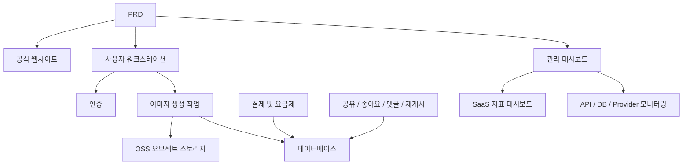

# 모던 AI 이미지 생성 SaaS 개발 실전

## 개요

이 실전 프로젝트에서는 실제 PRD(제품 요구사항 문서)를 바탕으로 Midjourney 경험을 참고한 AI 이미지 생성 SaaS 제품을 처음부터 완성하게 됩니다. 요구사항 분석, 프로젝트 분해, 반복 개발, 연동 및 배포의 전 과정을 경험하게 됩니다.

이 프로젝트는 Stage 2의 종합 실전环节입니다. 앞선 장들에서 프론트엔드 페이지 디자인, 백엔드 API 개발, 데이터베이스 조작, 결제 연동 등의 개별 기술을 배웠습니다. 이 프로젝트에서는 그것들을 모두 연결하여 실행 가능한 제품 프로토타입을 전달해야 합니다.

## 사전 지식

이 프로젝트를 시작하기 전에 다음 내용을 이미 숙지하고 있어야 합니다:

- 프론트엔드 페이지 디자인 및 컴포넌트 라이브러리 사용 ([UI 디자인](../../frontend/ui-design/), [모던 컴포넌트 라이브러리](../../frontend/modern-component-library/))
- 백엔드 API 설계 및 개발 ([API 코드 작성](../../backend/ai-interface-code/))
- 데이터베이스 기초와 Supabase ([데이터베이스부터 Supabase까지](../../backend/database-supabase/))
- 결제 연동 ([Stripe 결제 시스템](../../backend/stripe-payment/))
- Git 워크플로우 및 배포 ([Git과 GitHub](../../backend/git-workflow/), [웹 애플리케이션 배포](../../backend/zeabur-deployment/))

## 학습 목표

이 실전을 완료하면 다음을 할 수 있게 됩니다:

1. 실제 PRD를 읽고 이해하여 개발 작업 목록을 추출하기
2. PRD를 기반으로 모듈을 분할하고 단계별 진행 계획을 수립하기
3. AI 보조를 활용하여 프론트엔드 골격 구축과 백엔드 API 개발을 완료하기
4. 각 모듈에 대해 검증과 반복 최적화 수행하기
5. 엔드투엔드 연동 테스트를 완료하고 프로젝트를 "실행 가능"에서 "전달 가능"으로 발전시키기

## 프로젝트 소개

구축할 제품은 세 개의 하위 시스템을 포함하는 모던 AI 이미지 생성 SaaS 플랫폼입니다:

| 하위 시스템 | 역할 |
|--------|------|
| **공식 웹사이트** | 제품 소개, 가격 정책, FAQ, 가입 전환 |
| **사용자 워크스테이션** | Prompt 입력, 이미지 생성, 갤러리, 크레딧, 요금제, 커뮤니티 상호작용 |
| **관리 대시보드** | 사용자 관리, 작업 관리, 결제 관리, 콘텐츠 심사, SaaS 지표, 시스템 모니터링 |

백엔드는 다음 핵심 역량을 지원해야 합니다: 사용자 인증, 이미지 생성 작업, OSS 오브젝트 스토리지, 크레딧과 요금제 결제, 이미지 소셜 상호작용, 운영 데이터 모니터링.

::: tip PRD 입구
이 프로젝트의 요구사항 문서는 GitHub에 있습니다: [PRD 보기](https://github.com/datawhalechina/easy-vibe/blob/main/docs/ko-kr/stage-2/assignments/modern-landing-page/PRD.md)
:::

<div style="margin: 32px 0;">
  <ClientOnly>
    <StepBar :active="0" :items="[
      { title: '요구사항 분석', description: 'PRD를 읽고 페이지, 모듈, 데이터 모델, 범위를 추출합니다' },
      { title: '골격 구축', description: 'AI로 세 개의 프론트엔드 골격(www / app / admin)을 생성합니다' },
      { title: '반복 개발', description: '모듈별로 API, 권한, 결제, 모니터링을 추가합니다' },
      { title: '연동 및 배포', description: '엔드투엔드로 실행하고, 배포하여 데모를 준비합니다' }
    ]" />
  </ClientOnly>
</div>

## 제1부: 요구사항 분석

### 1.1 PRD 읽기

PRD 문서를 열고 다음 질문에 중점적으로 답해보세요:

- 시스템에 몇 개의 진입점이 있는가? 각각 어떤 페이지를 포함하는가?
- 각 페이지의 핵심 기능은 무엇인가?
- 백엔드에 어떤 모듈과 데이터베이스 테이블이 포함되는가?
- MVP 범위는 무엇인가? 첫 번째 버전에서 무엇을 하고 무엇을 하지 않는가?

::: warning
위 질문들에 명확한 답이 없다면, 코드 작성을 시작하지 마세요. 요구사항 이해가 불충분한 것은 재작업의 가장 흔한 원인입니다.
:::

### 1.2 시스템 아키텍처 확인

PRD의 설명에 따라 시스템의 전체 아키텍처를 정리하세요:



자신만의 말로 아키텍처 다이어그램을 다시 그려보고, 시스템에 대한 이해가 완전한지 확인하세요.

## 제2부: 프로젝트 골격 구축

### 2.1 프론트엔드 페이지 생성

AI를 사용하여 먼저 모든 페이지의 기본 구조와 가짜 데이터를 생성합니다. 이 단계의 목표는 정보 아키텍처와 라우팅을 구축하는 것이며, 실제 API를 연결할 필요는 없습니다.

프롬프트 참고:

```text
현재 PRD를 바탕으로 모던 AI 이미지 생성 SaaS의 프론트엔드 골격을 생성해 주세요.

요구사항:
1. 세 개의 진입점으로 분할: www, app, admin
2. 공식 웹사이트 구성: 홈페이지, 가격 정책, FAQ
3. app 구성: 로그인, 회원가입, 생성 워크스테이션, 갤러리, 요금제, 크레딧, 커뮤니티, 작품 상세, 개인 센터
4. admin 구성: 관리 홈페이지, 사용자 관리, 작업 관리, 콘텐츠 관리, 요금제 관리, 결제 주문, 운영 설정, SaaS 지표, 시스템 모니터링
5. 먼저 페이지 구조와 가짜 데이터만 생성하고, 실제 API는 연결하지 않습니다
6. Midjourney를 참고한 깔끔하고 모던한 제품 느낌의 스타일
```

### 2.2 페이지 구조 확인

골격 생성 후 항목별 확인:

- [ ] 세 진입점의 라우팅이 독립적인가 (`/`, `/app`, `/admin`)
- [ ] 페이지 수가 PRD와 일치하는가
- [ ] 각 페이지가 정상적으로 접근 및 탐색이 가능한가
- [ ] 가짜 데이터가 기본 UI 상태(목록, 빈 상태, 양식 등)를 표시하는가

## 제3부: 반복 개발

### 3.1 모듈별 진행

골격을 기반으로 다음 순서대로 모듈별로 기능을 추가합니다:

1. **인증**: 회원가입, 로그인, 역할 구분
2. **데이터베이스**: 데이터 테이블 생성, 읽기/쓰기 API
3. **핵심 비즈니스**: 이미지 생성 작업, 결과 저장
4. **OSS 스토리지**: 이미지 업로드 및 접근
5. **결제**: 요금제, 크레딧, Stripe 연동
6. **소셜 상호작용**: 공유, 좋아요, 댓글
7. **관리 대시보드**: 사용자 관리, 작업 관리, 콘텐츠 심사
8. **데이터 모니터링**: SaaS 지표 대시보드, 시스템 모니터링

각 모듈 완료 후 다음 표로 자체 점검:

| 점검 항목 | 검증 방법 |
|--------|----------|
| 페이지 일관성 | 페이지 수, 진입점, 기능이 PRD에 부합하는가 |
| API 정확성 | 요청 파라미터, 응답 구조, 상태 처리가 합리적인가 |
| 권한 격리 | 일반 사용자와 관리자가 서로 격리되어 있는가 |
| 데이터 일관성 | 데이터베이스, OSS, 결제, 크레딧이 서로 일치하는가 |
| 데모 가능성 | 다른 사람에게 완전한 비즈니스 파이프라인을 데모할 수 있는가 |

::: tip
AI가 생성한 내용이 PRD에서 벗어난 것을 발견하면, 전체 페이지를 뒤엎고 다시 시작하지 말고 특정 모듈만 수정하게 하세요.
:::

### 3.2 역할과 분담

반복 과정에서 세 가지 역할을 동시에 수행해야 합니다:

- **제품 매니저**: 각 모듈의 기능이 PRD에 부합하는지 확인
- **기술 리더**: 구현 방안이 합리적인지 확인
- **테스트 엔지니어**: 기능이 정상적으로 실행되는지 확인

## 제4부: 연동 및 배포

### 4.1 엔드투엔드 테스트

마지막 단계의 중점은 새 페이지를 추가하는 것이 아니라, 완전한 비즈니스 파이프라인을 실행하는 것입니다. 최소한 다음 시나리오를 검증하세요:

- 회원가입 → 크레딧 구매 → 이미지 생성 → 기록 확인 → 공유 상호작용
- 관리자 로그인 → 사용자 데이터 확인 → 작업 통계 확인 → 시스템 모니터링 확인

### 4.2 배포

프로젝트를 공개 네트워크 환경에 배포하고 다음을 확인하세요:

- 환경 변수 구성이 완전한가
- 로그인 콜백 주소가 올바른가
- 결제 콜백 주소가 올바른가
- 페이지에 누락된 로딩, 빈 상태, 오류 메시지가 없는가

배포 튜토리얼 참고: [Git 및 GitHub 워크플로우](../../backend/git-workflow/), [웹 애플리케이션 배포 방법](../../backend/zeabur-deployment/).

## 산출물

이 프로젝트를 완료한 후 다음을 제출해야 합니다:

- [ ] 접근 가능한 온라인 데모 링크
- [ ] 소스 코드 저장소 링크 (README 포함)
- [ ] PRD 문서
- [ ] 핵심 페이지 스크린샷 (공식 웹사이트 홈페이지, 이미지 생성 워크스테이션, 갤러리, 요금제 페이지, 관리 홈페이지)
- [ ] 60초 데모 영상 (회원가입 → 생성 → 확인 → 관리 대시보드 포함)

README에는 최소한 다음이 포함되어야 합니다: 프로젝트 소개, 핵심 페이지 설명, 기술 스택, 로컬 실행 단계, 환경 변수 목록.

## 평가 기준

| 영역 | 기본 요구사항 | 심화 요구사항 |
|------|---------|---------|
| PRD 정합성 | 페이지, 기능, 데이터 구조가 기본적으로 PRD에 부합 | 각 설계 결정과 PRD의 대응 관계를 명확히 설명할 수 있음 |
| 제품 루프 | 회원가입 → 크레딧 구매 → 이미지 생성 → 기록 확인 → 공유 상호작용이 실행 가능 | 결제 상태, 크레딧 잔액, 생성 횟수 데이터가 일치함 |
| 관리 기능 | 사용자, 작업, 결제, 콘텐츠 관리를 확인할 수 있음 | SaaS 지표 대시보드와 시스템 모니터링 페이지가 완전히 사용 가능함 |
| 엔지니어링 완성도 | 프론트엔드, 백엔드, 데이터베이스, OSS, 결제 체인이 연결됨 | 오류 처리, 빈 상태, 로딩 상태가 있음 |
| 전달 품질 | 배포 가능, 실행 가능 | README가 명확하고, 데모 영상 구조가 완전함 |

## 참고 자료

- [UI 디자인](../../frontend/ui-design/)
- [UI 디자인 가이드를 참고하여 페이지와 버튼 디자인하기](../../frontend/multi-product-ui/)
- [LLM과 Skills로 인터페이스를 아름답게 만들기](../../frontend/llm-skills-beautiful/)
- [디자인 프로토타입에서 프로젝트 코드까지](../../frontend/design-to-code/)
- [모던 컴포넌트 라이브러리로 인터페이스 업데이트하기](../../frontend/modern-component-library/)
- [데이터베이스부터 Supabase까지](../../backend/database-supabase/)
- [대형 언어 모델로 API 코드 및 문서 작성하기](../../backend/ai-interface-code/)
- [Git 및 GitHub 워크플로우](../../backend/git-workflow/)
- [웹 애플리케이션 배포 방법](../../backend/zeabur-deployment/)
- [Stripe 등 결제 시스템 연동 방법](../../backend/stripe-payment/)
