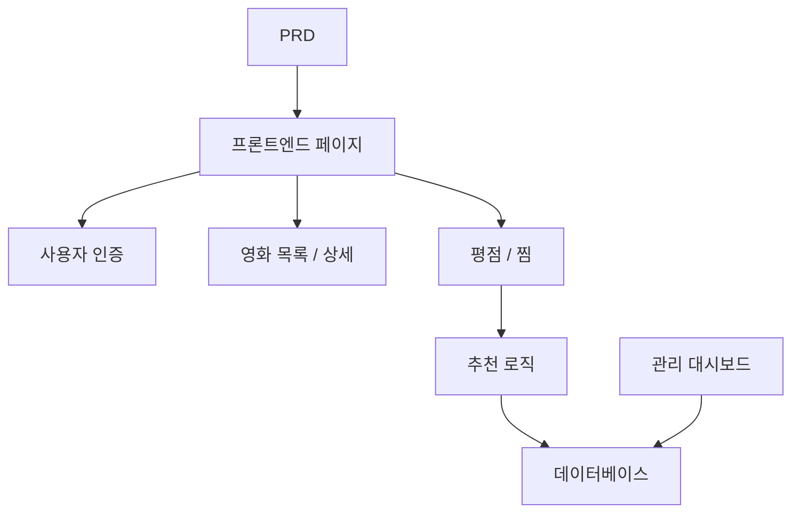

# Spring Boot 영화 추천 시스템 개발 실전

## 개요

이 실전 프로젝트에서는 실제 PRD를 바탕으로 Spring Boot를 사용하여 추천 기능이 있는 영화 웹사이트를 완성하게 됩니다. 이 프로젝트의 핵심 과제는 단순한 CRUD가 아니라, "사용자 행동이 추천 결과에 어떻게 영향을 미치는가"와 "추천을 어떻게 설명 가능하게 만들 것인가"를 고민하는 것입니다.

이 프로젝트는 Stage 2의 종합 실전环节입니다. "콘텐츠 + 행동 + 추천" 유형 제품의 개발 패턴을 처음으로 접하게 되며, 이러한 패턴은 전자상거래, 콘텐츠 플랫폼, 개인화 피드 등의 시나리오에서 매우 흔하게 사용됩니다.

## 사전 지식

이 프로젝트를 시작하기 전에 다음 내용을 이미 숙지하고 있어야 합니다:

- 프론트엔드 페이지 디자인 및 컴포넌트 라이브러리 사용 ([UI 디자인](../../frontend/ui-design/), [모던 컴포넌트 라이브러리](../../frontend/modern-component-library/))
- 백엔드 API 설계 및 개발 ([API 코드 작성](../../backend/ai-interface-code/))
- 데이터베이스 기초와 Supabase ([데이터베이스부터 Supabase까지](../../backend/database-supabase/))
- Git 워크플로우 및 배포 ([Git과 GitHub](../../backend/git-workflow/), [웹 애플리케이션 배포](../../backend/zeabur-deployment/))

## 학습 목표

이 실전을 완료하면 다음을 할 수 있게 됩니다:

1. PRD를 읽고 추천 시스템의 개발 작업 목록을 추출하기
2. Spring Boot로 백엔드 프로젝트를 구축하고 RESTful API를 구현하기
3. "사용자 행동 → 추천"의 완전한 데이터 파이프라인 설계하기
4. 설명 가능한 추천 로직 구현하기
5. 엔드투엔드 연동 테스트를 완료하고 데모 가능한 제품 프로토타입을 전달하기

## 프로젝트 소개

구축할 제품은 추천 기능이 있는 영화 웹사이트입니다:

| 기능 | 설명 |
|------|------|
| **탐색 및 검색** | 사용자가 영화를 탐색하고 검색할 수 있습니다 |
| **평점 및 찜** | 사용자가 영화에 평점을 매기고 찜할 수 있습니다 |
| **개인화 추천** | 시스템이 사용자 행동에 따라 추천 결과를 제공합니다 |
| **관리 대시보드** | 관리자가 영화 데이터를 유지보수하고 추천 효과를 확인합니다 |

::: tip PRD 입구
이 프로젝트의 요구사항 문서는 GitHub에 있습니다: [PRD 보기](https://github.com/datawhalechina/easy-vibe/blob/main/docs/ko-kr/stage-2/assignments/movie-recommendation-springboot/PRD.md)
:::

<div style="margin: 32px 0;">
  <ClientOnly>
    <StepBar :active="0" :items="[
      { title: '요구사항 분석', description: 'PRD를 읽고 추천 전략, 행동 데이터, 관리 범위를 명확히 합니다' },
      { title: '골격 구축', description: 'AI로 목록 페이지, 상세 페이지, 추천 페이지, 관리 페이지를 생성합니다' },
      { title: '반복 개발', description: '추천 로직, 행동 기록, 관리 기능을 추가합니다' },
      { title: '연동 및 배포', description: '엔드투엔드로 실행하고, 배포하여 데모를 준비합니다' }
    ]" />
  </ClientOnly>
</div>

## 제1부: 요구사항 분석

### 1.1 PRD 읽기

PRD 문서를 열고 다음 질문에 중점적으로 답해보세요:

- 추천 전략은 무엇인가? 첫 번째 버전에서 설명 가능한 버전(예: 평점 유사도 기반)을 사용하는가?
- 사용자 행동 데이터로 어떤 것들을 저장해야 하는가? (평점, 찜, 열람 기록 등)
- 관리자가 확인해야 할 추천 효과 지표는 무엇인가?
- 페이지 목록이 완전한가?

::: warning
위 질문들에 명확한 답이 없다면, 코드 작성을 시작하지 마세요. 요구사항 이해가 불충분한 것은 재작업의 가장 흔한 원인입니다.
:::

### 1.2 시스템 아키텍처 확인



## 제2부: 프로젝트 골격 구축

### 2.1 프론트엔드 페이지 생성

프롬프트 참고:

```text
현재 PRD를 바탕으로 Spring Boot 영화 추천 시스템의 프론트엔드 골격을 생성해 주세요.

요구사항:
1. 페이지 구성: 홈페이지, 영화 목록, 영화 상세, 추천 페이지, 개인 센터, 관리 대시보드
2. 먼저 페이지 구조와 가짜 데이터만 생성하고, 실제 API는 연결하지 않습니다
3. 수업 데모가 아닌 실제 콘텐츠 제품 같은 스타일
```

### 2.2 페이지 구조 확인

항목별 확인:

- [ ] 영화 목록 페이지에서 검색 및 필터링이 지원되는가
- [ ] 영화 상세 페이지에 평점 및 찜 버튼이 포함되어 있는가
- [ ] 추천 페이지에서 추천 결과와 추천 이유를 표시할 수 있는가
- [ ] 관리 대시보드에서 영화 데이터와 추천 효과를 표시할 수 있는가

## 제3부: 반복 개발

### 3.1 모듈별 진행

1. **Spring Boot 프로젝트 구축**: 프로젝트 구조, 데이터베이스 설정, 기본 CRUD
2. **영화 데이터 관리**: 영화 목록, 상세, 검색 API
3. **사용자 행동**: 평점, 찜 API, 행동 데이터 기록
4. **추천 로직**: 사용자 행동 기반 추천 알고리즘 구현
5. **추천 표시**: 추천 결과 표시, 추천 이유 포함
6. **관리 대시보드**: 영화 데이터 유지보수, 추천 효과 확인

### 3.2 모듈 자체 점검

| 점검 항목 | 검증 방법 |
|--------|----------|
| 기본 기능 | 목록, 상세, 평점, 찜의 루프가 완성되었는가 |
| 추천 연동 | 사용자 행동이 추천 결과에 영향을 미치는가 |
| 추천 설명 가능성 | 사용자가 이 영화들이 추천된 이유를 이해할 수 있는가 |
| 관리 데이터 | 관리자가 영화 데이터와 추천 효과를 확인할 수 있는가 |

## 제4부: 연동 및 배포

### 4.1 엔드투엔드 테스트

최소한 다음 시나리오를 검증하세요:

- 영화 탐색 → 평점 → 찜 → 추천 페이지 확인, 추천 결과가 변화했는지 확인
- 관리자 로그인 → 영화 추가 → 추천 효과 통계 확인

## 산출물

이 프로젝트를 완료한 후 다음을 제출해야 합니다:

- [ ] 접근 가능한 온라인 데모 링크
- [ ] 소스 코드 저장소 링크 (README 포함)
- [ ] PRD 문서
- [ ] 핵심 페이지 스크린샷 (영화 목록, 영화 상세, 추천 페이지, 관리 대시보드)
- [ ] 60초 데모 영상

## 평가 기준

| 영역 | 기본 요구사항 | 심화 요구사항 |
|------|---------|---------|
| PRD 정합성 | 페이지, 기능, 데이터 구조가 기본적으로 PRD에 부합 | 설계 결정을 명확히 설명할 수 있음 |
| 제품 루프 | 탐색 → 평점 → 찜 → 추천이 실행 가능 | 평점 행동이 추천 결과에 뚜렷하게 영향을 미침 |
| 추천 품질 | 추천 결과가 합리적이고 추천 이유가 설명 가능 | 다양한 추천 전략 지원 |
| 관리 기능 | 영화 데이터와 추천 효과를 확인할 수 있음 | 추천 정확도 등의 통계 지표가 있음 |
| 엔지니어링 완성도 | 프론트엔드, Spring Boot 백엔드, 데이터베이스 체인이 연결됨 | 추천 API에 캐시 또는 성능 최적화가 있음 |

## 참고 자료

- [UI 디자인](../../frontend/ui-design/)
- [모던 컴포넌트 라이브러리로 인터페이스 업데이트하기](../../frontend/modern-component-library/)
- [데이터베이스부터 Supabase까지](../../backend/database-supabase/)
- [대형 언어 모델로 API 코드 및 문서 작성하기](../../backend/ai-interface-code/)
- [Git 및 GitHub 워크플로우](../../backend/git-workflow/)
- [웹 애플리케이션 배포 방법](../../backend/zeabur-deployment/)
