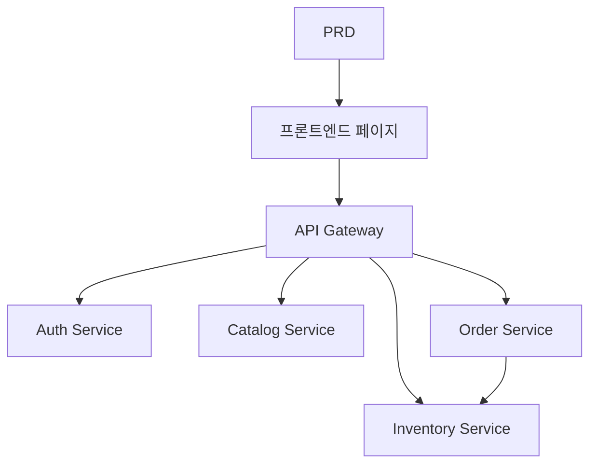

# 신선식품 전자상거래 마이크로서비스 시스템 개발 실전

## 개요

이 실전 프로젝트에서는 실제 PRD를 바탕으로 신선식품 전자상거래 마이크로서비스 시스템을 처음부터 완성하게 됩니다. 앞선 단일 서비스 프로젝트와 달리, 이 프로젝트의 백엔드는 비즈니스별로 여러 독립적인 서비스로 분할되며, API 게이트웨이를 통해 통일된 외부 인터페이스를 제공합니다. 서비스 경계를 설계하는 방법과, 서비스 간 데이터 일관성 문제를 처리하는 방법을 배우게 됩니다.

이 프로젝트는 Stage 2의 종합 실전环节입니다. 마이크로서비스 아키텍처는 실제 업무에서 매우 흔하게 사용됩니다. 서비스 분할과 게이트웨이 라우팅의 기본 사고방식을 익히면, 더 복잡한 백엔드 시스템 설계에 대응할 수 있게 됩니다.

## 사전 지식

이 프로젝트를 시작하기 전에 다음 내용을 이미 숙지하고 있어야 합니다:

- 프론트엔드 페이지 디자인 및 컴포넌트 라이브러리 사용 ([UI 디자인](../../frontend/ui-design/), [모던 컴포넌트 라이브러리](../../frontend/modern-component-library/))
- 백엔드 API 설계 및 개발 ([API 코드 작성](../../backend/ai-interface-code/))
- 데이터베이스 기초와 Supabase ([데이터베이스부터 Supabase까지](../../backend/database-supabase/))
- Git 워크플로우 및 배포 ([Git과 GitHub](../../backend/git-workflow/), [웹 애플리케이션 배포](../../backend/zeabur-deployment/))

## 학습 목표

이 실전을 완료하면 다음을 할 수 있게 됩니다:

1. PRD를 읽고 마이크로서비스 시스템의 개발 작업 목록을 추출하기
2. 비즈니스 도메인별로 서비스 경계를 분할하기 (인증, 상품, 재고, 주문)
3. API 게이트웨이 라우팅을 설계하고 구현하기
4. 재고 차감과 주문 일관성 등 서비스 간 문제를 처리하기
5. 엔드투엔드 연동 테스트를 완료하고 데모 가능한 마이크로서비스 프로토타입을 전달하기

## 프로젝트 소개

구축할 제품은 신선식품 전자상거래 마이크로서비스 시스템입니다:

| 하위 시스템 | 역할 |
|--------|------|
| **사용자 측** | 상품 탐색, 주문, 주문 확인 |
| **관리 측** | 상품 관리, 재고 관리, 주문 관리 |

백엔드는 비즈니스별로 다음과 같이 분할됩니다:

| 서비스 | 역할 |
|------|------|
| **API Gateway** | 통일된 진입점, 라우팅 전달, 인증 검증 |
| **Auth Service** | 사용자 회원가입, 로그인, JWT 발급 |
| **Catalog Service** | 상품 정보 관리 |
| **Inventory Service** | 재고 수량 관리 |
| **Order Service** | 주문 생성, 상태 관리 |

::: tip PRD 입구
이 프로젝트의 요구사항 문서는 GitHub에 있습니다: [PRD 보기](https://github.com/datawhalechina/easy-vibe/blob/main/docs/ko-kr/stage-2/assignments/simple-grocery-microservices/PRD.md)
:::

<div style="margin: 32px 0;">
  <ClientOnly>
    <StepBar :active="0" :items="[
      { title: '요구사항 분석', description: 'PRD를 읽고 서비스 분할, 페이지, 거래 파이프라인을 명확히 합니다' },
      { title: '골격 구축', description: '프론트엔드, 게이트웨이, 각 서비스 골격을 생성합니다' },
      { title: '반복 개발', description: '모듈별로 API를 추가하고, 재고와 주문의 일관성을 수정합니다' },
      { title: '연동 및 배포', description: '엔드투엔드로 실행하고, 배포하여 데모를 준비합니다' }
    ]" />
  </ClientOnly>
</div>

## 제1부: 요구사항 분석

### 1.1 PRD 읽기

PRD 문서를 열고 다음 질문에 중점적으로 답해보세요:

- 서비스를 어떻게 분할하는가? 각 서비스의 책임 경계는 무엇인가?
- 사용자 측과 관리 측에 각각 어떤 페이지가 있는가?
- 주문 후 재고 차감 전략은 무엇인가? 성공 / 실패 / 시간 초과 시 각각 어떻게 처리하는가?
- 첫 번째 버전에서 어떤 복잡한 역량(예: 분산 트랜잭션, 메시지 큐)을 일단 제외하는가?

::: warning
위 질문들에 명확한 답이 없다면, 코드 작성을 시작하지 마세요. 요구사항 이해가 불충분한 것은 재작업의 가장 흔한 원인입니다.
:::

### 1.2 시스템 아키텍처 확인



## 제2부: 프로젝트 골격 구축

### 2.1 프로젝트 구조 생성

프롬프트 참고:

```text
현재 PRD를 바탕으로 신선식품 전자상거래 마이크로서비스 시스템의 프로젝트 골격을 생성해 주세요.

요구사항:
1. 프론트엔드 사용자 측과 관리 측 골격을 생성합니다
2. api-gateway, auth-service, catalog-service, inventory-service, order-service 다섯 개의 디렉토리를 생성합니다
3. 각 서비스는 먼저 최소 실행 가능 진입점만 만듭니다
4. 실제 데이터베이스와 결제는 아직 연결하지 않습니다
```

### 2.2 프로젝트 구조 확인

항목별 확인:

- [ ] 다섯 개의 서비스 디렉토리 구조가 명확한가
- [ ] API Gateway가 시작되고 요청을 전달할 수 있는가
- [ ] 각 서비스의 헬스 체크 API가 사용 가능한가
- [ ] 프론트엔드 사용자 측과 관리 측 페이지에 접근 가능한가

## 제3부: 반복 개발

### 3.1 모듈별 진행

1. **API Gateway**: 라우팅 설정, JWT 검증 미들웨어
2. **Auth Service**: 회원가입, 로그인, JWT 발급
3. **Catalog Service**: 상품 CRUD, 목록 조회
4. **Inventory Service**: 재고 조회, 재고 차감
5. **Order Service**: 주문 생성, 상태 전환, 재고 연동
6. **관리 측**: 상품 관리, 재고 관리, 주문 관리

### 3.2 모듈 자체 점검

| 점검 항목 | 검증 방법 |
|--------|----------|
| 게이트웨이 라우팅 | 각 서비스 API가 게이트웨이를 통해 올바르게 전달되는가 |
| 권한 격리 | 사용자 측과 관리 측 API가 격리되어 있는가 |
| 데이터 일관성 | 상품과 재고 데이터가 동기화되어 있는가 |
| 거래 루프 | 주문 후 재고 차감, 주문 상태가 일치하는가 |
| 실패 처리 | 재고 부족이나 시간 초과 시 보상 메커니즘이 있는가 |

## 제4부: 연동 및 배포

### 4.1 엔드투엔드 테스트

최소한 다음 시나리오를 검증하세요:

- 상품 탐색 → 장바구니에 추가 → 주문 → 주문 확인
- 관리자 → 상품 추가 → 재고 업데이트 → 주문 확인

## 산출물

이 프로젝트를 완료한 후 다음을 제출해야 합니다:

- [ ] 접근 가능한 온라인 데모 링크
- [ ] 소스 코드 저장소 링크 (README 포함)
- [ ] PRD 문서
- [ ] 핵심 페이지 스크린샷 (상품 목록, 주문 페이지, 주문 내역, 관리 대시보드)
- [ ] 60초 데모 영상

## 평가 기준

| 영역 | 기본 요구사항 | 심화 요구사항 |
|------|---------|---------|
| PRD 정합성 | 페이지, 기능, 서비스 분할이 기본적으로 PRD에 부합 | 서비스 분할 이유를 명확히 설명할 수 있음 |
| 제품 루프 | 탐색 → 주문 → 재고 차감 → 주문 확인이 실행 가능 | 주문 시간 초과나 재고 부족 시 보상 메커니즘이 있음 |
| 서비스 아키텍처 | 각 서비스가 독립적으로 시작 가능하고 게이트웨이를 통해 통일 접근 | 서비스 간 통신에 오류 처리와 재시도가 있음 |
| 관리 기능 | 상품, 재고, 주문 관리가 조작 가능 | 관리 측에 데이터 통계가 있음 |
| 엔지니어링 완성도 | 프론트엔드, 게이트웨이, 서비스, 데이터베이스 체인이 연결됨 | Docker Compose 등의 오케스트레이션이 있음 |

## 참고 자료

- [UI 디자인](../../frontend/ui-design/)
- [모던 컴포넌트 라이브러리로 인터페이스 업데이트하기](../../frontend/modern-component-library/)
- [데이터베이스부터 Supabase까지](../../backend/database-supabase/)
- [대형 언어 모델로 API 코드 및 문서 작성하기](../../backend/ai-interface-code/)
- [Git 및 GitHub 워크플로우](../../backend/git-workflow/)
- [웹 애플리케이션 배포 방법](../../backend/zeabur-deployment/)
