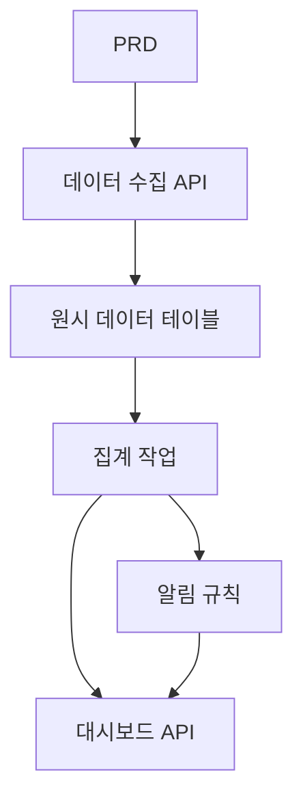

# Go 교통 데이터 분석 플랫폼 개발 실전

## 개요

이 실전 프로젝트에서는 실제 PRD를 바탕으로 Go를 사용하여 교통 데이터 분석 플랫폼을 완성하게 됩니다. 이 프로젝트는 앞선 CRUD 시스템과는 다른 방향입니다. "데이터 수집 → 집계 → 알림 → 시각화"의 완전한 데이터 파이프라인을 구축해야 합니다. 이러한 데이터 제품은 IoT, 모니터링, 운영 분석 등의 시나리오에서 매우 흔하게 사용됩니다.

이 프로젝트는 Stage 2의 종합 실전环节이자, Go 언어를 처음으로 접하게 되는 프로젝트입니다. 걱정하지 마세요. 앞서 배운 JavaScript / TypeScript 기초가 있다면 Go를 배우는 것은 어렵지 않습니다. 중요한 것은 데이터 파이프라인의 설계 방식을 이해하는 것입니다.

## 사전 지식

이 프로젝트를 시작하기 전에 다음 내용을 이미 숙지하고 있어야 합니다:

- 프론트엔드 페이지 디자인 및 컴포넌트 라이브러리 사용 ([UI 디자인](../../frontend/ui-design/), [모던 컴포넌트 라이브러리](../../frontend/modern-component-library/))
- 백엔드 API 설계 및 개발 ([API 코드 작성](../../backend/ai-interface-code/))
- 데이터베이스 기초와 Supabase ([데이터베이스부터 Supabase까지](../../backend/database-supabase/))
- Git 워크플로우 및 배포 ([Git과 GitHub](../../backend/git-workflow/), [웹 애플리케이션 배포](../../backend/zeabur-deployment/))

## 학습 목표

이 실전을 완료하면 다음을 할 수 있게 됩니다:

1. PRD를 읽고 데이터 제품의 개발 작업 목록을 추출하기
2. Go(Gin 또는 Fiber)를 사용하여 백엔드 API 서비스 구축하기
3. 데이터 수집, 윈도우 집계, 알림의 완전한 파이프라인 설계하기
4. 백엔드 데이터와 프론트엔드 대시보드의 일관성 유지하기
5. 엔드투엔드 연동 테스트를 완료하고 데모 가능한 데이터 제품 프로토타입을 전달하기

## 프로젝트 소개

구축할 제품은 Go 교통 데이터 분석 플랫폼입니다:

| 모듈 | 역할 |
|------|------|
| **데이터 수집** | 원시 교통 이벤트를 수신하여 데이터베이스에 저장합니다 |
| **데이터 집계** | 시간 윈도우별로 트렌드와 혼잡 지표를 계산합니다 |
| **알림** | 규칙 기반으로 알림 기록을 생성합니다 |
| **대시보드 표시** | 프론트엔드에 트렌드 차트, 순위, 알림 목록을 표시합니다 |

::: tip PRD 입구
이 프로젝트의 요구사항 문서는 GitHub에 있습니다: [PRD 보기](https://github.com/datawhalechina/easy-vibe/blob/main/docs/ko-kr/stage-2/assignments/traffic-data-visualization-go/PRD.md)
:::

<div style="margin: 32px 0;">
  <ClientOnly>
    <StepBar :active="0" :items="[
      { title: '요구사항 분석', description: 'PRD를 읽고 데이터 출처, 지표 정의, 알림 규칙을 명확히 합니다' },
      { title: '골격 구축', description: 'AI로 Go API 서비스와 프론트엔드 대시보드 골격을 생성합니다' },
      { title: '반복 개발', description: '집계 로직, 알림 규칙, 대시보드 API를 추가합니다' },
      { title: '연동 및 배포', description: '엔드투엔드로 실행하고, 배포하여 데모를 준비합니다' }
    ]" />
  </ClientOnly>
</div>

## 제1부: 요구사항 분석

### 1.1 PRD 읽기

PRD 문서를 열고 다음 질문에 중점적으로 답해보세요:

- 데이터 출처는 무엇인가? 필드는 어떤 것들이 있는가?
- 핵심 지표의 정의는 무엇인가? (예: "혼잡"의 구체적 기준)
- 알림 규칙은 무엇인가? 첫 번째 버전에서 간단한 규칙으로 먼저 수렴하는가?
- 대시보드에 어떤 페이지와 차트가 포함되는가?

::: warning
위 질문들에 명확한 답이 없다면, 코드 작성을 시작하지 마세요. 요구사항 이해가 불충분한 것은 재작업의 가장 흔한 원인입니다.
:::

### 1.2 데이터 파이프라인 확인



## 제2부: 프로젝트 골격 구축

### 2.1 Go API 서비스 생성

프롬프트 참고:

```text
현재 PRD를 바탕으로 Go 교통 데이터 분석 플랫폼 골격을 생성해 주세요.

요구사항:
1. Gin 또는 Fiber를 사용합니다
2. 데이터 수집 API를 제공합니다
3. 집계 작업 골격을 제공합니다
4. dashboard 및 alerts API 골격을 제공합니다
5. 복잡한 실제 분석은 아직 하지 않고, 실행 가능한 구조만 만듭니다
```

### 2.2 프로젝트 구조 확인

항목별 확인:

- [ ] Go 서비스가 정상적으로 시작되는가
- [ ] 데이터 수집 API가 데이터를 수신하고 저장할 수 있는가
- [ ] 집계 작업 프레임워크가 구축되었는가
- [ ] 프론트엔드 대시보드 페이지가 기본 차트를 표시할 수 있는가

## 제3부: 반복 개발

### 3.1 모듈별 진행

1. **데이터 수집 API**: 원시 교통 이벤트 수신, 데이터베이스에 기록
2. **데이터 집계**: 시간 윈도우별 집계, 트렌드 및 혼잡 지표 계산
3. **알림 규칙**: 임계값 기반 알림 기록 생성
4. **대시보드 API**: 트렌드 데이터, 순위 데이터, 알림 목록 제공
5. **프론트엔드 대시보드**: 트렌드 차트, 순위, 알림 목록 페이지

### 3.2 모듈 자체 점검

| 점검 항목 | 검증 방법 |
|--------|----------|
| 데이터 수집 | 원시 데이터가 올바르게 데이터베이스에 저장되는가 |
| 집계 정의 | 트렌드, 순위 지표의 계산 로직이 일관성이 있는가 |
| 알림 규칙 | 알림 트리거 조건이 예상과 일치하는가 |
| 데이터 일관성 | 대시보드 표시와 백엔드 데이터가 일치하는가 |
| API 규격 | 통일된 응답 구조와 오류 처리가 있는가 |

## 제4부: 연동 및 배포

### 4.1 엔드투엔드 테스트

최소한 다음 시나리오를 검증하세요:

- 테스트 데이터 수집 → 집계 작업 실행 → 대시보드 표시 업데이트
- 알림 조건 트리거 → 알림 기록 생성 → 알림 페이지 표시

## 산출물

이 프로젝트를 완료한 후 다음을 제출해야 합니다:

- [ ] 접근 가능한 온라인 데모 링크
- [ ] 소스 코드 저장소 링크 (README 포함)
- [ ] PRD 문서
- [ ] 핵심 페이지 스크린샷 (데이터 수집 데모, 트렌드 대시보드, 알림 목록)
- [ ] 60초 데모 영상

## 평가 기준

| 영역 | 기본 요구사항 | 심화 요구사항 |
|------|---------|---------|
| PRD 정합성 | 기능과 데이터 구조가 기본적으로 PRD에 부합 | 지표 정의와 집계 로직을 명확히 설명할 수 있음 |
| 데이터 파이프라인 | 수집 → 집계 → 알림 → 대시보드가 실행 가능 | 집계 작업이 증분 업데이트를 지원함 |
| 분석 능력 | 트렌드, 순위, 알림 세 모듈이 사용 가능 | 지표 설정 가능, 알림 규칙 커스텀 가능 |
| 프론트엔드 표시 | 대시보드가 기본 차트를 표시할 수 있음 | 차트가 시간 범위 필터링을 지원함 |
| 엔지니어링 완성도 | Go API, 데이터베이스, 프론트엔드 체인이 연결됨 | API에 통일된 오류 처리와 로깅이 있음 |

## 참고 자료

- [UI 디자인](../../frontend/ui-design/)
- [모던 컴포넌트 라이브러리로 인터페이스 업데이트하기](../../frontend/modern-component-library/)
- [데이터베이스부터 Supabase까지](../../backend/database-supabase/)
- [대형 언어 모델로 API 코드 및 문서 작성하기](../../backend/ai-interface-code/)
- [Git 및 GitHub 워크플로우](../../backend/git-workflow/)
- [웹 애플리케이션 배포 방법](../../backend/zeabur-deployment/)
