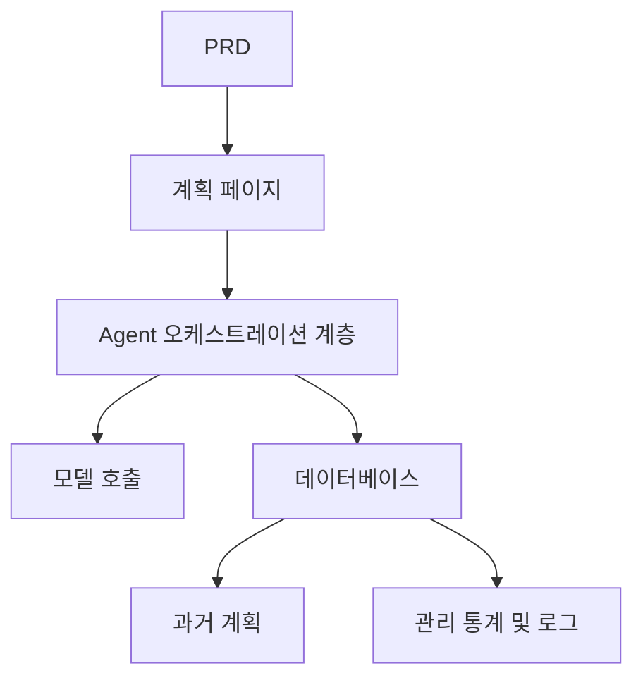

# 스마트 여행 계획 Agent 플랫폼 개발 실전

## 개요

이 실전 프로젝트에서는 실제 PRD를 바탕으로 스마트 여행 계획 Agent 플랫폼을 처음부터 완성하게 됩니다. 구조화된 입력을 받아 일별 일정을 생성하고, 저장 및 재사용이 가능한 완전한 AI 제품을 구축합니다. 단순한 챗봇이 아닌, 작업 관리 기능을 갖춘 제품을 만들게 됩니다.

이 프로젝트는 Stage 2의 종합 실전环节입니다. 핵심 과제는 AI가 조작할 수 없는 긴 텍스트가 아닌, 구조화되고 실용적인 일정 계획을 생성하도록 만드는 것입니다.

## 사전 지식

이 프로젝트를 시작하기 전에 다음 내용을 이미 숙지하고 있어야 합니다:

- 프론트엔드 페이지 디자인 및 컴포넌트 라이브러리 사용 ([UI 디자인](../../frontend/ui-design/), [모던 컴포넌트 라이브러리](../../frontend/modern-component-library/))
- 백엔드 API 설계 및 개발 ([API 코드 작성](../../backend/ai-interface-code/))
- 데이터베이스 기초와 Supabase ([데이터베이스부터 Supabase까지](../../backend/database-supabase/))
- Git 워크플로우 및 배포 ([Git과 GitHub](../../backend/git-workflow/), [웹 애플리케이션 배포](../../backend/zeabur-deployment/))

## 학습 목표

이 실전을 완료하면 다음을 할 수 있게 됩니다:

1. PRD를 읽고 Agent 플랫폼의 개발 작업 목록을 추출하기
2. 구조화된 입력 양식과 구조화된 출력 형식 설계하기
3. 사용자 입력, 모델 호출, 결과 저장을 처리하는 Agent 오케스트레이션 계층 구현하기
4. "생성 → 저장 → 재사용"의 비즈니스 루프 구축하기
5. 엔드투엔드 연동 테스트를 완료하고 데모 가능한 AI 제품 프로토타입을 전달하기

## 프로젝트 소개

구축할 제품은 스마트 여행 계획 Agent 플랫폼입니다:

| 기능 | 설명 |
|------|------|
| **일정 계획** | 사용자가 출발지, 목적지, 날짜, 예산, 취향을 입력하면 시스템이 일별 일정을 생성합니다 |
| **예산 분할** | 일정 결과에 예산 배분 및 제안이 포함됩니다 |
| **기록 관리** | 사용자가 과거 계획을 저장하고, 다시 생성하고, 내보낼 수 있습니다 |
| **관리 대시보드** | 관리자가 인기 목적지, 실패한 작업 및 사용자 피드백을 확인할 수 있습니다 |

::: tip PRD 입구
이 프로젝트의 요구사항 문서는 GitHub에 있습니다: [PRD 보기](https://github.com/datawhalechina/easy-vibe/blob/main/docs/ko-kr/stage-2/assignments/travel-planning-agent-platform/PRD.md)
:::

<div style="margin: 32px 0;">
  <ClientOnly>
    <StepBar :active="0" :items="[
      { title: '요구사항 분석', description: 'PRD를 읽고 페이지, Agent 오케스트레이션, 입출력 구조를 명확히 합니다' },
      { title: '골격 구축', description: 'AI로 홈페이지, 계획 페이지, 기록 페이지, 관리 페이지 골격을 생성합니다' },
      { title: '반복 개발', description: '모듈별로 구조화된 출력, 작업 상태, 기록 관리를 추가합니다' },
      { title: '연동 및 배포', description: '엔드투엔드로 실행하고, 배포하여 데모를 준비합니다' }
    ]" />
  </ClientOnly>
</div>

## 제1부: 요구사항 분석

### 1.1 PRD 읽기

PRD 문서를 열고 다음 질문에 중점적으로 답해보세요:

- 첫 번째 버전은 단일 목적지만 지원하는가?
- 일정 출력은 반드시 구조화되어야 하는가? 구조는 무엇인가?
- 내보내기 기능은 어디까지 구현하는가? (공유 링크 / PDF / 이미지)
- 관리 대시보드 통계와 작업 로그의 범위는 무엇인가?

::: warning
위 질문들에 명확한 답이 없다면, 코드 작성을 시작하지 마세요. 요구사항 이해가 불충분한 것은 재작업의 가장 흔한 원인입니다.
:::

### 1.2 시스템 아키텍처 확인



## 제2부: 프로젝트 골격 구축

### 2.1 프론트엔드 페이지 생성

프롬프트 참고:

```text
현재 PRD를 바탕으로 스마트 여행 계획 Agent 플랫폼의 프론트엔드 골격을 생성해 주세요.

요구사항:
1. 페이지 구성: 홈페이지, 계획 페이지, 일정 상세 페이지, 기록 페이지, 관리 페이지
2. 계획 페이지는 왼쪽에 양식, 오른쪽에 결과 미리보기
3. 먼저 페이지 구조와 가짜 데이터만 생성하고, 실제 API는 연결하지 않습니다
4. 모던 AI 제품 같은 스타일
```

### 2.2 페이지 구조 확인

항목별 확인:

- [ ] 계획 페이지의 양식 필드가 PRD와 일치하는가
- [ ] 결과 미리보기 영역이 구조화된 일정 데이터를 표시할 수 있는가
- [ ] 기록 페이지가 여러 계획을 표시할 수 있는가
- [ ] 관리 대시보드 페이지가 통계 데이터를 표시할 수 있는가

## 제3부: 반복 개발

### 3.1 모듈별 진행

1. **인증**: 회원가입, 로그인
2. **계획 양식**: 구조화된 입력 (출발지, 목적지, 날짜, 예산, 취향)
3. **Agent 오케스트레이션**: 입력 수신 → 모델 호출 → 구조화된 출력 파싱
4. **결과 표시**: 일정을 일별로 표시, 예산 분할, 제안
5. **기록 관리**: 계획 저장, 재생성, 내보내기
6. **관리 대시보드**: 인기 목적지, 실패한 작업, 사용자 피드백
7. **작업 상태**: 생성 중 / 성공 / 실패 상태 관리 및 오류 기록

### 3.2 모듈 자체 점검

| 점검 항목 | 검증 방법 |
|--------|----------|
| 입력 완전성 | 양식 필드가 PRD와 일치하는가 |
| 출력 구조화 | 일정 결과가 구조화된 데이터인가 (긴 텍스트가 아닌) |
| 데이터 일관성 | trip, itinerary, logs 데이터가 서로 일치하는가 |
| 루프 검증 | "입력 → 생성 → 저장 → 재생성"을 데모할 수 있는가 |

## 제4부: 연동 및 배포

### 4.1 엔드투엔드 테스트

최소한 다음 시나리오를 검증하세요:

- 일정 파라미터 입력 → 일별 일정 생성 → 예산 분할 확인 → 기록에 저장
- 기록에서 일정 재생성
- 관리자가 작업 통계와 실패 로그 확인

## 산출물

이 프로젝트를 완료한 후 다음을 제출해야 합니다:

- [ ] 접근 가능한 온라인 데모 링크
- [ ] 소스 코드 저장소 링크 (README 포함)
- [ ] PRD 문서
- [ ] 핵심 페이지 스크린샷 (계획 페이지, 일정 상세 페이지, 기록 페이지, 관리 대시보드)
- [ ] 60초 데모 영상

## 평가 기준

| 영역 | 기본 요구사항 | 심화 요구사항 |
|------|---------|---------|
| PRD 정합성 | 페이지, 기능, 데이터 구조가 기본적으로 PRD에 부합 | 설계 결정을 명확히 설명할 수 있음 |
| 제품 루프 | 계획 → 저장 → 기록 → 재생성이 실행 가능 | 내보내기 및 공유 지원 |
| 출력 품질 | 일정 결과가 구조화되고 가독성이 높음 | 예산 분할이 합리적이고 제안이 타겟팅됨 |
| 관리 기능 | 작업 통계와 실패 로그를 확인할 수 있음 | 인기 목적지 분석이 있음 |
| 엔지니어링 완성도 | 프론트엔드, 백엔드, 데이터베이스, 모델 호출 체인이 연결됨 | 작업 상태 관리가 완비되고 오류 추적 가능 |

## 참고 자료

- [UI 디자인](../../frontend/ui-design/)
- [모던 컴포넌트 라이브러리로 인터페이스 업데이트하기](../../frontend/modern-component-library/)
- [데이터베이스부터 Supabase까지](../../backend/database-supabase/)
- [대형 언어 모델로 API 코드 및 문서 작성하기](../../backend/ai-interface-code/)
- [Git 및 GitHub 워크플로우](../../backend/git-workflow/)
- [웹 애플리케이션 배포 방법](../../backend/zeabur-deployment/)
