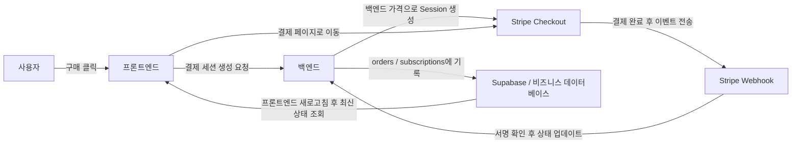
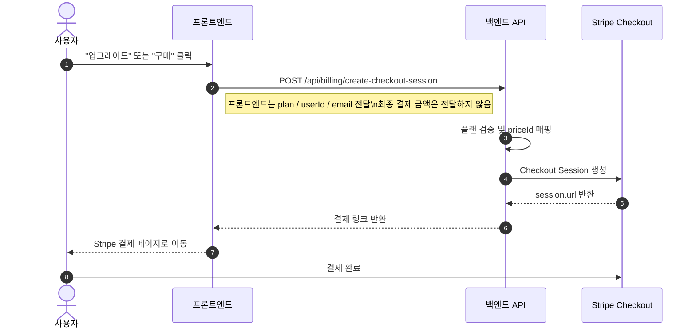
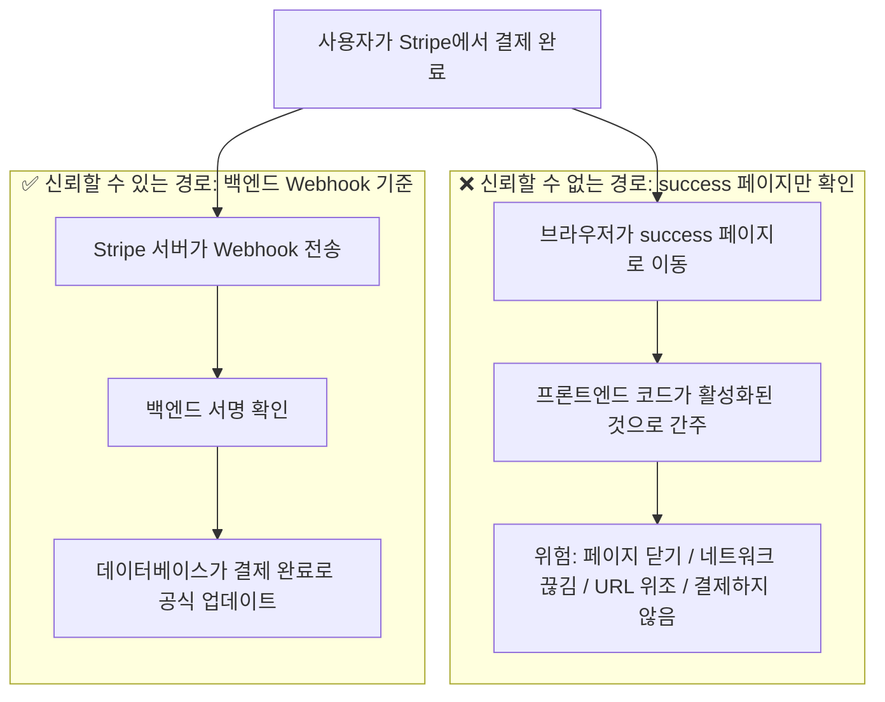
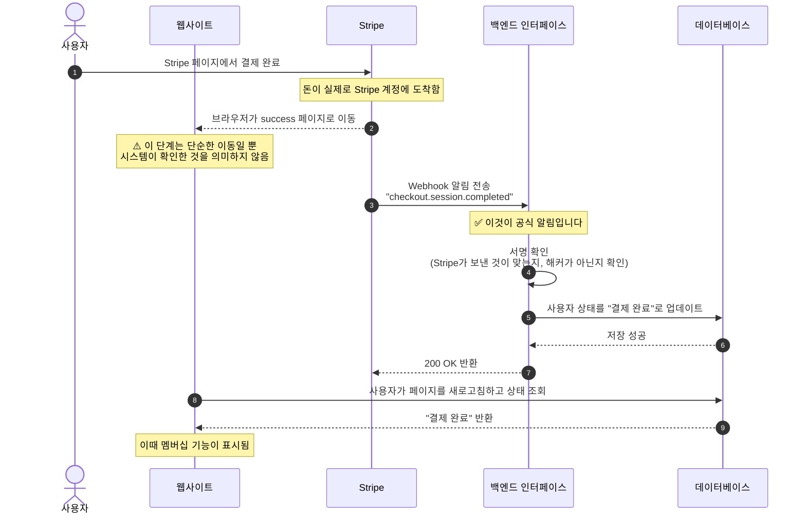
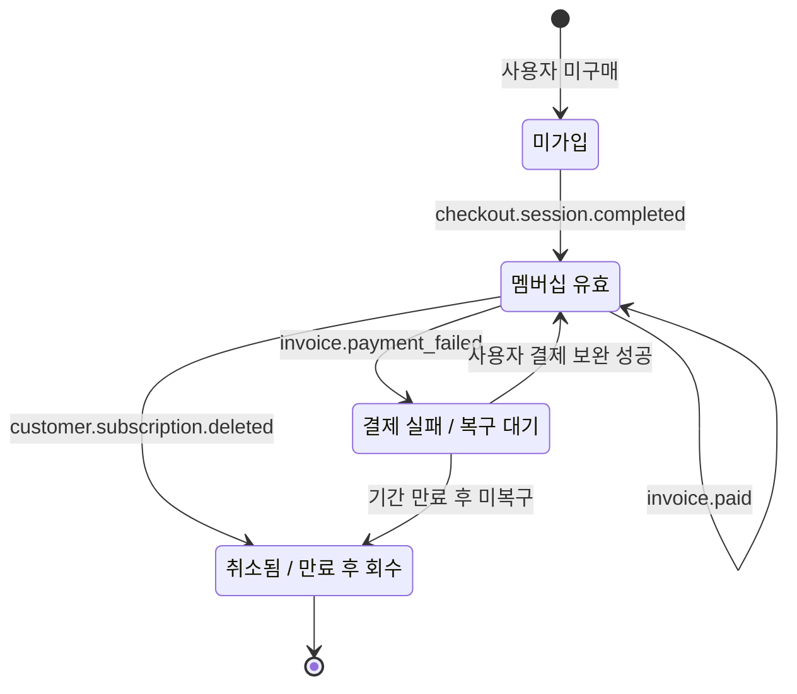
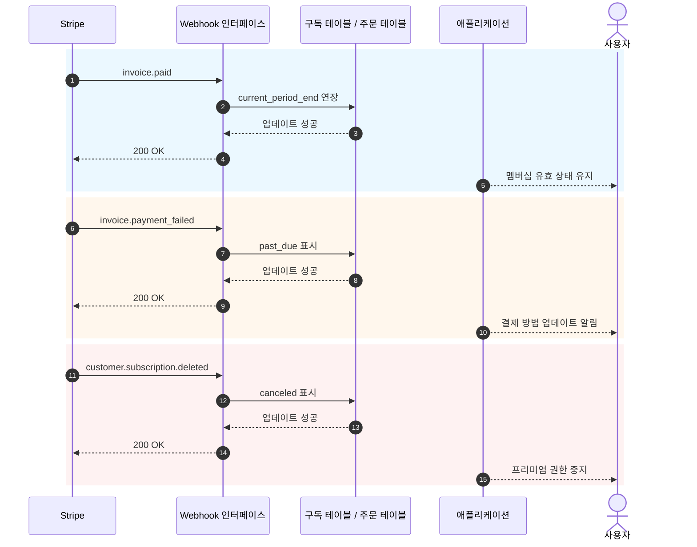

# Stripe 등 결제 시스템 통합 방법

제품에 이미 페이지, 로그인, 데이터베이스, 기본 백엔드가 있다면, 다음 현실적인 문제는 **어떻게 수익을 낼 것인가**입니다.

많은 사람이 처음 결제를 연동할 때 "어떻게 결제 페이지로 이동하나요"에만 집중합니다. 하지만 시스템이 안정적인지를 결정하는 것은 버튼이 아니라 결제 파이프라인 전체입니다. 누가 가격을 결정하고, 누가 결제 성공을 확인하며, 누가 데이터베이스를 업데이트하고, 누가 권한을 관리하는가요.

이 글은 두 부분으로 나뉩니다:

- **전반부**에서는 가장 실용적인 기본 연동만 다루며, 목표는 Stripe를 최대한 빨리 프로젝트에 연동하는 것입니다.
- **후반부**는 부록에 통합하여 Webhook 세부 사항, 구독 이벤트, 국가 및 지역별 결제 방식 차이를 다룹니다.

> 💡 계속하기 전에 다음 장을 먼저 학습하는 것을 권장합니다
>
> - [데이터베이스부터 Supabase까지](../database-supabase/)
> - [대형 언어 모델로 API 코드 및 문서 작성하기](../ai-interface-code/)
> - [웹 애플리케이션 배포 방법](../zeabur-deployment/)

# 학습 내용

1. 최소 기능 결제 시스템이 실제로 어떤 모습인가요.
2. Stripe를 프로젝트에 가장 빠르게 연동하는 방법.
3. 프롬프트를 작성하여 AI가 직접 결제 시스템을 추가하도록 하는 방법.
4. 해외 Stripe 프로젝트가 아닌 경우, 지역별로 우선적으로 고려해야 할 결제 방식.

---

# 제1부: 기본 시작

## 1. 먼저 3가지 원칙을 기억하세요

딱 세 가지만 기억한다면 다음을 기억하세요:

1. **가격은 반드시 백엔드에서 결정**해야 하며, 프론트엔드에서 전달하는 금액을 신뢰해서는 안 됩니다.
2. **권한을 실제로 활성화하는 것은 Webhook**이며, `success` 페이지가 아닙니다.
3. **자체 데이터베이스에 결제 상태를 반드시 저장**해야 하며, Stripe 대시보드에만 의존해서는 안 됩니다.

이 세 가지는 결제 시스템의 가장 핵심적인 경계입니다. 경계만 정확하다면, 나중에 Stripe, PayPal, Alipay, WeChat Pay로 바꾸더라도 본질적으로 "인터페이스만 바뀌고 아키텍처는 동일"합니다.

## 2. 백엔드에서 처리하지 않고 프론트엔드에서 직접 Stripe에 연결하면 어떻게 되나요?

결제를 처음 구현할 때 가장 자연스러운 생각입니다:

- 페이지에 이미 "구매" 버튼이 있습니다
- 프론트엔드에서 직접 Stripe에 연결할 수 있을까요
- 그러면 백엔드를 만들 필요가 없지 않을까요

단순한 데모 페이지를 만드는 거라면 물론 괜찮습니다.
하지만 실제로 돈을 받아야 한다면, **이 방식은 보통 문제를 일으킵니다**.

가장 흔한 문제는 다음과 같습니다:

1. **가격이 쉽게 변경됩니다**
   브라우저의 요청은 사용자 컴퓨터에서 전송되므로, 요청 내용을 수정할 수 있습니다.
2. **민감한 정보가 노출되기 쉽습니다**
   중요한 비밀키, 가격 로직, 멤버십 활성화 로직은 원래 프론트엔드에 두면 안 됩니다.
3. **"이 결제가 정말 성공했는지"를 안정적으로 확인할 수 없습니다**
   사용자가 성공 페이지로 이동했다고 해서 데이터베이스가 올바르게 동기화된 것은 아닙니다.
4. **데이터베이스 상태가 꼬입니다**
   사용자는 "분명히 결제했는데"라고 할 수 있지만, 시스템에는 기록이 없을 수 있습니다.

따라서 더 안전한 역할 분담은 다음과 같습니다:

- 프론트엔드: 버튼 표시, 구매 시작, 페이지 이동
- 백엔드: 가격 결정, 결제 세션 생성, Webhook 수신, 데이터베이스 업데이트

::: info 이 부분은 한 문장으로 요약할 수 있습니다
**프론트엔드는 이동을 담당하고, 백엔드는 가격 책정과 확인을 담당합니다.**

실제로 돈을 받는다면, "최종 가격 결정권"과 "결제 성공 후 활성화 로직"을 프론트엔드에 두지 마세요.
:::

## 3. 언제 Stripe를 먼저 사용하는 것이 적절한가요

다음과 같은 시나리오라면 Stripe가 가장 편한 시작점입니다:

- 해외 사용자를 대상으로 하는 SaaS
- 구독제 멤버십 제품
- 디지털 제품, 템플릿, AI 크레딧 팩
- 로컬 결제 세부 사항을 너무 많이 처리하기보다는 먼저 수익화를 빠르게 검증하고 싶은 경우

주요 사용자가 중국 대륙에 있다면 보통 Stripe를 첫 번째 선택으로 하지 않습니다. 이 부분은 부록에서 통합하여 설명합니다.

## 4. 최소 기능 결제 파이프라인

먼저 최소 버전을 살펴보겠습니다. 이 파이프라인만 작동하면 결제 시스템의 뼈대가 갖춰집니다.



이것을 알기 쉽게 풀면:

1. 사용자가 버튼을 클릭합니다.
2. 프론트엔드가 백엔드에 결제 링크를 요청합니다.
3. 백엔드가 Stripe 비밀키로 결제 세션을 생성합니다.
4. 사용자가 Stripe 페이지에서 결제합니다.
5. Stripe가 "결제가 정말로 성공했습니다"라는 것을 Webhook으로 알려줍니다.
6. 백엔드가 데이터베이스를 업데이트합니다.

## 5. 결제 시작 표준 시퀀스 다이어그램

더 체계적인 시스템 다이어그램에 익숙하다면 이 시퀀스 다이어그램을 참고하세요:



## 6. 빠른 시작

Stripe를 프로젝트에 가장 빠르게 연동하려면 다음 5단계를 따르면 됩니다.

### 6.1 1단계: Stripe 대시보드에서 상품과 가격 생성

이 단계의 목적은 "일단 아무거나 설정"하는 것이 아니라, **무엇을 팔고, 어떻게 요금을 받을지**를 Stripe에 명확하게 정의하는 것입니다.

Stripe의 모델에서:

- **Product**는 "무엇을 파는가"를 나타내며, 예를 들어 `Pro 멤버십`
- **Price**는 "얼마에, 어떤 주기로 파는가"를 나타내며, 예를 들어 `월 9.9달러`, `연 99달러`

왜 이 단계를 먼저 해야 할까요?
나중에 백엔드에서 Checkout Session을 생성할 때, Stripe에 금액을 직접 전달하는 것이 아니라 이미 존재하는 `price_id`를 전달해야 하기 때문입니다. Stripe는 이 `price_id`를 바탕으로 실제 결제 페이지, 금액, 통화, 구독 주기를 생성합니다.

이 단계를 건너뛰면 나중에 "결제 링크 생성"을 할 수 없습니다.

::: info 왜 여기서 잠시 멈춰야 할까요
초보자는 `Product`, `Price`라는 단어를 보면 Stripe 내부 용어를 배워야 하나고 귀찮게 느낄 수 있습니다.

하지만 실제로 이 단계는 아주 단순한 일을 하는 것입니다:
- "무엇을 파는가"를 명확히 정의하기
- "얼마에 파는가"를 명확히 정의하기
- 백엔드가 나중에 안정적인 `price_id`로 결제 링크를 생성할 수 있게 하기

이 부분을 이해하면 Checkout Session도 추상적으로 느껴지지 않습니다.
:::

최소 기능 구독 시스템의 경우, 최소한 다음 두 가지 수준을 먼저 만들어야 합니다:

- 하나의 `Product`
- 하나 이상의 `Price`

다음 페이지를 직접 열 수 있습니다:

- Stripe Dashboard 로그인: [Dashboard Login](https://dashboard.stripe.com/login)
- Stripe 상품 및 가격 관리 문서: [Manage products and prices](https://docs.stripe.com/products-prices/manage-prices)
- Stripe Checkout 빠른 시작 문서: [Build a Stripe-hosted checkout page](https://docs.stripe.com/checkout/quickstart?lang=node)
- Stripe Dashboard 상품 페이지: [Product catalog](https://dashboard.stripe.com/test/products)

먼저 **Test mode(테스트 모드)**에서 작업하는 것을 권장하며, 처음부터 실제 환경에서 만들지 마세요.

가장 흔한 최소 구성은:

- `Product`: `Pro Plan`
- `Price 1`: `pro_monthly`
- `Price 2`: `pro_yearly`

대시보드에서 작업할 때 다음 순서로 이해하면 됩니다:

1. 먼저 상품 `Pro Plan`을 생성합니다
2. 그 상품 아래에 두 개의 가격을 추가합니다
3. 월간 결제와 연간 결제는 사실 같은 상품의 두 가지 요금 방식입니다

완료 후 최소한 다음 정보를 기록해야 합니다:

- 월간 결제 가격의 `price_id`
- 연간 결제 가격의 `price_id`
- 자체 플랜 이름, 예: `pro_monthly`, `pro_yearly`

Stripe 대시보드에 처음 들어가는 거라면, 이 단계를 다음과 같이 이해하는 것을 권장합니다:

- `Product`는 결제 페이지에서 무엇을 파는지 결정합니다
- `Price`는 결제 페이지에서 얼마를 받는지 결정합니다
- 백엔드가 실제로 사용할 것은 주로 `price_id`입니다

::: info 실제로 기록해야 할 값
이 페이지에서 가장 중요한 것은 상품 이름이 아니라 `price_id`입니다.

나중에 AI가 백엔드를 연동하거나 직접 문제를 해결할 때, 실제로 자주 사용하는 것은 보통 다음과 같습니다:
- `STRIPE_PRICE_PRO_MONTHLY`
- `STRIPE_PRICE_PRO_YEARLY`
- 이에 해당하는 두 개의 `price_id`
:::

AI가 먼저 대시보드 설정을 안내하게 하려면 다음 프롬프트를 사용할 수 있습니다:

```text
저는 Stripe를 처음 사용합니다. 코드를 먼저 수정하지 말고, Stripe 대시보드에서 가장 기본적인 유료 설정을 완료하도록 안내해 주세요.

다음 공식 문서를 기반으로 단계별 조작 설명을 제공해 주세요:
- https://docs.stripe.com/products-prices/manage-prices
- https://docs.stripe.com/checkout/quickstart?lang=node

제 상황은:
- 가장 간단한 멤버십 결제를 만들고 싶습니다
- 두 개의 플랜만 있습니다: 월간 결제와 연간 결제
- Product, Price 같은 용어를 아직 이해하지 못합니다

다음을 해주세요:
1. 먼저 Product와 Price가 각각 무엇인지 가장 간단한 말로 설명해 주세요.
2. "어떤 페이지를 먼저 열고 -> 어디를 클릭하고 -> 무엇을 입력하는지" 순서로 조작 방법을 알려주세요.
3. 완료 후 백엔드에서 사용하기 위해 대시보드에서 복사해야 할 내용을 알려주세요.
4. 실수하기 쉬운 부분이 있다면 항상 테스트 모드에서 작업해야 한다는 점도 함께 알려주세요.
```

### 6.2 2단계: 환경 변수 준비

일반적으로 최소한 다음 환경 변수를 준비해야 합니다:

- `STRIPE_SECRET_KEY`
- `STRIPE_WEBHOOK_SECRET`
- `STRIPE_PRICE_PRO_MONTHLY`
- `STRIPE_PRICE_PRO_YEARLY`
- `APP_URL`
- `SUPABASE_URL`
- `SUPABASE_SERVICE_ROLE_KEY`

다음 페이지를 직접 열 수 있습니다:

- Stripe API Keys 문서: [API keys](https://docs.stripe.com/keys)
- Stripe Dashboard API Keys 페이지: [API Keys](https://dashboard.stripe.com/test/apikeys)
- Stripe Webhooks 문서: [Receive Stripe events in your webhook endpoint](https://docs.stripe.com/webhooks)
- Stripe Dashboard Webhooks 페이지: [Workbench Webhooks](https://dashboard.stripe.com/test/workbench/webhooks)

> ⚠️ `STRIPE_SECRET_KEY`와 `SUPABASE_SERVICE_ROLE_KEY`는 반드시 백엔드에만 배치해야 합니다.

::: info 환경 변수 단계의 목적
이 단계는 "`.env`를 채우는 것"이 아니라, 결제 시스템에서 가장 민감한 몇 가지를 백엔드에 보관하기 위한 것입니다:

- Stripe 백엔드 비밀키
- Webhook 서명 확인 비밀키
- 자체 가격 매핑

간단히 이해하면:
프론트엔드는 구매 시작만 담당하고, 진짜 비밀과 가격 책정 로직은 서버 측에 남겨두어야 합니다.
:::

이 단계도 AI가 정리하도록 할 수 있습니다:

```text
이 프로젝트가 현재 환경 변수를 어떻게 관리하는지 먼저 확인하고, Stripe에 필요한 환경 변수를 정리해 주세요.

다음 문서를 참고해 주세요:
- https://docs.stripe.com/keys
- https://docs.stripe.com/webhooks

제 상황은:
- 완전 초보입니다
- 어떤 변수를 프론트엔드에 두고 어떤 것을 백엔드에 둬야 하는지 구분하지 못합니다
- 현재 프로젝트에서 `.env`, `.env.local` 또는 다른 파일을 수정해야 하는지도 확실하지 않습니다

다음을 해주세요:
1. 먼저 현재 프로젝트에서 환경 변수가 보통 어디에 작성되는지 검색해 주세요.
2. Stripe 연동에 최소한 필요한 변수를 나열해 주세요.
3. 각 변수가 무엇을 하는지 가장 간단한 말로 설명해 주세요.
4. 각 변수를 어느 Stripe 페이지에서 복사해야 하는지 알려주세요.
5. 프로젝트에 예시 환경 변수 파일이 있다면 변수 이름을 직접 추가해 주세요.
```

### 6.3 3단계: 백엔드에서 Checkout Session 생성

이 단계에서는 직접 인터페이스를 작성할 필요 없이, AI가 공식 문서를 참고하여 구현하도록 하세요.

먼저 다음 문서를 AI에게 제공하세요:

- Stripe Checkout 빠른 시작: [Build a Stripe-hosted checkout page](https://docs.stripe.com/checkout/quickstart?lang=node)
- Checkout Sessions API: [Create a Checkout Session](https://docs.stripe.com/api/checkout/sessions/create)
- 구독 설명: [Subscriptions](https://docs.stripe.com/payments/subscriptions)

그리고 다음 프롬프트를 직접 붙여넣으세요:

```text
현재 프로젝트의 백엔드 코드가 어떻게 구성되어 있는지 먼저 확인하고, Stripe 결제를 연동해 주세요.

다음 공식 문서를 참고해 주세요:
- https://docs.stripe.com/checkout/quickstart?lang=node
- https://docs.stripe.com/api/checkout/sessions/create
- https://docs.stripe.com/payments/subscriptions

제 목표는 간단합니다:
- 사용자가 구매 버튼을 클릭하면 Stripe 결제 페이지로 이동해야 합니다
- 플랜은 월간 결제와 연간 결제 두 가지만 있습니다
- 코드를 어디에 배치해야 할지 직접 결정하게 하지 말고, 먼저 프로젝트를 확인한 후 적절한 위치에 배치해 주세요

다음을 해주세요:
1. 먼저 프로젝트를 검색하여 백엔드 진입 파일, 라우팅 파일, 환경 변수 작성 방식이 각각 어디에 있는지 파악해 주세요.
2. 공식 문서를 참고하여 "Stripe 결제 링크 생성" 단계를 연동해 주세요.
3. 금액을 직접 전달하지 말고, 백엔드 환경 변수로 가격을 결정해 주세요.
4. 완료 후 어떤 파일을 수정했는지 알려주세요.
5. 마지막으로 Stripe 대시보드에서 추가로 설정해야 할 사항이 있는지 알려주세요.
```

### 6.4 4단계: 프론트엔드에서 결제 페이지로 이동

이 단계의 목표는 매우 간단합니다: 가격 페이지의 버튼이 백엔드 인터페이스를 호출한 다음 Stripe Checkout으로 이동하도록 합니다.

참고 문서:

- Stripe Checkout 통합 설명: [Build an integration with Checkout](https://docs.stripe.com/payments/checkout/build-integration)

AI에게 주는 프롬프트:

```text
프로젝트의 "구매" 버튼에 Stripe를 연결해 주세요.

요구사항:
- 기존 페이지는 그대로 두고, 버튼 클릭 후 로직만 수정합니다
- 클릭 후 백엔드 인터페이스를 호출하여 결제 링크를 가져온 다음 Stripe로 이동합니다
- 오류 발생 시 사용자에게 간단한 알림 표시 (예: "결제를 일시적으로 사용할 수 없습니다. 잠시 후 다시 시도해 주세요")

참고 문서: https://docs.stripe.com/payments/checkout/build-integration
```

### 6.5 5단계: Webhook으로 데이터베이스 상태 업데이트

이것이 가장 중요한 단계입니다.

::: info 왜 이 단계가 가장 중요한가요
많은 사람이 "사용자가 결제를 완료하고 success 페이지로 이동했다"고 생각하면 완료된 것으로 간주합니다.

아닙니다.

시스템에 있어 정말 중요한 것은:
**Stripe가 Webhook으로 이벤트를 정상적으로 전달했는지, 그리고 백엔드가 데이터베이스 상태 업데이트에 성공했는지**입니다.
:::

AI가 Stripe 공식 Webhook 문서를 참고하여 직접 구현하도록 할 수도 있습니다. 직접 작성하지 마세요.

참고 문서:

- Stripe Webhooks: [Receive Stripe events in your webhook endpoint](https://docs.stripe.com/webhooks)
- Stripe CLI: [Stripe CLI](https://docs.stripe.com/stripe-cli)
- Stripe CLI 사용법: [Use the Stripe CLI](https://docs.stripe.com/stripe-cli/use-cli)

AI에게 주는 프롬프트:

```text
Stripe의 "결제 성공 후 자동 활성화" 단계를 계속 연동해 주세요.

다음 공식 문서를 참고해 주세요:
- https://docs.stripe.com/webhooks
- https://docs.stripe.com/stripe-cli
- https://docs.stripe.com/stripe-cli/use-cli

제 목표는:
- 사용자가 결제한 후 단순히 성공 페이지로 이동하는 것뿐만 아니라
- 실제로 데이터베이스의 멤버십 상태를 활성화로 변경하는 것입니다

다음을 해주세요:
1. 먼저 현재 프로젝트에서 데이터베이스 관련 코드와 사용자 상태가 어떻게 저장되는지 검색해 주세요.
2. Stripe webhook을 추가해 주세요.
3. 결제 성공 후 해당 사용자를 active로 변경하거나, 프로젝트에서 현재 사용 중인 멤버십 상태 필드를 업데이트해 주세요.
4. 프로젝트에 이미 구독 테이블, 주문 테이블, 사용자 테이블이 있다면 기존 구조를 우선 사용해 주세요.
5. 완료 후 어떤 파일을 수정했는지 알려주세요.
6. 로컬에서 이 단계가 실제로 작동하는지 테스트하는 방법도 알려주세요.
```

## 7. AI가 빠르게 연동하도록 돕는 프롬프트

Codex, Claude Code, Trae, Cursor 같은 도구를 사용 중이라면, 다음 프롬프트를 직접 붙여넣어 프로젝트에 결제를 연동하도록 할 수 있습니다.

```text
현재 프로젝트에 Stripe 결제를 연동해 주세요. 가장 간단하게 실행할 수 있는 멤버십 결제 기능을 만들고 싶습니다.

제 요구사항:
1. 저는 완전 초보입니다. 먼저 프로젝트를 확인한 후 코드를 어디에 수정해야 할지 결정해 주세요.
2. 디렉토리 구조, 라우팅 구조, 데이터베이스 구조를 직접 판단하게 하지 마세요.
3. 가장 간단한 버전만 먼저 만들고 싶습니다: 월간 결제와 연간 결제 두 가지 플랜.
4. 사용자가 구매 버튼을 클릭하면 Stripe 결제 페이지로 이동해야 합니다.
5. 결제 성공 후 데이터베이스의 멤버십 상태가 활성화로 변경되어야 합니다.
6. 쿠폰, 업그레이드/다운그레이드, 복잡한 청구서 등 너무 많은 복잡한 기능은 처음에 추가하지 마세요.

출력 요구사항:
1. 먼저 수정 계획을 제시해 주세요.
2. 그런 다음 코드를 직접 수정해 주세요.
3. 마지막으로 로컬에서 단계별로 테스트하는 방법을 알려주세요.
4. Stripe 대시보드에서 추가로 조작해야 하는 단계가 있다면 링크와 요점을 직접 알려주세요.
```

AI가 프로젝트에 더 맞게 작업하도록 하려면, 처음에 다음을 추가할 수 있습니다:

- 프론트엔드 프레임워크
- 백엔드 디렉토리 구조
- 데이터베이스 테이블 이름
- 현재 사용자 시스템이 Supabase Auth인지 자체 구축 Auth인지

## 7.1 로컬 연동 테스트도 AI에게 맡기기

로컬 연동 테스트까지 AI가 전체를 연결해 주길 원한다면, 다음 프롬프트를 사용할 수 있습니다:

```text
Stripe 결제를 실제로 실행할 수 있도록 도와주세요. 단계별로 따라 하고 싶고, 혼자 추측하고 싶지 않습니다.

다음 공식 문서를 참고해 주세요:
- https://docs.stripe.com/webhooks
- https://docs.stripe.com/stripe-cli
- https://docs.stripe.com/stripe-cli/use-cli

제 목표:
1. 먼저 어떤 Stripe 페이지를 열어야 하는지 알려주세요.
2. STRIPE_WEBHOOK_SECRET을 어떻게 얻는지 알려주세요.
3. stripe login과 stripe listen을 어떻게 사용하는지 알려주세요.
4. checkout.session.completed가 로컬 webhook에 성공적으로 전달되었는지 확인하는 방법을 알려주세요.
5. 현재 프로젝트에서 프론트엔드와 백엔드를 먼저 시작해야 한다면 구체적인 명령어도 함께 알려주세요.
6. 원리만 설명하지 말고 실제 조작 단계별로 출력해 주세요.
7. 특정 단계에서 실수한 경우 가장 흔한 오류가 어떻게 보이는지도 알려주세요.
```

## 8. 가장 많이 하는 실수 4가지

1. **`success` 페이지를 결제 성공으로 간주하기**
   상태를 실제로 결정하는 것은 Webhook이며, 프론트엔드 이동이 아닙니다.
2. **프론트엔드에서 금액 전달하기**
   심각한 가격 변조 위험이 발생합니다.
3. **Webhook 라우트가 `express.json()`에 의해 먼저 처리됨**
   Stripe 서명 확인에는 원본 요청 본문이 필요합니다.
4. **멱등성 처리를 하지 않음**
   Webhook이 재시도될 수 있으며, 매번 멤버십이나 크레딧을 반복해서 추가하면 문제가 발생합니다.

## 9. 한 줄 선택 가이드

지금 당장 결제를 실행하고 싶다면:

| 주요 사용자 | 가장 먼저 시도할 방식 |
| :--- | :--- |
| 해외 SaaS / 글로벌 사용자 | Stripe |
| 중국 대륙 사용자 | Alipay / WeChat Pay |
| 홍콩 또는 크로스보더 팀 | Stripe + 로컬 지갑 / FPS 통합 방안 |

구체적인 차이는 부록에서 통합하여 설명합니다.

::: info 가장 간단한 선택 사고방식
처음부터 "전 세계 결제 방식을 한 번에 모두 연동해야지"라고 생각하지 마세요.

더 현실적인 순서는 보통 다음과 같습니다:
- 먼저 주요 사용자가 있는 지역에 따라 주 결제 파이프라인을 선택합니다
- 최소 기능 결제를 먼저 실행합니다
- 실제 사용자 출처에 따라 두 번째, 세 번째 결제 방식을 추가합니다
:::

## 10. 요약

여기까지 기본적이지만 가장 중요한 결제 파이프라인을 마스터했습니다:

1. 프론트엔드가 구매를 시작합니다.
2. 백엔드가 Checkout Session을 생성합니다.
3. 사용자가 Stripe 페이지에서 결제합니다.
4. Stripe가 Webhook으로 백엔드에 알립니다.
5. 백엔드가 데이터베이스를 업데이트합니다.
6. 프론트엔드가 새로고침 후 새로운 멤버십 또는 주문 상태를 표시합니다.

결제를 프로젝트에 빠르게 연동하고 싶다면 앞의 내용으로 충분합니다. 아래 부록은 실제로 문제가 발생했을 때 다시 참조하면 됩니다.

---

# 부록

## 부록 A: Stripe에서 가장 흔히 보는 객체

Stripe 문서를 처음 보면 이 객체 이름들 때문에 헷갈리기 쉽습니다. 실제로는 다음 몇 가지만 먼저 이해하면 됩니다:

| 객체 | 역할 | 이해하기 쉬운 비유 |
| :--- | :--- | :--- |
| `Product` | 무엇을 파는지 설명 | 상품 또는 멤버십 플랜 |
| `Price` | 얼마에, 어떤 주기로 파는지 설명 | 월간 결제, 연간 결제, 단건 구매 |
| `Checkout Session` | Stripe가 호스팅하는 결제 흐름 | 결제 페이지 |
| `Subscription` | 정기 구독 관계 | 자동 갱신 멤버십 |
| `Customer` | 결제 사용자 | Stripe의 고객 프로필 |
| `Webhook` | 비동기 알림 | Stripe가 "이 결제가 어떻게 되었는지" 알려줌 |

## 부록 B: `success` 페이지가 결제 성공과 같지 않은 이유

많은 사람이 "사용자가 결제를 완료하고 success 페이지로 이동했다"고 하면 결제가 성공한 것으로 생각합니다. 이것이 가장 많이 하는 실수입니다.

### 실제 시나리오 하나

멤버십 웹사이트를 만들었다고 가정해 보겠습니다:
1. 사용자가 "멤버십 구매"를 클릭합니다
2. Stripe 결제 페이지로 이동합니다
3. 사용자가 신용카드를 입력하고 결제를 클릭합니다
4. 페이지가 `success.html`로 이동합니다
5. success 페이지에 코드를 작성합니다: "이 페이지에 도달했으니 사용자에게 멤버십을 활성화합니다"

**문제는 어디에 있을까요?**

사용자가 결제를 하지 않았거나, 결제 도중에 페이지를 닫았어도 `success.html`에 직접 접근할 수 있습니다.

### 완전히 다른 두 가지 경로



**핵심 차이:**

| | success 페이지 이동 | Webhook 알림 |
| :--- | :--- | :--- |
| 누가 시작하는가 | 사용자의 브라우저 | Stripe의 서버 |
| 위조 가능 여부 | 가능, URL에 직접 접속하면 됨 | 불가능, 서명 확인이 있음 |
| 반드시 결제 성공을 의미하는가 | 아니오 | 예 |
| 시스템이 어떻게 아는가 | 프론트엔드 코드가 추측한 것 | Stripe의 공식 알림 |

### 올바른 전체 흐름



### 각 단계별 핵심 포인트

**1단계: 사용자가 Stripe에서 결제**

이것이 "돈이 실제로 지불되었는지"를 확인할 수 있는 유일한 순간입니다:
- 사용자가 신용카드 정보를 입력하고 확인을 클릭합니다
- 은행이 사용자의 카드에서 결제합니다
- Stripe가 이 금액을 수령했음을 확인합니다

**2단계: 브라우저가 success 페이지로 이동 (가장 문제가 되는 부분)**

이 단계는 완전히 신뢰할 수 없습니다. 왜냐하면:
- 사용자가 브라우저에서 직접 `yoursite.com/success`를 입력하면 결제 없이도 접근할 수 있습니다
- 사용자가 결제 도중에 페이지를 닫았어도, 이전에 success 링크를 복사했다면 나중에 직접 열 수 있습니다
- 네트워크 문제로 이동이 실패했어도, 돈은 이미 결제되었습니다 (사용자가 돈을 지불했는데 성공 페이지를 보지 못함)
- 사용자가 뒤로 가기 버튼을 눌러 다시 결제하면, 두 번 모두 같은 success 페이지로 이동합니다

**3단계: Stripe가 Webhook 전송**

이것은 Stripe가 서버에 "이 결제가 입금되었습니다"라고 적극적으로 알리는 것입니다:
- Stripe 서버만이 이 요청을 시작할 수 있습니다
- 요청에 서명이 포함되어 있어, 백엔드에서 Stripe가 보낸 것인지 확인할 수 있습니다
- success 페이지가 열리지 않았거나 사용자가 네트워크에 연결되어 있지 않아도, Webhook은 전송됩니다

**4단계: 백엔드 서명 확인**

왜 확인해야 할까요? 해커의 위조 알림을 방지하기 위해서입니다.

확인이 없다면, 해커가 서버에 가짜 알림을 보낼 수 있습니다: "사용자 A가 1000달러를 결제했습니다". 시스템이 해커에게 멤버십을 활성화하게 됩니다.

확인 과정:
- Stripe가 당사가 합의한 비밀키로 알림 내용의 서명을 생성합니다
- 백엔드가 같은 비밀키로 서명이 일치하는지 확인합니다
- 일치 = 100% Stripe가 보낸 것, 불일치 = 즉시 거부

**5단계: 데이터베이스 업데이트**

확인이 통과된 후에만 데이터베이스를 업데이트합니다:
- 사용자 상태를 "결제 대기"에서 "결제 완료"로 변경합니다
- 주문 번호, 금액, 결제 시간을 기록합니다
- 해당 멤버십 권한을 활성화합니다

**6단계: 프론트엔드 상태 조회**

success 페이지에서 "이 페이지에 도달했으니 성공이다"라고 스스로 판단하지 마세요. 올바른 방법:
- 페이지 로딩 시 백엔드에 요청을 보냅니다: "이 사용자가 결제했나요?"
- 백엔드가 데이터베이스를 조회하여 실제 상태를 반환합니다
- 반환 결과에 따라 "활성화 성공" 또는 "확인 대기 중"을 표시합니다

### 흔히 하는 잘못된 방법

```javascript
// 잘못됨: success 페이지에서 직접 활성화
// success.html
if (window.location.pathname === '/success') {
  // 위험! 누구나 /success에 접근할 수 있습니다
  activateMembership()
}
```

```javascript
// 올바름: 매번 새로고침할 때마다 백엔드 조회
// success.html
async function checkStatus() {
  const response = await fetch('/api/user/status')
  const data = await response.json()

  if (data.paymentStatus === 'paid') {
    showMemberFeatures()
  } else {
    showPendingMessage()
  }
}
```

### 한 문장 요약

**success 페이지는 "브라우저 이동 성공"일 뿐이며, Webhook이 "Stripe의 공식 결제 확인"입니다.**

시스템은 반드시 Webhook을 기준으로 해야 하며, 프론트엔드의 이동을 신뢰해서는 안 됩니다.

## 부록 C: 구독 시스템에서 가장 주시해야 할 이벤트

| 이벤트 | 의미 | 일반적으로 해야 할 작업 |
| :--- | :--- | :--- |
| `checkout.session.completed` | 최초 가입 성공 | 로컬 구독 기록 생성 |
| `invoice.paid` | 자동 갱신 성공 | 유효기간 연장 |
| `invoice.payment_failed` | 자동 결제 실패 | 위험 상태 표시 및 사용자 알림 |
| `customer.subscription.deleted` | 구독 취소 | 권한 회수 또는 만료 후 비활성화 표시 |

### 구독 상태 다이어그램



### 갱신 / 실패 / 취소 시퀀스 다이어그램



## 부록 D: 다른 결제 방식 선택 방법

### 1. 중국 대륙

주요 사용자가 대륙에 있다면,首选은 역시 **[Alipay](https://open.alipay.com/)**와 **[WeChat Pay](https://pay.wechatpay.cn/)**입니다.

**비즈니스 모델:**

둘 다 "결제 게이트웨이" 모델입니다. 필요한 것:
- 사업자 자격 신청 (사업자등록증, 법인 계좌)
- 사용자가 결제한 돈은 바로 사업자 계정에 입금됩니다
- 세금, 환불, 정산은 직접 책임집니다

**기술 모델:**

둘 다 "백엔드 주문 생성 + 프론트엔드 호출 + 백엔드 알림" 모델로, Stripe와 같은 접근 방식입니다.

**Alipay 연동 흐름:**
1. Alipay 오픈 플랫폼에서 애플리케이션 생성
2. 공개키/개인키 및 콜백 주소 설정
3. 백엔드에서 통합 주문 생성 인터페이스를 호출하여 결제 링크 또는 QR 코드 생성
4. 사용자가 스캔하거나 이동하여 결제
5. Alipay가 백엔드에 비동기 알림을 보내 주문 상태 업데이트

**WeChat Pay 연동 흐름:**
- JSAPI 결제: 공식 계정, 미니 프로그램에 적합. 사용자가 WeChat 내에서 직접 결제
- Native 결제: PC에서 QR 코드를 생성하고, 사용자가 스캔하여 결제
- H5 결제: 모바일 브라우저에서 WeChat 앱을 호출하여 결제

흐름: 백엔드 주문 생성 -> `prepay_id` 또는 `code_url` 획득 -> 프론트엔드에서 결제 호출 -> 백엔드에서 알림 수신 후 성공 확인

**참고 링크:**
- Alipay 오픈 플랫폼: https://open.alipay.com/
- WeChat Pay 사업자 문서: https://pay.wechatpay.cn/doc/v3/merchant/

### 2. 홍콩

홍콩 시장은 비교적 혼합되어 있으며, 일반적인 조합은:

- 신용카드: Visa / Mastercard
- FPS( Faster Payment System): 홍콩 로컬 즉시 이체
- AlipayHK / WeChat Pay HK: 홍콩 버전 Alipay와 WeChat

**추천 조합:**
- **[Stripe](https://stripe.com/hk)**로 국제 카드와 구독을 커버
- **[Airwallex](https://www.airwallex.com/)** 또는 **[Adyen](https://www.adyen.com/)**로 로컬 지갑과 FPS를 보완

### 3. 해외 / 글로벌 SaaS

#### [Stripe](https://stripe.com/)

**비즈니스 모델:** 결제 게이트웨이

- 사업자 자격을 직접 신청해야 합니다 (일부 국가에서는 Stripe가 대신 처리 가능)
- 사용자가 결제한 돈은 Stripe 계정에 들어오고, 다시 은행 계좌로 정산됩니다
- 세금 신고는 직접 책임집니다

**기술 모델:**

- API 경험이 가장 좋고, 문서가 명확합니다
- Checkout(호스팅 페이지), Elements(맞춤형 폼), Payment Links(노코드) 지원
- Webhook으로 결제 상태 알림
- 구독, 청구서, 다중 통화 지원

**누구에게 적합한가요:** 해외 SaaS, 인디 개발자, 유연한 맞춤이 필요한 팀

**참고 링크:** https://docs.stripe.com/

#### [PayPal](https://www.paypal.com/)

**비즈니스 모델:** 결제 게이트웨이

- 사용자가 결제한 돈은 PayPal 계정에 들어오고, 다시 은행으로 인출합니다
- 세금은 직접 책임집니다

**기술 모델:**

- 단건 결제: 프론트엔드에 버튼을 배치하고, 백엔드에서 주문 생성/확인
- 구독제: 먼저 Product와 Plan을 만들고, SDK로 호출
- 마찬가지로 백엔드와 Webhook이 필요하며, 프론트엔드 콜백만 보지 마세요

**누구에게 적합한가요:** 채널을 보완해야 하는 해외 비즈니스, PayPal로 결제하는 습관이 있는 사용자

**참고 링크:** https://developer.paypal.com/docs/

#### [Paddle](https://www.paddle.com/)

**비즈니스 모델:** Merchant of Record (MoR)

- Paddle은 "기록 판매자"이며, 법적으로 Paddle이 사용자에게 결제를 요청합니다
- Paddle이 글로벌 세금, VAT, 환불, 규정 준수를 처리합니다
- 사용자가 결제한 돈은 Paddle에 들어오고, Paddle이 세금과 수수료를 공제한 후 정산합니다
- 각 국가에서 회사를 등록하거나 세금을 처리할 필요가 없습니다

**기술 모델:**

- Paddle.js: 프론트엔드에 호스팅 결제 페이지 삽입
- 백엔드 API: transaction을 생성하고 checkout에 처리를 맡김
- Webhook으로 구독 상태 동기화

**누구에게 적합한가요:** 글로벌 세금을 처리하고 싶지 않은 SaaS 팀, 특히 B2B SaaS

**참고 링크:** https://developer.paddle.com/

#### [Lemon Squeezy](https://www.lemonsqueezy.com/)

**비즈니스 모델:** Merchant of Record (MoR)

- Paddle과 유사하게, Lemon Squeezy는 "기록 판매자"입니다
- 글로벌 세금, VAT, 규정 준수를 처리합니다
- 2024년에 Stripe에 인수되었지만 독립적으로 운영됩니다

**기술 모델:**

- Hosted Checkout: 가장 간단하며, 결제 링크를 직접 생성
- Checkout Overlay: 레이어를 페이지에 삽입
- 백엔드 API: checkout을 생성하고 유연하게 제어

**누구에게 적합한가요:** 인디 개발자, 디지털 제품, 소프트웨어 라이선스

**참고 링크:** https://docs.lemonsqueezy.com/

### 4. 엔터프라이즈급 방안

#### [Airwallex](https://www.airwallex.com/)

**비즈니스 모델:** 결제 게이트웨이 + 글로벌 계정

- 글로벌 수금 계정 제공 (가상 은행 계정과 유사)
- 다중 통화 수금, 환전, 송금 지원
- 세금은 직접 책임집니다

**기술 모델:**

- Payment Links: 거의 코드 없이 결제 링크 생성
- Hosted Payment Page: 호스팅 페이지
- Drop-in / Embedded / Native API: 심층 연동, 맞춤 정도가 높음
- Alipay HK, FPS, WeChat Pay 등 로컬 결제 방식 지원

**누구에게 적합한가요:** 홍콩 팀, 크로스보더 비즈니스, 다중 통화 계정이 필요한 기업

**참고 링크:** https://www.airwallex.com/docs/

#### [Adyen](https://www.adyen.com/)

**비즈니스 모델:** 결제 게이트웨이

- 엔터프라이즈급 결제 플랫폼, 연간 처리 거래액 수조 유로
- 온라인, 오프라인, 모바일 등 모든 채널 지원
- 세금은 직접 책임집니다

**기술 모델:**

- Pay by Link: 가장 간단하며, 결제 링크를 생성
- Drop-in / Components: 표준 온라인 연동
- 대시보드에서 Alipay, Alipay HK, PayMe 등 로컬 결제 방식을 활성화할 수 있습니다

**누구에게 적합한가요:** 대기업, 모든 채널의 결제가 필요한 기업

**참고 링크:** https://docs.adyen.com/

### 5. 방안 비교

| 방안 | 비즈니스 모델 | 세금 처리 | 적합 대상 |
| :--- | :--- | :--- | :--- |
| Stripe | 결제 게이트웨이 | 직접 처리 | 해외 SaaS, 개발자 |
| PayPal | 결제 게이트웨이 | 직접 처리 | 해외 보완 채널 |
| Paddle | MoR | Paddle이 대행 처리 | B2B SaaS, 세금 관리 부담 감소 |
| Lemon Squeezy | MoR | LS가 대행 처리 | 인디 개발자, 디지털 제품 |
| Adyen | 결제 게이트웨이 | 직접 처리 | 대기업 |
| Airwallex | 결제 게이트웨이 + 계정 | 직접 처리 | 크로스보더 비즈니스, 홍콩 팀 |
| Alipay/WeChat | 결제 게이트웨이 | 직접 처리 | 중국 대륙 사용자 |

### 6. 지역별 방안 선택

| 시장 | 추천 방안 |
| :--- | :--- |
| 중국 대륙 | Alipay / WeChat Pay |
| 홍콩 | Stripe + Airwallex / Adyen |
| 해외 SaaS | Stripe(직접 세금 관리) 또는 Paddle(MoR 대행) |
| 해외 디지털 제품 | Stripe / Lemon Squeezy / Paddle |
| 다중 지역 엔터프라이즈급 | Adyen / Airwallex / Stripe 조합 |
