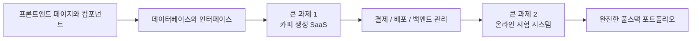

# 초중급 개발

**초중급 개발** 단계에 오신 것을 환영합니다! 여기에서는 프론트엔드 컴포넌트화, 데이터베이스 설계, 백엔드 API 개발 및 배포까지 풀스택 개발에 깊이 파고듭니다.

## 배울 내용

### 프론트엔드 개발

현대적인 프론트엔드 개발을 마스터하고 컴포넌트 라이브러리와 디자인 도구 사용법을 배웁니다:

<NavGrid>
  <NavCard
    href="/ko-kr/stage-2/frontend/lovart-assets/"
    title="Lovart에서 시작: 나만의 에셋 생산 Agent 만들기"
    description="NanoBanana와 Lovart를 활용해 고품질 디자인 에셋을 대량 생성하고, 의도 인식 기반의 그림 Agent를 직접 구축합니다"
  />
  <NavCard
    href="/ko-kr/stage-2/frontend/figma-mastergo/"
    title="Figma와 MasterGo 입문"
    description="전문 UI 디자인 도구의 기본 조작과 디자인에서 코드까지의 협업 워크플로우를 마스터합니다"
  />
  <NavCard
    href="/ko-kr/stage-2/frontend/ui-design/"
    title="첫 번째 현대적 애플리케이션 만들기 - UI 디자인"
    description="현대적 애플리케이션의 UI 디자인 기초를 배웁니다"
  />
  <NavCard
    href="/ko-kr/stage-2/frontend/multi-product-ui/"
    title="UI 디자인 가이드라인을 참고하여 페이지와 버튼 디자인하기"
    description="주요 UI 디자인 가이드라인을 배우고 더 명확한 페이지 계층과 버튼 계층을 설계합니다"
  />
  <NavCard
    href="/ko-kr/stage-2/frontend/llm-skills-beautiful/"
    title="LLM과 Skills로 인터페이스를 아름답게 만들기"
    description="프롬프트와 플러그인 실전을 통해 AI가 아름답고 독특한 인터페이스를 생성하도록 합니다"
  />
  <NavCard
    href="/ko-kr/stage-2/frontend/hogwarts-portraits/"
    title="함께 호그와트 초상화 만들기"
    description="실습 프로젝트: AI 생성 이미지를 결합하여 인터랙티브한 호그와트 초상화 애플리케이션을 구축합니다"
  />
  <NavCard
    href="/ko-kr/stage-2/frontend/design-to-code/"
    title="디자인 프로토타입에서 프로젝트 코드까지"
    description="디자인 도구의 프로토타입을 브라우저에서 실제로 실행되는 프론트엔드 코드로 변환하는 방법을 배웁니다"
  />
  <NavCard
    href="/ko-kr/stage-2/frontend/modern-component-library/"
    title="현대적 컴포넌트 라이브러리로 인터페이스 업데이트하기"
    description="컴포넌트 라이브러리를 사용하여 전문적인 인터페이스를 빠르게 구축하는 방법을 배웁니다"
  />
</NavGrid>

### 백엔드 개발

API 설계, 데이터베이스 관리 및 애플리케이션 배포 전략을 배웁니다:

<NavGrid>
  <NavCard
    href="/ko-kr/stage-2/backend/git-workflow/"
    title="Git과 Github 사용법 배우기"
    description="Git 버전 관리 시스템의 핵심 조작과 협업 워크플로우를 마스터합니다"
  />
  <NavCard
    href="/ko-kr/stage-2/backend/database-supabase/"
    title="데이터베이스에서 Supabase까지"
    description="관계형 데이터베이스 기초를 마스터하고 현대적인 BaaS 플랫폼인 Supabase 사용법을 배웁니다"
  />
  <NavCard
    href="/ko-kr/stage-2/backend/ai-interface-code/"
    title="애플리케이션 백엔드 인터페이스 설계 및 개발"
    description="AI를 활용하여 백엔드 인터페이스 코드와 표준 인터페이스 문서를 생성하여 개발 효율성을 높입니다"
  />
  <NavCard
    href="/ko-kr/stage-2/backend/zeabur-deployment/"
    title="제품 프로토타입 출시하기"
    description="Zeabur를 사용하여 풀스택 애플리케이션을 클라우드에 빠르게 배포하는 방법을 배웁니다"
  />
  <NavCard
    href="/ko-kr/stage-2/backend/modern-cli/"
    title="IDE에서 CLI AI 프로그래밍 도구까지"
    description="현대적인 CLI 도구를 탐색하고 명령줄 환경에서의 개발 경험을 향상시킵니다"
  />
  <NavCard
    href="/ko-kr/stage-2/backend/stripe-payment/"
    title="Stripe 등 결제 시스템 통합 방법"
    description="실습: 애플리케이션에 Stripe 결제 기능을 통합하여 수익화를 실현합니다"
  />
</NavGrid>

### 큰 과제

앞선 장에서는 "부품"을 배우는 것이었고, 큰 과제에서는 "부품을 조립해 작동하고, 시연할 수 있고, 출시할 수 있는 제품으로 만드는 방법"을 배웁니다.

**큰 과제 1 -> 큰 과제 2** 순서로 진행하는 것을 권장합니다:

- **큰 과제 1** 에서는 현대 SaaS에서 가장 흔한 메인 체인인 로그인, 생성, 데이터베이스, 결제, 관리 백엔드를 먼저 경험합니다.
- **큰 과제 2** 에서는 비즈니스 시스템에 더 가까운 시나리오인 역할 권한, 문제 은행, 시험, 제출 기록, 관리 콘솔을 다룹니다.

어떤 것을 먼저 해야 할지 모르겠다면 아래 비교 표를 참고하세요:

| 프로젝트 | 중점 연습 내용 | 가장 적합한 대상 | 최종 산출물 |
|------|------|------|------|
| 큰 과제 1: 카피 생성 웹사이트 | SaaS 페이지 구조, 사용자 로그인, AI 생성, Stripe 결제, 백엔드 관리 | 처음으로 완전한 상업화 웹사이트를 만드는 사람 | 가입, 생성, 결제, 관리가 가능한 SaaS 프로토타입 |
| 큰 과제 2: 온라인 시험 및 관리 시스템 | 역할 권한, 문제 은행 모델링, 시험 프로세스, 제출 기록, 채점 및 통계 | "비즈니스 시스템"을 진정으로 완성하고 싶은 사람 | 학생용 및 관리자용 시험 플랫폼 |

어떤 과제를 선택하든, 큰 과제에서는 최소 다음 3가지 산출물을 준비하는 것을 권장합니다:

- 실행 가능한 프로젝트 저장소
- 접근 가능한 데모 링크
- README와 데모 영상 하나

<NavGrid>
  <NavCard
    href="/ko-kr/stage-2/assignments/copywriting-platform-supabase/"
    title="큰 과제 1: 첫 번째 SaaS 풀스택 애플리케이션 - 카피 생성 웹사이트"
    description="AI 마케팅 카피 워크벤치를 처음부터 구축하며 로그인, 생성, 결제, 백엔드 관리를 포함합니다"
  />
  <NavCard
    href="/ko-kr/stage-2/assignments/exam-management-express/"
    title="큰 과제 2: 온라인 시험 및 관리 시스템"
    description="자동 출제, 답안 작성, 백엔드 관리를 지원하는 온라인 시험 시스템을 구축합니다"
  />
</NavGrid>

위의 두 메인 프로젝트를 완료했거나, 자신의 기술 방향에 맞춰 포트폴리오를 만들고 싶다면 아래 확장 주제 중 하나를 선택해 심화할 수 있습니다:

<NavGrid>
  <NavCard
    href="/ko-kr/stage-2/assignments/modern-landing-page/"
    title="확장 과제: 현대적 웹 랜딩 페이지 엔지니어링"
    description="가치 표현, 전환 경로, CTA 디자인 및 기본 트래킹을 연습하여 트래픽을 실제로 받아낼 수 있는 페이지를 만듭니다"
  />
  <NavCard
    href="/ko-kr/stage-2/assignments/custom-dify-agent-platform/"
    title="확장 과제: Dify 유사 에이전트 오케스트레이션 플랫폼"
    description="에이전트 관리, 대화, 로그 및 권한 제어를 구현하여 최소 기능의 AI 플랫폼을 만듭니다"
  />
  <NavCard
    href="/ko-kr/stage-2/assignments/travel-planning-agent-platform/"
    title="확장 과제: 스마트 여행 계획 Agent 오케스트레이션 플랫폼"
    description="구조화된 입력, Agent 오케스트레이션 및 과거 계획 관리를 중심으로 실행 가능한 AI 여행 계획 제품을 만듭니다"
  />
  <NavCard
    href="/ko-kr/stage-2/assignments/movie-recommendation-springboot/"
    title="확장 과제: Spring Boot 영화 추천 시스템"
    description="Spring Boot, 평가/즐겨찾기 및 설명 가능한 추천을 결합하여 완전한 추천 시스템 프로토타입을 완성합니다"
  />
  <NavCard
    href="/ko-kr/stage-2/assignments/simple-grocery-microservices/"
    title="확장 과제: 생선 식료품 전자상거래 마이크로서비스 시스템"
    description="서비스 분할, 게이트웨이 전달, 재고 및 주문 협력을 연습하며 모놀리식에서 마이크로서비스로의 엔지니어링 사고를 경험합니다"
  />
  <NavCard
    href="/ko-kr/stage-2/assignments/traffic-data-visualization-go/"
    title="확장 과제: Go 교통 데이터 분석 및 시각화 플랫폼"
    description="데이터 수집, 윈도우 집계부터 트렌드 대시보드 및 알림까지 완전한 데이터 제품 프로토타입을 만듭니다"
  />
</NavGrid>

### AI 역량 확장

<NavGrid>
  <NavCard
    href="/ko-kr/stage-2/ai-capabilities/dify-knowledge-base/"
    title="Dify 입문과 지식 베이스 통합"
    description="Dify를 사용하여 AI 애플리케이션을 구축하고 프라이빗 지식 베이스를 통합하는 방법을 배웁니다"
  />
</NavGrid>

## 대상자

- 프로그래밍 기초가 있고 체계적으로 풀스택 개발을 배우고 싶은 개발자
- 제품 관리자에서 풀스택 엔지니어로 전환하고 싶은 학습자
- 현대적인 개발 도구와 워크플로우를 마스터하고 싶은 초중급 개발자
- 완전한 제품을 독립적으로 개발하고 싶은 창업가

## 전제 조건

- "초보자 및 제품 프로토타입" 단계를 완료했거나 동등한 기초 지식을 보유하고 있습니다
- 기본적인 HTML/CSS/JavaScript 개념을 이해하고 있습니다
- AI 프로그래밍 도구에 대한 기초 지식이 있습니다

풀스택 개발에 깊이 파고들 준비가 되셨나요? 왼쪽 탐색을 클릭하여 학습을 시작하세요!
