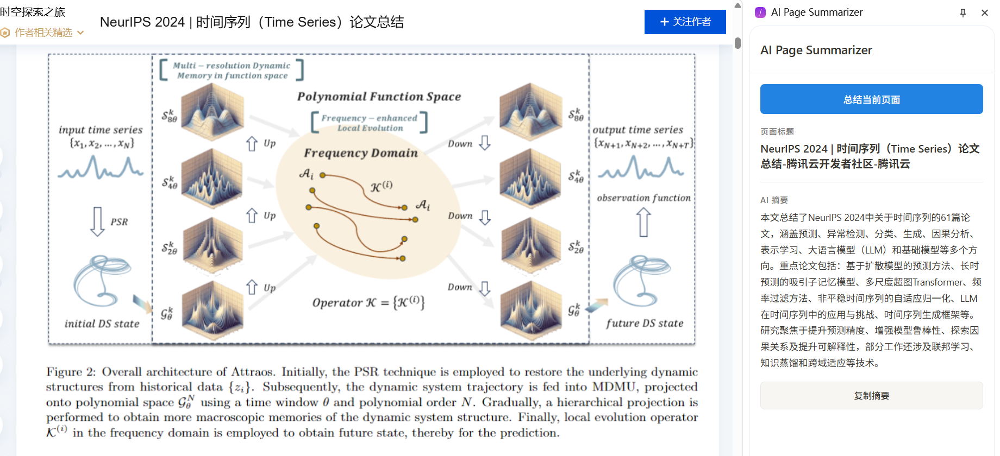
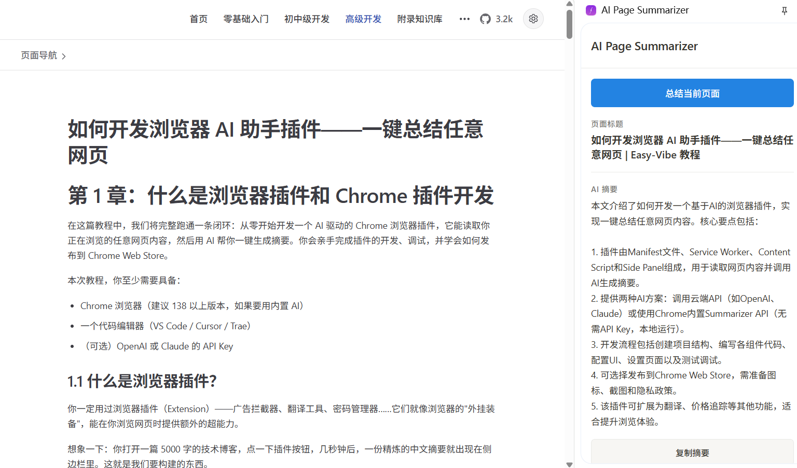
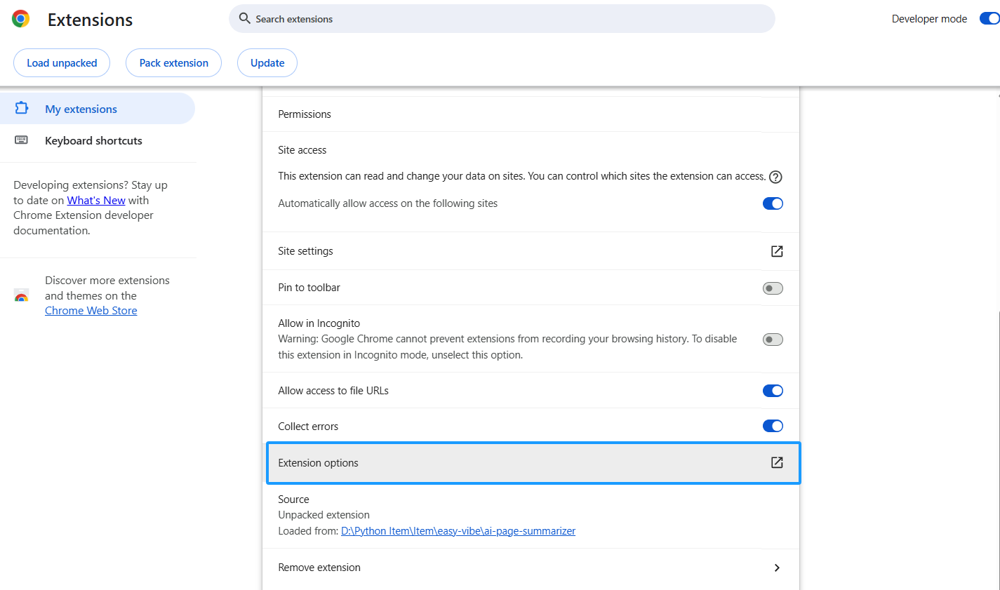
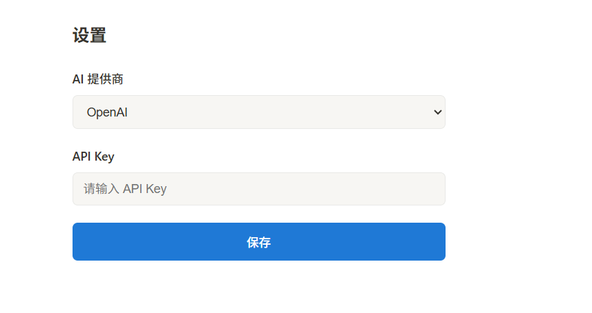
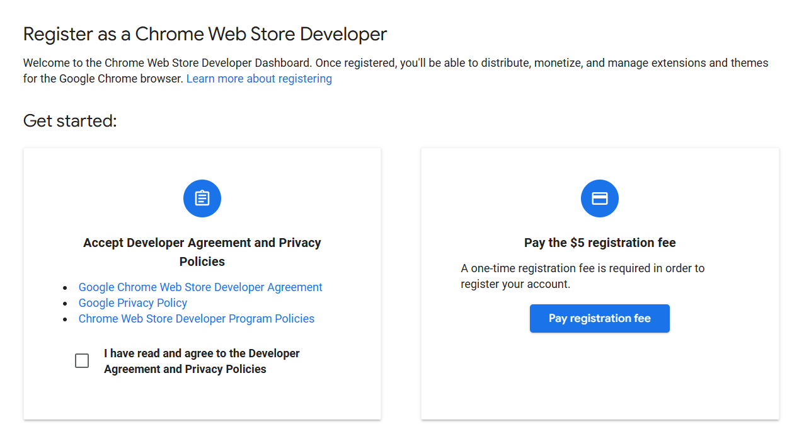

# 브라우저 AI 어시스턴트 확장 프로그램 만들기: 원클릭으로 모든 웹페이지 요약

# 1장: 브라우저 확장 프로그램과 Chrome 확장 프로그램 개발이란

이 튜토리얼에서는 하나의 완전한 사이클을 완성할 것입니다: AI 기반 Chrome 브라우저 확장 프로그램을 처음부터 구축합니다. 탐색 중인 모든 웹페이지의 내용을 읽고, AI를 사용하여 원클릭으로 요약을 생성할 수 있습니다. 확장 프로그램 개발, 디버깅을 직접 완료하고, Chrome 웹 스토어에 게시하는 방법을 배웁니다.

이 튜토리얼을 위해 최소한 다음이 필요합니다:

- Chrome 브라우저(내장 AI를 사용하려면 버전 138 이상 권장)
- 코드 편집기(VS Code / Cursor / Trae)
- (선택 사항) OpenAI 또는 Claude API Key

## 1.1 브라우저 확장 프로그램이란?

광고 차단기, 번역 도구, 비밀번호 관리자 같은 브라우저 확장 프로그램을 분명히 사용해 본 적이 있을 것입니다. 이들은 브라우저를 위한 "추가 장비"와 같아서, 웹 서핑 중 초능력을 부여합니다.

상상해 보세요: 5,000단어짜리 기술 블로그 게시물을 열고, 확장 프로그램 버튼을 한 번 클릭하면, 몇 초 후 사이드 패널에 간결한 요약이 나타납니다. 바로 그것을 만들 것입니다.



<!--  -->

## 1.2 Chrome 확장 프로그램의 기본 아키텍처

Chrome 확장 프로그램(Manifest V3 기반)은 여러 핵심 부분으로 구성되며, 각각 자체 역할이 있습니다:

* **Manifest 파일(`manifest.json`)**: 확장 프로그램의 "신분증"으로, 이름, 권한, 진입 파일 등을 선언합니다.
* **Service Worker(백그라운드 스크립트)**: 확장 프로그램의 "두뇌"로, 이벤트를 처리하고 백그라운드에서 API를 호출합니다. 지속적으로 실행되지 않고 필요할 때 시작됩니다.
* **Content Script**: 확장 프로그램의 "눈"으로, 웹페이지에 주입되어 DOM 내용을 읽을 수 있습니다.
* **Side Panel**: 확장 프로그램의 "얼굴"로, 브라우저 오른쪽에 UI를 표시하여 사용자가 AI 요약 결과를 봅니다.
* **Options Page**: 사용자가 API Key 및 관련 설정을 구성할 수 있게 합니다.

작업 흐름은 다음과 같습니다:

```text
사용자가 확장 프로그램 아이콘 클릭
    -> 사이드 패널 열림
    -> 사용자가 "요약" 버튼 클릭
    -> 사이드 패널이 Service Worker에 알림
    -> Service Worker가 Content Script에게 페이지 텍스트 읽기를 요청
    -> Content Script가 페이지 내용 반환
    -> Service Worker가 내용을 AI API로 전송
    -> AI가 요약 반환
    -> Service Worker가 요약을 사이드 패널로 전송하여 표시
```


<!--  -->

## 1.3 두 가지 AI 옵션: 클라우드 API vs 브라우저 내장 AI

확장 프로그램은 두 가지 방법으로 AI 기능에 접근할 수 있습니다:

**옵션 A: 클라우드 AI API 호출(OpenAI / Claude)**

* 장점: 강력한 모델 능력, 모든 기기 지원
* 단점: API Key 필요, 인터넷 필요, 사용 비용 발생
* 적합한 경우: 고품질 요약 및 더 복잡한 내용 처리

**옵션 B: Chrome 내장 AI(Summarizer API) 사용**

Chrome 138부터 Google이 Gemini Nano 기반의 AI 기능을 브라우저에 직접 내장했습니다. 그중 하나가 **Summarizer API**로 - 완전히 로컬에서 실행되며, API Key가 필요 없고, 인터넷이 필요 없으며, 완전히 무료입니다.

* 장점: 무료, 프라이버시 친화적, API Key 불필요
* 단점: Chrome 138 이상 필요, 더 좋은 하드웨어 필요(VRAM 4GB 이상 또는 RAM 16GB 이상), 모델 능력은 클라우드 AI보다 약함
* 적합한 경우: 프라이버시를 중시하고, 비용을 지불하고 싶지 않으며, 하드웨어가 충분한 사용자

**이 튜토리얼은 두 가지 옵션을 모두 구현**하며, 상황에 따라 선택할 수 있습니다.

## 1.4 튜토리얼 로드맵

**"AI Page Summarizer"**라는 Chrome 확장 프로그램을 처음부터 구축하며, 다음 단계를 따릅니다:

1. **확장 프로그램 뼈대 구축**: Manifest V3 프로젝트 구조를 생성하고 Chrome에 로드
2. **핵심 기능 구현**: Content Script가 페이지를 읽고 + Service Worker가 AI API를 호출하고 + 사이드 패널에 결과 표시
3. **Chrome 내장 AI 통합**: Summarizer API를 사용하여 무료 로컬 요약 제공
4. **테스트 및 디버깅**: Chrome 확장 프로그램 디버깅 기법 학습
5. **Chrome 웹 스토어에 게시**: 패키징 및 심사 제출

# 2장: 확장 프로그램 뼈대 구축

## 2.1 프로젝트 구조 생성

AI 코딩 어시스턴트(Cursor / Trae / Claude Code)를 열고 `ai-page-summarizer`라는 빈 폴더를 만든 후, 채팅 상자에 다음을 입력합니다:

```text
Manifest V3를 사용하는 Chrome 브라우저 확장 프로그램 프로젝트를 만들어 줘.
프로젝트 이름은 ai-page-summarizer이고, 기능은 AI로 웹페이지 내용을 요약하는 것이야.
다음 파일 구조를 만들어 줘:

ai-page-summarizer/
├── manifest.json          # MV3 manifest 파일
├── background.js          # Service Worker 백그라운드 스크립트
├── content.js             # Content script(웹페이지 텍스트 읽기)
├── sidepanel.html         # 사이드 패널 HTML
├── sidepanel.js           # 사이드 패널 논리
├── sidepanel.css          # 사이드 패널 스타일
├── options.html           # 설정 페이지
├── options.js             # 설정 페이지 논리
└── icons/                 # 아이콘 폴더

manifest.json 요구 사항:
1. manifest_version: 3
2. 권한: storage, activeTab, scripting, sidePanel
3. 백그라운드에 service_worker: "background.js" 사용
4. 기본 경로가 sidepanel.html인 side_panel 구성
5. action에 기본 아이콘과 제목 구성
```

AI가 전체 프로젝트 뼈대를 생성합니다. 각 파일이 하는 일을 살펴보겠습니다.

## 2.2 `manifest.json`: 확장 프로그램의 "신분증"

Chrome 확장 프로그램에서 가장 중요한 파일입니다. 브라우저에게 확장 프로그램이 무엇인지, 어떤 권한이 필요한지, 어떤 구성 요소를 포함하는지 알려줍니다:

```json
{
  "manifest_version": 3,
  "name": "AI Page Summarizer",
  "version": "1.0",
  "description": "AI를 사용하여 모든 웹페이지를 원클릭으로 요약합니다",
  "permissions": ["storage", "activeTab", "scripting", "sidePanel"],
  "background": {
    "service_worker": "background.js"
  },
  "action": {
    "default_title": "AI Page Summarizer",
    "default_icon": {
      "16": "icons/icon-16.png",
      "48": "icons/icon-48.png",
      "128": "icons/icon-128.png"
    }
  },
  "side_panel": {
    "default_path": "sidepanel.html"
  },
  "options_page": "options.html",
  "icons": {
    "16": "icons/icon-16.png",
    "48": "icons/icon-48.png",
    "128": "icons/icon-128.png"
  }
}
```

**권한 설명:**

* `storage`: 확장 프로그램이 사용자의 API Key와 같은 데이터를 저장할 수 있게 함
* `activeTab`: 확장 프로그램이 사용자가 보고 있는 현재 탭에 접근할 수 있게 함(사용자 상호작용 후에만 가능하므로 매우 안전)
* `scripting`: 확장 프로그램이 페이지에 스크립트를 주입하여 내용을 읽을 수 있게 함
* `sidePanel`: 확장 프로그램이 Chrome 사이드 패널 API를 사용할 수 있게 함


<!--  -->

## 2.3 아이콘 준비

Chrome 확장 프로그램은 세 가지 크기의 아이콘이 필요합니다: 16x16, 48x48, 128x128. AI에게 생성을 요청할 수 있습니다:

```text
세 가지 간단한 Chrome 확장 프로그램 아이콘(16x16, 48x48, 128x128)을 만들어 줘.
둥근 직사각형, 그라데이션 보라색 배경, 중앙에 흰색 AI 번개 기호.
icons/ 디렉토리에 icon-16.png, icon-48.png, icon-128.png로 저장해 줘.
```

## 2.4 확장 프로그램을 Chrome에 로드

코드를 작성하기 전에 이 "빈 껍데기" 확장 프로그램을 먼저 Chrome에 로드하여, 이후 모든 변경 사항을 즉시 미리 볼 수 있게 합니다:

1. Chrome을 열고 주소창에 `chrome://extensions/`를 입력
2. 오른쪽 상단에서 **개발자 모드** 활성화
3. **압축해제된 확장 프로그램 로드** 클릭
4. `ai-page-summarizer` 폴더 선택

확장 프로그램이 목록에 나타나고, Chrome 툴바에 아이콘이 표시됩니다.


<!--  -->

> **팁**: 코드를 변경할 때마다 `chrome://extensions/`로 돌아가서 확장 프로그램 카드의 **새로고침 버튼(🔄)**을 클릭하여 업데이트하세요.

# 3장: 핵심 기능 구현 - 페이지 읽기 + AI 요약

## 3.1 Content Script: 페이지 텍스트 읽기

Content Script는 웹페이지에 주입되는 스크립트입니다. 페이지 DOM에 직접 접근할 수 있습니다. 이를 사용하여 페이지 텍스트를 추출합니다.

AI에게 `content.js`를 작성하라고 요청합니다:

```text
content.js를 다음 기능으로 작성해 줘:
1. Service Worker의 메시지를 수신 대기
2. "getPageContent" 메시지를 받으면 현재 페이지 텍스트 내용을 추출
3. 추출 논리: document.body.innerText를 가져오고, 페이지 제목과 URL도 가져옴
4. sendResponse를 통해 추출된 내용 반환
```

AI가 다음과 같은 코드를 생성합니다:

```javascript
// content.js
chrome.runtime.onMessage.addListener((request, sender, sendResponse) => {
  if (request.action === 'getPageContent') {
    const content = document.body.innerText || document.body.textContent
    sendResponse({
      content: content.trim(),
      title: document.title,
      url: window.location.href
    })
  }
  return true // 메시지 채널 열어두기
})
```

## 3.2 Service Worker: AI API 호출

Service Worker는 확장 프로그램의 "두뇌"입니다. 구성 요소 간의 통신을 조정하고 외부 AI API를 호출합니다.

AI에게 `background.js`를 작성하라고 요청합니다:

```text
background.js를 다음 기능으로 작성해 줘:
1. 사용자가 확장 프로그램 아이콘을 클릭하면 사이드 패널 열기
2. 사이드 패널에서 "summarize" 메시지를 수신 대기
3. 메시지를 받으면 현재 탭의 content script에 "getPageContent"를 보내 페이지 내용 가져오기
4. 페이지 내용을 받은 후 chrome.storage.local에서 사용자가 구성한 API Key와 모델 선택 읽기
5. 설정에 따라 해당 AI API 호출(OpenAI와 Claude 지원)
6. AI 요약을 사이드 패널로 전송

OpenAI의 경우 https://api.openai.com/v1/chat/completions를 호출하고 모델 gpt-4o-mini 사용
Claude의 경우 https://api.anthropic.com/v1/messages를 호출하고 모델 claude-sonnet-4-20250514 사용
시스템 프롬프트: 다음 웹페이지 내용을 한국어로 요약하고, 핵심 포인트를 추출하여 300자 이내로 유지하세요.
```

핵심 코드는 다음과 같습니다:

```javascript
// background.js

// 사용자가 아이콘을 클릭하면 사이드 패널 열기
chrome.sidePanel.setPanelBehavior({ openPanelOnActionClick: true })

// 사이드 패널에서 메시지 수신 대기
chrome.runtime.onMessage.addListener((request, sender, sendResponse) => {
  if (request.action === 'summarize') {
    handleSummarize(request.tabId).then(sendResponse)
    return true // 비동기 응답
  }
})

async function handleSummarize(tabId) {
  // 1. 페이지 내용 가져오기
  const [response] = await chrome.tabs.sendMessage(tabId, {
    action: 'getPageContent'
  })

  // 2. 사용자 설정 읽기
  const { apiKey, provider } = await chrome.storage.local.get([
    'apiKey', 'provider'
  ])

  if (!apiKey) {
    return { error: '먼저 설정 페이지에서 API Key를 구성해 주세요' }
  }

  // 3. AI API 호출
  const summary = provider === 'claude'
    ? await callClaude(response.content, apiKey)
    : await callOpenAI(response.content, apiKey)

  return { summary, title: response.title }
}
```


<!--  -->

## 3.3 사이드 패널 UI: 요약 결과 표시

사이드 패널은 사용자의 주요 인터랙션 UI입니다. AI에게 사이드 패널의 HTML, CSS, JS를 작성하라고 요청합니다:

```text
사이드 패널을 위한 세 가지 파일을 작성해 줘:

sidepanel.html:
- 상단에 플러그인 이름 "AI Page Summarizer" 표시
- 파란색 "현재 페이지 요약" 버튼
- 로딩 애니메이션 영역(기본 숨김)
- 페이지 제목과 AI 요약을 표시하는 결과 표시 영역
- 하단에 "요약 복사" 버튼

sidepanel.css:
- 깔끔한 현대 디자인, Notion 타이포그래피와 유사
- 사이드 패널에 맞게 너비 조정
- 버튼에 호버 효과
- CSS로 로딩 애니메이션 구현

sidepanel.js:
- "요약" 버튼을 클릭하면 현재 탭 ID 가져오기
- background.js에 요약 메시지 전송
- 로딩 애니메이션 표시
- 결과를 받으면 로딩 숨기고 요약 표시
- "복사" 버튼에서 navigator.clipboard.writeText를 사용하여 텍스트 복사
```



<!--  -->

## 3.4 설정 페이지: API Key 구성

사용자가 자신의 API Key를 입력할 장소가 필요합니다. AI에게 설정 페이지를 작성하라고 요청합니다:

```text
options.html과 options.js를 작성해 줘:
- AI 제공자를 선택하는 드롭다운(OpenAI / Claude)
- API Key를 위한 비밀번호 입력(type="password")
- "저장" 버튼
- chrome.storage.local.set로 설정 저장
- 페이지 로드 시 저장된 설정을 storage에서 읽어 폼에 채우기
- 저장 후 "설정이 저장되었습니다" 표시
```

> **보안 알림**: API Key는 `chrome.storage.local`에 저장되며 로컬 기기에만 보관됩니다. 하지만 이 확장 프로그램을 Chrome 웹 스토어에 게시하여 다른 사람이 사용하게 하려면, API Key가 클라이언트 측에 직접 노출되지 않도록 백엔드 프록시 서버를 구축하는 것이 더 안전합니다.




<!--  -->

# 4장: Chrome 내장 AI 사용(API Key 불필요)

Chrome 138부터 Google이 **Gemini Nano** 기반의 AI 기능을 브라우저에 직접 내장했습니다. 우리 사례에 가장 적합한 것은 **Summarizer API**로 - 완전히 로컬에서 실행되며, API Key가 필요 없고, 인터넷이 필요 없으며, 무료입니다.

## 4.1 브라우저 지원 확인

내장 AI에는 하드웨어 요구 사항이 있습니다:

* 데스크톱 Chrome 138 이상(Windows 10 이상, macOS 13 이상, Linux, ChromeOS)
* 22GB 사용 가능한 저장 공간(모델 다운로드용)
* GPU VRAM 4GB 이상, 또는 시스템 RAM 16GB 이상에 CPU 코어 4개 이상

Chrome 주소창에 `chrome://flags`를 입력하고, Summarization 관련 플래그를 검색하여 **Enabled**인지 확인합니다.
* Chrome 131-137에서는 이 스위치가 Summarization API라고 합니다.
* Chrome 138-144에서는 Summarization API for Gemini Nano로 이름이 변경되었습니다.
* Chrome 145 이상에서는 Summarization API for Gemini Nano가 제거되었고, 그 요약 기능이 Prompt API for Gemini Nano에 통합되었습니다.


<!--  -->

## 4.2 Summarizer API 사용

AI에게 `background.js`에 내장 AI 지원을 추가하라고 요청합니다:

```text
background.js에 Chrome 내장 Summarizer API 지원을 추가해 줘:
1. summarizeWithBuiltinAI 함수 추가
2. 먼저 Summarizer.availability()가 'readily-available'을 반환하는지 확인
3. 사용 가능한 경우, summarizer 인스턴스를 생성하고 type을 'key-points', format을 'markdown', length를 'medium'으로 구성
4. summarizer.summarize()를 호출하여 요약
5. handleSummarize에서 provider === 'builtin'에 대한 분기 추가
```

핵심 코드:

```javascript
async function summarizeWithBuiltinAI(text) {
  // 가용성 확인
  const availability = await Summarizer.availability()
  if (availability !== 'readily-available') {
    throw new Error('Chrome 내장 AI를 사용할 수 없습니다. 브라우저 버전과 하드웨어 요구 사항을 확인하세요.')
  }

  // 요약기 생성
  const summarizer = await Summarizer.create({
    type: 'key-points',
    format: 'markdown',
    length: 'medium'
  })

  // 요약 실행
  const summary = await summarizer.summarize(text, {
    context: 'This is a webpage article'
  })

  return summary
}
```

## 4.3 설정 페이지 업데이트

`options.html`의 제공자 드롭다운에 **"Chrome 내장 AI(무료, API Key 불필요)"** 옵션을 추가합니다. 사용자가 이를 선택하면 API Key 입력이 더 이상 필요 없으므로 숨깁니다.

```text
options.html과 options.js를 수정해 줘:
1. 제공자 드롭다운에 "Chrome 내장 AI(무료, API Key 불필요)" 옵션을 추가하고, 값을 "builtin"으로 설정
2. builtin이 선택되면 API Key 입력 숨기기
3. OpenAI 또는 Claude가 선택되면 API Key 입력 표시
```


<!--  -->

# 5장: 테스트 및 디버깅

## 5.1 로컬 테스트 워크플로

Chrome 확장 프로그램 디버깅은 일반 웹페이지 디버깅과 약간 다릅니다:

**Service Worker 디버깅:**
1. `chrome://extensions/` 열기
2. 확장 프로그램을 찾아 **Service Worker** 링크 클릭
3. 전용 DevTools 창이 열리며, `console.log` 출력과 네트워크 요청을 볼 수 있음

**사이드 패널 디버깅:**
1. 사이드 패널 열기
2. 사이드 패널 내용을 우클릭
3. **검사** 선택
4. 사이드 패널의 DevTools가 열림

**Content Script 디버깅:**
1. 아무 웹페이지에서 F12로 DevTools 열기
2. Console 패널에서 왼쪽 상단의 실행 컨텍스트 드롭다운 클릭
3. 확장 프로그램 이름 선택
4. Content Script의 `console` 출력을 볼 수 있음


<!--  -->

## 5.2 일반적인 문제 해결

| 문제 | 가능한 원인 | 해결 방법 |
|------|---------|---------|
| 아이콘을 클릭해도 반응 없음 | Service Worker 오류 | Service Worker DevTools Console 확인 |
| 페이지 내용을 가져올 수 없음 | Content Script가 주입되지 않음 | 페이지를 새로고침하고 다시 시도, manifest의 `matches` 설정 확인 |
| API 호출 실패 | API Key가 잘못되었거나 만료됨 | 설정 페이지에서 API Key 다시 입력 |
| 사이드 패널이 비어 있음 | `sidepanel.html` 경로 오류 | manifest의 `side_panel.default_path` 확인 |


# 6장: Chrome 웹 스토어에 게시 (선택 사항)

확장 프로그램을 다른 사람과 공유하고 싶다면, Chrome 웹 스토어에 게시할 수 있습니다.

## 6.1 게시 준비

1. **개발자 계정 등록**: [Chrome 웹 스토어 개발자 대시보드](https://chrome.google.com/webstore/devconsole)를 방문하여 일회성 $5 등록 비용 지불
2. **2단계 인증 활성화**: Google 계정에서 게시 전에 2단계 인증을 활성화해야 함
3. **자산 준비**:
   * 확장 프로그램 아이콘: 128x128 PNG
   * 최소 하나의 스크린샷: 1280x800 권장
   * 상세한 기능 설명
   * 프라이버시 정책 설명(확장 프로그램이 사용자 데이터를 처리하는 경우)

## 6.2 패키징 및 업로드

1. 확장 프로그램 폴더를 `.zip` 파일로 압축(`.crx`가 아님)
2. 개발자 대시보드에서 **새 항목** 클릭
3. `.zip` 파일 업로드
4. 스토어 정보 작성(이름, 설명, 스크린샷, 카테고리 등)
5. 프라이버시 관행 작성(확장 프로그램이 수집하는 사용자 데이터 선언)
6. **심사 제출** 클릭

Google이 제출된 확장 프로그램을 심사하며, 보통 영업일 기준 며칠이 걸립니다. 요청하는 권한이 적고 설명이 명확할수록 심사가 더 빠르게 진행됩니다.




<!--  -->

# 7장: 마무리

축하합니다! AI 기반 브라우저 확장 프로그램을 처음부터 구축했습니다. 한번 되돌아 보겠습니다:

1. Chrome 확장 프로그램의 Manifest V3 아키텍처 이해
2. Content Script를 사용하여 웹페이지 내용 읽기
3. Service Worker를 사용하여 AI API를 호출하고 요약 생성
4. Side Panel을 사용하여 요약 결과 표시
5. API Key 없이 Chrome 내장 AI를 사용하는 방법도 학습

브라우저 확장 프로그램 개발은 매우 흥미로운 분야입니다 - 인터넷의 모든 웹페이지를 "강화"할 수 있습니다. 페이지 요약 외에도, 유사한 아키텍처로 더 많은 것을 구축할 수 있습니다:

**고급 방향:**

* **번역 어시스턴트**: 외국어 웹페이지를 원클릭으로 한국어로 번역
* **읽기 주석**: 페이지를 강조 표시하고 주석을 달아 클라우드에 저장
* **가격 추적**: 전자상거래 페이지의 가격 변동을 모니터링하고 사용자에게 알림
* **코드 설명기**: GitHub에서 코드를 선택하면 AI가 자동으로 설명

Chrome 내장 AI의 등장으로 진입 장벽이 더욱 낮아졌습니다 - API Key 없이도 AI 기반 확장 프로그램을 구축할 수 있습니다. 브라우저 AI 기능이 계속 발전함에 따라, 이 분야의 상상력은 더욱 확장될 것입니다.

***브라우저에 초능력을 부여해 보세요!***

# 참고 자료

* [Chrome 확장 프로그램 공식 문서 - Manifest V3](https://developer.chrome.com/docs/extensions/develop/)
* [Chrome 확장 프로그램을 Chrome 웹 스토어에 게시](https://developer.chrome.com/docs/webstore/publish?hl=zh-cn)
* [Chrome Side Panel API](https://developer.chrome.com/docs/extensions/reference/api/sidePanel)
* [Chrome 내장 AI - Summarizer API](https://developer.chrome.com/docs/ai/summarizer-api)
* [Chrome 내장 AI - Prompt API](https://developer.chrome.com/docs/ai/prompt-api)
* [OpenAI API 문서](https://platform.openai.com/docs/api-reference)
* [Anthropic Claude API 문서](https://docs.anthropic.com/en/docs/)
* [Anthropic Claude API 문서](https://developer.chrome.com/docs/webstore/publish?hl=zh-cn)
