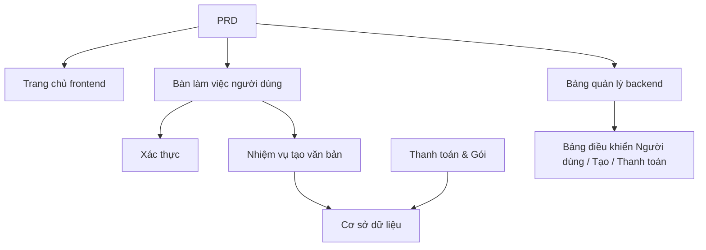

# Thực chiến phát triển SaaS AI tạo văn bản marketing

## Tổng quan

Dự án thực chiến này yêu cầu bạn xoay quanh một PRD thực tế, hoàn thành từ con số không một sản phẩm SaaS AI tạo văn bản marketing dành cho nhà phát triển độc lập và đội nhóm nội dung. Bạn sẽ sử dụng Supabase làm dịch vụ backend, Stripe làm hệ thống thanh toán, hoàn thành toàn bộ quá trình từ phân tích yêu cầu đến triển khai lên mạng.

Đây là phần thực chiến tổng hợp của Stage 2. Trong các chương trước, bạn đã học riêng biệt các kỹ năng đơn lẻ như搭建 trang frontend, phát triển interface backend, thao tác cơ sở dữ liệu, tích hợp thanh toán — dự án này yêu cầu bạn kết nối tất cả lại, bàn giao một nguyên mẫu sản phẩm có thể chạy được.

## Kiến thức tiên quyết

Trước khi bắt đầu dự án này, bạn nên đã nắm vững các nội dung sau:

- Thiết kế trang frontend và sử dụng thư viện component ([Thiết kế UI](../../frontend/ui-design/), [Thư viện component hiện đại](../../frontend/modern-component-library/))
- Thiết kế và phát triển interface backend ([Viết mã interface](../../backend/ai-interface-code/))
- Cơ sở dữ liệu cơ bản và Supabase ([Từ cơ sở dữ liệu đến Supabase](../../backend/database-supabase/))
- Tích hợp thanh toán ([Hệ thống thanh toán Stripe](../../backend/stripe-payment/))
- Quy trình làm việc Git và triển khai ([Học sử dụng Git và Github](../../backend/git-workflow/), [Triển khai ứng dụng web](../../backend/zeabur-deployment/))

## Mục tiêu học tập

Sau khi hoàn thành thực chiến này, bạn sẽ có thể:

1. Đọc và hiểu một PRD thực tế, từ đó trích xuất danh sách nhiệm vụ phát triển
2. Sử dụng AI hỗ trợ tạo trang frontend và interface backend từng bước
3. Sử dụng Supabase thực hiện xác thực người dùng, thao tác cơ sở dữ liệu
4. Tích hợp Stripe thực hiện chức năng đăng ký trả phí
5. Xây dựng trang quản lý backend và hoàn thành tích hợp end-to-end

## Giới thiệu dự án

Sản phẩm bạn cần xây dựng là một SaaS AI tạo văn bản marketing, bao gồm ba hệ thống con:

| Hệ thống con | Trách nhiệm |
|--------|------|
| **Trang chủ frontend** | Giới thiệu sản phẩm, giá cả, FAQ, chuyển đổi đăng ký |
| **Bàn làm việc người dùng** | Nhập thông tin sản phẩm, tạo văn bản, xem lịch sử, nâng cấp gói |
| **Bảng quản lý backend** | Quản lý người dùng, bản ghi tạo, dữ liệu thanh toán, tổng quan vận hành |

Backend sử dụng Supabase cung cấp cơ sở dữ liệu và xác thực, Stripe xử lý thanh toán, mô hình AI tạo văn bản marketing.

::: tip Lối vào PRD
Tài liệu yêu cầu của dự án này trên GitHub: [Xem PRD](https://github.com/datawhalechina/easy-vibe/blob/main/docs/zh-cn/stage-2/assignments/copywriting-platform-supabase/PRD.md)
:::

<div style="margin: 32px 0;">
  <ClientOnly>
    <StepBar :active="0" :items="[
      { title: 'Phân tích yêu cầu', description: 'Đọc PRD, làm rõ trang, chức năng, xác thực, phạm vi thanh toán' },
      { title: 'Xây dựng khung', description: 'Dùng AI tạo ba bộ khung frontend (www / app / admin)' },
      { title: 'Tích hợp backend', description: 'Xác thực Supabase, interface tạo, thanh toán Stripe' },
      { title: 'Tích hợp lên mạng', description: 'Chạy end-to-end, triển khai và chuẩn bị demo' }
    ]" />
  </ClientOnly>
</div>

## Phần 1: Phân tích yêu cầu

### 1.1 Đọc PRD

Mở tài liệu PRD, tập trung trả lời các câu hỏi sau:

- Hệ thống có mấy lối vào? Mỗi cái bao phủ những trang nào?
- Chức năng cốt lõi của mỗi trang là gì?
- Backend bao gồm những module và bảng dữ liệu nào?
- Thiết kế giá gói, quy trình thanh toán, hạn mức miễn phí như thế nào?
- Phạm vi MVP là gì? Phiên bản đầu tiên làm gì, không làm gì?

::: warning
Nếu các câu hỏi trên chưa có câu trả lời rõ ràng, đừng bắt đầu viết code. Hiểu không rõ yêu cầu là nguyên nhân phổ biến nhất dẫn đến phải làm lại.
:::

### 1.2 Xác nhận kiến trúc hệ thống

Dựa trên PRD, sắp xếp kiến trúc tổng thể của hệ thống:



## Phần 2: Xây dựng khung dự án

### 2.1 Tạo trang frontend

Sử dụng AI tạo trước cấu trúc cơ bản và dữ liệu giả cho tất cả các trang.

Tham khảo prompt:

```text
Dựa trên PRD hiện tại, giúp tôi tạo khung frontend cho một SaaS AI tạo văn bản marketing.

Yêu cầu:
1. Chia thành ba lối vào: www, app, admin
2. Trang chủ bao gồm: trang chính, giá cả, FAQ
3. app bao gồm: đăng nhập, đăng ký, bàn làm việc tạo, lịch sử, trang gói
4. admin bao gồm: trang chính backend, quản lý người dùng, bản ghi tạo, đơn hàng thanh toán
5. Trước tiên chỉ tạo cấu trúc trang và dữ liệu giả, không kết nối interface thực
6. Phong cách giống SaaS hiện đại, không giống demo lớp học
```

### 2.2 Hoàn thiện trang cốt lõi

Sau khi搭建 khung, tập trung hoàn thiện trang bàn làm việc tạo văn bản (Dashboard):

```text
Xin tiếp tục hoàn thiện trang /dashboard.

Đây là bàn làm việc AI tạo văn bản marketing.

Các trường form bên trái:
- Tên sản phẩm
- Giới thiệu một câu
- Người dùng mục tiêu
- 3 điểm bán hàng
- Kênh投放 (trang chủ, moments, Xiaohongshu, Douyin, email)

Vùng kết quả bên phải dự phòng:
- Tiêu đề chính
- Tiêu đề phụ
- CTA
- 3 phiên bản văn bản ngắn
- Văn bản dài

Trước tiên dùng mock data chạy thông tương tác.

Yêu cầu:
- Sau khi nhấp "Tạo văn bản" có trạng thái loading
- Vùng kết quả thiết kế trạng thái trống
- Layout responsive, màn hình rộng và hẹp đều hiển thị bình thường
```

### 2.3 Xác minh cấu trúc trang

Kiểm tra từng mục:

- [ ] Route của ba lối vào có độc lập không
- [ ] Số lượng trang có nhất quán với PRD không
- [ ] Layout vùng form và vùng kết quả của Dashboard có hợp lý không
- [ ] Dữ liệu giả đã thể hiện trạng thái UI cơ bản chưa

### Gặp trở ngại?

Nếu bạn bị kẹt ở giai đoạn搭建 frontend, có thể ôn lại các chương sau:

- [Thiết kế UI](../../frontend/ui-design/)
- [Thiết kế trang và nút bấm theo quy chuẩn UI](../../frontend/multi-product-ui/)
- [Làm cho giao diện đẹp hơn bằng LLM và Skills](../../frontend/llm-skills-beautiful/)
- [Từ nguyên mẫu thiết kế đến code dự án](../../frontend/design-to-code/)
- [Cập nhật giao diện với thư viện component hiện đại](../../frontend/modern-component-library/)

## Phần 3: Tích hợp Backend

### 3.1 Kết nối đăng nhập Supabase

```text
Xin coi tôi là người mới bắt đầu hoàn toàn, hướng dẫn tôi từng bước hoàn thành kết nối đăng nhập Supabase.

Cần bạn giúp tôi hoàn thành:
1. Kết nối dự án với Supabase
2. Thực hiện chức năng đăng ký, đăng nhập, đăng xuất
3. Sau khi đăng nhập thành công chuyển đến /dashboard
4. Người dùng chưa đăng nhập truy cập /dashboard, /billing, /admin tự động chuyển đến /login
5. Tạo bảng profiles
6. Sau khi người dùng đăng ký thành công tự động tạo bản ghi trong bảng profiles
7. Bảng profiles bao gồm các trường email, role, plan

Yêu cầu thực hiện:
- Mỗi bước đều nói rõ đang sửa những file nào
- Không hardcode key
- Nơi cần thao tác thủ công trong trang quản lý Supabase hãy đánh dấu rõ
- Sau khi hoàn thành nói rõ cách xác minh đăng ký và đăng nhập
```

### 3.2 Kết nối interface tạo và cơ sở dữ liệu

```text
Xin coi tôi là người mới bắt đầu hoàn toàn, giúp tôi hoàn thành chức năng cốt lõi của trang web: tạo và lưu văn bản marketing.

Hiệu quả mục tiêu:
1. Người dùng điền form tại /dashboard, nhấp "Tạo văn bản"
2. Backend nhận: tên sản phẩm, giới thiệu, người dùng mục tiêu, điểm bán hàng, kênh投放
3. Backend gọi mô hình tạo kết quả
4. Trang hiển thị kết quả tạo
5. Đầu vào và đầu ra đều lưu vào cơ sở dữ liệu
6. Người dùng lần sau vào có thể xem lịch sử

Cần bạn hoàn thành:
- Tạo interface tạo /api/generate
- Tạo bảng generations
- Thiết kế trường đầu vào và đầu ra
- Trang Dashboard đọc lịch sử của người dùng hiện tại

Trải nghiệm người dùng:
- Trạng thái loading của nút
- Thông báo lỗi khi tạo thất bại
- Trạng thái trống khi không có lịch sử

Sau khi hoàn thành xin nói rõ:
- Vị trí file trang frontend
- Vị trí file interface backend
- Vị trí logic ghi dữ liệu vào cơ sở dữ liệu
- Cách kiểm tra liên kết tạo hoàn chỉnh
```

### 3.3 Kết nối thanh toán Stripe

```text
Xin coi tôi là người mới bắt đầu hoàn toàn, giúp tôi thêm thanh toán Stripe đơn giản nhất cho LaunchKit.

Không cần hệ thống phức tạp, trước tiên chạy thông liên kết thanh toán cơ bản nhất.

Cần bạn hoàn thành:
1. Trang /billing hiển thị hai gói free và pro
2. Sau khi người dùng nhấp nâng cấp chuyển đến Stripe Checkout
3. Sau khi thanh toán thành công quay lại trang web
4. Kết quả thanh toán lưu vào bảng subscriptions
5. Đồng bộ cập nhật trường profile.plan
6. Người dùng free giới hạn 3 lần tạo mỗi ngày, người dùng pro không giới hạn

Nguyên tắc thực hiện:
- Trước tiên chạy thông quy trình chính, tạm không xem xét biên phức tạp
- Nơi cần cấu hình trong trang quản lý Stripe hãy viết rõ
- Sau khi hoàn thành nói rõ cách kiểm tra quy trình thanh toán hoàn chỉnh
```

### 3.4 Xây dựng trang quản lý backend

```text
Xin coi tôi là người mới bắt đầu hoàn toàn, giúp tôi làm một trang quản lý backend đơn giản và sử dụng được.

Chỉ dành cho quản trị viên truy cập.

Cần bạn hoàn thành:
1. Chỉ người dùng có role = admin mới có thể truy cập /admin
2. Backend bao gồm 3 Tab: danh sách người dùng, bản ghi tạo, trạng thái đăng ký
3. Danh sách người dùng hiển thị: email, plan, thời gian tạo
4. Bản ghi tạo hiển thị: người dùng, tên sản phẩm, kênh, thời gian tạo
5. Trạng thái đăng ký hiển thị: người dùng, gói, trạng thái thanh toán

Yêu cầu:
- Giao diện đơn giản rõ ràng
- Sử dụng bảng, Tab, Badge của thư viện component hiện có
- Sau khi hoàn thành nói rõ cách đặt tài khoản thành admin
```

### Gặp trở ngại?

Nếu bạn bị kẹt ở giai đoạn phát triển backend, có thể ôn lại các chương sau:

- [Từ cơ sở dữ liệu đến Supabase](../../backend/database-supabase/)
- [Mô hình lớn hỗ trợ viết mã giao diện và tài liệu giao diện](../../backend/ai-interface-code/)
- [Cách tích hợp hệ thống thanh toán Stripe](../../backend/stripe-payment/)

## Phần 4: Tích hợp và lên mạng

### 4.1 Kiểm thử end-to-end

Ít nhất xác minh các kịch bản sau:

- Đăng ký -> Đăng nhập -> Tạo văn bản -> Xem lịch sử -> Nâng cấp gói
- Quản trị viên đăng nhập -> Xem dữ liệu người dùng -> Xem bản ghi tạo -> Xem trạng thái thanh toán

Kiểm tra trước khi triển khai:

```text
Xin coi tôi là người mới bắt đầu hoàn toàn, giúp tôi kiểm tra dự án có đủ điều kiện triển khai chưa.

Trọng tâm kiểm tra:
- Biến môi trường đã đầy đủ chưa
- Địa chỉ callback đăng nhập đã chính xác chưa
- Địa chỉ callback thanh toán Stripe đã chính xác chưa
- Trang có thiếu loading, trạng thái trống, thông báo lỗi không
- README có bao gồm hướng dẫn khởi động và triển khai không

Cần bạn:
1. Liệt kê các mục cần sửa theo mức độ ưu tiên
2. Đánh dấu những cái cần sửa trước
3. Nêu rõ các bước triển khai sau khi sửa
```

### 4.2 Triển khai

Triển khai dự án lên môi trường mạng công cộng. Hướng dẫn triển khai tham khảo: [Học sử dụng Git và Github](../../backend/git-workflow/), [Triển khai ứng dụng web](../../backend/zeabur-deployment/).

## Sản phẩm bàn giao

Sau khi hoàn thành dự án này, bạn cần nộp các nội dung sau:

- [ ] Liên kết demo trực tuyến có thể truy cập
- [ ] Liên kết kho mã nguồn (bao gồm README)
- [ ] Tài liệu PRD
- [ ] Screenshot các trang cốt lõi (trang chủ, Dashboard, Billing, Admin)
- [ ] Video demo 60 giây (bao gồm đăng ký -> tạo -> thanh toán -> backend)

README ít nhất bao gồm: giới thiệu dự án, mô tả trang cốt lõi, tech stack, bước khởi động cục bộ, danh sách biến môi trường.

## Tiêu chí chấm điểm

| Chiều | Yêu cầu cơ bản | Yêu cầu nâng cao |
|------|---------|---------|
| Độ hoàn thiện sản phẩm | Trang chủ, đăng nhập, Dashboard, Billing, Admin đều có thể truy cập | Văn bản và phong cách thị giác trang chủ giống SaaS thực tế |
| Vòng lặp nghiệp vụ | Đăng ký -> đăng nhập -> tạo -> xem lịch sử có thể chạy thông | Sự khác biệt quyền Free/Pro rõ ràng có thể nhìn thấy |
| Tính chính xác dữ liệu | Kết quả tạo và trạng thái thanh toán đều ghi vào cơ sở dữ liệu | Có thông báo lỗi rõ ràng, trạng thái trống và loading |
| Quyền & an ninh | Người dùng chưa đăng nhập không thể truy cập trang được bảo vệ, người dùng thường không vào được Admin | Có xác thực đầu vào cơ bản và xác thực server-side |
| Bàn giao kỹ thuật | Dự án có thể khởi động cục bộ, cũng có thể triển khai lên mạng công cộng | README rõ ràng, video demo có cấu trúc hoàn chỉnh |

::: tip
Nếu bạn thấy nhiệm vụ quá lớn, hãy nhớ một nguyên tắc: **Trước đảm bảo "chạy được", rồi mới theo đuổi "làm đẹp".**
:::

## Kiểm tra trước khi nộp

<el-card shadow="hover" style="margin: 20px 0; border-radius: 12px;">
  <template #header>
    <div style="font-weight: bold; font-size: 16px;">Nhìn lại lần cuối trước khi nộp</div>
  </template>

  <ul style="list-style-type: none; padding-left: 0;">
    <li><label><input type="checkbox" disabled /> Trang chủ, trang đăng nhập, Dashboard, Billing, Admin đều đã hoàn thành</label></li>
    <li><label><input type="checkbox" disabled /> Người dùng có thể đăng ký, đăng nhập, đăng xuất</label></li>
    <li><label><input type="checkbox" disabled /> Kết quả tạo thực sự ghi vào cơ sở dữ liệu</label></li>
    <li><label><input type="checkbox" disabled /> Quy trình thanh toán chính đã chạy thông</label></li>
    <li><label><input type="checkbox" disabled /> Quản trị viên có thể xem người dùng, bản ghi tạo và trạng thái thanh toán</label></li>
    <li><label><input type="checkbox" disabled /> Dự án đã triển khai lên mạng công cộng</label></li>
  </ul>
</el-card>

## Tài liệu tham khảo

- [Thiết kế UI](../../frontend/ui-design/)
- [Thiết kế trang và nút bấm theo quy chuẩn UI](../../frontend/multi-product-ui/)
- [Làm cho giao diện đẹp hơn bằng LLM và Skills](../../frontend/llm-skills-beautiful/)
- [Từ nguyên mẫu thiết kế đến code dự án](../../frontend/design-to-code/)
- [Cập nhật giao diện với thư viện component hiện đại](../../frontend/modern-component-library/)
- [Từ cơ sở dữ liệu đến Supabase](../../backend/database-supabase/)
- [Mô hình lớn hỗ trợ viết mã giao diện và tài liệu giao diện](../../backend/ai-interface-code/)
- [Học sử dụng Git và Github](../../backend/git-workflow/)
- [Triển khai ứng dụng web](../../backend/zeabur-deployment/)
- [Cách tích hợp hệ thống thanh toán Stripe](../../backend/stripe-payment/)
